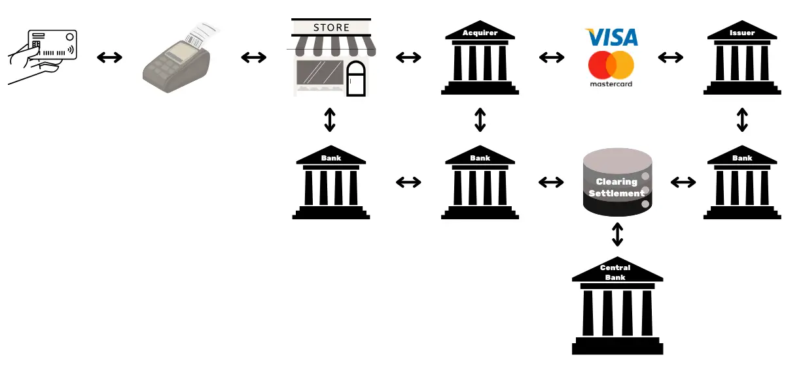

# Starten Sie die Reise Ihres Unternehmens in das Bitcoin-Netzwerk

Entdecken Sie die praktischen Möglichkeiten von Bitcoin und Lightning Network und erfahren Sie, wie sie - ähnlich wie das Internet - Ihre Geschäftsabläufe **umwandeln** können. Von digitalem Kapital bis hin zu schnellen, wirtschaftlichen und skalierbaren Zahlungen bietet Bitcoin ein breites Spektrum an **Anwendungsfällen für Unternehmen**.

In diesem Leitfaden erfahren Sie, wie Sie Bitcoin als globales, universelles und internetbasiertes Währungsnetzwerk verstehen können. Mit seinen einzigartigen grundlegenden Eigenschaften bietet **Bitcoin erhebliche Verbesserungen gegenüber traditionellen Währungsnetzwerken**. Sie werden herausfinden, warum und wie Sie Bitcoin für klassische Finanzanwendungen wie Kapitalspeicher und Zahlungssysteme nutzen können. Darüber hinaus behandelt dieser Leitfaden den Erwerb und das Halten von Bitcoin, einschließlich der damit verbundenen buchhalterischen und steuerlichen Anforderungen, sowie die Implementierung einfacher oder umfangreicher Bitcoin-Zahlungslösungen.

Egal ob Sie ein **kleines Unternehmen oder ein großer Konzern** sind, die Integration von Bitcoin in Ihre täglichen Abläufe kann Ihr Unternehmen **resilienter, produktiver und wettbewerbsfähiger** machen. Jedes internetbasierte Unternehmen wird ein Bitcoin-orientiertes Unternehmen werden, und dieser Kurs stellt sicher, dass Sie darauf vorbereitet sind. In den ersten Abschnitten werden die Grundlagen der Funktionsweise von Bitcoin rekapituliert, so dass Sie, auch wenn Sie Anfänger sind, das nötige Grundwissen erlangen, um weiterzumachen. Es ist immer eine gute Idee, die Grundlagen von Satoshis Erfindung zu lernen, ob vor oder nach dem Eintauchen in BIZ101.

+++
# Einführung

<partId>326cf945-5d3f-4d86-8c3e-4d1c35959799</partId>

## Ihr Unternehmen auf Bitcoin umstellen

<chapterId>1be42be9-4080-49f5-b5b2-6b531dd55f5f</chapterId>

Starten Sie die Reise Ihres Unternehmens in das Bitcoin-Netzwerk mit diesem umfassenden Trainingskurs - ein Tor zum Verständnis, wie Bitcoin und das Lightning Network die traditionellen Geschäftsabläufe revolutionieren können. Dieser Kurs richtet sich an Einzelhändler, Unternehmer, Manager und Entscheidungsträger in Unternehmen, die die praktischen Möglichkeiten von Bitcoin als globales, internetbasiertes monetäres Netzwerk und robustes Mittel des Wertaustauschs erkunden möchten.

Im Laufe des Kurses werden Sie mit den grundlegenden Prinzipien vertraut gemacht, die Bitcoin und das Lightning Network so einzigartig und transformativ machen. Sie werden lernen, wie diese Technologien ein Spektrum von Anwendungsfällen bieten, von der digitalen Kapitalspeicherung bis zu schnellen, wirtschaftlichen und skalierbaren Zahlungen, und wie sie entscheidende Verbesserungen gegenüber traditionellen Währungs- und Zahlungssystemen bieten. Der BIZ101-Kurs verbindet ökonomische Theorie mit realen Anwendungen und verdeutlicht, wie Dezentralisierung die Abhängigkeit von Zwischenhändlern reduzieren und die Einschränkungen bestehender Systeme überwinden kann.

Der Kurs beginnt mit einer detaillierten Untersuchung herkömmlicher Währungen und Zahlungsmechanismen, wobei die Grundlagen geschaffen werden, indem untersucht wird, wie Währungen als Netzwerk funktionieren, um Handel, Sparen und wirtschaftliche Spezialisierung zu ermöglichen. Anschließend werden wir uns mit der Technologie hinter Bitcoin und den vom Lightning Network eingeführten Innovationen befassen und ihre Rolle bei der Erleichterung nahtloser, sicherer und nahezu sofortiger Transaktionen aufzeigen, die Unternehmen jeder Größe dienen können. Dann werden wir in die praktischen Abschnitte dieses Kurses eintauchen, beginnend mit einem Teil über das Halten von Bitcoins als Zahlungsmittel, gefolgt von einem letzten Teil über die Annahme von Bitcoin als Zahlungsmittel.

Egal, ob Sie ein kleines Unternehmen oder einen großen Konzern vertreten, dieser Kurs zielt darauf ab, Sie mit dem Wissen auszustatten, das Sie benötigen, um Bitcoin in Ihre täglichen Abläufe zu integrieren und dadurch die Widerstandsfähigkeit, die Effizienz und den Wettbewerbsvorteil Ihres Unternehmens zu verbessern. Da Bitcoin weiterhin die wirtschaftliche Landschaft umgestalten wird, ist das Verständnis dieser bahnbrechenden Technologie nicht nur eine Option, sondern eine strategische Notwendigkeit. Bereiten Sie sich auf aufschlussreiche Inhalte, praktische Beispiele und strategische Anleitungen vor, die Sie in die Lage versetzen, die sich entwickelnde Welt des Bitcoin zu navigieren und zu nutzen!

# Währung, Zahlungssysteme und Bitcoin

<partId>d9bd0e21-8488-44e0-af55-6d0b934f83c2</partId>

## Traditionelle Währungen

<chapterId>785e095c-6811-4ca2-ba46-fe38291432d4</chapterId>

### Währungen sind Netzwerke

Währungen sind im Grunde genommen Netzwerke, die einen effizienten Austausch von Werten ermöglichen.

Ohne Währung sind die Menschen auf den **Tauschhandel** angewiesen, ein System, bei dem Waren oder Dienstleistungen direkt ausgetauscht werden. Der Tauschhandel ist unpraktisch, weil er ein "doppeltes Zusammentreffen von Bedürfnissen" erfordert - beide Parteien müssen das, was die andere Partei anbietet, zur gleichen Zeit wollen. Wenn beispielsweise ein Bauer mit einem Weizenüberschuss Schuhe haben möchte, muss er einen Schuhmacher finden, der speziell Weizen benötigt. Dies ist selten und ineffizient. Hinzu kommt, dass **bei n Produkten in einer Tauschwirtschaft ~n(n-1)/2 Wechselkurse erforderlich sind**, was ein äußerst komplexes und schwerfälliges System ergibt. So wären zum Beispiel über ~124.000 Wechselkurse für nur 500 Produkte erforderlich.

Die Währung vereinfacht dies, indem sie als Vermittler fungiert, indem sie **ein Netzwerk schafft, das die Anzahl der Wechselkurse auf n** reduziert - einen für jedes Produkt in Bezug auf die Währung. Dies macht Transaktionen viel einfacher und **ermöglicht es den Menschen, Waren und Dienstleistungen zu tauschen, ohne gleichzeitig ein gegenseitiges Wollen zu verlangen**. Anstatt Weizen direkt gegen Schuhe zu tauschen, kann der Bauer seinen Weizen gegen Währung verkaufen und diese Währung später zum Kauf von Schuhen oder allem anderen, was er braucht, verwenden.

Die Einführung der Währung als Netzwerk erleichtert nicht nur den Handel, sondern ermöglicht auch die **Arbeitsteilung und Spezialisierung**. Mit einem zuverlässigen Tauschmittel müssen Individuen und Gemeinschaften nicht mehr alles produzieren, was sie konsumieren. Stattdessen können sie sich auf das konzentrieren, was sie am besten können, und so Effizienz und Qualität steigern. Ein Bauer kann sich auf den Anbau von Feldfrüchten spezialisieren, ein Schuhmacher auf die Herstellung von Schuhen und ein Bauunternehmer auf den Bau von Häusern. Diese Spezialisten können dann ihre Waren und Dienstleistungen mit Hilfe einer Währung austauschen und so von den Kenntnissen der anderen profitieren. Diese Spezialisierung fördert **Produktivität und Innovation**, da die Menschen ihre Fähigkeiten verfeinern und neue Methoden in ihren jeweiligen Bereichen entwickeln.

Der Netzwerkcharakter der Währung bringt weitere bedeutende Vorteile mit sich. Erstens ist es **vorteilhafter, Teil des Währungsnetzes zu sein als außerhalb**. Der gemeinsame Standard des Netzwerks erleichtert den Handel und ermöglicht es den Menschen, ihre wirtschaftlichen Aktivitäten auch **über große Entfernungen hinweg** zu koordinieren. So kann beispielsweise ein Händler in einer Stadt mit einem Käufer in einer anderen Stadt mit der gleichen Währung handeln, was das Wirtschaftswachstum und die Zusammenarbeit in großen Regionen fördert.

Ein weiterer entscheidender Vorteil der Währung ist ihre Fähigkeit, einen **aufgeschobenen Tausch** zu ermöglichen. Bei Tauschgeschäften finden Transaktionen sofort statt; eine Ware wird in Echtzeit gegen eine andere getauscht. Währungen hingegen ermöglichen **Sparen - Einzelpersonen können Werte für die zukünftige Verwendung speichern**. Dies stellt einen großen Fortschritt für die wirtschaftliche Planung, die Investition und die Vermögensbildung dar, die allesamt das Leben der Netzwerkteilnehmer verbessern.

Zusammenfassend lässt sich sagen, dass Währungen Netzwerke sind, die einen effizienten Werteaustausch ermöglichen. Sie überwinden die Grenzen des Tauschhandels, vereinfachen den Handel und schaffen Möglichkeiten zur Koordinierung und zum Sparen. Wie bei jedem Netzwerk hängt der Wert einer Währung davon ab, wie weit sie verbreitet ist und welchen Nutzen sie hat - letztendlich gewinnt die beste Währung.

### Was ist eine gute Währung?

Eine gute Währung verfügt über mehrere wesentliche Eigenschaften, die den Austausch von Werten erleichtern. Hier ist eine kurze Erläuterung der einzelnen Eigenschaften:

- Sicher**: Eine Währung muss vor Diebstahl oder unbefugtem Zugriff geschützt sein, damit die Benutzer sie vertrauensvoll halten und übertragen können. Sicherheit ist entscheidend, um Vertrauen in das System zu schaffen.
- Fälschungssicher**: Eine Währung muss extrem schwierig oder unmöglich zu fälschen sein. Dadurch wird sichergestellt, dass jede Einheit authentisch ist, ihren Wert behält und keine Inflation durch gefälschte Einheiten in Umlauf kommt. Gold zum Beispiel wurde in der Vergangenheit nicht nur wegen seiner Schönheit und Seltenheit geschätzt, sondern auch, weil es extrem schwer herzustellen ist. Im Gegensatz zu Papierscheinen oder digitalen Einträgen kann man Gold nicht einfach "herstellen" - es muss aus der Erde gefördert werden. Diese natürliche Knappheit und die Schwierigkeit der Herstellung haben dazu beigetragen, dass Gold seinen Status als vertrauenswürdiges Wertaufbewahrungsmittel und als Maßstab für Authentizität beibehalten hat.
- Knapp**: Eine gute Währung muss ein begrenztes Angebot oder eine kontrollierte Ausgabe haben. Knappheit stellt sicher, dass ihr Wert im Laufe der Zeit erhalten bleibt und verhindert eine Überproduktion, die die Kaufkraft schwächen würde. Bestimmte Indianerstämme verwendeten zum Beispiel Perlen als Zahlungsmittel. Ursprünglich waren diese Perlen schwer zu produzieren, wodurch ihre Knappheit und ihr Wert erhalten blieben. Als jedoch europäische Händler mit der Massenproduktion begannen und den Markt mit Perlen überschwemmten, schwand ihre Seltenheit. Als das Angebot in die Höhe schoss, verloren die Perlen ihre Kaufkraft und untergruben ihre Rolle als zuverlässiges Wertaufbewahrungsmittel.
- Genehmigungsfrei**: In der Vergangenheit wurden Währungen wie Gold- und Silbermünzen häufig von Privatpersonen, lokalen Behörden oder Kaufleuten geprägt, die Zugang zu den Rohstoffen hatten. Dieses System funktionierte manchmal auf der Grundlage von Vereinbarungen oder Lizenzen, die von Königen oder Herrschern erteilt wurden. Mit der Zeit zentralisierten Könige und Regierungen diesen Prozess, um eine größere Kontrolle über die wirtschaftliche Stabilität, die Besteuerung und das Geldsystem zu erlangen. Ein berühmtes Beispiel ist der **Taler**, eine Silbermünze, die erstmals 1518 im **Joachimsthaler Tal** (dem heutigen Jáchymov in der Tschechischen Republik) von örtlichen Bergleuten und Behörden geprägt wurde. Der Name "Taler" leitet sich von dem deutschen Wort **"Thal "** ab, das "Tal" bedeutet Diese Münzen, die für ihr hochwertiges Silber bekannt waren, gelangten in ganz Europa in Umlauf. Im Laufe der Zeit entwickelte sich der Begriff sprachlich und geografisch weiter und führte schließlich zu der Bezeichnung "Dollar", die in den Vereinigten Staaten für die dortige Währung übernommen wurde.

In der Neuzeit wurden die Währungen im Rahmen des Seigniorage-Systems vollständig genehmigt, d. h. nur zugelassene Stellen - wie Zentralbanken oder Finanzministerien - konnten Münzen prägen oder Banknoten drucken. Privatpersonen ist es nicht mehr erlaubt, Geld zu produzieren, wodurch eine zentrale Kontrolle über die Ausgabe und das Angebot gewährleistet ist.

Heute wird das Prinzip der Seigniorage durch die Kryptowährung Bitcoin in Frage gestellt, die ohne zentralisierte Kontrolle funktioniert. Bitcoin ist ein "erlaubnisfreies" System, bei dem sich jeder an der Verwendung der Währung beteiligen kann, ohne um Erlaubnis zu fragen, und durch Mining auch an ihrer Schaffung. Diese Dezentralisierung entzieht den Regierungen das Emissionsmonopol und wirft Fragen nach einer möglichen Rückkehr zu wettbewerbsfähigen Währungssystemen auf dem freien Markt auf.

- Rechnungseinheit**: Eine Währung sollte ein Standardmaß für den Vergleich des Wertes von Waren und Dienstleistungen bieten. Dies vereinfacht den Handel und macht die Preisbildung bei allen Transaktionen transparent und einheitlich.
- Langlebig**: Eine Währung muss im Laufe der Zeit Verschleißerscheinungen widerstehen. Physische Währungen wie Münzen oder Banknoten sollten unbeschädigt bleiben, während digitale Währungen sicher und ohne das Risiko eines Datenverlusts aufbewahrt werden müssen.
- Tragbar**: Eine Währung muss leicht zu transportieren und zu verwenden sein, um den Handel über Entfernungen hinweg zu ermöglichen. Dies kann durch physische Portabilität (leichte Münzen oder Banknoten) oder digitale Transfersysteme erreicht werden.
- Teilbar**: Eine Währung sollte in kleinere Einheiten teilbar sein, um Transaktionen unterschiedlicher Größe zu erleichtern. Diese Flexibilität gewährleistet, dass sie sowohl für kleine Käufe als auch für den Handel in großem Umfang geeignet ist.
- Fungibel**: Alle Einheiten einer Währung müssen austauschbar und von gleichem Wert sein. Zum Beispiel muss ein Dollarschein jedem anderen Dollarschein gleichwertig sein. Diese Einheitlichkeit gewährleistet Fairness und Einfachheit bei Transaktionen.
- Erkennbar**: Eine Währung muss leicht identifizierbar und vertrauenswürdig sein. Physische Währungen erreichen dies durch einzigartige Designs und Sicherheitsmerkmale, während digitale Währungen auf Verifizierungsprotokollen beruhen können. Dies gewährleistet eine breite Akzeptanz und verringert das Betrugsrisiko.

Diese Eigenschaften machen eine Währung praktisch, zuverlässig und effizient für die Erleichterung des Handels und die Wertaufbewahrung in einer Volkswirtschaft.

### Entwicklung der Währungssysteme

**Von Münzen zu Papiergeld: Steigerung von Effizienz und Portabilität**

Der Übergang von Münzen zu Papiergeld bedeutete eine erhebliche Verbesserung der **Portabilität** und Effizienz. Münzen, die aus Edelmetallen wie Gold oder Silber hergestellt wurden, waren aufgrund ihres Eigenwerts wertvoll. Sie waren jedoch schwer, ließen sich nur schwer in großen Mengen transportieren und waren anfällig für Verschleiß oder Diebstahl. Papiergeld revolutionierte die Währungssysteme, indem es ein leichtes, standardisiertes und tragbares Medium einführte, das den Wert repräsentierte, anstatt ihn zu enthalten. Diese Innovation ermöglichte es den Volkswirtschaften, sich zu vergrößern, indem sie den Handel über große Entfernungen erleichterte und die logistischen Herausforderungen reduzierte, die mit der Verwendung von physischen Gütern als Geld verbunden waren.

Papiergeld verbesserte auch die Skalierbarkeit. Anstatt sich auf den begrenzten Vorrat an Edelmetallen zu verlassen, konnten die Volkswirtschaften ihre Geldbasis durch repräsentative Währungen ausweiten, die zunächst durch Reserven und später durch das Vertrauen in die ausgebenden Institutionen gedeckt waren. Dieser Wandel ebnete den Weg für komplexere und besser vernetzte Finanzsysteme.

**Vom Papier zum elektronischen Geld: Mehr Zugänglichkeit und Schnelligkeit**

Die Umstellung von Papiergeld auf elektronisches Geld verbesserte das Währungsnetzwerk weiter, indem es die Zugänglichkeit und Geschwindigkeit erhöhte. Mit dem Aufkommen von Bankensystemen, Kreditkarten und digitalen Transaktionen wurde Geld nicht nur **tragbar**, sondern fast **sofort**. Elektronische Überweisungen machten den physischen Austausch überflüssig, so dass Transaktionen über große Entfernungen hinweg in Sekundenschnelle erfolgen konnten.

Dieser Wandel hat auch den Zugang zum Geld demokratisiert. Elektronische Bank- und Zahlungssysteme verringerten die Zugangshürden für Privatpersonen und Unternehmen und ermöglichten die Teilnahme an der Weltwirtschaft. Die Schnelligkeit und der Komfort des elektronischen Geldes erweiterten die Handelsnetze und förderten neue Geschäftsmodelle, die in einem papierbasierten System unmöglich gewesen wären.

Diese modernen Währungsnetzwerke hatten einen erheblichen Nachteil: **mangelnde Überprüfbarkeit und Transparenz bei der Verwaltung der Geldmenge**, was häufig zu unkontrollierter Inflation und einem Vertrauensverlust in zentralisierte Systeme führte. So wurden beispielsweise allein in den letzten vier Jahren mehr als 20 % aller im Umlauf befindlichen US-Dollars gedruckt. Diese ständige Versuchung, mehr Geld auszugeben und damit den Wert der derzeitigen Inhaber zu entwerten, ist größtenteils auf einen systemischen Fehler zurückzuführen: Politiker haben oft einen Anreiz, schwierige Haushaltsentscheidungen zu vermeiden und stattdessen die Herausforderungen auf künftige Regierungen zu verschieben, indem sie "die Dinge auf die lange Bank schieben"

**Von zentraler zu dezentraler Währung: Stärkung von Vertrauen und Souveränität**

Das Aufkommen der dezentralen Währung Bitcoin stellt heute den nächsten Sprung in Währungsnetzwerken dar. Traditionelles elektronisches Geld stützt sich auf zentralisierte Behörden wie Banken oder Regierungen, um Transaktionen zu verwalten und zu überprüfen. Diese Systeme sind zwar effektiv, aber anfällig für Ineffizienzen, Zensur und einzelne Fehlerquellen. Dezentralisierte Währungen verbessern diese Netzwerkeigenschaften, indem sie **Vertrauen verbreiten und Vermittler ausschalten**. Das bedeutet auch, dass Geld viel **schneller** und **billiger** bewegt werden kann, da es keine Genehmigungsschritte gibt. Schließlich kann kein Mensch versucht sein, den Zeitplan für die Bitcoin-Währung zu ändern, sondern die Software ist dazu gezwungen.

In dezentralen Systemen werden Transaktionen von einem globalen Netzwerk von Teilnehmern mithilfe der Blockchain-Technologie überprüft, was Sicherheit, Transparenz und Widerstandsfähigkeit gewährleistet. Diese Struktur minimiert das Betrugsrisiko, verringert die Abhängigkeit von zentralen Behörden und gibt dem Einzelnen eine größere Kontrolle über seine Finanzen. Durch die Beseitigung geografischer und institutioneller Barrieren bieten dezentralisierte Währungen ein wahrhaft globales und integratives Geldsystem.

**Die Entwicklung von Währungsnetzwerken**

In jeder Phase der Entwicklung von Währungsnetzwerken wurden wichtige Eigenschaften verbessert: Übertragbarkeit, Skalierbarkeit, Zugänglichkeit, Geschwindigkeit, Sicherheit und Vertrauen. Aus Gründen der besseren Übertragbarkeit und Effizienz wurden Münzen durch Papiergeld ersetzt. Aus Papier wurde elektronisches Geld, das weltweiten Zugang und sofortige Transaktionen ermöglichte. Jetzt definiert Bitcoin Vertrauen und Sicherheit neu und schafft ein offenes und widerstandsfähiges Geldsystem. Diese historische Entwicklung verdeutlicht das ständige Bestreben der Menschheit, bessere Netzwerke für den Austausch von Werten zu schaffen, wobei jede Iteration auf den Grenzen der vorherigen aufbaut und diese übertrifft.

Das beste Netzwerk wird wahrscheinlich gewinnen.

## Traditionelle Zahlungssysteme

<chapterId>1306196c-1e8a-454b-8e11-6887ecb3d8b4</chapterId>

Zahlungssysteme sind Methoden und Infrastrukturen, die den Geldtransfer zwischen zwei Parteien ermöglichen - in der Regel zwischen einem Zahler (z. B. einem Verbraucher) und einem Zahlungsempfänger (z. B. einem Unternehmen). Diese Transaktionen können in verschiedenen Situationen stattfinden: ein Verbraucher, der einen lokalen Händler bezahlt, ein Unternehmen, das Rechnungen mit einem Lieferanten begleicht, oder sogar Einzelpersonen, die sich gegenseitig Geld überweisen. Zum Verständnis von Zahlungssystemen gehört es, die verschiedenen Arten von Zahlungsmethoden, ihre Merkmale und ihre Anwendungsfälle sowohl im Business-to-Consumer (B2C)- als auch im Business-to-Business (B2B)-Kontext zu untersuchen.

### Gängige Arten von Zahlungsmethoden

1. **Bargeld:** Physische Währung, die direkt zwischen zwei Parteien ausgetauscht wird.

2. **Schecks:** Papierdokumente, die eine Bank anweisen, einen bestimmten Betrag vom Konto des Zahlers an den Zahlungsempfänger zu zahlen.

3. **Drahtüberweisung:** Elektronische Überweisung von Geldern zwischen Banken, die häufig für größere Beträge und grenzüberschreitende Zahlungen verwendet wird.

4. **Zahlungskarten (Kredit-/Debitkarten):** Plastikkarten oder digitale Karten, die an ein Kartennetz angeschlossen sind und die Überweisung von Geldern vom Bankkonto (oder Kreditrahmen) des Karteninhabers an einen Händler ermöglichen.

5. **Digitale Geldbörsen und mobile Zahlungen:** Anwendungen oder Geräte, die Zahlungsinformationen speichern (z. B. Apple Pay, WeChatPay, AliPay, PayPal), ermöglichen schnelle und oft kontaktlose Überweisungen.

**Verwendung im B2C- und B2B-Bereich:**

- B2C (Business-to-Consumer):**
    - Die Verbraucher verwenden häufig Bargeld, Karten und digitale Geldbörsen für alltägliche Einkäufe, z. B. für Lebensmittel, Online-Shopping oder Dienstleistungen wie Ride-Hailing.
    - Schnelligkeit, Bequemlichkeit und niedrige Gebühren (für den Verbraucher) sind oft die wichtigsten Prioritäten.
    - Kontaktlose und mobile Zahlungen werden in diesem Bereich aufgrund ihrer Benutzerfreundlichkeit immer beliebter.
- B2B (Business-to-Business):**
    - Unternehmen verlassen sich bei der Bezahlung von Lieferanten, der Begleichung großer Rechnungen oder der Abwicklung wiederkehrender Zahlungen in der Regel auf Überweisungen, Schecks und Rechnungsstellungssysteme.
    - Der Schwerpunkt liegt häufig auf der Rückverfolgbarkeit, der Dokumentation und der Fähigkeit, größere Transaktionswerte zu verarbeiten.
    - Die Verwendung von Karten ist zwar vorhanden, aber aufgrund höherer Gebühren und Transaktionslimits tendenziell weniger verbreitet. Digitale Lösungen wie integrierte Zahlungsplattformen sind auf dem Vormarsch, um Debitoren- und Kreditorenprozesse zu rationalisieren und zu automatisieren.

*Grafik: Globale Trends bei Point-of-Sale (POS) Zahlungsmethoden (2023-2027), The Global Payments Report 2024, Worldpay.*

### Die Komplexität hinter einer einfachen Kartenzahlung

Wenn ein Kunde in einem Geschäft eine Kreditkarte benutzt, wird die Karte vom POS-Terminal gelesen, das die Transaktionsdaten sicher an die Acquiring-Bank des Händlers übermittelt. Der Acquirer leitet diese Informationen an das entsprechende Kartennetz (z. B. Visa oder Mastercard) weiter, das die Anfrage dann an den Aussteller weiterleitet - die Bank, die die Karte des Kunden ausgegeben hat. Der Issuer prüft das Konto oder den Kreditrahmen des Kunden und sendet über das Netzwerk und den Acquirer eine Autorisierung zurück, die es dem Händler ermöglicht, die Zahlung anzunehmen.

Diese scheinbar einfache Transaktion umfasst in Wirklichkeit mehr als 15 Schritte, 7 Vermittler und es dauert im Durchschnitt zwischen 48 Stunden und 5 Tagen, bis der Händler das Geld erhält. In den folgenden Tagen findet ein Clearing- und Abrechnungsprozess statt. Das Kartennetz fasst die Transaktionen des Tages zusammen und koordiniert den Geldaustausch zwischen dem Acquirer und dem Emittenten. Eine Zentralbank sorgt für die Genauigkeit und Stabilität dieser Interbankenabrechnungen. Schließlich erhält das Bankkonto des Händlers den Nettobetrag (abzüglich der Gebühren) vom Acquirer gutgeschrieben, womit der Lebenszyklus der Transaktion abgeschlossen ist.

Insgesamt ist dieser Prozess kompliziert, zeitaufwändig und kostspielig für etwas, das eigentlich ein einfacher Akt der Wertübertragung von einer Partei zur anderen sein sollte.

### Vergleich der Zahlungsarten

| Zahlungsmethode | Autorisierung erforderlich?           | Dauer der Transaktionsgenehmigung (Händlersicht) | Abwicklungsgeschwindigkeit (Mittel vollständig abgewickelt) | Endgültigkeit (Einfachheit der Rückabwicklung) | Anzahl der Vermittler | Typische Gebühren (für den Zahlungsempfänger) |

| ------------------------------ | ------------------------------- | ----------------------------------------- | ---------------------------------------------- | ---------------------------------------- | ------------------------------ | ---------------------------------- |

**Bargeld** | Nein | Sofort (physischer Austausch) | Sofort (keine Abwicklungsverzögerung) | Hoch (unwiderruflich nach Zahlung) | Keine | Keine |

**Schecks** | Ja (Bank-Clearing) | Annahme bei Einreichung (nicht garantiert) | Mehrere Tage (Scheck-Clearing-Prozess) | Mittel (kann vor dem Clearing platzen/stoppen) | Bank | **gering bis mittel** (Bankgebühren) |

| **Drahtüberweisungen** | Ja (Bank/Netzwerk) | Bestätigung innerhalb von Stunden | Am selben Tag oder am nächsten Tag (Inland) | Hoch (in der Regel nicht mehr rückgängig zu machen, sobald sie gesendet wurden) | Banken, Zahlungsnetzwerke | **Mittel**(Festbetrag/Prozentsatz) |

| **Zahlungskarten** | Ja (Autorisierung durch den Kartenaussteller) | Sekunden bis Minuten (Autorisierungscode) | Einige Tage (Interbank-Abwicklung) | Mittel (Rückbuchungen möglich) | Aussteller, Acquirer, Kartennetz | **Variabel (1-3% der Transaktion)** |

| **Digitale Geldbörsen/Mobile Pay** | Ja (Wallet-Anbieter/Bank) | Sekunden (Sofortbestätigung) | Normalerweise 1-2 Tage (abhängig von der Finanzierungsquelle) | Mittel (Rückerstattung/Streitfall möglich) | Banken, Wallet-Betreiber | **Niedrig bis mittel (variiert)** |

### Beschränkungen der bestehenden Lösungen

Die traditionelle Zahlungsverkehrsbranche repräsentiert ein jährliches Wirtschaftsvolumen von etwa 2.200 Milliarden Dollar, was etwa einem Zehntel des BIP der Vereinigten Staaten oder dem BIP Frankreichs entspricht. Da Währungen als zugelassene Netzwerke funktionieren, gibt es nur einen begrenzten Wettbewerb, so dass diese "Dienstleistung" eher einer Steuer ähnelt, die der produktiven Wirtschaft auferlegt wird. Zusätzlich zu den Kosten, die dadurch entstehen, gibt es mehrere andere Einschränkungen, die im Folgenden erläutert werden.

| Einschränkung | Erläuterung | Auswirkungen |

| -------------------------------- | ---------------------------------------------------------------------------------------------------------------------------------------------------------------------------------------------------------------------------------- | ---------------------------------------------------------------------------------------------------- |

| Hohe Kartengebühren | Interbankenentgelte (~0,3 %), Netzwerkgebühren (fest oder 0,3 %-1 %), Terminal-/PSP-Abonnements und Bankmargen (0,5 %-1,7 %) summieren sich zu erheblichen Kosten - wie eine globale "Steuer" auf produktive Sektoren, die sich auf Billionen von Dollar beläuft.     | Erhöht die Kosten der Händler, verringert die Gewinnspannen und kann die Verbraucherpreise in die Höhe treiben.                  |

| Sehr langsame Endabrechnung | Die Abrechnung von Geldern kann bis zu 5 Tage dauern, was den Geldfluss und die Wirtschaftstätigkeit insgesamt verlangsamt.                                                                                                                                | Verzögert die Liquidität für Händler und verringert die Geschwindigkeit des Wirtschaftskreislaufs.                        |

| Betrug | E-Commerce-Kanäle sind stark von Betrug betroffen und tragen zu erheblichen Verlusten bei (z. B. 28 Mrd. USD). Rückbuchungen könnten bis 2024 weltweit ein Volumen von 174 Milliarden Dollar erreichen. Die Bewältigung dieser Streitigkeiten kostet Zeit und verursacht psychische Belastungen. | Erhöhte Betriebskosten, komplexe Maßnahmen zur Betrugsprävention und geschwächtes Kundenvertrauen.       |

| Zusätzliche Sicherheitsschritte (Einmalcodes, Zwei-Faktor-Authentifizierung gemäß PSD2) führen zu Reibungsverlusten beim Checkout.                                                                                                                   | Höhere Komplexität der Kaufabwicklung führt zu mehr Kaufabbrüchen und Umsatzverlusten.                       |

| Hohe Mindesttransaktionsbeträge | Mindestausgabenschwellen auf Karten können Händler und Verbraucher zu ungünstigen Preis- oder Kaufbedingungen zwingen und so von Transaktionen mit geringem Wert abhalten.                                                                       | Geringere Kundenzufriedenheit und Flexibilität, was Impulskäufe oder Käufe von geringem Wert einschränken kann.  |

| Langsame Vorautorisierung | Aktuelle Systeme können Transaktionen nicht im Millisekundenbereich verarbeiten oder kontinuierliche Zahlungsströme in Echtzeit unterstützen.                                                                                                                   | Dies schränkt Anwendungsfälle ein, die sofortige oder laufende Zahlungen erfordern, was Innovation und Skalierbarkeit einschränkt. |

| Notwendigkeit eines Bank-/Kartenkontos | Der Zugang zu diesen Zahlungsmethoden erfordert ein verbundenes Bank- oder Kartenkonto, wodurch Personen ohne ein solches Konto automatisch ausgeschlossen werden.                                                                                                       | Schränkt die finanzielle Eingliederung ein und verringert den Zugang für Bevölkerungsgruppen, die keine oder nur wenige Bankkonten haben.                 |

| Wiederholte Erstellung von Online-Konten | Benutzer müssen oft mehrere Online-Konten erstellen, was zu Ermüdung, geringerem Komfort und einer erhöhten Offenlegung persönlicher Daten führt.                                                                                                | Verschlechtert die Nutzererfahrung, erhöht die Bedenken hinsichtlich des Datenschutzes und das Risiko von Datenschutzverletzungen.          |

| Das Fehlen einer universellen Rechnungseinheit erzwingt kostspielige Währungsumrechnungen bei grenzüberschreitenden Transaktionen.                                                                                                                              | Erhöht die Kosten für den internationalen Handel und macht globale Transaktionen weniger erschwinglich.             |

So wie wir von der minutengenauen Abrechnung von Telefongesprächen zur nahezu kostenlosen IP-basierten Kommunikation übergegangen sind, kann das Entstehen offenerer und effizienterer Netze den Zahlungsverkehr neu definieren, Kosten und Vermittler reduzieren und neue Geschäftsmodelle fördern.

## Bitcoin für Unternehmen: eine neue Währung

<chapterId>4488fe33-663f-41a3-a668-e9ca2fb7122e</chapterId>

**WAS IST BITCOIN?**

Bitcoin ist ein **Peer-to-Peer-Tauschsystem für digitale Währungen** (elektronisches Bargeld). Der Begriff "Bitcoin" bezieht sich auf die folgenden Komponenten:

- Ein Computerprotokoll**, das den Austausch von Werten im Internet ohne Vermittler, ohne Genehmigungspflicht und auf pseudonyme Weise ermöglicht. Es nutzt fortschrittliche kryptografische Prinzipien.
- Ein physisches Netzwerk** von Maschinen, die mit dem Internet verbunden sind (Nodes, Miner usw.) und von Privatpersonen und Unternehmen betrieben werden, die ein dezentrales System bilden (ohne zentrale Autorität oder einen einzigen Kontrollpunkt).
- Die Recheneinheit** innerhalb des Systems. Es wird nie mehr als 21 Millionen Bitcoins geben. Jeder Bitcoin ist in 100 Millionen Einheiten teilbar, die "Satoshis" genannt werden, benannt zu Ehren seines anonymen Schöpfers.

Zusammen machen sie Bitcoin zu einem **Vermögenswert auf Inhaberbasis** und einer digitalen Währung **ohne Emittent**. Das Eigentum wird allein durch den Besitz des **privaten kryptografischen Schlüssels** gesichert, der die volle Kontrolle **ohne Vermittler oder vertrauenswürdige Dritte** gewährt. Bei einer Übertragung geht das Eigentum **unmittelbar** über: Der neue Inhaber besitzt es vollständig, ohne sich zum Schutz oder zur Konvertierbarkeit auf eine zentrale Behörde verlassen zu müssen. Transaktionen sind **unveränderlich** - sobald sie in der Blockchain aufgezeichnet sind, können sie nicht mehr geändert oder gelöscht werden.

Bitcoin hat eine feste Geldpolitik, mit einer **Kapazität von 21 Millionen Bitcoins**, von denen ~19,8 Millionen bereits verteilt worden sind. Dies macht ihn **deflationär**, wobei sein Wert im Laufe der Zeit steigt, da die Nutzer Ersparnisse und Produktivitätsgewinne in ihm speichern.

Seine technischen Eigenschaften übertreffen die von Gold und dem Dollar zusammen und machen ihn zum härtesten Finanzwert, der je geschaffen wurde. Bitcoin ist sowohl ein Wertaufbewahrungsmittel als auch ein Tauschmittel, eine Währung im Entstehen. Stellen Sie sich vor, Sie könnten schnell, ohne Vermittler, zu minimalen Kosten, ohne Betrug, rund um die Uhr und ohne Beteiligung Dritter Werte aus der Kasse eines Unternehmens in eine andere transferieren.

Bitcoin ist effektiv wertbeständig, da sein Hauptbuch fälschungssicher ist. Sein Wert steigt aufgrund des seltenen und begrenzten Angebots in Verbindung mit der wachsenden Zahl von Tauschmöglichkeiten, die durch die steigende Zahl von Nutzern bedingt sind.

Bitcoin ist bahnbrechend, weil er uns dazu anregt, Konzepte in den Bereichen Mathematik, Kryptographie, Wirtschaft und Geschichte zu lernen, die uns nie beigebracht wurden. Obwohl er oft als komplex wahrgenommen wird, ist er in Wirklichkeit eine Innovation, die durch Übung und Experimentieren zugänglich ist.

Bitcoin fordert uns heraus, die Natur des Geldes selbst zu überdenken. Könnten Sie erklären, was Geld wirklich ist? Ein Angestellter oder Unternehmer verbringt vielleicht 50.000 bis 100.000 Stunden seines Lebens damit, Geld zu verdienen, aber wie viele **wenden auch nur 100 Stunden auf, um es besser zu verstehen** und zu bewahren? Bitcoin ermutigt uns, die grundlegenden Gründe für unser Bedürfnis nach Geld und unsere zeitliche Perspektive zu hinterfragen. Dient Geld dem sofortigen Luxus oder der langfristigen Beständigkeit? Wenn wir einen wertsteigernden Vermögenswert hätten, der uns erlaubt, Käufe aufzuschieben, welche Entscheidungen würden wir dann treffen? Welche Gespräche würden wir mit uns selbst in 20 oder 30 Jahren führen wollen?

**BITCOIN-AUSWEIS**

- Alter:** 15 Jahre (3. Januar 2009)
- Täglicher Börsenwert:** $10 Milliarden (> CAC40)
- Marktkapitalisierung:** 1,8 Billionen Dollar (> Meta, Visa, Silber ; < Apple, Google, Gold)
- Nutzer:** ~100 bis 200 Millionen (1-2% der Weltbevölkerung)
- Volatilität:** Innerlich keine (1 Bitcoin = 1 Bitcoin), äußerlich sehr hoch (in Fiat-Währungsbörsen)
- Performance:** Erste Transaktion zu $0,0009; jetzt $100.000 (x100 Millionen)
- Netzwerkverfügbarkeit (Betriebszeit):** 100% seit 2013
- Für tot erklärt oder kritisiert:** Einmal im Monat

**Ein Wunder menschlicher Zusammenarbeit:**

- Vollständig **Open-Source**
- Rechtsperson:** Keine
- CEO:** Keine
- Risikokapitalinvestitionen:** Keine
- Marketing:** Keine
- F&E:** Ehrenamtlich betrieben
- Governance:** Durch die Nutzer
- Innovatives Wirtschaftsmodell:** Die Blockerstellung wird durch Transaktionsgebühren subventioniert (auktionsbasiert)

Für weitere Informationen über Bitcoin, seine Geschichte, seine Funktionsweise und seine Verwendung empfehle ich auch diesen anderen umfassenden Kurs:

https://planb.network/courses/2b7dc507-81e3-4b70-88e6-41ed44239966
## Einführung in das Lightning Network

<chapterId>c095c7ad-5469-4c7b-9510-b6c0b86244e7</chapterId>

**WAS IST EIN BLITZ?*

Das Lightning Network ist **ein Protokoll und ein Netzwerk**, das Bitcoin-Transaktionen mit minimaler Interaktion mit der Haupt-Blockchain von Bitcoin ermöglicht. Hier ist, wie es funktioniert:

- Ersteinrichtung:** Gelder werden auf der Hauptblockchain gesperrt (escrowed), um einen Zahlungskanal zwischen 2 Parteien zu etablieren.
- Zahlungsnetz:** Ein Netz von Zahlungskanälen zwischen mehreren Parteien bildet ein Zahlungsnetz (Weiterleitung und Zusammenschaltung).
- Off-Chain-Transaktionen:** Transaktionen finden zwischen Parteien statt, werden aber **nicht sofort** auf der Haupt-Blockchain von Bitcoin veröffentlicht (**"off-chain "**).
- On-Chain-Abrechnungen:** Nur der **Endsaldo** der Transaktionen eines Kanals wird auf der Bitcoin-Hauptblockchain (**"on-chain**") veröffentlicht, so dass in der Zwischenzeit zahlreiche Transaktionen stattfinden können. Diese Bündelung mehrerer Zahlungen verringert die Überlastung und senkt somit die Gebühren im Vergleich zu vielen On-Chain-Transaktionen.
- Kanalschließung:** Ein Nutzer kann seinen Kanal jederzeit schließen und seine Bitcoin zurückfordern, indem er den letzten Transaktionsstatus veröffentlicht. Dies ist das Prinzip von Transaktionen, die jederzeit **"veröffentlicht" werden können, aber "unveröffentlicht "** sind, bis sie benötigt werden. Der Ausstieg (Kanalschließung) kann einseitig (von einer der beiden Parteien jederzeit entschieden) oder einvernehmlich erfolgen (was zu niedrigeren On-Chain-Gebühren führt)

Dieser Ansatz vermeidet die Langsamkeit und Komplexität der Durchführung jeder Transaktion direkt auf der Bitcoin-Hauptblockchain, indem er nur die endgültigen Salden aufzeichnet und seine Sicherheit beibehält. Das Lightning Network ist eine Schicht "on top" von Bitcoin, bleibt aber mit diesem verankert.

**Ein globales Zahlungsnetzwerk**

Das Protokoll schafft ein **Netzwerk** von Maschinen, deren Kanäle ein universelles Zahlungssystem bilden. Diese Knotenpunkte können von Privatpersonen oder Unternehmen frei betrieben werden, so dass es sich um ein völlig offenes Netz handelt.

Das Lightning Network ermöglicht den sofortigen Austausch von Werten in Lichtgeschwindigkeit. Es ist wie ein E-Mail-Protokoll, das auf Zahlungen angewendet wird: ein Zahlungsnetzwerk der nächsten Generation. Es verändert die Art und Weise, wie "Geld" bewegt wird, radikal und macht es so kostenlos und schnell wie die Datenübertragung im Internet.

**Schlüsselvorteile:**

- Geschwindigkeit:** Sofortige Transaktionen.
- Niedrige Gebühren:** Viel niedrigere Kosten im Vergleich zu traditionellen Bankennetzen.
- Einfache Einführung:** Unternehmen können Lightning-Zahlungen schnell einrichten, indem sie einfach eine Smartphone-App oder eine Bezahlfunktion auf ihrer Website verwenden.

Die Lightning-Infrastruktur übertrifft herkömmliche Zahlungssysteme in Bezug auf Geschwindigkeit, Kosten und Energieeffizienz. Mit zunehmender Akzeptanz durch die Händler wird sich die Dynamik beschleunigen: Wenn Zahlungen das firmeneigene Interbanken-Netzwerk umgehen können, warum sollte man dann weiterhin einen erheblichen Prozentsatz der Einnahmen an die heutigen Intermediäre abgeben?

**Unendliche Anwendungsfälle:**

Die Anwendungsmöglichkeiten von Lightning gehen weit über niedrige Gebühren und Schnelligkeit hinaus. Durch das Angebot einer völlig kostenlosen und sofortigen Zahlungsschiene eröffnet es der gesamten Wirtschaft enorme Möglichkeiten.

**Verbesserung der Bitcoin-Tauschmöglichkeiten:**

Lightning stärkt die Rolle von Bitcoin als "Tauschmittel" Indem es die Häufigkeit und Freiheit von Transaktionen erhöht, stärkt es die primäre Funktion von Geld: die Erleichterung des wirtschaftlichen Austauschs und der Wertschöpfung für alle Teilnehmer.

Der künftige Aufstieg der "Smart-Machine-Economy" erfordert ein ultraschnelles, hochfrequentes Zahlungssystem, einen technischen Standard, den nur Lightning erfüllen kann. Dies ermöglicht die Schaffung von mehr Waren und Dienstleistungen. Da das Angebot von Bitcoin begrenzt bleibt, wird die Kaufkraft jeder Einheit steigen. Bitcoin und Lightning werden gemeinsam stärker, wenn ihre Netzwerke expandieren.

Lightning bietet einen Blick in eine Zukunft, in der alle Unternehmen, die internetbasiert sind, auch Bitcoin-basiert sein werden.

**Bitcoin-Zahlungen mit Lightning: Ein typischer Anwendungsfall für Händler**

Das Lightning Network ist aufgrund seiner Geschwindigkeit und der Endgültigkeit der Zahlung ideal für Bitcoin-Zahlungen in physischen oder Online-Geschäften.

- Geschwindigkeit:** Lightning (~500ms bis wenige Sekunden) ist deutlich schneller als das Bitcoin-Hauptnetzwerk, wo Transaktionen bis zu 30 Minuten dauern können, um bestätigt zu werden. Für große Käufe (weit über 1.000 $) kann das Bitcoin-Hauptnetzwerk immer noch bevorzugt werden, da die Geschwindigkeit weniger kritisch ist. Diese Details bleiben dem Durchschnittsnutzer jedoch oft verborgen, da Anwendungen diese Entscheidungen nahtlos im Hintergrund abwickeln.
- Endgültigkeit:** Sobald eine Zahlung über Lightning erfolgt ist, ist sie endgültig. Es gibt keine Möglichkeit von Rückbuchungen durch Dritte oder betrugsbedingte Streitigkeiten.
- Gebühren:** Die Transaktionsgebühren im Lightning Network sind minimal und werden vom Nutzer bezahlt, nicht vom Händler. Für Händler fallen nur dann Gebühren an, wenn sie ihre Bitcoin später auf ein anderes Netzwerk oder einen anderen Dienst übertragen müssen.

**BLITZAUSWEIS**

- Erfindung:** 2015
- Einführung:** 2016
- Alter:** 7 Jahre (erste Transaktion: 28. Dezember 2017)
- Technische Fähigkeiten des Netzes:** Im großen Maßstab kann es 1.000-mal mehr Soforttransaktionen verarbeiten als herkömmliche Systeme.
- Transaktionsgrößen:** Die Bandbreite reicht von so groß bis 1.000-mal kleiner als bei herkömmlichen Systemen.
- Transaktionsgeschwindigkeit:** Bis zu 100 Mal schneller.
- Gebühren:** Bis zu 90 % niedriger.
- Endgültigkeit der Zahlung:** Nahezu sofort (oft ~500 Millisekunden, manchmal ein paar Sekunden).
- Energieverbrauch:** ~8% des traditionellen globalen Geldsystems.
- Merkmale:**
    - Peer-to-Peer
    - Universal
    - Erlaubnisfrei
    - Gute Privatsphäre
    - Bewährte Sicherheit
    - Hohe Verfügbarkeit (hervorragende Betriebszeit)
    - Kontrollierbar und anpassungsfähig

Für weitere Informationen über die technische Funktionsweise des Lightning Network empfehle ich auch diesen anderen umfassenden Kurs zu besuchen:

https://planb.network/courses/34bd43ef-6683-4a5c-b239-7cb1e40a4aeb
# Bitcoin in der Staatskasse

<partId>bf45c1e8-af97-4b6b-af42-2866f493b14d</partId>

## Gewinne, Kapital und der Schlüssel zur Widerstandsfähigkeit von Unternehmen

<chapterId>656ad88f-3c27-4054-a94e-b29727009b8e</chapterId>

### Ein gesundes Unternehmen

**Die Zukunft ist ungewiss**, und Unternehmen müssen diese Ungewissheit mit einem klaren Fokus auf die Erzielung von Gewinnen und die Erhaltung von Kapital bewältigen. Nach der österreichischen Wirtschaftslehre sind **Gewinne das ultimative Signal für die Gesundheit eines Unternehmens** - sie zeigen, dass das Unternehmen die Bedürfnisse der Verbraucher effizient erfüllt. Ohne Gewinne kann sich ein Unternehmen nicht selbst erhalten, geschweige denn wachsen. Damit ein Unternehmen gesund bleibt, muss es nicht nur Gewinne erwirtschaften, sondern auch vorausschauend denken und **Kapital für künftige Investitionen und Herausforderungen** vorhalten.

**Kapitalerhaltung** ist von entscheidender Bedeutung, denn sie ermöglicht es Unternehmen, sich anzupassen und Chancen auf einem unvorhersehbaren Markt zu nutzen. Dazu gehört ein Gleichgewicht zwischen der Reinvestition von Gewinnen, um zu wachsen, und der Aufrechterhaltung eines finanziellen Puffers, um mögliche Abschwünge zu überstehen. Die österreichische Volkswirtschaftslehre unterstreicht die Bedeutung der **"Zeitpräferenz "**, was bedeutet, dass Unternehmen sorgfältig entscheiden müssen, inwieweit sie sofortige Erträge gegenüber Investitionen für langfristigen Erfolg bevorzugen. Ein gesundes Unternehmen verfügt über ein starkes finanzielles Fundament, das Flexibilität in guten wie in schlechten Zeiten gewährleistet.

Marktsignale wie Preise und Wettbewerb helfen Unternehmen, kluge Entscheidungen über die Ressourcenverteilung zu treffen. Indem sie auf diese Signale hören, können Unternehmen vermeiden, sich selbst zu überfordern oder Fehlinvestitionen zu tätigen - insbesondere solche, die durch künstliche Faktoren wie leichte Kredite beeinflusst werden. Eine falsche Ressourcenzuweisung gefährdet nicht nur die Gesundheit des Unternehmens, sondern schränkt auch seine Fähigkeit ein, Kunden effektiv zu bedienen.

Ein gesundes Unternehmen zu führen bedeutet letztlich, anpassungsfähig zu bleiben, umsichtige finanzielle Entscheidungen zu treffen und stets die Zukunft im Auge zu behalten. **Indem man sich auf den Gewinn konzentriert, das Kapital erhält und auf Marktsignale reagiert, können Unternehmen - ob groß oder klein - auch angesichts von Ungewissheit florieren**.

### Hat das Kapital eine Tugend?

**Wie das Kapital im Allgemeinen dargestellt wird**

Lassen Sie uns wiederentdecken, was Kapital wirklich ist - ein Begriff, der in unserer Gesellschaft so oft missverstanden und negativ wahrgenommen wird.

In der traditionellen (keynesianischen) Wirtschaftstheorie wird Kapital häufig vereinfacht als homogener Bestand an materiellen oder finanziellen Vermögenswerten betrachtet, der in erster Linie dazu dient, die Gesamtnachfrage durch Investitionen anzukurbeln. Es wird oft mit der Konzentration von Reichtum und der wirtschaftlichen Macht einer kleinen Elite in Verbindung gebracht. In einem Kontext, in dem das Wohlstandsgefälle immer größer wird, betrachten viele das Kapital als Symbol für wirtschaftliche Ungleichheit, insbesondere wenn der angehäufte Reichtum der Mehrheit keinen Nutzen zu bringen scheint.

das "Kapital" wird oft als ein Werkzeug der Ausbeutung dargestellt, und diese Sichtweise hat verschiedene Bewegungen stark beeinflusst, die das Kapital als von Natur aus gegen die Interessen der Arbeitnehmer gerichtet betrachten. Aber ist das wirklich so? Oder könnte diese Wahrnehmung verzerrt sein durch:

1. Mangelndes Verständnis wirtschaftlicher Mechanismen (auch bei den Ökonomen selbst)?

2. Staatlicher Interventionismus und Marktmanipulation?

3. Verwechslung von Vetternwirtschaft und freier Marktwirtschaft?

4. Die Darstellung von Wirtschaftskrisen in den Medien?

5. Der Wunsch nach schnellen Lösungen und sofortiger sozialer Gerechtigkeit?

6. Die kulturelle Normalisierung der antikapitalistischen Rhetorik?

Glücklicherweise zwingt uns Bitcoin dazu, alles zu überdenken und diese vorgefassten Meinungen zu hinterfragen. Es gibt eine Denkschule - die Österreichische Schule der Nationalökonomie - die Licht in diese Fragen bringen kann und uns hilft, die wahre Natur des Kapitals zu überdenken.

**Es war einmal*

Lassen Sie uns mit einer kurzen Geschichte beginnen:

"Auf einer kleinen einsamen Insel lebt ein einsamer Fischer. Jeden Tag verbringt er Stunden damit, mit bloßen Händen Fische zu fangen, eine Tätigkeit, die ihn viel Zeit und Energie kostet. Eines Tages hat er eine Idee: Er will einen Speer bauen, mit dem er noch effizienter fischen kann. Aber er weiß, dass er dafür ein Opfer bringen muss.

Bevor er mit der Herstellung des Speers beginnt, beschließt der Fischer, einige Fische beiseite zu legen, um sich während des Bauprozesses zu ernähren. Er isst ein paar Tage lang weniger als sonst und spart genug Fisch, um sich auf sein Projekt zu konzentrieren. Dieser gesparte Fisch stellt sein **Kapital** dar, eine kleine Reserve, die es ihm ermöglicht, sein Ziel zu verfolgen.

Während er seine Zeit dem Bau des Speers widmet, verlässt er sich auf seine Reserven und verzögert bereitwillig einige seiner unmittelbaren Annehmlichkeiten (ein Ausdruck seiner **Zeitpräferenz**). Nach mehreren Tagen harter Arbeit hat er einen robusten Speer fertiggestellt.

Mit dem Speer kann er nun viel schneller und mit weniger Aufwand Fische fangen. Er muss sich nicht mehr so anstrengen wie früher und beginnt sogar, einen Überschuss an Fischen anzuhäufen. Dieser Überschuss eröffnet ihm neue Möglichkeiten: Er kann ihn lagern, teilen oder in andere Projekte auf der Insel investieren. Durch den Aufschub des sofortigen Verbrauchs und die Nutzung seines Kapitals hat der Fischer seine Effizienz und seine Zukunftsaussichten deutlich verbessert."

Diese Geschichte veranschaulicht die grundlegende Rolle von Kapital, Geduld und Weitsicht beim Aufbau einer besseren Zukunft - Konzepte, die für Wirtschaftswachstum und menschlichen Fortschritt von zentraler Bedeutung sind.

### Die Österreichische Schule der Nationalökonomie und ihre Vision des Kapitals

Die Österreichische Schule der Nationalökonomie ist nach ihren Gründern und frühen Mitwirkenden benannt, die ursprünglich aus Österreich stammten. Der Name blieb haften, und die Schule wird seitdem eng mit dem klassischen liberalen Denken verbunden, das die individuelle Freiheit, freie Märkte und minimale staatliche Eingriffe betont.

**Die österreichische Perspektive auf das Kapital**

Nach österreichischer Auffassung ist Kapital eng mit der Idee verbunden, den Konsum aufzuschieben, um Werkzeuge oder produktive Ressourcen zu schaffen, die die zukünftige Produktion verbessern. Dieser Prozess, der als Kapitalakkumulation bezeichnet wird, ist für die österreichische Wirtschaftstheorie von zentraler Bedeutung. Zu den Schlüsselelementen dieser Sichtweise gehören:

- Zeitpräferenz und aufgeschobener Konsum**: Der Einzelne zieht es natürlich vor, jetzt zu konsumieren, aber er kann den Konsum aufschieben, wenn er in der Zukunft größere Vorteile erwartet. Wenn man heute spart, können die Ressourcen in Investitionsgüter (Werkzeuge, Maschinen, Infrastruktur) investiert werden, die die Produktivität im Laufe der Zeit verbessern. Gesellschaften oder Einzelpersonen mit einer geringeren Zeitpräferenz sparen mehr und investieren in langfristige Projekte, wodurch ein nachhaltiges Wachstum gefördert wird.
- Kapital als Motor der zukünftigen Produktion**: Investitionsgüter werden als Zwischenprodukte betrachtet, die zur Herstellung von Konsumgütern verwendet werden. Durch die Anhäufung von Kapital können Unternehmer ihre Produktivität steigern und in der Zukunft mehr Wohlstand schaffen. Anstatt Konsumgüter sofort zu produzieren, könnten die Ressourcen beispielsweise für den Bau von Fabriken oder Maschinen verwendet werden. Dies verringert zwar den kurzfristigen Verbrauch, doch die daraus resultierende Effizienz ermöglicht später eine höhere Produktion und mehr Wohlstand.
- Indirekte Produktion und Effizienz**: Österreichische Ökonomen wie Eugen Böhm-Bawerk haben die Idee der indirekten Produktion hervorgehoben - längere und komplexere Produktionsprozesse, die mehrere Stufen umfassen. Diese Prozesse sind zwar zeitaufwändig, führen aber letztlich zu effizienteren und produktiveren Ergebnissen, wie z. B. der Bau eines Sägewerks zur Verarbeitung von Holz anstelle des Sammelns von Stämmen von Hand.
- Zinssätze als Signale**: Nach österreichischer Auffassung spiegeln die Zinssätze natürlich die zeitlichen Präferenzen der Menschen wider. Hohe Zinssätze deuten auf eine Präferenz für sofortigen Konsum hin, während niedrige Zinssätze Sparen und langfristige Investitionen fördern. Wenn Zentralbanken die Zinssätze künstlich manipulieren, verzerren sie diese natürlichen Signale, was zu einer Fehlallokation von Ressourcen und nicht nachhaltigen Investitionen (Fehlinvestitionen) führt.

**Zwei Formen von Kapital in modernen Volkswirtschaften**

Im Rahmen des schuldenbasierten Geldsystems, in dem wir uns bewegen, **gibt es eine zweite Art von Kapital**: eine, die sofort entsteht, wenn eine Bank einen Kredit durch einen einfachen Kreditmechanismus schafft. Dabei handelt es sich um eine Liquiditätsschöpfung ex nihilo, bei der die Bank Geld leiht, das sie nicht im Voraus besitzt, sondern auf der Grundlage eines Rückzahlungsversprechens schafft.

Einerseits ist das "österreichische" Kapital das Ergebnis echten Sparens, eines Prozesses, der wohlüberlegte wirtschaftliche Entscheidungen und sorgfältige Opfer erfordert. Auf der anderen Seite ist das Kapital, das durch die Schöpfung von schuldbasiertem Geld erzeugt wird, ein sofortiges und künstliches Konstrukt. Diese beiden Arten von Kapital sind zwar **oberflächlich betrachtet ähnlich in ihrer Verwendung zur Finanzierung von Projekten, unterscheiden sich aber grundlegend in ihrer Natur**.

Diese beiden Formen des Kapitals sollten niemals miteinander vermischt werden, doch in einem schuldenbasierten System sind sie es oft, was zu **verzerrten wirtschaftlichen Signalen** und häufig zu Fehlinvestitionen führt. Dieses Missverständnis wirft ein Licht darauf, warum der Kapitalismus oft ungerechtfertigt kritisiert wird

**Das Hauptproblem des Keynesianismus**

Die keynesianische Politik, die von den globalen Eliten weitgehend übernommen wurde, manipuliert die Zinssätze und stimuliert die Nachfrage durch Verschuldung. Dies führt dazu, dass Ressourcen in kurzfristige, nicht nachhaltige Projekte fließen, was die Wirtschaftszyklen verstärkt und echtes Wachstum, das auf gesunden Ersparnissen und produktiven Investitionen beruht, verzögert. Wirtschaftsführer beobachten diese schädliche Politik aus erster Hand, da gesunde Unternehmen auf der Suche nach überhöhten Renditen zu überbewerteten Übernahmen gedrängt werden, die das organische und nachhaltige Wachstum untergraben.

Wie kann in einem solchen Umfeld "gesundes" Kapital - das von Unternehmern sorgfältig angespart wurde - mit künstlich geschaffenem "ungesundem" Kapital konkurrieren? Darüber hinaus untergräbt die einseitige Ausweitung der Geldmenge die Kaufkraft des gesunden Kapitals, was die wirtschaftliche Orientierungslosigkeit und die Unzufriedenheit der Gesellschaft noch vergrößert.

**Ein Hoffnungsschimmer: Bitcoin**

Bitcoin bietet eine Möglichkeit, Kapital zu akkumulieren und langfristig zu bewahren, ohne die Erosion durch Geldinflation. Als Wertaufbewahrungsmittel ermöglicht er es Unternehmen, zukünftige Investitionen sicher zu planen, die Dominanz schuldengetriebener Systeme in Frage zu stellen und eine Rückkehr zu echter, produktiver Kapitalakkumulation zu fördern.

### Mehr über die österreichische Schule der Wirtschaftswissenschaften

Die **Österreichische Schule der Nationalökonomie** ist eine Tradition ökonomischen Denkens, die freie Märkte, individuelle Freiheit und die Bedeutung menschlichen Handelns in wirtschaftlichen Prozessen schätzt. Sie kritisiert staatliche Eingriffe, insbesondere in Geld und Märkte, und argumentiert, dass der Einzelne, geleitet von seinen subjektiven Präferenzen, seine eigenen Interessen am besten beurteilen kann.

**Schlüsselpersonen der Österreichischen Schule**

- Carl Menger**: Der Begründer der Österreichischen Schule, Menger, entwickelte die Theorie des subjektiven Wertes, die besagt, dass der Wert von Gütern von den individuellen Präferenzen und nicht von den Produktionskosten abhängt.
- Ludwig von Mises**: Als Eckpfeiler der Österreichischen Schule führte Mises die Praxeologie (die Theorie des menschlichen Handelns) ein und verfasste _Human Action_, eine tiefgreifende Kritik an Sozialismus und zentraler Planung.
- Friedrich Hayek**: Hayek, ein Schüler von Mises, erhielt 1974 den Nobelpreis für Wirtschaftswissenschaften für seine Arbeit über dezentralisiertes Wissen und die Spontaneität des Marktes. In seinem Buch _The Road to Serfdom_ kritisierte er die zentralisierte Kontrolle scharf.
- Murray Rothbard**: Als Schüler von Mises und überzeugter Verfechter des Libertarismus entwickelte Rothbard die Theorie des Anarchokapitalismus, die eine staatenlose Gesellschaft vorsieht, die durch freiwillige Verträge geregelt wird. Sein Buch _Mensch, Wirtschaft und Staat_ ist ein bahnbrechendes Werk der österreichischen Wirtschaftswissenschaft.

**Andere einflussreiche Wirtschaftswissenschaftler**

- Milton Friedman**: Obwohl er nicht direkt mit der Österreichischen Schule in Verbindung gebracht wird, vertrat Friedman viele marktwirtschaftliche und liberale Ideen. Seine monetaristische Politik unterscheidet sich vom österreichischen Denken, teilt aber dessen Kritik an übermäßigen staatlichen Eingriffen in die Wirtschaft.
- Frédéric Bastiat**: Der französische Wirtschaftswissenschaftler Bastiat aus dem 19. Jahrhundert beeinflusste die Österreichische Schule mit seinen Werken über den Freihandel und die unsichtbaren Folgen der Wirtschaftspolitik. Sein Essay _Was man sieht und was man nicht sieht_ ist ein Grundlagentext des Wirtschaftsliberalismus.

*Namensnennung: Das Ludwig von Mises Institut*

**Kernbeiträge und Ideen**

Diese Denker prägten die Vorstellung, dass staatliche Eingriffe die Märkte verzerren und dass wirtschaftliche Freiheit für den Wohlstand und die harmonische Koordinierung menschlichen Handelns unerlässlich ist. Ihre Erkenntnisse verdeutlichen die Bedeutung dezentraler Entscheidungsfindung und die Gefahren zentraler Kontrolle in Wirtschaftssystemen.

Für weitere Informationen zu diesem Thema:

https://planb.network/courses/d955dd28-b7c6-4ba2-a123-d932e21d148f
https://planb.network/courses/9d1bde6a-33e5-45dd-b7c0-94da72e45b11
https://planb.network/courses/d07b092b-fa9a-4dd7-bf94-0453e479c7df
## Bitcoin in der Staatskasse halten

<chapterId>89622a40-d14f-4c37-a075-8e7e1731ec26</chapterId>

### Die Herausforderungen an die Finanzverwaltung eines Unternehmens

Die Schatzkammer ist der Ort, an dem man wertvolle Dinge aufbewahrt. Ein gesundes Unternehmen verfügt über eine angemessene Kapitalausstattung, damit es künftige Unwägbarkeiten bewältigen und seine Investitionen planen kann. Heutzutage wird ein Teil der überschüssigen Eigenmittel in Finanzanlagen angelegt, die als besonders "liquide" gelten, wie Anleihen, Festgelder usw.

Über einen sehr langen Zeitraum hinweg nutzen einige Unternehmen illiquide Vermögenswerte wie Immobilien, ohne sich bestimmter Gefahren bewusst zu sein:

- Illiquidität im Falle einer Krise
- Letztlich eher geringe Rendite nach Abzug der Gebühren
- Eine Rendite, die nicht über der realen Inflation, der Geldmenge, liegt (~7% pro Jahr, siehe unten)
- Das versteckte Risiko, dass Immobilien einen Teil ihrer "Spar"-Funktion zugunsten von Vermögenswerten wie Bitcoin verlieren. Infolgedessen könnten sie sich wieder stärker auf ihren "Nutzwert" besinnen: die Bereitstellung von Wohnraum.

Werfen wir einen kurzen Blick auf das Umfeld, in dem Unternehmen tätig sind.

**Reale Inflation**: Sehr zum Missfallen ihrer Auftraggeber streben die Zentralbanken eine jährliche Inflation von 2 % an, was einen Wertverlust der Währung von 40 % über 20 Jahre bedeutet. Nimmt man noch Perioden mit höherer Inflation hinzu, wird deutlich, dass Unternehmen die Früchte ihrer Arbeit nicht allein in der Währung aufbewahren können. Sie müssen komplexe Finanzstrategien umsetzen, die zwangsläufig mit einer Reihe von Risiken verbunden sind. Diese Strategien sind für sehr kleine Unternehmen **natürlich unzugänglich**, da diese bereits stark mit ihren Kernaktivitäten beschäftigt sind.

**Versteckte Inflation**: In einem schuldenbasierten, von den Zentralbanken unterstützten Geldsystem mit Mindestreserve wächst die **Gesamtgeldmenge im Durchschnitt um etwa 7 % pro Jahr** (z. B. M1 in der Eurozone oder den USA). Das bedeutet, dass Ihr "Anteil am Kuchen" in nur wenigen Jahren halbiert wird - es sei denn, Sie haben privilegierten Zugang zum Finanzhahn und können weiter wachsen, indem Sie sich fremdfinanzieren und schnell Vermögenswerte zu "alten Preisen" kaufen, bevor das neu geschaffene Geld sie in die Höhe treibt. Dies ist der Cantillon-Effekt, der den Vermögenstransfer zu den Wohlhabenderen teilweise erklärt, während das "Kapital" fälschlicherweise als Schuldiger verantwortlich gemacht wird (siehe unsere Einführung zum Kapital oben).

**Gegenparteirisiken**: Das derzeitige Finanzsystem ist riskant, und Sie haben möglicherweise nicht immer Zugang zu "Ihrem Geld" Ohne das Bild eines Kartenhauses heraufzubeschwören, muss man sich darüber im Klaren sein, dass Finanzinstitute bei der kleinsten Krise Gewinne privatisieren und Verluste sozialisieren. In einem System mit "buchstabengetreuem" Geld (Geld, das in einem Buch aufgezeichnet wird) ist das Geld in der Bank lediglich eine "Forderung"; Sie besitzen es nicht wirklich, und die Banken selbst "haben es nicht" (fraktionierte Reserven). Dieses Geld ist in gewisser Weise wirklich magisch. Einige renommierte Banken, die sich einst über Bitcoin mokierten, gibt es heute nicht mehr, wie zum Beispiel die Credit Suisse.

Dieser Mangel an Vertrauen führt zu einem Wiederaufleben von "Inhaber"-Vermögenswerten wie Gold (auch wenn es kompliziert ist, es zu sichern, zu transportieren und aufzuteilen usw.) und natürlich Bitcoin, dem Newcomer.

### Bitcoin als Finanzanlage

Bitcoin bietet eine radikale Alternative. Er ist **ein Inhaber-Vermögenswert, ohne zentralen Emittenten**, ist fast unmöglich zu beschlagnahmen und profitiert von Netzwerkeffekten. "Echte" Bitcoin-Nutzer verwenden ihn, um die Früchte ihrer Arbeit zu speichern, da er als ein Wertaufbewahrungsmittel angesehen wird, das sowohl gegen Zensur als auch gegen Inflation resistent ist. Dank des Netzwerkeffekts, der durch das Metcalfe'sche Gesetz veranschaulicht wird, erhöht jeder neue überzeugte Nutzer den Wert des Netzwerks; mit zunehmender Zahl der Teilnehmer steigt der Nutzen von Bitcoin exponentiell an. Dieses Modell macht Bitcoin zu einer besonderen und vielversprechenden Form von Kapital, das auf der Akzeptanz und dem Vertrauen der Nutzer beruht.

Bitcoin ist der **liquideste Vermögenswert der Welt**, der rund um die Uhr und ohne Unterbrechung funktioniert, im Gegensatz zu den traditionellen Finanzmärkten, die Schließungszeiten und "Unterbrecher" haben Diese Liquidität ermöglicht es den Nutzern, Bitcoins jederzeit zu kaufen oder zu verkaufen, sei es als Reaktion auf gute oder schlechte Nachrichten (z. B. Raketenstarts, Kriege usw.).

Über ein Jahrzehnt hat Bitcoin ein durchschnittliches jährliches Wachstum von mehr als 60 % verzeichnet. Diese einzigartige Performance hat es langfristigen Inhabern ermöglicht, ihr Anfangskapital zu erhalten, im Gegensatz zu anderen Instrumenten.

Es gibt jedoch einige wichtige Faktoren, die zu beachten sind:

Erstens: **Performance in der Vergangenheit ist keine Garantie für zukünftige Ergebnisse**. Solange Bitcoin **sicher und dezentralisiert** bleibt, kann man vernünftigerweise auf einen jährlichen Preisanstieg von weit über 20 % pro Jahr für das nächste Jahrzehnt hoffen, was ihn zu einem brauchbaren Treasury-Instrument macht.

Zweitens hat Bitcoin bisher **4-Jahres-Zyklen** erlebt, was bedeutet, dass bei einem Zeithorizont von mehr als 4 Jahren die Wette immer profitabel gewesen ist. Für diejenigen, die Bitcoin als Investition sehen, kann ein kurzfristiger Zeithorizont (<4 Jahre) riskant sein.

*MICHAEL SAYLOR: "Das beste Bitcoin-Preissignal ist der einfache gleitende 4-Jahres-Durchschnitt "* Siehe obige Grafik.

Darüber hinaus ist es ratsam, das eigene Engagement in Bitcoin **proportional** zum eigenen Kenntnisstand zu halten. Es ist auch wichtig, nicht in Eile zu sein oder zu versuchen, den Markt perfekt zu timen.

Schließlich gilt Bitcoin als **volatil**. Um genau zu sein, ist sein Preis, ausgedrückt in Einheiten von Fiatgeld, volatil. Ein Teil dieser Volatilität ist natürlich für einen noch jungen Vermögenswert, aber sie wird auch durch die Anwesenheit von Spekulanten verstärkt, die ihn nicht als langfristigen Wertaufbewahrungsort nutzen, sondern auf schnelle Gewinne aus sind. Darüber hinaus verstärkt der gehebelte Handel (Einsatz von Fremdkapital zur Erhöhung der Handelspositionen) sowohl die Aufwärts- als auch die Abwärtsbewegungen des Preises und verhindert, dass Bitcoin einem geraden Aufwärtspfad folgt. Dies führt zu ausgeprägteren Schwankungen, aber im Laufe der Zeit, wenn die Basis der engagierten Nutzer wächst, scheint sich diese Volatilität zu stabilisieren. Zusammenfassend lässt sich sagen, dass es **unmöglich ist, einen Vermögenswert mit einer so hohen Performance wie Bitcoin ohne Volatilität zu haben**, aber man kann sicherlich weit weniger performante Vermögenswerte mit weniger Volatilität haben.

### Bitcoin wird von der Wall Street übernommen

Die Akzeptanz von Bitcoin durch Finanzinstitute stärkt seine Position auf dem globalen Markt weiter.

Jüngste Äußerungen von **BlackRock** unterstreichen das Potenzial von Bitcoin als Wertaufbewahrungsmittel und als Instrument zur Portfoliodiversifizierung. Der globale institutionelle Riese stellte kürzlich fest, dass das **Nutzerwachstum von Bitcoin das des Internets** oder der Mobiltelefone übertrifft, was insbesondere auf **demografische und generationsbedingte Veränderungen** sowie auf das zunehmende Misstrauen gegenüber traditionellen Finanzinstituten (!) zurückzuführen ist. Aufgrund seiner knappen, nicht-staatlichen und dezentralen Natur betrachten einige Investoren Bitcoin als eine sichere Option **in Zeiten von fiskalischer und monetärer Instabilität**, Angst oder störenden geopolitischen Ereignissen.

Die **Spot Bitcoin ETFs**, die im Januar 2024 aufgelegt wurden, haben einen phänomenalen Erfolg - den **erfolgreichsten** ETF-Start in der Geschichte - mit fast 20 Milliarden Dollar an Nettozuflüssen von Januar bis November. Das ist etwa viermal so viel wie bei der nächstbesten ETF-Auflegung, dem Nasdaq-100 QQQ. Diese ETFs bieten einen einfacheren und besser regulierten Zugang zu Bitcoin, was ihn **weiterhin legitimiert** und einen bedeutenden Zufluss an institutionellem Kapital angezogen hat.

Bitcoin-ETFs liegen bei der **institutionellen Akzeptanz** mit großem Abstand an der Spitze - sie übertreffen die zehn am schnellsten wachsenden ETFs, sowohl in Bezug auf die Anzahl der beteiligten Institutionen als auch auf die Größe des verwalteten Vermögens (AUM). Der Erfolg dieser Bitcoin-ETFs unterstreicht die wachsende Nachfrage nach Anlageinstrumenten, die mit digitalen Vermögenswerten verbunden sind, und festigt damit den Platz von Bitcoin in der traditionellen Finanzlandschaft.

Bitcoin spielt jetzt auf dem "Wertaufbewahrungsmarkt" **Markt**. Von der Größenordnung her ist er nur ein Tropfen auf den heißen Stein: gerade einmal 1.800 Milliarden Dollar im Vergleich zu den 18.000 Milliarden Dollar von Gold oder den 500.000 Milliarden Dollar von Immobilien. Sein Marktanteil von etwa 0,1 % bietet ihm jedoch ein enormes Wachstumspotenzial, zumal seine Konkurrenten Mühe haben, neue Nutzer zu gewinnen.

| Ticker | 1D Fluss (M USD) | 1W Fluss (M USD) | 1M Fluss (M USD) | 3M Fluss (M USD) | YTD Fluss (M USD) |

| ------- | --------------- | --------------- | --------------- | --------------- | ---------------- |

| **Summe** | +457,19 | +1.507,95 | +2.888,01 | +3.672,29 | **+20.262,94** |

| IBIT | +393,40 | +750,91 | +1.536,47 | +3.821,37 | +22.460,44 |

| FBTC | +14,81 | +372,40 | +627,16 | +458,71 | +10.266,69 |

| ARKB | +11,51 | +163,26 | +295,92 | -3,88 | +2.647,32 |

| BITB | +12,93 | +146,50 | +263,30 | +97,46 | +2.262,69 |

| HODL | +5,75 | +38,77 | +94,54 | +100,39 | +682,03 |

| BRRR | +1,92 | +4,72 | +17,76 | +20,54 | +540,19 |

| EZBC | +11,79 | +17,53 | +39,29 | +47,48 | +439,45 |

| BTC | .00 | -3.13 | +36.59 | +419.18 | +419.18 |

| BTCO | +6,43 | +19,25 | +47,30 | +56,41 | +394,82 |

| BTCW | .00 | +2,84 | +6,04 | +146,69 | +217,47 |

| YBIT | -1,34 | -10,26 | +5,06 | +13,81 | +76,30 |

| DEFI | .00 | .00 | .00 | -2.03 | -1.79 |

| GBTC | .00 | +5,16 | -81,42 | -1503,84 | -20.141,85 |

*20 Milliarden Dollar in 10 Monaten: Bitcoin-ETFs haben in weniger als einem Jahr erreicht, wofür Gold-ETFs 5 Jahre brauchten. Quelle: Fondsinvestitionsströme in USD. Bloomberg Terminal, Bloomberg L.P., 2024.*

### Bitcoin im Werkzeugkasten des Unternehmens

Die zunehmende Akzeptanz von Bitcoin in den Vereinigten Staaten beeinflusst auch die Denkweise in anderen Teilen der Welt, insbesondere bei Vermögensverwaltern, die es sich nicht mehr leisten können, Bitcoin nicht in ihr Instrumentarium aufzunehmen - vor allem, wenn traditionelle Finanzprodukte unterdurchschnittlich abschneiden oder schwierige Zeiten durchlaufen. Nur die traditionellen Banken scheinen es sich noch leisten zu können, es zu ignorieren.

Aus rein finanzieller Sicht ist Bitcoin als Diversifizierungsanlage anerkannt. Er ist nicht nur unkorreliert mit anderen Anlageklassen, sondern scheint auch in Zeiten neuer Liquiditätsspritzen zu gedeihen - eine weitere solche Episode scheint mit der Senkung der Zinssätze durch die EZB, die Fed und China zu beginnen.

Zusammenfassend lässt sich sagen, dass Bitcoin für den häufigsten Anwendungsfall - die Anlage von überschüssigen liquiden Mitteln über einen Zeitraum von mindestens vier Jahren - perfekt geeignet ist. Es lohnt sich, sie mit einer Strategie des schrittweisen Einstiegs zu kombinieren: in regelmäßigen Abständen feste Beträge investieren, um den Einstiegs- oder Ausstiegspunkt zu glätten.

Andere Anwendungsfälle machen Bitcoin beispielsweise zu einem strategischen Vermögenswert:

- Die Möglichkeit, **Sicherheiten** oder Liquidität 24/7 zu buchen
- Jederzeit **schnell** in die Finanzkasse eines anderen Unternehmens wechseln können
- Absicherung gegen das **Wechselkursrisiko**
- Zahlung an einen **Lieferanten**, der sie akzeptiert, insbesondere in Notsituationen

### Ist Bitcoin zu teuer?

Sie müssen nicht genau 1 Bitcoin kaufen, denn Bitcoin ist in Untereinheiten teilbar, die Satoshis genannt werden, benannt zu Ehren seines anonymen Schöpfers. Ein Bitcoin entspricht **100 Millionen Satoshis**, was es den Nutzern ermöglicht, selbst **sehr kleine Bruchteile eines Bitcoins** zu kaufen, zu verkaufen oder zu handeln. Tatsächlich werden im Quellcode von Bitcoin alle Transaktionen in Satoshis abgerechnet, und der Begriff "Bitcoin" erscheint nur in der "Coinbase", der speziellen Transaktion, die Miner erstellen, um ihre Belohnung zu erhalten.

Außerdem kann die Gesamtzahl von 21 Millionen Bitcoins - oder **2,1 Billiarden Satoshis** - effizient durch eine 64-Bit-Ganzzahl dargestellt werden. Das bedeutet, dass sie trotz des hohen Preises pro ganzem Bitcoin dank ihrer Teilbarkeit für ein breites Spektrum von Anlegern zugänglich bleibt. Sie müssen also keine ganze Bitcoin kaufen, um am Netzwerk teilzunehmen oder in diesen digitalen Vermögenswert zu investieren.

Wir dürfen nicht vergessen, dass die relativ geringe Marktkapitalisierung im Vergleich zu anderen Vermögenswerten wie Aktien, Gold oder Immobilien ein intaktes Wertsteigerungspotenzial bietet. Mit einer immer noch sehr geringen Marktdurchdringung (etwa 1 % der Weltbevölkerung) stehen wir vermutlich erst am Anfang seines Aufstiegs. Das macht sie **zur asymmetrischsten Wette unserer Generation**: Die Wahrscheinlichkeit, dass sie zum jetzigen Zeitpunkt auf Null sinkt, ist sehr gering, und die Wahrscheinlichkeit, dass sie weiter an Boden gewinnt, ist groß.

### Die Entscheidung, die Finanzmittel des Unternehmens in Bitcoin anzulegen

Der **Entscheidungsprozess** für Investitionen in Bitcoin wird stark von Ihrer Position innerhalb des Unternehmens beeinflusst. Wenn Sie ein **Mehrheitseigentümer sind, steht es Ihnen frei**, überschüssige Eigenmittel nach eigenem Ermessen zuzuweisen. Wenn Sie hingegen Partner oder Aktionär in einer kollektiven Entscheidungsstruktur sind, müssen Sie gemeinsame Überlegungen anstellen, was die Sache verkomplizieren kann.

In diesem zweiten Szenario ist die Harmonisierung der verschiedenen Standpunkte von entscheidender Bedeutung, da sie weitgehend **vom Verständnis der einzelnen Interessengruppen für den Bitcoin-Wert** abhängt. Wie das Sprichwort schon sagt: "Bitcoin ist alles, was Menschen nicht über Computer wissen, kombiniert mit allem, was sie nicht über Geld verstehen." Selbst wenn sich ein Partner die Mühe gemacht hat, Bitcoin gründlich zu verstehen, kann es eine Herausforderung sein, dieses Wissen anderen zu vermitteln. In solchen Fällen ist es **ratsam, eine externe Ressource** hinzuzuziehen, um zu vermeiden, dass die Idee zu sehr mit einer Person identifiziert wird, was zu Widerstand führen könnte.

Derzeit ist das Szenario eines Mehrheitseigentümers, der die Entscheidung trifft, das repräsentativste unter den Unternehmen, die Bitcoin besitzen. Hier sind ein paar reale Beispiele:

- Freiberufler**: Berater, Mediziner oder Anwälte, die einen Teil ihres langfristigen Vermögens in Bitcoin investieren. In der Regel haben diese Freiberufler bereits Spar- oder Festgeldkonten mit mäßigen Erträgen.
- Führungskräfte aus dem Tech-Sektor**: Eine Führungskraft, die ihr Unternehmen verkauft und einen Teil des Erlöses aus ihrer persönlichen Holdinggesellschaft vor einigen Jahren in Bitcoin investiert hat. Heute genießt er eine komfortable finanzielle Situation und reinvestiert in neue Unternehmungen.
- Inhaber von Kleinstunternehmen** : Unternehmer im Dienstleistungssektor, in der Landwirtschaft oder im Handwerk, die das Potenzial von Bitcoin erkannt haben und einen Teil ihres Vermögens in Bitcoin investieren. Ihre Hauptmotivation liegt in der Diversifizierung und der damit verbundenen Freiheit
- Börsennotierte Unternehmen** wie MicroStrategy haben einen Präzedenzfall geschaffen, indem sie einen beträchtlichen Teil ihres Firmenvermögens in Bitcoin umgewandelt haben, was eine globale Verschiebung in den Kapitalallokationsstrategien von Unternehmen zeigt. Bis zum Herbst 2024 folgten zahlreiche andere Unternehmen diesem Beispiel, was diesen Trend weiter legitimierte.

### Besteuerung von Bitcoin im Besitz von Unternehmen

Für Unternehmen, die nicht als eigenständige juristische Personen strukturiert sind - wie z.B. Einzelunternehmen oder andere Personengesellschaften - spiegelt die Besteuerung von Bitcoin-Transaktionen oft die Behandlung wider, die für natürliche Personen gilt. In vielen Fällen gelten die gleichen Regeln für Kapitalgewinne oder Einkommen, wie wenn eine Einzelperson Bitcoin verkauft. Zum Beispiel können in einigen Ländern Gewinne als Teil des persönlichen Einkommens des Unternehmers betrachtet werden, das den **persönlichen Einkommenssteuerklassen** unterliegt.

Unternehmen mit eigener Rechtspersönlichkeit** - die der Körperschaftssteuer unterliegen - profitieren jedoch häufig von günstigeren steuerlichen Rahmenbedingungen. Im Gegensatz zu natürlichen Personen, die Beschränkungen bei der Verrechnung von Gewinnen und Verlusten über verschiedene Anlageklassen hinweg unterliegen können, können Kapitalgesellschaften realisierte Gewinne oder Verluste aus Bitcoin-Transaktionen in der Regel direkt in ihre jährlichen Gewinn- und Verlustrechnungen integrieren. Dies kann zu einer flexibleren und manchmal vorteilhafteren Steuerposition führen.

Die spezifischen Steuersätze und Behandlungen sind je nach Land sehr unterschiedlich. In Frankreich und vielen anderen westlichen Ländern werden Unternehmen beispielsweise mit einem Körperschaftssteuersatz von etwa 25 % besteuert, was niedriger sein kann als die Pauschalsteuern, die Privatpersonen auf Kapitalerträge zahlen.

Aufgrund dieser Unterschiede entscheiden sich **einige Unternehmer dafür, Bitcoin über ihre Unternehmensstrukturen** zu erwerben und zu halten, da dies **effizientere Steuerplanungsmöglichkeiten** bieten kann. Wie immer ist es ratsam, einen Steuerexperten zu konsultieren, der mit den Regeln in der/den jeweiligen Gerichtsbarkeit(en) vertraut ist, um die Einhaltung der Vorschriften sicherzustellen und die Steuerstrategie zu optimieren.

## Wie man Bitcoin erwirbt

<chapterId>1e6dbaf5-581a-49a4-8f37-3728e77bda17</chapterId>

### Drei Methoden der Akquisition

Es gibt drei Möglichkeiten, Bitcoin zu erwerben:

- Im Austausch für Waren oder Dienstleistungen:**

Da Bitcoin als Tauschmittel fungiert, ist es möglich, sich eine Kreislaufwirtschaft vorzustellen. Obwohl dies heute noch unüblich ist, beginnen immer mehr Unternehmen Bitcoin-Zahlungen zu akzeptieren - warum nicht auch Ihres? (Siehe unser nächstes Kapitel)

- Bitcoin schürfen:**

Dabei geht es darum, mit dem Betrieb von Bergbaumaschinen Geld zu verdienen. Für nicht spezialisierte Unternehmen bleibt dies relativ unbedeutend. Sie können sich über Vermittler beteiligen, die Ihnen die Rechenleistung, das Netzwerk und die Wartung verkaufen oder vermieten. Wenn Sie die Maschinen besitzen, können Sie sie als abschreibungsfähige Vermögenswerte verbuchen. In großem Maßstab müssen Sie die Kapitalrendite sorgfältig kalkulieren, denn der Markt ist hart umkämpft und erfordert eine gute Voraussicht der Kosten, insbesondere der Stromkosten.

Um mehr über Bergbaumethoden zu erfahren, können Sie [den Abschnitt "Bergbau" in unseren Tutorials konsultieren](https://planb.network/tutorials/mining).

- Bitcoin kaufen:**

Dies ist bei weitem die gängigste Methode, die entweder über Peer-to-Peer-Börsen oder, was typischer ist, über spezialisierte Handelsplattformen erfolgt. Beim Erwerb von Bitcoin als Unternehmensvermögen müssen Unternehmen jedoch strenge regulatorische Standards und KYC-Verfahren (Know-Your-Customer) einhalten. Wenn sie Bitcoin auf spezialisierten Handelsplattformen kaufen, müssen Unternehmen in der Regel detaillierte Unternehmensinformationen vorlegen, einschließlich Ausweisdokumente, Finanzausweise und Adressnachweise, um die KYC- und Anti-Geldwäsche-Anforderungen zu erfüllen.

Wenn Sie wissen möchten, wie Sie ein Geschäftskonto eröffnen und damit Bitcoins kaufen, verkaufen und transferieren können, schauen Sie sich diese beiden Tutorials an, die speziell für Unternehmen entwickelt wurden und die Plattformen Kraken und Bitfinex in ihren Unternehmensversionen abdecken:

https://planb.network/tutorials/exchange/centralized/bitfinex-pro-c8ef7476-5f60-4205-935e-a545ced0022a
https://planb.network/tutorials/exchange/centralized/kraken-pro-07b1c16c-d517-4bf7-9a78-b42dc0f21785
Um mehr über Methoden zum Erwerb von Bitcoins über eine Börse oder Peer-to-Peer zu erfahren, können Sie [den Abschnitt "Börse" in unseren Anleitungen konsultieren](https://planb.network/tutorials/exchange).

### Zu welchem Preis?

Wie bereits erwähnt, ist es nicht nur unmöglich, den zukünftigen Preis von Bitcoin vorherzusagen, sondern der Preis ist auch kurzfristig sehr volatil. In der Vergangenheit war es eine verlässliche Strategie, in regelmäßigen Abständen zu akkumulieren und einen Zeithorizont von vier Jahren oder mehr einzuhalten.

### Wie viel sollten Sie kaufen?

Es ist wahrscheinlich am besten, mit einem sehr kleinen Kauf zu beginnen, ohne zu viel darüber nachzudenken. Eine kleine Summe (z. B. hundert Euro oder Dollar) wird Ihnen nicht ernsthaft schaden, und durch die praktische Erfahrung werden Sie viel schneller viel mehr lernen als durch jede Menge Lektüre.

Wie bereits erwähnt, ist es ratsam, nur überschüssige Liquidität anzulegen, die Sie über mehrere Jahre hinweg nicht benötigen. Jede unzureichend verstandene Strategie birgt das Risiko, dass Sie in eine schwierige Lage geraten, wenn Sie plötzlich zu einem ungünstigen Zeitpunkt Geld abheben müssen.

Es ist nicht nur sinnvoll, klein anzufangen, sondern auch eine maßvolle Allokationsstrategie für die Finanzabteilung von Unternehmen zu verfolgen. Am einen Ende des Spektrums haben einige Unternehmen, wie MicroStrategy, einen extremen Ansatz gewählt, indem sie einen beträchtlichen Teil ihrer überschüssigen Treasury-Mittel in Bitcoin investiert haben, was eine starke institutionelle Überzeugung widerspiegelt. Umgekehrt könnte eine konservativere und wohl vernünftigere Strategie darin bestehen, vielleicht 5 % der Finanzmittel des Unternehmens in Bitcoin zu investieren und dabei die potenziellen Gewinne mit dem Risikomanagement und den Liquiditätsanforderungen abzuwägen.

Stellen Sie sich dieses Spektrum als eine Skala vor, die von einem minimalen Engagement, das sicherstellt, dass das Unternehmen ausreichend Liquidität für den operativen Bedarf behält, bis hin zu einer aggressiven Haltung reicht, die darauf abzielt, den erwarteten langfristigen Wertzuwachs von Bitcoin zu nutzen. Während eine aggressive Allokation zu höheren Renditen führen kann, trägt eine moderate Allokation dazu bei, die Volatilität zu mildern und sicherzustellen, dass das finanzielle Fundament des Unternehmens sicher bleibt, während es weiterhin vom innovativen Potenzial von Bitcoin innerhalb seiner Finanzgeschäfte profitiert.

### Wie oft?

Es gibt keine feste Regel. Der Versuch, den Markt zu timen, indem man auf "Einbrüche" wartet, kann weniger effektiv und stressiger sein, als einfach in regelmäßigen Abständen zu kaufen. Selbst erfahrene Anleger machen manchmal einen Fehler. Auf einmal "all-in" zu gehen, kann ein zweischneidiges Schwert sein.

In Wirklichkeit ist das Wertsteigerungspotenzial von Bitcoin so groß, dass man selbst dann, wenn man erst in ein paar Jahren einsteigt, wahrscheinlich noch langfristige Gewinne erzielt. Es ist zwar wahrscheinlich, dass größere Kursschwankungen mit der Zeit an Intensität verlieren werden. Als deflationäre Währung ist Bitcoin jedoch so konzipiert, dass er effektiv Werte speichert und die Produktivitätsgewinne seiner Nutzer widerspiegelt. Um eine Analogie zu ziehen: Wir befinden uns derzeit in der "Einführungsphase" von Bitcoin, einer Währung im Entstehen, und noch kennt niemand ihren fairen Wert. Später, vielleicht in 20 oder 40 Jahren, wenn er sich in einer stabilen "Reisephase" befindet, könnte er unglaublich stabil sein und mit den Produktivitätsgewinnen der Gesellschaft stetig wachsen.

Die Immobilienbranche wiederholt oft, dass "es immer der richtige Zeitpunkt zum Kaufen ist", und vergisst dabei, dass, wenn Immobilien ihre Funktion als Wertaufbewahrungsmittel verlieren würden - und sich auf Vermögenswerte wie Bitcoin verlagern würden - die Preise näher an ihren Nutzwert (Schutz) zurückkehren könnten. Bitcoin hingegen dient nur als Wertaufbewahrungsmittel, was bedeuten könnte, dass "es immer der richtige Zeitpunkt zum Kaufen ist" Die Zukunft wird es zeigen.

*Kredit: [Bitcoin Office](https://bitcoin.gob.sv/)*

### In welcher Form zu kaufen? (Methoden der Verwahrung)

Sie besitzen Bitcoin nicht physisch. Stattdessen besitzen Sie einen kryptografischen Schlüssel, der es Ihnen ermöglicht, das Eigentum an einigen oder allen Ihrer Kontoeinheiten auf einen oder mehrere andere kryptografische Schlüssel zu übertragen. All dies geschieht auf der Bitcoin-Blockchain, die auf zehntausenden von Knotenpunkten weltweit repliziert wird.

Dieser kryptografische Schlüssel ist eine extrem große Zufallszahl. Zur Vereinfachung für den Benutzer wird er oft als eine Folge von 12 oder 24 Wörtern dargestellt. Diese Wörter können auf ein physisches Gerät geladen werden, das als "Hardware-Wallet" bezeichnet wird Die Bitcoins befinden sich jedoch nicht "in" diesem Gerät, sondern es ist lediglich ein Werkzeug, mit dem Transaktionen kryptografisch signiert und an das Netzwerk übertragen werden. Was wirklich zählt, sind die 12 oder 24 Wörter, die sicher aufbewahrt werden müssen.

Dies führt zu der Frage der Verwahrung: Bitcoin zu besitzen bedeutet, den/die Schlüssel zu besitzen. Entweder man verwahrt sie selbst, oder man überträgt die Aufgabe an einen Dritten. Es gibt auch Zwischenlösungen. Schauen wir uns die gängigsten Szenarien an:

- Selbstverwahrung:**

Dies ist die Option, die von echten Bitcoin-Enthusiasten empfohlen wird, da sie mit dem ursprünglichen Design von Bitcoin übereinstimmt. Sie agieren als Ihre eigene Bank: Es besteht kein Risiko, dass ein Dritter Sie betrügt, aber Sie sind für die Sicherung des Schlüssels/der Schlüssel verantwortlich. Sie haben rund um die Uhr vollen Zugriff auf Ihr Geld. Wenn in einem Unternehmen mehrere Personen Transaktionen durchführen müssen, benötigen Sie geeignete Tools und Verfahren, um den Zugang und die Sicherheit zu verwalten.

- Verwahrung durch Dritte:**

Eine Börse oder ein Kaufdienst kann beispielsweise ein Konto für Sie einrichten, Ihre herkömmliche Währung in Bitcoin umwandeln und sie mit Hilfe ihrer Sicherheitssysteme in Ihrem Namen halten. Die meisten dieser Dienste ermöglichen es Ihnen, Ihre Bitcoins in eine Geldbörse abzuheben, deren Schlüssel nur Sie besitzen. Solange Sie das nicht tun, gehören Ihnen die Bitcoins nicht wirklich; Sie verlassen sich auf das Versprechen des Anbieters, sie Ihnen zurückzuzahlen. Dabei gilt es, die Sicherheitsrisiken (ihre vs. Ihre) und das Kontrahentenrisiko (sie könnten ausfallen oder verschwinden) abzuwägen. Einige Unternehmen finden dies akzeptabel, obwohl es im Allgemeinen nicht für die langfristige Lagerung oder für 100 % Ihrer Zuweisung empfohlen wird. Custody-Dienste können auch Gebühren für die Lagerung erheben.

- "Papier-Bitcoin" (ETFs oder ETPs):**

Dabei handelt es sich um traditionelle Finanzinstrumente, die Bruchteile von Bitcoin darstellen und deren Kursentwicklung nachbilden. Die Institution, die hinter dem Produkt steht, kauft und hält theoretisch den zugrunde liegenden Bitcoin. Ihre Beiträge und Abhebungen erfolgen in traditioneller Währung (z. B. Dollar oder Euro), nicht in Bitcoin. Mit Ausnahme bestimmter Produkte, die eine Auszahlung in echten Bitcoin erlauben (um in einigen Ländern ein steuerpflichtiges Ereignis zu vermeiden), fallen bei diesen Instrumenten jährliche Verwaltungsgebühren an. Hier verlassen Sie sich auf die Sicherheit der Institution und sind dem Risiko der Gegenpartei ausgesetzt (z. B. wenn eine Regierung beschließt, alle von Institutionen gehaltenen Bitcoin zu beschlagnahmen, wie es 1933 mit Gold unter der U.S. Executive Order 6102 geschah). Ihr Hauptvorteil ist der einfache Zugang, da sie über traditionelle Finanzkanäle vertrieben werden. Sie umgehen die Notwendigkeit, kryptografische Schlüssel zu sichern, bieten aber keine der inhärenten Eigenschaften von Bitcoin: Man kann das Bitcoin-Netzwerk nicht rund um die Uhr nutzen, um Werte ohne Erlaubnis frei zu bewegen. Sie replizieren nur die finanzielle Leistung, nicht die Funktionalität oder Souveränität von Bitcoin selbst.

Darüber hinaus hat die Form, in der Sie Bitcoin halten, erhebliche Auswirkungen auf die Sicherheitsmaßnahmen, die zum Schutz Ihrer Unternehmensfinanzen erforderlich sind. Unabhängig davon, ob Sie sich für die Selbstverwahrung entscheiden, indem Sie Hardware-Wallets mit einer oder mehreren Signaturen usw. verwenden, um die direkte Kontrolle über Ihre Schlüssel zu behalten, oder ob Sie diese Aufgabe an externe Verwahrungsdienste oder ETFs delegieren, ist jede Option mit einem eigenen Risikoprofil verbunden. So bietet beispielsweise die Selbstverwahrung vollen Zugang, erfordert aber strenge interne Sicherheitsprotokolle, während Lösungen von Drittanbietern den Verwaltungsaufwand auf Kosten des Kontrahentenrisikos verringern. Zur weiteren Veranschaulichung der Unterschiede wird in dieser Grafik das Sicherheitsmodell für jede Verwahrungsart skizziert, damit Sie den Ansatz wählen können, der am besten für die Bedürfnisse Ihres Unternehmens geeignet ist:

### Bei wem soll ich kaufen?

Wenn Sie sich für "Papier-Bitcoin" entscheiden, wenden Sie sich an Finanzinstitute wie Banken oder Online-Börsen.

Wenn Sie sich für den Kauf von Bitcoin über einen Marktplatz (Börse) oder einen Broker entscheiden, gibt es mehrere Hauptkategorien:

- Große internationale oder ausländische Plattformen:**

Beispiele sind Kraken, Coinbase oder Binance, die in der Vergangenheit von vielen Privatpersonen genutzt wurden. Bei einigen sind Probleme aufgetreten, und es ist schwierig, eine klare Empfehlung auszusprechen. Ein Ratschlag: Wenn Sie sie nutzen, lassen Sie Ihre Bitcoins nicht länger als nötig dort.

- Geregelte Dienstleister (registrierte Anbieter von Dienstleistungen für digitale Vermögenswerte):**

In Frankreich beispielsweise sind Plattformen wie Paymium (Börse) oder BullBitcoin (Broker) dafür bekannt, dass sie echte Bitcoin-Enthusiasten an der Spitze haben und eine solide Erfolgsbilanz vorweisen können. In den USA gibt es Dienstleistungsanbieter wie River oder Swann. Im Allgemeinen ist es wichtig, den Stammbaum des Anbieters zu prüfen: seinen Ruf, seine Erfolgsbilanz, seine Beliebtheit in der Bitcoin-Community und ob seine Führung mit den Grundwerten von Bitcoin übereinstimmt.

**Börse vs. Broker:**

- An einer **Börse** können Sie Kaufaufträge zu dem von Ihnen gewählten Preis erteilen, müssen aber auf die Ausführung warten, bis sich der Marktpreis und die Verkäufer decken.
- Ein **Makler** bietet Ihnen einen Festpreis und kann die Transaktion schneller abschließen.

Abgesehen von den Gebühren und der Ausführungsgeschwindigkeit - die weniger ins Gewicht fallen, wenn man langfristig (über mehrere Jahre) denkt - sollte ein Unternehmen auch andere Faktoren berücksichtigen:

- Benutzeroberfläche:** Ist die Plattform benutzerfreundlich?
- Buchhaltungsfunktionen:** Zumindest die Möglichkeit, den Transaktionsverlauf im CSV-Format zu exportieren.
- Verwahrung und Sicherheit:** Hält die Plattform die Bitcoins in Ihrem Namen, oder überträgt sie das Eigentum an Sie? Wie sind die Sicherheitsvorkehrungen? Gibt es "Abhebungssperren" oder andere Abhebungsbeschränkungen?
- Kundensupport:** Die Qualität, die Reaktionsfähigkeit und die persönliche Unterstützung, besonders in der Anfangsphase.
- Reputation und Ethos:** Vertrauenswürdigkeit und Werte der Plattform.
- Unterstützung für wiederkehrende Käufe:** Wenn Sie vorhaben, Bitcoin im Laufe der Zeit durch geplante Käufe anzuhäufen.

# Maßgeschneiderte Bitcoin-Zahlungslösungen für jedes Unternehmen

<partId>b2c8af88-6bfc-49b1-ad84-4c292c713b55</partId>

## Bitcoin als Zahlungsmittel akzeptieren

<chapterId>99af1203-bc84-4acc-9780-f733e7998335</chapterId>

Zunächst einmal ist es wichtig zu verstehen, dass Bitcoin eine Störung von der gleichen Größenordnung wie das Internet ist.

In den Anfängen ermöglichte das Internet die Abschaffung von Zwischenhändlern in den Kommunikationskanälen, und diese Infrastruktur führte zu zahllosen, zuvor unvorstellbaren Anwendungen. Welches Unternehmen hat heute keine Online-Präsenz?

Bitcoin ist eine Infrastruktur des Vertrauens, deren erste Anwendung darin besteht, Vermittler aus der Speicherung und dem Austausch von Werten - Geld - zu entfernen. Andere, derzeit noch unvorstellbare Anwendungen werden auf dieser Infrastruktur entstehen. Ihre anfängliche Präsenz hier ist das Äquivalent zu einer Website: ein Gateway für Peer-to-Peer-Zahlungen und den Austausch von Werten.

Betrachten wir nun die Perspektive eines praktischen Unternehmens, dessen Kerngeschäft nichts mit Bitcoin zu tun hat. Warum sollte es sich entscheiden, Bitcoin-Zahlungen zu akzeptieren?

- Aufbau einer Bitcoin-Schatzkammer:**

Siehe unseren früheren Artikel über den Kauf von Bitcoin. Ob aus Überzeugung oder als Diversifizierungsstrategie, einige Geschäftsleute entscheiden sich dafür, Bitcoin-Zahlungen zu akzeptieren. Einige Bitcoin-Anhänger argumentieren, dass es für ein Unternehmen umso wichtiger ist, in der härtesten Form des Geldes bezahlt zu werden, je weniger es über finanzielle Mittel verfügt - das heißt, es hat weder die Zeit noch die Mittel, um komplexe finanzielle Manöver durchzuführen**. Auf diese Weise wird das Spielfeld geebnet und ermöglicht es auch kleinen, zeitlich eingeschränkten Unternehmen, ihren Wert zu erhalten, ohne in finanzielle Spielchen verwickelt zu werden.

- Erreichen einer neuen Bevölkerungsgruppe:**

Die Zahl der Bitcoin-Nutzer wächst, und sie verfügen über eine erhebliche Kaufkraft. Sie werden sich natürlich zu Geschäften hingezogen fühlen, die ihre Währung akzeptieren. Da es sich um die erste universelle, im Internet gebräuchliche Währung handelt, können Sie auch internationale Kunden auf der Durchreise anziehen.

- Erhöhung der Sichtbarkeit:**

Indem Sie Ihr Unternehmen zum Beispiel auf Plattformen wie BTCmap.org auflisten. Nur wenige Unternehmen akzeptieren derzeit Bitcoin, so dass die Mundpropaganda zu Ihrem Vorteil wirkt. Außerdem heben Sie sich dadurch von Ihren Mitbewerbern ab.

- Niedrigere Gebühren:**

Sofortige Bitcoin-Zahlungen erfolgen über das Lightning Network. **Die Gebühren sind minimal und werden vom Käufer bezahlt**. Es gibt keine Gebühren für Zahlungsterminals, keine fehlgeschlagenen Zahlungsgenehmigungen und keinen Betrug. Im Vergleich dazu kostet die Zahlungsindustrie (Karten, Terminals, Überweisungen, Zahlungsdienstleister usw.) weltweit etwa 2,2 Billionen Dollar pro Jahr. Hinzu kommen Rückbuchungen und Betrug, so dass insgesamt fast ein Zehntel des US-amerikanischen BIP von produktiven Unternehmen weltweit "abgeschöpft" wird, nur um Werte zu übertragen. Unabhängig von Ihrem Geschäft sind Finanzgebühren eine Belastung, die optimiert werden sollte, und in einigen Fällen können hohe Gebühren bestimmte Geschäftsmodelle ersticken.

- Freiheit und Erlaubnisfreiheit, 24/7:**

Für die Nutzung von Bitcoin muss man nicht um Erlaubnis fragen. Jeder kann innerhalb weniger Minuten mit einer Smartphone-App an der Wirtschaft teilnehmen. Sie können jederzeit und ohne zeitliche Einschränkungen oder Verzögerungen eine Zahlung von jeder Person - ob Privatperson oder Unternehmen - senden oder empfangen.

- Nutzen Sie die Vorteile des Bitcoin-Netzwerks:**

Sie sind nicht verpflichtet, Ihre Zahlungen in Bitcoin zu behalten - vor allem, wenn Sie Lieferanten bezahlen oder die Mehrwertsteuer abführen müssen. Bestimmte Dienste können alle oder einen Teil Ihrer Bitcoin-Zahlungen gegen eine Gebühr in die Währung Ihrer Wahl umwandeln (z. B. Euro in Ihre IBAN). In diesem Szenario könnte der Vorteil der Akzeptanz von Bitcoin darin liegen, neue Nutzer anzuziehen oder in den Vorteilen von Bitcoin selbst (z. B. niedrigere Gebühren, Betrieb rund um die Uhr und kein Risiko von Betrug oder Rückbuchungen).

### Welche Zahlungslösung sollten Sie wählen?

Es ist relativ einfach, Bitcoin-Zahlungen zu akzeptieren. Um die richtige Lösung zu wählen, sollten Sie die Merkmale der von Ihnen abgewickelten Transaktionen berücksichtigen: den durchschnittlichen Zahlungsbetrag, die Transaktionshäufigkeit und die Frage, ob Sie Zahlungen in einer physischen Umgebung, online oder beides akzeptieren werden.

Auch Ihre Denkweise als Händler ist wichtig. Führen Sie einen einfachen Test durch oder gehen Sie davon aus, dass Bitcoin zu einer bedeutenden und wiederkehrenden Einnahmequelle wird? Wenn letzteres der Fall ist, benötigen Sie eine robuste, umfassende und anpassbare Einrichtung.

Vergessen Sie nicht, die verschiedenen Rollen Ihrer Mitarbeiter und deren Standorte zu berücksichtigen. Denken Sie in jedem Fall daran, dass Sie in der Lage sein müssen, Ihrem Buchhalter alle erforderlichen Informationen zur Verfügung zu stellen und den Buchhaltungsprozess zu rationalisieren.

Um den Entscheidungsprozess zu vereinfachen, haben wir vier verschiedene Geschäftsprofile definiert. In den folgenden Tabellen sind die wichtigsten Merkmale und empfohlenen Zahlungslösungen für jedes Profil aufgeführt.

### Die Unternehmensprofile

#### Profil 1 - Der Starter

| Attribut | Der Starter |

| -------------------------------- | ------------------------------------------------------------------------------------------------------------------------------------------ |

| **State of Mind** | "meine erste physische Zahlung ausprobieren", "einen Tipp für meine Online-Inhalte annehmen", "sehr kleine Einnahmen anstreben" |

| **Transaktionshäufigkeit** | "erste Transaktion, um zu lernen", "gelegentliches Bezahlen"                                                                    |

| Beispiele für Geschäftstypen** | Kreativwirtschaft (Autoren von Inhalten, Blogs, Artikeln usw.), gelegentliche Tipps, einmaliger persönlicher Produktverkauf, Verbände, einmalige Veranstaltungen |

| **Zahlungsart** | In der Regel ein paar Cent bis ein paar Euro/Dollar; unter ~300 Euro/Dollar pro Artikel |

| **Einstellungen Komplexität** | Keine |

| **Beispiel für eine empfohlene Lösung** | Eine verwahrte Lightning-Wallet wie Wallet of Satoshi oder eine nicht-verwahrte Wallet wie Phoenix |

| Einfache Bitcoin Lightning Wallet: eine App auf einem Mobiltelefon |

| **Kundenschnittstelle** | Bitcoin QR-Zahlungscode, gescannt über die persönliche Geldbörse des Kunden |

| **Gebühren** | Der Kunde zahlt die Bitcoin Lightning-Gebühren plus alle anfallenden App-Gebühren |

| **Point of Sale Device** | Kostenlose Smartphone-App oder eine Option für ein physisches Terminal (z.B. Bitcoinize) |

| **Verwaltung und Rollen** | Verwaltung einer einzigen Anwendung; minimale Rollendifferenzierung |

| **Buchhaltungsexporte** | Grundlegende Transaktionsverlaufslisten |

| **API** | Nein |

#### Profil 2 - Das Wesentliche

| Attribut | Das Wesentliche |

| -------------------------------- | ------------------------------------------------------------------------------------------------------------------------------------------ |

| **State of Mind** | "Ich akzeptiere Bitcoin in meinem Geschäft, aber ich erwarte kein bedeutendes Volumen" |

| **Transaktionshäufigkeit** | Wenige Transaktionen pro Monat |

| Bars, Restaurants, halb-regulärer Verkauf von frischen oder direkt bezogenen Produkten, mehrere Geschäfte unter einem Eigentümer, kreative Wirtschaft für Künstler

| **Zahlungsart** | In der Regel zwischen einigen Euro/Dollar und einigen Hundert pro Artikel; unter ~300 pro Artikel und unter ~3.000 pro Monat |

**Komplexität der Einstellungen** | Minimal (mobile Anwendung) |

| **Beispiel für eine empfohlene Lösung** | Swiss Bitcoin Pay |

| Einfache Bitcoin Lightning Wallet: eine App auf einem Mobiltelefon; einfache Rechnungsstellung mit minimalen Details |

| **Kundenschnittstelle** | Bitcoin QR-Zahlungscode, gescannt über die persönliche Geldbörse des Kunden |

| **Gebühren** | Normalerweise <1% für den Versand an eine Bitcoin-Adresse und <1,5% für die Umwandlung in Fiat |

| **Point of Sale Device** | Kostenlose Smartphone-App oder eine Option für ein physisches Terminal (z.B. Bitcoinize) |

| **Verwaltung und Rollen** | Option für eine reine Verkaufsrolle für Mitarbeiter; Online-Dashboard für die Verwaltung |

**Buchhaltungsexporte** | CSV-Export mit vollständigen Transaktionsdetails |

| **API** | Ja |

#### Profil 3 - Der Profi

| Attribut | Der Profi |

| -------------------------------- | ------------------------------------------------------------------------------------------------------------------------------------------------------ |

| **State of Mind** | - Eine Zahlungsmethode wie jede andere für meinen E-Commerce - Oder gemeinsames Management für eine Gruppe von Unternehmen, die bereit sind für höhere Volumen |

| **Transaktionshäufigkeit** | Mehrere Transaktionen pro Tag |

| Beispiele für Geschäftstypen** | E-Commerce-Websites mit mäßigem Volumen, kleine Marktplätze, Gruppen von physischen Geschäften (z. B. Click & Collect), KMU-Betriebe |

| **Zahlungsart** | In der Regel von wenigen Euro/Dollar bis zu einigen Hundert; keine feste Obergrenze für die Höhe der Zahlungen; weniger als 250.000 pro Jahr |

| **Einstellungskomplexität** | Leicht bis voll funktionsfähig (lokales oder Cloud-Hosting), erfordert oft eine E-Commerce-Storefront |

| **Beispiel für eine empfohlene Lösung** | BTC Pay Server für E-Commerce und/oder physische Umgebungen; ZapRite, Musqet oder PayWithFlash für den Checkout, Be-BOP für einen integrierten E-Store |

| **Händlerschnittstelle** | Website (mobil und Desktop) mit Rechnungsbearbeitung, Warenkorboptionen und Erstellung von Zahlungsschaltflächen; automatische Rechnungsstellung mit E-Commerce-Integration |

| **Kundenschnittstelle** | Bitcoin QR-Zahlungscode, gescannt über die persönliche Geldbörse des Kunden |

| **Gebühren** | Mix aus kostenlosem Open-Source-Backend und kostenpflichtigen Lightning-Hosting-/Dienstleistungsgebühren; Front-End-Gebühren beinhalten Bitcoin Lightning-Gebühren und <1,5% Konvertierungsgebühren |

| **Point of Sale Device** | Webshop, optionales physisches Display (z.B. iPad, das die Seite anzeigt oder Bitcoin-Terminal) |

| **Verwaltung und Rollen** | Voll ausgestatteter Shop mit mehreren Admin-Rollen; Mitarbeiter und Kunden interagieren mit dem System |

**Buchhaltungsexporte** | CSV-Export mit vollständigen Transaktionsdetails |

| **API** | Ja |

#### Profil 4 - Das Unternehmen

| Attribut | Das Unternehmen |

| -------------------------------- | ----------------------------------------------------------------------------------------------------------------------------------------------- |

| **State of Mind** | - Eine strategische Zahlungsmethode für das Unternehmen - Mit etwas Entwicklungsarbeit zur Integration in die Serviceplattform gemäß den spezifischen Spezifikationen |

| **Transaktionshäufigkeit** | Unbegrenzte, hochfrequente Transaktionen |

**Beispiele für Unternehmenstypen** | Mittelständische Unternehmen, IT-Dienstleister, Großunternehmen, große Marktplätze |

| **Zahlungsart** | Beliebige Größe oder Volumen |

| **Einstellungen Komplexität** | Mittel bis hoch, abhängig von der Wahl der Architektur |

| **Beispiel für eine empfohlene Lösung** | Maßgeschneiderte Architektur oder Orchestrierung von SaaS-gehosteten Lösungen, möglicherweise unter Verwendung von LSP-Diensten (*Lightning Service Provider*) Dritter |

**Händlerschnittstelle** | Vollständig angepasste Front-End- und Back-End-Schnittstellen, die vollständig in die Arbeitsabläufe und Prozesse des Unternehmens integriert sind

| **Kundenschnittstelle** | Von einem Bitcoin-QR-Zahlungscode bis hin zu einer vollständig angepassten Benutzeroberfläche und/oder API-Integration |

| **Gebühren** | Kombination aus internen Entwicklungs- und Drittanbietergebühren; der Kunde zahlt Bitcoin Lightning-Gebühren plus etwaige Transaktionsgebühren von Dienstleistern |

| **Point of Sale Device** | Kundenspezifische Lösungen, die auf die Unternehmensumgebung zugeschnitten sind |

**Management und Rollen** | Vollständig angepasste Rollen in den Bereichen Vertrieb, Verwaltung, Devops, Buchhaltung und Finanzen |

**Buchhaltungsexporte** | Vollständig angepasste Buchhaltungsexporte |

| **API** | Ja |

In den folgenden Kapiteln werden wir die einzelnen Unternehmensprofile und die darauf zugeschnittenen Lösungen näher erläutern.

## Der Starter

<chapterId>7edda53d-5b9f-432a-8493-115de8c94a67</chapterId>

Das Starter-Profil ist für Unternehmen, Kreative und Einzelpersonen gedacht, die Bitcoin-Zahlungen erkunden möchten, ohne umfangreiche Ressourcen oder Fachkenntnisse zu benötigen. Dies sind typischerweise diejenigen, die ein sehr kleines Transaktionsvolumen abwickeln (vielleicht ein paar Trinkgelder, Spenden oder gelegentliche Verkäufe) und eine einfache, leichte Einführung in das Bitcoin- und Lightning Network-Ökosystem suchen. Der Schlüsselwert des Starter-Ansatzes liegt in der minimalen Einrichtung: in den meisten Fällen ist alles, was benötigt wird, ein Smartphone oder Tablet, das mit einer einfachen Lightning-kompatiblen Wallet ausgestattet ist.

Eines der wichtigsten Merkmale dieses Profils ist die Konzentration auf Zahlungen mit geringem Volumen, die selten ein paar hundert Euro oder Dollar pro Monat überschreiten. Diese bescheidene Größenordnung macht es zu einer ausgezeichneten Wahl für jeden, der den Markt mit Bitcoin testen möchte, ohne die Komplexität, die mit einem Einsatz in größeren Mengen verbunden ist. Da es weniger operativen Druck gibt und weniger Geld auf dem Spiel steht, können Fehler vermieden werden und man lernt schnell daraus. Von Künstlern, die auf Wochenendmärkten handgefertigtes Kunsthandwerk verkaufen, bis hin zu gemeinnützigen Gruppen, die einmalige Spenden annehmen, legen die Nutzer dieser Kategorie oft mehr Wert auf Zugänglichkeit und Benutzerfreundlichkeit als auf fortschrittliche Funktionen.

Bei den beiden häufigsten Wallet-Konfigurationen für das Starter-Profil muss man sich zwischen verwahrten und nicht verwahrten Lösungen entscheiden. Eine verwahrte Wallet (wie Wallet of Satoshi oder Blink) überlässt die Verwaltung der privaten Schlüssel und der Backend-Operationen einem Drittanbieter, wodurch sich die technische Verantwortung für den Nutzer verringert. Diese Lösung ist besonders für diejenigen interessant, die Wert auf Bequemlichkeit legen und eine möglichst einfache Einführung wünschen. Auf der anderen Seite legen nicht-verwahrende Lightning-Wallets (wie Phoenix oder Breez) die privaten Schlüssel und die volle Kontrolle in die Hände des Geschäftsinhabers und bieten im Austausch für etwas mehr Anfangsaufwand mehr Autonomie und Privatsphäre. In beiden Fällen sind die modernen Schnittstellen in der Regel so benutzerfreundlich, dass jeder die wesentlichen Aufgaben (Erstellung eines QR-Codes, Eingabe eines Zahlungsbetrags und Bestätigung von Transaktionen) innerhalb weniger Minuten erledigen kann.

Auch wenn Sicherheitsbedenken bei kleinen Transaktionen weniger dringlich erscheinen mögen, ist es dennoch wichtig, grundlegende Schutzmaßnahmen zu ergreifen. Selbst ein einzelnes Smartphone oder Tablet, das für den Empfang von Bitcoin-Zahlungen verwendet wird, sollte mit einem Passwort oder biometrischer Sicherheit gesperrt werden, und Backup-Verfahren (von der Verfolgung der Anmeldedaten für eine verwahrte Wallet bis zur Sicherung einer Seed-Phrase für eine nicht verwahrte Wallet) müssen ernst genommen werden. Mitarbeiter, die Transaktionen vor Ort abwickeln, würden davon profitieren, wenn sie die Grundlagen kennen würden: wie man die App öffnet, wie man dem Kunden einen QR-Code vorlegt und wie man überprüft, ob die Zahlung tatsächlich eingegangen ist.

Buchhaltung und Berichterstattung sind im Rahmen des Starter-Profils zwar relativ einfach, sollten aber dennoch sorgfältig bedacht werden. Auch wenn die Transaktionsvolumina minimal sein mögen, beugt das Führen genauer Aufzeichnungen späterer Verwirrung vor und trägt dazu bei, im Falle von Finanzprüfungen oder Steuererklärungen Transparenz zu wahren. Viele Wallet-Anwendungen ermöglichen es den Nutzern, einen grundlegenden Transaktionsverlauf als CSV-Datei zu exportieren; für ein kleines Unternehmen oder einen Einzelunternehmer kann das regelmäßige Speichern dieser Dateien den Abgleich der Konten erheblich erleichtern. Es ist auch ratsam, den ungefähren Fiat-Wert (z. B. in Euro oder Dollar) zum Zeitpunkt des Eingangs jeder Transaktion festzuhalten. Da der Bitcoin-Preis schwanken kann, ist eine Aufzeichnung der Umrechnungskurse von unschätzbarem Wert für die Buchhaltung und die Einhaltung von Steuerbestimmungen.

Für Unternehmen, die ihre physischen oder persönlichen Zahlungen durch Online-Spenden oder Trinkgelder ergänzen möchten, ist es jetzt ganz einfach, einen Lightning-Tipp-Button oder ein Spenden-Widget in eine Website oder einen Blog zu integrieren. Plattformen wie BTCPay Server bieten einfach zu konfigurierende Zahlungsbuttons, während einige soziale Medien und Livestream-Dienste bereits Lightning-Tipps mit Adressen unterstützen. So kann selbst ein Start-up-Unternehmen ein bescheidenes, aber globales Netzwerk von Gönnern aufbauen. In der Zwischenzeit können diejenigen, die es vorziehen, Bitcoin nicht langfristig zu halten, eine teilweise oder automatische Konvertierung in Fiat-Währung mithilfe bestimmter Depot-Wallets oder Drittanbieter-Dienste erkunden. Obwohl diese Option mit zusätzlichen Gebühren und möglichen KYC-Verpflichtungen verbunden ist, hilft sie Unternehmen, Wechselkursschwankungen zu umgehen und ihre bestehenden Finanzabläufe mit minimalen Unterbrechungen aufrechtzuerhalten.

Ein einfacher Anwendungsfall zeigt, wie all diese Elemente zusammenkommen. Stellen Sie sich einen lokalen Handwerker vor, der auf einem samstäglichen Bauernmarkt selbstgemachte Marmeladen verkauft. Bewaffnet mit einem Telefon, auf dem eine Lightning-Wallet läuft, legt er den Preis für jedes Glas in Euro fest. Wenn ein Kunde in Bitcoin zahlen möchte, gibt der Händler schnell den entsprechenden Fiat-Betrag ein, und die App berechnet automatisch die fälligen Beträge. Der daraus resultierende QR-Code wird von der Geldbörse des Kunden gescannt, die Zahlung wird in Sekundenschnelle abgewickelt, und der Handwerker weiß sofort, dass die Transaktion erfolgreich war. Am Ende des Tages können alle Transaktionsdetails zur Aufzeichnung exportiert werden, und der Saldo des Tages kann ganz oder teilweise an eine Wechselplattform gesendet werden, um in Fiat-Währung umgewandelt zu werden.

Durch die Ausgewogenheit von benutzerfreundlichen Werkzeugen, minimalen Hardware-Anforderungen und unkomplizierter Buchführung bieten die Starter-Lösungen das Wesentliche, ohne neue Unternehmen zu überfordern. Wenn das Transaktionsvolumen steigt und sich die betrieblichen Anforderungen eines Unternehmens weiterentwickeln, ist ein Upgrade auf die fortschrittlicheren Kategorien, die in den nächsten Kapiteln beschrieben werden, eine natürliche Entwicklung.

Ausführliche Anleitungen zu den empfohlenen Geldbörsen und zur grundlegenden Einrichtung finden Sie in den folgenden Leitfäden:

**Selbstverwaltete LN-Geldbörsen/Knoten:**

https://planb.network/tutorials/wallet/mobile/phoenix-0f681345-abff-4bdc-819c-4ae800129cdf
https://planb.network/tutorials/wallet/mobile/Bitkit-Wallet-a7224674-85c4-4045-9baf-37018d89550c
https://planb.network/tutorials/wallet/mobile/breez-46a6867b-c74b-45e7-869c-10a4e0263c06
https://planb.network/tutorials/wallet/mobile/blixt-04b319cf-8cbe-4027-b26f-840571f2244f
https://planb.network/tutorials/wallet/mobile/zeus-3e89603c-501d-439c-8691-d4a0d0de459b
**LN-Geldbörsen mit Verwahrung:**

https://planb.network/tutorials/wallet/mobile/wallet-of-satoshi-c4792842-b046-44f9-a6f1-351191b7cc2b
https://planb.network/tutorials/wallet/mobile/blink-7ea5f5a4-e728-4ff9-b3f9-cf20aa6fc2bd
## Das Wesentliche

<chapterId>89be421f-f7df-4bcc-a9e4-df96e39ef249</chapterId>

Das Essential-Profil eignet sich für kleine und mittlere Unternehmen, möglicherweise mit Angestellten, die Bitcoin einfach und schnell akzeptieren möchten, ohne fortgeschrittenes technisches Wissen zu benötigen, aber dennoch ein vollständigeres und professionelleres System als eine einfache Wallet haben möchten. Diese Kategorie trifft am häufigsten auf Restaurants, Cafés, Bars oder kleine Einzelhandelsgeschäfte zu, die nur eine Handvoll Bitcoin-Zahlungen pro Monat sehen, aber eine Schnittstelle wünschen, die sowohl einfach als auch robust genug ist, um den täglichen Betrieb ohne Unterbrechung zu bewältigen.

Im Gegensatz zum Starter-Profil betrachten Essential-Unternehmen Bitcoin-Zahlungen in der Regel nicht als bloßes Experiment, sondern als festen Bestandteil ihrer Einnahmequelle. Sie arbeiten immer noch mit relativ geringen Transaktionsvolumina, aber die Häufigkeit ist ausreichend, dass Eigentümer und Mitarbeiter von einem strukturierteren und zuverlässigeren System profitieren. Gleichzeitig bleibt das Essential-Profil auf Einfachheit fokussiert; während es praktische Dashboards und ein begrenztes Rollenmanagement ermöglicht, sind keine spezialisierten IT-Ressourcen oder komplexe Integrationen erforderlich.

Technologieempfehlungen in diesem Segment konzentrieren sich oft auf **Swiss Bitcoin Pay**, eine optimierte Lösung für Händler, um Bitcoin-Zahlungen einfach zu akzeptieren. Es verfügt über eine benutzerfreundliche PoS-App, die keine technischen Kenntnisse der Mitarbeiter erfordert. Im Gegensatz zu herkömmlichen Bitcoin-Wallets konzentriert es sich ausschließlich auf den Empfang von Zahlungen, so dass die Mitarbeiter das Gerät ohne Sicherheitsrisiken nutzen können. Mehrere PoS-Apps können sich mit demselben Konto verbinden, nutzbar auf Tablets, Registern, Smartphones oder über eine Webversion für Computer, die Android und iOS unterstützt. Sie können auch ein Menü mit den von Ihnen verkauften Artikeln und den dazugehörigen Preisen erstellen, so dass der Mitarbeiter am PoS einfach einen Korb mit Artikeln für den Kunden auswählen und den Gesamtbetrag abrechnen kann.

Zahlungen können entweder in Bitcoin an eine bestimmte Adresse ausgezahlt oder in Fiat-Währung umgewandelt und täglich auf ein Bankkonto eingezahlt werden. Swiss Bitcoin Pay automatisiert den Prozess und wickelt Bitcoin- und Lightning Network-Zahlungen ohne manuellen Eingriff ab. Die Gelder werden bis zu 24 Stunden vor der Überweisung aufbewahrt. Obwohl es nicht ganz so sorglos ist wie BTCPay Server, bietet es ein Gleichgewicht zwischen Komfort und Sicherheit und erfordert keine KYC.

Die Gebühren sind wettbewerbsfähig: 0,21 % im ersten Jahr, dann 1 % für Bitcoin-Zahlungen und 1,5 % für Fiat-Konversionszahlungen, einschließlich Bitcoin-Transaktionskosten. Swiss Bitcoin Pay bietet einen praktischen Mittelweg zwischen Depotlösungen wie Open Node und komplexen, selbst gehosteten Systemen wie BTCPay Server, wobei Einfachheit, Sicherheit und finanzielle Autonomie im Vordergrund stehen.

Diese Art der Einrichtung ermöglicht es Geschäften, schnell Rechnungen zu erstellen, ihren Kunden QR-Codes zu zeigen und Lightning- oder On-Chain-Transaktionen mit minimalen Reibungsverlusten zu akzeptieren. Die Mitarbeiter benötigen nur eine kurze Einweisung, um diese Zahlungen abzuwickeln, während Manager sich in ein Online-Dashboard einloggen können, um die täglichen Umsätze abzugleichen und auf grundlegende Berichte zuzugreifen. Die Verfügbarkeit einer optimierten Verwaltungskonsole hilft auch kleineren Betrieben, sowohl Fiat- als auch Krypto-Einnahmen über eine einzige Schnittstelle zu verfolgen, wodurch Verwirrung vermieden und der Zeitaufwand für die manuelle Buchhaltung reduziert wird.

Ein weiterer entscheidender Vorteil des Essential-Ansatzes ist die Betonung der schnellen Einführung und der minimalen Unterbrechung. Lösungen wie Swiss Bitcoin Pay können in wenigen Stunden statt in Tagen oder Wochen eingerichtet werden. Für einen Besitzer oder Manager eines mäßig ausgelasteten Restaurants besteht das Ziel darin, die Bitcoin-Akzeptanz zu integrieren, ohne dass es zu Verzögerungen an der Kasse oder Verwirrung beim Personal kommt. Sobald das POS-System konfiguriert ist, kann der Manager seinen Angestellten lediglich eine kurze Anleitung zur Anzeige der Rechnung und zur Überprüfung der Zahlung geben. Im besten Fall wird die Transaktion eines Kunden fast augenblicklich über das Lightning Network bestätigt, und das Verwaltungspanel des Unternehmens registriert gleichzeitig eine neue Zahlung in Echtzeit.

Obwohl das Essential-Profil keine hochentwickelten Buchhaltungssysteme erfordert, ist es dennoch ratsam, angemessene Transaktionsaufzeichnungen zu führen. Tools wie Swiss Bitcoin Pay bieten CSV-Exportfunktionen, die es Managern ermöglichen, den Fiat-Äquivalenzwert jedes Bitcoin-Verkaufs zu erfassen und zusammen mit anderen Einkommensquellen zu verfolgen. Dieses Dokumentationsniveau ist für die meisten kleinen Unternehmen ausreichend, und ein rudimentäres Verständnis der Wechselkurse hilft bei der Steuererklärung und der allgemeinen Finanzaufsicht.

Die für Ihr Profil am besten geeignete Hybridlösung ist wahrscheinlich Swiss Bitcoin Pay:

https://planb.network/tutorials/merchant/merchant/swiss-bitcoin-pay-2-a78b057e-ed11-47ac-860c-71019fcb451a
Eine weitere einfach zu implementierende Lösung, die jedoch den Nachteil hat, dass sie zu 100 % verwaltet wird, ist Open Node:

https://planb.network/tutorials/merchant/merchant/open-node-e69a0c1c-47f7-4932-8494-e6f26c3c9784
Wenn Sie bereit sind, sich die Hände schmutzig zu machen und die volle Kontrolle über den Prozess haben möchten, ist die BTCPay Server-Software eine hervorragende Option. Der größte Nachteil von BTCPay Server ist jedoch, dass seine Einrichtung und Verwaltung zeitaufwendig sind und ein gewisses Maß an technischem Know-how erfordern, aber Sie können unseren Anleitungen folgen:

https://planb.network/tutorials/merchant/merchant/btcpay-server-928eb01e-824b-4b57-a3e8-8727633beddc
Als Ergänzung zu den physischen Verkaufsstellen könnten Sie die Einrichtung eines [Bitcoinize PoS](https://bitcoinize.com/) in Betracht ziehen.

## Der Profi

<chapterId>4d5dfa50-c4d0-481c-ab95-1863a898750e</chapterId>

Das Profil Professional richtet sich an Unternehmen, die nicht nur gelegentlich oder in geringem Umfang Bitcoin-Zahlungen durchführen, sondern eine robuste Infrastruktur für die Abwicklung mehrerer täglicher Transaktionen benötigen. Diese Unternehmen sind oft über mehrere Kanäle tätig (vielleicht eine Einzelhandelsfiliale, eine spezielle E-Commerce-Website und sogar mobile Verkäufe) und benötigen daher Zahlungslösungen, die sich nahtlos in ihre bestehenden Arbeitsabläufe integrieren lassen. In vielen Fällen verwalten Unternehmen auf dieser Ebene bereits Point-of-Sale-Systeme, Plattformen für die Online-Auftragsverwaltung und Back-Office-Abläufe, die einen zuverlässigen, skalierbaren Ansatz erfordern.

Eines der wichtigsten Merkmale des professionellen Händlers ist der Bedarf an **erweiterten Funktionen** und **anpassbaren Lösungen**, die auch bei wachsendem Transaktionsvolumen effizient bleiben. Im Gegensatz zu Essential-Benutzern, die sich vielleicht mit einem schlanken Tool zufriedengeben, das genau in eine Smartphone-App passt, verlangen Professional-Geschäfte in der Regel Funktionen wie detaillierte Rechnungsanpassung, ausgefeilte Reporting-Dashboards und die Möglichkeit, mehrere administrative Rollen zuzuweisen.

Eine Restaurantgruppe kann beispielsweise Mitarbeiter haben, die sich um die Rechnungsstellung und die Lagerverwaltung kümmern, während ein anderes Team die Produktlisten und Marketingkampagnen überwacht. In diesem Umfeld muss sich eine Bitcoin-Zahlungslösung nahtlos in diese bereits bestehenden Organisationsstrukturen einfügen.

In Bezug auf Technologie und Tools bilden Lösungen wie **BTC Pay Server** oft den Kern eines professionellen Setups. BTC Pay Server ist eine Open-Source-Plattform, die entweder vor Ort oder über Cloud-Hosting bereitgestellt werden kann und umfangreiche Integrationsmöglichkeiten für Websites und E-Commerce-Plattformen bietet. Durch den Betrieb einer eigenen Instanz behalten Unternehmen ein hohes Maß an Kontrolle über jeden Aspekt des Zahlungsflusses, von automatisch generierten Checkout-Seiten bis hin zu Benachrichtigungen, die interne Prozesse auslösen, sobald eine Zahlung bestätigt wurde.

Darüber hinaus können Tools wie [Zaprite](https://zaprite.com/) oder [Musqet](https://musqet.tech/) das Kassenerlebnis weiter verfeinern und eine genauere Anpassung ermöglichen (von der Wahl der Marke bis hin zu ausgefeilten Berichtsfunktionen). Diejenigen, die eine All-in-One-Online-Einzelhandelsumgebung bevorzugen, könnten sich zu [Be-BOP](https://be-bop.io/) hingezogen fühlen, einer E-Store-Lösung, die Bitcoin-Zahlungen erleichtert, ohne die Benutzerfreundlichkeit zu beeinträchtigen.

Die Implementierung dieser Technologien in einem professionellen Umfeld bedeutet, dass man der **operativen Komplexität** große Aufmerksamkeit schenken muss. Automatisierte Fakturierungs-Workflows, Anzeigen in mehreren Währungen und die Synchronisierung mit bestehenden Inventarsystemen sind allesamt Kennzeichen einer gut integrierten Plattform. Die Fähigkeit, Transaktionsdaten präzise zu exportieren (sei es als CSV-Dateien, direkte API-Aufrufe oder benutzerdefinierte Formate), hilft Unternehmen, Bitcoin-Verkäufe mit anderen Einnahmequellen effizient abzustimmen.

Sicherheit und Rollenmanagement sind ein weiterer zentraler Aspekt für professionelle Nutzer. Da sich die täglichen Bitcoin-Transaktionen häufen, wird die Kontrolle des Zugriffs auf administrative Funktionen zu einer wichtigen Maßnahme zur Risikominderung. Bei vielen Lösungen können Administratoren unterschiedliche Berechtigungsstufen zuweisen (vielleicht beschränken sie einige Mitarbeiter auf die Anzeige von Transaktionsverläufen und die Erstellung von Rechnungen, während sie anderen die Befugnis erteilen, das Inventar zu verwalten oder systemweite Einstellungen zu konfigurieren...). Diese hierarchische Struktur schützt nicht nur sensible Daten, sondern rationalisiert auch die Abläufe, indem sie klarstellt, welche Mitarbeiter für die einzelnen Segmente der Zahlungsinfrastruktur zuständig sind.

Ein Beispiel aus der Praxis: ein mittelgroßes E-Commerce-Geschäft, das sich auf Technologiezubehör spezialisiert hat. Das Unternehmen könnte den BTC Pay Server in sein bestehendes Online-Geschäft integrieren und so automatisch Bitcoin-Zahlungsadressen während der Kaufabwicklung generieren. Die Kunden schließen ihre Einkäufe ab, indem sie eine Lightning- oder On-Chain-Adresse scannen, und die Plattform des Geschäfts bestätigt die Zahlung sofort. Gleichzeitig aktualisiert ein internes System den Bestellstatus und löst Versandbenachrichtigungen aus. Dank der fortschrittlichen Berichtsfunktionen kann das Finanzteam die täglichen Bitcoin-Verkäufe leicht überprüfen, ein konsolidiertes Hauptbuch für die Rechnungsprüfung exportieren und den Wert aller BTC-Bestände verfolgen, die das Unternehmen behalten möchte.

*[Credit: Bitcoin Bazar Shop in Paris, Frankreich](https://bitcoinbazar.fr/)*

Wenn Sie sich eingehender mit den Besonderheiten der Implementierung und den praktischen Konfigurationen von BTC Pay Server befassen möchten, besuchen Sie den folgenden Kurs:

https://planb.network/courses/6fc12131-e464-4515-9d3f-9255365d5fa1
## Das Unternehmen

<chapterId>80fb2659-81ca-4a11-b492-72c7ae5774f9</chapterId>

Das Enterprise-Profil steht an der Spitze der Bitcoin-Zahlungsimplementierungen und ist speziell auf große Unternehmen, große Marktplätze und etablierte Unternehmen zugeschnitten, die vollständig angepasste Lösungen benötigen. Im Gegensatz zu kleineren oder mittelgroßen Implementierungen werden Bitcoin-Zahlungen auf Enterprise-Ebene in eine breite Palette von Arbeitsabläufen und Systemen integriert, die von POS-Geräten vor Ort bis hin zu E-Commerce-Storefronts, Back-Office-Buchhaltungsplattformen und anspruchsvollen ERP-Systemen reichen.

In dieser Größenordnung besteht das übergreifende Ziel nicht einfach darin, Bitcoin zu akzeptieren, sondern dies auf eine Weise zu tun, die gründlich mit den Kernprozessen des Unternehmens abgestimmt ist**. Diese Anpassung kann eine spezialisierte Softwareentwicklung erfordern, unabhängig davon, ob die Lösung vollständig maßgeschneidert ist oder über eine SaaS-basierte Infrastruktur orchestriert wird, die von externen *Lightning Service Providern* (LSPs) unterstützt wird. Solche LSPs sind in der Lage, hohe Transaktionsvolumina und komplexe Netzwerkkonfigurationen zu bewältigen, die die Kapazität herkömmlicher, sofort einsatzbereiter Tools übersteigen. Die sich daraus ergebende Architektur umfasst daher ein breites Spektrum an technischen und geschäftlichen Überlegungen, von API-gesteuerten Integrationen bis hin zu fortschrittlichen Treasury-Management-Funktionen.

Im Unternehmenskontext ist die betriebliche Komplexität besonders ausgeprägt. Ein großes Unternehmen muss möglicherweise mehrere Abteilungen (Vertrieb, Marketing, Devops, Finanzen und Buchhaltung) mit jeweils unterschiedlichen Verantwortlichkeiten und Datenanforderungen unterbringen. In diesem Szenario muss eine Bitcoin-Zahlungsplattform ein hochgradig granulares Rollenmanagement bieten, das jeder Abteilung den Zugriff auf genau die Funktionen ermöglicht, die für ihre Aufgaben relevant sind, während gleichzeitig eine strenge Kontrolle über die Sicherheit und Datenintegrität gewahrt bleibt. Ebenso wichtig ist die Fähigkeit, Workflows anzupassen: Eingehende Zahlungen können beispielsweise Aktualisierungen in Bestandssystemen auslösen, automatische Benachrichtigungen an Vertriebsleiter senden und Hauptbucheinträge für das Finanzteam aktualisieren - alles in Echtzeit. Die POS-Geräte selbst sind in der Regel auf die Unternehmensumgebung zugeschnitten und verfügen über benutzerdefinierte Software-Schnittstellen, die dem Branding und den betrieblichen Anforderungen des Unternehmens entsprechen.

**Sicherheit** ist für Unternehmen von größter Bedeutung. Hohe Transaktionsvolumina und potenziell große Bitcoin-Summen erfordern eine robuste Infrastruktur, die böswillige Angriffe oder Insider-Bedrohungen abwehren kann. Zu den bewährten Praktiken gehören häufig Konfigurationen mit mehreren Unterschriften und Zeitsperren, sorgfältig geprüfte Codebasen und die strikte Einhaltung einschlägiger rechtlicher Rahmenbedingungen. Darüber hinaus kann die Einhaltung lokaler und internationaler Finanzvorschriften für die Wahrung des Rufs und der Betriebsgenehmigung des Unternehmens von entscheidender Bedeutung sein.

Die **Sonderentwicklung**, die mit der Erstellung oder Integration einer Bitcoin-Zahlungslösung auf Unternehmensebene verbunden ist, geht über die Programmierung einiger Anwendungsfunktionen hinaus. Sie erfordert in der Regel ein Architekturdesign, gründliche Testprotokolle und eine strukturierte Einführung, die sich über mehrere Phasen erstrecken kann (anfängliche Pilotprogramme, begrenzte Markttests und schließlich eine weltweite Einführung).

Was die Buchhaltung betrifft, so erfordern hochfrequente Transaktionen **genau angepasste Exporte** und manchmal eine Echtzeit-Synchronisation mit der Finanzsoftware des Unternehmens. Große Unternehmen können sich auf ERP-Lösungen (Enterprise Resource Planning) wie SAP oder Oracle stützen, die wiederum nahtlos mit den Bitcoin-Zahlungsdaten verbunden werden müssen. Um dies zu ermöglichen, müssen die APIs der gewählten Plattform ausgeklügelt und flexibel sein und den IT-Teams die Freiheit geben, benutzerdefinierte Berichts-Dashboards zu erstellen, automatisierte Abstimmungsprozesse zu implementieren und tägliche oder sogar stündliche Finanzübersichten zu erstellen.

Ein typisches Unternehmensszenario könnte ein großer E-Commerce-Marktplatz sein, der täglich Tausende von Transaktionen empfängt. Über die bloße Auflistung von Bitcoin als Zahlungsoption hinaus kann dieser Marktplatz jeden Aspekt der Benutzererfahrung anpassen, von der Darstellung des Bitcoin-Zahlungsflusses auf der kundenorientierten Website bis hin zur Verwaltung von Rückerstattungen, Rückbuchungen oder Streitbeilegungen im Backend. Ein spezielles Devops-Team würde in Zusammenarbeit mit den Finanz- und Rechtsabteilungen die laufende Wartung, Sicherheits-Patches und Compliance-Updates überwachen. Sollte sich das Unternehmen dafür entscheiden, einen Teil seiner Bitcoin-Einnahmen einzubehalten, würde ein internes Treasury-System die Bitcoin-Bestände des Unternehmens neben den traditionellen Währungsreserven verfolgen.

Um eine reibungslose und sichere Bereitstellung auf Unternehmensebene zu gewährleisten, beauftragen die meisten Unternehmen spezialisierte Dienstleister oder interne Entwicklungsteams mit Erfahrung in der Integration von Bitcoin und Lightning Network. Der Prozess beginnt in der Regel mit einer gründlichen Bedarfsanalyse (die die technische Infrastruktur, die Compliance-Anforderungen und die gewünschte Customer Journey umfasst), gefolgt von der Entwicklung einer Architektur, die einen hohen Durchsatz bewältigen kann. Je nach Projektumfang können Sie auf ein multidisziplinäres Team zurückgreifen, das sich aus Finanzcontrollern, Sicherheitsanalysten und Softwareingenieuren zusammensetzt. Alternativ kann eine wachsende Zahl spezialisierter Beratungsunternehmen Sie von der ersten Konzeption bis zur endgültigen Einführung begleiten und Sie bei Aufgaben wie der Bewertung von SaaS-gehosteten Lösungen, der Konfiguration von *Lightning Service Providern* und der Anpassung von Front-End-Schnittstellen unterstützen. Durch die Zusammenarbeit mit Fachleuten können Unternehmen die mit einer groß angelegten Zahlungsimplementierung verbundenen Risiken mindern und eine Lösung erhalten, die nicht nur robust und konform ist, sondern auch flexibel genug, um zukünftiges Wachstum zu ermöglichen.

## Bitcoin-Zahlungslösungen: Optionen und Trends

<chapterId>59ff43a1-98e2-4a81-af3e-9654bdd60952</chapterId>

Für jede Kategorie von Lösungen gibt es immer Kompromisse. In der anfänglichen "Versuchsphase" sind die vorgeschlagenen Geldbörsen beispielsweise in Bezug auf die Benutzeroberfläche so einfach wie möglich gestaltet, aber sie werden gehostet (**custodial**). Das bedeutet, dass die Gelder vom App-Anbieter kontrolliert werden. Der Ethos von Bitcoin ermutigt jedoch dazu, die Gelder vollständig in die Hände des Nutzers zu legen (**selbstverwaltet**). In diesem Fall wird empfohlen, in die nächste Kategorie aufzusteigen, sobald die ersten Verkäufe getätigt wurden - im Wesentlichen, sobald bestätigt ist, dass Sie Kunden haben, die bereit sind, in Bitcoin zu zahlen.

Einer der Hauptvorteile von Bitcoin ist die Möglichkeit, Gelder nach Belieben zu verschieben, was es **sehr einfach macht, Anbieter** oder Komponenten Ihrer Lösung zu wechseln. Außerdem entwickeln sich alle Anwendungen und Lösungen selbst schnell weiter. Nehmen Sie zum Beispiel Bitcoinize, das jetzt ein physisches POS-Terminal (Point of Sale) anbietet, das mit vielen Anwendungen auf dem Markt integriert werden kann - eine Lösung, die es noch vor wenigen Monaten nicht gab.

### Suchen Sie nach einer Lösung, um einen Shop zu erstellen und sowohl traditionelle als auch Bitcoin-Zahlungen zu akzeptieren?

Wenn Sie bei Null anfangen - ohne Ladengeschäft, ohne Produktverwaltungssoftware und ohne Point-of-Sale (POS)-System - haben Sie mehrere Möglichkeiten:

- Outsourcing:** Sie können die Erstellung einer Website mit Einkaufsmöglichkeiten auslagern und dann Bitcoin-Zahlungsmöglichkeiten neben den traditionellen Lösungen im Laden hinzufügen.
- Einfache Lösungen:** Alternativ können Sie auch Plattformen wie Accessing.app nutzen, um dies selbst zu tun. Die wichtigsten Vorteile sind:
    - Schnell und kostengünstig ein Online- oder physisches Geschäft einrichten.
    - Geeignet für Saisongeschäfte, Veranstaltungen, Restaurants oder Einzelhandelsgeschäfte.
    - Definition und Verwaltung von Produkten sowohl für den physischen als auch für den Online-Verkauf.
    - Abwicklung von Fiat-Zahlungen (z.B. Euro, Dollar) über Ihr eigenes Stripe-Konto.
    - Bitcoin-Zahlungsabwicklung über Ihr eigenes SwissBitcoinPay-Konto.

### Wie schreitet die Einführung von Blitzzahlungen voran?

Obwohl das Lightning Network eine höhere Effizienz und niedrigere Gebühren bietet, befindet sich seine Einführung noch im Anfangsstadium. Anstatt sich auf die aktuellen Einschränkungen zu konzentrieren, sollte man sich daran erinnern, wie sich die Infrastruktur in der Vergangenheit verändert hat:

- Als das Auto aufkam, gab es nicht genug Autos, um den Bau von Straßen zu rechtfertigen, und nicht genug Straßen, um den Besitz von Autos zu rechtfertigen.
- Als die Elektrizität eingeführt wurde, gab es nicht genug Kunden, um den Bau von Stromnetzen zu rechtfertigen, und nicht genug Netze, um Kunden anzuziehen.

Neue Infrastrukturen sind erfolgreich, weil sie effizienter sind, und frühe Anwender schließen sich an, weil sie greifbare Vorteile genießen. Hier sind einige Beobachtungen über das Lightning Network im Jahr 2024:

- Ultraschnelle Transaktionen:** Die Transaktionen erfolgen häufig fast sofort (<500 ms) und haben eine extrem niedrige Fehlerquote.
- Professionalisierung des Netzwerks:** Größere Akteure sorgen für die Liquidität des gesamten Netzwerks, während Einzelpersonen die Weiterleitung von Zahlungen weitgehend eingestellt haben und nun hauptsächlich "Randknoten" betreiben
- Verbesserte Benutzerfreundlichkeit:** Die mobilen Anwendungen für einzelne Benutzer wurden erheblich verbessert. Funktionen wie Spleißen, statische Bolt12-Rechnungen und Zahlungen mit Nullbestätigung (0-conf) sind weithin verfügbar und machen die Interaktionen nahtlos. Interoperabilitätsprobleme (z. B. erzwungene Schließungen) sind kein großes Problem mehr.
- Verbessertes Node- und Channel-Management:** Sowohl individuelle als auch professionelle Lösungen wurden weiterentwickelt. So unterstützt der BTC Pay Server jetzt zahlreiche Plugins für die Verbindung mit anderen Anbietern (PSPs, On-/Off-Rampen usw.). Neue Infrastrukturanbieter wie LightSpark und Alby Hub gehen ebenfalls in Produktion.
- Wachstum der Händlerakzeptanz:** Händler wie BitRefill berichten von einem Anstieg der Bitcoin-Zahlungen unter ihren aktiven Nutzern, mit einer klaren Verschiebung hin zu Bitcoin gegenüber Lightning. Darüber hinaus machen die extrem niedrigen Gebühren von Lightning es zur bevorzugten Wahl für kleine Zahlungen (durchschnittlich 32 € pro Transaktion).

*[Quelle: BTC Map](https://btcmap.org/)*

- Netzwerkmetriken:** Die Gesamtzahl der Kanäle und der auf Lightning gesperrten Bitcoin bleibt stabil, mit etwa 20.000 Knoten, 5.200 BTC und 60.000 Kanälen. Dies spiegelt jedoch nur einen Teil des Netzwerks wider und deutet auf eine Rotation unter den Teilnehmern hin, an der weniger Einzelpersonen und mehr Profis teilnehmen.
- Lightning als Brücke zwischen den Netzwerken:** Die Effizienz und Verfügbarkeit des Lightning-Netzwerks haben es bereits als Brücke zu anderen zusammenhängenden Netzwerken (z.B. FediMint, Liquid, etc.) positioniert.

**Das Comeback der Brieftasche**

Bitcoin und das Lightning Network vollenden die **Revolution der digitalen Geldbörsen**. Neue Webdienste ermöglichen jetzt **Transaktionen ohne die Notwendigkeit, ein Konto zu erstellen** - Ihr Wallet wird zu Ihrer Identität! Mit Protokollen wie **Nostr Wallet Connect (NWC)** und **LN-URL-AUTH** können Wallets Benutzer nahtlos authentifizieren und Transaktionen ohne herkömmliche Konten ermöglichen. Vorbei sind die Zeiten, in denen man für einfache Einkäufe oder Abonnements ein Konto führen musste. Es müssen keine persönlichen Daten oder Zahlungsinformationen mehr angegeben werden, die am Ende gehackt und im Dark Web verkauft werden könnten, wie uns die jüngsten Ereignisse nur allzu oft vor Augen führen.

Die Händler von morgen werden sich diese Innovation zu eigen machen und ihren Kunden eine sicherere, nahtlosere (Ein-Klick-)Erfahrung bieten, die auch ihre Privatsphäre respektiert.

# Bitcoin Buchhaltung

<partId>d49d7595-a189-4e2b-bd60-c19e8e717aa2</partId>

## Grundlegende Prinzipien für die Buchhaltung Bitcoin in der Wirtschaft

<chapterId>84063061-ffdb-4b1f-b20b-588ffb146877</chapterId>

Der folgende Inhalt dient nur zu Bildungszwecken und sollte nicht als Finanz- oder Buchhaltungsberatung angesehen werden. Unternehmen und Privatpersonen wird dringend empfohlen, einen qualifizierten Buchhalter oder Rechtsexperten zu konsultieren, der mit den Kryptowährungsvorschriften in ihrer jeweiligen Gerichtsbarkeit vertraut ist, bevor sie irgendwelche Maßnahmen ergreifen.

### Bitcoin Buchhaltung Schlüsselkonzepte

**Jede Bitcoin-Transaktion muss aufgezeichnet werden und kann zu einem steuerpflichtigen Ereignis führen**

Weltweit wird Bitcoin oft nicht als Währung, sondern als digitaler Vermögenswert eingestuft. Diese Unterscheidung hat erhebliche Auswirkungen auf die Art und Weise, wie Bitcoin in Unternehmen verbucht wird, und wirkt sich auf steuerliche Verpflichtungen, Finanzberichte und Compliance-Anforderungen aus. Unternehmen, die Bitcoin als Zahlungsmittel akzeptieren oder als Treasury-Tool verwenden, müssen diese regulatorischen Nuancen verstehen.

Die **wichtigste Konsequenz**, die es zu beachten gilt, ist, dass der Erwerb, der Verkauf, der Handel oder die Verwendung von Bitcoin für Käufe in den meisten Rechtsordnungen ein **steuerpflichtiges Ereignis** darstellt und Gewinne der Kapitalertragssteuer unterliegen.

Ein weiterer Aspekt der Bitcoin-Buchhaltung ist die Unterscheidung zwischen zwei Arten von Kapitalgewinnen:

- Latente Gewinne/Verluste:** Nicht realisierte Gewinne oder Verluste auf der Grundlage des Wertes von Bitcoin, die am Ende einer Rechnungsperiode gehalten werden.
- Effektive Gewinne/Verluste:** Realisierte Gewinne oder Verluste beim Verkauf oder Tausch von Bitcoin während des Geschäftsjahres.

Diese Berechnungen hängen stark davon ab, ob Bitcoin für langfristige Investitionen oder für die kurzfristige betriebliche Nutzung gehalten wird. Darüber hinaus müssen Unternehmen ihre Buchhaltungspraktiken mit den lokalen Steuerstrukturen in Einklang bringen, da die Vorschriften von Land zu Land sehr unterschiedlich sind.

Die Buchhaltung für Unternehmen, die Bitcoin halten, ist etwas umständlich, da jede Transaktion akribisch nachverfolgt werden muss, um realisierte oder nicht realisierte Gewinne oder Verluste zu berechnen. Für jeden Verkauf, den Sie tätigen, indem Sie Bitcoin als Zahlungsmittel akzeptieren, oder jedes Mal, wenn Sie Bitcoin kaufen oder verkaufen, müssen Sie Buch führen:

- die genaue Uhrzeit
- den Verkaufspreis (in Fiat-Währung)
- der Bitcoin-Einstandspreis (der Preis, zu dem der Bitcoin ursprünglich erworben wurde).

So können Sie später die Differenz berechnen, um den Gewinn oder Verlust zu ermitteln.

**Beispiel:** Ein Unternehmen kauft 1 BTC für 30.000 $. Später verkauft es 0,5 BTC für 20.000 $. Um den Gewinn oder Verlust zu berechnen, muss das Unternehmen:

- Den Zeitpunkt, den Fiat-Einstandspreis und die Menge der erworbenen Bitcoin aufgezeichnet haben
- Den Zeitpunkt, den Fiat-Verkaufspreis und die Menge der verkauften Bitcoin aufgezeichnet haben
- Bestimmen Sie die Kosten des verkauften Bitcoins: 0,5 BTC: $30.000 ÷ 2 = $15.000.
- Vergleichen Sie den Verkaufspreis mit dem Einstandspreis: 20.000 $ (Verkaufspreis) - 15.000 $ (Einstandspreis) = 5.000 $ Gewinn.
- Aktualisieren Sie die Bitcoin-Bestände mit dem neuen Einstandspreis

Dieser Prozess muss für jede Transaktion wiederholt werden, und die schwankende Natur des Bitcoin-Kurses macht die Aufzeichnung noch mühsamer.

**Wie würde es funktionieren, wenn Bitcoin eine Währung wäre?

Wenn Bitcoin wie eine Währung behandelt würde, würden Unternehmen ihn wie jede andere Währung in ihrem Buchhaltungssystem verwalten. Anstatt die Kostenbasis und die realisierten/unrealisierten Gewinne für jede Transaktion zu verfolgen, würden Bitcoin-Bestände einfach auf einem Währungskonto verbucht werden. Am Ende jedes Berichtszeitraums würde der Wert aller Währungsbestände, einschließlich Bitcoin, unter Verwendung des aktuellen Wechselkurses in die Buchhaltungswährung (z. B. USD oder EUR) umgerechnet.

**Aktualisiertes Beispiel, wenn Bitcoin als Währung anerkannt wurde:**

- Ein Unternehmen hält 1 BTC, wenn Bitcoin 30.000 $ wert ist. Später verwendet das Unternehmen 0,5 BTC für eine Zahlung, wenn Bitcoin 40.000 $ wert ist.
- Das Unternehmen berechnet **nicht** den realisierten Gewinn oder Verlust. Stattdessen wird die Transaktion als erfasst:
    - Zahlung: 20.000 $ (0,5 BTC × 40.000 $).
    - Verbleibendes Bitcoin-Guthaben: 0.5 BTC, jetzt im Wert von $20.000 (aktualisiert zum aktuellen Wechselkurs).

**Schlüsselvorteil, wenn Bitcoin als Währung anerkannt würde:**

- Das Unternehmen muss den Fiat-Gegenwert seiner Bitcoin-Bestände nur regelmäßig anpassen (z. B. für Monats- oder Jahresberichte), genau wie bei Euro, Yen oder anderen Währungen, die es hält.
- Dadurch entfällt die Notwendigkeit, die Kosten auf Transaktionsbasis zu verfolgen, und die Buchhaltung wird vereinfacht, insbesondere für Unternehmen mit häufigen Bitcoin-Transaktionen.

Dieser Ansatz würde die Bitcoin-Bilanzierung wesentlich vereinfachen, den Verwaltungsaufwand verringern und sich an die Behandlung anderer Währungen angleichen, vorausgesetzt, Bitcoin würde rechtlich und regulatorisch vollständig als solche anerkannt werden. So weit sind wir noch nicht.

### Unterscheidungen zwischen individueller und unternehmerischer Bitcoin-Buchhaltung

Die rechtliche und buchhalterische Behandlung von Bitcoin unterscheidet sich erheblich zwischen natürlichen und juristischen Personen. Für Privatpersonen können Gewinne aus Bitcoin-Transaktionen der Einkommenssteuer unterliegen, oft zu einem höheren Satz. Im Gegensatz dazu können Unternehmen von potenziell niedrigeren Körperschaftssteuersätzen profitieren, müssen sich aber an strengere Buchhaltungsstandards halten.

Für Unternehmen kann Bitcoin je nach Verwendungszweck unter verschiedenen Konten eingeordnet werden:

- Anlagevermögen:** Für Bitcoin, die langfristig als strategische Investition gehalten werden.
- Aktien:** Für Bitcoin, die in Produktionsprozessen verwendet werden (ein seltener Anwendungsfall, z. B. bei professionellen Händlern).
- Cash- oder Treasury-Konten:** Für Bitcoin, das als liquider Vermögenswert gehalten wird, in erster Linie für operative Transaktionen oder kurzfristiges Treasury-Management.

Die Wahl der Klassifizierung hängt von der Tätigkeit und Strategie des Unternehmens ab und hat Auswirkungen auf die Finanzberichterstattung und die steuerlichen Pflichten. Prüfen Sie immer die örtlichen Vorschriften, da diese Klassifizierungen von Land zu Land unterschiedlich sein können.

### Rechtlicher Rahmen

Die rechtliche Anerkennung und Behandlung von Bitcoin ist von Land zu Land unterschiedlich. Einige Länder, wie z.B. El Salvador, haben Bitcoin als gesetzliches Zahlungsmittel anerkannt, was seine Verwendung bei Transaktionen vereinfacht, aber die internationale Finanzberichterstattung erschwert. Andere behandeln Bitcoin als einen digitalen Vermögenswert, der besonderen Steuer- und Buchhaltungsregeln unterliegt.

In den meisten Ländern wird Bitcoin als digitaler Vermögenswert kategorisiert, und seine Behandlung unterliegt den allgemeinen Rechnungslegungsstandards. Unternehmen müssen Bitcoin-Transaktionen wie folgt verbuchen:

- Erfassung von Kapitalgewinnen/-verlusten:** Unternehmen müssen realisierte Gewinne oder Verluste in ihren Finanzergebnissen ausweisen.
- Bewertung latenter Gewinne/Verluste:** Nicht realisierte Gewinne oder Verluste müssen häufig gemeldet werden, wirken sich aber möglicherweise nicht direkt auf das steuerpflichtige Einkommen aus.
- Einhaltung von Buchhaltungsstandards:** Unternehmen müssen Bitcoin-Transaktionen in die üblichen Buchhaltungspraktiken integrieren, um Transparenz und Genauigkeit zu gewährleisten.

Der Ansatz für die Bitcoin-Buchführung variiert je nach geografischer Lage:

- Vereinigte Staaten:** Die IRS stuft Bitcoin als **Eigentum ein, ähnlich wie Aktien, Anleihen oder Immobilien**. Diese Einstufung bedeutet, dass jede Transaktion mit Kryptowährungen, wie z. B. der Erwerb, der Verkauf, der Handel oder sogar die Verwendung für Käufe, ein steuerpflichtiges Ereignis darstellen kann und die Gewinne der Kapitalertragssteuer unterliegen.
- Europäische Union:** Die Mitgliedstaaten behandeln Bitcoin im Allgemeinen als Spekulationsobjekt und nicht als funktionale Währung. Daher unterliegen Gewinne oft der Kapitalertragssteuer.
- Asien:** Länder wie Singapur und Japan haben fortschrittliche rechtliche Rahmenbedingungen eingeführt, die Bitcoin-Transaktionen in bestimmten Kontexten positiv behandeln. Bitcoin wird jedoch in der Regel als **immaterieller Vermögenswert** verbucht und am Bilanzstichtag zum beizulegenden Zeitwert bewertet, wobei Änderungen in der Gewinn- und Verlustrechnung erfasst werden.

Es ist wichtig, dass Sie die Vorschriften in Ihrem Tätigkeitsland kennen und Ihre Buchführungspraktiken entsprechend anpassen.

### Herausforderungen der regulatorischen Entwicklung

Das rasante Innovationstempo bei Kryptowährungen übertrifft oft den regulatorischen Rahmen. Seit der Anerkennung von Bitcoin als digitaler Vermögenswert wurden die globalen Vorschriften schrittweise aktualisiert, aber es bleiben Lücken:

- Fehlende Rechtsprechung:** Nur wenige Rechtsfälle haben bestimmte Rechnungslegungspraktiken geklärt und lassen Raum für Interpretationen.
- Laufende Debatten:** Fragen wie die steuerliche Behandlung latenter Verluste bleiben in vielen Rechtsordnungen ungelöst.
- Grenzüberschreitende Komplexität:** International tätige Unternehmen stehen vor der Herausforderung, unterschiedliche nationale Rechnungslegungsstandards miteinander in Einklang zu bringen.

Trotz dieser Herausforderungen bietet die proaktive Haltung vieler Länder eine solide Grundlage für Unternehmen, die Bitcoin in ihre Geschäftstätigkeit einbeziehen wollen. Kontinuierliche Aktualisierungen und internationale Harmonisierung werden unerlässlich sein, um die aufkommenden Komplexitäten bei der Rechnungslegung von Kryptowährungen anzugehen.

### Klassifizierung von Bitcoin in Finanzberichten

Die Klassifizierung von Bitcoin in den Jahresabschlüssen variiert je nach Rechtsprechung und hängt von der beabsichtigten Verwendung innerhalb eines Unternehmens ab. Im Großen und Ganzen wird Bitcoin als digitaler Vermögenswert behandelt, ähnlich wie Vorräte, Investitionen oder Währungen, aber mit einzigartigen Merkmalen, die seine bilanzielle Behandlung beeinflussen.

- Digitaler Vermögenswert oder immaterieller Vermögenswert**: Viele Rechtsordnungen, darunter Frankreich und die Europäische Union, stufen Bitcoin als digitalen oder immateriellen Vermögenswert und nicht als gesetzliches Zahlungsmittel ein. Aufgrund dieser Klassifizierung müssen Unternehmen Bitcoin anders als Fiat-Währungen bilanzieren.
- Vorräte**: Wenn die Haupttätigkeit eines Unternehmens im Handel mit Bitcoin besteht, wie z. B. bei Kryptowährungsbörsen oder Brokern, wird Bitcoin als Vorrat eingestuft. In diesem Fall erfolgt die Bewertung nach den Rechnungslegungsstandards für Vorräte.
- Finanzielle Investition**: Unternehmen, die Bitcoin als langfristigen Vermögenswert halten, können ihn als Finanzinvestition einstufen. In den Vereinigten Staaten könnten Unternehmen Bitcoin zum Beispiel nach den Richtlinien des Financial Accounting Standards Board (FASB) bilanzieren und Wertminderungen vornehmen, wenn der Marktwert sinkt.

**Auswirkungen der Klassifizierung :**

- Langfristig angelegte Bestände erfordern häufig eine Prüfung auf Wertminderung und Abschreibung.
- Aktive Handels- oder Zahlungstätigkeiten erfordern eine ständige Überwachung der realisierten und nicht realisierten Gewinne und Verluste.

### Methoden der Bewertung

Bewertungsmethoden sind Buchhaltungstechniken, die verwendet werden, um die Kostenbasis von Bitcoin zu bestimmen, was für die genaue Berechnung von Gewinnen oder Verlusten bei Transaktionen unerlässlich ist. Im Allgemeinen ist es am besten, **einen stets aktualisierten Wert der Kosten des aktuellen Bitcoin-Bestands** im Buchhaltungssystem zu führen. Dies gewährleistet Transparenz, die Einhaltung von Steuervorschriften und verhindert, dass man in Rückstand gerät, wenn Berechnungen durchgeführt werden müssen.

- First In, First Out (FIFO)**: Diese Methode, die in Ländern wie Australien und Indien üblich ist, bewertet Bitcoin auf der Grundlage der frühesten Anschaffungskosten. Dies kann ziemlich **komplex** werden, da es erforderlich sein kann, jeden Bruchteil eines Bitcoins separat zu verfolgen, wenn ein Verkauf stattfindet.
- Gewichtete Durchschnittskosten (WAC)**: Wird aufgrund seiner **Einfachheit** oft für Transaktionen mit hohem Volumen bevorzugt, wie in Ländern wie den Vereinigten Staaten zu beobachten.

Es wird dringend empfohlen, ein detailliertes Arbeitsbuch zu führen, in dem die Bitcoin-Kosten nachverfolgt werden **von dem Moment an, in dem ein Unternehmen beginnt, Bitcoin zu kaufen oder als Zahlung zu akzeptieren**, um eine genaue und organisierte Buchführung zu gewährleisten. Allein diese Überlegung sollte bei der Auswahl einer Softwarelösung für die Annahme von Bitcoin-Zahlungen oder den Kauf von Bitcoin an erster Stelle stehen.

### Buchhaltung für Transaktionen im Einzelhandel und E-Commerce

Einzelhändler müssen für jede Transaktion den Bitcoin-zu-Fiat-Wechselkurs aufzeichnen. In vielen Ländern verwenden Unternehmen zum Beispiel den Wechselkurs zum Zeitpunkt des Verkaufs, um die Mehrwertsteuer zu berechnen.

Die Unternehmen müssen sicherstellen, dass die von ihnen verwendeten **Zahlungsinstrumente** die Möglichkeit bieten,:

- eine Rechnung mit dem lokalen Fiat-Betrag (Euro, Dollar, Pfund), der Mehrwertsteuer oder anderen lokalen Steuern, dem auf Bitcoin lautenden Gegenwert, dem Datum und der Uhrzeit, dem Bitcoin-Wechselkurs und der Wechselquelle usw. erstellen
- export aller Zahlungsbelege, zumindest im .csv-Format, mit allen oben genannten Informationen, so dass der Buchhalter sie leicht bearbeiten kann
- idealerweise eine Aufzeichnung des aktualisierten Wertes der Kostenbasis für die aktuellen Bitcoin im Treasury haben

### Herausforderungen

- Volatilität**: Der Preis von Bitcoin schwankt erheblich, was zu Schwierigkeiten bei der Bewertung von Beständen und der Vorhersage zukünftiger finanzieller Ergebnisse führt.
- Regulatorische Kontrolle**: In Ländern wie China schränkt der eingeschränkte Status von Bitcoin seine Verwendung als Geldanlage ein.
- Regulatorische Ungewissheit** : Die sich verändernde regulatorische Landschaft von Bitcoin lässt Unternehmen oft in der Schwebe. Zum Beispiel können sich Änderungen in der Steuerpolitik, wie in Indien oder den Vereinigten Staaten, über Nacht auf die Buchhaltungspraktiken auswirken.
- Missmanagement-Risiken** : Eine unsachgemäße Klassifizierung oder eine fehlende Überwachung von Bitcoin-Transaktionen kann zu Compliance-Problemen, Strafen oder Rufschädigung führen.
- Risiken der Requalifizierung**: Wenn ein erheblicher Teil der Finanzmittel eines Unternehmens in Bitcoin gehalten wird, ist das Unternehmen potenziellen Verlusten durch Kursverluste ausgesetzt. Dies kann schwerwiegende Folgen haben, insbesondere wenn solche Kursverluste auftreten, wenn Zahlungen an Lieferanten, Mitarbeiter oder Steuern fällig sind. Darüber hinaus kann der Unternehmenseigentümer haftbar gemacht werden, was zu Geldstrafen oder anderen rechtlichen Problemen führen kann, wie z. B. dem Vorwurf des Missbrauchs von Unternehmensvermögen.

## Tools und Software für die Buchhaltung

<chapterId>e7b31be5-1176-4835-944e-3cba1b7040fa</chapterId>

Wenn ein Unternehmen beschließt, Bitcoin in seine Buchhaltung zu integrieren, vereinfachen verschiedene Tools und spezialisierte Software die Erfassung und Verarbeitung von Daten. Zu den bekanntesten Lösungen gehören [CoinTracker](https://www.cointracker.io/), [Waltio](https://www.waltio.com/), [Cryptio](https://cryptio.co/), [Koinly](https://koinly.io/), [TokenTax](https://tokentax.co/), und [ZenLedger](https://zenledger.io/). Diese Plattformen konzentrieren sich hauptsächlich auf vier Aspekte:

- automatische Datenerfassung;
- konvertierung dieser Daten in Formate, die mit allgemeinerer Buchhaltungssoftware (QuickBooks, Xero, ERP) kompatibel sind;
- berechnung der steuerlichen Verpflichtungen;
- kategorisierung von Transaktionen.

Sie sind oft eine sinnvolle Ergänzung für große Organisationen mit mehreren Wallets und Vermögenswerten auf verschiedenen Plattformen oder Börsen.

Für die meisten kleinen Unternehmen reicht jedoch eine einfache "csv"-Datei mit dem Transaktionsverlauf aus. Das Ziel ist es, für jede Zahlung das Datum, den Betrag, den Gegenwert in Euro/Dollar und die entsprechenden Bitcoin-Adressen zu dokumentieren. Die überwiegende Mehrheit der Bitcoin-Zahlungslösungen (BTC Pay Server, Swiss Bitcoin Pay usw.) oder Börsenplattformen (Bitfinex, Kraken, Coinbase usw.) bieten bereits einen Mechanismus zum Exportieren von Transaktionsverläufen. Wenn diese Datei einem Buchhalter zur Verfügung gestellt wird, ist es möglich, die Dateneingabe zu rationalisieren und die ein- und ausgehenden Ströme im Zusammenhang mit Bitcoin klar zu unterscheiden.

Für diejenigen, die ihren Bitcoin selbst verwahren, ist die Verwaltung von UTXOs (*Unspent Transaction Outputs*) ein wichtiger Schritt. Eine ordnungsgemäße UTXO-Kennzeichnung hilft dabei, die Herkunft jedes BTC-Fragments zurückzuverfolgen, Transaktionen im Zusammenhang mit beruflichen Aktivitäten von denen für private Ausgaben zu unterscheiden und die Rückverfolgbarkeit für rechtliche oder steuerliche Zwecke zu erleichtern. Die meisten guten Bitcoin-Wallet-Programme ermöglichen es Ihnen, Ihre Wallet mit Hilfe Ihrer Backup-Datei (oder Ihrer xpub, je nach Einrichtung) zu importieren und UTXOs nach ihrem Ursprung oder Ziel zu kennzeichnen. Um Ihnen dabei zu helfen, finden Sie hier ein komplettes Tutorial zu diesem Thema:

https://planb.network/tutorials/privacy/on-chain/utxo-labelling-d997f80f-8a96-45b5-8a4e-a3e1b7788c52
Ob Sie nun ein kleiner Händler oder ein etablierteres Unternehmen sind, es ist möglich, **eine Rechnung in Bitcoin** zu begleichen. Der Schlüssel ist, die Transaktion richtig zu dokumentieren. Wenn Sie von einer selbstverwahrten Wallet aus bezahlen, ist es ideal, eine Transaktion zu erstellen, die die Rechnungsnummer und den Zweck der Zahlung in Ihren Etiketten vermerkt. Wenn Sie es vorziehen, die Rechnung über eine Börse zu begleichen, haben Sie auch die Möglichkeit, eine Quittung oder einen Transaktionsverlauf zu exportieren und in Ihre Buchhaltung aufzunehmen. Diese Transparenz vereinfacht die Nachverfolgung und Berichterstattung über alle Ihre BTC-Geschäfte.

## Praktische Bitcoin-Buchhaltungsbeispiele

<chapterId>763f6f20-9181-495a-bf7d-b405899e65ec</chapterId>

### Anwendungsfall 1: Einzelhandelsgeschäft konvertiert Bitcoin-Zahlungen in Euro

**Szenario**: Eine kleine Bäckerei akzeptiert Bitcoin als Zahlungsmittel, wandelt aber alle erhaltenen Bitcoin sofort in Euro um, um sich nicht der Volatilität der Kryptowährungen auszusetzen.

**Beispiel**:

- Bitcoin-Umrechnungskurs**: 1 Bitcoin = 40.000 €.
- Transaktion 1**: Der Kunde kauft mehrere Backwaren für 20 €.
    - Bitcoin-Gegenwert: (20 / 40.000) = 0,0005 Bitcoin = 50.000 Satoshis.
    - Umtauschgebühr: 1,5% (20 € × 0,015) = 0,30 €.
    - Netto erhalten: 20 € - 0,30 € = 19,70 €.
- Transaktion 2**: Der Kunde kauft Kaffee für 5 €.
    - Bitcoin-Gegenwert: (5 / 40.000) = 0,000125 Bitcoin = 12.500 Satoshis.
    - Umtauschgebühr: 1,5 % (5 € × 0,015) = 0,075 €.
    - Netto erhalten: 5 € - 0,075 € = 4,93 €.

**Zusammenfassung der Vorgänge**:

- Gesamtumsatz**: €25.
- Gesamtgebühren**: 0,375 €.
- Erhaltene Netto-Euros**: 24.625 €.

**Buchhalterische Auswirkungen**:

- Verbuchen Sie den Gesamtumsatz (25 €) als Einnahmen.
- Ziehen Sie die Umrechnungsgebühren (0,375 €) als Aufwand ab.
- In der Bilanz erscheinen keine Bitcoin-Bestände, da alle Beträge sofort umgewandelt wurden.

### Anwendungsfall 2: Einzelhandelsgeschäft, das 50 % der Bitcoin-Zahlungen einbehält

**Szenario**: Dieselbe Bäckerei entscheidet sich dafür, 50 % der Bitcoin-Zahlungen als Vermögenswert zu behalten, während sie die anderen 50 % in Euro umwandelt.

**Beispiel**:

- Bitcoin-Umrechnungskurs**: 1 Bitcoin = 40.000 €.
- Transaktion vom Kunden**: Der Kunde kauft Gebäck für 50 €.
    - Bitcoin-Gegenwert: (50 / 40.000) = 0,00125 Bitcoin = 125.000 Satoshis.
    - Umrechnung (50%): Bitcoin im Wert von 25 € = 0,000625 Bitcoin = 62.500 Satoshis.
        - Umtauschgebühr: 1,5% (25 € × 0,015) = 0,375 €.
        - Nettoeinnahmen in Euro: 25 € - 0,375 € = 24,625 €.
    - Einbehalten in Bitcoin (50%): 62.500 Satoshis = 0,000625 Bitcoin.

**Zusammenfassung**:

- Gesamtumsatz**: €50.
- Gebühren**: 0,375 €.
- Erhaltene Netto-Euros**: 24.625 €.
- Einbehaltene Bitcoin**: 62.500 Satoshis.

**Buchhalterische Auswirkungen**:

- Verbuchen Sie den Gesamtumsatz (50 €) als Einnahmen.
- Ziehen Sie die Umrechnungsgebühren (0,375 €) als Aufwand ab.
- Der zurückbehaltene Bitcoin (62.500 Satoshis) erscheint in der Bilanz als digitaler Vermögenswert.
- Nicht realisierter Gewinn: Wenn die Bitcoin-Bewertung am Ende des Geschäftsjahres höher oder niedriger ist, ergibt sich ein nicht realisierter Gewinn oder Verlust, der in den Finanzberichten ausgewiesen wird, aber nicht als Ertrag realisiert wird

### Anwendungsfall 3: Professionelle Dienstleistung, die Bitcoin für langfristige Investitionen zurückhält

**Szenario**: Ein freiberuflicher Grafikdesigner akzeptiert Bitcoin als Bezahlung und behält alle erhaltenen Bitcoin als langfristige Investition.

**Beispiel**:

- Bitcoin-Umrechnungskurs bei Auszahlung**: 1 Bitcoin = 30.000 €.
- Transaktion vom Kunden**: Der Kunde zahlt für Dienstleistungen im Wert von 3.000 €.
    - Bitcoin-Gegenwert: (3.000 / 30.000) = 0,1 Bitcoin = 10.000.000 Satoshis.
- Bewertung zum Jahresende**:
    - Bitcoin-Umrechnungskurs zum Jahresende: 1 Bitcoin = 35.000 €.
    - Bewertung der Bitcoin-Holding: 0.1 Bitcoin × 35.000 € = 3.500 €.
    - Nicht realisierter Gewinn: 3.500 € - 3.000 € = 500 €.

**Zusammenfassung**:

- Anerkannte Gesamteinnahmen**: 3.000 €.
- Bitcoin-Bestand**: 0.1 Bitcoin im Wert von 3.500 € in der Bilanz.
- Nicht realisierter Gewinn**: 500 €, die im Anhang ausgewiesen, aber nicht als Ertrag realisiert wurden.

**Buchhalterische Auswirkungen**:

- Aufzeichnung der Einnahmen (3.000 €) zum Zeitpunkt der Zustellung.
- Bitcoin bleibt (0,1) mit einem Wert von 3.500 € in der Bilanz.
- Nicht realisierte Gewinne werden nachverfolgt, aber nicht in die Gewinn- und Verlustrechnung aufgenommen.

### Anwendungsfall 4: Geschäftsinhaber verkauft 50 % der Bitcoin nach Preiserhöhung

**Szenario**: Ein Geschäftsinhaber kauft im Laufe des Jahres drei Bitcoin, hält den Bitcoin als Vermögenswert und verkauft 50 % nach einem deutlichen Preisanstieg.

**Beispiel**:

- Bitcoin-Käufe von Kunden**:
    - Kauf 1: 2.000 € zu 20.000 €/BTC = 0,1 Bitcoin = 10.000.000 Satoshis.
    - Kauf 2: 3.000 € zu 25.000 €/BTC = 0,12 Bitcoin = 12.000.000 Satoshis.
    - Kauf 3: 5.000 € zu 30.000 €/BTC = 0,1667 Bitcoin = 16.670.000 Satoshis.
    - Insgesamt gehaltene Bitcoin**: 0.3867 Bitcoin = 38.670.000 Satoshis.
- Bewertung zum Jahresende**:
    - Bitcoin-Preis zum Jahresende: 40.000 €/BTC.
    - Gesamtwert: 0,3867 Bitcoin × 40.000 € = 15.468 €.
    - Nicht realisierter Gewinn: 15.468 € - 10.000 € (Gesamtkosten) = 5.468 €.
- Verkauf von 50% des Bitcoin**:
    - Bitcoin Verkauft: 0,19335 Bitcoin.
    - Verkaufserlös: 0.19335 Bitcoin × 40.000 € = 7.734 €.
    - Kostenbasis (gewichteter Durchschnitt):
        - Gesamtkosten: 2.000 € + 3.000 € + 5.000 € = 10.000 €.
        - Gewichteter Durchschnittspreis: 10.000 € / 0,3867 Bitcoin = 25.850 €/BTC.
        - Kosten der verkauften Bitcoin: 0,19335 Bitcoin × 25.850 € = 4.999 €.
    - Realisierter Gewinn: 7.734 € - 4.999 € = 2.735 €.

**Zusammenfassung**:

- Verbleibende Bitcoin**: 0.19335 Bitcoin im Wert von 7.734 € (bei 40.000 €/BTC).
- Realisierter Gewinn**: 2.735 € in der Gewinn- und Verlustrechnung enthalten.
- Nicht realisierter Gewinn**: 5.468 €, ausgewiesen im Anhang (einschließlich des nicht realisierten Werts der verbleibenden Bitcoin).

**Buchhalterische Auswirkungen**:

- Verbuchen Sie den Verkaufserlös (7.734 €) als Einkommen.
- Ziehen Sie die Kosten der verkauften Bitcoin (4.999 €) ab, um den realisierten Gewinn zu berechnen.
- Der einbehaltene Bitcoin (0,19335) erscheint in der Bilanz mit einem Wert von 7.734 €.
- Nicht realisierte Gewinne in Höhe von 5.468 € aus zurückbehaltenen Bitcoin werden im Anhang ausgewiesen.

# Schlussfolgerung

<partId>f6ca8d01-a4f3-449b-ac9f-c5fba9a69178</partId>

## Bewerten Sie diesen Kurs

<chapterId>0fe8c49e-b7f8-46f7-9c42-b8a9a99a7b46</chapterId>

<isCourseReview>true</isCourseReview>

## Abschlussprüfung

<chapterId>40a0f18c-bdc9-45b2-8dea-15f7e574230e</chapterId>

<isCourseExam>true</isCourseExam>

## Schlussfolgerung

<chapterId>5503c23e-3a90-4a23-8d89-75e3cc1ee53e</chapterId>

<isCourseConclusion>true</isCourseConclusion>