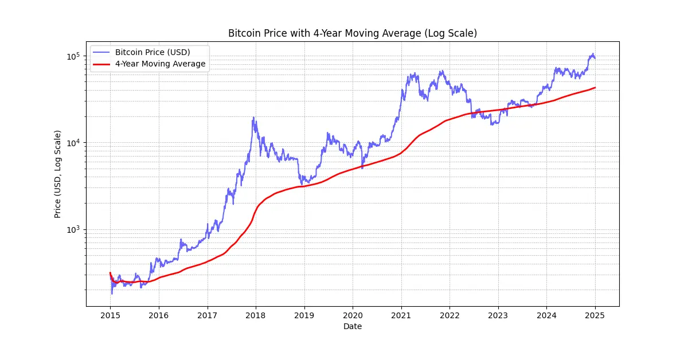

# Commencez le voyage de votre entreprise sur le réseau bitcoin

Découvrez les capacités pratiques du Bitcoin et du Lightning Network, et explorez comment, à l'instar d'Internet, ils peuvent **transformer les opérations de votre entreprise**. Du capital numérique aux paiements rapides, économiques et évolutifs, Bitcoin offre un vaste éventail de **cas d'utilisation pour les entreprises**.

Tout au long de ce guide, vous apprendrez à comprendre le bitcoin en tant que réseau monétaire mondial, universel, et natif de l'internet. Grâce à ses caractéristiques fondamentales uniques, **Bitcoin apporte des améliorations significatives par rapport aux réseaux monétaires traditionnels**. Vous découvrirez pourquoi et comment tirer parti de Bitcoin dans des cas d'utilisation financière classiques tels que le stockage de capital et les systèmes de paiement. En outre, ce guide couvrira l'acquisition et la détention de bitcoins, y compris les exigences comptables et fiscales associées, ainsi que la mise en œuvre de solutions de paiement en bitcoins simples ou à grande échelle.

Que vous soyez une **petite entreprise ou une grande société**, l'intégration de Bitcoin dans vos opérations quotidiennes peut rendre votre entreprise plus **résiliente, productive et compétitive**. Toutes les entreprises basées sur Internet deviendront des entreprises orientées vers Bitcoin, et ce cours vous assure d'être préparé. Les premières sections récapitulent les principes fondamentaux du fonctionnement de Bitcoin, de sorte que même si vous êtes un débutant, vous obtiendrez les connaissances de base nécessaires pour aller de l'avant. Apprendre les bases de l'invention de Satoshi est toujours une bonne idée, que ce soit avant ou après avoir plongé dans BIZ101.

+++
# Introduction

<partId>326cf945-5d3f-4d86-8c3e-4d1c35959799</partId>

## Faites passer votre entreprise au bitcoin

<chapterId>1be42be9-4080-49f5-b5b2-6b531dd55f5f</chapterId>

Démarrez le voyage de votre entreprise sur le réseau Bitcoin avec ce cours de formation complet - une passerelle pour comprendre comment Bitcoin et le Lightning Network peuvent révolutionner les opérations commerciales traditionnelles. Ce cours est conçu pour les marchands, les entrepreneurs, les gestionnaires et les décideurs d'entreprise qui souhaitent explorer les capacités pratiques de Bitcoin en tant que réseau monétaire mondial natif de l'Internet et en tant que moyen robuste d'échange de valeurs.

Tout au long du cours, vous serez initié aux principes fondamentaux qui font de Bitcoin et du Lightning Network des outils de transformation distincts. Vous apprendrez comment ces technologies offrent un éventail de cas d'utilisation, du stockage de capital numérique aux paiements rapides, économiques et évolutifs, et comment elles apportent des améliorations essentielles par rapport à la monnaie traditionnelle et aux systèmes de paiement. Le cours BIZ101 relie la théorie économique aux applications du monde réel, en clarifiant comment la décentralisation peut réduire les dépendances aux intermédiaires et surmonter les limitations inhérentes aux systèmes existants.

Le cours commence par un examen détaillé des monnaies conventionnelles et des mécanismes de paiement, posant les bases en explorant comment la monnaie fonctionne comme un réseau pour permettre le commerce, l'épargne et la spécialisation économique. Ensuite, nous nous pencherons sur la technologie qui sous-tend le bitcoin et les innovations introduites par le Lightning Network, révélant leur rôle dans la facilitation de transactions transparentes, sécurisées et quasi-instantanées qui peuvent servir les entreprises de toutes tailles. Nous nous plongerons ensuite dans les sections pratiques de ce cours, en commençant par une partie sur la détention de bitcoins en tant que trésorerie, suivie d'une dernière partie sur l'acceptation de bitcoins comme moyen de paiement.

Que vous représentiez une petite entreprise ou une grande société, ce cours vise à vous fournir les connaissances nécessaires pour intégrer Bitcoin dans vos opérations quotidiennes, améliorant ainsi la résilience, l'efficacité et l'avantage concurrentiel de votre entreprise. Alors que le bitcoin continue de remodeler le paysage économique, la compréhension de ces technologies révolutionnaires n'est pas simplement une option mais une nécessité stratégique. Préparez-vous à vous engager dans un contenu perspicace, des exemples pratiques et des conseils stratégiques qui vous permettront de naviguer et de tirer parti du monde en évolution du bitcoin !

# Monnaie, systèmes de paiement et Bitcoin

<partId>d9bd0e21-8488-44e0-af55-6d0b934f83c2</partId>

## Monnaies traditionnelles

<chapterId>785e095c-6811-4ca2-ba46-fe38291432d4</chapterId>

### Les monnaies sont des réseaux

Les monnaies sont fondamentalement des réseaux qui permettent l'échange efficace de valeurs.

En l'absence de monnaie, les individus doivent s'en remettre au **troc**, un système dans lequel les biens ou les services sont échangés directement. Le troc n'est pas pratique car il exige une "double coïncidence des besoins" : les deux parties doivent désirer ce que l'autre offre en même temps. Par exemple, si un agriculteur disposant d'un surplus de blé veut des chaussures, il doit trouver un cordonnier qui a spécifiquement besoin de blé. Cette situation est rare et inefficace. En outre, **avec n produits dans une économie de troc, il faut ~n(n-1)/2 taux de change**, ce qui crée un système extrêmement complexe et lourd. Par exemple, il faudrait plus de ~124 000 taux de change pour seulement 500 produits.

La monnaie simplifie cela en agissant comme un intermédiaire, créant **un réseau qui réduit le nombre de taux de change à n** - un pour chaque produit par rapport à la monnaie. Cela rend les transactions beaucoup plus simples et **permet aux gens d'échanger des biens et des services sans avoir besoin de désirs mutuels en même temps**. Au lieu d'échanger directement du blé contre des chaussures, l'agriculteur peut vendre son blé contre de la monnaie et utiliser ensuite cette monnaie pour acheter des chaussures ou toute autre chose dont il a besoin.

L'introduction de la monnaie en tant que réseau facilite non seulement les échanges, mais permet également la **division du travail et la spécialisation**. Avec un moyen d'échange fiable, les individus et les communautés n'ont plus besoin de produire tout ce qu'ils consomment. Au lieu de cela, ils peuvent se concentrer sur ce qu'ils font le mieux, augmentant ainsi l'efficacité et la qualité. Un agriculteur peut se spécialiser dans les cultures, un cordonnier dans la fabrication de chaussures et un maçon dans la construction de maisons. Ces spécialistes peuvent ensuite échanger leurs biens et services par le biais de la monnaie, bénéficiant ainsi de l'expertise de chacun. Cette spécialisation favorise la **productivité et l'innovation**, car les gens affinent leurs compétences et développent de nouvelles méthodes dans leurs domaines respectifs.

La nature de réseau de la monnaie apporte d'autres avantages significatifs. Tout d'abord, il est **plus avantageux de faire partie du réseau monétaire que d'en être exclu**. La norme partagée du réseau facilite les échanges, permettant aux individus de coordonner leurs activités économiques même **à travers de grandes distances**. Par exemple, un commerçant d'une ville peut échanger des marchandises avec un acheteur d'une autre ville en utilisant la même monnaie, ce qui favorise la croissance économique et la coopération dans de vastes régions.

Un autre avantage essentiel de la monnaie est sa capacité à **permettre des échanges différés**. Avec le troc, les transactions sont immédiates ; un bien est échangé contre un autre en temps réel. La monnaie, en revanche, permet **l'épargne - les individus peuvent stocker de la valeur pour une utilisation future**. Cela représente un énorme progrès pour la planification économique, l'investissement et l'accumulation de richesses, autant d'éléments qui améliorent la vie des participants au réseau.

En conclusion, les monnaies sont des réseaux conçus pour transférer efficacement de la valeur. Elles surmontent les limites du troc, simplifient les échanges et créent des possibilités de coordination et d'épargne. Comme pour tout réseau, la valeur d'une monnaie dépend de son adoption généralisée et de son utilité - en fin de compte, c'est la meilleure monnaie qui l'emporte.

### Qu'est-ce qu'une bonne monnaie ?

Une bonne monnaie possède plusieurs propriétés essentielles qui la rendent efficace pour faciliter l'échange de valeurs. Voici une explication concise de chacune d'entre elles :

- **Sécurisée** : Une monnaie doit être protégée contre le vol ou l'accès non autorisé, afin que les utilisateurs puissent la détenir et la transférer en toute confiance. La sécurité est essentielle pour instaurer la confiance dans le système.
- **Inattaquable par la contrefaçon** : Une monnaie doit être extrêmement difficile, voire impossible à contrefaire. Cela garantit que chaque unité est authentique, conserve sa valeur et empêche l'inflation causée par la mise en circulation de fausses unités. Par exemple, historiquement, l'or a été apprécié non seulement pour sa beauté et sa rareté, mais aussi parce qu'il est extrêmement difficile à produire. Contrairement aux billets de banque ou aux entrées numériques, il est impossible de "fabriquer" de l'or : il faut l'extraire de la terre. Cette rareté naturelle et cette difficulté de production ont permis à l'or de conserver son statut de réserve de valeur fiable et de référence en matière d'authenticité.
- **Rareté** : Une bonne monnaie doit avoir une offre limitée ou une émission contrôlée. La rareté permet de préserver sa valeur dans le temps et d'éviter la surproduction, qui éroderait le pouvoir d'achat. Par exemple, certaines tribus amérindiennes utilisaient des perles comme monnaie. Au départ, ces perles étaient difficiles à produire, ce qui maintenait leur rareté et leur valeur. Cependant, lorsque les commerçants européens ont commencé à produire en masse et à inonder le marché de perles, leur rareté a disparu. À mesure que l'offre augmentait, les perles perdaient leur pouvoir d'achat, ce qui compromettait leur rôle de réserve de valeur fiable.
- **Sans autorisation** : Dans le passé, les monnaies telles que les pièces d'or et d'argent étaient souvent frappées par des particuliers, des autorités locales ou des marchands qui avaient accès aux matières premières. Ce système fonctionnait parfois dans le cadre d'accords ou de licences accordés par des rois ou des dirigeants. Au fil du temps, les rois et les gouvernements ont centralisé ce processus afin de mieux contrôler la stabilité économique, la fiscalité et le système monétaire. Un exemple célèbre est le **thaler**, une pièce d'argent frappée pour la première fois en 1518 dans la **vallée de Joachimsthal** (aujourd'hui Jáchymov en République tchèque) par les mineurs et les autorités locales. Le nom "thaler" dérive du mot allemand **"Thal "** qui signifie "vallée". Ces pièces, réputées pour la qualité de leur argent, ont été largement diffusées dans toute l'Europe. Au fil du temps, le terme a évolué d'un point de vue linguistique et géographique, pour finalement donner naissance au nom "dollar", adopté par les États-Unis pour leur monnaie. À l'ère moderne, les monnaies sont devenues entièrement autorisées dans le cadre du système de seigneuriage, ce qui signifie que seules les entités autorisées - telles que les banques centrales ou les trésors - peuvent frapper des pièces de monnaie ou imprimer des billets de banque. Les particuliers ne sont plus légalement autorisés à produire de la monnaie, ce qui garantit un contrôle centralisé de son émission et de son approvisionnement. Aujourd'hui, le principe du seigneuriage est remis en question par la crypto-monnaie Bitcoin, qui fonctionne sans contrôle centralisé. Le bitcoin est un système "sans permission" dans lequel chacun peut participer à l'utilisation de la monnaie sans en demander la permission et, par le biais du minage, à sa création. Cette décentralisation retire aux gouvernements le monopole de l'émission, ce qui soulève des questions quant à un éventuel retour à des systèmes monétaires concurrentiels de marché libre.
- **Unité de compte** : Une monnaie doit fournir une mesure standard pour comparer la valeur des biens et des services. Cela simplifie les échanges et rend la fixation des prix transparente et cohérente d'une transaction à l'autre.
- **Durable** : Une monnaie doit résister à l'usure du temps. Les monnaies physiques, comme les pièces ou les billets, doivent résister aux dommages, tandis que les monnaies numériques doivent rester stockées en toute sécurité sans risque de perte de données.
- **Portable** : Une monnaie doit être facile à transporter et à utiliser, afin de permettre les échanges à distance. Cet objectif peut être atteint grâce à la portabilité physique (pièces ou billets légers) ou à des systèmes de transfert numérique.
- **Divisible** : Une monnaie doit être divisible en unités plus petites afin de faciliter les transactions de différentes tailles. Cette flexibilité garantit qu'elle est pratique tant pour les petits achats que pour les échanges à grande échelle.
- **Fongible** : Toutes les unités d'une monnaie doivent être interchangeables et de même valeur. Par exemple, un billet de un dollar doit être équivalent à n'importe quel autre billet de un dollar. Cette uniformité garantit l'équité et la simplicité des transactions.
- **Reconnaissable** : Une monnaie doit être facilement identifiable et digne de confiance. Les monnaies physiques y parviennent grâce à un design et à des dispositifs de sécurité uniques, tandis que les monnaies numériques peuvent s'appuyer sur des protocoles de vérification. Cela garantit une large acceptation et réduit le risque de fraude.

Ces caractéristiques rendent une monnaie pratique, fiable et efficace pour faciliter les échanges et stocker de la valeur dans une économie.

### Évolution des systèmes monétaires

**De la monnaie fiduciaire à la monnaie papier : Accroître l'efficacité et la portabilité**

Le passage des pièces de monnaie au papier-monnaie a marqué une amélioration significative de la **portabilité** et de l'efficacité. Les pièces de monnaie, composées de métaux précieux comme l'or ou l'argent, étaient précieuses en raison de leur valeur intrinsèque. Cependant, elles étaient lourdes, difficiles à transporter en grandes quantités et sujettes à l'usure ou au vol. Le papier-monnaie a révolutionné les réseaux monétaires en introduisant un support léger, normalisé et portable qui représentait la valeur au lieu de la contenir. Cette innovation a permis aux économies de s'étendre en facilitant les échanges sur de longues distances et en réduisant les problèmes logistiques liés à l'utilisation de marchandises physiques comme monnaie.

Le papier-monnaie a également favorisé l'évolutivité. Au lieu de dépendre de l'offre limitée de métaux précieux, les économies pouvaient élargir leur base monétaire grâce à des monnaies représentatives, garanties initialement par des réserves et, plus tard, par la confiance dans les institutions émettrices. Cette évolution a ouvert la voie à des systèmes financiers plus complexes et interconnectés.

**De la monnaie papier à la monnaie électronique : Accroître l'accessibilité et la rapidité**

Le passage de la monnaie papier à la monnaie électronique a encore amélioré le réseau monétaire en augmentant l'accessibilité et la rapidité. Avec l'essor des systèmes bancaires, des cartes de crédit et des transactions numériques, l'argent est devenu non seulement **portable** mais presque **instantané**. Les transferts électroniques ont éliminé le besoin d'échange physique, permettant aux transactions de se produire sur de grandes distances en quelques secondes.

Cette évolution a également démocratisé l'accès à la monnaie. Les systèmes bancaires et de paiement électroniques ont réduit les barrières à l'entrée pour les particuliers et les entreprises, permettant ainsi la participation à l'économie mondiale. La rapidité et la commodité de la monnaie électronique ont permis d'étendre les réseaux commerciaux et de favoriser de nouveaux modèles d'entreprise qui auraient été impossibles à mettre en œuvre dans un système fondé sur le papier.

Ces réseaux monétaires modernes s'accompagnent d'un inconvénient majeur : un **manque d'auditabilité et de transparence dans la gestion de la masse monétaire**, qui se traduit souvent par une inflation incontrôlée et une perte de confiance dans les systèmes centralisés. Par exemple, plus de 20 % de tous les dollars américains en circulation ont été imprimés au cours des quatre dernières années seulement. Cette tentation persistante d'émettre davantage de monnaie - et donc de dévaloriser la valeur détenue par les détenteurs actuels - peut être largement attribuée à un défaut systémique : les hommes politiques sont souvent incités à éviter les décisions budgétaires difficiles, choisissant plutôt de reporter les défis sur les administrations futures en "jetant l'éponge".

**De la monnaie centralisée à la monnaie décentralisée : Renforcer la confiance et la souveraineté**

Aujourd'hui, l'émergence de la monnaie décentralisée Bitcoin représente le prochain saut dans les réseaux monétaires. La monnaie électronique traditionnelle repose sur des autorités centralisées, telles que les banques ou les gouvernements, pour gérer et vérifier les transactions. Bien qu'efficaces, ces systèmes sont vulnérables aux inefficacités, à la censure et aux points de défaillance uniques. Les monnaies décentralisées améliorent ces propriétés de réseau en **distribuant la confiance et en supprimant les intermédiaires**. Cela signifie également que l'argent peut circuler beaucoup **plus vite** et **pour moins cher**, car il n'y a pas d'étapes d'autorisation. Enfin, aucun humain ne peut être tenté de modifier le calendrier d'approvisionnement de la monnaie Bitcoin, c'est le logiciel qui s'en charge.

Dans les systèmes décentralisés, les transactions sont vérifiées par un réseau mondial de participants utilisant la technologie blockchain, ce qui garantit la sécurité, la transparence et la résilience. Cette structure minimise le risque de fraude, réduit la dépendance à l'égard des autorités centrales et permet aux individus de mieux contrôler leurs finances. En éliminant les barrières géographiques et institutionnelles, les monnaies décentralisées offrent un système monétaire véritablement mondial et inclusif.

**L'évolution des réseaux monétaires

Chaque étape de l'évolution des réseaux monétaires a permis d'améliorer des propriétés essentielles : portabilité, évolutivité, accessibilité, rapidité, sécurité et confiance. Les pièces de monnaie ont cédé la place au papier-monnaie pour une meilleure portabilité et une plus grande efficacité. Le papier a évolué vers la monnaie électronique, permettant un accès mondial et des transactions instantanées. Aujourd'hui, le bitcoin redéfinit la confiance et la sécurité, créant un système monétaire ouvert et résistant. Cette progression historique met en évidence la volonté constante de l'humanité de créer de meilleurs réseaux d'échange de valeurs, chaque itération s'appuyant sur les limites de la précédente et les dépassant.

Le meilleur réseau a toutes les chances de l'emporter.

## Systèmes de paiement traditionnels

<chapterId>1306196c-1e8a-454b-8e11-6887ecb3d8b4</chapterId>

Les systèmes de paiement sont des méthodes et des infrastructures qui permettent le transfert de fonds entre deux parties, généralement entre un payeur (un consommateur, par exemple) et un bénéficiaire (une entreprise, par exemple). Ces transactions peuvent avoir lieu dans différents contextes : un consommateur qui paie un commerçant local, une entreprise qui règle ses factures avec un fournisseur, ou même des particuliers qui se transfèrent de l'argent entre eux. Pour comprendre les systèmes de paiement, il faut examiner les différents types de méthodes de paiement, leurs caractéristiques et leurs cas d'utilisation dans les contextes Business-to-Consumer (B2C) et Business-to-Business (B2B).

### Types courants de modes de paiement

1. **Monnaie fiduciaire:** Monnaie physique échangée directement entre deux parties.

2. **Chèques:** Documents papier donnant l'ordre à une banque de verser au bénéficiaire un montant spécifié prélevé sur le compte du payeur.

3. **Les virements électroniques :** Transfert électronique de fonds entre banques, souvent utilisé pour des sommes plus importantes et des paiements transfrontaliers.

4. **Cartes de paiement (crédit/débit):** Cartes à puce en plastique ou numériques connectées à un réseau, permettant de transférer des fonds du compte bancaire (ou de la ligne de crédit) du titulaire de la carte à un commerçant.

5. **Portefeuilles numériques et paiements mobiles:** Applications ou dispositifs stockant des informations de paiement (par exemple, Apple Pay, WeChatPay, AliPay, PayPal), permettant des transferts rapides et généralement sans contact.

**Utilisation dans les secteurs B2C et B2B:**

- **B2C (Business-to-Consumer):**
    - Les consommateurs utilisent fréquemment des espèces, des cartes et des portefeuilles numériques pour leurs achats quotidiens, qu'il s'agisse de courses, d'achats en ligne ou de services tels que le covoiturage.
    - La rapidité, la commodité et la modicité des frais (pour le consommateur) sont souvent des priorités essentielles.
    - Les paiements sans contact et mobiles sont de plus en plus populaires dans cet espace en raison de leur facilité d'utilisation.
- **B2B (Business-to-Business):**
    - Les entreprises ont souvent recours aux virements électroniques, aux chèques et aux systèmes de facturation pour payer leurs fournisseurs, régler des factures importantes ou gérer des paiements récurrents.
    - L'accent est souvent mis sur la traçabilité, la documentation et la capacité à traiter des montants de transaction plus élevés.
    - L'utilisation de la carte existe mais tend à être moins courante en raison des frais et des limites de transaction plus élevés. Des solutions numériques telles que les plateformes de paiement intégrées apparaissent pour rationaliser et automatiser les processus de gestion des comptes clients et des comptes fournisseurs.

*Graphique : Tendances mondiales des modes de paiement dans les points de vente (2023-2027), The Global Payments Report 2024, Worldpay.*

### La complexité d'un simple paiement par carte

Lorsqu'un client utilise une carte de crédit dans un magasin, la carte est lue par le terminal de point de vente, qui transmet en toute sécurité les données de la transaction à la banque acquéreur du commerçant. L'acquéreur transmet ces informations au réseau concerné (par exemple, Visa ou Mastercard), qui achemine ensuite la demande à l'émetteur - la banque qui a fourni la carte du client. L'émetteur vérifie le compte ou la ligne de crédit du client et renvoie une autorisation par l'intermédiaire du réseau et de l'acquéreur, ce qui permet au commerçant d'accepter le paiement.

Cette transaction apparemment simple comporte en réalité plus de 15 étapes, 7 intermédiaires et prend en moyenne entre 48 heures et 5 jours pour que le commerçant reçoive les fonds. Au cours des jours suivants, un processus de compensation et de règlement se met en place. Le réseau de cartes regroupe les transactions de la journée et coordonne l'échange de fonds entre l'acquéreur et l'émetteur. Une banque centrale garantit l'exactitude et la stabilité de ces règlements interbancaires. Finalement, le compte bancaire du commerçant reçoit le montant net (moins les frais) crédité par l'acquéreur, achevant ainsi le cycle de vie de la transaction.

Dans l'ensemble, ce processus est **complexe, long et coûteux** pour ce qui devrait être un simple acte de transfert de valeur d'une partie à l'autre.

### Comparaison des Méthodes de Paiement

| Méthode de Paiement            | Autorisation Requise ?          | Délai d'Approbation de la Transaction (Vue Commerçant) | Vitesse de Règlement (Fonds Complètement Règlementés) | Finalité (Facilité d'Annulation)         | Nombre d'Intermédiaires       | Frais Typiques (pour le Bénéficiaire) |
| ------------------------------ | ------------------------------- | ------------------------------------------------------ | ----------------------------------------------------- | ---------------------------------------- | ------------------------------ | ------------------------------------ |
| **Espèces**                    | Non                             | Immédiat (Échange Physique)                             | Immédiat (Aucun Délai de Règlement)                  | Élevée (Irréversible Une Fois Payé)      | Aucun                          | Aucun                                 |
| **Chèques**                    | Oui (Compensation Bancaire)     | Acceptation au Dépôt (Non Garantie)                     | Plusieurs Jours (Processus de Compensation)           | Moyenne (Peut Être Rejeté/Annulé avant Compensation) | Banque                         | **Faible à Moyen** (Frais Bancaires) |
| **Virements Bancaires**         | Oui (Banque/Réseau)             | Confirmation en Quelques Heures                         | Le Jour Même ou le Jour Suivant (Domestique)          | Élevée (Généralement Irréversible Une Fois Envoyé) | Banques, Réseaux de Paiement   | **Moyen** (Fixe/Pourcentage)         |
| **Cartes de Paiement**          | Oui (Autorisation de l'Émetteur) | Quelques Secondes à Minutes (Code d'Autorisation)       | Quelques Jours (Règlement Interbancaire)             | Moyenne (Rétrofacturation Possible)      | Émetteur, Acquéreur, Réseau de Cartes | **Variable (1-3% de la Transaction)** |
| **Portefeuilles Numériques/Paiement Mobile** | Oui (Fournisseur de Portefeuille/Banque) | Secondes (Confirmation Instantanée)            | Typiquement 1-2 Jours (Selon la Source de Financement) | Moyenne (Remboursement/Litige Possible) | Banques, Opérateurs de Portefeuille | **Faible à Moyen (Variable)**      |

### Limitations des solutions existantes

L'industrie traditionnelle des paiements représente une économie annuelle d'environ 2 200 milliards de dollars, soit environ un dixième du PIB des États-Unis ou l'équivalent du PIB de la France. Comme les devises fonctionnent comme des réseaux autorisés, la concurrence est limitée, faisant de ce "service" une sorte de taxe imposée à l'économie productive. En plus des coûts qu'elle génère, cette industrie présente plusieurs autres limites, comme indiqué ci-dessous.

| Limitation                           | Explication                                                                                                                                                                                                                                                                                                             | Impact                                                                                                                                       |
| ------------------------------------ | ----------------------------------------------------------------------------------------------------------------------------------------------------------------------------------------------------------------------------------------------------------------------------------------------------------------------- | -------------------------------------------------------------------------------------------------------------------------------------------- |
| Frais de carte élevés                | Les frais d'interchange (~0,3 %), les frais de réseau (fixes ou 0,3 %-1 %), les abonnements aux terminaux/PSP et les marges bancaires (0,5 %-1,7 %) s'accumulent en un coût substantiel — semblable à une "taxe" mondiale sur les secteurs productifs, représentant des milliers de milliards de dollars.               | Augmente les coûts pour les commerçants, réduisant leurs marges et pouvant entraîner une hausse des prix pour les consommateurs.             |
| Règlement final très lent            | Le règlement des fonds peut prendre jusqu'à 5 jours, ralentissant la circulation de l'argent et l'activité économique globale.                                                                                                                                                                                          | Retarde la liquidité des commerçants et réduit la vitesse de circulation de l'économie.                                                      |
| Fraude                               | Les canaux de commerce en ligne sont fortement ciblés par les fraudeurs, entraînant des pertes considérables (par ex. 28 milliards de dollars). Les rétrofacturations pourraient atteindre environ 174 milliards de dollars dans le monde d'ici 2024. La gestion de ces litiges demande du temps et engendre du stress. | Augmente les coûts opérationnels, nécessite des mesures complexes de prévention et réduit la confiance des clients.                          |
| Abandon de panier                    | Les étapes de sécurité supplémentaires (codes uniques, authentification à deux facteurs selon la PSD2) introduisent des frictions lors du paiement.                                                                                                                                                                     | Une complexité accrue au moment du paiement entraîne une augmentation des abandons de panier et des ventes perdues.                          |
| Montants minimums élevés             | Les seuils de dépenses minimales imposés par les cartes peuvent contraindre les commerçants et les consommateurs à des conditions de prix ou d'achat peu pratiques, décourageant les transactions de faible valeur.                                                                                                     | Réduit la satisfaction et la flexibilité des clients, limitant les achats impulsifs ou de faible montant.                                    |
| Autorisation lente                   | Les systèmes actuels ne peuvent pas gérer des transactions à des vitesses de millisecondes ni prendre en charge des flux de paiement en continu et en temps réel.                                                                                                                                                       | Limite les cas d'usage nécessitant des paiements instantanés ou en streaming, freinant l'innovation et l'évolutivité.                        |
| Besoin d'un compte bancaire/carte    | L'accès à ces méthodes de paiement nécessite un compte bancaire ou une carte associée, excluant automatiquement les personnes n'en disposant pas.                                                                                                                                                                       | Limite l'inclusion financière, en réduisant l'accès pour les populations non bancarisées ou sous-bancarisées.                                |
| Création répétée de comptes en ligne | Les utilisateurs doivent souvent créer plusieurs comptes en ligne, ce qui engendre de la fatigue, réduit la commodité et augmente l'exposition de leurs données personnelles.                                                                                                                                           | Dégrade l'expérience utilisateur, soulève des préoccupations en matière de confidentialité et augmente les risques de violations de données. |
| Frais de change                      | L'absence d'une unité de compte universelle entraîne des conversions coûteuses pour les transactions transfrontalières.                                                                                                                                                                                                 | Ajoute des coûts supplémentaires au commerce international, rendant les transactions mondiales moins abordables.                             |

Tout comme nous sommes passés du paiement à la minute pour les appels vocaux à l'utilisation quasi gratuite des communications IP (internet), l'émergence de réseaux plus ouverts et plus efficaces peut redéfinir les paiements, en réduisant les coûts et les intermédiaires et en favorisant de nouveaux modèles d'entreprise.

## Bitcoin pour les entreprises : une monnaie émergente

<chapterId>4488fe33-663f-41a3-a668-e9ca2fb7122e</chapterId>

**QU'EST-CE QUE LE BITCOIN ?

Le bitcoin est un **système d'échange de monnaie numérique de pair à pair** (monnaie électronique). Le terme "bitcoin" désigne les éléments suivants :

- **Protocole informatique** qui facilite l'échange de valeurs sur l'internet sans intermédiaire, sans demander d'autorisation et de manière pseudonyme. Il utilise des principes cryptographiques avancés.
- **Réseau physique** de machines connectées à Internet (nœuds, mineurs, etc.) exploitées par des particuliers et des entreprises, formant un système décentralisé (sans autorité centrale ni point de contrôle unique).
- **L'unité de compte** au sein du système. Il n'y aura jamais plus de 21 millions de bitcoins en circulation. Chaque bitcoin est divisible en 100 millions d'unités appelées "satoshis", en l'honneur de son créateur anonyme.

Ensemble, ils font du bitcoin **un actif au porteur** et une monnaie numérique **sans émetteur**. La propriété est garantie uniquement par la détention de la **clé cryptographique privée**, ce qui permet un contrôle total **sans intermédiaire ni tiers de confiance**. En cas de transfert, la **finalité** de la propriété est immédiate : le nouveau détenteur en est pleinement propriétaire, sans dépendre d'une autorité centrale pour la protection ou la convertibilité. Les transactions sont **immuables** : une fois enregistrées sur la blockchain, elles ne peuvent être ni modifiées ni supprimées.

Le bitcoin a une politique monétaire fixe, avec un **cap de 21 millions de bitcoins**, dont ~19,8 millions ont déjà été distribués. Cela le rend **déflationniste**, sa valeur augmentant au fil du temps à mesure que les utilisateurs y stockent leurs économies et leurs gains de productivité.

Ses caractéristiques techniques dépassent celles de l'or et du dollar réunis, ce qui en fait l'actif financier le plus "dur" jamais créé. Le bitcoin est à la fois une réserve de valeur et un moyen d'échange, une monnaie en devenir. Imaginez que vous puissiez transférer de la valeur, depuis la trésorerie d'une entreprise à une autre, rapidement, sans intermédiaire, à un coût minime, sans fraude, 24 heures sur 24, 7 jours sur 7, et sans l'intervention d'une tierce partie.

Le bitcoin préserve efficacement sa valeur car son grand livre de comptes est infalsifiable. Sa valeur augmente en raison de l'offre rare et limitée, combinée au nombre croissant d'opportunités d'échanges, induit par l'augmentation du nombre d'utilisateurs.

Le bitcoin est perturbateur parce qu'il nous encourage à apprendre des concepts de mathématiques, de cryptographie, d'économie et d'histoire qui ne nous ont jamais été enseignés. Souvent perçu comme complexe, il s'agit en fait d'une innovation accessible par la pratique et l'expérimentation.

Le bitcoin nous pousse à reconsidérer la nature même de l'argent. Pourriez-vous nous expliquer ce qu'est vraiment l'argent ? Un salarié ou un entrepreneur va passer 50 000 à 100 000 heures de sa vie à gagner de l'argent, mais combien **consacrent ne serait-ce que 100 heures à mieux le comprendre** et à le préserver ? Le bitcoin nous incite à nous interroger sur les raisons fondamentales de notre besoin d'argent et sur notre perspective temporelle. L'argent est-il un luxe immédiat ou une résilience à long terme ? Si nous disposions d'un actif qui s'apprécie et nous permettait de retarder nos achats, quels choix ferions-nous ? Quelles conversations souhaiterions-nous avoir avec nous-mêmes dans 20 ou 30 ans ?

**CARTE D'IDENTITÉ DE BITCOIN**

- **Âge:** 15 ans (3 janvier 2009)
- **Valeur boursière quotidienne:** 10 milliards de dollars (> CAC40)
- **Capitalisation boursière:** 1,8 trillion de dollars (> Meta, Visa, Argent ; < Apple, Google, Or)
- **Utilisateurs:** ~100 à 200 millions (1-2% de la population mondiale)
- **Volatilité:** Intrinsèquement nulle (1 bitcoin = 1 bitcoin), extérieurement très élevée (dans les échanges de monnaies fiduciaires)
- **Performance:** Première transaction à 0,0009 $ ; maintenant 100 000 $ (x100 millions)
- **Disponibilité du réseau (temps de fonctionnement):** 100% depuis 2013
- **Déclaré mort ou critiqué:** Une fois par mois

**Un prodige de la coopération humaine:**

- Entièrement **open-source**
- **Entité juridique:** Aucune
- **PDG:** Aucun
- **Investissement en capital-risque:** Aucun
- **Marketing:** Aucun
- **R&D:** axé sur le volontariat
- **Gouvernance:** Par les utilisateurs
- **Modèle économique innovant:** La création de blocs est subventionnée par les frais de transaction (vente aux enchères)

Pour plus d'informations sur le bitcoin, son histoire, son fonctionnement et son utilisation, je vous suggère également de suivre cet autre cours complet :

https://planb.network/courses/2b7dc507-81e3-4b70-88e6-41ed44239966
## Introduction au réseau Lightning

<chapterId>c095c7ad-5469-4c7b-9510-b6c0b86244e7</chapterId>

**QU'EST-CE QUE LE LIGHTNING NETWORK?**

Le Lightning Network est **un protocole et un réseau** qui facilite les transactions Bitcoin avec une interaction minimale avec la blockchain principale de Bitcoin. Voici comment il fonctionne :

- **Configuration initiale:** Les fonds sont bloqués (séquestrés) sur la blockchain principale (bitcoin) afin d'établir un **canal de paiement entre deux parties**.
- **Réseau de paiement:** Le maillage des canaux de paiement entre plusieurs parties constitue un réseau de paiement (routage et interconnexion).
- **Transactions hors chaîne:** Des transactions ont lieu entre les parties mais ne sont **pas immédiatement publiées** sur la chaîne de blocs principale de Bitcoin (**"off chain"**).
- **Règlements sur la chaîne** : seul le **solde final** des transactions est publié sur la chaîne principale de Bitcoin (**"on chain**"), ce qui permet à de nombreuses transactions de se produire entre-temps. Ce regroupement de paiements multiples réduit l'encombrement, et donc les frais, par rapport à la réalisation de nombreuses transactions sur la blockchain Bitcoin.
- **Fermeture du canal:** Un utilisateur peut fermer son canal à tout moment et récupérer ses bitcoins en publiant le dernier état de la transaction. C'est le principe des transactions qui sont **"publiables" à tout moment mais "non publiées "** jusqu'à ce que cela soit nécessaire. La sortie (fermeture du canal) peut être unilatérale (décidée par l'une ou l'autre des deux parties à tout moment) ou décidée mutuellement (ce qui permet de réduire les frais sur la chaîne)

Cette approche permet d'éviter la lenteur et la complexité de l'exécution de chaque transaction directement sur la blockchain principale de Bitcoin, en n'enregistrant que les soldes finaux et en conservant sa sécurité. Le Lightning Network est une couche (réseau applicatif) "au-dessus" de Bitcoin mais reste ancré à celui-ci.

**Un réseau mondial de paiement**

Le protocole crée un **réseau** de machines où les canaux forment un système de paiement universel. Ces nœuds peuvent être exploités librement par des particuliers ou des entreprises, ce qui en fait un réseau totalement ouvert.

Le Lightning Network permet l'échange instantané de valeurs à la vitesse de la lumière. C'est comme un protocole de courrier électronique appliqué aux paiements : un réseau de paiement de nouvelle génération. Il transforme radicalement la façon dont "l'argent" circule, en le rendant aussi gratuit et rapide que la transmission de données sur l'internet.

**Avantages clés:**

- **Rapidité:** Transactions instantanées.
- **Frais réduits:** Des frais bien inférieurs à ceux des réseaux bancaires traditionnels.
- **Facilité d'adoption:** Les entreprises peuvent rapidement accepter les paiements Lightning à l'aide d'une application pour smartphone ou d'un bouton de paiement sur leur site web.

L'infrastructure Lightning surpasse les systèmes de paiement traditionnels en termes de vitesse, de coût et d'efficacité énergétique. Avec l'adoption croissante par les commerçants, la dynamique va s'accélérer : si les paiements peuvent contourner le réseau interbancaire captif, pourquoi continuer à céder un pourcentage important de ses revenus aux intermédiaires actuels ?

**Cas d'utilisation infinis:**

Les applications de Lightning vont bien au-delà des frais réduits et de la rapidité. En offrant un système de paiement instantané et totalement gratuit, il ouvre de vastes perspectives dans l'ensemble de l'économie.

**Stimuler les capacités d'échange de Bitcoin:**

Lightning amplifie le rôle de Bitcoin en tant que "moyen d'échange" En augmentant la fréquence et la liberté des transactions, il renforce la fonction première de la monnaie : faciliter les échanges économiques et la création de valeur pour tous les participants.

L'essor futur de l'"économie des machines intelligentes" nécessitera un système de paiement ultra-rapide et à haute fréquence, une norme technique que seul Lightning peut respecter. Cela permettra de créer davantage de biens et de services. L'offre de bitcoins restant limitée, le pouvoir d'achat de chaque unité augmentera. Bitcoin et Lightning se renforcent ensemble à mesure que leurs réseaux s'étendent.

Lightning offre un aperçu d'un avenir où toutes les entreprises basées sur l'internet le seront également sur le bitcoin.

**Paiements en bitcoins sur Lightning : Un cas d'utilisation typique pour un commerçant**

Le Lightning Network est idéal pour les paiements en bitcoins dans les magasins physiques ou en ligne en raison de sa rapidité et de la finalité du paiement.

- **Vitesse:** Lightning (~500ms à quelques secondes) est nettement plus rapide que le réseau principal de Bitcoin, où les transactions peuvent prendre environ 30 minutes pour être confirmées. Pour les achats importants (bien plus de 1 000 dollars), le réseau principal de Bitcoin peut encore être préféré, car la vitesse est moins critique. Toutefois, ces détails sont souvent cachés à l'utilisateur lambda, car les applications gèrent ces décisions de manière transparente en arrière-plan.
- **Finalité:** Une fois qu'un paiement est effectué sur Lightning, il est définitif. Il n'y a pas de possibilité de rétro-facturation par des tiers ou de litiges liés à la fraude.
- **Frais:** Les frais de transaction sur le Lightning Network sont minimes et payés par l'utilisateur, pas par le commerçant. Les commerçants ne paient des frais que s'ils ont besoin de transférer leurs bitcoins vers un autre réseau ou service.

**CARTE D'IDENTITÉ DE LIGHTNING**

- **Invention:** 2015
- **Lancement:** 2016
- **Âge:** 7 ans (première transaction : 28 décembre 2017)
- **Capacité technique du réseau:** à grande échelle, il peut traiter 1 000 fois plus de transactions instantanées que les systèmes traditionnels.
- **Montant des transactions:** La taille des transactions sont de tout ordre et jusqu'à 1 000 fois inférieure à celle des systèmes traditionnels.
- **Vitesse de transaction:** Jusqu'à 100 fois plus rapide.
- **Frais:** Jusqu'à 90 % de réduction.
- **Finalité du paiement:** Presque instantané (souvent ~500 millisecondes, parfois quelques secondes).
- **Consommation d'énergie:** ~8% du système monétaire mondial traditionnel.
- **Caractéristiques:**
    - Peer-to-peer
    - Universel
    - Sans autorisation
    - Bonne protection de la vie privée
    - Une sécurité éprouvée
    - Haute disponibilité (excellent temps de fonctionnement)
    - Contrôlable et adaptable

Pour plus d'informations sur le fonctionnement technique du réseau Lightning, je vous suggère également de suivre cet autre cours complet :

https://planb.network/courses/34bd43ef-6683-4a5c-b239-7cb1e40a4aeb
# Bitcoin dans la trésorerie

<partId>bf45c1e8-af97-4b6b-af42-2866f493b14d</partId>

## Profits, capital et les clés de la résilience des entreprises

<chapterId>656ad88f-3c27-4054-a94e-b29727009b8e</chapterId>

### Une entreprise saine

**L'avenir est incertain** et les entreprises doivent faire face à cette incertitude en se concentrant clairement sur la réalisation de bénéfices et la préservation du capital. Selon l'économie autrichienne, **les bénéfices sont le signal ultime de la santé d'une entreprise** - ils montrent que l'entreprise répond efficacement aux besoins des consommateurs. Sans bénéfices, une entreprise ne peut pas se maintenir, et encore moins se développer. Pour qu'une entreprise reste en bonne santé, elle doit non seulement générer des bénéfices, mais aussi penser à l'avenir, **en stockant du capital pour les investissements et les défis futurs**.

**La préservation du capital** est essentielle car elle permet aux entreprises de s'adapter et de saisir les opportunités dans un marché imprévisible. Il s'agit de trouver un équilibre entre le réinvestissement des bénéfices pour assurer la croissance et le maintien d'une réserve financière pour faire face à d'éventuels ralentissements. L'économie autrichienne souligne l'importance de la **"préférence temporelle "**, ce qui signifie que les entreprises doivent soigneusement décider dans quelle mesure elles doivent privilégier les rendements immédiats par rapport à l'investissement dans la réussite à long terme. Une entreprise en bonne santé conserve des bases financières solides, ce qui lui assure une certaine flexibilité dans les périodes fastes comme dans les périodes difficiles.

Les signaux du marché, tels que les prix et la concurrence, aident les entreprises à prendre des décisions judicieuses en matière d'affectation des ressources. En écoutant ces signaux, les entreprises peuvent éviter le piège de se surdimensionner ou de faire de mauvais investissements, en particulier ceux qui sont influencés par des facteurs artificiels tels que le crédit facile. Une mauvaise allocation des ressources ne met pas seulement en péril la santé de l'entreprise, mais réduit également sa capacité à servir efficacement ses clients.

En fin de compte, pour maintenir une entreprise en bonne santé, il faut rester adaptable, faire des choix financiers prudents et toujours garder un œil sur l'avenir. **En se concentrant sur le profit, en préservant le capital et en réagissant aux signaux du marché, les entreprises, grandes ou petites, peuvent prospérer même dans l'incertitude**.

### Le capital a-t-il une vertu ?

**Comment le capital est généralement représenté**

Redécouvrons ce qu'est réellement le capital, terme si souvent mal compris et perçu négativement dans notre société.

Dans la théorie économique traditionnelle (keynésienne), le capital est souvent considéré de manière simplifiée comme un stock homogène d'actifs physiques ou financiers, principalement utilisé pour stimuler la demande globale par le biais de l'investissement. Il est souvent associé à la concentration des richesses et au pouvoir économique détenu par une petite élite. Dans un contexte où les écarts de richesse continuent de se creuser, nombreux sont ceux qui considèrent le capital comme un symbole d'inégalité économique, en particulier lorsque la richesse accumulée ne semble offrir aucun avantage à la majorité.

Le "capital" est souvent présenté comme un outil d'exploitation, et cette perspective a profondément influencé divers mouvements qui considèrent le capital comme intrinsèquement opposé aux intérêts des travailleurs. Mais est-ce vrai ? Ou cette perception peut-elle être déformée par.. :

1. Un manque de compréhension des mécanismes économiques (y compris de la part des économistes eux-mêmes) ?
2. Interventionnisme gouvernemental et manipulation du marché ?
3. Confusion entre le capitalisme de connivence et le capitalisme de marché ?
4. Le traitement médiatique des crises économiques ?
5. Un désir de solutions rapides et de justice sociale immédiate ?
6. La normalisation culturelle de la rhétorique anticapitaliste ?

Heureusement, le bitcoin nous oblige à tout repenser et à remettre en cause ces idées reçues. Il existe une école de pensée, l'école autrichienne d'économie, qui peut nous éclairer sur ces questions et nous aider à reconsidérer la véritable nature du capital.

**Il était une fois**...

Commençons par une petite histoire :

"*Sur une petite île déserte vit un pêcheur solitaire. Chaque jour, il passe des heures à attraper des poissons à mains nues, une activité qui lui prend beaucoup de temps et d'énergie. Un jour, il a une idée : construire une lance qui lui permettra de pêcher plus efficacement. Mais il sait que cela lui demandera un sacrifice.*

*Avant de commencer à fabriquer la lance, le pêcheur décide de mettre de côté quelques poissons pour subvenir à ses besoins pendant le processus de fabrication. Il mange moins que d'habitude pendant quelques jours, mettant de côté suffisamment de poissons pour se concentrer sur son projet. Ce poisson mis de côté représente son **capital**, une petite réserve qui lui permet de poursuivre son objectif.*

*Tout en consacrant son temps à la construction de la lance, il compte sur ses réserves, retardant volontairement une partie de son confort immédiat (ce qui reflète sa **préférence temporelle**). Après plusieurs jours de travail acharné, il achève une lance solide.*

*Grâce à la lance, il peut désormais attraper des poissons beaucoup plus rapidement et avec moins d'efforts. Il n'a plus besoin de s'épuiser comme avant et commence même à accumuler un surplus de poissons. Ce surplus lui ouvre de nouvelles possibilités : il peut le stocker, le partager ou l'investir dans d'autres projets sur l'île. En retardant sa consommation immédiate et en utilisant son capital, le pêcheur a considérablement amélioré son efficacité et ses perspectives d'avenir.*"

Cette histoire illustre le rôle fondamental du capital, de la patience et de la prévoyance dans la construction d'un avenir meilleur - des concepts essentiels à la croissance économique et au progrès humain.

### L'école autrichienne d'économie et sa vision du capital

L'école autrichienne d'économie tire son nom de ses fondateurs et de ses premiers contributeurs, originaires d'Autriche. Le nom est resté, et l'école est depuis lors étroitement associée à la pensée libérale classique, qui met l'accent sur la liberté individuelle, les marchés libres et l'intervention minimale de l'État.

**La perspective autrichienne sur le capital

Dans la vision autrichienne, le capital est profondément lié à l'idée de différer la consommation pour construire des outils ou des ressources productives qui améliorent la production future. Ce processus, connu sous le nom d'accumulation de capital, est au cœur de la théorie économique autrichienne. Les éléments clés de cette perspective sont les suivants :

- **Préférence temporelle et consommation différée** : Les individus préfèrent naturellement consommer maintenant plutôt que plus tard, mais ils peuvent choisir de différer leur consommation s'ils s'attendent à de plus grandes récompenses à l'avenir. En épargnant aujourd'hui, les ressources peuvent être investies dans des biens d'équipement (outils, machines, infrastructures) qui améliorent la productivité au fil du temps. Les sociétés ou les individus qui ont une préférence temporelle moins marquée épargnent davantage et investissent dans des projets à long terme, ce qui favorise une croissance durable.
- **Le capital, moteur de la production future** : Les biens d'équipement sont considérés comme des outils intermédiaires utilisés pour produire des biens de consommation finaux. En accumulant du capital, les entrepreneurs peuvent améliorer la productivité et créer plus de richesse à l'avenir. Par exemple, au lieu de produire immédiatement des biens de consommation, les ressources peuvent être utilisées pour construire des usines ou des machines. Bien que cela réduise la consommation à court terme, l'efficacité qui en résulte permet d'accroître la production et la prospérité ultérieurement.
- **Production indirecte et efficacité** : Les économistes autrichiens, comme Eugen Böhm-Bawerk, ont mis en évidence l'idée de production indirecte - des processus de production plus longs et plus complexes impliquant de multiples étapes. Bien que ces processus prennent du temps, ils produisent en fin de compte des résultats plus efficaces et plus productifs, comme la construction d'une scierie pour traiter le bois plutôt que le traitement manuel des grumes.
- **Les taux d'intérêt comme signaux** : Les taux d'intérêt, selon le point de vue autrichien, reflètent naturellement les préférences temporelles des individus. Des taux élevés indiquent une préférence pour la consommation immédiate, tandis que des taux bas encouragent l'épargne et l'investissement à long terme. Lorsque les banques centrales manipulent artificiellement les taux d'intérêt, elles faussent ces signaux naturels, ce qui entraîne une mauvaise allocation des ressources et des investissements non durables (malinvestissement).

**Deux formes de capital dans les économies modernes**

Dans le cadre du système monétaire basé sur la dette dans lequel nous opérons, **il existe un deuxième type de capital** : celui qui est généré instantanément lorsqu'une banque crée un prêt par le biais d'un simple mécanisme de crédit. Il s'agit d'une création de liquidité ex nihilo, où la banque prête de l'argent qu'elle ne détient pas à l'avance, mais qu'elle crée sur la base d'une promesse de remboursement.

D'une côté, le capital "autrichien" est le résultat d'une épargne réelle, un processus qui implique des décisions économiques réfléchies et des sacrifices méticuleux. De l'autre, le capital "keynesien" généré par la création de monnaie basée sur la dette est une construction instantanée et artificielle. Ces deux types de capital, bien que **superficiellement similaires dans leur utilisation pour financer des projets, sont fondamentalement différents par nature**.

Ces deux formes de capital ne devraient jamais être confondues. Pourtant, dans un système basé sur l'endettement, elles le sont souvent, **détournant les signaux économiques** et conduisant fréquemment à un mal-investissement. Ce malentendu explique pourquoi le capitalisme fait souvent l'objet de critiques injustifiées

**Le problème clé du keynésianisme**

Les politiques keynésiennes, largement adoptées par les élites mondiales, manipulent les taux d'intérêt et stimulent la demande par l'endettement. Cela encourage les ressources à s'orienter vers des projets à court terme et non viables, ce qui amplifie les cycles économiques et retarde la véritable croissance fondée sur une épargne saine et des investissements productifs. Les chefs d'entreprise observent directement cette politique néfaste, car les entreprises saines sont poussées à faire des acquisitions surévaluées dans le but d'obtenir des rendements gonflés, ce qui nuit à la croissance organique et durable.

Dans un tel environnement, comment le capital "sain" - soigneusement épargné par les entrepreneurs - peut-il rivaliser avec le capital "malsain" créé artificiellement ? En outre, l'expansion unilatérale de la masse monétaire érode le pouvoir d'achat du capital sain, exacerbant la désorientation économique et l'insatisfaction de la société.

**Une lueur d'espoir : Bitcoin**

Le bitcoin offre un moyen d'accumuler et de préserver le capital à long terme sans l'érosion causée par l'inflation monétaire. En tant que réserve de valeur, il permet aux entreprises de planifier leurs investissements futurs avec résilience, remettant en cause la domination des systèmes basés sur l'endettement et favorisant un retour à une véritable accumulation de capital productif.

### En savoir plus sur l'école autrichienne d'économie

**L'école autrichienne d'économie** est une tradition de pensée économique qui valorise les marchés libres, la liberté individuelle et l'importance de l'action humaine dans les processus économiques. Elle critique l'intervention de l'État, en particulier dans le domaine de la monnaie et des marchés, et affirme que les individus, guidés par leurs préférences subjectives, sont les meilleurs juges de leurs propres intérêts.

**Figures clés de l'école autrichienne**

- **Carl Menger** : Fondateur de l'école autrichienne, Menger a développé la théorie de la valeur subjective, qui affirme que la valeur des biens dépend des préférences individuelles plutôt que des coûts de production.
- **Ludwig von Mises** : Pierre angulaire de l'école autrichienne, Mises a introduit la praxéologie (la théorie de l'action humaine) et a écrit _Human Action_, une critique profonde du socialisme et de la planification centrale.
- **Friedrich Hayek** : Élève de Mises, Hayek a reçu le prix Nobel d'économie en 1974 pour ses travaux sur la décentralisation des connaissances et la spontanéité du marché. Dans son livre "The Road to Serfdom", il a fortement critiqué le contrôle centralisé.
- **Murray Rothbard** : Disciple de Mises et fervent défenseur du libertarianisme, Rothbard a développé la théorie de l'anarcho-capitalisme, envisageant une société sans État gouvernée par des contrats volontaires. Son livre _Man, Economy, and State_ (L'homme, l'économie et l'État) est un ouvrage fondateur de l'économie autrichienne.

**Autres économistes influents

- **Milton Friedman** : Bien qu'il ne soit pas directement associé à l'école autrichienne, Friedman a soutenu de nombreuses idées libérales et favorables au marché. Sa politique monétariste diffère de la pensée autrichienne mais partage leur critique de l'intervention excessive de l'État dans l'économie.
- **Frédéric Bastiat** : Économiste français du XIXe siècle, Bastiat a influencé l'école autrichienne par ses travaux sur le libre-échange et les conséquences invisibles des politiques économiques. Son essai _Ce que l'on voit et ce que l'on ne voit pas_ est un texte fondateur du libéralisme économique.

*Attribution : L'Institut Ludwig von Mises*

**Contributions et idées de base**

Ces penseurs ont façonné l'idée que l'intervention de l'État fausse les marchés et que la liberté économique est essentielle à la prospérité et à la coordination harmonieuse des actions humaines. Leurs idées soulignent l'importance de la décentralisation de la prise de décision et les dangers d'un contrôle centralisé des systèmes économiques.

Pour plus d'informations sur ce sujet :

https://planb.network/courses/d955dd28-b7c6-4ba2-a123-d932e21d148f
https://planb.network/courses/9d1bde6a-33e5-45dd-b7c0-94da72e45b11
https://planb.network/courses/d07b092b-fa9a-4dd7-bf94-0453e479c7df
## Détenir des bitcoins en trésorerie

<chapterId>89622a40-d14f-4c37-a075-8e7e1731ec26</chapterId>

### Les défis de la trésorerie d'entreprise

La trésorerie est l'endroit où l'on met les choses précieuses. Une entreprise saine est correctement capitalisée afin de pouvoir faire face aux incertitudes futures et planifier ses investissements. Aujourd'hui, une partie de la trésorerie excédentaire est placée dans des actifs financiers réputés très "liquides" : obligations, dépôts à terme, etc.

Pour un horizon très long, certaines entreprises utilisent des actifs illiquides comme l'immobilier sans se rendre compte de certains dangers :

- Illiquidité en cas de crise
- Des rendements  plutôt faibles une fois les frais déduits
- Un rendement qui ne dépasse pas l'inflation réelle, celle de la masse monétaire (~7% par an, voir ci-dessous)
- Le risque caché que l'immobilier perde une partie de sa fonction "épargne" au profit d'actifs comme le bitcoin. Il pourrait ainsi se rapprocher de sa "valeur d'usage" : c-à-d se loger.

Passons rapidement en revue l'environnement dans lequel les entreprises opèrent.

**L'inflation réelle** : Au grand dam de leur mandat, les banques centrales visent une inflation annuelle de 2 %, ce qui signifie une perte de 40 % de la valeur de la monnaie sur 20 ans. Si l'on ajoute les périodes d'inflation plus prononcée, il devient évident que les entreprises ne peuvent pas utiliser uniquement la monnaie pour stocker le fruit de leur travail. Elles doivent mettre en œuvre des stratégies financières complexes, qui s'accompagnent nécessairement d'une série de risques. Ces stratégies sont évidemment **inaccessibles aux très petites entreprises**, déjà fortement accaparées par leur activité principale.

**L'inflation cachée** : Dans un système monétaire fondé sur l'endettement et les réserves fractionnaires, soutenu par les banques centrales, la **masse monétaire globale augmente d'environ 7 % par an en moyenne** (par exemple, M1 dans la zone euro ou aux États-Unis). Cela signifie que votre "part du gâteau" est réduite de moitié en quelques années, à moins que vous n'ayez un accès privilégié au robinet financier et que vous puissiez continuer à croître en utilisant l'effet de levier et en achetant rapidement des actifs à leurs "anciens prix" avant que l'argent nouvellement créé ne les fasse grimper. C'est l'effet Cantillon, qui explique en partie le transfert de richesse vers les plus aisés, alors que le "capital" est accusé à tort d'être le coupable (voir notre introduction sur le capital ci-dessus).

**Risques de contrepartie** : Le système financier actuel est risqué et vous n'aurez peut-être pas toujours accès à "votre argent". Sans évoquer l'image d'un château de cartes, force est de constater que les institutions financières privatisent les profits et socialisent les pertes à la moindre crise. Dans un système de monnaie "scripturale" (monnaie inscrite dans un grand livre), l'argent à la banque n'est qu'une "créance" ; vous ne le possédez pas vraiment, et les banques elles-mêmes "ne le possèdent pas" (réserves fractionnaires). Cet argent est en quelque sorte magique. Certaines banques prestigieuses qui se sont moquées du bitcoin n'existent plus aujourd'hui, comme le Crédit Suisse.

Ce manque de confiance entraîne une résurgence des actifs "au porteur" comme l'or (même s'il est compliqué à sécuriser, à transporter, à diviser, etc.) et, bien sûr, le nouveau venu, le bitcoin.

### Le bitcoin en tant qu'actif financier

Le bitcoin offre une alternative radicale. Il s'agit d'un **actif au porteur, sans émetteur central**, presque impossible à saisir, et qui bénéficie des effets de réseau. Les "vrais" utilisateurs de Bitcoin choisissent de l'utiliser pour stocker le fruit de leur travail, car il est considéré comme une réserve de valeur résistante à la censure et à l'inflation. Grâce à l'effet de réseau, illustré par la loi de Metcalfe, chaque nouvel utilisateur convaincu augmente la valeur du réseau ; à mesure que le nombre de participants augmente, l'utilité du bitcoin croît de manière exponentielle. Ce modèle en fait une forme de capital originale et prometteuse, fondée sur l'adoption et la confiance des utilisateurs.

Le bitcoin est l'actif **le plus liquide au monde**, fonctionnant 24 heures sur 24 et 7 jours sur 7 sans interruption, contrairement aux marchés financiers traditionnels qui ont des heures de fermeture et des "coupe-circuits". Cette liquidité permet aux utilisateurs d'acheter ou de vendre des bitcoins à tout moment, que ce soit en réponse à une bonne ou à une mauvaise nouvelle (lancement de missiles, guerres, etc.).

En dix ans, le bitcoin a enregistré une croissance annuelle moyenne de plus de 60 %. Cette performance unique a permis aux détenteurs à long terme de préserver leur capital initial, contrairement à d'autres instruments.

Toutefois, il convient de garder à l'esprit plusieurs facteurs clés :

Tout d'abord, **les performances passées ne garantissent pas les résultats futurs**. Tant que le bitcoin reste **sécurisé et décentralisé**, on peut raisonnablement espérer une appréciation annuelle du prix bien supérieure à 20 % par an au cours de la prochaine décennie, ce qui en fait un outil de trésorerie viable.

Deuxièmement, le bitcoin a connu jusqu'à présent des cycles de **4 ans**, ce qui signifie qu'avec un horizon temporel de plus de 4 ans, le pari a toujours été rentable. Pour ceux qui considèrent le bitcoin comme un investissement, un horizon à court terme (<4 ans) peut être risqué.

*MICHAEL SAYLOR : "Le meilleur signal de prix du Bitcoin est la moyenne mobile simple sur 4 ans "* Voir le graphique ci-dessus.

En outre, il est conseillé de maintenir une exposition au bitcoin **proportionnelle** à son niveau de compréhension. Il est également important de ne pas être pressé ou d'essayer de prédire parfaitement le marché.

Enfin, le bitcoin est considéré comme **volatile**. Pour être précis, son prix exprimé en unités de monnaie fiduciaire l'est. Cette volatilité est en partie naturelle pour un actif encore jeune, mais elle est également amplifiée par la présence de spéculateurs qui ne l'utilisent pas comme une réserve de valeur à long terme, mais recherchent plutôt des gains rapides. En outre, les opérations à effet de levier (utilisation de fonds empruntés pour augmenter les positions de négociation) accentuent les mouvements de prix à la hausse et à la baisse, empêchant le bitcoin de suivre une trajectoire ascendante rectiligne. Cela conduit à des fluctuations plus prononcées, mais au fil du temps, à mesure que la base d'utilisateurs engagés s'élargit, cette volatilité semble se stabiliser. En résumé, il est **impossible d'avoir un actif aussi performant que le bitcoin sans volatilité**, mais on peut certainement avoir des actifs beaucoup moins performants avec moins de volatilité.

### Le bitcoin adopté par Wall Street

L'adoption du bitcoin par les institutions financières renforce encore sa position sur le marché mondial.

Les récentes déclarations de **BlackRock** soulignent le potentiel du bitcoin en tant que réserve de valeur et outil de diversification des portefeuilles. Le géant institutionnel mondial a récemment suggéré que **la croissance du nombre d'utilisateurs de Bitcoin dépasse celle d'Internet** ou des téléphones mobiles, notamment en raison de **changements démographiques et générationnels**, ainsi que d'une méfiance croissante à l'égard des institutions financières traditionnelles (!). En raison de sa rareté, de sa nature non souveraine et décentralisée, certains investisseurs considèrent le bitcoin comme une valeur refuge **en période d'instabilité fiscale et monétaire**, de peur ou d'événements géopolitiques perturbateurs.

Les **Spot Bitcoin ETF**, lancés en janvier 2024, ont connu un succès phénoménal - le lancement d'ETF le **plus réussi** de l'histoire - avec près de 20 milliards de dollars d'entrées nettes de janvier à novembre. C'est environ quatre fois plus que le lancement de l'ETF suivant, le Nasdaq-100 QQQ. Ces ETF offrent un accès plus facile et plus réglementé au bitcoin, ce qui l'a **légitimé** davantage et a attiré un afflux important de capitaux institutionnels.

Les ETF Bitcoin sont largement en tête en termes d'**adoption institutionnelle**, dépassant les dix ETF à la croissance la plus rapide, que ce soit en termes de nombre d'institutions impliquées ou de taille des actifs sous gestion (AUM). Le succès de ces ETF Bitcoin souligne la demande croissante d'instruments d'investissement liés aux actifs numériques, consolidant ainsi la place de Bitcoin dans le paysage financier traditionnel.

Le bitcoin joue aujourd'hui sur le **marché de la réserve de valeur**. Il ne représente qu'une goutte d'eau en termes d'échelle : environ 1 800 milliards de dollars, contre 18 000 milliards pour l'or ou 500 000 milliards pour l'immobilier. Cependant, sa part de marché d'environ 0,1 % lui confère une énorme marge de croissance, d'autant plus que ses concurrents peinent à attirer de nouveaux utilisateurs.

| Ticker    | flux 1D (M USD) | Flux 1W (M USD) | Flux 1M (M USD) | Flux 3M (M USD) | Flux YTD (M USD) |
| --------- | --------------- | --------------- | --------------- | --------------- | ---------------- |
| **Somme** | +457,19         | +1 507,95       | +2 888,01       | +3 672,29       | **+20 262,94**   |
| IBIT      | +393,40         | +750,91         | +1 536,47       | +3 821,37       | +22 460,44       |
| FBTC      | +14,81          | +372,40         | +627,16         | +458,71         | +10 266,69       |
| ARKB      | +11,51          | +163,26         | +295,92         | -3,88           | +2 647,32        |
| BITB      | +12,93          | +146,50         | +263,30         | +97,46          | +2 262,69        |
| HODL      | +5.75           | +38.77          | +94.54          | +100.39         | +682.03          |
| BRRR      | +1,92           | +4,72           | +17,76          | +20,54          | +540,19          |
| EZBC      | +11,79          | +17,53          | +39,29          | +47,48          | +439,45          |
| bTC       | .00             | -3.13           | +36.59          | +419.18         | +419.18          |
| BTCO      | +6.43           | +19.25          | +47.30          | +56.41          | +394.82          |
| BTCW      | .00             | +2.84           | +6.04           | +146.69         | +217.47          |
| YBIT      | -1.34           | -10.26          | +5.06           | +13.81          | +76.30           |
| DEFI      | .00             | .00             | .00             | -2.03           | -1.79            |
| GBTC      | .00             | +5.16           | -81.42          | -1503.84        | -20,141.85       |

*20 milliards de dollars en 10 mois : Les ETF bitcoin ont réalisé en moins d'un an ce que les ETF or ont mis 5 ans à accomplir. Source : Flux d'investissement des fonds en USD. Bloomberg Terminal, Bloomberg L.P., 2024.*

### Le bitcoin dans la boîte à outils de l'entreprise

L'adoption croissante du bitcoin aux États-Unis influence également les mentalités ailleurs dans le monde, notamment chez les professionnels de la gestion de patrimoine qui ne peuvent plus se permettre de ne pas l'inclure dans leur gamme d'outils, d'autant plus que les produits financiers traditionnels sont peu performants ou connaissent des périodes difficiles. Seules les banques traditionnelles semblent encore pouvoir se permettre de l'ignorer.

D'un point de vue purement financier, le bitcoin est reconnu comme un actif de diversification. Non seulement il n'est pas corrélé avec d'autres classes d'actifs, mais il semble également prospérer pendant les périodes de nouvelles injections de liquidités - un autre épisode de ce type semble commencer avec la baisse des taux d'intérêt de la BCE, de la Fed et de la Chine.

En résumé, pour le cas d'utilisation le plus courant - investir des excédents de trésorerie pendant au moins quatre ans - le bitcoin convient parfaitement. Il est intéressant de le combiner avec une stratégie d'entrée progressive : investir des montants fixes à intervalles réguliers pour lisser le point d'entrée ou de sortie.

D'autres cas d'utilisation font du bitcoin un actif de trésorerie stratégique, par exemple :

- Être en mesure de déposer des **collatéraux** ou des liquidités 24 heures sur 24 et 7 jours sur 7
- Possibilité de transfert vers la trésorerie d'une autre entreprise **rapidement et à tout moment**
- Couverture du **risque de change**
- Payer un **fournisseur** qui l'accepte, en particulier dans les situations d'urgence

### Le bitcoin est-il trop cher ?

Il n'est pas nécessaire d'acheter exactement 1 bitcoin, car le bitcoin est divisible en sous-unités appelées satoshis, nommées en l'honneur de son créateur anonyme. Un bitcoin équivaut à **100 millions de satoshis**, ce qui permet aux utilisateurs d'acheter, de vendre ou d'échanger même **de très petites fractions d'un bitcoin**. En fait, dans le code source de Bitcoin, toutes les transactions sont comptabilisées en satoshis, et le terme "bitcoin" n'apparaît que dans la "coinbase", la transaction spéciale que les mineurs créent pour recevoir leur récompense.

En outre, le total de 21 millions de bitcoins - ou **2,1 quadrillions de satoshis** - peut être efficacement représenté par un nombre entier de 64 bits. Cela signifie qu'en dépit d'un prix élevé par bitcoin entier, celui-ci reste accessible à un large éventail d'investisseurs grâce à sa divisibilité. Il n'est donc pas nécessaire d'acheter un bitcoin entier pour participer au réseau ou investir dans cet actif numérique.

Rappelons que sa capitalisation boursière totale relativement faible, comparée à d'autres actifs tels que les actions, l'or ou l'immobilier, laisse intacte sa capacité d'appréciation. Avec une pénétration encore très faible (environ 1% de la population mondiale), on pense que nous ne sommes qu'au début de son ascension. Cela en fait **le pari le plus asymétrique de notre génération** : il y a désormais une très faible probabilité qu'il tombe à zéro à ce stade, et une forte probabilité qu'il continue à gagner du terrain.

### La décision d'allouer la trésorerie de l'entreprise en bitcoins

Le **processus de prise de décision** pour investir dans le bitcoin sera fortement influencé par votre position au sein de l'entreprise. Si vous êtes dirigeant **majoritaire, vous êtes libre** d'allouer les excédents de trésorerie selon votre propre jugement. En revanche, si vous êtes associé ou actionnaire au sein d'une structure de décision collective, vous devrez passer par des délibérations communes, ce qui peut compliquer les choses.

Dans ce deuxième scénario, l'harmonisation des différents points de vue devient essentielle, car elle **dépend en grande partie de la compréhension de l'actif bitcoin par chaque partie prenante**. Comme le dit l'adage : "Bitcoin, c'est tout ce que les gens ne savent pas sur les ordinateurs combiné à tout ce qu'ils ne comprennent pas sur l'argent" Même si l'un des partenaires a fait l'effort de bien comprendre le bitcoin, il peut être difficile de transmettre ces connaissances aux autres. Dans ce cas, il est **conseillé de faire appel à une ressource extérieure** afin d'éviter que l'idée ne soit trop étroitement identifiée à une seule personne, ce qui pourrait susciter des résistances.

Actuellement, le scénario d'un propriétaire majoritaire prenant la décision est le plus représentatif parmi les entreprises qui détiennent des bitcoins. Voici quelques exemples concrets :

- **Les professionnels indépendants** : Consultants, professionnels de la santé ou avocats qui investissent une partie de leur trésorerie à long terme dans le bitcoin. En général, ces professionnels détiennent déjà des comptes d'épargne ou de dépôt à terme dont les rendements sont maigres.
- **Cadres du secteur technologique** : Un cadre qui a vendu son entreprise et investi une partie du produit de sa holding personnelle dans le bitcoin il y a quelques années. Aujourd'hui, il jouit d'une situation financière confortable et réinvestit dans de nouvelles entreprises.
- **Les propriétaires de très petites entreprises** : Entrepreneurs dans les services, l'agriculture ou l'artisanat qui ont compris le potentiel du bitcoin et y consacrent une partie de leur trésorerie. Leur motivation première réside dans la diversification et la liberté qu'elle procure
- **Des sociétés cotées en bourse** comme MicroStrategy ont créé un précédent en convertissant une part importante de leur trésorerie en bitcoins, ce qui témoigne d'un changement global dans les stratégies d'allocation des capitaux des entreprises. À l'automne 2024, de nombreuses autres entreprises avaient suivi le mouvement, légitimant encore davantage cette tendance.

### Taxation des bitcoins détenus par les entreprises

Pour les entreprises qui ne sont pas structurées comme des entités juridiques distinctes, telles que les entreprises individuelles ou d'autres entités non constituées en société, l'imposition des transactions en bitcoins reflète souvent le traitement appliqué aux particuliers. Dans de nombreux cas, les mêmes règles régissant les gains en capital ou les revenus s'appliquent, tout comme elles le feraient si un particulier vendait des bitcoins. Par exemple, dans certains pays, les bénéfices peuvent être considérés comme faisant partie du revenu personnel de l'entrepreneur, soumis à des tranches d'impôt sur le revenu **personnel**.

Cependant, les **entreprises constituées en société** - celles qui sont soumises à l'impôt sur les sociétés - bénéficient souvent d'un cadre fiscal plus favorable. Contrairement aux particuliers, qui peuvent être confrontés à des restrictions concernant la compensation des gains et des pertes entre différentes catégories d'actifs, les sociétés peuvent généralement intégrer les gains ou les pertes réalisés sur les transactions en bitcoins directement dans leurs comptes annuels de pertes et profits. Cela peut conduire à une position fiscale plus flexible et parfois plus avantageuse.

Les taux d'imposition et les traitements spécifiques varient considérablement d'une juridiction à l'autre. Par exemple, en France et dans de nombreux pays occidentaux, les sociétés peuvent être soumises à un taux d'imposition de 15% à 25 %, ce qui peut être inférieur au prélèvement forfaitaire que les particuliers paient sur les gains d'investissement (~30%).

En raison de ces différences, **certains propriétaires d'entreprises choisissent d'acheter et de détenir des bitcoins par l'intermédiaire de leur structure d'entreprise**, car cela peut offrir **des opportunités de planification fiscale plus efficaces**. Comme toujours, il est conseillé de consulter un professionnel de la fiscalité qui connaît bien les règles en vigueur dans la ou les juridictions concernées afin de s'assurer de la conformité et d'optimiser la stratégie fiscale.

## Comment acquérir des bitcoins

<chapterId>1e6dbaf5-581a-49a4-8f37-3728e77bda17</chapterId>

### Trois méthodes d'acquisition

Il existe trois façons d'acquérir des bitcoins :

- **En échange de biens ou de services:**

Le bitcoin fonctionnant comme un moyen d'échange, il est possible d'envisager une économie circulaire. Bien que cela reste peu courant aujourd'hui, de plus en plus d'entreprises commencent à accepter les paiements en bitcoins - pourquoi pas la vôtre ? (Voir notre prochain chapitre)

- **"Minage" de bitcoins:**

Il s'agit de tirer des revenus de l'exploitation de machines dites "minières" (ordinateurs). Pour les entreprises non spécialisées dans cette activité, cela reste relativement marginal. Vous pouvez participer par le biais d'intermédiaires qui vous vendront ou vous loueront l'ordinateur, le réseau et la maintenance. Si vous possédez les machines, vous pouvez les comptabiliser comme des actifs amortissables. À grande échelle, vous devrez calculer soigneusement le retour sur investissement, car le marché est très concurrentiel et nécessite une bonne anticipation des coûts, notamment de l'électricité.

Pour en savoir plus sur les méthodes d'exploitation minière, vous pouvez [consulter la section "exploitation minière" de nos tutoriels] (https://planb.network/tutorials/mining).

- **Acheter des bitcoins:**

C'est de loin la méthode la plus courante, qui s'effectue soit par l'intermédiaire d'échanges pair-à-pair (P2P), soit, plus généralement, sur des plateformes d'échange spécialisées. Cependant, lorsqu'elles acquièrent des bitcoins en tant qu'actifs de trésorerie, les entreprises doivent se conformer à des normes réglementaires strictes et à des procédures de connaissance du client (KYC/KYB). Lorsqu'elles l'achètent sur des plateformes d'échange spécialisées, les entreprises doivent généralement fournir des informations détaillées sur leur société, notamment des documents d'identité, des états financiers et un justificatif de domicile, afin de satisfaire aux exigences en matière de connaissance du client et de lutte contre le blanchiment d'argent (AML).

Pour savoir comment ouvrir un compte professionnel et l'utiliser pour acheter, vendre et transférer des bitcoins, vous pouvez consulter ces deux tutoriels spécialement conçus pour les entreprises, qui couvrent les plateformes Kraken et Bitfinex dans leurs versions professionnelles :

https://planb.network/tutorials/exchange/centralized/bitfinex-pro-c8ef7476-5f60-4205-935e-a545ced0022a
https://planb.network/tutorials/exchange/centralized/kraken-pro-07b1c16c-d517-4bf7-9a78-b42dc0f21785
Pour en savoir plus sur les méthodes d'acquisition de bitcoins via un échange ou en peer-to-peer, vous pouvez [consulter la section "échange" de nos tutoriels] (https://planb.network/tutorials/exchange).

### À quel prix ?

Comme nous l'avons déjà mentionné, il est non seulement impossible de prédire le prix futur du bitcoin, mais ce prix est également très volatil à court terme. Historiquement, une stratégie fiable a consisté à accumuler progressivement à intervalles réguliers et à maintenir un horizon temporel de quatre ans ou plus.

### Quelle quantité acheter ?

De manière contre-intuitive, il est probablement préférable de commencer par un très petit achat sans trop réfléchir. Une petite somme (comme une centaine d'euros ou de dollars) ne vous portera pas gravement préjudice, et l'expérience pratique vous en apprendra bien plus, bien plus rapidement, que n'importe quelle lecture.

Comme indiqué précédemment, il est judicieux de n'investir que les liquidités excédentaires dont vous n'aurez pas besoin avant plusieurs années. Toute stratégie mal comprise risque de vous mettre dans une situation difficile si vous devez soudainement retirer des liquidités à un mauvais moment.

En plus de commencer modestement, il est utile pour les trésoreries d'entreprise d'adopter une stratégie d'allocation mesurée. D'un côté, certaines entreprises, comme MicroStrategy, ont adopté une approche extrême en engageant une part substantielle de leurs fonds de trésorerie excédentaires dans le bitcoin, ce qui témoigne d'une forte conviction institutionnelle. À l'inverse, une stratégie plus conservatrice et sans doute plus rationnelle pourrait consister à allouer environ 5 % de la trésorerie de l'entreprise au bitcoin, en équilibrant les gains potentiels avec les exigences en matière de gestion des risques et de liquidité.

Ce spectre est représenté par une échelle allant d'une exposition minimale, garantissant que l'entreprise conserve des liquidités suffisantes pour ses besoins opérationnels, à une position agressive visant à tirer parti de l'appréciation de la valeur à long terme du bitcoin. Alors qu'une allocation agressive peut produire des rendements plus élevés, une allocation modeste permet d'atténuer la volatilité, en veillant à ce que les fondations financières de l'entreprise restent sûres tout en bénéficiant du potentiel d'innovation du bitcoin dans ses opérations de trésorerie.

### À quelle fréquence ?

Il n'y a pas de règle absolue. Essayer d'anticiper le marché en recherchant les "creux" peut s'avérer moins efficace et plus stressant que d'acheter simplement à intervalles réguliers. Même les investisseurs chevronnés se trompent parfois. Tout miser d'un coup peut être une arme à double tranchant.

En réalité, le potentiel d'appréciation du bitcoin est tel que même si vous ne commencez que dans quelques années, vous obtiendrez probablement des gains à long terme. Il est vrai qu'il est probable que les fluctuations importantes des cours perdront de leur intensité avec le temps. Cependant, en tant que monnaie déflationniste, le bitcoin est conçu pour stocker efficacement la valeur et refléter les gains de productivité de ses utilisateurs. Pour faire une analogie, nous sommes actuellement dans la "phase de lancement" du bitcoin, une monnaie en devenir, et personne ne connaît encore sa juste valeur. Plus tard, peut-être dans 20 ou 40 ans, lorsqu'il sera dans une "phase de croisière" stable, il pourrait être incroyablement stable et croître régulièrement avec les gains de productivité de la société.

Le secteur de l'immobilier répète souvent que "c'est toujours le bon moment pour acheter", oubliant que si l'immobilier perdait sa fonction de réserve de valeur - au profit d'actifs comme le bitcoin - les prix pourraient revenir plus près de leur valeur d'utilité (abri). Le bitcoin, en revanche, ne sert à rien d'autre qu'à stocker et échanger de la valeur, ce qui pourrait signifier que "c'est toujours le bon moment d'acheter". L'avenir nous le dira.

*Crédit : [Bitcoin Office](https://bitcoin.gob.sv/)*

### Sous quelle forme acheter ? (Méthodes de garde)

Vous ne possédez pas physiquement le bitcoin. Vous détenez une clé cryptographique qui vous permet de transférer la propriété de tout ou partie de vos unités de compte à une ou plusieurs autres clés cryptographiques. Tout cela se passe sur la blockchain du bitcoin, qui est répliquée sur des dizaines de milliers de nœuds dans le monde entier.

Cette clé cryptographique est un nombre aléatoire extrêmement grand. Pour simplifier l'expérience de l'utilisateur, elle est souvent représentée par une séquence de 12 ou 24 mots. Ces mots peuvent être chargés sur un dispositif physique appelé "hardware wallet" Toutefois, il faut bien comprendre que les bitcoins ne se trouvent pas "à l'intérieur" de ce dispositif ; il s'agit simplement d'un outil permettant de signer cryptographiquement les transactions et de les diffuser sur le réseau. Ce qui compte vraiment, ce sont les 12 ou 24 mots, qui doivent être conservés en toute sécurité.

Cela nous amène à la question de la garde : détenir des bitcoins signifie détenir la (les) clé(s). Soit vous les détenez vous-même, soit vous déléguez cette tâche à un tiers. Il existe également des solutions intermédiaires. Passons en revue les scénarios les plus courants :

- **Autodétention:**

C'est l'option recommandée par les vrais amateurs de bitcoins, car elle est conforme à la conception originale du bitcoin. Vous agissez comme votre propre banque : il n'y a aucun risque qu'un tiers vous escroque, mais vous êtes responsable de la sécurisation de la (des) clé(s). Vous avez un accès total à vos fonds 24 heures sur 24 et 7 jours sur 7. Dans un contexte professionnel, si plusieurs personnes doivent effectuer des transactions, vous aurez besoin d'outils et de procédures appropriés pour gérer l'accès et la sécurité.

- **Garde par un tiers:**

Par exemple, une bourse ou un service d'achat peut créer un compte pour vous, convertir votre monnaie traditionnelle en bitcoins et les conserver en votre nom à l'aide de leurs systèmes de sécurité. La plupart de ces services vous permettent de retirer vos bitcoins vers un portefeuille dont vous êtes le seul à détenir la clé. Jusqu'à ce que vous le fassiez, vous ne possédez pas vraiment les bitcoins ; vous comptez sur leur promesse de vous rembourser. Cela implique de trouver un équilibre entre les risques de sécurité (les leurs contre les vôtres) et le risque de contrepartie (ils pourraient faire faillite ou disparaître). Certaines entreprises trouvent cette solution acceptable, mais elle n'est généralement pas conseillée pour le stockage à long terme ou pour 100 % de votre allocation. Les services de conservation peuvent également facturer des frais de stockage.

- **"Bitcoin papier" (ETF ou ETP):**

Il s'agit d'instruments financiers traditionnels qui représentent des fractions de bitcoin, reproduisant l'évolution de son cours. L'institution à l'origine du produit achète et détient théoriquement le bitcoin sous-jacent. Vos contributions et retraits sont effectués en monnaie traditionnelle (par exemple, en dollars ou en euros), et non en bitcoins. À l'exception de certains produits qui permettent un retrait en bitcoins réels (pour éviter un événement imposable dans certaines juridictions), ces instruments impliquent des frais de gestion annuels. Dans ce cas, vous dépendez de la sécurité de l'institution et êtes confronté au risque de contrepartie (par exemple, si un gouvernement décidait de saisir tous les bitcoins détenus par une institution, comme cela s'est produit pour l'or en 1933 en vertu de l'Executive Order 6102 des États-Unis). Leur principal avantage est leur facilité d'accès, puisqu'ils sont distribués par les canaux financiers traditionnels. Ils évitent la nécessité de sécuriser les clés cryptographiques, mais n'offrent aucune des propriétés inhérentes au bitcoin : il est impossible d'utiliser le réseau bitcoin 24 heures sur 24, 7 jours sur 7, pour déplacer librement de la valeur sans autorisation. Ils ne font que reproduire la performance financière, et non la fonctionnalité ou la souveraineté du bitcoin lui-même.

En outre, la forme sous laquelle vous détenez des bitcoins a un impact significatif sur les mesures de sécurité requises pour protéger la trésorerie de votre entreprise. Que vous choisissiez l'autodétention, en utilisant des portefeuilles matériels à signature unique ou à signatures multiples, etc. pour garder le contrôle direct de vos clés, ou que vous déléguiez cette tâche à des services de conservation tiers ou à des ETF, chaque option comporte son propre profil de risque. Par exemple, l'autodétention offre un accès total mais exige des protocoles de sécurité internes rigoureux, tandis que les solutions de tiers réduisent la charge de gestion au prix d'un risque de contrepartie. Pour mieux illustrer ces distinctions, ce graphique présente le modèle de sécurité pour chaque type de conservation, afin de vous aider à choisir l'approche la mieux adaptée aux besoins de votre organisation :

### À qui s'adresser ?

Si vous optez pour le "bitcoin papier", vous vous adresserez à des institutions financières telles que les banques ou les bourses en ligne.

Si vous choisissez d'acheter des bitcoins par l'intermédiaire d'une place de marché (bourse) ou d'un courtier, vous avez le choix entre plusieurs catégories :

- **Grandes plateformes internationales ou étrangères:**

Il s'agit par exemple de Kraken, Coinbase ou Binance, historiquement utilisés par de nombreux particuliers. Certains ont rencontré des problèmes et il est difficile de faire une recommandation claire. Un conseil : si vous les utilisez, ne laissez pas vos bitcoins plus longtemps que nécessaire.

- **Fournisseurs de services réglementés (fournisseurs de services de biens numériques enregistrés):**

En France, par exemple, des plateformes comme Paymium (bourse) ou BullBitcoin (courtier) sont connues pour avoir à leur tête de véritables passionnés de Bitcoin et pour avoir acquis une solide expérience. Aux États-Unis, on trouve des prestataires de services comme River ou Swann. En général, il est important d'examiner le pedigree du fournisseur : sa réputation, ses antécédents, sa popularité au sein de la communauté Bitcoin et l'adéquation de son leadership avec les valeurs fondamentales de Bitcoin.

- **Bourse d'échange ou courtier:**

- Une **bourse** vous permet de placer des ordres d'achat au prix que vous choisissez, mais vous devez attendre pour l'exécution que le prix du marché et les vendeurs s'alignent.
- Un **courtier** vous offre un prix fixe et peut réaliser la transaction plus rapidement.

Au-delà des frais et de la vitesse d'exécution - qui ont moins d'importance si vous pensez à long terme (plusieurs années) - une entreprise doit également prendre en compte les éléments suivants :

- **Interface utilisateur:** La plateforme est-elle conviviale ?
- **Fonctionnalités comptables:** Au minimum, la possibilité d'exporter l'historique des transactions au format CSV.
- **Garde et sécurité:** La plateforme détient-elle les bitcoins en votre nom ou vous en transfère-t-elle la propriété ? Quel est leur dispositif de sécurité ? Existe-t-il des "verrous de retrait" ou d'autres limitations de retrait ?
- **Le support client:** La qualité, la réactivité et l'assistance personnalisée, en particulier lorsque vous débutez.
- **Réputation et éthique:** Fiabilité et valeurs de la plateforme.
- **Prise en charge des achats récurrents:** Si vous prévoyez d'accumuler des bitcoins au fil du temps grâce à des achats programmés.

# Des solutions de paiement en bitcoins adaptées à chaque entreprise

<partId>b2c8af88-6bfc-49b1-ad84-4c292c713b55</partId>

## Accepter le paiement en bitcoins

<chapterId>99af1203-bc84-4acc-9780-f733e7998335</chapterId>

Tout d'abord, il est important de comprendre que le bitcoin est une perturbation de la même ampleur que l'internet.

Au début, le réseau internet a permis de supprimer les intermédiaires des canaux de communication, puis cette infrastructure a donné naissance à d'innombrables applications inimaginables auparavant. Aujourd'hui, quelle entreprise n'est pas présente en ligne ?

Bitcoin est une infrastructure de confiance dont la première application est de supprimer les intermédiaires du stockage et de l'échange de valeur-monnaie. D'autres applications actuellement inimaginables émergeront de cette infrastructure. Votre présence initiale ici est l'équivalent d'un site web : une passerelle vers les paiements et les échanges de valeur de pair à pair.

Considérons maintenant le point de vue d'une entreprise pratique dont l'activité principale n'a rien à voir avec Bitcoin. Pourquoi choisirait-elle d'accepter les paiements en bitcoins ?

- **Construire une trésorerie en bitcoins:**

Voir notre précédent article sur l'achat de bitcoins. Que ce soit par conviction ou par stratégie de diversification, certains professionnels choisissent d'accepter les paiements en bitcoins. Certains bitcoineurs affirment que moins une entreprise a de moyens financiers - ce qui signifie qu'elle n'a ni le temps ni les outils pour s'engager dans des manœuvres financières complexes -**plus il est essentiel pour elle d'être payée sous la forme d'argent la plus "dure" qui soit**. Ce faisant, ils mettent tout le monde sur un pied d'égalité, permettant même aux petites entreprises soumises à des contraintes de temps de préserver leur valeur sans se laisser entraîner dans des jeux financiers.

- **Atteindre un nouveau groupe démographique:**

Les utilisateurs de bitcoins sont de plus en plus nombreux et disposent d'un pouvoir d'achat important. Ils se dirigeront naturellement vers les commerces qui acceptent leur monnaie. De plus, comme il s'agit de la première monnaie universelle native d'internet, vous pouvez également attirer une clientèle internationale de passage, ou bien faire du e-commerce à l'international.

- **Accroître la visibilité:**

En inscrivant votre entreprise sur des plateformes telles que BTCmap.org, par exemple. Peu d'entreprises acceptent actuellement les bitcoins, le bouche-à-oreille joue donc en votre faveur, et vous permet de vous démarquer de vos concurrents.

- **Frais réduits:**

Les paiements instantanés en bitcoins s'effectuent sur le Lightning Network. **Les frais sont minimes et payés par l'acheteur**. Il n'y a pas de frais de terminal de paiement, pas d'échec d'autorisation de paiement et pas de fraude. À titre de comparaison, le secteur des paiements (cartes, terminaux, transferts, PSP, etc.) coûte environ 2 200 milliards de dollars par an dans le monde. Si l'on ajoute à cela les rétrocessions et la fraude, c'est au total près d'un dixième de l'équivalent du PIB des États-Unis qui est "prélevé" sur les entreprises productives du monde entier, simplement pour transférer de la valeur. Quelle que soit votre activité, les frais financiers sont un fardeau qu'il convient d'optimiser et, dans certains cas, des frais élevés peuvent étouffer certains modèles économiques.

- **La liberté et l'absence de permission, 24/7:**

Il n'est pas nécessaire de demander la permission pour utiliser le bitcoin. Tout le monde peut participer à l'économie en quelques minutes à l'aide d'une application pour smartphone. Vous pouvez envoyer ou recevoir un paiement de n'importe qui - particulier ou entreprise - à tout moment, sans contrainte de calendrier ni retard.

- **Tirer parti des avantages du réseau Bitcoin:**

Vous n'êtes pas obligé de conserver vos paiements sous forme de bitcoins, surtout si vous devez payer des fournisseurs ou verser la TVA. Certains services peuvent convertir tout ou partie de vos paiements en bitcoins dans la devise de votre choix (par exemple, des euros vers votre IBAN) moyennant une commission. Dans ce scénario, l'intérêt d'accepter Bitcoin peut résider dans l'attraction de nouveaux utilisateurs ou dans les avantages intrinsèques de Bitcoin (tels que des frais moins élevés, un fonctionnement 24 heures sur 24 et l'absence de risque de fraude ou de rétro-facturation).

### Quelle solution de paiement choisir ?

Il est relativement facile de commencer à accepter des paiements en bitcoins. Pour choisir la bonne solution, tenez compte des caractéristiques des transactions que vous traitez : le montant moyen des paiements, la fréquence des transactions et le fait que vous acceptiez des paiements dans un lieu physique, en ligne ou les deux.

Votre état d'esprit en tant que commerçant est également important. S'agit-il d'un simple test ou pensez-vous que Bitcoin deviendra une source de revenus importante et récurrente ? Dans ce dernier cas, vous aurez besoin d'une installation robuste, complète et personnalisable.

N'oubliez pas de tenir compte des différents rôles de vos employés et de leur localisation. Dans tous les cas, n'oubliez pas que vous devez être en mesure de fournir toutes les informations nécessaires à votre comptable et de rationaliser le processus comptable.

Pour simplifier le processus de prise de décision, nous avons défini quatre profils d'entreprise distincts. Les tableaux suivants présentent les principales caractéristiques et les solutions de paiement recommandées pour chaque profil.

### Les profils d'entreprises

#### Profil 1 - Le débutant

| Attribut                            | Le Débutant                                                                                                                                                |
| ----------------------------------- | ---------------------------------------------------------------------------------------------------------------------------------------------------------- |
| **État d'Esprit**                   | "essayer mon premier paiement physique", "recevoir un pourboire pour mon contenu en ligne", "viser de très petits revenus"                                 |
| **Fréquence des Transactions**      | "première transaction pour apprendre", "recevoir un paiement de temps en temps"                                                                            |
| **Exemples de Types d'Activités**   | Économie créative (créateurs de contenu, blogs, articles, etc.), pourboires occasionnels, ventes ponctuelles en personne, associations, événements uniques |
| **Type de Paiement**                | Généralement quelques centimes à quelques euros/dollars ; moins de ~300 euros/dollars par article                                                          |
| **Complexité des Paramètres**       | Aucune                                                                                                                                                     |
| **Exemple de Solution Recommandée** | Un portefeuille Lightning custodial comme Wallet of Satoshi ou un portefeuille non-custodial comme Phoenix                                                 |
| **Interface Commerçant**            | Portefeuille Bitcoin Lightning simple : une application sur un téléphone mobile                                                                            |
| **Interface Client**                | Code QR de paiement Bitcoin, scanné via le portefeuille personnel du client                                                                                |
| **Frais**                           | Le client paie les frais de transaction Bitcoin Lightning ainsi que les éventuels frais de l'application                                                   |
| **Dispositif de Point de Vente**    | Application mobile gratuite ou option pour un terminal physique (ex. Bitcoinize)                                                                           |
| **Gestion et Rôles**                | Gestion via une application unique ; différenciation minimale des rôles                                                                                    |
| **Exports Comptables**              | Liste basique de l'historique des transactions                                                                                                             |
| **API**                             | Non                                                                                                                                                        |

#### Profil 2 - L'essentiel

| Attribut                         | L'Essentiel                                                                                                                              |
| -------------------------------- | ---------------------------------------------------------------------------------------------------------------------------------------- |
| **État d'Esprit**                | "J'accepte le Bitcoin dans mon entreprise, mais je ne m'attends pas à un volume significatif"                                           |
| **Fréquence des Transactions**   | Quelques transactions par mois                                                                                                           |
| **Exemples de Types d'Activités** | Bars, restaurants, ventes semi-régulières de produits frais ou en circuit court, plusieurs magasins sous un même propriétaire, économie créative pour artistes |
| **Type de Paiement**             | Généralement de quelques euros/dollars à quelques centaines par article ; moins de ~300 par article et moins de ~3 000 par mois         |
| **Complexité des Paramètres**    | Minimale (application mobile)                                                                                                           |
| **Exemple de Solution Recommandée** | Swiss Bitcoin Pay                                                                                                                      |
| **Interface Commerçant**         | Portefeuille Bitcoin Lightning simple : une application sur un téléphone mobile ; facturation simple avec détails minimaux             |
| **Interface Client**             | Code QR de paiement Bitcoin, scanné via le portefeuille personnel du client                                                            |
| **Frais**                        | Typiquement <1 % pour un envoi vers une adresse Bitcoin, et <1,5 % pour une conversion en monnaie fiduciaire                            |
| **Dispositif de Point de Vente** | Application mobile gratuite ou option pour un terminal physique (ex. Bitcoinize)                                                       |
| **Gestion et Rôles**             | Option pour un rôle de vente uniquement pour les employés ; tableau de bord en ligne pour l'administration                             |
| **Exports Comptables**           | Export CSV avec détails complets des transactions                                                                                      |
| **API**                          | Oui                                                                                                                                     |

#### Profil 3 - Le professionnel

| Attribut                            | Le Professionnel                                                                                                                                                                   |
| ----------------------------------- | ---------------------------------------------------------------------------------------------------------------------------------------------------------------------------------- |
| **État d'Esprit**                   | Un moyen de paiement comme un autre pour mon e-commerce - Ou une gestion conjointe pour un groupe d'entreprises prêtes pour des volumes plus élevés                                |
| **Fréquence des Transactions**      | Plusieurs transactions par jour                                                                                                                                                    |
| **Exemples de Types d'Activités**   | Sites e-commerce avec volume modéré, petites places de marché, groupes de magasins physiques (ex. Click & Collect), PME                                                            |
| **Type de Paiement**                | Généralement de quelques euros/dollars à quelques centaines ; pas de limite de taille de paiement ; moins de 250 000 par an                                                        |
| **Complexité des Paramètres**       | De léger à entièrement fonctionnel (hébergement local ou cloud), nécessite souvent une boutique e-commerce                                                                         |
| **Exemple de Solution Recommandée** | BTC Pay Server pour e-commerce et/ou environnements physiques ; ZapRite, Musqet ou PayWithFlash pour le checkout, Be-BOP pour une boutique intégrée                                |
| **Interface Commerçant**            | Site web (mobile et desktop) avec édition de factures, options de panier et création de bouton de paiement ; facturation automatisée avec intégration e-commerce                   |
| **Interface Client**                | Code QR de paiement Bitcoin, scanné via le portefeuille personnel du client                                                                                                        |
| **Frais**                           | Mix entre un backend open-source gratuit et des frais d'hébergement/service Lightning payants ; les frais côté client incluent les frais Bitcoin Lightning et <1,5 % de conversion |
| **Dispositif de Point de Vente**    | Boutique en ligne, affichage physique optionnel (ex. iPad affichant le site ou terminal Bitcoin)                                                                                   |
| **Gestion et Rôles**                | Boutique entièrement fonctionnelle avec plusieurs rôles administrateurs ; les employés et les clients interagissent avec le système                                                |
| **Exports Comptables**              | Export CSV avec détails complets des transactions                                                                                                                                  |
| **API**                             | Oui                                                                                                                                                                                |

#### Profil 4 - L'entreprise

| Attribut                            | L'Entreprise                                                                                                                                                            |
| ----------------------------------- | ----------------------------------------------------------------------------------------------------------------------------------------------------------------------- |
| **État d'Esprit**                   | Un moyen de paiement stratégique pour l'entreprise - Avec un certain développement pour l'intégration dans la plateforme de service selon des spécifications précises   |
| **Fréquence des Transactions**      | Illimitée, transactions à haute fréquence                                                                                                                               |
| **Exemples de Types d'Activités**   | Entreprises de taille moyenne, sociétés de services informatiques, grandes entreprises, grandes places de marché                                                        |
| **Type de Paiement**                | Tout montant ou volume                                                                                                                                                  |
| **Complexité des Paramètres**       | Moyenne à élevée, selon le choix de l'architecture                                                                                                                      |
| **Exemple de Solution Recommandée** | Architecture sur mesure ou orchestration de solutions SaaS hébergées, pouvant inclure des services tiers LSP (*Lightning Service Provider*)                             |
| **Interface Commerçant**            | Interfaces front-end et back-end entièrement personnalisées et intégrées aux workflows et processus de l'entreprise                                                     |
| **Interface Client**                | Allant d'un simple code QR Bitcoin à une interface utilisateur totalement personnalisée et/ou une intégration API                                                       |
| **Frais**                           | Combinaison de coûts de développement interne et de frais tiers ; le client paie les frais Bitcoin Lightning ainsi que les éventuels frais des prestataires de services |
| **Dispositif de Point de Vente**    | Solutions sur mesure adaptées à l'environnement de l'entreprise                                                                                                         |
| **Gestion et Rôles**                | Rôles entièrement personnalisés pour la vente, l'administration, le DevOps, la comptabilité et la finance                                                               |
| **Exports Comptables**              | Exports comptables entièrement personnalisés                                                                                                                            |
| **API**                             | Oui                                                                                                                                                                     |

Dans les chapitres suivants, nous détaillerons chaque profil d'entreprise et les solutions adaptées à chacun d'entre eux.

## Le débutant

<chapterId>7edda53d-5b9f-432a-8493-115de8c94a67</chapterId>

Le profil Débutant  est conçu pour les entreprises, les créateurs et les particuliers qui souhaitent explorer les paiements en bitcoins sans engager de ressources ou d'expertise substantielles. Il s'agit généralement de personnes qui gèrent un très faible volume de transactions (peut-être quelques pourboires, dons ou ventes occasionnelles) et qui recherchent une introduction simple et légère à l'écosystème de Bitcoin et du Lightning Network. La principale valeur de l'approche Débutant réside dans son installation minimale : dans la plupart des cas, il suffit d'un smartphone ou d'une tablette équipé(e) d'un portefeuille de base compatible avec Lightning.

L'une des caractéristiques de ce profil est qu'il se concentre sur les paiements à faible volume qui dépassent rarement quelques centaines d'euros ou de dollars par mois. Cette échelle modeste en fait un excellent choix pour tous ceux qui souhaitent tester le marché avec Bitcoin, sans les complexités inhérentes aux déploiements de volumes plus importants. En outre, elle permet un apprentissage pratique immédiat ; comme il y a moins de pressions opérationnelles et des enjeux monétaires moindres, les erreurs peuvent être contenues et les leçons sont tirées rapidement. Qu'il s'agisse d'artistes qui vendent de l'artisanat lors de foires du week-end ou de groupes à but non lucratif qui acceptent des dons ponctuels, les utilisateurs de cette catégorie privilégient souvent l'accessibilité et la facilité d'utilisation plutôt que les fonctionnalités avancées.

Les deux configurations de portefeuille les plus courantes pour le profil "Débutant" impliquent de choisir entre des solutions avec ou sans dépositaire. Un portefeuille dépositaire (tel que Wallet of Satoshi ou Blink) permet à un service tiers de gérer les clés privées et les opérations de backend, réduisant ainsi les responsabilités techniques pour l'utilisateur. Cette formule est particulièrement attrayante pour ceux qui privilégient la commodité par-dessus tout et souhaitent une prise en main aussi simple que possible. D'autre part, les portefeuilles Lightning non-custodiaux (comme Phoenix ou Breez) placent les clés privées et le contrôle total entre les mains du propriétaire de l'entreprise, offrant une plus grande autonomie et une plus grande confidentialité en échange d'un effort initial légèrement plus important. Dans les deux cas, les interfaces modernes sont généralement si conviviales que n'importe qui peut effectuer les tâches essentielles (générer un code QR, saisir un montant de paiement et confirmer les transactions) en l'espace de quelques minutes.

Bien que les questions de sécurité puissent sembler moins urgentes lorsque les transactions sont peu importantes, il est néanmoins crucial de mettre en place des mesures de protection de base. Même un simple smartphone ou tablette utilisé pour recevoir des paiements en bitcoins devrait être verrouillé par un mot de passe ou une sécurité biométrique, et les procédures de sauvegarde (allant de la conservation des identifiants de connexion pour un portefeuille de garde à la sauvegarde d'une phrase de semence pour un portefeuille sans garde) doivent être prises au sérieux. Les membres du personnel qui traitent les transactions dans un cadre physique gagneraient à connaître les principes de base : comment ouvrir l'application, comment présenter un code QR au client et comment vérifier si le paiement est bien arrivé.

La comptabilité et l'établissement de rapports, bien que relativement simples dans le cadre du profil Débutant, méritent une attention particulière. Bien que les volumes de transactions puissent être minimes, la conservation d'enregistrements précis permet d'éviter toute confusion ultérieure et contribue à maintenir la transparence en cas d'audits financiers ou de déclarations fiscales. De nombreuses applications de portefeuilles permettent aux utilisateurs d'exporter un historique des transactions de base sous la forme d'un fichier CSV ; pour une petite entreprise ou un entrepreneur unique, l'enregistrement régulier de ces fichiers peut faciliter grandement le rapprochement des comptes. Il est également judicieux de suivre la valeur approximative en monnaie fiduciaire (par exemple, en euros ou en dollars) au moment où chaque transaction est reçue. Le cours du bitcoin pouvant fluctuer, il est très utile de disposer d'un registre des taux de conversion pour la tenue de la comptabilité et la conformité fiscale.

Pour les entreprises qui souhaitent compléter leurs paiements physiques ou en personne par des dons ou des pourboires en ligne, il est désormais facile d'intégrer un bouton de pourboire Lightning ou un widget de don sur un site web ou un blog. Des plateformes telles que BTCPay Server offrent des boutons de paiement faciles à configurer, tandis que certains médias sociaux et services de diffusion en direct prennent déjà en charge les pourboires Lightning avec adresses. Par conséquent, même une entreprise "Débutant" peut construire un réseau modeste mais mondial. Par ailleurs, ceux qui préfèrent ne pas détenir de bitcoins à long terme peuvent envisager une conversion partielle ou automatique en monnaie fiduciaire à l'aide de certains portefeuilles de dépôt ou de services tiers. Bien que cette option implique des frais supplémentaires et d'éventuelles obligations KYC, elle permet aux entreprises d'éviter la volatilité des taux de change et de maintenir leurs flux financiers existants avec un minimum de perturbations.

Un cas d'utilisation simple illustre la façon dont tous ces éléments se combinent. Imaginons un artisan local qui vend des confitures maison sur un marché de producteurs le samedi. Armé d'un téléphone équipé d'un portefeuille Lightning, il fixe le prix de chaque pot en euros ; lorsqu'un client demande à payer en bitcoins, le commerçant saisit rapidement le montant en fiats correspondant, et l'application calcule automatiquement le montant du. Le code QR résultant est scanné par le portefeuille du client, le paiement est effectué en quelques secondes et l'artisan sait instantanément que la transaction a réussi. À la fin de la journée, tous les détails de la transaction peuvent être exportés à des fins d'archivage, et le solde de la journée peut être envoyé en totalité ou en partie à une plateforme d'échange pour être converti en monnaie fiduciaire.

En équilibrant les outils conviviaux, les exigences minimales en matière de matériel et la simplicité de l'enregistrement, les solutions '"Débutant"' fournissent l'essentiel sans submerger les entreprises débutantes. Si les volumes de transactions augmentent et que les exigences opérationnelles d'une entreprise évoluent, la mise à niveau vers les catégories plus avancées détaillées dans les chapitres suivants devient une progression naturelle.

Pour des tutoriels détaillés sur les portefeuilles recommandés et la configuration de base, veuillez consulter les guides suivants :

**Portefeuilles/nœuds LN autonomes:**

https://planb.network/tutorials/wallet/mobile/phoenix-0f681345-abff-4bdc-819c-4ae800129cdf
https://planb.network/tutorials/wallet/mobile/Bitkit-Wallet-a7224674-85c4-4045-9baf-37018d89550c
https://planb.network/tutorials/wallet/mobile/breez-46a6867b-c74b-45e7-869c-10a4e0263c06
https://planb.network/tutorials/wallet/mobile/blixt-04b319cf-8cbe-4027-b26f-840571f2244f
https://planb.network/tutorials/wallet/mobile/zeus-3e89603c-501d-439c-8691-d4a0d0de459b
**Custodial LN wallets:**

https://planb.network/tutorials/wallet/mobile/wallet-of-satoshi-c4792842-b046-44f9-a6f1-351191b7cc2b
https://planb.network/tutorials/wallet/mobile/blink-7ea5f5a4-e728-4ff9-b3f9-cf20aa6fc2bd
## L'essentiel

<chapterId>89be421f-f7df-4bcc-a9e4-df96e39ef249</chapterId>

Le profil Essentiel convient aux petites et moyennes entreprises, éventuellement avec des employés, qui souhaitent accepter des bitcoins facilement et rapidement sans avoir besoin de connaissances techniques avancées, tout en disposant d'un système plus complet et plus professionnel qu'un simple portefeuille. Cette catégorie s'applique le plus souvent aux restaurants, cafés, bars ou petits commerces de détail qui ne reçoivent qu'une poignée de paiements en bitcoins par mois, mais qui souhaitent une interface à la fois simple et suffisamment robuste pour gérer les opérations quotidiennes sans interruption.

Contrairement au profil Starter, les entreprises Essential considèrent généralement les paiements en bitcoins comme une partie intégrante de leur flux de revenus plutôt que comme une simple expérience. Elles opèrent toujours avec des volumes de transactions relativement faibles, mais la fréquence est suffisante pour que les propriétaires et les employés bénéficient d'un système plus structuré et plus fiable. En même temps, le profil Essential reste axé sur la simplicité ; bien qu'il permette des tableaux de bord pratiques et une gestion limitée des rôles, il ne nécessite pas de ressources informatiques spécialisées ni d'intégrations complexes.

Les recommandations technologiques dans ce segment se concentrent souvent sur **Swiss Bitcoin Pay**, une solution rationalisée permettant aux commerçants d'accepter facilement les paiements en bitcoins. Il s'agit d'une application pour de la vente physique (PoS) conviviale, qui ne nécessite aucune expertise technique de la part des employés. Contrairement aux portefeuilles Bitcoin standard, il se concentre uniquement sur la réception des paiements, ce qui permet aux employés d'utiliser l'appareil sans risque pour la sécurité. Plusieurs applications peuvent se connecter au même compte, utilisables sur des tablettes, des smartphones ou via une version web pour les ordinateurs, prenant en charge Android et iOS. Vous pouvez également créer un menu avec les articles que vous vendez et leurs prix associés, ce qui permet à l'employé de sélectionner simplement un panier d'articles pour le client sur le PdS, puis de facturer le total.

Les paiements peuvent être soit retirés en bitcoins à une adresse spécifique, soit convertis en monnaie fiduciaire et déposés quotidiennement sur un compte bancaire. Swiss Bitcoin Pay automatise le processus, traitant les paiements en bitcoins et en Lightning Network sans intervention manuelle. Les fonds sont conservés pendant un maximum de 24 heures avant d'être transférés. Bien qu'il ne soit pas entièrement sans garde comme BTCPay Server, il équilibre la commodité et la sécurité, et ne nécessite pas de KYC.

Les frais sont compétitifs : 0,21 % la première année, puis 1 % pour les paiements en bitcoins et 1,5 % pour les conversions en fiats, y compris les frais de transaction en bitcoins. Swiss Bitcoin Pay offre un moyen terme pratique entre les solutions de garde comme Open Node et les systèmes complexes auto-hébergés comme BTCPay Server, en privilégiant la simplicité, la sécurité et l'autonomie financière.

Ce type de configuration permet aux commerces en personne de générer rapidement des factures de paiement, de présenter des codes QR à leurs clients et d'accepter des transactions Lightning ou sur la chaîne avec un minimum de friction. Le personnel n'a besoin que d'une brève orientation pour traiter ces paiements, tandis que les gérants peuvent se connecter à un tableau de bord en ligne pour réconcilier les ventes quotidiennes et accéder aux rapports de base. La disponibilité d'une console administrative rationalisée aide également les petits établissements à suivre les revenus en monnaie fiduciaire et en crypto-monnaie à partir d'une seule interface, ce qui atténue la confusion et réduit le temps consacré à la tenue manuelle des comptes.

Un autre avantage clé de l'approche Essential est l'accent mis sur un déploiement rapide et une perturbation minimale. Des solutions comme Swiss Bitcoin Pay peuvent être mises en place en quelques minutes plutôt qu'en quelques jours ou semaines. Pour le propriétaire ou le gérant d'un restaurant peu fréquenté, par exemple, l'objectif final est d'intégrer l'acceptation de Bitcoin sans causer de retards à la caisse ou de confusion parmi le personnel. Une fois le point de vente configuré, le gérant peut simplement fournir aux employés des instructions rapides sur l'affichage de la facture et la vérification de l'encaissement du paiement. Dans le meilleur des cas, la transaction d'un client est confirmée presque instantanément via le Lightning Network, et le panneau administratif de l'entreprise enregistre simultanément un nouveau paiement en temps réel.

Bien que le profil Essentiel n'exige pas de systèmes comptables très sophistiqués, il est tout de même judicieux de tenir des registres de transactions appropriés. Des outils tels que Swiss Bitcoin Pay offrent des fonctions d'exportation CSV, permettant aux gestionnaires de saisir la valeur équivalente en fiats de chaque vente de bitcoins et de la suivre avec d'autres sources de revenus. Ce niveau de documentation est suffisant pour la plupart des petites entreprises, et une compréhension rudimentaire des taux de change facilitera la déclaration d'impôts et la surveillance financière générale.

La solution hybride la plus adaptée à votre profil est probablement Swiss Bitcoin Pay :

https://planb.network/tutorials/merchant/merchant/swiss-bitcoin-pay-2-a78b057e-ed11-47ac-860c-71019fcb451a
Open Node est une autre solution facile à mettre en œuvre, mais qui présente l'inconvénient d'être 100 % conservateur :

https://planb.network/tutorials/merchant/merchant/open-node-e69a0c1c-47f7-4932-8494-e6f26c3c9784
Si vous êtes prêt à mettre les mains dans le cambouis et que vous souhaitez avoir un contrôle total sur le processus, le logiciel BTCPay Server est une excellente option. Cependant, le principal inconvénient de BTCPay Server est que sa configuration et sa gestion prennent du temps et nécessitent un certain niveau d'expertise technique, mais vous pouvez suivre nos guides :

https://planb.network/tutorials/merchant/merchant/btcpay-server-928eb01e-824b-4b57-a3e8-8727633beddc
Enfin, en complément des points de vente physiques, vous pouvez envisager de mettre en place [un point de vente Bitcoinize] (https://bitcoinize.com/).

## Le professionnel

<chapterId>4d5dfa50-c4d0-481c-ab95-1863a898750e</chapterId>

Le profil Professionnel s'adresse aux entreprises qui ont dépassé le stade des paiements bitcoins occasionnels ou de faible volume et qui recherchent désormais une infrastructure solide pour gérer de multiples transactions quotidiennes. Ces entreprises opèrent souvent sur plusieurs canaux (peut-être des points de vente, un site web dédié au commerce électronique, et même des ventes mobiles) et ont donc besoin de solutions de paiement qui peuvent être intégrées de manière transparente dans leurs flux de travail existants. Dans de nombreux cas, les entreprises de ce niveau gèrent déjà des systèmes de point de vente, des plateformes de gestion des commandes en ligne et des opérations de back-office qui exigent une approche fiable et évolutive.

L'une des caractéristiques qui définissent le commerçant professionnel est le besoin de **fonctionnalités avancées** et de **solutions personnalisables** qui maintiennent l'efficacité même lorsque les volumes de transactions augmentent. Contrairement aux utilisateurs essentiels, qui peuvent se contenter d'un outil rationalisé qui s'intègre parfaitement dans une application pour smartphone, les commerçants professionnels exigent généralement des fonctionnalités telles que la personnalisation détaillée des factures, des tableaux de bord sophistiqués et la possibilité d'attribuer plusieurs rôles administratifs.

Un groupe de restauration, par exemple, peut avoir des employés dédiés à la facturation et à la gestion des stocks, tandis qu'une équipe distincte supervise le référencement des produits et les campagnes de marketing. Dans cet environnement, une solution de paiement en bitcoins doit s'intégrer parfaitement à ces structures organisationnelles préexistantes.

En ce qui concerne la technologie et les outils, des solutions comme **BTC Pay Server** constituent souvent le cœur d'une installation professionnelle. BTC Pay Server est une plateforme open-source qui peut être déployée sur site ou via un hébergement en nuage et qui offre des options d'intégration étendues pour les sites web et les plateformes de commerce électronique. En gérant leur propre instance, les entreprises conservent un haut degré de contrôle sur chaque aspect du flux de paiement, depuis les pages de paiement générées automatiquement jusqu'aux notifications qui déclenchent des processus internes une fois le paiement confirmé.

En outre, des outils tels que [Zaprite](https://zaprite.com/) ou [Musqet](https://musqet.tech/) peuvent affiner l'expérience de paiement, en permettant une personnalisation plus granulaire (des choix de marque aux capacités de reporting sophistiquées). Ceux qui préfèrent un environnement de vente en ligne tout-en-un peuvent se tourner vers [Be-BOP](https://be-bop.io/), une solution de boutique en ligne conçue pour faciliter les paiements en bitcoins sans sacrifier la facilité d'utilisation.

La mise en œuvre de ces technologies dans un cadre professionnel implique de prêter une attention particulière à la **complexité opérationnelle**. Les flux de facturation automatisés, les affichages multidevises et la synchronisation avec les systèmes d'inventaire existants sont autant de caractéristiques d'une plateforme bien intégrée. La possibilité d'exporter avec précision les données de transaction (que ce soit sous forme de fichiers CSV, d'appels API directs ou de formats personnalisés) aide les entreprises à réconcilier efficacement les ventes de bitcoins avec d'autres flux de revenus.

La sécurité et la gestion des rôles constituent une autre considération essentielle pour les utilisateurs professionnels. Au fur et à mesure que les transactions bitcoin quotidiennes s'accumulent, le contrôle de l'accès aux fonctions administratives devient une mesure essentielle d'atténuation des risques. Dans de nombreuses solutions, les administrateurs peuvent attribuer différents niveaux d'autorisation (par exemple en limitant certains employés à la consultation de l'historique des transactions et à la génération de factures, tout en accordant à d'autres l'autorité de gérer l'inventaire ou de configurer les paramètres de l'ensemble du système...). Cette structure hiérarchique permet non seulement de protéger les données sensibles, mais aussi de rationaliser les opérations en précisant quels membres du personnel sont responsables de chaque segment de l'infrastructure de paiement.

Pour ce qui est des exemples concrets, prenons l'exemple d'un magasin de commerce électronique de taille moyenne spécialisé dans les accessoires technologiques. L'entreprise pourrait intégrer BTC Pay Server dans sa vitrine en ligne existante, générant automatiquement des adresses de paiement en bitcoins lors de la validation de la commande. Les clients terminent leurs achats en scannant une adresse Lightning ou Bitcoin on-chain, et la plateforme du magasin confirme instantanément le paiement. Dans le même temps, un système interne met à jour le statut de la commande et déclenche les notifications d'expédition. Grâce aux fonctionnalités de reporting avancées, l'équipe financière peut facilement examiner les ventes quotidiennes de bitcoins, exporter un grand livre consolidé à des fins d'audit et suivre la valeur des avoirs en BTC que l'entreprise décide de conserver.

*[Crédit : Boutique Bitcoin Bazar à Paris, France] (https://bitcoinbazar.fr/)*

Pour approfondir les spécificités de l'implémentation et explorer les configurations pratiques de BTC Pay Server, reportez-vous au cours suivant :

https://planb.network/courses/6fc12131-e464-4515-9d3f-9255365d5fa1
## L'entreprise

<chapterId>80fb2659-81ca-4a11-b492-72c7ae5774f9</chapterId>

Le profil Entreprise se situe au sommet des implémentations de paiements Bitcoin, conçu spécifiquement pour les grandes entreprises, les principales places de marché et les entreprises établies qui exigent des solutions entièrement personnalisées. Contrairement aux déploiements à petite ou moyenne échelle, les opérations de niveau Entreprise intègrent les paiements Bitcoin dans un large éventail de flux de travail et de systèmes, allant des dispositifs de point de vente sur site aux vitrines de commerce électronique, en passant par les plateformes de comptabilité d'arrière-guichet et les cadres ERP sophistiqués.

À cette échelle, l'objectif principal n'est pas simplement d'accepter les bitcoins, mais de le faire d'une manière qui soit totalement **alignée sur les processus fondamentaux de l'organisation**. Cet alignement peut nécessiter le développement d'un logiciel spécialisé, que la solution soit entièrement personnalisée ou orchestrée par une infrastructure SaaS soutenue par des *fournisseurs de services éclair* (LSP) tiers. Ces fournisseurs peuvent gérer des volumes de transactions élevés et des configurations de réseau complexes qui dépassent la capacité des outils conventionnels prêts à l'emploi. L'architecture qui en résulte intègre donc un large éventail de considérations techniques et commerciales, depuis les intégrations basées sur les API jusqu'aux capacités avancées de gestion de la trésorerie.

Dans le contexte d'une entreprise, la complexité opérationnelle est particulièrement prononcée. Une grande entreprise peut avoir besoin d'accueillir plusieurs départements (ventes, marketing, devops, finances et comptabilité), chacun ayant des responsabilités et des besoins en données distincts. Dans ce scénario, une plateforme de paiement Bitcoin doit offrir une gestion des rôles très granulaire, permettant à chaque département d'accéder précisément aux fonctions pertinentes pour leurs tâches tout en préservant un contrôle rigoureux de la sécurité et de l'intégrité des données. La capacité à personnaliser les flux de travail est tout aussi essentielle : par exemple, les paiements entrants peuvent déclencher des mises à jour dans les systèmes d'inventaire, envoyer des notifications automatisées aux responsables des ventes et mettre à jour les écritures du grand livre pour l'équipe financière, le tout en temps réel. Les terminaux de paiement eux-mêmes sont généralement adaptés à l'environnement de l'entreprise, avec des interfaces logicielles personnalisées qui correspondent à l'image de marque et aux besoins opérationnels de la société.

**La sécurité** est primordiale pour les entreprises. Les volumes élevés de transactions et les sommes potentiellement importantes en bitcoins nécessitent une infrastructure robuste capable de se défendre contre les attaques malveillantes ou les menaces internes. Les meilleures pratiques comprennent souvent des configurations de trésorerie multi-signatures avec timelocks, des bases de code soigneusement auditées et une adhésion stricte aux cadres réglementaires pertinents. En outre, le respect des réglementations financières locales et internationales peut être essentiel pour préserver la réputation de l'entreprise et son autorisation d'exercer.

Le **développement personnalisé** impliqué dans la création ou l'intégration d'une solution de paiement Bitcoin de niveau entreprise va au-delà du codage de quelques fonctionnalités d'application. Il nécessite généralement une conception architecturale, des protocoles de test approfondis et un déploiement structuré qui peut s'étendre sur plusieurs phases (programmes pilotes initiaux, tests de marché limités et, enfin, déploiement mondial).

Sur le plan comptable, les transactions à haute fréquence exigent des **exportations personnalisées** et parfois une synchronisation en temps réel avec les logiciels financiers de l'entreprise. Les grandes entreprises peuvent s'appuyer sur des solutions de planification des ressources d'entreprise (ERP) telles que SAP ou Oracle, qui doivent à leur tour s'interfacer de manière transparente avec les données de paiement Bitcoin. Pour ce faire, les API de la plateforme choisie doivent être sophistiquées et flexibles, donnant aux équipes informatiques la liberté de créer des tableaux de bord personnalisés, de mettre en œuvre des processus de réconciliation automatisés et de générer des résumés financiers quotidiens ou même horaires.

Un scénario d'entreprise typique pourrait impliquer une grande place de marché de commerce électronique qui accueille des milliers de transactions chaque jour. Au-delà de la simple inscription de Bitcoin comme option de paiement, cette place de marché peut adapter chaque aspect de l'expérience utilisateur, de la façon dont le flux de paiement Bitcoin apparaît sur le site web orienté client à la façon dont les remboursements, les rétrocessions ou les résolutions de litiges sont gérés en arrière-plan. Une équipe de développement dédiée, en collaboration avec les services financiers et juridiques, superviserait la maintenance continue, les correctifs de sécurité et les mises à jour de conformité. Si l'entreprise choisit de conserver une partie de ses revenus en bitcoins, un système de trésorerie interne permettra de suivre les avoirs en bitcoins de l'entreprise parallèlement aux réserves en devises traditionnelles.

Pour garantir un déploiement harmonieux et sécurisé au niveau de l'entreprise, la plupart des organisations font appel à des prestataires de services spécialisés ou à des équipes de développement internes ayant de l'expérience dans l'intégration de Bitcoin et du Lightning Network. Le processus commence généralement par une évaluation approfondie des besoins (couvrant l'infrastructure technique, les exigences de conformité et le parcours client souhaité), suivie de la conception d'une architecture capable de gérer un débit élevé. Selon l'ampleur du projet, vous pouvez faire appel à une équipe pluridisciplinaire composée de contrôleurs financiers, d'analystes de la sécurité et d'ingénieurs logiciels. Par ailleurs, un nombre croissant de sociétés de conseil spécialisées peuvent vous guider de la conceptualisation initiale au déploiement final, en vous aidant dans des tâches telles que l'évaluation de solutions hébergées en mode SaaS, la configuration de *Fournisseurs de Services Lightning* et la personnalisation d'interfaces front-end. En s'associant à des experts du domaine, les entreprises peuvent atténuer les risques associés à la mise en œuvre de paiements à grande échelle et obtenir une solution qui est non seulement robuste et conforme, mais aussi suffisamment flexible pour s'adapter à la croissance future.

## Solutions de paiement en bitcoins : Options et tendances

<chapterId>59ff43a1-98e2-4a81-af3e-9654bdd60952</chapterId>

Il y a toujours des compromis à faire pour chaque catégorie de solution. Par exemple, dans la "phase d'essai" initiale, les portefeuilles proposés sont conçus pour être aussi simples que possible en termes d'interface utilisateur, mais ils sont hébergés (**custodial**). Cela signifie que les fonds sont contrôlés par le fournisseur de l'application. Cependant, l'éthique de Bitcoin encourage l'évolution vers la pleine propriété des fonds par l'utilisateur (**self-custodial**). Dans ce cas, il est recommandé de passer à la catégorie supérieure dès que les premières ventes sont réalisées, c'est-à-dire une fois qu'il est confirmé que vous avez des clients prêts à payer en bitcoins.

L'un des principaux avantages de Bitcoin est la possibilité de déplacer des fonds à volonté, ce qui rend **très facile le changement de fournisseur** ou de composants de votre solution. En outre, toutes les applications et solutions évoluent rapidement. Prenons l'exemple de Bitcoinize, qui propose désormais un terminal physique de point de vente (PoS) qui s'intègre à de nombreuses applications sur le marché, une solution qui n'existait pas il y a seulement quelques mois.

### Vous cherchez une solution pour créer une boutique et accepter les paiements traditionnels et en bitcoins ?

Si vous partez de zéro - pas de magasin, pas de logiciel de gestion des produits, pas de système de point de vente - vous avez deux options :

- **Externalisation:** Vous pouvez externaliser la création d'un site web avec des options d'achat, puis ajouter des capacités de paiement en bitcoins aux solutions traditionnelles en magasin.
- **Solutions simples:** Vous pouvez également utiliser des plateformes comme Accessing.app pour le faire vous-même. Les principaux avantages sont les suivants :
    - Créer rapidement et à moindre coût un magasin en ligne ou physique.
    - Convient aux entreprises saisonnières, aux événements, aux restaurants ou aux magasins de détail.
    - Définir et gérer les produits pour les ventes physiques et en ligne.
    - Traitement des paiements en monnaie fiduciaire (par exemple, euros, dollars) via votre propre compte Stripe.
    - Traitement des paiements en bitcoins via votre propre compte SwissBitcoinPay.

### Comment progresse l'adoption du paiement éclair ?

Bien que le Lightning Network offre une efficacité supérieure et des frais moins élevés, son adoption n'en est qu'à ses débuts. Au lieu de se concentrer sur les limites actuelles, il convient de se rappeler comment se sont déroulées les transformations historiques d'infrastructure :

- Lorsque les voitures sont apparues, il n'y avait pas assez de voitures pour justifier la construction de routes, et pas assez de routes pour justifier la possession de voitures.
- Lorsque l'électricité a été introduite, il n'y avait pas assez de clients pour justifier la construction de réseaux électriques, et pas assez de réseaux pour attirer les clients.

Les nouvelles infrastructures réussissent parce qu'elles sont plus efficaces, et les premiers utilisateurs les rejoignent parce qu'ils en retirent des avantages tangibles. Voici quelques observations sur le réseau Lightning en 2024 :

- **Transactions ultra-rapides:** Les transactions sont souvent presque instantanées (<500ms) et ont un taux d'échec extrêmement faible.
- **Professionnalisation du réseau:** Les grands acteurs assurent la liquidité du réseau, tandis que les particuliers ont largement cessé d'acheminer les paiements et gèrent désormais principalement des "nœuds périphériques"
- **Amélioration de l'expérience utilisateur:** Les applications mobiles pour les utilisateurs individuels ont été considérablement améliorées. Des fonctionnalités telles que le splicing, les codes de paiements statiques Bolt12 et les paiements sans confirmation (0-conf) sont largement disponibles, ce qui rend les interactions transparentes. Les problèmes d'interopérabilité (par exemple, les fermetures forcées de canaux) ne sont plus des préoccupations majeures.
- **Gestion améliorée des nœuds et des canaux:** Les solutions individuelles et professionnelles ont été améliorées. Par exemple, BTC Pay Server prend désormais en charge de nombreux plugins pour se connecter à d'autres fournisseurs (PSP, rampes on/off, etc.). De nouveaux fournisseurs d'infrastructure, tels que LightSpark et Alby Hub, entrent également en production.
- **Croissance de l'adoption par les marchands:** Les marchands comme BitRefill signalent une augmentation des paiements en bitcoins parmi leurs utilisateurs actifs, avec une nette préférence pour le bitcoin par rapport à Lightning. De plus, les frais très bas de Lightning en font le choix préféré pour les petits paiements (32 € en moyenne par transaction).

*[Source : BTC Map] (https://btcmap.org/)*

- **Métriques du réseau:** Le nombre total de canaux et de bitcoins bloqués sur Lightning reste stable, avec environ 20 000 nœuds, 5 200 BTC et 60 000 canaux. Toutefois, ces chiffres ne reflètent qu'une partie du réseau et indiquent une rotation parmi les participants, avec moins de particuliers et plus de professionnels.
- **Lightning comme pont entre les réseaux:** L'efficacité et la disponibilité du réseau Lightning l'ont déjà positionné comme un pont vers d'autres réseaux interconnectés (par exemple, FediMint, Liquid, etc.).

**Le renouveau du portefeuille

Bitcoin et le Lightning Network achèvent la **révolution des portefeuilles numériques**. De nouveaux services web permettent désormais des **transactions sans qu'il soit nécessaire de créer un compte** - votre portefeuille devient votre identité ! Grâce à des protocoles tels que **Nostr Wallet Connect (NWC)** et **LN-URL-AUTH**, les portefeuilles peuvent authentifier les utilisateurs de manière transparente et permettre des transactions sans compte traditionnel. Fini le temps où l'on se fatiguait à ouvrir un compte pour de simples achats ou abonnements. Il n'est plus nécessaire de fournir des informations personnelles ou de paiement qui pourraient être piratées et vendues sur le dark web, comme nous le rappellent trop souvent les événements récents.

Les commerçants de demain adopteront cette innovation et offriront à leurs clients une expérience plus sûre et plus transparente (en un seul clic), tout en respectant leur vie privée.

# Comptabilité Bitcoin

<partId>d49d7595-a189-4e2b-bd60-c19e8e717aa2</partId>

## Principes essentiels du bitcoin comptable en entreprise

<chapterId>84063061-ffdb-4b1f-b20b-588ffb146877</chapterId>

Le contenu suivant est uniquement destiné à des fins éducatives et ne doit pas être considéré comme un conseil financier ou comptable. Les entreprises et les particuliers sont vivement encouragés à consulter un comptable qualifié ou un expert juridique connaissant les réglementations relatives aux crypto-monnaies dans leur juridiction spécifique avant d'entreprendre toute action.

### Concepts clés de la comptabilité Bitcoin

**Toute transaction en bitcoins doit être enregistrée et peut donner lieu à un événement imposable

Au niveau mondial, le bitcoin est souvent classé non pas comme une monnaie mais comme un actif numérique. Cette distinction a un impact significatif sur la manière dont le bitcoin est comptabilisé dans les entreprises, influençant les obligations fiscales, les rapports financiers et les exigences de conformité. Les entreprises qui acceptent le bitcoin comme méthode de paiement ou qui l'utilisent comme outil de trésorerie doivent comprendre ces nuances réglementaires.

La **conséquence la plus importante** à garder à l'esprit est que, dans la plupart des juridictions, gagner, vendre, échanger ou utiliser des bitcoins pour faire des achats, crée généralement **un événement fiscal** et les gains sont soumis à l'impôt sur les plus-values.

Un autre aspect de la comptabilité Bitcoin est la différenciation entre deux types de gains en capital :

- **Gains/pertes latents:** Gains ou pertes latents basés sur la valeur des bitcoins détenus à la fin d'une période comptable.
- **Gains/pertes effectifs:** Gains ou pertes réalisés lors de la vente ou de l'échange de bitcoins au cours de l'exercice.

Ces calculs dépendent fortement du fait que le bitcoin est détenu à des fins d'investissement à long terme ou d'utilisation opérationnelle à court terme. En outre, les entreprises doivent aligner leurs pratiques comptables sur les structures fiscales locales, car les réglementations varient considérablement d'un pays à l'autre.

La comptabilité des entreprises détenant des bitcoins est quelque peu compliquée, car chaque transaction doit être méticuleusement suivie pour calculer les profits ou les pertes réalisés ou non réalisés. Pour chaque vente que vous réalisez en acceptant le bitcoin comme moyen de paiement, ou chaque fois que vous achetez ou vendez du bitcoin, vous devez enregistrer :

- l'heure précise
- le prix de vente (en monnaie fiduciaire)
- le prix de revient du bitcoin (le prix auquel le bitcoin a été initialement acquis).

Cela vous permettra par la suite de calculer la différence pour déterminer le bénéfice ou la perte.

**Exemple:** Une entreprise achète 1 BTC à 30 000 $. Plus tard, elle vend 0,5 BTC pour 20 000 $. Pour calculer le bénéfice ou la perte, l'entreprise doit :

- Avoir enregistré l'heure, le prix de revient en monnaie fiduciaire et la quantité de bitcoins acquis
- Avoir enregistré l'heure, le prix de vente en monnaie fiduciaire et la quantité de bitcoins vendus
- Déterminer le coût du bitcoin vendu : 0,5 BTC : 30 000 $ ÷ 2 = 15 000 $.
- Comparez le prix de vente au prix de revient : 20 000 $ (prix de vente) - 15 000 $ (prix de revient) = 5 000 $ de bénéfice.
- Mettre à jour les avoirs en bitcoins avec le nouveau prix de revient

Ce processus doit être répété pour chaque transaction, et la nature fluctuante du prix du bitcoin rend l'enregistrement encore plus difficile.

**Comment cela fonctionnerait-il si le bitcoin était une monnaie ?

Si le bitcoin était traité comme une monnaie, les entreprises le géreraient comme n'importe quelle autre monnaie dans leur système comptable. Plutôt que de suivre le coût de base et les bénéfices réalisés/non réalisés pour chaque transaction, les avoirs en bitcoins seraient simplement enregistrés dans un compte en devises. À la fin de chaque période de déclaration, la valeur de tous les avoirs en devises, y compris le bitcoin, serait convertie dans la devise de comptabilité (par exemple, USD ou EUR) en utilisant le taux de change actuel.

**Exemple mis à jour si le bitcoin était reconnu comme une monnaie:**

- Une entreprise détient 1 BTC lorsque le bitcoin vaut 30 000 $. Plus tard, l'entreprise utilise 0,5 BTC pour un paiement alors que le bitcoin vaut 40 000 $.
- L'entreprise ne calcule **pas** le bénéfice ou la perte réalisé(e). Au lieu de cela, la transaction est enregistrée comme :
    - Paiement : 20 000 $ (0,5 BTC × 40 000 $).
    - Solde restant en bitcoins : 0.5 BTC, valant aujourd'hui 20 000 $ (au taux de change actuel).

**Avantage clé si le bitcoin était reconnu comme une monnaie:**

- L'entreprise n'a qu'à ajuster périodiquement l'équivalent en monnaie fiduciaire de ses avoirs en bitcoins (par exemple, pour les rapports mensuels ou annuels), tout comme pour les euros, les yens ou les autres monnaies qu'elle détient.
- Il n'est donc plus nécessaire de suivre la base de coûts au niveau des transactions et la comptabilité est simplifiée, en particulier pour les entreprises qui effectuent fréquemment des transactions en bitcoins.

Cette approche simplifierait considérablement la comptabilité du bitcoin, réduirait les charges administratives et s'alignerait sur le traitement des autres monnaies, en supposant que le bitcoin soit pleinement reconnu en tant que tel sur le plan juridique et réglementaire. Nous n'en sommes pas encore là.

### Distinctions entre la comptabilité bitcoin individuelle et la comptabilité bitcoin d'entreprise

Le traitement juridique et comptable du bitcoin diffère considérablement selon qu'il s'agit d'un particulier ou d'une société. Pour les particuliers, les gains provenant des transactions en bitcoins peuvent être soumis à l'impôt sur le revenu, souvent à un taux plus élevé. En revanche, les sociétés peuvent bénéficier de taux d'imposition potentiellement plus faibles, mais doivent respecter des normes comptables plus strictes.

Pour les entreprises, les bitcoins peuvent être classés dans différents comptes en fonction de l'usage auquel ils sont destinés :

- **Actifs fixes:** Pour les bitcoins détenus à long terme en tant qu'investissement stratégique.
- **Stocks:** Pour les bitcoins utilisés dans les processus de production (un cas d'utilisation rare, c'est par exemple le cas pour les traders professionnels).
- **Comptes de trésorerie :** Pour les bitcoins détenus comme actifs liquides, principalement pour des transactions opérationnelles ou la gestion de trésorerie à court terme.

Le choix de la classification dépend de l'activité et de la stratégie de l'entreprise, ce qui a des implications en matière d'information financière et d'obligations fiscales. Vérifiez toujours les réglementations locales, car ces classifications peuvent varier d'un pays à l'autre.

### Cadre juridique

La reconnaissance juridique et le traitement du bitcoin varient selon les juridictions. Certains pays, comme le Salvador, ont reconnu le bitcoin comme monnaie légale, ce qui simplifie son utilisation dans les transactions mais complique l'établissement des rapports financiers internationaux. D'autres traitent le bitcoin comme un actif numérique soumis à des règles fiscales et comptables spécifiques.

Dans la plupart des pays, le bitcoin est considéré comme un actif numérique et son traitement est régi par les normes comptables générales. Les entreprises doivent comptabiliser les transactions en bitcoins comme suit :

- **Comptabilisation des plus ou moins-values:** Les entreprises doivent comptabiliser les plus ou moins-values réalisées dans leurs résultats financiers.
- **Évaluation des gains/pertes latents:** Les gains ou pertes latents doivent souvent être déclarés mais peuvent ne pas avoir d'impact direct sur le revenu imposable.
- **Conformité aux normes comptables:** Les entreprises doivent intégrer les transactions Bitcoin dans les pratiques comptables standard, afin de garantir la transparence et l'exactitude.

L'approche de la comptabilité Bitcoin varie en fonction de la géographie :

- **États-Unis:** L'IRS classe le bitcoin dans la catégorie des **biens immobiliers, au même titre que les actions, les obligations ou les biens immobiliers**. Cette classification signifie que toute transaction impliquant des crypto-monnaies, comme l'achat, la vente, le commerce ou même l'utilisation pour faire des achats, peut créer un événement imposable et les gains sont soumis à l'impôt sur les plus-values.
- **Union européenne:** Les États membres considèrent généralement le bitcoin comme un actif spéculatif plutôt que comme une monnaie fonctionnelle. Par conséquent, les gains sont souvent soumis à l'impôt sur les plus-values.
- **Asie:** Des pays comme Singapour et le Japon ont adopté des cadres réglementaires progressifs, traitant favorablement les transactions en bitcoins dans des contextes spécifiques. Mais le bitcoin est généralement comptabilisé comme **actif incorporel**, et il est évalué à sa juste valeur à la date de clôture, les changements étant comptabilisés dans le compte de résultat.

Il est essentiel de comprendre les réglementations en vigueur dans votre pays d'activité et d'adapter vos pratiques comptables en conséquence.

### Les défis de l'évolution réglementaire

Le rythme rapide de l'innovation dans le domaine des crypto-monnaies dépasse souvent celui des cadres réglementaires. Depuis la reconnaissance du bitcoin en tant qu'actif numérique, les réglementations mondiales ont fait l'objet de mises à jour progressives, mais des lacunes subsistent :

- **Absence de jurisprudence:** Peu de cas juridiques ont clarifié les pratiques comptables spécifiques, laissant place à l'interprétation.
- **Débats en cours:** Des questions telles que le traitement fiscal des pertes latentes restent en suspens dans de nombreuses juridictions.
- **Complexité transfrontalière:** Les entreprises opérant à l'échelle internationale sont confrontées à la difficulté de concilier des normes comptables nationales différentes.

Malgré ces difficultés, les positions proactives de nombreux pays offrent une base solide aux entreprises pour intégrer le bitcoin dans leurs activités. La poursuite des mises à jour et de l'harmonisation internationale sera essentielle pour répondre aux complexités émergentes de la comptabilité des crypto-monnaies.

### Classification du bitcoin dans les états financiers

La classification du bitcoin dans les états financiers varie d'une juridiction à l'autre et dépend de l'usage qui en est fait au sein d'une entreprise. D'une manière générale, le bitcoin est traité comme un actif numérique, au même titre que les stocks, les investissements ou les devises, mais avec des caractéristiques uniques qui influencent son traitement comptable.

- **Actif numérique ou actif incorporel** : De nombreuses juridictions, dont la France et l'Union européenne, classent le bitcoin comme un actif numérique ou incorporel plutôt que comme une monnaie légale. Cette classification oblige les entreprises à comptabiliser le bitcoin différemment des monnaies fiduciaires.
- **Inventaire** : Si l'activité principale d'une entreprise consiste à échanger des bitcoins, comme dans le cas des bourses de crypto-monnaies ou des courtiers, les bitcoins sont considérés comme des stocks. Dans ce cas, l'évaluation suit les normes de comptabilité des stocks.
- **Investissement financier** : Les entreprises qui détiennent des bitcoins en tant qu'actifs à long terme peuvent les classer dans la catégorie des investissements financiers. Par exemple, aux États-Unis, les entreprises pourraient comptabiliser le bitcoin selon les directives du Financial Accounting Standards Board (FASB), en comptabilisant des dépréciations lorsque les valeurs de marché diminuent.

**Implications de la classification :**

- Les participations à long terme doivent souvent faire l'objet d'un test de dépréciation et d'un amortissement.
- Les activités de négociation active ou liées aux paiements nécessitent un suivi constant des gains et pertes réalisés et non réalisés.

### Méthodes d'évaluation

Les méthodes d'évaluation sont des techniques comptables utilisées pour déterminer le coût de base du bitcoin, ce qui est essentiel pour calculer avec précision les gains ou les pertes lors des transactions. En général, il est préférable de **maintenir une valeur toujours actualisée des coûts** des avoirs en bitcoins actuels dans le système comptable. Cela garantit la transparence, la conformité avec les réglementations fiscales et évite de prendre du retard lorsque des calculs doivent être effectués.

- **Premier entré, premier sorti (PEPS)** : Courante dans des juridictions comme l'Australie et l'Inde, cette méthode évalue les bitcoins sur la base de leur coût d'acquisition le plus ancien. Cette méthode peut s'avérer assez **complexe** car elle peut nécessiter de suivre chaque fraction de bitcoin séparément lors d'une vente.
- **Coût moyen pondéré (CUMP)** : Souvent préféré pour les transactions à fort volume en raison de sa **simplicité**, comme c'est le cas dans des pays tels que les États-Unis.

Il est fortement recommandé de tenir un registre détaillé des coûts liés aux bitcoins **à partir du moment où une entreprise commence à acheter des bitcoins ou à les accepter comme moyen de paiement** afin de garantir la précision et l'organisation de la tenue des registres. Cette seule considération devrait être prioritaire lors du choix d'une solution logicielle pour accepter les paiements en bitcoins ou pour acheter des bitcoins.

### Comptabilisation des transactions dans le commerce de détail et le commerce électronique

Les commerçants doivent enregistrer le taux de change bitcoin-fiat pour chaque transaction. Par exemple, dans de nombreux pays, les entreprises utilisent le taux de change au moment de la vente pour calculer la TVA.

Les entreprises doivent s'assurer que les outils de **paiement** qu'elles utilisent offrent la possibilité de :

- générer une facture avec le montant en monnaie locale (euros, dollars, livres), la TVA ou d'autres taxes locales, l'équivalent en bitcoins, la date et l'heure, le taux de change des bitcoins et la source de change, etc
- exporter tous les reçus de paiement, au minimum au format .csv, avec toutes les informations susmentionnées, de manière à ce que le comptable puisse facilement les traiter
- idéalement, conserver l'enregistrement de la valeur actualisée de la base de coût pour le bitcoin actuel détenu en trésorerie

### Défis

- **Volatilité** : Le prix du bitcoin fluctue considérablement, ce qui rend difficile l'évaluation des avoirs et la prévision des résultats financiers futurs.
- **Surveillance réglementaire** : Dans des pays comme la Chine, le statut restreint du bitcoin limite son utilisation comme actif de trésorerie.
- **Incertitude réglementaire** : L'évolution du paysage réglementaire du bitcoin laisse souvent les entreprises dans l'incertitude. Par exemple, des changements dans les politiques fiscales, comme celles de l'Inde ou des États-Unis, peuvent avoir un impact sur les pratiques comptables du jour au lendemain.
- **Risques de mauvaise gestion** : Une mauvaise classification ou l'absence de contrôle des transactions en bitcoins peut entraîner des problèmes de conformité, des pénalités ou des atteintes à la réputation.
- **Risques de requalification** : Le maintien d'une part importante de la trésorerie d'une entreprise en bitcoins expose l'entreprise à des pertes potentielles en cas de baisse des prix. Cela peut avoir de graves conséquences, en particulier si ces baisses surviennent au moment où les paiements aux fournisseurs, aux employés ou aux impôts sont dus. En outre, le propriétaire de l'entreprise peut être tenu pour responsable, ce qui peut entraîner des amendes ou d'autres problèmes juridiques, comme des accusations d'utilisation abusive des actifs de l'entreprise.

## Outils et logiciels de comptabilité

<chapterId>e7b31be5-1176-4835-944e-3cba1b7040fa</chapterId>

Lorsqu'une entreprise décide d'intégrer Bitcoin dans sa comptabilité, divers outils et logiciels spécialisés simplifient la collecte et le traitement des données. Parmi les solutions les plus connues, on peut citer [CoinTracker](https://www.cointracker.io/), [Waltio](https://www.waltio.com/), [Cryptio](https://cryptio.co/), [Koinly](https://koinly.io/), [TokenTax](https://tokentax.co/), et [ZenLedger](https://zenledger.io/). Ces plateformes se concentrent principalement sur quatre aspects :

- la collecte automatique de données ;
- la conversion de ces données dans des formats compatibles avec des logiciels de comptabilité plus généraux (QuickBooks, Xero, ERP) ;
- le calcul des obligations fiscales ;
- la catégorisation des transactions.

Ils constituent souvent un complément judicieux pour les grandes organisations disposant de plusieurs portefeuilles et actifs sur différentes plateformes ou bourses.

Cependant, un simple fichier `.csv` contenant l'historique des transactions est souvent suffisant pour la plupart des petites entreprises. L'objectif est de documenter, pour chaque paiement, la date, le montant, la contre-valeur en euros/dollars, et les adresses Bitcoin concernées. La grande majorité des solutions de paiement en bitcoins (BTC Pay Server, Swiss Bitcoin Pay, etc.) ou des plateformes d'échange (Bitfinex, Kraken, Coinbase, etc.) proposent déjà un mécanisme d'exportation de l'historique des transactions. En fournissant ce fichier à un comptable, il devient possible de rationaliser la saisie des données et de distinguer clairement les flux entrants et sortants liés au bitcoin.

Pour ceux qui conservent eux-mêmes leurs bitcoins, la gestion des UTXO (*Unspent Transaction Outputs*) est une étape importante. Un étiquetage correct des UTXO permet de retracer l'origine de chaque fragment de BTC, de différencier les transactions liées à l'activité professionnelle de celles liées aux dépenses personnelles, et de faciliter la traçabilité à des fins juridiques ou fiscales. La plupart des bons logiciels de portefeuille Bitcoin vous permettent d'importer votre portefeuille en utilisant votre fichier de sauvegarde (ou votre xpub, selon votre configuration) et d'étiqueter les UTXO en fonction de leur origine ou de leur destination. Pour vous aider, voici un tutoriel complet consacré à cette pratique :

https://planb.network/tutorials/privacy/on-chain/utxo-labelling-d997f80f-8a96-45b5-8a4e-a3e1b7788c52
Enfin, que vous soyez un petit commerçant ou une entreprise plus établie, il est possible de **régler une facture en bitcoins**. L'essentiel est de documenter correctement la transaction. Si vous payez à partir d'un portefeuille autogéré, l'idéal est de générer une transaction en notant le numéro de la facture et l'objet du paiement dans vos étiquettes. Si vous préférez régler la facture par l'intermédiaire d'un échange, vous aurez également la possibilité d'exporter un reçu ou un historique de la transaction pour l'inclure dans votre comptabilité. Cette transparence simplifiera le suivi et le reporting de toutes vos opérations BTC.

## Exemples pratiques de comptabilité Bitcoin

<chapterId>763f6f20-9181-495a-bf7d-b405899e65ec</chapterId>

### Cas d'utilisation 1 : Magasin de détail convertissant des paiements en bitcoins en euros

**Scénario** : Une petite boulangerie accepte le bitcoin comme méthode de paiement, mais convertit immédiatement tous les bitcoins reçus en euros pour éviter de s'exposer à la volatilité du bitcoin.

**Exemple** :

- **Taux de conversion des bitcoins** : 1 bitcoin = 40 000 euros.
- **Transaction 1** : Le client achète plusieurs pâtisseries pour 20 euros.
    - Équivalent en bitcoins : (20 / 40 000) = 0,0005 bitcoin = 50 000 satoshis.
    - Frais de conversion : 1,5 % (20 € × 0,015) = 0,30 €.
    - Montant net reçu : 20 € - 0,30 € = 19,70 €.
- **Transaction 2** : Le client achète un café pour 5 euros.
    - Équivalent en bitcoins : (5 / 40 000) = 0,000125 bitcoin = 12 500 satoshis.
    - Frais de conversion : 1,5 % (5 € × 0,015) = 0,075 €.
    - Montant net reçu : 5 € - 0,075 € = 4,93 €.

**Résumé des transactions** :

- **Ventes totales** : 25 euros.
- **Total des frais** : 0,375 €.
- **Euros nets reçus** : 24,625 euros.

**Implications comptables** :

- Enregistrer le total des ventes (25 €) comme recettes.
- Déduire les frais de conversion (0,375 €) en tant que dépense.
- Aucun avoir en bitcoins n'apparaît dans le bilan car tous les montants ont été convertis immédiatement.

### Cas d'utilisation 2 : Magasin de détail conservant 50 % des paiements en bitcoins

**Scénario** : La même boulangerie choisit de conserver 50 % des paiements en bitcoins comme actif de trésorerie et de convertir les 50 % restants en euros.

**Exemple** :

- **Taux de conversion des bitcoins** : 1 bitcoin = 40 000 euros.
- **Transaction du client** : Le client achète des pâtisseries pour 50 euros.
    - Équivalent en bitcoins : (50 / 40 000) = 0,00125 bitcoin = 125 000 satoshis.
    - Conversion (50 %) : 25 € de bitcoins = 0,000625 bitcoin = 62 500 satoshis.
        - Frais de conversion : 1,5 % (25 € × 0,015) = 0,375 €.
        - Montant net reçu en euros : 25 € - 0,375 € = 24,625 €.
    - Conservé en bitcoins (50 %) : 62 500 Satoshis = 0,000625 Bitcoin.

**Résumé** :

- **Ventes totales** : 50 euros.
- **Frais** : 0,375 €.
- **Euros nets reçus** : 24,625 euros.
- **Bitcoin conservé** : 62 500 Satoshis.

**Implications comptables** :

- Enregistrer le total des ventes (50 €) comme recettes.
- Déduire les frais de conversion (0,375 €) en tant que dépense.
- Le bitcoin conservé (62 500 satoshis) apparaît dans le bilan en tant qu'actif numérique.
- Gain non réalisé : si l'évaluation du bitcoin à la fin de l'exercice est supérieure ou inférieure, il y aura un gain ou une perte non réalisé(e) qui sera indiqué(e) dans les notes financières mais qui ne sera pas réalisé(e) en tant que revenu

### Cas d'utilisation 3 : Service professionnel conservant le bitcoin pour un investissement à long terme

**Scénario** : Un graphiste indépendant accepte d'être payé en bitcoins et conserve tous les bitcoins reçus à titre d'investissement à long terme.

**Exemple** :

- **Taux de conversion des bitcoins au moment du paiement** : 1 bitcoin = 30 000 €.
- **Transaction du client** : Le client paie pour des services d'une valeur de 3 000 euros.
    - Équivalent en bitcoins : (3 000 / 30 000) = 0,1 bitcoin = 10 000 000 satoshis.
- **Évaluation de fin d'année** :
    - Taux de conversion des bitcoins en fin d'année : 1 bitcoin = 35 000 euros.
    - Évaluation de la détention de bitcoins : 0.1 bitcoin × 35 000 € = 3 500 €.
    - Plus-value latente : 3 500 € - 3 000 € = 500 €.

**Résumé** :

- **Total des recettes comptabilisées** : 3 000 euros.
- **Détention de bitcoins** : 0.1 bitcoin d'une valeur de 3 500 € au bilan.
- **Plus-value non réalisée** : 500 € indiqués dans les notes financières mais non réalisés en tant que revenus.

**Implications comptables** :

- Enregistrer les recettes (3 000 €) au moment de la prestation.
- Bitcoin a conservé (0,1) d'une valeur de 3 500 € dans le bilan.
- Les plus-values latentes sont suivies mais ne sont pas incluses dans le compte de résultat.

### Cas d'utilisation 4 : Le propriétaire d'une entreprise vend 50 % de ses bitcoins après une hausse de prix

**Scénario** : Un propriétaire d'entreprise achète trois fois du bitcoin au cours de l'année, détient les bitcoins en tant qu'actifs et en vend 50 % après une augmentation significative du prix.

**Exemple** :

- **Achats de bitcoins:
    - Achat 1 : 2 000 € à 20 000 €/BTC = 0,1 bitcoin = 10 000 000 satoshis.
    - Achat 2 : 3 000 € à 25 000 €/BTC = 0,12 bitcoin = 12 000 000 satoshis.
    - Achat 3 : 5 000 € à 30 000 €/BTC = 0,1667 bitcoin = 16 670 000 satoshis.
    - Total des bitcoins détenus** : 0.3867 bitcoins = 38 670 000 satoshis.
- **Évaluation de fin d'année** :
    - Cours du bitcoin à la fin de l'année : 40 000 €/BTC.
    - Valeur totale : 0,3867 bitcoin × 40 000 € = 15 468 €.
    - Plus-value latente : 15 468 € - 10 000 € (coût total) = 5 468 €.
- **Vente de 50% des bitcoins** :
    - Bitcoin vendu : 0,19335 Bitcoin.
    - Produit de la vente : 0.19335 bitcoins × 40 000 € = 7 734 €.
    - Base de coût (moyenne pondérée) :
        - Coût total : 2 000 € + 3 000 € + 5 000 € = 10 000 €.
        - Prix moyen pondéré : 10 000 € / 0,3867 bitcoin = 25 850 €/BTC.
        - Coût du bitcoin vendu : 0,19335 bitcoin × 25 850 € = 4 999 €.
    - Gain réalisé : 7 734 € - 4 999 € = 2 735 €.

**Résumé** :

- **Bitcoin restant** : 0.19335 bitcoins d'une valeur de 7 734 € (à 40 000 €/BTC).
- **Plus-value réalisée** : 2 735 € inclus dans le compte de résultat.
- **Plus-value non réalisée** : 5 468 € indiqués dans les notes financières (y compris la valeur non réalisée des bitcoins restants).

**Implications comptables** :

- Enregistrez le produit de la vente (7 734 €) en tant que revenu.
- Déduisez le coût du bitcoin vendu (4 999 €) pour calculer la plus-value réalisée.
- Le bitcoin retenu (0,19335) apparaît au bilan pour une valeur de 7 734 €.
- Gains non réalisés de 5 468 € sur les bitcoins conservés présentés dans les notes financières.

# Conclusion

<partId>f6ca8d01-a4f3-449b-ac9f-c5fba9a69178</partId>

## Évaluer ce cours

<chapterId>0fe8c49e-b7f8-46f7-9c42-b8a9a99a7b46</chapterId>

<isCourseReview>true</isCourseReview>

## Examen final

<chapterId>40a0f18c-bdc9-45b2-8dea-15f7e574230e</chapterId>

<isCourseExam>true</isCourseExam>

## Conclusion

<chapterId>5503c23e-3a90-4a23-8d89-75e3cc1ee53e</chapterId>

<isCourseConclusion>true</isCourseConclusion>