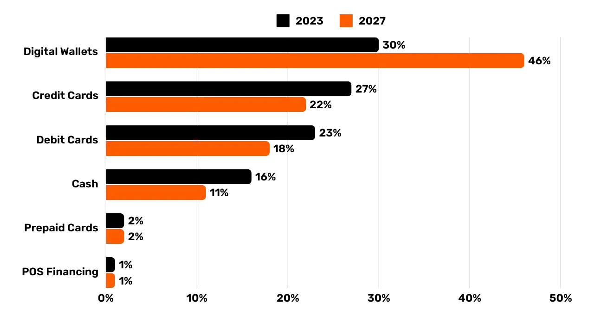

# Memulai perjalanan perusahaan Anda di jaringan bitcoin

Temukan kemampuan praktis Bitcoin dan Lightning Network, dan jelajahi bagaimana, seperti halnya internet, keduanya dapat **mengubah operasi bisnis Anda**. Dari modal digital hingga pembayaran yang cepat, ekonomis, dan terukur, Bitcoin menawarkan spektrum yang luas untuk berbagai macam kasus penggunaan untuk bisnis.

Dalam panduan ini, Anda akan belajar bagaimana memahami Bitcoin sebagai jaringan moneter global, universal, dan asli internet. Dengan karakteristik fundamentalnya yang unik, **Bitcoin memberikan peningkatan yang signifikan dibandingkan jaringan mata uang tradisional**. Anda akan menemukan mengapa dan bagaimana cara memanfaatkan Bitcoin untuk kasus-kasus keuangan klasik seperti penyimpanan modal dan sistem pembayaran. Selain itu, panduan ini akan membahas cara memperoleh dan menyimpan Bitcoin, termasuk persyaratan akuntansi dan fiskal yang terkait, serta mengimplementasikan solusi pembayaran Bitcoin sederhana atau skala besar.

Apakah Anda seorang **bisnis kecil atau perusahaan besar**, mengintegrasikan Bitcoin ke dalam operasi harian Anda dapat membuat perusahaan Anda lebih **tahan banting, produktif, dan kompetitif**. Setiap perusahaan berbasis internet akan menjadi perusahaan yang berorientasi pada Bitcoin, dan kursus ini memastikan Anda siap. Bagian awal kursus ini merangkum dasar-dasar operasi Bitcoin, jadi meskipun Anda seorang pemula, Anda akan mendapatkan pengetahuan dasar yang diperlukan untuk melanjutkan. Mempelajari dasar-dasar penemuan Satoshi selalu merupakan ide yang bagus, baik sebelum atau sesudah mempelajari BIZ101.

+++
# Pendahuluan

<partId>326cf945-5d3f-4d86-8c3e-4d1c35959799</partId>

## Masukkan perusahaan Anda ke Bitcoin

<chapterId>1be42be9-4080-49f5-b5b2-6b531dd55f5f</chapterId>

Mulailah perjalanan perusahaan Anda di jaringan Bitcoin dengan kursus pelatihan komprehensif ini - pintu gerbang untuk memahami bagaimana Bitcoin dan Lightning Network dapat merevolusi operasi bisnis tradisional. Kursus ini dirancang untuk pengecer, pengusaha, manajer, dan pengambil keputusan perusahaan yang ingin mengeksplorasi kemampuan praktis Bitcoin sebagai jaringan moneter global yang berasal dari internet dan sarana pertukaran nilai yang kuat.

Selama kursus ini, Anda akan diperkenalkan dengan prinsip-prinsip dasar yang membuat Bitcoin dan Lightning Network menjadi sangat transformatif. Anda akan belajar bagaimana teknologi ini menawarkan spektrum kasus penggunaan, mulai dari penyimpanan modal digital hingga pembayaran yang cepat, ekonomis, dan dapat diskalakan, dan bagaimana teknologi ini memberikan peningkatan penting atas mata uang tradisional dan sistem pembayaran. Kursus BIZ101 menghubungkan teori ekonomi dengan aplikasi dunia nyata, mengklarifikasi bagaimana desentralisasi dapat mengurangi ketergantungan pada perantara dan mengatasi keterbatasan yang melekat pada sistem lama.

Kursus ini dimulai dengan pemeriksaan terperinci tentang mata uang konvensional dan mekanisme pembayaran, meletakkan dasar dengan mengeksplorasi bagaimana mata uang berfungsi sebagai jaringan untuk memungkinkan perdagangan, tabungan, dan spesialisasi ekonomi. Selanjutnya, kita akan mempelajari teknologi di balik Bitcoin dan inovasi yang diperkenalkan oleh Lightning Network, mengungkapkan peran mereka dalam memfasilitasi transaksi yang mulus, aman, dan hampir seketika yang dapat melayani bisnis dari semua ukuran. Kemudian kita akan masuk ke bagian praktis dari kursus ini, dimulai dengan bagian tentang menyimpan bitcoin sebagai perbendaharaan, diikuti dengan bagian terakhir tentang menerima bitcoin sebagai alat pembayaran.

Baik Anda mewakili perusahaan kecil maupun perusahaan besar, kursus ini bertujuan untuk membekali Anda dengan pengetahuan untuk mengintegrasikan Bitcoin ke dalam operasi harian Anda, sehingga meningkatkan ketahanan, efisiensi, dan daya saing perusahaan Anda. Karena Bitcoin terus membentuk kembali lanskap ekonomi, memahami teknologi terobosan ini bukan hanya sebuah pilihan, tetapi juga kebutuhan strategis. Bersiaplah untuk terlibat dengan konten yang penuh wawasan, contoh-contoh praktis, dan panduan strategis yang akan membantu Anda menavigasi dan memanfaatkan dunia Bitcoin yang terus berkembang!

# Mata uang, sistem pembayaran, dan Bitcoin

<partId>d9bd0e21-8488-44e0-af55-6d0b934f83c2</partId>

## Mata uang tradisional

<chapterId>785e095c-6811-4ca2-ba46-fe38291432d4</chapterId>

### Mata Uang adalah Jaringan

Mata uang pada dasarnya adalah jaringan yang memungkinkan pertukaran nilai yang efisien.

Tanpa mata uang, individu harus bergantung pada **barter**, sebuah sistem di mana barang atau jasa dipertukarkan secara langsung. Barter tidak praktis karena membutuhkan "kesamaan keinginan" -kedua belah pihak harus menginginkan apa yang ditawarkan oleh pihak lain pada waktu yang sama. Contohnya, jika seorang petani yang memiliki kelebihan gandum menginginkan sepatu, mereka harus mencari pembuat sepatu yang secara khusus membutuhkan gandum. Hal ini jarang terjadi dan tidak efisien. Selain itu, **dengan n produk dalam ekonomi barter, ada ~n(n-1)/2 nilai tukar yang dibutuhkan**, menciptakan sistem yang sangat kompleks dan tidak praktis. Sebagai contoh, dibutuhkan lebih dari ~124.000 nilai tukar hanya untuk 500 produk.

Mata uang menyederhanakan hal ini dengan bertindak sebagai perantara, menciptakan **jaringan yang mengurangi jumlah nilai tukar menjadi n** -satu untuk setiap produk relatif terhadap mata uang. Hal ini membuat transaksi menjadi jauh lebih mudah dan **memungkinkan orang untuk memperdagangkan barang dan jasa tanpa harus saling membutuhkan pada saat yang bersamaan**. Alih-alih menukar gandum dengan sepatu secara langsung, petani dapat menjual gandum mereka dengan mata uang dan kemudian menggunakan mata uang tersebut untuk membeli sepatu, atau apa pun yang mereka butuhkan.

Pengenalan mata uang sebagai sebuah jaringan tidak hanya memfasilitasi perdagangan, tetapi juga memungkinkan pembagian kerja dan spesialisasi. Dengan alat tukar yang dapat diandalkan, individu dan komunitas tidak perlu lagi memproduksi semua yang mereka konsumsi. Sebaliknya, mereka dapat fokus pada apa yang mereka lakukan dengan baik, meningkatkan efisiensi dan kualitas. Seorang petani dapat berspesialisasi dalam menanam tanaman, pembuat sepatu dalam membuat alas kaki, dan pembangun dalam membangun rumah. Para spesialis ini kemudian dapat menukar barang dan jasa mereka melalui mata uang, mengambil manfaat dari keahlian masing-masing. Spesialisasi ini mendorong **produktivitas dan inovasi**, karena orang-orang menyempurnakan keahlian mereka dan mengembangkan metode baru di bidang masing-masing.

Sifat jaringan mata uang memberikan manfaat tambahan yang signifikan. Pertama, menjadi bagian dari jaringan mata uang **lebih menguntungkan daripada berada di luarnya**. Standar bersama jaringan memfasilitasi perdagangan, memungkinkan individu untuk mengoordinasikan kegiatan ekonomi mereka bahkan dalam jarak yang sangat jauh. Sebagai contoh, seorang pedagang di satu kota dapat memperdagangkan barang dengan pembeli di kota lain dengan menggunakan mata uang yang sama, mendorong pertumbuhan ekonomi dan kerja sama di wilayah yang luas.

Keuntungan penting lainnya dari mata uang adalah kemampuannya untuk **memungkinkan pertukaran yang ditangguhkan**. Dengan barter, transaksi dapat dilakukan secara langsung; satu barang ditukar dengan barang lain secara real-time. Mata uang, bagaimanapun, memungkinkan **menabung-individu dapat menyimpan nilai untuk digunakan di masa depan**. Ini merupakan lompatan besar ke depan untuk perencanaan ekonomi, investasi, dan akumulasi kekayaan, yang semuanya meningkatkan kehidupan peserta jaringan.

Kesimpulannya, mata uang adalah jaringan yang dirancang untuk memindahkan nilai secara efisien. Mata uang ini mengatasi keterbatasan barter, menyederhanakan perdagangan, dan menciptakan peluang untuk koordinasi dan penghematan. Sama seperti jaringan lainnya, nilai mata uang bergantung pada adopsi dan kegunaannya secara luas-pada akhirnya, mata uang terbaiklah yang akan menang.

### Apa itu mata uang yang baik?

Mata uang yang baik memiliki beberapa sifat penting yang membuatnya efektif untuk memfasilitasi pertukaran nilai. Berikut ini penjelasan ringkas mengenai masing-masing sifat tersebut:

- Aman**: Mata uang harus dilindungi dari pencurian atau akses yang tidak sah, memastikan pengguna dapat memegang dan mentransfernya dengan percaya diri. Keamanan sangat penting untuk membangun kepercayaan dalam sistem.
- Bukti Pemalsuan**: Mata uang harus sangat sulit atau tidak mungkin dipalsukan. Hal ini memastikan setiap unit mata uang adalah asli, mempertahankan nilainya, dan mencegah inflasi yang disebabkan oleh unit palsu yang beredar. Contohnya, secara historis, emas dihargai bukan hanya karena keindahan dan kelangkaannya, tetapi juga karena sangat sulit untuk diproduksi. Tidak seperti uang kertas atau mata uang digital, Anda tidak bisa "membuat" emas begitu saja-emas harus ditambang dari dalam bumi. Kelangkaan alami dan kesulitan produksi ini telah membantu emas mempertahankan statusnya sebagai penyimpan nilai yang tepercaya dan tolok ukur keasliannya.
- Langka**: Mata uang yang baik harus memiliki pasokan terbatas atau penerbitan yang terkontrol. Kelangkaan memastikan bahwa nilainya dipertahankan dari waktu ke waktu, mencegah produksi berlebihan, yang akan mengikis daya beli. Contohnya, suku-suku asli Amerika menggunakan manik-manik sebagai bentuk mata uang. Awalnya, manik-manik ini sulit untuk diproduksi, mempertahankan kelangkaan dan nilainya. Namun, begitu para pedagang Eropa mulai memproduksi secara massal dan membanjiri pasar dengan manik-manik, kelangkaannya lenyap. Ketika pasokan melonjak, manik-manik kehilangan daya beli mereka, merusak peran mereka sebagai penyimpan nilai yang dapat diandalkan.
- Tanpa izin**: Di masa lalu, mata uang seperti koin emas dan perak sering kali dicetak oleh perorangan, otoritas lokal, atau pedagang yang memiliki akses ke bahan baku. Sistem ini terkadang beroperasi di bawah perjanjian atau lisensi yang diberikan oleh raja atau penguasa. Seiring berjalannya waktu, raja dan pemerintah memusatkan proses ini untuk mendapatkan kontrol yang lebih besar terhadap stabilitas ekonomi, perpajakan, dan sistem moneter. Salah satu contoh yang terkenal adalah **thaler**, koin perak yang pertama kali dicetak pada tahun 1518 di Lembah Joachimsthal (sekarang Jáchymov di Republik Ceko) oleh para penambang dan pemerintah setempat. Nama "thaler" berasal dari kata Jerman **"Thal "** yang berarti "lembah" Koin-koin ini, yang dikenal karena kualitas peraknya yang tinggi, kemudian beredar luas di seluruh Eropa. Seiring berjalannya waktu, istilah ini berkembang secara linguistik dan geografis, yang akhirnya memunculkan nama "dolar", yang diadopsi di Amerika Serikat untuk mata uangnya.

Di era modern, mata uang menjadi sepenuhnya diizinkan di bawah sistem seigniorage, yang berarti hanya entitas yang berwenang-seperti bank sentral atau bendahara-yang dapat mencetak koin atau mencetak uang kertas. Individu tidak lagi diizinkan secara hukum untuk memproduksi mata uang, memastikan kontrol terpusat atas penerbitan dan pasokannya.

Saat ini, prinsip seigniorage ditantang oleh mata uang kripto Bitcoin, yang beroperasi tanpa kontrol terpusat. Bitcoin adalah sebuah sistem "tanpa izin" di mana setiap orang dapat berpartisipasi dalam menggunakan mata uang ini tanpa meminta izin, dan, melalui penambangan, dalam membuatnya. Desentralisasi ini menghilangkan monopoli penerbitan dari pemerintah, sehingga menimbulkan pertanyaan mengenai potensi kembalinya sistem mata uang kompetitif pasar bebas.

- Unit Akun**: Mata uang harus menyediakan ukuran standar untuk membandingkan nilai barang dan jasa. Hal ini menyederhanakan perdagangan dan membuat harga menjadi transparan dan konsisten di seluruh transaksi.
- Tahan lama**: Mata uang harus tahan terhadap keausan dan kerusakan dari waktu ke waktu. Mata uang fisik, seperti koin atau uang kertas, harus tahan terhadap kerusakan, sementara mata uang digital harus tetap disimpan dengan aman tanpa risiko kehilangan data.
- Mudah dibawa-bawa**: Mata uang harus mudah dibawa dan digunakan, sehingga memungkinkan perdagangan lintas jarak. Hal ini dapat dicapai melalui portabilitas fisik (koin atau uang kertas yang ringan) atau sistem transfer digital.
- Dapat dibagi**: Mata uang harus dapat dibagi menjadi unit-unit yang lebih kecil untuk memfasilitasi transaksi dalam berbagai ukuran. Fleksibilitas ini memastikan bahwa mata uang ini praktis untuk pembelian dalam jumlah kecil dan perdagangan berskala besar.
- Dapat dipertukarkan**: Semua unit mata uang harus dapat dipertukarkan dan bernilai sama. Misalnya, satu lembar uang dolar harus setara dengan uang dolar lainnya. Keseragaman ini memastikan keadilan dan kesederhanaan dalam transaksi.
- Dapat dikenali**: Mata uang harus mudah dikenali dan dipercaya. Mata uang fisik mencapai hal ini melalui desain dan fitur keamanan yang unik, sementara mata uang digital dapat mengandalkan protokol verifikasi. Hal ini memastikan penerimaan yang luas dan mengurangi risiko penipuan.

Karakteristik ini membuat mata uang menjadi praktis, dapat diandalkan, dan efisien untuk memfasilitasi perdagangan dan menyimpan nilai dalam perekonomian.

### Evolusi sistem mata uang

**Dari Koin ke Uang Kertas: Meningkatkan Efisiensi dan Portabilitas**

Transisi dari koin ke uang kertas menandai peningkatan yang signifikan dalam hal **portabilitas** dan efisiensi. Koin, yang terbuat dari logam mulia seperti emas atau perak, sangat berharga karena nilai intrinsiknya. Namun, koin itu berat, sulit diangkut dalam jumlah besar, dan mudah rusak atau dicuri. Uang kertas merevolusi jaringan mata uang dengan memperkenalkan media yang ringan, terstandardisasi, dan portabel yang merepresentasikan nilai, bukan berisi nilai. Inovasi ini memungkinkan ekonomi berkembang dengan memungkinkan perdagangan jarak jauh yang lebih mudah dan mengurangi tantangan logistik dalam menggunakan komoditas fisik sebagai uang.

Uang kertas juga meningkatkan skalabilitas. Alih-alih mengandalkan pasokan logam mulia yang terbatas, ekonomi dapat memperluas basis moneter mereka melalui mata uang representatif, yang pada awalnya didukung oleh cadangan dan kemudian oleh kepercayaan pada lembaga penerbit. Pergeseran ini membuka jalan bagi sistem keuangan yang lebih kompleks dan saling terhubung.

**Dari Uang Kertas ke Uang Elektronik: Memperluas Aksesibilitas dan Kecepatan**

Peralihan dari uang kertas ke uang elektronik semakin meningkatkan jaringan mata uang dengan meningkatkan aksesibilitas dan kecepatan. Dengan munculnya sistem perbankan, kartu kredit, dan transaksi digital, uang menjadi tidak hanya **portable** tetapi hampir **instan**. Transfer elektronik menghilangkan kebutuhan akan pertukaran fisik, memungkinkan transaksi terjadi melintasi jarak yang sangat jauh dalam hitungan detik.

Pergeseran ini juga mendemokratisasi akses ke mata uang. Perbankan elektronik dan sistem pembayaran mengurangi hambatan untuk masuk bagi individu dan bisnis, memungkinkan partisipasi dalam ekonomi global. Kecepatan dan kenyamanan uang elektronik memperluas jaringan perdagangan dan mendorong model bisnis baru yang tidak mungkin dilakukan dalam sistem berbasis kertas.

Jaringan mata uang modern ini memiliki kekurangan yang signifikan: **kurangnya kemampuan audit dan transparansi dalam mengelola jumlah uang beredar**, yang sering kali mengakibatkan inflasi yang tidak terkendali dan hilangnya kepercayaan terhadap sistem yang tersentralisasi. Sebagai contoh, lebih dari 20% dari seluruh dolar AS yang beredar dicetak dalam empat tahun terakhir saja. Godaan terus-menerus untuk menerbitkan lebih banyak mata uang - dengan demikian merendahkan nilai yang dipegang oleh pemegang saat ini - sebagian besar dapat dikaitkan dengan kelemahan sistemik: politisi sering diberi insentif untuk menghindari keputusan anggaran yang sulit, dan memilih untuk menunda tantangan bagi pemerintahan di masa depan dengan "menendang kaleng di tengah jalan."

**Dari Mata Uang Terpusat ke Mata Uang Terdesentralisasi: Meningkatkan Kepercayaan dan Kedaulatan**

Saat ini, kemunculan mata uang terdesentralisasi Bitcoin mewakili lompatan berikutnya dalam jaringan mata uang. Uang elektronik tradisional bergantung pada otoritas terpusat, seperti bank atau pemerintah, untuk mengelola dan memverifikasi transaksi. Meskipun efektif, sistem ini rentan terhadap ketidakefisienan, penyensoran, dan satu titik kegagalan. Mata uang terdesentralisasi memperbaiki sifat-sifat jaringan ini dengan mendistribusikan kepercayaan dan menghilangkan perantara. Ini juga berarti bahwa uang dapat bergerak jauh lebih cepat dan lebih murah, karena tidak ada langkah otorisasi. Akhirnya tidak ada manusia yang dapat tergoda untuk mengubah jadwal suplai mata uang Bitcoin, hal ini diberlakukan oleh perangkat lunak.

Dalam sistem terdesentralisasi, transaksi diverifikasi oleh jaringan global partisipan menggunakan teknologi blockchain, memastikan keamanan, transparansi, dan ketahanan. Struktur ini meminimalisir risiko penipuan, mengurangi ketergantungan pada otoritas pusat, dan memberdayakan individu untuk memiliki kontrol yang lebih besar atas keuangan mereka. Dengan menghilangkan hambatan geografis dan institusional, mata uang terdesentralisasi menawarkan sebuah sistem moneter yang benar-benar global dan inklusif.

**Evolusi Jaringan Mata Uang**

Setiap tahap dalam evolusi jaringan mata uang telah meningkatkan sifat-sifat utama: portabilitas, skalabilitas, aksesibilitas, kecepatan, keamanan, dan kepercayaan. Koin digantikan oleh uang kertas untuk portabilitas dan efisiensi yang lebih baik. Kertas berevolusi menjadi uang elektronik, memungkinkan akses global dan transaksi instan. Sekarang, Bitcoin mendefinisikan ulang kepercayaan dan keamanan, menciptakan sistem moneter yang terbuka dan tangguh. Perkembangan historis ini menyoroti dorongan manusia yang terus menerus untuk menciptakan jaringan yang lebih baik untuk pertukaran nilai, setiap iterasi membangun dan melampaui batasan sebelumnya.

Jaringan terbaik kemungkinan besar akan menang.

## Sistem pembayaran tradisional

<chapterId>1306196c-1e8a-454b-8e11-6887ecb3d8b4</chapterId>

Sistem pembayaran adalah metode dan infrastruktur yang memungkinkan transfer dana antara dua pihak-biasanya antara pembayar (seperti konsumen) dan penerima pembayaran (seperti bisnis). Transaksi ini dapat terjadi dalam berbagai pengaturan: konsumen membayar pedagang lokal, bisnis menyelesaikan faktur dengan pemasok, atau bahkan individu yang mentransfer uang satu sama lain. Memahami sistem pembayaran melibatkan melihat berbagai jenis metode pembayaran, karakteristiknya, dan kasus penggunaannya dalam konteks Business-to-Consumer (B2C) dan Business-to-Business (B2B).

### Jenis Metode Pembayaran yang Umum

1. **Uang Tunai:** Mata uang fisik yang dipertukarkan secara langsung antara dua pihak.

2. **Cek:** Dokumen kertas yang menginstruksikan bank untuk membayar jumlah tertentu dari rekening pembayar kepada penerima pembayaran.

3. **Transfer Kawat:** Transfer dana elektronik antar bank, sering kali digunakan untuk jumlah yang lebih besar dan pembayaran lintas batas.

4. **Kartu Pembayaran (Kredit/Debit):** Kartu plastik atau digital yang terhubung ke jaringan kartu, yang memungkinkan dana ditransfer dari rekening bank pemegang kartu (atau jalur kredit) ke merchant.

5. **Dompet Digital & Pembayaran Seluler:** Aplikasi atau perangkat yang menyimpan informasi pembayaran (misalnya, Apple Pay, WeChatPay, AliPay, PayPal), memungkinkan transfer yang cepat dan sering kali tanpa kontak.

**Penggunaan dalam B2C dan B2B:**

- B2C (Bisnis-ke-Konsumen):**
    - Konsumen sering menggunakan uang tunai, kartu, dan dompet digital untuk pembelian sehari-hari-seperti bahan makanan, belanja online, atau layanan seperti transportasi online.
    - Kecepatan, kenyamanan, dan biaya yang rendah (bagi konsumen) sering kali menjadi prioritas utama.
    - Pembayaran nirsentuh dan pembayaran seluler semakin populer di bidang ini karena kemudahan penggunaannya.
- B2B (Bisnis-ke-Bisnis):**
    - Bisnis biasanya mengandalkan transfer kawat, cek, dan sistem faktur untuk membayar pemasok, menyelesaikan tagihan dalam jumlah besar, atau menangani pembayaran berulang.
    - Fokusnya sering kali pada keterlacakan, dokumentasi, dan kemampuan untuk menangani nilai transaksi yang lebih besar.
    - Penggunaan kartu memang ada, namun cenderung kurang umum karena biaya dan batas transaksi yang lebih tinggi. Solusi digital seperti platform pembayaran terintegrasi mulai bermunculan untuk merampingkan dan mengotomatiskan proses piutang/hutang.

*Grafik: Tren Global dalam Metode Pembayaran Point-of-Sale (POS) (2023-2027), Laporan Pembayaran Global 2024, Worldpay.*

### Kerumitan di Balik Pembayaran Kartu yang Sederhana

Saat pelanggan menggunakan kartu kredit di toko, kartu tersebut dibaca oleh terminal POS, yang dengan aman mengirimkan data transaksi ke bank pengakuisisi pedagang. Pihak pengakuisisi meneruskan informasi ini ke jaringan kartu yang relevan (misalnya, Visa atau Mastercard), yang kemudian meneruskan permintaan tersebut ke penerbit-bank yang menyediakan kartu pelanggan. Penerbit memeriksa rekening atau batas kredit pelanggan dan mengirimkan kembali otorisasi melalui jaringan dan acquirer, yang memungkinkan pedagang untuk menerima pembayaran.

Transaksi yang tampaknya sederhana ini sebenarnya melibatkan lebih dari 15 langkah, 7 perantara, dan membutuhkan waktu rata-rata antara 48 jam dan 5 hari bagi pedagang untuk menerima dana. Pada hari-hari berikutnya, proses kliring dan penyelesaian terjadi. Jaringan kartu mengumpulkan transaksi hari itu dan mengkoordinasikan pertukaran dana antara pengakuisisi dan penerbit. Bank sentral memastikan keakuratan dan stabilitas penyelesaian antar bank ini. Pada akhirnya, rekening bank pedagang menerima jumlah bersih (dikurangi biaya) yang dikreditkan dari acquirer, sehingga menyelesaikan siklus transaksi.

Secara keseluruhan, proses ini rumit, memakan waktu, dan mahal untuk hal yang seharusnya merupakan tindakan sederhana untuk memindahkan nilai dari satu pihak ke pihak lain.

### Metode Pembayaran Perbandingan

| Metode Pembayaran | Otorisasi yang Dibutuhkan?           | Waktu Persetujuan Transaksi (Tampilan Pedagang) | Kecepatan Penyelesaian (Dana Sepenuhnya Diselesaikan) | Finalitas (Kemudahan Pengembalian Dana) | Jumlah Perantara | Biaya Umum (untuk Penerima Pembayaran) |

| ------------------------------ | ------------------------------- | ----------------------------------------- | ---------------------------------------------- | ---------------------------------------- | ------------------------------ | ---------------------------------- |

| **Tunai** | Tidak ada | Segera (Pertukaran Fisik) | Segera (Tanpa Penundaan Penyelesaian) | Tinggi (Tidak Dapat Dipulihkan Setelah Dibayar) | Tidak ada | Tidak ada

| Cek ** Cek** | Ya (Kliring Bank) | Penerimaan di Setoran (Tidak Dijamin) | Beberapa Hari (Proses Kliring Cek) | Sedang (Dapat Memantul/Berhenti Sebelum Kliring) | Bank ** Rendah hingga Sedang** (Biaya Bank) |

| **Transfer Bank** | Ya (Bank/Jaringan) | Konfirmasi Dalam Beberapa Jam | Hari yang Sama atau Hari Berikutnya (Domestik) | Tinggi (Biasanya Tidak Dapat Dipulihkan Setelah Dikirim) | Bank, Jaringan Pembayaran | **Sedang** (Tetap/Persentase) |

| **Kartu Pembayaran** | Ya (Otorisasi Penerbit Kartu) | Detik hingga Menit (Kode Otorisasi) | Beberapa Hari (Penyelesaian Antar Bank) | Sedang (Kemungkinan Tagihan Kembali) | Penerbit, Acquirer, Jaringan Kartu | **Berubah-ubah (1-3% dari Transaksi)** |

| **Dompet Digital/Pembayaran Seluler** | Ya (Penyedia Dompet/Bank) | Detik (Konfirmasi Instan) | Biasanya 1-2 Hari (Tergantung Sumber Pendanaan) | Sedang (Pengembalian Dana/Perselisihan Mungkin Terjadi) | Bank, Operator Dompet | **Rendah hingga Sedang (Bervariasi)** |

### Keterbatasan solusi yang ada saat ini

Industri pembayaran tradisional mewakili ekonomi tahunan sekitar 2.200 miliar dolar, kira-kira sepersepuluh dari PDB Amerika Serikat atau sama dengan PDB Perancis. Karena mata uang berfungsi sebagai jaringan yang memiliki izin, maka persaingannya terbatas, sehingga "layanan" ini lebih mirip dengan pajak yang dikenakan pada ekonomi produktif. Selain beban biaya yang ditimbulkannya, ada beberapa keterbatasan lain, seperti yang diuraikan di bawah ini.

| Batasan | Penjelasan | Dampak | Dampak

| -------------------------------- | ---------------------------------------------------------------------------------------------------------------------------------------------------------------------------------------------------------------------------------- | ---------------------------------------------------------------------------------------------------- |

| Biaya Kartu Tinggi | Biaya pertukaran (~0,3%), biaya jaringan (tetap atau 0,3%-1%), langganan terminal/PSP, dan margin bank (0,5%-1,7%) menambah biaya yang cukup besar-seperti "pajak" global terhadap sektor produktif, yang jumlahnya mencapai triliunan dolar.     | Meningkatkan biaya pedagang, mengurangi margin, dan berpotensi menaikkan harga konsumen.                  |

| Penyelesaian Akhir Sangat Lambat | Penyelesaian dana dapat memakan waktu hingga 5 hari, memperlambat aliran uang dan aktivitas ekonomi secara keseluruhan.                                                                                                                                | Menunda likuiditas untuk pedagang dan mengurangi kecepatan sirkulasi ekonomi.                        |

| Penipuan | Saluran e-commerce sangat ditargetkan oleh penipuan, yang berkontribusi pada kerugian yang signifikan (misalnya, $28 miliar). Tagihan balik dapat mencapai ~$174 miliar secara global pada tahun 2024. Mengelola perselisihan ini menghabiskan waktu dan menyebabkan ketegangan mental. | Meningkatnya biaya operasional, langkah-langkah pencegahan penipuan yang rumit, dan berkurangnya kepercayaan pelanggan.       |

| Pengabaian Keranjang | Langkah-langkah keamanan tambahan (kode satu kali, otentikasi dua faktor di bawah PSD2) menimbulkan gesekan pada saat pembayaran.                                                                                                                   | Kompleksitas checkout yang lebih tinggi menyebabkan peningkatan pengabaian keranjang dan kehilangan penjualan.                       |

| Jumlah Transaksi Minimum yang Tinggi | Ambang batas pembelanjaan minimum pada kartu dapat memaksa merchant dan konsumen ke dalam kondisi penetapan harga atau pembelian yang tidak nyaman, sehingga menghambat transaksi bernilai kecil.                                                                       | Mengurangi kepuasan dan fleksibilitas pelanggan, sehingga berpotensi membatasi pembelian impulsif atau bernilai rendah.  |

| Pra-Otorisasi Lambat | Sistem saat ini tidak dapat menangani transaksi dengan kecepatan milidetik atau mendukung aliran pembayaran yang terus menerus dan real-time.                                                                                                                   | Membatasi kasus penggunaan yang membutuhkan pembayaran instan atau streaming, sehingga membatasi inovasi dan skalabilitas. |

| Kebutuhan akan Rekening Bank/Kartu | Akses ke metode pembayaran ini membutuhkan rekening bank atau kartu yang terhubung, yang secara otomatis mengecualikan mereka yang tidak memiliki rekening tersebut.                                                                                                       | Membatasi inklusi keuangan, mengurangi akses bagi populasi yang tidak memiliki rekening bank atau yang tidak memiliki rekening bank.                 |

| Pembuatan Akun Online Berulang | Pengguna sering kali harus membuat beberapa akun online, yang menyebabkan kelelahan, berkurangnya kenyamanan, dan meningkatnya eksposur data pribadi.                                                                                                | Memburuknya pengalaman pengguna, menimbulkan masalah privasi, dan meningkatkan risiko pelanggaran data.          |

| Biaya Valuta Asing (Valas) | Kurangnya unit akun universal menyebabkan konversi mata uang yang mahal untuk transaksi lintas batas.                                                                                                                              | Menambah biaya tambahan untuk perdagangan internasional, sehingga transaksi global menjadi kurang terjangkau.             |

Sama seperti kita beralih dari membayar per menit untuk panggilan suara menjadi menggunakan komunikasi berbasis IP yang hampir gratis, kemunculan jaringan yang lebih terbuka dan efisien dapat mengubah pembayaran, mengurangi biaya dan perantara, dan mendorong model bisnis baru.

## Bitcoin untuk Bisnis: mata uang yang sedang berkembang

<chapterId>4488fe33-663f-41a3-a668-e9ca2fb7122e</chapterId>

**APA ITU BITCOIN?

Bitcoin adalah sistem pertukaran mata uang digital peer-to-peer (uang elektronik). Istilah "Bitcoin" mengacu pada komponen-komponen berikut:

- Protokol komputer** yang memfasilitasi pertukaran nilai di internet tanpa perantara, tanpa memerlukan izin, dan secara samaran. Protokol ini menggunakan prinsip-prinsip kriptografi tingkat lanjut.
- Jaringan fisik** mesin yang terhubung ke internet (node, penambang, dll.) yang dioperasikan oleh individu dan bisnis, membentuk sistem yang terdesentralisasi (tanpa otoritas pusat atau titik kontrol tunggal).
- Unit akun** di dalam sistem. Tidak akan pernah ada lebih dari 21 juta bitcoin yang ada. Setiap bitcoin dapat dibagi menjadi 100 juta unit yang disebut "satoshi", yang dinamai untuk menghormati penciptanya yang anonim.

Bersama-sama, mereka menjadikan Bitcoin sebagai aset pembawa dan mata uang digital **tanpa penerbit**. Kepemilikan dijamin hanya dengan memegang **kunci kriptografi pribadi**, memberikan kontrol penuh **tanpa perantara atau pihak ketiga yang terpercaya**. Ketika ditransfer, kepemilikan **kepastian** langsung: pemegang baru sepenuhnya memilikinya tanpa bergantung pada otoritas pusat untuk perlindungan atau konvertibilitas. Transaksi tidak dapat diubah - setelah dicatat di blockchain, transaksi tidak dapat diubah atau dihapus.

Bitcoin memiliki kebijakan moneter yang tetap, dengan **cap 21 juta bitcoin**, dimana ~19,8 juta di antaranya telah didistribusikan. Hal ini menjadikannya **deflasi**, dengan nilainya yang meningkat dari waktu ke waktu karena pengguna menyimpan tabungan dan keuntungan produktivitas di dalamnya.

Fitur teknisnya melebihi emas dan dolar, menjadikannya aset keuangan paling sulit yang pernah diciptakan. Bitcoin adalah penyimpan nilai dan alat tukar, sebuah mata uang yang sedang dibuat. Bayangkan mentransfer nilai dari satu perusahaan ke perusahaan lain dengan cepat, tanpa perantara, dengan biaya minimal, tanpa penipuan, 24/7, dan tanpa pihak ketiga yang terlibat.

Bitcoin secara efektif menjaga nilai karena buku besar Bitcoin tahan terhadap kerusakan. Nilainya meningkat karena pasokannya yang langka dan terbatas, dikombinasikan dengan semakin banyaknya peluang penukaran, didorong oleh meningkatnya jumlah pengguna.

Bitcoin bersifat disruptif karena mendorong kita untuk mempelajari konsep-konsep matematika, kriptografi, ekonomi, dan sejarah yang tidak pernah diajarkan kepada kita. Meskipun sering dianggap rumit, Bitcoin sebenarnya adalah inovasi yang dapat diakses melalui latihan dan eksperimen.

Bitcoin menantang kita untuk mempertimbangkan kembali sifat uang itu sendiri. Dapatkah Anda menjelaskan apa sebenarnya uang itu? Seorang pekerja atau pengusaha yang digaji mungkin menghabiskan 50.000 hingga 100.000 jam dalam hidupnya untuk mendapatkan uang, namun berapa banyak yang mendedikasikan 100 jam untuk memahaminya dengan lebih baik** dan melestarikannya? Bitcoin mendorong kita untuk mempertanyakan alasan mendasar di balik kebutuhan kita akan uang dan perspektif kita yang bersifat sementara. Apakah uang untuk kemewahan sesaat atau ketahanan jangka panjang? Jika kita memiliki aset yang dapat dihargai yang memungkinkan kita untuk menunda pembelian, pilihan apa yang akan kita ambil? Percakapan apa yang ingin kita lakukan dengan diri kita sendiri 20 atau 30 tahun dari sekarang?

**KARTU IDENTITAS BITCOIN**

- Usia:** 15 tahun (3 Januari 2009)
- Nilai tukar harian:** $10 miliar (> CAC40)
- Kapitalisasi pasar:** $1,8 triliun (> Meta, Visa, Silver; < Apple, Google, Gold)
- Pengguna:** ~100 hingga 200 juta (1-2% dari populasi global)
- Volatilitas:** Secara intrinsik tidak ada (1 Bitcoin = 1 Bitcoin), sangat tinggi secara eksternal (dalam pertukaran mata uang fiat)
- Kinerja:** Transaksi pertama di $0,0009; sekarang $100.000 (x100 juta)
- Ketersediaan Jaringan (uptime):** 100% sejak tahun 2013
- Dinyatakan mati atau dikritik:** Sebulan sekali

**Keajaiban Kerja Sama Manusia:**

- Sepenuhnya **sumber terbuka**
- Badan hukum:** Tidak ada
- CEO:** Tidak ada
- Investasi modal ventura:** Tidak ada
- Pemasaran:** Tidak ada
- Penelitian dan Pengembangan:** Digerakkan oleh sukarelawan
- Tata Kelola:** Oleh pengguna
- Model ekonomi yang inovatif:** Pembuatan blok disubsidi oleh biaya transaksi (berbasis lelang)

Untuk informasi lebih lanjut tentang Bitcoin, sejarahnya, cara kerjanya, dan penggunaannya, saya juga menyarankan untuk mengikuti kursus komprehensif lainnya:

https://planb.network/courses/2b7dc507-81e3-4b70-88e6-41ed44239966
## Pengantar ke Jaringan Lightning

<chapterId>c095c7ad-5469-4c7b-9510-b6c0b86244e7</chapterId>

**APA ITU PETIR?

Lightning Network adalah **protokol dan jaringan** yang memfasilitasi transaksi Bitcoin dengan interaksi minimal dengan blockchain utama Bitcoin. Begini cara kerjanya:

- Pengaturan awal:** Dana dikunci (escrow) di blockchain utama untuk membuat saluran pembayaran antara 2 pihak.
- Jaringan pembayaran:** Jaringan saluran pembayaran antara beberapa pihak membentuk jaringan pembayaran (perutean dan interkoneksi).
- Transaksi off-chain:** Transaksi yang terjadi antara para pihak tetapi tidak langsung dipublikasikan di blockchain utama Bitcoin (**"off-chain "**).
- Penyelesaian on-chain:** Hanya **saldo akhir** dari transaksi saluran yang dipublikasikan di blockchain utama Bitcoin ("on-chain**"), yang memungkinkan banyak transaksi terjadi sementara itu. Penggabungan beberapa pembayaran ini mengurangi kemacetan dan dengan demikian menurunkan biaya dibandingkan dengan melakukan banyak transaksi on-chain.
- Penutupan saluran:** Seorang pengguna dapat menutup saluran mereka kapan saja dan mendapatkan kembali Bitcoin mereka dengan mempublikasikan status transaksi terakhir. Ini adalah prinsip transaksi yang "dapat dipublikasikan" kapan saja, tetapi "tidak dipublikasikan" sampai diperlukan. Keluar (penutupan saluran) dapat dilakukan secara sepihak (diputuskan oleh salah satu dari 2 pihak kapan saja) atau diputuskan bersama (menghasilkan biaya on-chain yang lebih rendah)

Pendekatan ini menghindari kelambatan dan kerumitan dalam melakukan setiap transaksi secara langsung pada blockchain utama Bitcoin, hanya mencatat saldo akhir dan mempertahankan keamanannya. Lightning Network adalah sebuah lapisan "di atas" Bitcoin tetapi tetap terhubung dengan Bitcoin.

**Jaringan Pembayaran Global**

Protokol ini menciptakan **jaringan** mesin di mana saluran membentuk sistem pembayaran universal. Node-node ini dapat dioperasikan secara bebas oleh individu atau bisnis, menjadikannya jaringan yang sepenuhnya terbuka.

Lightning Network memungkinkan pertukaran nilai secara instan dengan kecepatan cahaya. Ini seperti protokol email yang diterapkan pada pembayaran: jaringan pembayaran generasi berikutnya. Jaringan ini secara radikal mengubah cara "uang" bergerak, menjadikannya sebebas dan secepat transmisi data di internet.

**Keunggulan Utama:**

- Kecepatan:** Transaksi instan.
- Biaya rendah:** Biaya yang jauh lebih rendah dibandingkan dengan jaringan perbankan tradisional.
- Kemudahan adopsi:** Bisnis dapat dengan cepat mengatur untuk menerima pembayaran Lightning hanya dengan menggunakan aplikasi ponsel pintar atau tombol bayar di situs web mereka.

Infrastruktur Lightning mengungguli sistem pembayaran tradisional dalam hal kecepatan, biaya, dan efisiensi energi. Dengan meningkatnya adopsi pedagang, momentumnya akan semakin cepat: jika pembayaran dapat melewati jaringan antar bank, mengapa harus terus menyerahkan persentase pendapatan yang signifikan kepada perantara saat ini?

**Kasus Penggunaan Tak Terbatas:**

Aplikasi Lightning jauh melampaui biaya rendah dan kecepatan. Dengan menawarkan jalur pembayaran yang sepenuhnya gratis dan instan, Lightning membuka peluang yang sangat besar di seluruh perekonomian.

**Meningkatkan Kemampuan Pertukaran Bitcoin:**

Lightning memperkuat peran Bitcoin sebagai "alat tukar" Dengan meningkatkan frekuensi dan kebebasan transaksi, hal ini memperkuat fungsi utama uang: memfasilitasi pertukaran ekonomi dan penciptaan nilai bagi semua peserta.

Munculnya "ekonomi mesin pintar" di masa depan akan membutuhkan sistem pembayaran yang sangat cepat dan berfrekuensi tinggi, sebuah standar teknis yang hanya dapat dipenuhi oleh Lightning. Hal ini memungkinkan terciptanya lebih banyak barang dan jasa. Karena pasokan Bitcoin tetap terbatas, daya beli setiap unit akan meningkat. Bitcoin dan Lightning akan tumbuh lebih kuat bersama seiring dengan perluasan jaringan mereka.

Lightning menawarkan sekilas tentang masa depan di mana semua bisnis yang telah menjadi berbasis internet juga akan menjadi berbasis Bitcoin.

**Pembayaran Bitcoin dengan Kilat: Kasus Penggunaan Pedagang Umum**

Lightning Network sangat ideal untuk pembayaran Bitcoin di toko fisik atau online karena kecepatan dan finalitas pembayarannya.

- Kecepatan:** Lightning (~500ms hingga beberapa detik) secara signifikan lebih cepat daripada jaringan utama Bitcoin, di mana transaksi dapat memakan waktu sekitar 30 menit untuk dikonfirmasi. Untuk pembelian dalam jumlah besar (lebih dari $1.000), jaringan utama Bitcoin mungkin masih lebih disukai, karena kecepatannya tidak terlalu penting. Akan tetapi, detail ini sering kali tidak diketahui oleh pengguna pada umumnya, karena aplikasi menangani keputusan ini dengan mulus di latar belakang.
- Finalitas:** Setelah pembayaran dilakukan di Lightning, pembayaran bersifat final. Tidak ada kemungkinan tolak bayar oleh pihak ketiga atau sengketa terkait penipuan.
- Biaya:** Biaya transaksi di Lightning Network sangat minim dan dibayarkan oleh pengguna, bukan pedagang. Pedagang hanya akan dikenakan biaya jika mereka kemudian perlu mentransfer Bitcoin mereka ke jaringan atau layanan lain.

**KARTU IDENTITAS KILAT**

- Penemuan:** 2015
- Peluncuran:** 2016
- Usia:** 7 tahun (transaksi pertama: 28 Desember 2017)
- Kemampuan teknis jaringan:** dalam skala besar dapat menangani 1.000 kali lebih banyak transaksi instan daripada sistem tradisional.
- Ukuran transaksi:** Berkisar dari yang paling besar hingga 1.000 kali lebih kecil dari sistem tradisional.
- Kecepatan transaksi:** Hingga 100 kali lebih cepat.
- Biaya:** Hingga 90% lebih rendah.
- Penyelesaian pembayaran:** Hampir seketika (biasanya ~500 milidetik, terkadang beberapa detik).
- Konsumsi energi:** ~ 8% dari sistem moneter global tradisional.
- Karakteristik:** Karakteristik
    - Peer-to-peer
    - Universal
    - Tanpa izin
    - Privasi yang baik
    - Keamanan yang terbukti
    - Ketersediaan tinggi (waktu kerja yang sangat baik)
    - Dapat dikontrol dan beradaptasi

Untuk informasi lebih lanjut mengenai cara kerja teknis Lightning Network, saya juga menyarankan untuk mengikuti kursus komprehensif lainnya:

https://planb.network/courses/34bd43ef-6683-4a5c-b239-7cb1e40a4aeb
# Bitcoin dalam perbendaharaan

<partId>bf45c1e8-af97-4b6b-af42-2866f493b14d</partId>

## Keuntungan, modal, dan kunci ketahanan bisnis

<chapterId>656ad88f-3c27-4054-a94e-b29727009b8e</chapterId>

### Perusahaan yang sehat

**Masa depan tidak pasti**, dan bisnis harus menavigasi ketidakpastian ini dengan fokus yang jelas untuk menghasilkan keuntungan dan menjaga modal. Menurut ilmu ekonomi Austria, **laba adalah sinyal utama kesehatan perusahaan** - laba menunjukkan bahwa bisnis memenuhi kebutuhan konsumen secara efisien. Tanpa laba, perusahaan tidak dapat mempertahankan dirinya sendiri, apalagi berkembang. Agar bisnis tetap sehat, bisnis tidak hanya harus menghasilkan laba tetapi juga harus berpikir ke depan, **menyimpan modal untuk investasi dan tantangan di masa depan**.

**Pelestarian modal** sangat penting karena memungkinkan bisnis untuk beradaptasi dan memanfaatkan peluang di pasar yang tidak dapat diprediksi. Hal ini melibatkan keseimbangan antara menginvestasikan kembali pendapatan untuk tumbuh dan mempertahankan penyangga keuangan untuk menghadapi potensi penurunan. Ekonomi Austria menyoroti pentingnya "preferensi waktu", yang berarti perusahaan harus secara hati-hati memutuskan seberapa besar memprioritaskan keuntungan langsung versus investasi untuk kesuksesan jangka panjang. Perusahaan yang sehat menjaga fondasi keuangannya tetap kuat, memastikan fleksibilitas di masa baik dan buruk.

Sinyal pasar seperti harga dan persaingan memandu bisnis dalam membuat keputusan cerdas tentang alokasi sumber daya. Dengan mendengarkan sinyal-sinyal ini, perusahaan dapat menghindari jebakan untuk melakukan ekspansi yang berlebihan atau melakukan investasi yang buruk-terutama yang dipengaruhi oleh faktor-faktor buatan seperti kredit yang mudah. Salah mengalokasikan sumber daya tidak hanya membahayakan kesehatan perusahaan, tetapi juga mengurangi kemampuannya untuk melayani pelanggan secara efektif.

Pada akhirnya, mempertahankan bisnis yang sehat berarti tetap mudah beradaptasi, membuat pilihan keuangan yang bijaksana, dan selalu mengawasi masa depan. **Dengan berfokus pada keuntungan, menjaga modal, dan merespons sinyal pasar, bisnis - besar atau kecil - dapat berkembang bahkan dalam menghadapi ketidakpastian**.

### Apakah Modal memiliki kebajikan?

**Bagaimana modal secara umum digambarkan**

Mari kita temukan kembali apa itu modal yang sebenarnya-sebuah istilah yang sering disalahpahami dan dipersepsikan secara negatif dalam masyarakat kita.

Dalam teori ekonomi tradisional (Keynesian), modal sering kali dilihat dalam istilah yang disederhanakan sebagai stok aset fisik atau keuangan yang homogen, terutama digunakan untuk merangsang permintaan agregat melalui investasi. Hal ini sering dikaitkan dengan konsentrasi kekayaan dan kekuatan ekonomi yang dipegang oleh segelintir elit. Dalam konteks di mana kesenjangan kekayaan terus melebar, banyak yang melihat modal sebagai simbol ketidaksetaraan ekonomi, terutama ketika akumulasi kekayaan tampaknya tidak memberikan manfaat bagi mayoritas orang.

"Kapital" sering digambarkan sebagai alat eksploitasi, dan perspektif ini telah sangat mempengaruhi berbagai gerakan yang melihat kapital sebagai sesuatu yang secara inheren bertentangan dengan kepentingan pekerja. Namun, benarkah demikian? Atau mungkinkah persepsi ini terdistorsi oleh:

1. Kurangnya pemahaman tentang mekanisme ekonomi (termasuk oleh para ekonom sendiri)?

2. Intervensionisme pemerintah dan manipulasi pasar?

3. Kebingungan antara kapitalisme kroni dan kapitalisme pasar bebas?

4. Pembingkaian media terhadap krisis ekonomi?

5. Keinginan untuk perbaikan cepat dan keadilan sosial segera?

6. Normalisasi budaya dari retorika anti-kapitalis?

Untungnya, Bitcoin memaksa kita untuk memikirkan kembali segala sesuatu dan menantang pemikiran-pemikiran yang sudah ada sebelumnya. Ada sebuah mazhab pemikiran - Mazhab Ekonomi Austria - yang dapat menjelaskan isu-isu ini dan membantu kita untuk mempertimbangkan kembali sifat modal yang sebenarnya.

**Suatu ketika**

Mari kita mulai dengan sebuah cerita pendek:

"Di sebuah pulau kecil yang sepi, hiduplah seorang nelayan yang menyendiri. Setiap hari, dia menghabiskan waktu berjam-jam untuk menangkap ikan dengan tangan kosong, sebuah kegiatan yang menghabiskan banyak waktu dan energinya. Suatu hari, dia memiliki sebuah ide: membuat tombak yang memungkinkannya menangkap ikan dengan lebih efisien. Tapi dia tahu ini akan membutuhkan pengorbanan.

Sebelum mulai membuat tombak, sang nelayan memutuskan untuk menyisihkan beberapa ikan untuk menopang dirinya sendiri selama proses pembuatan. Dia makan lebih sedikit dari biasanya selama beberapa hari, untuk menyimpan cukup banyak ikan agar bisa fokus pada proyeknya. Ikan yang disimpan ini mewakili **modal**, cadangan kecil yang memungkinkannya untuk mengejar tujuannya.

Sementara ia mendedikasikan waktunya untuk membuat tombak, ia mengandalkan cadangannya, dengan rela menunda beberapa kenyamanannya yang mendesak (cerminan dari **preferensi waktu**). Setelah beberapa hari bekerja keras, dia menyelesaikan tombak yang kokoh.

Dengan tombak tersebut, ia sekarang dapat menangkap ikan dengan lebih cepat dan dengan usaha yang lebih sedikit. Dia tidak perlu lagi menguras tenaga seperti sebelumnya dan bahkan mulai mengumpulkan kelebihan ikan. Surplus ini membuka berbagai kemungkinan baru: ia bisa menyimpannya, membagikannya, atau menginvestasikannya pada proyek-proyek lain di pulau tersebut. Dengan menunda konsumsi langsung dan memanfaatkan modalnya, nelayan tersebut telah meningkatkan efisiensi dan prospek masa depannya secara signifikan."

Kisah ini menggambarkan peran mendasar dari modal, kesabaran, dan pandangan ke depan dalam membangun masa depan yang lebih baik-konsep-konsep yang menjadi inti dari pertumbuhan ekonomi dan kemajuan manusia.

### Sekolah Ekonomi Austria dan Visi Kapitalnya

Sekolah Ekonomi Austria dinamai sesuai dengan nama para pendiri dan kontributor awalnya, yang berasal dari Austria. Nama ini melekat, dan sejak itu mazhab ini dikaitkan erat dengan pemikiran liberal klasik, yang menekankan kebebasan individu, pasar bebas, dan intervensi negara yang minimal.

**Perspektif Austria tentang Modal**

Dalam pandangan Austria, modal sangat terkait dengan ide penundaan konsumsi untuk membangun alat atau sumber daya produktif yang meningkatkan produksi di masa depan. Proses ini, yang dikenal sebagai akumulasi modal, merupakan inti dari teori ekonomi Austria. Elemen-elemen kunci dari perspektif ini meliputi:

- Preferensi Waktu dan Konsumsi yang Ditangguhkan**: Individu secara alami lebih suka mengkonsumsi sekarang daripada nanti, tetapi mereka dapat memilih untuk menunda konsumsi jika mereka mengharapkan imbalan yang lebih besar di masa depan. Dengan menabung saat ini, sumber daya dapat diinvestasikan dalam barang modal (peralatan, mesin, infrastruktur) yang meningkatkan produktivitas dari waktu ke waktu. Masyarakat atau individu dengan preferensi waktu yang lebih rendah akan menabung lebih banyak dan berinvestasi dalam proyek-proyek jangka panjang, sehingga mendorong pertumbuhan yang berkelanjutan.
- Modal sebagai Pendorong Produksi di Masa Depan**: Barang modal dipandang sebagai alat perantara yang digunakan untuk memproduksi barang konsumsi akhir. Dengan mengumpulkan modal, pengusaha dapat meningkatkan produktivitas dan menciptakan lebih banyak kekayaan di masa depan. Sebagai contoh, alih-alih memproduksi barang konsumsi secara langsung, sumber daya dapat digunakan untuk membangun pabrik atau mesin. Meskipun hal ini mengurangi konsumsi jangka pendek, efisiensi yang dihasilkan memungkinkan produksi dan kemakmuran yang lebih besar di kemudian hari.
- Produksi Tidak Langsung dan Efisiensi**: Ekonom Austria, seperti Eugen Böhm-Bawerk, menyoroti gagasan produksi tidak langsung - proses produksi yang lebih lama dan lebih kompleks yang melibatkan beberapa tahap. Meskipun proses ini membutuhkan waktu, pada akhirnya proses ini menghasilkan hasil yang lebih efisien dan produktif, seperti membangun pabrik penggergajian untuk memproses kayu daripada mengumpulkan kayu gelondongan secara manual.
- Suku Bunga sebagai Sinyal**: Suku bunga, dalam pandangan Austria, secara alami mencerminkan preferensi waktu individu. Suku bunga yang tinggi mengindikasikan preferensi untuk konsumsi segera, sementara suku bunga rendah mendorong tabungan dan investasi jangka panjang. Ketika bank sentral memanipulasi suku bunga secara artifisial, mereka mendistorsi sinyal alami ini, yang mengarah ke sumber daya yang salah dialokasikan dan investasi yang tidak berkelanjutan (malinvestasi).

**Dua Bentuk Modal dalam Perekonomian Modern**

Dalam kerangka kerja sistem moneter berbasis utang di mana kami beroperasi, **ada jenis modal kedua**: modal yang dihasilkan secara instan ketika bank menciptakan pinjaman melalui mekanisme kredit sederhana. Hal ini melibatkan penciptaan likuiditas ex nihilo, di mana bank meminjamkan uang yang sebenarnya tidak dipegangnya terlebih dahulu, melainkan diciptakan berdasarkan janji pembayaran kembali.

Di satu sisi, kapital "Austria" adalah hasil dari penghematan nyata, sebuah proses yang melibatkan keputusan ekonomi yang bijaksana dan pengorbanan yang cermat. Di sisi lain, kapital yang dihasilkan melalui penciptaan uang berbasis utang adalah sebuah konstruksi instan dan artifisial. Kedua jenis modal ini, meskipun **secara dangkal mirip dalam penggunaannya untuk membiayai proyek-proyek, pada dasarnya berbeda secara fundamental**.

Kedua bentuk modal ini tidak boleh dicampuradukkan, namun dalam sistem berbasis utang, keduanya sering kali dicampuradukkan, **mendistorsi sinyal-sinyal ekonomi** dan sering kali menyebabkan malinvestasi. Kesalahpahaman ini menjelaskan mengapa kapitalisme sering menerima kritik yang tidak beralasan

**Masalah Utama dengan Keynesianisme**

Kebijakan Keynesian, yang secara luas diadopsi oleh para elit global, memanipulasi suku bunga dan menstimulasi permintaan melalui utang. Hal ini mendorong sumber daya mengalir ke proyek-proyek jangka pendek dan tidak berkelanjutan, memperkuat siklus ekonomi dan menunda pertumbuhan sejati yang berakar pada tabungan yang sehat dan investasi yang produktif. Para pemimpin bisnis mengamati secara langsung kebijakan yang berbahaya ini karena perusahaan-perusahaan yang sehat didorong untuk melakukan akuisisi dengan nilai yang terlalu tinggi untuk mengejar keuntungan yang berlebihan, sehingga merusak pertumbuhan organik dan berkelanjutan.

Dalam lingkungan seperti itu, bagaimana modal "sehat" - yang disimpan dengan hati-hati oleh para pengusaha - dapat bersaing dengan modal "tidak sehat" yang diciptakan secara artifisial? Lebih jauh lagi, ekspansi jumlah uang beredar secara sepihak mengikis daya beli modal yang sehat, memperburuk disorientasi ekonomi dan ketidakpuasan masyarakat.

**Secercah Harapan: Bitcoin**

Bitcoin menawarkan sebuah cara untuk mengakumulasi dan mempertahankan modal dalam jangka panjang tanpa adanya erosi yang disebabkan oleh inflasi moneter. Sebagai penyimpan nilai, Bitcoin memungkinkan bisnis untuk merencanakan investasi masa depan dengan ketahanan, menantang dominasi sistem yang digerakkan oleh utang dan mendorong kembalinya akumulasi modal yang benar dan produktif.

### Lebih lanjut tentang mazhab ekonomi Austria

Mazhab Ekonomi Austria adalah sebuah tradisi pemikiran ekonomi yang menghargai pasar bebas, kebebasan individu, dan pentingnya tindakan manusia dalam proses ekonomi. Aliran ini mengkritik intervensi negara, terutama dalam hal uang dan pasar, dan berpendapat bahwa individu, yang dipandu oleh preferensi subjektif mereka, adalah penilai terbaik untuk kepentingan mereka sendiri.

**Tokoh-tokoh Kunci Mazhab Austria**

- Carl Menger**: Pendiri Mazhab Austria, Menger mengembangkan teori nilai subjektif, yang menyatakan bahwa nilai barang bergantung pada preferensi individu daripada biaya produksi.
- Ludwig von Mises**: Sebagai salah satu pionir Mazhab Austria, Mises memperkenalkan prakseologi (teori tindakan manusia) dan menulis _Human Action_, sebuah kritik mendalam terhadap sosialisme dan perencanaan terpusat.
- Friedrich Hayek**: Sebagai murid Mises, Hayek memenangkan Hadiah Nobel Ekonomi pada tahun 1974 untuk karyanya tentang desentralisasi pengetahuan dan spontanitas pasar. Dalam bukunya _The Road to Serfdom_, ia mengkritik keras kontrol terpusat.
- Murray Rothbard**: Sebagai murid Mises dan pendukung libertarianisme yang gigih, Rothbard mengembangkan teori anarko-kapitalisme, yang membayangkan masyarakat tanpa negara yang diatur oleh kontrak sukarela. Bukunya _Man, Economy, and State_ adalah karya penting dalam ekonomi Austria.

**Ekonom Berpengaruh Lainnya**

- Milton Friedman**: Meskipun tidak secara langsung terkait dengan Mazhab Austria, Friedman mendukung banyak gagasan pro-pasar dan liberal. Kebijakan monetarisnya berbeda dengan pemikiran Austria, namun memiliki kritik yang sama terhadap intervensi negara yang berlebihan dalam perekonomian.
- Frédéric Bastiat**: Seorang ekonom Prancis abad ke-19, Bastiat mempengaruhi Mazhab Austria dengan karya-karyanya tentang perdagangan bebas dan konsekuensi yang tidak terlihat dari kebijakan ekonomi. Esainya, _What Is Seen and What Is Not Seen_, adalah teks dasar liberalisme ekonomi.

*Atribusi: The Ludwig von Mises Institute*

**Kontribusi dan Gagasan Inti**

Para pemikir ini membentuk gagasan bahwa intervensi negara mendistorsi pasar dan bahwa kebebasan ekonomi sangat penting untuk kemakmuran dan koordinasi yang harmonis dari tindakan manusia. Wawasan mereka menyoroti pentingnya pengambilan keputusan yang terdesentralisasi dan bahaya kontrol terpusat dalam sistem ekonomi.

Untuk informasi lebih lanjut tentang topik ini:

https://planb.network/courses/d955dd28-b7c6-4ba2-a123-d932e21d148f
https://planb.network/courses/9d1bde6a-33e5-45dd-b7c0-94da72e45b11
https://planb.network/courses/d07b092b-fa9a-4dd7-bf94-0453e479c7df
## Menyimpan bitcoin dalam bentuk treasury

<chapterId>89622a40-d14f-4c37-a075-8e7e1731ec26</chapterId>

### Tantangan-tantangan dalam perbendaharaan perusahaan

Perbendaharaan adalah tempat di mana seseorang menaruh barang-barang berharga. Perusahaan yang sehat memiliki modal yang memadai sehingga dapat mengatasi ketidakpastian di masa depan dan merencanakan investasinya. Saat ini, sebagian dari kelebihan kas ditempatkan pada aset keuangan yang dianggap sangat "likuid", seperti obligasi, deposito berjangka, dan sebagainya.

Untuk jangka waktu yang sangat panjang, beberapa perusahaan menggunakan aset tidak likuid seperti real estat tanpa menyadari bahaya tertentu:

- Ketidaklikuiditasan jika terjadi krisis
- Pada akhirnya, imbal hasil yang dihasilkan agak rendah setelah dipotong biaya
- Imbal hasil yang tidak melebihi inflasi riil, yaitu jumlah uang beredar (~ 7% per tahun, lihat di bawah)
- Risiko tersembunyi bahwa real estat kehilangan sebagian dari fungsi "tabungan" untuk kepentingan aset seperti Bitcoin. Akibatnya, properti dapat kembali mendekati "nilai gunanya": menyediakan tempat tinggal.

Mari kita tinjau secara singkat lingkungan tempat bisnis beroperasi.

**Inflasi yang sebenarnya**: Banyak yang mengecewakan mandat mereka, bank sentral menargetkan inflasi tahunan sebesar 2%, yang berarti kehilangan 40% nilai mata uang selama 20 tahun. Ditambah dengan periode inflasi yang lebih tinggi, jelaslah bahwa perusahaan tidak dapat menggunakan mata uang saja untuk menyimpan hasil kerja mereka. Mereka harus menerapkan strategi keuangan yang kompleks, yang tentu saja disertai dengan berbagai risiko. Strategi ini jelas tidak dapat diakses oleh bisnis yang sangat kecil, yang sudah sangat sibuk dengan kegiatan inti mereka.

**Inflasi tersembunyi**: Dalam sistem moneter berbasis utang dan cadangan devisa yang didukung oleh bank sentral, jumlah uang beredar secara keseluruhan rata-rata tumbuh sekitar 7% per tahun (misalnya, M1 di Zona Euro atau AS). Ini berarti "bagian kue" Anda berkurang setengahnya hanya dalam beberapa tahun-kecuali jika Anda memiliki akses istimewa ke keran keuangan dan dapat terus tumbuh dengan memanfaatkan dan membeli aset dengan cepat pada "harga lama" sebelum uang yang baru diciptakan mendorongnya naik. Ini adalah efek Cantillon, yang sebagian menjelaskan transfer kekayaan kepada yang lebih makmur, sementara "modal" secara keliru dituding sebagai biang keladi (lihat pengantar kami tentang modal di atas).

**Risiko pihak lawan**: Sistem keuangan saat ini berisiko, dan Anda mungkin tidak selalu memiliki akses ke "uang Anda" Tanpa menggunakan gambaran rumah kartu, harus diakui bahwa lembaga keuangan memprivatisasi keuntungan dan mensosialisasikan kerugian pada saat terjadi krisis sekecil apa pun. Dalam sistem uang "kitab suci" (uang yang dicatat dalam buku besar), uang yang ada di bank hanyalah sebuah "klaim"; Anda tidak benar-benar memilikinya, dan bank-bank itu sendiri "tidak memilikinya" (cadangan pecahan). Uang ini, di satu sisi, benar-benar ajaib. Beberapa bank bergengsi yang pernah mengejek Bitcoin sudah tidak ada lagi saat ini, seperti Credit Suisse.

Kurangnya kepercayaan ini memicu kebangkitan kembali aset-aset "pembawa" seperti emas (meskipun rumit untuk diamankan, diangkut, dan dibagi, dll.) dan, tentu saja, Bitcoin, sang pendatang baru.

### Bitcoin sebagai aset keuangan

Bitcoin menawarkan alternatif yang radikal. Bitcoin merupakan aset pembawa, tanpa penerbit pusat, hampir tidak mungkin disita, dan mendapatkan keuntungan dari efek jaringan. pengguna Bitcoin yang "sejati" memilih untuk menggunakannya untuk menyimpan hasil kerja mereka, karena Bitcoin dipandang sebagai penyimpan nilai yang tahan terhadap sensor dan inflasi. Berkat efek jaringan, yang diilustrasikan oleh Hukum Metcalfe, setiap pengguna baru yang yakin akan meningkatkan nilai jaringan; seiring dengan bertambahnya jumlah partisipan, nilai guna Bitcoin meningkat secara eksponensial. Model ini menjadikannya bentuk modal yang khas dan menjanjikan, yang dibangun di atas adopsi dan kepercayaan pengguna.

Bitcoin adalah aset paling likuid di dunia, beroperasi 24/7 tanpa gangguan, tidak seperti pasar keuangan tradisional yang memiliki jam tutup dan "pemutus arus" Likuiditas ini memungkinkan pengguna untuk membeli atau menjual bitcoin kapan saja, baik dalam menanggapi berita baik atau buruk (misalnya, peluncuran rudal, perang, dll.).

Selama lebih dari satu dekade, Bitcoin telah menunjukkan pertumbuhan tahunan rata-rata lebih dari 60%. Performa unik ini memungkinkan pemegang jangka panjang untuk mempertahankan modal awal mereka, tidak seperti instrumen lainnya.

Namun demikian, ada beberapa faktor kunci yang perlu diingat:

Pertama, **kinerja masa lalu tidak menjamin hasil di masa depan**. Selama Bitcoin tetap **aman dan terdesentralisasi**, kita dapat mengharapkan apresiasi harga tahunan di atas 20% per tahun selama dekade berikutnya, menjadikannya alat perbendaharaan yang layak.

Kedua, Bitcoin sejauh ini telah mengalami **siklus 4 tahunan**, yang berarti bahwa dengan jangka waktu lebih dari 4 tahun, taruhan selalu menguntungkan. Bagi mereka yang melihat Bitcoin sebagai investasi, jangka waktu jangka pendek (<4 tahun) bisa jadi berisiko.

*MICHAEL SAYLOR: "Sinyal harga Bitcoin terbaik adalah rata-rata pergerakan sederhana 4 tahun. "* Lihat grafik di atas.

Selain itu, disarankan untuk menjaga eksposur seseorang terhadap Bitcoin agar tetap proporsional sesuai dengan tingkat pemahamannya. Penting juga untuk tidak terburu-buru atau mencoba mengatur waktu pasar dengan sempurna.

Terakhir, Bitcoin dianggap **volatile**. Tepatnya, harganya yang dinyatakan dalam satuan uang fiat. Sebagian dari volatilitas ini wajar untuk aset yang masih muda, tetapi juga diperkuat oleh kehadiran spekulan yang tidak menggunakannya sebagai penyimpan nilai jangka panjang, alih-alih mencari keuntungan cepat. Selain itu, perdagangan dengan leverage (menggunakan dana pinjaman untuk meningkatkan posisi perdagangan) menonjolkan pergerakan harga ke atas dan ke bawah, mencegah Bitcoin mengikuti jalur lurus ke atas. Hal ini menyebabkan fluktuasi yang lebih jelas, tetapi seiring berjalannya waktu, seiring bertambahnya pengguna yang berkomitmen, volatilitas ini tampaknya mulai stabil. Singkatnya, **tidak mungkin memiliki aset berkinerja tinggi seperti Bitcoin tanpa volatilitas**, tetapi Anda pasti bisa memiliki aset yang jauh lebih sedikit dengan volatilitas yang lebih rendah.

### Bitcoin diadopsi oleh Wall Street

Adopsi Bitcoin oleh institusi keuangan semakin memperkuat posisinya di pasar global.

Pernyataan terbaru dari **BlackRock** menyoroti potensi Bitcoin sebagai aset penyimpan nilai dan alat diversifikasi portofolio. Raksasa institusional global ini baru-baru ini menyatakan bahwa pertumbuhan pengguna Bitcoin melebihi pertumbuhan internet atau ponsel, terutama didorong oleh pergeseran demografi dan generasi, serta meningkatnya ketidakpercayaan terhadap lembaga keuangan tradisional (!). Karena sifatnya yang langka, tidak berdaulat, dan terdesentralisasi, beberapa investor melihat Bitcoin sebagai opsi safe haven **di saat ketidakstabilan fiskal dan moneter**, ketakutan, atau peristiwa geopolitik yang mengganggu.

ETF Spot Bitcoin yang diluncurkan pada Januari 2024, telah menikmati kesuksesan yang fenomenal - peluncuran ETF tersukses dalam sejarah - dengan arus masuk bersih hampir $ 20 miliar. dari Januari hingga November. Angka tersebut sekitar empat kali lebih baik daripada peluncuran ETF terbaik berikutnya, Nasdaq-100 QQQ. ETF ini memberikan akses yang lebih mudah dan lebih teregulasi ke Bitcoin, yang semakin melegitimasi dan menarik masuknya modal institusional yang signifikan.

ETF Bitcoin memimpin dengan selisih yang lebar dalam hal **adopsi institusional** - melampaui sepuluh ETF dengan pertumbuhan tercepat - baik dalam hal jumlah institusi yang terlibat atau ukuran aset yang dikelola (AUM). Keberhasilan ETF Bitcoin ini menggarisbawahi meningkatnya permintaan akan sarana investasi yang terkait dengan aset digital, sehingga memperkuat posisi Bitcoin dalam lanskap keuangan tradisional.

Bitcoin sekarang bermain di pasar "penyimpan nilai". Bitcoin hanya mewakili setetes air dalam ember dalam hal skala: hanya sekitar $1.800 miliar dibandingkan dengan emas yang mencapai $18.000 miliar atau real estat yang mencapai $500.000 miliar. Namun, pangsa pasarnya yang hanya sekitar 0,1% memberikan ruang yang sangat besar untuk pertumbuhan, terutama karena para pesaingnya kesulitan untuk menarik pengguna baru.

| Ticker | Aliran 1D (M USD) | Aliran 1W (M USD) | Aliran 1M (M USD) | Aliran 3M (M USD) | Aliran YTD (M USD)

| ------- | --------------- | --------------- | --------------- | --------------- | ---------------- |

| **Jumlah** | +457.19 | +1,507.95 | +2,888.01 | +3,672.29 | **+20,262.94** | |

| IBIT | +393.40 | +750.91 | +1,536.47 | +3,821.37 | +22,460.44 |

| FBTC | +14.81 | +372.40 | +627.16 | +458.71 | +10,266.69 |

| ARKB | +11.51 | +163.26 | +295.92 | -3.88 | +2,647.32 |

| BITB | +12.93 | +146.50 | +263.30 | +97.46 | +2,262.69 |

| HODL | +5.75 | +38.77 | +94.54 | +100.39 | +682.03 |

| BRRR | +1.92 | +4.72 | +17.76 | +20.54 | +540.19 |

| EZBC | +11.79 | +17.53 | +39.29 | +47.48 | +439.45 |

| BTC | .00 | -3.13 | +36.59 | +419.18 | +419.18 |

| BTCO | +6.43 | +19.25 | +47.30 | +56.41 | +394.82 |

| BTCW | .00 | +2.84 | +6.04 | +146.69 | +217.47 |

| YBIT | -1.34 | -10.26 | +5.06 | +13.81 | +76.30 |

| DEFI | .00 | .00 | .00 | -2.03 | -1.79 |

| GBTC | .00 | +5.16 | -81.42 | -1503.84 | -20,141.85 |

*$20 miliar dalam 10 bulan: ETF Bitcoin mencapai dalam waktu kurang dari satu tahun apa yang dicapai oleh ETF emas selama 5 tahun. Sumber: Arus investasi dana dalam USD. Terminal Bloomberg, Bloomberg L.P., 2024.*

### Bitcoin dalam perangkat perusahaan

Adopsi Bitcoin yang terus meningkat di Amerika Serikat juga memengaruhi pola pikir di tempat lain di dunia, terutama di kalangan profesional manajemen kekayaan yang tidak mampu lagi untuk tidak menyertakannya di antara berbagai alat mereka - terutama karena produk keuangan tradisional berkinerja buruk atau menghadapi masa-masa sulit. Hanya bank-bank tradisional yang tampaknya masih mampu mengabaikannya.

Dari perspektif keuangan murni, Bitcoin diakui sebagai aset diversifikasi. Tidak hanya tidak berkorelasi dengan kelas aset lainnya, Bitcoin juga tampak berkembang selama periode suntikan likuiditas baru - episode seperti itu tampaknya dimulai dengan penurunan suku bunga oleh ECB, The Fed, dan China.

Singkatnya, untuk kasus penggunaan yang paling umum - menginvestasikan kelebihan harta untuk jangka waktu setidaknya empat tahun - Bitcoin sangat cocok. Ada baiknya untuk menggabungkannya dengan strategi masuk bertahap: menginvestasikan jumlah yang tetap secara berkala untuk memperlancar titik masuk atau keluar.

Kasus penggunaan lain menjadikan Bitcoin sebagai aset treasury strategis, misalnya:

- Dapat menempatkan **agunan** atau likuiditas 24/7
- Dapat mentransfer ke kas perusahaan lain **dengan cepat, kapan saja**
- Lindung nilai terhadap risiko nilai tukar mata uang asing
- Membayar **pemasok** yang menerimanya, terutama dalam situasi darurat

### Apakah Bitcoin terlalu mahal?

Anda tidak perlu membeli tepat 1 Bitcoin, karena Bitcoin dapat dibagi menjadi beberapa subunit yang disebut satoshi, yang dinamai untuk menghormati penciptanya yang anonim. Satu Bitcoin setara dengan **100 juta satoshi**, yang memungkinkan pengguna untuk membeli, menjual, atau memperdagangkan bahkan dalam pecahan yang sangat kecil sekalipun. Faktanya, dalam kode sumber Bitcoin, semua transaksi dicatat dalam satoshi, dan istilah "bitcoin" hanya muncul di "coinbase", tempat transaksi khusus yang dibuat oleh para penambang untuk menerima imbalannya.

Selain itu, total 21 juta bitcoin - atau **2,1 kuadriliun satoshi** - dapat diwakili secara efisien oleh bilangan bulat 64-bit. Ini berarti bahwa meskipun harga per satu bitcoin tinggi, bitcoin tetap dapat diakses oleh berbagai investor berkat kemampuannya untuk dibagi. Oleh karena itu, Anda tidak perlu membeli seluruh bitcoin untuk berpartisipasi dalam jaringan atau berinvestasi dalam aset digital ini.

Perlu diingat bahwa total kapitalisasi pasarnya yang relatif rendah, dibandingkan dengan aset-aset lain seperti saham, emas, atau real estat, membuat kapasitasnya untuk apresiasi tetap utuh. Dengan penetrasi yang masih sangat rendah (sekitar 1% dari populasi global), kita diperkirakan baru berada di awal kebangkitannya. Hal ini menjadikannya **taruhan paling asimetris di generasi kita**: saat ini ada kemungkinan yang sangat kecil nilainya akan turun menjadi nol pada saat ini, dan kemungkinan besar nilainya akan terus menguat.

### Keputusan untuk mengalokasikan kas perusahaan dalam Bitcoin

Proses pengambilan keputusan untuk berinvestasi dalam Bitcoin akan sangat dipengaruhi oleh posisi Anda di perusahaan. Jika Anda adalah **pemilik mayoritas, Anda bebas** mengalokasikan kelebihan dana treasury menurut penilaian Anda sendiri. Sebaliknya, jika Anda adalah mitra atau pemegang saham dalam struktur pengambilan keputusan kolektif, Anda harus melalui musyawarah bersama, yang dapat memperumit masalah.

Dalam skenario kedua ini, menyelaraskan sudut pandang yang berbeda menjadi sangat penting, karena sebagian besar **tergantung pada pemahaman masing-masing pemangku kepentingan tentang aset Bitcoin**. Seperti kata pepatah: "Bitcoin adalah segala sesuatu yang tidak diketahui orang tentang komputer yang digabungkan dengan segala sesuatu yang tidak mereka pahami tentang uang." Meskipun salah satu pihak telah berusaha untuk memahami Bitcoin secara menyeluruh, menyampaikan pengetahuan ini kepada pihak lain bisa jadi merupakan sebuah tantangan. Dalam kasus seperti itu, sangat disarankan untuk membawa sumber daya eksternal untuk menghindari ide yang terlalu diidentikkan dengan satu orang, yang dapat menimbulkan penolakan.

Saat ini, skenario pemilik mayoritas yang mengambil keputusan adalah yang paling representatif di antara perusahaan-perusahaan yang memegang Bitcoin. Berikut adalah beberapa contoh nyata:

- Profesional independen**: Konsultan, praktisi kesehatan, atau pengacara yang menginvestasikan sebagian harta jangka panjang mereka dalam Bitcoin. Umumnya, para profesional ini sudah memiliki rekening tabungan atau deposito berjangka dengan imbal hasil yang kecil.
- Eksekutif sektor teknologi**: Seorang eksekutif yang menjual perusahaan mereka dan menginvestasikan sebagian dari hasil penjualan perusahaan pribadi mereka ke dalam Bitcoin beberapa tahun yang lalu. Saat ini, mereka menikmati situasi keuangan yang nyaman dan menginvestasikan kembali ke dalam usaha-usaha baru.
- Pemilik bisnis yang sangat kecil**: Pengusaha di bidang jasa, pertanian, atau industri kerajinan yang telah memahami potensi Bitcoin dan mengalokasikan sebagian harta mereka untuk Bitcoin. Motivasi utama mereka terletak pada diversifikasi dan kebebasan yang diberikannya
- Perusahaan publik** seperti MicroStrategy telah menjadi preseden dengan mengubah sebagian besar harta perusahaan mereka menjadi Bitcoin, menunjukkan pergeseran global dalam strategi alokasi modal perusahaan. Pada musim gugur tahun 2024, banyak perusahaan lain yang mengikutinya, yang semakin melegitimasi tren ini.

### Perpajakan bitcoin yang dimiliki oleh bisnis

Untuk bisnis yang tidak terstruktur sebagai badan hukum yang terpisah - seperti kepemilikan perseorangan atau entitas tidak berbadan hukum lainnya - perpajakan transaksi Bitcoin sering kali mencerminkan perlakuan yang diterapkan pada individu. Dalam banyak kasus, aturan yang sama yang mengatur keuntungan modal atau pendapatan berlaku, seperti halnya jika seseorang menjual Bitcoin. Misalnya, di beberapa negara, keuntungan dapat dianggap sebagai bagian dari penghasilan pribadi pengusaha, yang dikenakan **pajak penghasilan pribadi**.

Namun, **bisnis berbadan hukum** - mereka yang dikenakan pajak penghasilan badan - sering kali mendapatkan keuntungan dari kerangka kerja pajak yang lebih menguntungkan. Tidak seperti individu, yang mungkin menghadapi pembatasan dalam mengimbangi keuntungan dan kerugian di berbagai kelas aset, perusahaan umumnya dapat mengintegrasikan keuntungan atau kerugian yang direalisasikan dari transaksi Bitcoin secara langsung ke dalam akun laba rugi tahunan mereka. Hal ini dapat menghasilkan posisi pajak yang lebih fleksibel dan terkadang lebih menguntungkan.

Tarif dan perlakuan pajak spesifik sangat bervariasi menurut yurisdiksi. Misalnya, di Prancis dan banyak negara barat, perusahaan mungkin menghadapi tarif pajak perusahaan sekitar 25%, yang bisa lebih rendah daripada pajak tarif tetap yang dibayarkan individu atas keuntungan investasi.

Karena perbedaan-perbedaan ini, **beberapa pemilik bisnis memilih untuk membeli dan menyimpan Bitcoin melalui struktur perusahaan mereka**, karena hal ini dapat memberikan **peluang perencanaan pajak yang lebih efisien**. Seperti biasa, disarankan untuk berkonsultasi dengan profesional pajak yang memahami peraturan di yurisdiksi yang relevan untuk memastikan kepatuhan dan mengoptimalkan strategi pajak.

## Cara mendapatkan Bitcoin

<chapterId>1e6dbaf5-581a-49a4-8f37-3728e77bda17</chapterId>

### Tiga Metode Akuisisi

Ada tiga cara untuk mendapatkan Bitcoin:

- Sebagai imbalan atas barang atau jasa:**

Karena Bitcoin berfungsi sebagai alat tukar, maka dimungkinkan untuk membayangkan ekonomi sirkular. Meskipun hal ini masih belum umum saat ini, semakin banyak bisnis yang mulai menerima pembayaran dengan Bitcoin-kenapa tidak? (Lihat bab selanjutnya)

- Menambang Bitcoin:**

Hal ini melibatkan perolehan imbalan dari pengoperasian mesin-mesin pertambangan. Untuk bisnis yang tidak terspesialisasi, hal ini masih relatif kecil. Anda bisa berpartisipasi melalui perantara yang akan menjual atau menyewakan komputasi, jaringan, dan pemeliharaan kepada Anda. Jika Anda memiliki mesin tersebut, Anda dapat memperhitungkannya sebagai aset yang dapat disusutkan. Dalam skala besar, Anda perlu menghitung laba atas investasi dengan cermat karena pasarnya sangat kompetitif dan membutuhkan antisipasi biaya yang baik, terutama biaya listrik.

Untuk mempelajari lebih lanjut tentang metode penambangan, Anda dapat [lihat bagian "penambangan" di tutorial kami](https://planb.network/tutorials/mining).

- Membeli Bitcoin:**

Sejauh ini, ini adalah metode yang paling umum, dilakukan melalui bursa peer-to-peer atau, biasanya, pada platform perdagangan khusus. Namun, ketika membeli Bitcoin sebagai aset perusahaan, perusahaan harus mematuhi standar regulasi yang kuat dan prosedur Know-Your-Customer (KYC). Ketika mereka membelinya di platform perdagangan khusus, perusahaan biasanya diharuskan untuk memberikan informasi perusahaan yang terperinci, termasuk dokumen identifikasi, laporan keuangan, dan bukti alamat, untuk memenuhi persyaratan KYC dan anti pencucian uang (AML).

Untuk mempelajari cara membuka akun bisnis dan menggunakannya untuk membeli, menjual, dan mentransfer bitcoin, Anda dapat melihat dua tutorial yang dirancang khusus untuk bisnis, yang mencakup platform Kraken dan Bitfinex dalam versi korporatnya:

https://planb.network/tutorials/exchange/centralized/bitfinex-pro-c8ef7476-5f60-4205-935e-a545ced0022a
https://planb.network/tutorials/exchange/centralized/kraken-pro-07b1c16c-d517-4bf7-9a78-b42dc0f21785
Untuk mempelajari lebih lanjut mengenai metode-metode untuk mendapatkan bitcoin melalui bursa atau peer-to-peer, Anda bisa [lihat bagian "bursa" dalam tutorial kami](https://planb.network/tutorials/exchange).

### Berapa harganya?

Seperti yang telah disebutkan sebelumnya, tidak hanya mustahil untuk memprediksi harga Bitcoin di masa depan, tetapi harganya juga sangat fluktuatif dalam jangka pendek. Secara historis, strategi yang dapat diandalkan adalah mengakumulasi secara bertahap secara berkala dan mempertahankan jangka waktu empat tahun atau lebih.

### Berapa Banyak yang Harus Anda Beli?

Secara berlawanan dengan intuisi, mungkin yang terbaik adalah memulai dengan pembelian yang sangat kecil tanpa terlalu memikirkannya. Jumlah yang kecil (seperti seratus euro atau dolar) tidak akan merugikan Anda secara serius, dan pengalaman langsung akan mengajari Anda jauh lebih banyak, jauh lebih cepat, daripada membaca.

Seperti yang telah dinyatakan sebelumnya, adalah bijaksana untuk hanya menginvestasikan kelebihan likuiditas yang tidak Anda perlukan selama beberapa tahun. Strategi yang tidak dipahami dengan baik berisiko menempatkan Anda pada posisi yang sulit jika Anda tiba-tiba harus mencairkan dana pada waktu yang tidak tepat.

Selain memulai dari yang kecil, akan sangat berguna bagi perbendaharaan perusahaan untuk mengadopsi strategi alokasi yang terukur. Di salah satu ujung spektrum, beberapa perusahaan, seperti MicroStrategy, telah mengambil pendekatan ekstrem dengan mengalokasikan sebagian besar dana treasury mereka yang berlebih ke Bitcoin, yang mencerminkan keyakinan institusional yang kuat. Sebaliknya, strategi yang lebih konservatif dan bisa dibilang rasional mungkin melibatkan pengalokasian mungkin sekitar 5% dari perbendaharaan perusahaan ke Bitcoin, menyeimbangkan potensi keuntungan dengan manajemen risiko dan persyaratan likuiditas.

Bayangkan spektrum ini sebagai sebuah skala, mulai dari eksposur minimal, memastikan perusahaan memiliki likuiditas yang cukup untuk kebutuhan operasional, hingga sikap agresif yang bertujuan untuk memanfaatkan apresiasi nilai jangka panjang Bitcoin yang diantisipasi. Meskipun alokasi yang agresif dapat menghasilkan keuntungan yang lebih tinggi, alokasi yang sederhana membantu mengurangi volatilitas, memastikan fondasi keuangan perusahaan tetap aman sambil tetap mendapatkan manfaat dari potensi inovatif Bitcoin dalam operasi treasury.

### Seberapa sering?

Tidak ada aturan baku. Mencoba mengatur waktu pasar dengan berburu "dips" bisa jadi kurang efektif dan lebih menegangkan daripada membeli secara berkala. Bahkan investor berpengalaman pun terkadang salah. Melakukan "all-in" sekaligus bisa menjadi pedang bermata dua.

Pada kenyataannya, potensi apresiasi Bitcoin sedemikian rupa sehingga meskipun Anda baru memulai beberapa tahun ke depan, Anda mungkin masih akan melihat keuntungan jangka panjang. Memang, ada kemungkinan bahwa perubahan harga yang besar akan berkurang intensitasnya seiring berjalannya waktu. Namun, sebagai mata uang deflasi, Bitcoin dirancang untuk menyimpan nilai secara efektif dan merefleksikan peningkatan produktivitas penggunanya. Sebagai analogi: saat ini kita sedang berada dalam "fase peluncuran" Bitcoin, sebuah mata uang yang sedang dalam proses pembuatan, dan belum ada yang tahu nilai wajarnya. Nanti, mungkin dalam 20 atau 40 tahun, ketika sudah berada dalam "fase pelayaran" yang stabil, mata uang ini akan menjadi sangat stabil dan tumbuh dengan stabil seiring dengan peningkatan produktivitas masyarakat.

Industri real estate sering mengulang-ulang bahwa "ini adalah waktu yang tepat untuk membeli," lupa bahwa jika real estate kehilangan fungsinya sebagai penyimpan nilai - bergeser ke aset seperti Bitcoin - harga dapat kembali mendekati nilai utilitasnya (tempat berlindung). Bitcoin, sebaliknya, tidak memiliki tujuan selain sebagai penyimpan nilai, yang dapat berarti bahwa "ini adalah waktu yang tepat untuk membeli." Masa depan akan menjawabnya.

*Kredit: [Kantor Bitcoin](https://bitcoin.gob.sv/)*

### Dalam Bentuk Apa yang Harus Dibeli? (Metode Penitipan)

Anda tidak memiliki Bitcoin secara fisik. Sebaliknya, Anda memegang sebuah kunci kriptografi yang memungkinkan Anda untuk memindahkan kepemilikan sebagian atau seluruh unit akun Anda ke satu atau beberapa kunci kriptografi lainnya. Semua ini terjadi di blockchain Bitcoin, yang direplikasi di puluhan ribu node di seluruh dunia.

Kunci kriptografi ini adalah angka acak yang sangat besar. Untuk menyederhanakan pengalaman pengguna, kunci ini sering kali direpresentasikan sebagai urutan 12 atau 24 kata. Kata-kata ini dapat dimasukkan ke dalam perangkat fisik yang dikenal sebagai "dompet perangkat keras" Akan tetapi, pahamilah bahwa bitcoin tidak berada di "dalam" perangkat ini; ini hanyalah sebuah alat untuk menandatangani transaksi secara kriptografis dan menyiarkannya ke jaringan. Yang benar-benar penting adalah 12 atau 24 kata, yang harus dijaga keamanannya.

Hal ini mengarah pada masalah hak asuh: memegang Bitcoin berarti memegang kuncinya. Entah Anda memegangnya sendiri, atau Anda mendelegasikan tugas tersebut kepada pihak ketiga. Ada juga solusi perantara. Mari kita tinjau skenario yang paling umum:

- Penitipan Mandiri:**

Ini adalah opsi yang direkomendasikan oleh para penggemar Bitcoin sejati, karena sesuai dengan desain asli Bitcoin. Anda bertindak sebagai bank Anda sendiri: tidak ada risiko pihak ketiga menipu Anda, tetapi Anda bertanggung jawab untuk mengamankan kuncinya. Anda memiliki akses penuh ke dana Anda 24/7. Dalam lingkungan bisnis, jika banyak orang perlu bertransaksi, Anda memerlukan alat dan prosedur yang tepat untuk mengelola akses dan keamanan.

- Penitipan Pihak Ketiga:**

Sebagai contoh, sebuah bursa atau layanan pembelian dapat membuatkan akun untuk Anda, mengonversi mata uang tradisional Anda ke dalam Bitcoin, dan menyimpannya atas nama Anda dengan menggunakan sistem keamanan mereka. Sebagian besar layanan seperti itu memungkinkan Anda untuk menarik bitcoin Anda ke dompet yang kuncinya Anda pegang sendiri. Sampai Anda melakukannya, Anda tidak benar-benar memiliki bitcoin; Anda hanya mengandalkan janji mereka untuk membayar Anda kembali. Hal ini melibatkan keseimbangan antara risiko keamanan (milik mereka vs milik Anda) dan risiko rekanan (mereka bisa saja gagal atau menghilang). Beberapa bisnis menganggap hal ini dapat diterima, meskipun secara umum tidak disarankan untuk penyimpanan jangka panjang atau untuk 100% alokasi Anda. Layanan penyimpanan juga dapat mengenakan biaya penyimpanan.

- "Bitcoin Kertas" (ETF atau ETP):**

Ini adalah instrumen keuangan tradisional yang mewakili pecahan Bitcoin, yang mereplikasi kinerja harganya. Institusi di balik produk ini secara teoretis membeli dan menyimpan Bitcoin yang mendasarinya. Kontribusi dan penarikan dana Anda dilakukan dalam mata uang tradisional (misalnya dolar atau euro), bukan dalam Bitcoin. Kecuali untuk produk tertentu yang mengizinkan penarikan dalam Bitcoin yang sebenarnya (untuk menghindari peristiwa kena pajak di beberapa yurisdiksi), instrumen ini melibatkan biaya manajemen tahunan. Di sini, Anda bergantung pada keamanan institusi dan menghadapi risiko pihak lawan (misalnya, jika pemerintah memutuskan untuk menyita semua Bitcoin yang dimiliki institusi, seperti yang terjadi pada emas pada tahun 1933 di bawah Perintah Eksekutif AS No. 6102). Keuntungan utama mereka adalah akses yang mudah, karena didistribusikan melalui saluran keuangan tradisional. Mereka melewati kebutuhan untuk mengamankan kunci kriptografi tetapi tidak menawarkan properti yang melekat pada Bitcoin: Anda tidak dapat menggunakan jaringan Bitcoin 24/7 untuk memindahkan nilai secara bebas tanpa izin. Mereka hanya meniru kinerja keuangan, bukan fungsionalitas atau kedaulatan Bitcoin itu sendiri.

Selain itu, bentuk penyimpanan Bitcoin yang Anda gunakan juga berdampak pada langkah-langkah keamanan yang diperlukan untuk melindungi harta perusahaan Anda. Baik Anda memilih penyimpanan sendiri, menggunakan dompet perangkat keras dengan tanda tangan tunggal atau multi-tanda tangan, dll. untuk mempertahankan kontrol langsung atas kunci Anda, atau mendelegasikan tugas ini ke layanan penyimpanan pihak ketiga atau ETF, setiap opsi memiliki profil risikonya masing-masing. Contohnya, penyimpanan sendiri menawarkan akses penuh namun menuntut protokol keamanan internal yang ketat, sedangkan solusi pihak ketiga mengurangi beban manajemen dengan mengorbankan risiko mitra pengimbang. Untuk menggambarkan lebih jauh perbedaannya, grafik ini menguraikan model keamanan untuk setiap jenis kustodi, membantu Anda memilih pendekatan yang paling sesuai dengan kebutuhan organisasi Anda:

### Siapa yang Harus Dibeli?

Jika Anda memilih "Bitcoin kertas", Anda akan beralih ke lembaga keuangan seperti bank atau bursa saham online.

Jika Anda memilih untuk membeli Bitcoin yang sebenarnya melalui pasar (bursa) atau broker, Anda memiliki beberapa kategori utama:

- Platform Internasional atau Asing yang Besar:**

Contohnya termasuk Kraken, Coinbase, atau Binance, yang secara historis digunakan oleh banyak orang. Beberapa di antaranya mengalami masalah, dan sulit untuk membuat rekomendasi yang jelas. Saran kami: jika Anda menggunakannya, jangan tinggalkan bitcoin Anda di sana lebih lama dari yang diperlukan.

- Penyedia Layanan Teregulasi (Penyedia Layanan Aset Digital Terdaftar):**

Misalnya, di Prancis, platform seperti Paymium (bursa) atau BullBitcoin (pialang) dikenal sebagai penggemar Bitcoin sejati dan telah membangun rekam jejak yang solid. Di AS, Anda memiliki penyedia layanan seperti River atau Swann. Secara umum, penting untuk memeriksa silsilah penyedia layanan: reputasi, rekam jejak, popularitas dalam komunitas Bitcoin, dan apakah kepemimpinan mereka selaras dengan nilai-nilai inti Bitcoin.

**Bursa vs Pialang:**

- Sebuah **exchange** memungkinkan Anda untuk menempatkan order beli pada harga yang Anda pilih, tetapi Anda harus menunggu eksekusi hingga harga pasar dan penjual sejajar.
- Seorang **broker** menawarkan harga tetap dan dapat menyelesaikan transaksi dengan lebih cepat.

Selain biaya dan kecepatan eksekusi-yang tidak terlalu penting jika Anda berpikir jangka panjang (beberapa tahun)-bisnis juga harus mempertimbangkan:

- Antarmuka Pengguna:** Apakah platform ini ramah pengguna?
- Fitur Akuntansi:** Minimal, kemampuan untuk mengekspor riwayat transaksi dalam format .CSV.
- Kustodian dan Keamanan:** Apakah platform menyimpan bitcoin atas nama Anda, atau apakah platform mengalihkan kepemilikan kepada Anda? Bagaimana pengaturan keamanan mereka? Apakah mereka memiliki "kunci penarikan" atau batasan penarikan lainnya?
- Dukungan Pelanggan:** Kualitas, daya tanggap, dan bantuan yang dipersonalisasi, terutama saat Anda baru memulai.
- Reputasi dan Etos:** Kepercayaan dan nilai-nilai platform.
- Dukungan untuk Pembelian Berulang:** Jika Anda berencana untuk mengumpulkan Bitcoin dari waktu ke waktu dengan pembelian terjadwal.

# Solusi pembayaran Bitcoin yang disesuaikan untuk setiap bisnis

<partId>b2c8af88-6bfc-49b1-ad84-4c292c713b55</partId>

## Menggunakan bitcoin sebagai pembayaran

<chapterId>99af1203-bc84-4acc-9780-f733e7998335</chapterId>

Pertama, penting untuk memahami bahwa Bitcoin adalah sebuah disrupsi dalam skala yang sama dengan internet.

Pada masa-masa awal, jaringan internet memungkinkan untuk menghilangkan perantara dari saluran komunikasi, dan kemudian infrastruktur ini menghasilkan banyak sekali aplikasi yang sebelumnya tak terbayangkan. Saat ini, bisnis apa yang tidak memiliki kehadiran online?

Bitcoin adalah sebuah infrastruktur kepercayaan, yang aplikasi pertamanya adalah untuk menghilangkan perantara dari penyimpanan dan pertukaran nilai uang. Aplikasi-aplikasi lain yang saat ini tidak terbayangkan akan muncul pada infrastruktur ini. Kehadiran awal Anda di sini setara dengan memiliki situs web: sebuah pintu gerbang untuk pembayaran peer-to-peer dan pertukaran nilai.

Sekarang, pertimbangkan perspektif bisnis praktis yang aktivitas intinya tidak ada hubungannya dengan Bitcoin. Mengapa mereka memilih untuk menerima pembayaran Bitcoin?

- Membangun Treasury Bitcoin:**

Lihat artikel kami sebelumnya tentang membeli Bitcoin. Entah karena keyakinan atau sebagai strategi diversifikasi, beberapa profesional memilih untuk menerima pembayaran dengan Bitcoin. Beberapa Bitcoiners berpendapat bahwa semakin tidak memiliki kemampuan finansial - yang berarti tidak memiliki waktu atau alat untuk melakukan manuver keuangan yang rumit - maka semakin penting bagi bisnis tersebut untuk dibayar dengan bentuk uang yang paling sulit didapat. Dengan demikian, hal ini akan menyamakan kedudukan di lapangan, sehingga memungkinkan perusahaan kecil yang memiliki keterbatasan waktu untuk mempertahankan nilai tanpa harus terjebak dalam permainan keuangan.

- Menjangkau Demografi Baru:**

Jumlah pengguna Bitcoin terus bertambah, dan mereka memiliki daya beli yang signifikan. Mereka secara alami akan tertarik pada bisnis yang menerima mata uang mereka. Selain itu, karena ini adalah mata uang universal pertama yang berasal dari internet, Anda juga bisa menarik pelanggan internasional yang melewatinya.

- Meningkatkan Visibilitas:**

Dengan mendaftarkan bisnis Anda di platform seperti BTCmap.org, misalnya. Hanya sedikit bisnis yang saat ini menerima Bitcoin, jadi promosi dari mulut ke mulut akan menguntungkan Anda. Hal ini juga membedakan Anda dari para pesaing.

- Biaya Lebih Rendah:**

Pembayaran Bitcoin instan terjadi melalui Jaringan Lightning. **Biaya minimal dan dibayar oleh pembeli**. Tidak ada biaya terminal pembayaran, tidak ada kegagalan otorisasi pembayaran, dan tidak ada penipuan. Sebagai perbandingan, industri pembayaran (kartu, terminal, transfer, PSP, dll.) menghabiskan biaya sekitar $ 2,2 triliun per tahun secara global. Ditambah dengan tolak bayar dan penipuan, dan secara total, hampir sepersepuluh dari nilai PDB Amerika Serikat "disunat" dari bisnis-bisnis produktif di seluruh dunia hanya untuk mentransfer nilai. Apa pun bisnis Anda, biaya keuangan adalah beban yang harus dioptimalkan, dan dalam beberapa kasus, biaya yang tinggi dapat menghambat model bisnis tertentu.

- Kebebasan dan Tanpa Izin, 24/7:**

Tidak perlu meminta izin untuk menggunakan Bitcoin. Siapa pun dapat berpartisipasi dalam ekonomi dalam hitungan menit menggunakan aplikasi ponsel pintar. Anda bisa mengirim atau menerima pembayaran dari siapa pun - perorangan maupun bisnis - kapan saja, tanpa kendala penjadwalan atau penundaan.

- Memanfaatkan Jaringan Bitcoin untuk mendapatkan keuntungan:**

Anda tidak diwajibkan untuk menyimpan pembayaran Anda dalam bentuk Bitcoin-terutama jika Anda perlu membayar pemasok atau mengirimkan PPN. Beberapa layanan tertentu dapat mengonversi semua atau sebagian pembayaran Bitcoin Anda ke mata uang pilihan Anda (misalnya, euro ke IBAN Anda) dengan biaya tertentu. Dalam skenario ini, manfaat menerima Bitcoin mungkin terletak pada menarik pengguna baru atau pada keuntungan intrinsik Bitcoin (seperti biaya yang lebih rendah, operasi sepanjang waktu, dan tidak ada risiko penipuan atau tolak bayar).

### Solusi pembayaran mana yang harus Anda pilih?

Sangat mudah untuk mulai menerima pembayaran Bitcoin. Untuk memilih solusi yang tepat, pertimbangkan karakteristik transaksi yang Anda tangani: jumlah pembayaran rata-rata, frekuensi transaksi, dan apakah Anda akan menerima pembayaran secara fisik, online, atau keduanya.

Pola pikir Anda sebagai pedagang juga penting. Apakah Anda menjalankan uji coba sederhana, atau apakah Anda mengantisipasi Bitcoin menjadi sumber pendapatan yang signifikan dan berulang? Jika yang terakhir, Anda akan membutuhkan penyiapan yang kuat, komprehensif, dan dapat disesuaikan.

Jangan lupa untuk mempertimbangkan berbagai peran karyawan Anda dan lokasi mereka. Dalam skenario apa pun, ingatlah bahwa Anda harus dapat memberikan semua informasi yang diperlukan kepada akuntan Anda dan menyederhanakan proses akuntansi.

Untuk menyederhanakan proses pengambilan keputusan, kami telah menetapkan empat profil bisnis yang berbeda. Tabel berikut menguraikan karakteristik utama dan solusi pembayaran yang direkomendasikan untuk setiap profil.

### Profil bisnis

#### Profil 1 - Sang Pemula

atribut | Atribut | Pemula |

| -------------------------------- | ------------------------------------------------------------------------------------------------------------------------------------------ |

| "mencoba pembayaran fisik pertama saya", "menerima tip untuk konten online saya", "menargetkan pendapatan yang sangat kecil"

| **Frekuensi Transaksi** | "transaksi pertama untuk belajar", "menerima pembayaran sesekali"                                                                    

| Contoh Jenis Bisnis ** ** Ekonomi kreatif (pembuat konten, blog, artikel, dll.), tips sesekali, penjualan produk secara langsung, asosiasi, acara satu kali

| Jenis Pembayaran** | Umumnya beberapa sen hingga beberapa euro/dolar; di bawah ~300 euro/dolar per item

| **Kompleksitas Pengaturan** | Tidak ada |

| Contoh Solusi yang Direkomendasikan** | Dompet Lightning kustodian seperti Wallet of Satoshi atau dompet non-kustodian seperti Phoenix

| ** Antarmuka Pedagang** | Dompet Bitcoin Lightning sederhana: aplikasi di ponsel |

| Antarmuka Pelanggan ** ** Kode pembayaran QR Bitcoin, dipindai melalui dompet pribadi pelanggan

| Biaya** | Pelanggan membayar biaya Bitcoin Lightning ditambah biaya aplikasi yang berlaku

| Perangkat Penjualan** | Aplikasi ponsel pintar gratis atau opsi untuk terminal fisik (mis. Bitcoinize)

| Manajemen dan Peran** | Manajemen aplikasi tunggal; diferensiasi peran yang minimal

| **Akuntansi Ekspor** | Daftar riwayat transaksi dasar |

| **API** | Tidak |

#### Profil 2 - Yang Penting

atribut | Atribut | Hal yang Penting |

| -------------------------------- | ------------------------------------------------------------------------------------------------------------------------------------------ |

| "Saya menerima Bitcoin dalam bisnis saya, tetapi saya tidak mengharapkan volume yang berarti" | "Saya menerima Bitcoin dalam bisnis saya, tetapi saya tidak mengharapkan volume yang berarti

**Frekuensi Transaksi** **Sedikit transaksi per bulan **Sedikit transaksi per bulan

| **Contoh Jenis Bisnis** | Bar, restoran, penjualan semi-reguler produk segar atau produk yang diperoleh secara langsung, beberapa toko di bawah satu pemilik, ekonomi kreatif untuk seniman

| Jenis Pembayaran** | Umumnya berkisar antara beberapa euro/dolar hingga beberapa ratus per item; di bawah ~300 per item dan di bawah ~3.000 per bulan

| Kompleksitas Pengaturan** | Minimal (aplikasi seluler) | Minimal (aplikasi seluler)

| Contoh Solusi yang Direkomendasikan** | Swiss Bitcoin Pay |

| Antarmuka Pedagang ** ** Dompet Bitcoin Lightning sederhana: aplikasi di ponsel; faktur sederhana dengan detail minimal

| Antarmuka Pelanggan ** ** Kode pembayaran QR Bitcoin, dipindai melalui dompet pribadi pelanggan

**Biaya** | Biasanya <1% untuk mengirim ke alamat Bitcoin, dan <1,5% untuk mengonversi ke fiat

| Perangkat Penjualan** | Aplikasi ponsel pintar gratis atau opsi untuk terminal fisik (mis. Bitcoinize)

| Manajemen dan Peran** | Opsi untuk peran khusus penjualan bagi karyawan; dasbor online untuk administrasi

| Ekspor Akuntansi ** Ekspor CSV dengan detail transaksi lengkap

| **API** | Ya |

#### Profil 3 - Profesional

| Atribut | Atribut | Profesional

| -------------------------------- | ------------------------------------------------------------------------------------------------------------------------------------------------------ |

| Metode pembayaran seperti metode pembayaran lainnya untuk e-commerce saya - Atau manajemen bersama untuk sekelompok bisnis yang siap untuk volume yang lebih tinggi

**Frekuensi Transaksi** **Beberapa transaksi per hari **Beberapa transaksi per hari

| **Contoh Jenis Bisnis** | Situs e-commerce dengan volume sedang, pasar kecil, kelompok toko fisik (misalnya, Click & Collect), operasi UKM

| Jenis Pembayaran** | Umumnya berkisar antara beberapa euro/dolar hingga beberapa ratus; tidak ada batas jumlah pembayaran yang ditetapkan; kurang dari 250.000 per tahun

| Kompleksitas Pengaturan** | Ringan hingga berfitur lengkap (hosting lokal atau cloud), sering kali membutuhkan etalase e-commerce

| Contoh Solusi yang Direkomendasikan** | BTC Pay Server untuk e-commerce dan/atau lingkungan fisik; ZapRite, Musqet atau PayWithFlash untuk pembayaran, Be-BOP untuk toko elektronik terintegrasi

| Antarmuka Pedagang ** ** Situs web (seluler dan desktop) dengan pengeditan faktur, opsi keranjang belanja, dan pembuatan tombol pembayaran; faktur otomatis dengan integrasi e-commerce

| Antarmuka Pelanggan ** ** Kode pembayaran QR Bitcoin, dipindai melalui dompet pribadi pelanggan

**Biaya** | Perpaduan antara backend open-source gratis dan biaya hosting/layanan Lightning berbayar; biaya front-end termasuk biaya Bitcoin Lightning dan biaya konversi <1,5%

| Perangkat Penjualan** | Toko situs web, tampilan fisik opsional (mis. iPad yang menampilkan situs atau terminal Bitcoin)

| Manajemen dan Peran** | Toko berfitur lengkap dengan beberapa peran admin; karyawan dan pelanggan berinteraksi dengan sistem

| Ekspor Akuntansi ** Ekspor CSV dengan detail transaksi lengkap

| **API** | Ya |

#### Profil 4 - Perusahaan

| Atribut | Perusahaan | Perusahaan

| -------------------------------- | ----------------------------------------------------------------------------------------------------------------------------------------------- |

| Metode pembayaran yang strategis untuk bisnis - Dengan beberapa pengembangan untuk diintegrasikan ke dalam platform layanan sesuai spesifikasi tertentu

| Frekuensi Transaksi** | Frekuensi transaksi tak terbatas dan berfrekuensi tinggi

| **Contoh Jenis Bisnis** | Perusahaan menengah, perusahaan layanan TI, perusahaan besar, pasar utama |

| Jenis Pembayaran** | Ukuran atau volume apa pun |

| Kompleksitas Pengaturan** | Sedang hingga tinggi, tergantung pada pilihan arsitekturnya

| Contoh Solusi yang Direkomendasikan** | Arsitektur atau orkestrasi yang dibuat khusus untuk solusi yang dihosting SaaS, berpotensi menggunakan layanan LSP (*Lightning Service Provider*) pihak ketiga

| Antarmuka Pedagang ** ** Antarmuka Pedagang** ** Antarmuka front-end dan back-end yang sepenuhnya disesuaikan dan terintegrasi sepenuhnya ke dalam alur kerja dan proses bisnis

| Antarmuka Pelanggan** *** Mulai dari kode pembayaran Bitcoin QR hingga UI dan/atau integrasi API yang sepenuhnya disesuaikan

| Biaya ** Kombinasi pengembangan internal dan biaya pihak ketiga; pelanggan membayar biaya Bitcoin Lightning ditambah biaya transaksi dari penyedia layanan

| Perangkat Point of Sale** | Solusi yang dirancang khusus yang disesuaikan dengan lingkungan perusahaan

| Manajemen dan Peran** | Peran yang sepenuhnya disesuaikan di seluruh bagian penjualan, administrasi, pengembangan, akuntansi, dan keuangan

| Ekspor Akuntansi ** Ekspor Akuntansi ** Ekspor akuntansi yang disesuaikan sepenuhnya

| **API** | Ya |

Pada bab-bab berikutnya, kami akan merinci setiap profil bisnis dan solusi yang disesuaikan dengan masing-masing profil bisnis tersebut.

## Pemula

<chapterId>7edda53d-5b9f-432a-8493-115de8c94a67</chapterId>

Profil Pemula dirancang untuk bisnis, kreator, dan individu yang ingin mengeksplorasi pembayaran Bitcoin tanpa harus mengeluarkan sumber daya atau keahlian yang besar. Mereka biasanya adalah orang-orang yang menangani volume transaksi yang sangat kecil (mungkin beberapa tip, donasi, atau penjualan sesekali) dan mencari pengenalan yang sederhana dan ringan terhadap ekosistem Bitcoin dan Lightning Network. Nilai utama dari pendekatan Starter terletak pada penyiapannya yang minimal: dalam banyak kasus, yang dibutuhkan hanyalah smartphone atau tablet yang dilengkapi dengan dompet dasar yang kompatibel dengan Lightning.

Salah satu fitur yang menentukan dari profil ini adalah fokusnya pada pembayaran bervolume rendah yang jarang melebihi beberapa ratus euro atau dolar per bulan. Skala yang sederhana ini menjadikannya pilihan yang sangat baik bagi siapa saja yang ingin menguji pasar dengan Bitcoin, tanpa kerumitan yang melekat pada penerapan volume yang lebih tinggi. Selain itu, hal ini memungkinkan pembelajaran langsung; karena tekanan operasional yang lebih sedikit dan risiko moneter yang lebih kecil, kesalahan dapat diatasi, dan pelajaran dapat dipelajari dengan cepat. Mulai dari seniman yang menjual kerajinan tangan di pameran akhir pekan hingga kelompok nirlaba yang menerima sumbangan satu kali, pengguna dalam kategori ini sering kali menekankan aksesibilitas dan kemudahan penggunaan daripada fungsi-fungsi tingkat lanjut.

Dua pengaturan dompet yang paling umum untuk profil Pemula melibatkan penentuan antara solusi kustodian dan non-kustodian. Dompet kustodian (seperti Wallet of Satoshi atau Blink) memungkinkan layanan pihak ketiga untuk mengelola kunci pribadi dan operasi backend, sehingga mengurangi tanggung jawab teknis bagi pengguna. Pengaturan ini sangat menarik bagi mereka yang menghargai kenyamanan di atas segalanya dan menginginkan proses orientasi yang sesederhana mungkin. Di sisi lain, dompet Lightning non-kustodian (seperti Phoenix atau Breez) menempatkan kunci pribadi dan kontrol penuh di tangan pemilik bisnis, menawarkan otonomi dan privasi yang lebih besar sebagai imbalan atas upaya awal yang sedikit lebih banyak. Dalam kedua kasus tersebut, antarmuka modern biasanya sangat ramah pengguna sehingga siapa pun dapat menangani tugas-tugas penting (membuat kode QR, memasukkan jumlah pembayaran, dan mengonfirmasi transaksi) dalam hitungan menit.

Walaupun masalah keamanan mungkin terlihat tidak terlalu mendesak ketika transaksi yang dilakukan kecil, tetap saja sangat penting untuk melakukan langkah-langkah perlindungan dasar. Bahkan sebuah ponsel pintar atau tablet yang digunakan untuk menerima pembayaran Bitcoin harus dikunci dengan kata sandi atau keamanan biometrik, dan prosedur pencadangan (mulai dari melacak kredensial login untuk dompet kustodian sampai dengan menjaga seed phrase untuk dompet non-kustodian) harus dilakukan dengan serius. Anggota staf yang menangani transaksi secara fisik akan mendapatkan keuntungan dengan mengetahui dasar-dasarnya: cara membuka aplikasi, cara menunjukkan kode QR kepada pelanggan, dan cara memeriksa apakah pembayaran telah diterima.

Akuntansi dan pelaporan, meskipun relatif sederhana di bawah profil Pemula, masih memerlukan pertimbangan yang cermat. Walaupun volume transaksi mungkin minimal, menyimpan catatan yang akurat dapat mencegah kebingungan di kemudian hari dan membantu menjaga transparansi dalam hal audit keuangan atau pengajuan pajak. Banyak aplikasi dompet yang memungkinkan pengguna untuk mengekspor riwayat transaksi dasar sebagai sebuah file CSV; untuk sebuah perusahaan kecil atau pengusaha tunggal, menyimpan file-file ini secara teratur dapat membuat rekonsiliasi akun menjadi lebih mudah. Juga merupakan hal yang bijak untuk melacak perkiraan nilai fiat (misalnya, dalam euro atau dolar) pada saat setiap transaksi diterima. Karena harga Bitcoin dapat berfluktuasi, memiliki catatan nilai konversi sangat berharga untuk pembukuan dan kepatuhan pajak.

Untuk bisnis yang ingin melengkapi pembayaran fisik atau secara langsung dengan donasi atau tip online, sekarang sangat mudah untuk mengintegrasikan tombol tip Lightning atau widget donasi ke dalam situs web atau blog. Platform seperti BTCPay Server menawarkan tombol pembayaran yang mudah dikonfigurasi, sementara beberapa media sosial dan layanan streaming langsung sudah mendukung tip Lightning dengan alamat. Akibatnya, bahkan perusahaan Pemula pun dapat membangun jaringan pelanggan yang sederhana namun global. Sementara itu, mereka yang memilih untuk tidak menyimpan Bitcoin dalam jangka panjang dapat mengeksplorasi konversi parsial atau otomatis ke dalam mata uang fiat menggunakan dompet kustodian tertentu atau layanan pihak ketiga. Meskipun opsi ini melibatkan biaya tambahan dan kemungkinan kewajiban KYC, opsi ini membantu bisnis menghindari volatilitas nilai tukar dan mempertahankan alur kerja keuangan yang ada dengan gangguan minimal.

Sebuah contoh penggunaan sederhana menggambarkan bagaimana semua elemen ini bersatu. Bayangkan seorang pengrajin lokal yang menjual selai buatan sendiri di pasar petani pada hari Sabtu. Berbekal ponsel yang menjalankan dompet Lightning kustodian, mereka menetapkan harga setiap stoples dalam euro; ketika pelanggan meminta untuk membayar dalam Bitcoin, pedagang dengan cepat memasukkan jumlah fiat yang sesuai, dan aplikasi secara otomatis menghitung jumlah yang harus dibayar. Kode QR yang dihasilkan dipindai oleh dompet pelanggan, pembayaran diselesaikan dalam hitungan detik, dan pengrajin langsung tahu bahwa transaksi berhasil. Di akhir hari, setiap detail transaksi dapat diekspor untuk pencatatan, dan saldo hari itu dapat dikirim seluruhnya atau sebagian ke platform pertukaran untuk dikonversi ke mata uang fiat.

Dengan menyeimbangkan alat bantu yang mudah digunakan, kebutuhan perangkat keras minimal, dan pencatatan yang mudah, solusi Starter memberikan hal-hal penting tanpa membebani bisnis pendatang baru. Jika volume transaksi meningkat dan kebutuhan operasional bisnis berkembang, peningkatan ke kategori yang lebih canggih yang dirinci dalam bab mendatang menjadi perkembangan yang wajar.

Untuk tutorial terperinci mengenai wallet yang direkomendasikan dan pengaturan dasar, silakan baca panduan berikut ini:

**Dompet/simpul LN kustodian mandiri:**

https://planb.network/tutorials/wallet/mobile/phoenix-0f681345-abff-4bdc-819c-4ae800129cdf
https://planb.network/tutorials/wallet/mobile/Bitkit-Wallet-a7224674-85c4-4045-9baf-37018d89550c
https://planb.network/tutorials/wallet/mobile/breez-46a6867b-c74b-45e7-869c-10a4e0263c06
https://planb.network/tutorials/wallet/mobile/blixt-04b319cf-8cbe-4027-b26f-840571f2244f
https://planb.network/tutorials/wallet/mobile/zeus-3e89603c-501d-439c-8691-d4a0d0de459b
**Dompet LN Kustodian:**

https://planb.network/tutorials/wallet/mobile/wallet-of-satoshi-c4792842-b046-44f9-a6f1-351191b7cc2b
https://planb.network/tutorials/wallet/mobile/blink-7ea5f5a4-e728-4ff9-b3f9-cf20aa6fc2bd
## Yang Penting

<chapterId>89be421f-f7df-4bcc-a9e4-df96e39ef249</chapterId>

Profil Essential cocok untuk usaha kecil dan menengah, yang mungkin memiliki karyawan, yang ingin menerima Bitcoin dengan mudah dan cepat tanpa memerlukan pengetahuan teknis tingkat lanjut, namun tetap memiliki sistem yang lebih lengkap dan profesional dibandingkan dengan dompet sederhana. Kategori ini paling sering digunakan oleh restoran, kafe, bar, atau toko ritel kecil yang hanya menerima sedikit pembayaran Bitcoin setiap bulannya, namun menginginkan sebuah antarmuka yang mudah dan cukup kuat untuk menangani operasi sehari-hari tanpa gangguan.

Tidak seperti profil Starter, bisnis Essential biasanya menganggap pembayaran Bitcoin sebagai bagian yang berkelanjutan dari aliran pendapatan mereka, bukan hanya sebagai percobaan. Mereka masih beroperasi dengan volume transaksi yang relatif rendah, tetapi frekuensinya cukup sehingga pemilik dan karyawan mendapatkan keuntungan dari sistem yang lebih terstruktur dan andal. Pada saat yang sama, profil Essential tetap berfokus pada kesederhanaan; meskipun memungkinkan dasbor yang praktis dan manajemen peran yang terbatas, profil ini tidak memerlukan sumber daya TI khusus atau integrasi yang rumit.

Rekomendasi teknologi di segmen ini sering kali berpusat pada **Swiss Bitcoin Pay**, sebuah solusi yang disederhanakan bagi para pedagang untuk menerima pembayaran Bitcoin dengan mudah. Solusi ini memiliki aplikasi PoS yang mudah digunakan, tidak memerlukan keahlian teknis bagi karyawan. Tidak seperti dompet Bitcoin standar, dompet ini hanya berfokus pada penerimaan pembayaran, sehingga karyawan dapat menggunakan perangkat ini tanpa risiko keamanan. Beberapa aplikasi PoS dapat terhubung ke akun yang sama, dapat digunakan pada tablet, register, smartphone, atau melalui versi web untuk komputer, mendukung Android dan iOS. Anda juga bisa membuat menu dengan item yang Anda jual dan harga yang terkait, sehingga karyawan cukup memilih sekeranjang barang untuk pelanggan di PoS dan kemudian menagih totalnya.

Pembayaran dapat ditarik dalam Bitcoin ke alamat tertentu atau dikonversi ke mata uang fiat dan disetorkan ke rekening bank setiap hari. Swiss Bitcoin Pay mengotomatiskan prosesnya, menangani pembayaran Bitcoin dan Lightning Network tanpa intervensi manual. Dana disimpan selama maksimal 24 jam sebelum ditransfer. Meskipun tidak sepenuhnya non-kustodian seperti BTCPay Server, Swiss Bitcoin Pay menyeimbangkan kenyamanan dan keamanan, dan tidak memerlukan KYC.

Biaya kompetitif: 0,21% untuk tahun pertama, kemudian 1% untuk pembayaran Bitcoin dan 1,5% untuk pembayaran konversi fiat, termasuk biaya transaksi Bitcoin. Swiss Bitcoin Pay menawarkan jalan tengah yang praktis antara solusi kustodian seperti Open Node dan sistem yang dihosting sendiri yang kompleks seperti BTCPay Server, yang memprioritaskan kesederhanaan, keamanan, dan otonomi keuangan.

Jenis pengaturan ini memungkinkan bisnis langsung untuk membuat faktur pembayaran dengan cepat, menunjukkan kode QR kepada pelanggan mereka, dan menerima transaksi Lightning atau on-chain dengan gesekan minimal. Staf hanya perlu orientasi singkat untuk menangani pembayaran ini, sementara manajer dapat masuk ke dasbor online untuk merekonsiliasi penjualan harian dan mengakses laporan dasar. Ketersediaan konsol administratif yang efisien juga membantu perusahaan yang lebih kecil melacak pendapatan fiat dan kripto dari satu antarmuka, sehingga mengurangi kebingungan dan mengurangi waktu yang dihabiskan untuk pembukuan manual.

Manfaat utama lainnya dari pendekatan Essential adalah penekanan pada penerapan yang cepat dan gangguan minimal. Solusi seperti Swiss Bitcoin Pay dapat disiapkan dalam hitungan jam, bukan hari atau minggu. Untuk pemilik atau manajer restoran yang tidak terlalu sibuk, misalnya, tujuan akhirnya adalah mengintegrasikan penerimaan Bitcoin tanpa menyebabkan penundaan di kasir atau kebingungan di antara para staf. Setelah POS dikonfigurasikan, manajer dapat dengan mudah memberikan instruksi singkat kepada karyawan untuk menampilkan faktur dan memverifikasi bahwa pembayaran telah selesai. Dalam skenario terbaik, transaksi pelanggan dikonfirmasi hampir seketika melalui Lightning Network, dan panel administratif bisnis secara bersamaan mendaftarkan pembayaran baru secara real time.

Meskipun profil Essential tidak menuntut sistem akuntansi yang sangat canggih, tetaplah bijaksana untuk menyimpan catatan transaksi yang tepat. Alat-alat seperti Swiss Bitcoin Pay menawarkan fungsi ekspor CSV, yang memungkinkan manajer untuk menangkap nilai setara fiat dari setiap penjualan Bitcoin dan melacaknya bersama dengan sumber pendapatan lainnya. Tingkat dokumentasi ini cukup untuk sebagian besar bisnis kecil, dan pemahaman dasar tentang nilai tukar akan membantu dalam pengajuan pajak dan pengawasan keuangan secara umum.

Solusi hibrida yang paling cocok untuk profil Anda kemungkinan adalah Swiss Bitcoin Pay:

https://planb.network/tutorials/merchant/merchant/swiss-bitcoin-pay-2-a78b057e-ed11-47ac-860c-71019fcb451a
Solusi lain yang mudah diimplementasikan, tetapi dengan kekurangan karena 100% kustodian, adalah Open Node:

https://planb.network/tutorials/merchant/merchant/open-node-e69a0c1c-47f7-4932-8494-e6f26c3c9784
Jika Anda siap mengotori tangan Anda dan menginginkan kontrol penuh atas prosesnya, perangkat lunak BTCPay Server adalah pilihan yang sangat baik. Namun, kelemahan utama BTCPay Server adalah pengaturan dan pengelolaannya memakan waktu dan membutuhkan tingkat keahlian teknis tertentu, tetapi Anda dapat mengikuti panduan kami:

https://planb.network/tutorials/merchant/merchant/btcpay-server-928eb01e-824b-4b57-a3e8-8727633beddc
Terakhir, sebagai pelengkap tempat penjualan fisik, Anda dapat mempertimbangkan untuk membuat [Bitcoinize PoS] (https://bitcoinize.com/).

## Profesional

<chapterId>4d5dfa50-c4d0-481c-ab95-1863a898750e</chapterId>

Profil Profesional ditujukan untuk bisnis yang telah beralih dari pembayaran Bitcoin sesekali atau bervolume rendah dan sekarang mencari infrastruktur yang kuat untuk menangani beberapa transaksi harian. Perusahaan-perusahaan ini sering kali beroperasi di beberapa saluran (mungkin lokasi ritel, situs web e-commerce khusus, dan bahkan penjualan seluler) dan oleh karena itu membutuhkan solusi pembayaran yang dapat diintegrasikan dengan mulus ke dalam alur kerja yang sudah ada. Dalam banyak kasus, perusahaan pada level ini sudah mengelola sistem point-of-sale, platform manajemen pesanan online, dan operasi back-office yang menuntut pendekatan yang dapat diandalkan dan dapat diskalakan.

Salah satu karakteristik yang menentukan dari pedagang Profesional adalah kebutuhan akan **fitur canggih** dan **solusi yang dapat disesuaikan** yang menjaga efisiensi bahkan ketika volume transaksi meningkat. Tidak seperti pengguna Essential, yang mungkin puas dengan alat yang ramping dan pas di aplikasi ponsel pintar, bisnis Profesional biasanya menuntut fitur-fitur seperti penyesuaian faktur yang mendetail, dasbor pelaporan yang canggih, dan kemampuan untuk menetapkan beberapa peran administratif.

Sebuah grup restoran, misalnya, mungkin memiliki anggota staf yang didedikasikan untuk membuat faktur dan manajemen stok, sementara tim terpisah mengawasi daftar produk dan kampanye pemasaran. Dalam lingkungan seperti ini, solusi pembayaran Bitcoin harus sesuai dengan struktur organisasi yang sudah ada sebelumnya.

Mengenai teknologi dan alat, solusi seperti **BTC Pay Server** sering kali menjadi inti dari pengaturan Profesional. BTC Pay Server adalah platform sumber terbuka yang dapat digunakan di tempat atau melalui hosting cloud dan menawarkan opsi integrasi yang luas untuk situs web dan platform e-commerce. Dengan menjalankan instance mereka sendiri, bisnis mempertahankan tingkat kontrol yang tinggi atas setiap aspek aliran pembayaran, dari halaman checkout yang dibuat secara otomatis hingga pemberitahuan yang memicu proses internal setelah pembayaran dikonfirmasi.

Selain itu, alat bantu seperti [Zaprite] (https://zaprite.com/) atau [Musqet] (https://musqet.tech/) dapat menyempurnakan pengalaman pembayaran lebih lanjut, yang memungkinkan kustomisasi yang lebih terperinci (dari pilihan merek hingga kemampuan pelaporan yang canggih). Mereka yang lebih memilih lingkungan ritel online yang lengkap dapat memilih [Be-BOP] (https://be-bop.io/), sebuah solusi toko elektronik yang dibuat untuk memfasilitasi pembayaran Bitcoin tanpa mengorbankan kemudahan penggunaan.

Menerapkan teknologi ini dalam lingkungan profesional berarti memperhatikan **kompleksitas operasional**. Alur kerja faktur otomatis, tampilan multi-mata uang, dan sinkronisasi dengan sistem inventaris yang ada adalah ciri khas dari platform yang terintegrasi dengan baik. Kemampuan untuk mengekspor data transaksi secara tepat (baik sebagai file CSV, panggilan API langsung, atau format yang disesuaikan) membantu bisnis merekonsiliasi penjualan bitcoin dengan aliran pendapatan lainnya secara efisien.

Keamanan dan manajemen peran merupakan pertimbangan penting lainnya bagi pengguna Profesional. Ketika transaksi Bitcoin harian terakumulasi, mengendalikan akses ke fungsi administratif menjadi langkah mitigasi risiko yang penting. Dalam banyak solusi, administrator dapat memberikan berbagai tingkat izin (mungkin membatasi beberapa karyawan untuk melihat riwayat transaksi dan membuat faktur, sementara memberikan otoritas kepada orang lain untuk mengelola inventaris atau mengonfigurasi pengaturan di seluruh sistem...). Struktur hirarkis ini tidak hanya melindungi data sensitif, tetapi juga merampingkan operasi dengan memperjelas anggota staf mana yang bertanggung jawab untuk setiap segmen infrastruktur pembayaran.

Untuk contoh di dunia nyata, pertimbangkan sebuah toko e-commerce berukuran sedang yang mengkhususkan diri pada aksesori teknologi. Perusahaan dapat mengintegrasikan BTC Pay Server ke dalam etalase online yang sudah ada, yang secara otomatis menghasilkan alamat pembayaran Bitcoin saat pembayaran. Pelanggan menyelesaikan pembelian mereka dengan memindai Lightning atau alamat on-chain, dan platform toko langsung mengonfirmasi pembayaran. Pada saat yang sama, sistem internal memperbarui status pesanan dan memicu pemberitahuan pengiriman. Berkat fitur pelaporan yang canggih, tim keuangan dapat dengan mudah meninjau penjualan Bitcoin harian, mengekspor buku besar konsolidasi untuk diaudit, dan melacak nilai kepemilikan BTC yang diputuskan untuk disimpan oleh perusahaan.

*[Kredit: Toko Bitcoin Bazar di Paris, Prancis.] (https://bitcoinbazar.fr/)*

Untuk mempelajari lebih dalam tentang implementasi spesifik dan menjelajahi konfigurasi langsung BTC Pay Server, lihat kursus berikut ini:

https://planb.network/courses/6fc12131-e464-4515-9d3f-9255365d5fa1
## The Enterprise

<chapterId>80fb2659-81ca-4a11-b492-72c7ae5774f9</chapterId>

Profil Enterprise berada di puncak implementasi pembayaran Bitcoin, yang dirancang khusus untuk perusahaan besar, pasar utama, dan bisnis mapan yang menuntut solusi yang sepenuhnya disesuaikan. Tidak seperti penerapan skala kecil atau tingkat menengah, operasi tingkat Enterprise mengintegrasikan pembayaran Bitcoin ke dalam permadani alur kerja dan sistem yang luas, mulai dari perangkat point-of-sale di tempat hingga etalase e-commerce, platform akuntansi back-office, dan kerangka kerja ERP yang canggih.

Pada skala ini, tujuan utamanya bukan hanya untuk menerima Bitcoin, tetapi untuk melakukannya dengan cara yang benar-benar **selaras dengan proses inti organisasi**. Penyelarasan ini mungkin memerlukan pengembangan perangkat lunak khusus, baik solusi yang sepenuhnya dipesan lebih dahulu atau diatur melalui infrastruktur berbasis SaaS yang didukung oleh *Lightning Service Provider* (LSP) pihak ketiga. LSP semacam itu dapat menangani volume transaksi yang tinggi dan konfigurasi jaringan yang kompleks yang melebihi kapasitas alat yang lebih konvensional. Oleh karena itu, arsitektur yang dihasilkan menggabungkan beragam pertimbangan teknis dan bisnis, mulai dari integrasi berbasis API hingga kemampuan manajemen treasury yang canggih.

Dalam konteks perusahaan, kompleksitas operasional menjadi sangat jelas. Sebuah perusahaan besar mungkin perlu mengakomodasi beberapa departemen (penjualan, pemasaran, devops, keuangan, dan akuntansi) yang masing-masing memiliki tanggung jawab dan kebutuhan data yang berbeda. Dalam skenario ini, platform pembayaran Bitcoin harus menawarkan manajemen peran yang sangat terperinci, yang memungkinkan setiap departemen untuk mengakses fungsi-fungsi yang relevan dengan tugas-tugas mereka dengan tetap menjaga kontrol yang ketat terhadap keamanan dan integritas data. Yang tidak kalah penting adalah kapasitas untuk menyesuaikan alur kerja: misalnya, pembayaran masuk dapat memicu pembaruan dalam sistem inventaris, mengirimkan notifikasi otomatis kepada manajer penjualan, dan memperbarui entri buku besar untuk tim keuangan, semuanya secara real time. Perangkat point-of-sale sendiri biasanya disesuaikan dengan lingkungan perusahaan, dengan antarmuka perangkat lunak khusus yang sesuai dengan merek dan kebutuhan operasional perusahaan.

**Keamanan adalah hal yang sangat penting untuk bisnis skala perusahaan. Volume transaksi yang tinggi dan jumlah Bitcoin yang berpotensi besar membutuhkan infrastruktur yang kuat yang mampu bertahan dari serangan jahat atau ancaman orang dalam. Praktik terbaik sering kali mencakup multi-tanda tangan dengan konfigurasi perbendaharaan timelock, basis kode yang diaudit dengan cermat, dan kepatuhan yang ketat terhadap kerangka kerja peraturan yang relevan. Selain itu, kepatuhan terhadap peraturan keuangan lokal dan internasional dapat menjadi bagian integral dalam menjaga reputasi dan lisensi perusahaan untuk beroperasi.

Pengembangan khusus yang terlibat dalam menciptakan atau mengintegrasikan solusi pembayaran Bitcoin tingkat perusahaan lebih dari sekadar pengkodean beberapa fitur aplikasi. Hal ini biasanya membutuhkan desain arsitektur, protokol pengujian menyeluruh, dan peluncuran terstruktur yang mungkin mencakup beberapa fase (program percontohan awal, pengujian pasar terbatas, dan akhirnya penyebaran global).

Di sisi akuntansi, transaksi dengan frekuensi tinggi membutuhkan ekspor yang disesuaikan sepenuhnya dan terkadang sinkronisasi waktu nyata dengan perangkat lunak keuangan perusahaan. Perusahaan besar mungkin mengandalkan solusi perencanaan sumber daya perusahaan (ERP) seperti SAP atau Oracle, yang pada gilirannya, harus berinteraksi dengan data pembayaran Bitcoin secara mulus. Untuk memfasilitasi hal ini, API platform yang dipilih haruslah canggih dan fleksibel, memberikan kebebasan kepada tim IT untuk membuat dasbor pelaporan khusus, menerapkan proses rekonsiliasi otomatis, dan membuat rangkuman keuangan harian atau bahkan per jam.

Skenario Perusahaan yang umum terjadi adalah pasar e-commerce besar yang menerima ribuan transaksi setiap harinya. Lebih dari sekadar mencantumkan Bitcoin sebagai opsi pembayaran, pasar ini dapat menyesuaikan setiap aspek pengalaman pengguna, mulai dari bagaimana alur pembayaran Bitcoin muncul di situs web yang berhadapan langsung dengan pelanggan hingga bagaimana pengembalian dana, tolak bayar, atau penyelesaian sengketa dikelola di bagian belakang. Sebuah tim devops yang berdedikasi, bekerja sama dengan departemen keuangan dan hukum, akan mengawasi pemeliharaan yang sedang berlangsung, patch keamanan, dan pembaruan kepatuhan. Jika perusahaan memilih untuk menyimpan sebagian dari pendapatan Bitcoin-nya, sebuah sistem perbendaharaan internal akan melacak kepemilikan bitcoin perusahaan bersama dengan cadangan mata uang tradisional.

Untuk memastikan penerapan yang lancar dan aman di tingkat Perusahaan, sebagian besar organisasi melibatkan penyedia layanan khusus atau tim pengembangan internal dengan pengalaman dalam integrasi Bitcoin dan Lightning Network. Proses ini biasanya dimulai dengan penilaian kebutuhan yang mendalam (mencakup infrastruktur teknis, persyaratan kepatuhan, dan perjalanan pelanggan yang diinginkan) diikuti dengan merancang arsitektur yang dapat menangani throughput bervolume tinggi. Tergantung pada ruang lingkup proyek, Anda dapat mengandalkan tim multidisiplin yang terdiri dari pengendali keuangan, analis keamanan, dan insinyur perangkat lunak. Sebagai alternatif, semakin banyak perusahaan konsultan khusus yang dapat memandu Anda mulai dari konseptualisasi awal hingga peluncuran akhir, membantu tugas-tugas seperti mengevaluasi solusi yang dihosting SaaS, mengonfigurasi *Lightning Service Provider*, dan menyesuaikan antarmuka front-end. Dengan bermitra dengan pakar domain, perusahaan dapat mengurangi risiko yang terkait dengan implementasi pembayaran skala besar dan mencapai solusi yang tidak hanya kuat dan patuh, tetapi juga cukup fleksibel untuk mengakomodasi pertumbuhan di masa depan.

## Solusi pembayaran Bitcoin: Pilihan dan Tren

<chapterId>59ff43a1-98e2-4a81-af3e-9654bdd60952</chapterId>

Selalu ada trade-off untuk setiap kategori solusi. Sebagai contoh, pada "tahap uji coba" awal, dompet yang disarankan dirancang sesederhana mungkin dalam hal antarmuka pengguna, tetapi dompet tersebut di-host (**kustodian**). Ini berarti bahwa dana dikendalikan oleh penyedia aplikasi. Akan tetapi, etos Bitcoin mendorong untuk bergerak menuju kepemilikan penuh atas dana oleh pengguna (**self-custodial**). Dalam hal ini, disarankan untuk meningkatkan ke kategori berikutnya segera setelah penjualan pertama dilakukan - pada dasarnya, setelah Anda memastikan bahwa Anda memiliki pelanggan yang bersedia membayar dengan Bitcoin.

Salah satu keunggulan utama Bitcoin adalah kemampuannya untuk memindahkan dana sesuka hati, membuatnya **sangat mudah untuk berganti penyedia** atau komponen solusi Anda. Selain itu, semua aplikasi dan solusi berkembang dengan cepat. Sebagai contoh, pertimbangkan Bitcoinize, yang sekarang menyediakan terminal Point of Sale (POS) fisik yang terintegrasi dengan banyak aplikasi di pasar, sebuah solusi yang belum ada beberapa bulan yang lalu.

### Mencari Solusi untuk Membuat Toko dan Menerima Pembayaran Tradisional dan Bitcoin?

Jika Anda memulai dari nol-tanpa toko, tanpa perangkat lunak manajemen produk, dan tanpa sistem point-of-sale (POS)-Anda memiliki beberapa pilihan:

- Pengalihdayaan:** Anda dapat mengalihdayakan pembuatan situs web dengan opsi belanja dan kemudian menambahkan kemampuan pembayaran Bitcoin di samping solusi tradisional di dalam toko.
- Solusi Sederhana:** Sebagai alternatif, Anda bisa menggunakan platform seperti Accessing.app untuk melakukannya sendiri. Manfaat utamanya meliputi:
    - Menyiapkan toko online atau toko fisik dengan cepat dan terjangkau.
    - Cocok untuk bisnis musiman, acara, restoran, atau toko ritel.
    - Mendefinisikan dan mengelola produk untuk penjualan fisik dan online.
    - Pemrosesan pembayaran Fiat (mis., Euro, dolar) melalui akun Stripe Anda sendiri.
    - Pemrosesan pembayaran Bitcoin melalui akun SwissBitcoinPay Anda sendiri.

### Bagaimana Perkembangan Adopsi Pembayaran Lightning?

Meskipun Lightning Network menawarkan efisiensi yang unggul dan biaya yang lebih rendah, pengadopsiannya masih dalam tahap awal. Alih-alih berfokus pada keterbatasan saat ini, ada baiknya kita mengingat bagaimana transformasi infrastruktur historis terjadi:

- Ketika mobil pertama kali muncul, tidak ada cukup banyak mobil untuk membenarkan pembangunan jalan, dan tidak ada cukup banyak jalan untuk membenarkan kepemilikan mobil.
- Ketika listrik diperkenalkan, tidak ada cukup banyak pelanggan untuk membenarkan pembangunan jaringan listrik, dan tidak ada cukup banyak jaringan untuk menarik pelanggan.

Infrastruktur baru berhasil karena lebih efisien, dan pengadopsi awal bergabung karena mereka menuai manfaat yang nyata. Berikut adalah pengamatan tentang Jaringan Lightning pada tahun 2024:

- Transaksi sangat cepat:** Transaksi sering kali hampir seketika (<500ms) dan memiliki tingkat kegagalan yang sangat rendah.
- Profesionalisasi Jaringan:** Pemain yang lebih besar memastikan likuiditas di seluruh jaringan, sementara individu sebagian besar telah berhenti melakukan routing pembayaran dan sekarang sebagian besar menjalankan "edge node"
- Pengalaman Pengguna yang lebih baik:** Aplikasi seluler untuk pengguna individu telah meningkat secara signifikan. Fitur-fitur seperti penyambungan, faktur Bolt12 statis, dan pembayaran tanpa konfirmasi (0-conf) tersedia secara luas, membuat interaksi menjadi lancar. Masalah interoperabilitas (misalnya, penutupan paksa) tidak lagi menjadi perhatian utama.
- Manajemen Node dan Saluran yang Ditingkatkan:** Baik solusi individu maupun profesional telah maju. Sebagai contoh, BTC Pay Server sekarang mendukung banyak plugin untuk terhubung dengan penyedia lain (PSP, on/off ramp, dll.). Penyedia infrastruktur baru, seperti LightSpark dan Alby Hub, juga mulai berproduksi.
- Pertumbuhan Adopsi Pedagang:** Pedagang seperti BitRefill melaporkan peningkatan pembayaran Bitcoin di antara pengguna aktif mereka, dengan pergeseran yang jelas ke arah Bitcoin daripada Lightning. Selain itu, biaya Lightning yang sangat rendah menjadikannya pilihan yang lebih disukai untuk pembayaran kecil (rata-rata €32 per transaksi).

*[Sumber: Peta BTC](https://btcmap.org/)*

- Metrik Jaringan:** Jumlah total saluran dan Bitcoin yang terkunci di Lightning tetap stabil, dengan sekitar 20.000 node, 5.200 BTC, dan 60.000 saluran. Namun, ini hanya mencerminkan sebagian dari jaringan dan mengindikasikan adanya rotasi di antara para peserta, dengan lebih sedikit individu dan lebih banyak profesional yang ikut serta.
- Lightning sebagai Jembatan Antar Jaringan:** Efisiensi dan ketersediaan Lightning Network telah memposisikannya sebagai jembatan ke jaringan lain yang saling terhubung (mis., FediMint, Liquid, dll.).

**Kembalinya Dompet**

Bitcoin dan Lightning Network sedang menyelesaikan revolusi dompet digital. Layanan web baru sekarang memungkinkan **transaksi tanpa perlu membuat akun** - dompet Anda menjadi identitas Anda! Dengan protokol seperti **Nostr Wallet Connect (NWC) ** dan **LN-URL-AUTH**, dompet dapat mengautentikasi pengguna dengan mulus dan memungkinkan transaksi tanpa akun tradisional. Lewatlah sudah hari-hari dimana akun Anda akan cepat habis untuk pembelian atau langganan sederhana. Tidak perlu lagi memberikan informasi pribadi atau pembayaran yang dapat diretas dan dijual di web gelap, seperti yang sering kita lihat dari kejadian-kejadian belakangan ini.

Merchant masa depan akan merangkul inovasi ini, menawarkan pengalaman yang lebih aman, lebih mulus (sekali klik) dan juga menghormati privasi mereka.

# Akuntansi Bitcoin

<partId>d49d7595-a189-4e2b-bd60-c19e8e717aa2</partId>

## Prinsip-prinsip Penting untuk Akuntansi Bitcoin dalam Bisnis

<chapterId>84063061-ffdb-4b1f-b20b-588ffb146877</chapterId>

Konten berikut ini hanya untuk tujuan edukasi dan tidak boleh dianggap sebagai nasihat keuangan atau akuntansi. Perusahaan dan individu sangat disarankan untuk berkonsultasi dengan akuntan atau ahli hukum yang berkualifikasi yang memahami peraturan mata uang kripto di yurisdiksi mereka sebelum mengambil tindakan apa pun.

### Konsep Kunci Akuntansi Bitcoin

**Setiap transaksi Bitcoin harus dicatat dan dapat menyebabkan peristiwa kena pajak**

Secara global, Bitcoin sering diklasifikasikan bukan sebagai mata uang, tetapi sebagai aset digital. Perbedaan ini secara signifikan berdampak pada bagaimana Bitcoin diperhitungkan dalam bisnis, memengaruhi kewajiban pajak, pelaporan keuangan, dan persyaratan kepatuhan. Bisnis yang menerima Bitcoin sebagai metode pembayaran atau menggunakannya sebagai alat perbendaharaan harus memahami nuansa peraturan ini.

Konsekuensi terpenting yang perlu diingat adalah, di sebagian besar yurisdiksi, mendapatkan, menjual, memperdagangkan, atau menggunakan Bitcoin untuk melakukan pembelian, biasanya menciptakan "peristiwa kena pajak" dan keuntungan yang diperoleh akan dikenai pajak capital gain.

Aspek lain dari akuntansi Bitcoin adalah membedakan antara dua jenis keuntungan modal:

- Keuntungan/Kerugian Laten:** Keuntungan atau kerugian yang belum direalisasikan berdasarkan nilai Bitcoin yang dimiliki pada akhir periode akuntansi.
- Keuntungan/Kerugian Efektif:** Keuntungan atau kerugian yang direalisasikan ketika Bitcoin dijual atau ditukar selama tahun fiskal.

Perhitungan ini sangat bergantung pada apakah Bitcoin disimpan untuk investasi jangka panjang atau penggunaan operasional jangka pendek. Selain itu, perusahaan harus menyelaraskan praktik akuntansi mereka dengan struktur pajak lokal, karena peraturan sangat bervariasi di setiap negara.

Akuntansi untuk bisnis yang menggunakan Bitcoin agak rumit karena setiap transaksi harus dilacak dengan cermat untuk menghitung keuntungan atau kerugian yang direalisasikan atau belum direalisasikan. Untuk setiap penjualan yang Anda lakukan dengan menerima Bitcoin sebagai bentuk pembayaran, atau setiap kali Anda membeli atau menjual Bitcoin, Anda harus mencatatnya:

- waktu tertentu
- harga jual (dalam mata uang fiat)
- harga pokok Bitcoin (harga saat Bitcoin pertama kali diperoleh).

Ini akan memungkinkan Anda nantinya dapat menghitung selisihnya untuk menentukan untung atau rugi.

**Contoh:** Sebuah bisnis membeli 1 BTC dengan harga $30.000. Kemudian, bisnis tersebut menjual 0,5 BTC seharga $20.000. Untuk menghitung untung atau rugi, bisnis harus:

- Telah mencatat waktu, harga biaya fiat dan jumlah Bitcoin yang diperoleh
- Telah mencatat waktu, harga jual fiat dan jumlah Bitcoin yang terjual
- Tentukan harga Bitcoin yang dijual: 0,5 BTC: Rp 30.000 ÷ 2 = Rp 15.000.
- Bandingkan harga jual dengan harga pokok: $20.000 (harga jual) - $15.000 (harga pokok) = keuntungan $5.000.
- Perbarui kepemilikan Bitcoin dengan harga biaya yang baru

Proses ini harus diulang untuk setiap transaksi, dan sifat harga Bitcoin yang berfluktuasi membuat pencatatan menjadi lebih rumit.

**Bagaimana Cara Kerjanya Jika Bitcoin Menjadi Mata Uang?

Jika Bitcoin diperlakukan sebagai mata uang, perusahaan akan mengelolanya seperti mata uang lainnya dalam sistem akuntansi mereka. Daripada melacak dasar biaya dan keuntungan yang direalisasi/belum direalisasi untuk setiap transaksi, kepemilikan Bitcoin hanya akan dicatat dalam akun mata uang. Pada akhir setiap periode pelaporan, nilai semua kepemilikan mata uang, termasuk Bitcoin, akan dikonversi ke mata uang akuntansi (misalnya, USD atau EUR) dengan menggunakan nilai tukar saat ini.

**Contoh Terbaru jika Bitcoin diakui sebagai mata uang:**

- Sebuah bisnis memiliki 1 BTC ketika Bitcoin bernilai $30.000. Kemudian, bisnis tersebut menggunakan 0,5 BTC untuk pembayaran ketika Bitcoin bernilai $40.000.
- Bisnis ini **tidak** menghitung laba atau rugi yang direalisasikan. Sebaliknya, transaksi dicatat sebagai:
    - Pembayaran: $20.000 (0,5 BTC × $40.000).
    - Saldo Bitcoin yang tersisa: 0.5 BTC, sekarang bernilai $20.000 (diperbarui dengan nilai tukar saat ini).

**Keuntungan utama jika Bitcoin diakui sebagai mata uang:**

- Bisnis hanya perlu menyesuaikan ekuivalen fiat dari kepemilikan Bitcoin-nya secara berkala (misalnya, untuk laporan bulanan atau tahunan), seperti halnya untuk euro, yen, atau mata uang lain yang dimilikinya.
- Hal ini menghilangkan kebutuhan akan pelacakan berbasis biaya tingkat transaksi dan menyederhanakan akuntansi, terutama untuk bisnis yang sering melakukan transaksi Bitcoin.

Pendekatan ini akan membuat akuntansi Bitcoin jauh lebih sederhana, mengurangi beban administratif, dan selaras dengan perlakuan terhadap mata uang lainnya, dengan asumsi Bitcoin sepenuhnya diakui secara hukum dan peraturan. Kita belum sampai di sana.

### Perbedaan Antara Akuntansi Bitcoin Individu dan Perusahaan

Perlakuan hukum dan akuntansi Bitcoin berbeda secara signifikan antara individu dan perusahaan. Untuk perorangan, keuntungan dari transaksi Bitcoin dapat dikenakan pajak penghasilan, seringkali dengan tarif yang lebih tinggi. Sebaliknya, perusahaan dapat memperoleh keuntungan dari tarif pajak perusahaan yang berpotensi lebih rendah tetapi harus mematuhi standar pembukuan yang lebih ketat.

Untuk bisnis, Bitcoin dapat diklasifikasikan ke dalam berbagai akun tergantung pada tujuan penggunaannya:

- Aset Tetap:** Untuk Bitcoin yang disimpan dalam jangka panjang sebagai investasi strategis.
- Saham:** Untuk Bitcoin yang digunakan dalam proses produksi (kasus penggunaan yang jarang terjadi, contohnya untuk trader profesional).
- Rekening Kas atau Treasury:** Untuk Bitcoin yang disimpan sebagai aset likuid, terutama untuk transaksi operasional atau manajemen treasury jangka pendek.

Pilihan klasifikasi tergantung pada aktivitas dan strategi perusahaan, yang berimplikasi pada pelaporan keuangan dan kewajiban pajak. Selalu periksa peraturan setempat, karena klasifikasi ini mungkin berbeda di setiap negara.

### Kerangka Hukum

Pengakuan dan perlakuan hukum terhadap Bitcoin berbeda-beda di setiap yurisdiksi. Beberapa negara, seperti El Salvador, telah mengakui Bitcoin sebagai alat pembayaran yang sah, sehingga menyederhanakan penggunaannya dalam transaksi tetapi mempersulit pelaporan keuangan internasional. Negara lainnya memperlakukan Bitcoin sebagai aset digital yang tunduk pada aturan pajak dan akuntansi tertentu.

Di sebagian besar negara, Bitcoin dikategorikan sebagai aset digital, dan perlakuannya diatur oleh standar akuntansi umum. Bisnis harus memperhitungkan transaksi Bitcoin sebagai berikut:

- Pencatatan Keuntungan/Rugi Modal:** Bisnis harus memperhitungkan keuntungan atau kerugian yang direalisasikan dalam hasil keuangan mereka.
- Penilaian Keuntungan/Kerugian Laten:** Keuntungan atau kerugian yang belum direalisasi sering kali harus dilaporkan tetapi mungkin tidak secara langsung berdampak pada penghasilan kena pajak.
- Kepatuhan terhadap Standar Akuntansi:** Bisnis harus mengintegrasikan transaksi Bitcoin ke dalam praktik pembukuan standar, untuk memastikan transparansi dan akurasi.

Pendekatan akuntansi Bitcoin bervariasi sesuai dengan geografi:

- Amerika Serikat:** IRS mengklasifikasikan Bitcoin sebagai **properti, mirip dengan saham, obligasi, atau real estat**. Klasifikasi ini berarti bahwa setiap transaksi yang melibatkan mata uang kripto, seperti menghasilkan, menjual, memperdagangkan, atau bahkan menggunakannya untuk melakukan pembelian, dapat menimbulkan peristiwa kena pajak dan keuntungannya akan dikenakan pajak capital gain.
- Uni Eropa:** Negara-negara anggota umumnya memperlakukan Bitcoin sebagai aset spekulatif dan bukan sebagai mata uang fungsional. Oleh karena itu, keuntungan yang diperoleh sering kali dikenakan pajak capital gain.
- Asia:** Negara-negara seperti Singapura dan Jepang telah mengadopsi kerangka kerja regulasi yang progresif, yang memperlakukan transaksi Bitcoin dengan baik dalam konteks tertentu. Namun Bitcoin umumnya dicatat sebagai aset berwujud, dan diukur pada nilai wajar pada tanggal pelaporan, dengan perubahan yang diakui dalam laba rugi.

Sangat penting untuk memahami peraturan di negara tempat Anda beroperasi dan menyesuaikan praktik akuntansi Anda.

### Tantangan dalam Evolusi Regulasi

Laju inovasi mata uang kripto yang cepat sering kali melampaui kerangka kerja regulasi. Sejak Bitcoin diakui sebagai aset digital, regulasi global telah mengalami pembaruan bertahap, tetapi masih ada kesenjangan:

- Kurangnya Yurisprudensi:** Beberapa kasus hukum telah mengklarifikasi praktik akuntansi tertentu, sehingga menyisakan ruang untuk interpretasi.
- Perdebatan yang Sedang Berlangsung:** Isu-isu seperti perlakuan pajak atas kerugian laten masih belum terselesaikan di banyak yurisdiksi.
- Kompleksitas Lintas Batas:** Perusahaan yang beroperasi secara internasional menghadapi tantangan untuk menyelaraskan standar akuntansi nasional yang berbeda.

Terlepas dari tantangan-tantangan ini, sikap proaktif dari banyak negara memberikan dasar yang kuat bagi bisnis untuk memasukkan Bitcoin ke dalam operasi mereka. Pembaruan yang berkelanjutan dan harmonisasi internasional akan sangat penting untuk mengatasi kompleksitas yang muncul dalam akuntansi mata uang kripto.

### Klasifikasi Bitcoin dalam Laporan Keuangan

Klasifikasi Bitcoin dalam laporan keuangan bervariasi menurut yurisdiksi dan tergantung pada tujuan penggunaannya dalam bisnis. Secara umum, Bitcoin diperlakukan sebagai aset digital, mirip dengan inventaris, investasi, atau mata uang, tetapi dengan karakteristik unik yang memengaruhi perlakuan akuntansinya.

- Aset Digital atau Aset Tidak Berwujud**: Banyak yurisdiksi, termasuk Prancis dan Uni Eropa, mengklasifikasikan Bitcoin sebagai aset digital atau aset tidak berwujud, bukan sebagai alat pembayaran yang sah. Klasifikasi ini mengharuskan bisnis untuk memperhitungkan Bitcoin secara berbeda dari mata uang fiat.
- Persediaan**: Jika aktivitas inti bisnis melibatkan perdagangan Bitcoin, seperti pertukaran mata uang kripto atau broker, Bitcoin diklasifikasikan sebagai persediaan. Dalam hal ini, penilaian mengikuti standar akuntansi persediaan.
- Investasi Keuangan**: Perusahaan yang menyimpan Bitcoin sebagai aset jangka panjang dapat mengklasifikasikannya sebagai investasi keuangan. Sebagai contoh, di Amerika Serikat, perusahaan dapat memperhitungkan Bitcoin di bawah pedoman Financial Accounting Standards Board (FASB), yang mengakui penurunan nilai ketika nilai pasar menurun.

*implikasi Klasifikasi :** * Implikasi Klasifikasi

- Kepemilikan jangka panjang sering kali memerlukan pengujian penurunan nilai dan amortisasi.
- Perdagangan aktif atau aktivitas yang berhubungan dengan pembayaran memerlukan pelacakan terus-menerus atas keuntungan dan kerugian yang direalisasi dan yang belum direalisasi.

### Metode Penilaian

Metode penilaian adalah teknik akuntansi yang digunakan untuk menentukan dasar biaya Bitcoin, yang sangat penting untuk menghitung keuntungan atau kerugian secara akurat selama transaksi. Secara umum, yang terbaik adalah untuk selalu memperbarui nilai biaya kepemilikan Bitcoin saat ini dalam sistem akuntansi. Hal ini memastikan transparansi, kepatuhan terhadap peraturan pajak, dan mencegah terjadinya keterlambatan saat penghitungan perlu dilakukan.

- Masuk Pertama, Keluar Pertama (FIFO) **: Metode ini umum digunakan di yurisdiksi seperti Australia dan India, metode ini menilai Bitcoin berdasarkan biaya akuisisi paling awal. Hal ini dapat menjadi sangat **kompleks** karena mungkin perlu melacak setiap pecahan bitcoin secara terpisah ketika terjadi penjualan.
- Biaya Rata-rata Tertimbang (WAC) **: Sering kali lebih disukai untuk transaksi bervolume tinggi karena **kemudahannya**, seperti yang terlihat di negara-negara seperti Amerika Serikat.

Sangat disarankan untuk menyimpan buku kerja terperinci yang melacak biaya Bitcoin **sejak perusahaan mulai membeli Bitcoin atau menerimanya sebagai pembayaran** untuk memastikan pencatatan yang akurat dan terorganisir. Pertimbangan tersebut harus menjadi pertimbangan utama saat memilih solusi perangkat lunak untuk menerima pembayaran Bitcoin atau membeli Bitcoin.

### Akuntansi untuk transaksi di Ritel dan E-commerce

Pengecer harus mencatat nilai tukar Bitcoin ke fiat untuk setiap transaksi. Sebagai contoh, di banyak negara, bisnis menggunakan nilai tukar pada saat penjualan untuk menghitung PPN.

Bisnis harus memastikan bahwa alat pembayaran apa pun yang mereka gunakan menyediakan kemampuan untuk itu:

- membuat faktur dengan jumlah fiat lokal (euro, dolar, poundsterling), PPN atau pajak lokal lainnya, setara dengan denominasi bitcoin, tanggal dan waktu, nilai tukar bitcoin dan sumber penukaran, dll
- mengekspor semua tanda terima pembayaran, minimal dalam format .csv, dengan semua informasi di atas, sehingga akuntan dapat dengan mudah memprosesnya
- idealnya memiliki pencatatan nilai terbaru dari basis biaya untuk Bitcoin saat ini yang disimpan di treasury

### Tantangan

- Volatilitas**: Harga Bitcoin berfluktuasi secara signifikan, sehingga menimbulkan kesulitan dalam menilai kepemilikan dan memprediksi hasil keuangan di masa depan.
- Pengawasan Regulasi**: Di negara-negara seperti Cina, status Bitcoin yang dibatasi membatasi penggunaannya sebagai aset keuangan.
- Ketidakpastian Regulasi**: Lanskap regulasi Bitcoin yang terus berkembang sering kali membuat bisnis berada dalam ketidakpastian. Misalnya, perubahan kebijakan pajak, seperti yang terjadi di India atau Amerika Serikat, dapat berdampak pada praktik akuntansi dalam semalam.
- Risiko Salah Kelola** : Klasifikasi yang tidak tepat atau kegagalan dalam memantau transaksi Bitcoin dapat menyebabkan masalah kepatuhan, penalti, atau kerusakan reputasi.
- Risiko Kualifikasi Ulang**: Mempertahankan sebagian besar kas perusahaan dalam Bitcoin akan membuat bisnis terekspos pada potensi kerugian akibat penurunan harga. Hal ini dapat menimbulkan konsekuensi serius, terutama jika penurunan tersebut terjadi saat pembayaran kepada pemasok, karyawan, atau pajak jatuh tempo. Selain itu, pemilik perusahaan dapat dimintai pertanggungjawaban, yang dapat mengakibatkan denda atau masalah hukum lainnya, seperti tuduhan penyalahgunaan aset perusahaan.

## Alat dan Perangkat Lunak Akuntansi

<chapterId>e7b31be5-1176-4835-944e-3cba1b7040fa</chapterId>

Ketika sebuah perusahaan memutuskan untuk mengintegrasikan Bitcoin ke dalam akuntansi mereka, berbagai alat dan perangkat lunak khusus menyederhanakan pengumpulan dan pemrosesan data. Di antara solusi yang paling terkenal adalah [CoinTracker] (https://www.cointracker.io/), [Waltio] (https://www.waltio.com/), [Cryptio] (https://cryptio.co/), [Koinly] (https://koinly.io/), [TokenTax] (https://tokentax.co/), dan [ZenLedger] (https://zenledger.io/). Platform-platform ini berfokus terutama pada empat aspek:

- pengumpulan data otomatis;
- konversi data ini ke dalam format yang kompatibel dengan perangkat lunak akuntansi yang lebih umum (QuickBooks, Xero, ERP);
- perhitungan kewajiban pajak;
- kategorisasi transaksi.

Mereka sering kali menjadi pelengkap yang bijaksana untuk organisasi besar dengan banyak dompet dan aset di berbagai platform atau bursa.

Akan tetapi, sebuah file `.csv` sederhana yang berisi riwayat transaksi sering kali sudah cukup untuk sebagian besar bisnis kecil. Tujuannya adalah untuk mendokumentasikan, untuk setiap pembayaran, tanggal, jumlah, nilai yang setara dalam euro/dolar, dan alamat Bitcoin yang relevan. Sebagian besar solusi pembayaran Bitcoin (BTC Pay Server, Swiss Bitcoin Pay, dll.) atau platform bursa (Bitfinex, Kraken, Coinbase, dll.) sudah menawarkan mekanisme untuk mengekspor riwayat transaksi. Dengan memberikan file ini kepada seorang akuntan, maka akan memungkinkan untuk menyederhanakan entri data dan membedakan dengan jelas aliran masuk dan keluar yang berhubungan dengan Bitcoin.

Bagi mereka yang menyimpan sendiri Bitcoin mereka, mengelola UTXO (*Unspent Transaction Outputs*) adalah langkah penting. Pelabelan UTXO yang tepat membantu melacak asal usul setiap pecahan BTC, membedakan transaksi yang terkait dengan aktivitas profesional dengan transaksi untuk pengeluaran pribadi, dan memudahkan penelusuran untuk tujuan hukum atau pajak. Sebagian besar perangkat lunak dompet Bitcoin yang baik memungkinkan Anda untuk mengimpor dompet Anda menggunakan file cadangan Anda (atau xpub Anda, tergantung pada pengaturan Anda) dan menandai UTXO berdasarkan asal atau tujuannya. Untuk membantu Anda, berikut ini adalah tutorial lengkap yang didedikasikan untuk praktik ini:

https://planb.network/tutorials/privacy/on-chain/utxo-labelling-d997f80f-8a96-45b5-8a4e-a3e1b7788c52
Terakhir, baik Anda seorang pedagang kecil atau bisnis yang sudah mapan, Anda bisa melunasi faktur dengan Bitcoin. Kuncinya adalah mendokumentasikan transaksi dengan benar. Jika Anda membayar dari dompet penyimpanan mandiri, sangat ideal untuk membuat transaksi dengan mencatat nomor faktur dan tujuan pembayaran pada label Anda. Jika Anda lebih memilih untuk menyelesaikan faktur melalui bursa, Anda juga memiliki opsi untuk mengekspor tanda terima atau riwayat transaksi untuk dimasukkan ke dalam catatan akuntansi Anda. Transparansi ini akan menyederhanakan pelacakan dan pelaporan semua operasi BTC Anda.

## Contoh akuntansi Bitcoin yang praktis

<chapterId>763f6f20-9181-495a-bf7d-b405899e65ec</chapterId>

### Kasus Penggunaan 1: Toko Ritel Mengonversi Pembayaran Bitcoin ke Euro

**Skenario**: Sebuah toko roti kecil menerima Bitcoin sebagai metode pembayaran, namun segera mengonversi semua Bitcoin yang diterima ke dalam euro untuk menghindari paparan volatilitas mata uang kripto.

**Contoh**:

- Nilai Konversi Bitcoin**: 1 Bitcoin = Rp 40.000.
- Transaksi 1**: Pelanggan membeli beberapa kue kering seharga €20.
    - Setara dengan Bitcoin: (20 / 40.000) = 0,0005 Bitcoin = 50.000 Satoshi.
    - Biaya konversi: 1,5% (Rp20 × 0,015) = Rp0,30.
    - Penerimaan bersih: €20 - €0,30 = €19,70.
- Transaksi 2**: Pelanggan membeli kopi seharga €5.
    - Setara dengan Bitcoin: (5 / 40.000) = 0,000125 Bitcoin = 12.500 Satoshi.
    - Biaya konversi: 1,5% (€5 × 0,015) = €0,075.
    - Penerimaan bersih: €5 - €0,075 = €4,93.

**Ringkasan Transaksi**:

- Total Penjualan**: €25.
- Total Biaya**: €0.375.
- Euro Bersih yang Diterima**: €24.625.

**Implikasi Akuntansi**:

- Catat total penjualan (€25) sebagai pendapatan.
- Kurangi biaya konversi (€0,375) sebagai biaya.
- Tidak ada kepemilikan Bitcoin yang muncul di neraca karena semua jumlah dikonversi dengan segera.

### Kasus Penggunaan 2: Toko Ritel Mempertahankan 50% dari Pembayaran Bitcoin

**Skenario**: Toko roti yang sama memilih untuk menyimpan 50% dari pembayaran Bitcoin sebagai aset treasury, dan mengonversi 50% lainnya ke dalam euro.

**Contoh**:

- Nilai Konversi Bitcoin**: 1 Bitcoin = Rp 40.000.
- Transaksi dari pelanggan**: Pelanggan membeli kue kering seharga €50.
    - Setara dengan Bitcoin: (50 / 40.000) = 0,00125 Bitcoin = 125.000 Satoshi.
    - Konversi (50%): Bitcoin senilai €25 = 0,000625 Bitcoin = 62.500 Satoshi.
        - Biaya konversi: 1,5% (€25 × 0,015) = €0,375.
        - Penerimaan bersih dalam euro: €25 - €0,375 = €24,625.
    - Disimpan dalam Bitcoin (50%): 62.500 Satoshi = 0,000625 Bitcoin.

**Ringkasan**:

- Total Penjualan**: €50.
- Biaya**: €0.375.
- Euro Bersih yang Diterima**: €24.625.
- Bitcoin Ditahan**: 62.500 Satoshi.

**Implikasi Akuntansi**:

- Catat total penjualan (€50) sebagai pendapatan.
- Kurangi biaya konversi (€0,375) sebagai biaya.
- Bitcoin yang ditahan (62.500 Satoshi) muncul di neraca sebagai aset digital.
- Keuntungan yang Belum Direalisasi: jika penilaian bitcoin pada akhir tahun fiskal lebih tinggi atau lebih rendah, akan ada keuntungan atau kerugian yang belum direalisasi yang akan diungkapkan dalam catatan keuangan tetapi tidak direalisasikan sebagai pendapatan

### Kasus Penggunaan 3: Layanan Profesional Mempertahankan Bitcoin untuk Investasi Jangka Panjang

**Skenario**: Seorang desainer grafis lepas menerima Bitcoin sebagai pembayaran dan menyimpan semua Bitcoin yang diterima sebagai investasi jangka panjang.

**Contoh**:

- Nilai Konversi Bitcoin pada saat Pembayaran**: 1 Bitcoin = Rp30.000.
- Transaksi dari pelanggan**: Klien membayar layanan senilai €3.000.
    - Setara dengan Bitcoin: (3.000 / 30.000) = 0,1 Bitcoin = 10.000.000 Satoshi.
- Penilaian Akhir Tahun**:
    - Nilai Konversi Bitcoin pada Akhir Tahun: 1 Bitcoin = Rp35.000.
    - Penilaian Kepemilikan Bitcoin: 0.1 Bitcoin × Rp 35.000 = Rp 3.500.
    - Keuntungan yang belum direalisasi: €3.500 - €3.000 = €500.

**Ringkasan**:

- Jumlah Pendapatan yang Diakui**: €3.000.
- Kepemilikan Bitcoin**: 0.1 Bitcoin bernilai €3.500 di neraca.
- Keuntungan yang Belum Direalisasi**: €500 diungkapkan dalam catatan keuangan tetapi tidak direalisasikan sebagai pendapatan.

**Implikasi Akuntansi**:

- Catat pendapatan (€3.000) pada saat layanan.
- Bitcoin yang dipertahankan (0,1) senilai €3.500 di neraca.
- Keuntungan yang belum direalisasi dilacak tetapi tidak dimasukkan dalam laporan laba/rugi.

### Kasus Penggunaan 4: Pemilik Bisnis Menjual 50% Bitcoin Setelah Kenaikan Harga

**Skenario**: Seorang pemilik bisnis melakukan tiga kali pembelian Bitcoin dalam satu tahun, menyimpan Bitcoin tersebut sebagai aset, dan menjual 50% setelah terjadi kenaikan harga yang signifikan.

**Contoh**:

- Pembelian Bitcoin dari pelanggan**:
    - Pembelian 1: Rp 2.000 dengan harga Rp 20.000/BTC = 0,1 Bitcoin = 10.000.000 Satoshi.
    - Pembelian 2: Rp 3.000 dengan harga Rp 25.000/BTC = 0,12 Bitcoin = 12.000.000 Satoshi.
    - Pembelian 3: Rp 5.000 dengan harga Rp 30.000/BTC = 0,1667 Bitcoin = 16.670.000 Satoshi.
    - Total Bitcoin yang dimiliki**: 0.3867 Bitcoin = 38.670.000 Satoshi.
- Penilaian Akhir Tahun**:
    - Harga Bitcoin di Akhir Tahun: Rp40.000/BTC.
    - Nilai Total: 0,3867 Bitcoin × Rp40.000 = Rp15.468.
    - Keuntungan yang belum direalisasi: €15.468 - €10.000 (total biaya) = €5.468.
- Penjualan 50% Bitcoin**:
    - Bitcoin Terjual: 0,19335 Bitcoin.
    - Hasil Penjualan: 0.19335 Bitcoin × Rp 40.000 = Rp 7.734.000.
    - Dasar Biaya (Rata-rata Tertimbang):
        - Total Biaya: €2.000 + €3.000 + €5.000 = €10.000.
        - Harga Rata-Rata Tertimbang: Rp 10.000 / 0,3867 Bitcoin = Rp 25.850/BTC.
        - Harga Jual Bitcoin: 0,19335 Bitcoin × Rp25.850 = Rp4.999.
    - Keuntungan yang Direalisasikan: €7.734 - €4.999 = €2.735.

**Ringkasan**:

- Sisa Bitcoin**: 0.19335 Bitcoin senilai Rp 7.734 (dengan harga Rp 40.000/BTC).
- Keuntungan yang Direalisasikan**: €2.735 termasuk dalam laporan laba rugi.
- Keuntungan yang Belum Direalisasi**: €5.468 diungkapkan dalam catatan keuangan (termasuk nilai yang belum direalisasikan dari Bitcoin yang tersisa).

**Implikasi Akuntansi**:

- Catat hasil penjualan (€7.734) sebagai pendapatan.
- Kurangi biaya penjualan Bitcoin (Rp 4.999) untuk menghitung keuntungan yang direalisasikan.
- Bitcoin yang ditahan (0.19335) muncul di neraca senilai €7,734.
- Keuntungan yang belum direalisasi sebesar €5.468 dari Bitcoin yang ditahan diungkapkan dalam catatan keuangan.

# Kesimpulan

<partId>f6ca8d01-a4f3-449b-ac9f-c5fba9a69178</partId>

## Evaluasi kursus ini

<chapterId>0fe8c49e-b7f8-46f7-9c42-b8a9a99a7b46</chapterId>

<isCourseReview>true</isCourseReview>

## Ujian Akhir

<chapterId>40a0f18c-bdc9-45b2-8dea-15f7e574230e</chapterId>

<isCourseExam>true</isCourseExam>

## Kesimpulan

<chapterId>5503c23e-3a90-4a23-8d89-75e3cc1ee53e</chapterId>

<isCourseConclusion>benar</isCourseConclusion>