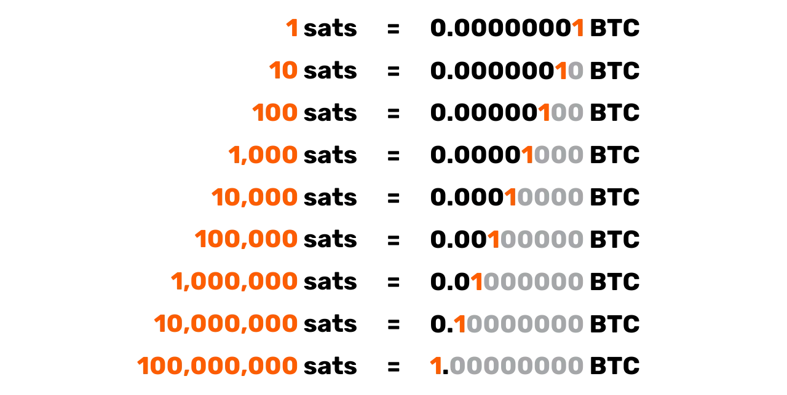
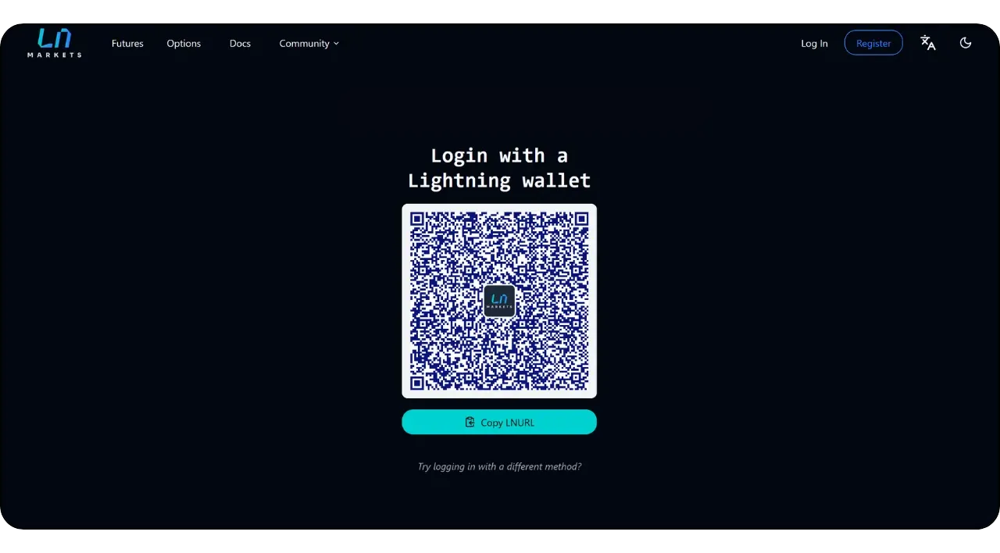

# Avviare il viaggio della vostra azienda sulla rete bitcoin

Scoprite le funzionalità pratiche del Bitcoin e della Lightning Network ed esplorate il modo in cui, proprio come Internet, possono **trasformare le vostre operazioni commerciali**. Dal capitale digitale ai pagamenti veloci, economici e scalabili, Bitcoin offre un vasto spettro di **casi d'uso per le aziende**.

In questa guida imparerete a comprendere il Bitcoin come rete monetaria globale, universale e nativa di Internet. Grazie alle sue caratteristiche fondamentali uniche, **Bitcoin offre miglioramenti significativi rispetto alle reti monetarie tradizionali**. Scoprirete perché e come sfruttare il Bitcoin per i classici casi d'uso finanziari, come l'accumulo di capitale e i sistemi di pagamento. Inoltre, questa guida tratterà l'acquisizione e la detenzione di Bitcoin, compresi i requisiti contabili e fiscali associati, nonché l'implementazione di soluzioni di pagamento Bitcoin semplici o su larga scala.

Che siate una **piccola impresa o una grande azienda**, integrare Bitcoin nelle vostre operazioni quotidiane può rendere la vostra azienda più **resistente, produttiva e competitiva**. Ogni azienda basata su Internet diventerà un'azienda orientata al Bitcoin, e questo corso vi garantisce di essere preparati. Le sezioni iniziali riassumono le basi del funzionamento di Bitcoin, quindi anche se siete principianti, acquisirete le conoscenze fondamentali necessarie per procedere. Imparare le basi dell'invenzione di Satoshi è sempre una buona idea, sia prima che dopo aver seguito il corso BIZ101.

+++
# Introduzione

<partId>326cf945-5d3f-4d86-8c3e-4d1c35959799</partId>

## La vostra azienda è pronta per il Bitcoin

<chapterId>1be42be9-4080-49f5-b5b2-6b531dd55f5f</chapterId>

Date il via al viaggio della vostra azienda nella rete Bitcoin con questo corso di formazione completo, che vi permetterà di capire come Bitcoin e la Lightning Network possano rivoluzionare le operazioni commerciali tradizionali. Questo corso è pensato per rivenditori, imprenditori, manager e responsabili aziendali che desiderano esplorare le capacità pratiche di Bitcoin come rete monetaria globale e nativa di Internet e come solido mezzo di scambio di valore.

Nel corso del corso verranno introdotti i principi fondamentali che rendono Bitcoin e la Lightning Network decisamente trasformativi. Imparerete come queste tecnologie offrano uno spettro di casi d'uso, dall'immagazzinamento di capitale digitale ai pagamenti veloci, economici e scalabili, e come forniscano miglioramenti critici rispetto alla valuta e ai sistemi di pagamento tradizionali. Il corso BIZ101 collega la teoria economica con le applicazioni del mondo reale, chiarendo come la decentralizzazione possa ridurre la dipendenza dagli intermediari e superare i limiti insiti nei sistemi tradizionali.

Il corso inizia con un esame dettagliato delle valute e dei meccanismi di pagamento convenzionali, gettando le basi per esplorare come la moneta funzioni come una rete per consentire il commercio, il risparmio e la specializzazione economica. Successivamente, ci addentreremo nella tecnologia alla base di Bitcoin e nelle innovazioni introdotte dalla Lightning Network, rivelando il loro ruolo nel facilitare le transazioni senza soluzione di continuità, sicure e quasi istantanee che possono servire alle aziende di tutte le dimensioni. Poi ci immergeremo nelle sezioni pratiche di questo corso, iniziando con una parte sulla detenzione di bitcoin come tesoreria, seguita da una parte finale sull'accettazione di bitcoin come mezzo di pagamento.

Sia che rappresentiate una piccola impresa o una grande società, questo corso mira a fornirvi le conoscenze necessarie per integrare i Bitcoin nelle vostre operazioni quotidiane, migliorando così la resilienza, l'efficienza e il vantaggio competitivo della vostra azienda. Poiché i Bitcoin continuano a ridisegnare il panorama economico, la comprensione di queste tecnologie rivoluzionarie non è solo un'opzione, ma una necessità strategica. Preparatevi a partecipare con contenuti interessanti, esempi pratici e indicazioni strategiche che vi permetteranno di navigare e sfruttare il mondo in evoluzione del Bitcoin!

# Valuta, sistemi di pagamento e Bitcoin

<partId>d9bd0e21-8488-44e0-af55-6d0b934f83c2</partId>

## Valute tradizionali

<chapterId>785e095c-6811-4ca2-ba46-fe38291432d4</chapterId>

### Le valute sono reti

Le valute sono fondamentalmente reti che consentono un efficiente scambio di valore.

Senza moneta, gli individui devono affidarsi al **baratto**, un sistema in cui i beni o i servizi vengono scambiati direttamente. Il baratto è poco pratico perché richiede una "doppia coincidenza di desideri": entrambe le parti devono desiderare ciò che l'altra offre nello stesso momento. Per esempio, se un agricoltore con un surplus di grano vuole delle scarpe, deve trovare un calzolaio che abbia bisogno di grano. Questo è raro e inefficiente. Inoltre, **con n prodotti in un'economia di baratto, sono necessari ~n(n-1)/2 tassi di cambio**, creando un sistema estremamente complesso e macchinoso. Ad esempio, sarebbero necessari oltre ~124.000 tassi di cambio per soli 500 prodotti.

La moneta semplifica tutto ciò agendo da intermediario, creando **una rete che riduce il numero di tassi di cambio a n** - uno per ogni prodotto rispetto alla moneta. Questo rende le transazioni molto più semplici e **consente alle persone di scambiare beni e servizi senza che sia necessaria una reciproca volontà**. Invece di scambiare direttamente il grano con le scarpe, l'agricoltore può vendere il suo grano in cambio di valuta e in seguito usare quella valuta per comprare scarpe o qualsiasi altra cosa di cui abbia bisogno.

L'introduzione della moneta come rete non solo facilita il commercio, ma consente anche la **divisione del lavoro e la specializzazione**. Con un mezzo di scambio affidabile, gli individui e le comunità non hanno più bisogno di produrre tutto ciò che consumano. Possono invece concentrarsi su ciò che sanno fare meglio, aumentando l'efficienza e la qualità. Un agricoltore può specializzarsi nella coltivazione, un calzolaio nella produzione di calzature e un costruttore nella costruzione di case. Questi specialisti possono poi scambiare i loro beni e servizi attraverso la moneta, beneficiando delle reciproche competenze. Questa specializzazione spinge la **produttività e l'innovazione**, in quanto le persone affinano le loro abilità e sviluppano nuovi metodi nei rispettivi campi.

La natura di rete della moneta comporta ulteriori vantaggi significativi. In primo luogo, far parte della rete monetaria è **più vantaggioso che starne fuori**. Lo standard condiviso della rete facilita gli scambi, consentendo agli individui di coordinare le loro attività economiche anche **a grandi distanze**. Ad esempio, un commerciante di una città può scambiare merci con un acquirente di un'altra città utilizzando la stessa valuta, favorendo la crescita economica e la cooperazione in vaste regioni.

Un altro vantaggio fondamentale della moneta è la sua capacità di **consentire scambi differiti**. Con il baratto, le transazioni sono immediate; un bene viene scambiato con un altro in tempo reale. La moneta, invece, consente il **risparmio: gli individui possono immagazzinare valore per un uso futuro**. Questo rappresenta un enorme passo avanti per la pianificazione economica, gli investimenti e l'accumulo di ricchezza, tutti aspetti che migliorano la vita dei partecipanti alla rete.

In conclusione, le valute sono reti progettate per spostare il valore in modo efficiente. Superano i limiti del baratto, semplificano gli scambi e creano opportunità di coordinamento e risparmio. Proprio come ogni rete, il valore di una valuta dipende dalla sua adozione diffusa e dalla sua utilità: in definitiva, la valuta migliore vince.

### Qual è una buona valuta?

Una buona valuta possiede diverse proprietà essenziali che la rendono efficace per facilitare lo scambio di valore. Ecco una spiegazione concisa di ciascuna di esse:

- Sicurezza**: Una valuta deve essere protetta contro il furto o l'accesso non autorizzato, assicurando che gli utenti possano detenerla e trasferirla con fiducia. La sicurezza è fondamentale per creare fiducia nel sistema.
- A prova di contraffazione**: Una moneta deve essere estremamente difficile o impossibile da contraffare. Questo garantisce che ogni unità sia autentica, mantenga il suo valore e prevenga l'inflazione causata dall'entrata in circolazione di unità false. Ad esempio, storicamente l'oro è stato apprezzato non solo per la sua bellezza e rarità, ma anche perché è estremamente difficile da produrre. A differenza delle banconote cartacee o delle scritture digitali, l'oro non può essere "fabbricato", ma deve essere estratto dalla terra. Questa naturale scarsità e la difficoltà di produzione hanno aiutato l'oro a mantenere il suo status di riserva di valore affidabile e di punto di riferimento per l'autenticità.
- Scarsa**: Una buona moneta deve avere un'offerta limitata o un'emissione controllata. La scarsità garantisce che il suo valore si conservi nel tempo, evitando una sovrapproduzione che eroderebbe il potere d'acquisto. Ad esempio, alcune tribù di nativi americani usavano le perline come forma di moneta. Inizialmente, queste perline erano difficili da produrre, mantenendo la loro scarsità e il loro valore. Tuttavia, quando i commercianti europei iniziarono a produrre in massa e a inondare il mercato di perline, la loro rarità svanì. Con l'aumento dell'offerta, le perline persero il loro potere d'acquisto, compromettendo il loro ruolo di riserva di valore affidabile.
- Senza permesso**: In passato, le monete d'oro e d'argento erano spesso coniate da privati, autorità locali o mercanti che avevano accesso alle materie prime. Questo sistema a volte operava in base ad accordi o licenze concesse da re o governanti. Col tempo, re e governi centralizzarono questo processo per ottenere un maggiore controllo sulla stabilità economica, sulla tassazione e sul sistema monetario. Un esempio famoso è il **thaler**, una moneta d'argento coniata per la prima volta nel 1518 nella **Valle di Gioacchino** (l'odierna Jáchymov nella Repubblica Ceca) da minatori e autorità locali. Il nome "tallero" deriva dalla parola tedesca **"Thal "** che significa "valle" Queste monete, note per l'argento di alta qualità, furono ampiamente diffuse in tutta Europa. Nel corso del tempo, il termine si è evoluto dal punto di vista linguistico e geografico, dando origine al nome "dollaro", adottato negli Stati Uniti per la loro valuta.

Nell'era moderna, le valute sono diventate completamente autorizzate dal sistema del signoraggio, il che significa che solo le entità autorizzate - come le banche centrali o i tesori - possono coniare monete o stampare banconote. Gli individui non sono più autorizzati a produrre moneta, garantendo un controllo centralizzato sull'emissione e sulla fornitura.

Oggi il principio del signoraggio è messo in discussione dalla criptovaluta Bitcoin, che opera senza controllo centralizzato. Il Bitcoin è un sistema "permissionless" in cui chiunque può partecipare all'utilizzo della valuta senza chiedere il permesso e, attraverso il mining, alla sua creazione. Questa decentralizzazione toglie ai governi il monopolio dell'emissione, sollevando interrogativi su un potenziale ritorno a sistemi valutari competitivi e di libero mercato.

- Unità di conto**: Una valuta dovrebbe fornire una misura standard per confrontare il valore di beni e servizi. Questo semplifica il commercio e rende i prezzi trasparenti e coerenti nelle transazioni.
- Durevole**: Una valuta deve resistere all'usura del tempo. Le valute fisiche, come le monete o le banconote, devono resistere ai danni, mentre le valute digitali devono essere conservate in modo sicuro senza rischio di perdita di dati.
- Portatile**: Una valuta deve essere facile da trasportare e da usare, consentendo di commerciare a distanza. Questo obiettivo può essere raggiunto attraverso la portabilità fisica (monete o banconote leggere) o attraverso sistemi di trasferimento digitale.
- Divisibile**: Una valuta dovrebbe essere divisibile in unità più piccole per facilitare le transazioni di varie dimensioni. Questa flessibilità ne garantisce la praticità sia per i piccoli acquisti che per il commercio su larga scala.
- Fungibile**: Tutte le unità di una valuta devono essere intercambiabili e di pari valore. Ad esempio, una banconota da un dollaro deve essere equivalente a qualsiasi altra banconota da un dollaro. Questa uniformità garantisce equità e semplicità nelle transazioni.
- Riconoscibile**: Una valuta deve essere facilmente identificabile e affidabile. Le valute fisiche raggiungono questo obiettivo grazie a design unici e caratteristiche di sicurezza, mentre le valute digitali possono affidarsi a protocolli di verifica. Ciò garantisce un'ampia accettazione e riduce il rischio di frodi.

Queste caratteristiche rendono una moneta pratica, affidabile ed efficiente per facilitare gli scambi e immagazzinare valore in un'economia.

### Evoluzione dei sistemi valutari

**Dalle monete alla cartamoneta: Aumentare l'efficienza e la portabilità**

Il passaggio dalle monete alla cartamoneta ha segnato un significativo miglioramento in termini di **portatilità** ed efficienza. Le monete, fatte di metalli preziosi come l'oro o l'argento, erano preziose per il loro valore intrinseco. Tuttavia, erano pesanti, difficili da trasportare in grandi quantità e soggette a usura o furto. La cartamoneta ha rivoluzionato le reti monetarie introducendo un mezzo leggero, standardizzato e portatile che rappresentava il valore anziché contenerlo. Questa innovazione ha permesso alle economie di scalare consentendo un più facile commercio a lunga distanza e riducendo le sfide logistiche legate all'utilizzo di beni fisici come denaro.

La cartamoneta favorisce anche la scalabilità. Invece di affidarsi alla limitata disponibilità di metalli preziosi, le economie potevano espandere la propria base monetaria attraverso valute rappresentative, sostenute inizialmente da riserve e successivamente dalla fiducia nelle istituzioni emittenti. Questo cambiamento ha aperto la strada a sistemi finanziari più complessi e interconnessi.

**Dalla carta al denaro elettronico: Ampliare l'accessibilità e la velocità**

Il passaggio dalla cartamoneta alla moneta elettronica ha migliorato ulteriormente la rete monetaria aumentandone l'accessibilità e la velocità. Con l'avvento dei sistemi bancari, delle carte di credito e delle transazioni digitali, il denaro è diventato non solo **portatile** ma quasi **istantaneo**. I trasferimenti elettronici hanno eliminato la necessità di scambi fisici, consentendo alle transazioni di attraversare grandi distanze in pochi secondi.

Questo cambiamento ha anche democratizzato l'accesso alla moneta. I sistemi bancari e di pagamento elettronici hanno ridotto le barriere all'ingresso per gli individui e le imprese, consentendo la partecipazione all'economia globale. La velocità e la convenienza della moneta elettronica hanno ampliato le reti commerciali e favorito nuovi modelli di business che sarebbero stati impossibili in un sistema basato sulla carta.

Queste moderne reti valutarie hanno comportato uno svantaggio significativo: la **mancanza di verificabilità e trasparenza nella gestione della massa monetaria**, che spesso ha portato a un'inflazione incontrollata e a una perdita di fiducia nei sistemi centralizzati. Ad esempio, solo negli ultimi quattro anni è stato stampato oltre il 20% di tutti i dollari statunitensi in circolazione. Questa persistente tentazione di emettere più moneta - svilendo così il valore detenuto dagli attuali detentori - può essere in gran parte attribuita a un difetto del sistema: i politici sono spesso incentivati a evitare decisioni di bilancio difficili, scegliendo invece di rimandare le sfide alle amministrazioni future "dando un calcio alla lattina"

**Dalla moneta centralizzata a quella decentralizzata: Migliorare la fiducia e la sovranità**

Oggi, l'emergere della moneta decentralizzata Bitcoin rappresenta il prossimo salto di qualità nelle reti valutarie. La moneta elettronica tradizionale si affida ad autorità centralizzate, come banche o governi, per gestire e verificare le transazioni. Pur essendo efficaci, questi sistemi sono vulnerabili alle inefficienze, alla censura e ai singoli punti di fallimento. Le valute decentralizzate migliorano queste proprietà della rete **distribuendo la fiducia ed eliminando gli intermediari**. Ciò significa anche che il denaro può circolare molto **più velocemente** e **più a buon mercato**, perché non ci sono passaggi di autorizzazione. Infine, nessun essere umano può essere tentato di modificare il programma di fornitura della valuta Bitcoin, è il software a farlo.

Nei sistemi decentralizzati, le transazioni sono verificate da una rete globale di partecipanti che utilizzano la tecnologia blockchain, garantendo sicurezza, trasparenza e resilienza. Questa struttura minimizza il rischio di frode, riduce la dipendenza dalle autorità centrali e consente agli individui di avere un maggiore controllo sulle proprie finanze. Eliminando le barriere geografiche e istituzionali, le valute decentralizzate offrono un sistema monetario veramente globale e inclusivo.

**L'evoluzione delle reti valutarie

Ogni fase dell'evoluzione delle reti valutarie ha migliorato le proprietà chiave: portabilità, scalabilità, accessibilità, velocità, sicurezza e fiducia. Le monete hanno lasciato il posto alla cartamoneta per migliorare la portabilità e l'efficienza. La carta si è evoluta in moneta elettronica, consentendo un accesso globale e transazioni istantanee. Ora, Bitcoin sta ridefinendo la fiducia e la sicurezza, creando un sistema monetario aperto e resiliente. Questa progressione storica mette in evidenza la continua spinta dell'umanità a creare reti migliori per lo scambio di valore, ogni iterazione costruendo e superando i limiti della precedente.

È probabile che vinca la rete migliore.

## Sistemi di pagamento tradizionali

<chapterId>1306196c-1e8a-454b-8e11-6887ecb3d8b4</chapterId>

I sistemi di pagamento sono metodi e infrastrutture che consentono il trasferimento di fondi tra due parti, tipicamente tra un pagatore (come un consumatore) e un beneficiario (come un'azienda). Queste transazioni possono avvenire in diversi contesti: un consumatore che paga un commerciante locale, un'azienda che salda le fatture con un fornitore, o anche singoli individui che si trasferiscono denaro a vicenda. La comprensione dei sistemi di pagamento implica l'analisi dei diversi tipi di metodi di pagamento, delle loro caratteristiche e dei loro casi d'uso sia in contesti Business-to-Consumer (B2C) che Business-to-Business (B2B).

### Tipi comuni di metodi di pagamento

1. **Contanti:** Valuta fisica scambiata direttamente tra due parti.

2. **Assegni:** Documenti cartacei che ordinano a una banca di pagare un determinato importo dal conto del pagatore al beneficiario.

3. **Trasferimenti via cavo:** Trasferimento elettronico di fondi tra banche, spesso utilizzato per somme maggiori e pagamenti transfrontalieri.

4. **Carte di pagamento (credito/debito):** Carte plastificate o digitali collegate a una rete di carte, che consentono di trasferire fondi dal conto bancario (o dalla linea di credito) del titolare della carta a un esercente.

5. **Portafogli digitali e pagamenti mobili:** Applicazioni o dispositivi che memorizzano le informazioni di pagamento (ad esempio, Apple Pay, WeChatPay, AliPay, PayPal), consentendo trasferimenti rapidi e spesso senza contatto.

**Utilizzo nel B2C e nel B2B:**

- B2C (Business-to-Consumer):**
    - I consumatori utilizzano spesso contanti, carte e portafogli digitali per gli acquisti di tutti i giorni, come la spesa, lo shopping online o servizi come il ride-hailing.
    - Velocità, convenienza e spese ridotte (per il consumatore) sono spesso le priorità principali.
    - I pagamenti contactless e mobili sono sempre più popolari in questo spazio grazie alla loro facilità d'uso.
- B2B (Business-to-Business):**
    - Le aziende si affidano comunemente a bonifici, assegni e sistemi di fatturazione per pagare i fornitori, saldare grandi fatture o gestire pagamenti ricorrenti.
    - L'attenzione è spesso rivolta alla tracciabilità, alla documentazione e alla capacità di gestire transazioni di valore superiore.
    - L'uso della carta esiste, ma tende a essere meno comune a causa di commissioni e limiti di transazione più elevati. Stanno emergendo soluzioni digitali, come le piattaforme di pagamento integrate, per snellire e automatizzare i processi di pagamento e incasso.

*Grafico: Tendenze globali nei metodi di pagamento al punto vendita (POS) (2023-2027), The Global Payments Report 2024, Worldpay.*

### La complessità che si cela dietro un semplice pagamento con carta di credito

Quando un cliente utilizza una carta di credito in un negozio, la carta viene letta dal terminale POS, che trasmette in modo sicuro i dati della transazione alla banca acquirente dell'esercente. L'acquirer inoltra queste informazioni alla rete di carte di credito (ad esempio, Visa o Mastercard), che inoltra la richiesta all'emittente - la banca che ha fornito la carta al cliente. L'emittente controlla il conto o la linea di credito del cliente e invia un'autorizzazione attraverso la rete e l'acquirer, consentendo all'esercente di accettare il pagamento.

Questa transazione, apparentemente semplice, comporta in realtà oltre 15 passaggi, 7 intermediari e richiede in media dalle 48 ore ai 5 giorni prima che il commerciante riceva i fondi. Nei giorni successivi si verifica un processo di compensazione e regolamento. La rete di carte aggrega le transazioni del giorno e coordina l'interscambio di fondi tra l'acquirer e l'emittente. Una banca centrale garantisce l'accuratezza e la stabilità di questi regolamenti interbancari. Alla fine, il conto bancario dell'esercente riceve l'importo netto (meno le commissioni) accreditato dall'acquirer, completando così il ciclo di vita della transazione.

Nel complesso, questo processo è intricato, lungo e costoso per quello che dovrebbe essere un semplice atto di trasferimento di valore da una parte all'altra.

### Metodi di pagamento a confronto

| Metodo di pagamento | Autorizzazione necessaria?           | Tempo di approvazione della transazione (vista dall'esercente) | Velocità di regolamento (fondi completamente regolati) | Finalità (facilità di storno) | Numero di intermediari | Commissioni tipiche (al beneficiario) |

| ------------------------------ | ------------------------------- | ----------------------------------------- | ---------------------------------------------- | ---------------------------------------- | ------------------------------ | ---------------------------------- |

| **Cash** | No | Immediato (scambio fisico) | Immediato (nessun ritardo di liquidazione) | Alto (irreversibile una volta pagato) | Nessuno | Nessuno | Nessuno

| **Assegni** | Sì (compensazione bancaria) | Accettazione al momento del deposito (non garantita) | Diversi giorni (processo di compensazione dell'assegno) | Medio (può essere respinto/arrestato prima della compensazione) | Banca | **Da basso a medio** (commissioni bancarie) |

| **Trasferimenti via cavo** | Sì (Banca/Rete) | Conferma entro poche ore | Stesso giorno o giorno successivo (nazionale) | Alto (di solito irreversibile una volta inviato) | Banche, Reti di pagamento | **Medio**(Fisso/Percentuale) |

| **Carte di pagamento** | Sì (Autorizzazione dell'emittente della carta) | Da secondi a minuti (Codice di autorizzazione) | Alcuni giorni (Regolamento interbancario) | Medio (Possibilità di addebiti) | Emittente, Acquirer, Rete di carte | **Variabile (1-3% della transazione)** |

| **Portafogli digitali/Mobile Pay** | Sì (Provider di Portafoglio/Banca) | Secondi (Conferma istantanea) | In genere 1-2 giorni (Dipende dalla fonte di finanziamento) | Medio (Possibilità di rimborso/diffida) | Banche, Operatori di Portafoglio | **Da basso a medio (Varia)** |

### Limiti delle soluzioni esistenti

L'industria dei pagamenti tradizionali rappresenta un'economia annuale di circa 2.200 miliardi di dollari, circa un decimo del PIL degli Stati Uniti o pari al PIL della Francia. Poiché le valute funzionano come reti autorizzate, la concorrenza è limitata, rendendo questo "servizio" più simile a una tassa imposta all'economia produttiva. Oltre agli oneri di costo che crea, ci sono diverse altre limitazioni, come illustrato di seguito.

| Limitazione, spiegazione, impatto..

| -------------------------------- | ---------------------------------------------------------------------------------------------------------------------------------------------------------------------------------------------------------------------------------- | ---------------------------------------------------------------------------------------------------- |

| Commissioni di interscambio (~0,3%), commissioni di rete (fisse o 0,3%-1%), abbonamenti a terminali/PSP e margini bancari (0,5%-1,7%) si sommano a un costo sostanziale, simile a una "tassa" globale sui settori produttivi, pari a trilioni di dollari.     | Aumenta i costi degli esercenti, riducendo i margini e potenzialmente aumentando i prezzi al consumo.                  |

| Il regolamento dei fondi può richiedere fino a 5 giorni, rallentando il flusso di denaro e l'attività economica complessiva.                                                                                                                                | Ritarda la liquidità per i commercianti e riduce la velocità della circolazione economica.                        |

| Frodi | I canali di e-commerce sono fortemente bersagliati dalle frodi, che contribuiscono a perdite significative (ad esempio, 28 miliardi di dollari). I chargeback potrebbero raggiungere ~174 miliardi di dollari a livello globale entro il 2024. La gestione di queste controversie richiede tempo e stress mentale. | Aumento dei costi operativi, complesse misure di prevenzione delle frodi e diminuzione della fiducia dei clienti.       |

| Abbandono del carrello | I passaggi di sicurezza aggiuntivi (codici una tantum, autenticazione a due fattori secondo la PSD2) introducono attriti al momento del checkout.                                                                                                                   | Una maggiore complessità del checkout porta all'abbandono del carrello e alla perdita di vendite.                       |

| Soglie minime di spesa sulle carte possono costringere commercianti e consumatori a condizioni di prezzo o di acquisto scomode, scoraggiando le transazioni di piccolo valore.                                                                       | Riducono la soddisfazione e la flessibilità dei clienti, limitando potenzialmente gli acquisti d'impulso o di basso valore.  |

| I sistemi attuali non sono in grado di gestire transazioni alla velocità di un millisecondo o di supportare flussi di pagamento continui e in tempo reale.                                                                                                                   | Limita i casi d'uso che richiedono pagamenti istantanei o in streaming, limitando l'innovazione e la scalabilità. |

| L'accesso a questi metodi di pagamento richiede un conto bancario o una carta collegata, escludendo automaticamente coloro che ne sono sprovvisti.                                                                                                       | Limita l'inclusione finanziaria, riducendo l'accesso alle popolazioni non bancarizzate o sottobanco.                 |

| Creazione ripetuta di account online | Gli utenti devono spesso creare più account online, con conseguente stanchezza, minore comodità e maggiore esposizione dei dati personali.                                                                                                | Peggiora l'esperienza dell'utente, solleva problemi di privacy e aumenta il rischio di violazione dei dati.          |

| La mancanza di un'unità di conto universale costringe a costose conversioni di valuta per le transazioni transfrontaliere.                                                                                                                              | Aggiunge costi aggiuntivi al commercio internazionale, rendendo le transazioni globali meno convenienti.             |

Così come siamo passati dal pagamento al minuto delle chiamate vocali all'utilizzo quasi gratuito delle comunicazioni su IP, l'emergere di reti più aperte ed efficienti può ridefinire i pagamenti, riducendo i costi e gli intermediari e favorendo nuovi modelli di business.

## Bitcoin per le aziende: una valuta emergente

<chapterId>4488fe33-663f-41a3-a668-e9ca2fb7122e</chapterId>

**CHE COS'È IL BITCOIN?

Il Bitcoin è un sistema di scambio di valuta digitale **peer-to-peer** (contante elettronico). Il termine "Bitcoin" si riferisce ai seguenti componenti:

- Protocollo informatico** che facilita lo scambio di valori su Internet senza intermediari, senza richiedere autorizzazioni e in modo pseudonimo. Utilizza principi crittografici avanzati.
- Una rete fisica** di macchine collegate a Internet (nodi, minatori, ecc.) gestite da privati e aziende, che formano un sistema decentralizzato (senza autorità centrale o singolo punto di controllo).
- L'unità di conto** all'interno del sistema. Non esisteranno mai più di 21 milioni di bitcoin. Ogni bitcoin è divisibile in 100 milioni di unità chiamate "satoshi", in onore del suo anonimo creatore.

Insieme fanno del Bitcoin un **bearer asset** e una valuta digitale **senza emittente**. La proprietà è assicurata esclusivamente dal possesso della **chiave crittografica privata**, che garantisce il pieno controllo **senza intermediari o terze parti fidate**. Quando viene trasferita, la **finalità** della proprietà è immediata: il nuovo possessore la possiede completamente senza dover fare affidamento su un'autorità centrale per la protezione o la convertibilità. Le transazioni sono **immutabili**: una volta registrate sulla blockchain, non possono essere alterate o cancellate.

Il Bitcoin ha una politica monetaria fissa, con un **cap di 21 milioni di bitcoin**, di cui ~19,8 milioni sono già stati distribuiti. Questo lo rende **deflazionistico**, con il suo valore che aumenta nel tempo man mano che gli utenti vi accumulano risparmi e guadagni di produttività.

Le sue caratteristiche tecniche superano quelle dell'oro e del dollaro messi insieme, rendendolo l'asset finanziario più difficile mai creato. Il Bitcoin è sia una riserva di valore che un mezzo di scambio, una moneta in divenire. Immaginate di trasferire il valore dalla tesoreria di un'azienda a quella di un'altra in modo rapido, senza intermediari, a costi minimi, senza frodi, 24 ore su 24, 7 giorni su 7 e senza l'intervento di terzi.

Il Bitcoin conserva efficacemente il valore perché il suo libro mastro è a prova di manomissione. Il suo valore aumenta grazie alla rarità e alla limitatezza dell'offerta combinata con il crescente numero di opportunità di scambio, guidato dall'aumento del numero di utenti.

Il Bitcoin è dirompente perché ci spinge a imparare concetti di matematica, crittografia, economia e storia che non ci sono mai stati insegnati. Sebbene sia spesso percepito come complesso, è in realtà un'innovazione accessibile attraverso la pratica e la sperimentazione.

Il Bitcoin ci sfida a riconsiderare la natura stessa del denaro. Potrebbe spiegare cos'è veramente il denaro? Un lavoratore dipendente o un imprenditore potrebbe spendere dalle 50.000 alle 100.000 ore della propria vita per guadagnare denaro, ma quanti **dedicano anche solo 100 ore per comprenderlo meglio** e conservarlo? Il Bitcoin ci spinge a mettere in discussione le ragioni fondamentali del nostro bisogno di denaro e la nostra prospettiva temporale. Il denaro serve per il lusso immediato o per la resistenza a lungo termine? Se avessimo un bene che si apprezza e che ci permette di ritardare gli acquisti, quali scelte faremmo? Quali conversazioni vorremmo avere con noi stessi tra 20 o 30 anni?

**CARTA D'IDENTITÀ DEI BITCOIN**

- Età:** 15 anni (3 gennaio 2009)
- Valore di scambio giornaliero:** 10 miliardi di dollari (> CAC40)
- Capitalizzazione di mercato:** 1,8 trilioni di dollari (> Meta, Visa, Argento; < Apple, Google, Oro)
- Utenti:** ~100-200 milioni (1-2% della popolazione mondiale)
- Volatilità:** intrinsecamente nulla (1 Bitcoin = 1 Bitcoin), molto alta esternamente (negli scambi di valuta fiat)
- Performance:** Prima transazione a $0,0009; ora $100.000 (x100 milioni)
- Disponibilità della rete (uptime):** 100% dal 2013
- Dichiarato morto o criticato:** Una volta al mese

**Una meraviglia della cooperazione umana

- Completamente **open-source**
- Entità giuridica:** Nessuna
- CEO:** Nessuno
- Investimenti in capitale di rischio:** Nessuno
- Marketing:** Nessuno
- R&S:** Volontariato
- Governance:** Da parte degli utenti
- Modello economico innovativo:** La creazione di blocchi è sovvenzionata dalle commissioni di transazione (basate su aste)

Per ulteriori informazioni su Bitcoin, la sua storia, il suo funzionamento e il suo utilizzo, suggerisco di seguire anche questo altro corso completo:

https://planb.network/courses/2b7dc507-81e3-4b70-88e6-41ed44239966
## Introduzione alla rete Lightning

<chapterId>c095c7ad-5469-4c7b-9510-b6c0b86244e7</chapterId>

**CHE COS'È IL FULMINE?

La Lightning Network è **un protocollo e una rete** che facilita le transazioni Bitcoin con un'interazione minima con la blockchain principale di Bitcoin. Ecco come funziona:

- Configurazione iniziale:** I fondi sono bloccati (escrowed) sulla blockchain principale per stabilire un canale di pagamento tra 2 parti.
- Rete di pagamento:** Una rete di canali di pagamento tra più parti forma una rete di pagamento (routing e interconnessione).
- Transazioni fuori catena:** Le transazioni avvengono tra le parti ma non sono **immediatamente pubblicate** sulla blockchain principale di Bitcoin (**"fuori catena "**).
- Regolamenti on-chain:** Solo il **saldo finale** delle transazioni di un canale viene pubblicato sulla blockchain principale di Bitcoin (**"on-chain**"), consentendo a numerose transazioni di avvenire nel frattempo. Questo raggruppamento di più pagamenti riduce la congestione e quindi le commissioni rispetto all'esecuzione di molte transazioni on-chain.
- Chiusura del canale:** Un utente può chiudere il proprio canale in qualsiasi momento e recuperare il proprio Bitcoin pubblicando lo stato dell'ultima transazione. Questo è il principio per cui le transazioni sono **"pubblicabili" in qualsiasi momento ma "non pubblicate "** fino a quando non è necessario. L'uscita (chiusura del canale) può essere unilaterale (decisa da una qualsiasi delle due parti in qualsiasi momento) o decisa reciprocamente (con conseguente riduzione delle commissioni sulla catena)

Questo approccio evita la lentezza e la complessità di eseguire ogni transazione direttamente sulla blockchain principale di Bitcoin, registrando solo i saldi finali e mantenendone la sicurezza. La Lightning Network è un livello "superiore" a Bitcoin, ma rimane ancorata ad esso.

**Una rete di pagamento globale

Il protocollo crea una **rete** di macchine in cui i canali formano un sistema di pagamento universale. Questi nodi possono essere gestiti liberamente da privati o aziende, rendendola una rete completamente aperta.

La Lightning Network consente lo scambio istantaneo di valore alla velocità della luce. È come un protocollo di posta elettronica applicato ai pagamenti: una rete di pagamento di nuova generazione. Trasforma radicalmente il modo in cui il "denaro" si muove, rendendolo libero e veloce come la trasmissione dei dati su Internet.

**Vantaggi principali

- Velocità: ** Transazioni istantanee.
- Spese ridotte:** Costi molto più bassi rispetto alle reti bancarie tradizionali.
- Facilità di adozione:** Le aziende possono configurarsi rapidamente per accettare i pagamenti Lightning utilizzando semplicemente un'app per smartphone o un pulsante di pagamento sul proprio sito web.

L'infrastruttura Lightning supera i sistemi di pagamento tradizionali in termini di velocità, costi ed efficienza energetica. Con la crescente adozione da parte degli esercenti, lo slancio si accelererà: se i pagamenti possono bypassare la rete interbancaria vincolata, perché continuare a cedere una percentuale significativa di ricavi agli attuali intermediari?

**Casi d'uso infiniti

Le applicazioni di Lightning vanno ben oltre le basse commissioni e la velocità. Offrendo un sistema di pagamento istantaneo e completamente gratuito, apre vaste opportunità in tutta l'economia.

**Potenziamento delle capacità di scambio di Bitcoin

Lightning amplifica il ruolo di Bitcoin come "mezzo di scambio" Aumentando la frequenza e la libertà delle transazioni, rafforza la funzione primaria del denaro: facilitare gli scambi economici e la creazione di valore per tutti i partecipanti.

La futura ascesa della "smart machine economy" richiederà un sistema di pagamento ultraveloce e ad alta frequenza, uno standard tecnico che solo Lightning può soddisfare. Ciò consente la creazione di un maggior numero di beni e servizi. Poiché l'offerta di Bitcoin rimane limitata, il potere d'acquisto di ogni unità aumenterà. Bitcoin e Lightning si rafforzano insieme all'espansione delle loro reti.

Lightning offre uno sguardo al futuro in cui tutte le attività commerciali basate su Internet diventeranno basate anche su Bitcoin.

**Pagamenti in bitcoin su Lightning: Un tipico caso d'uso per i commercianti**

La rete Lightning è ideale per i pagamenti in Bitcoin nei negozi fisici o online, grazie alla sua velocità e alla finalità del pagamento.

- Velocità:** Lightning (~500ms a pochi secondi) è significativamente più veloce della rete principale di Bitcoin, dove le transazioni possono richiedere circa 30 minuti per essere confermate. Per acquisti di grandi dimensioni (ben oltre i 1.000 dollari), la rete principale di Bitcoin può essere ancora preferita, in quanto la velocità è meno critica. Tuttavia, questi dettagli sono spesso nascosti all'utente medio, poiché le applicazioni gestiscono queste decisioni senza problemi in background.
- Finalità:** Una volta effettuato il pagamento su Lightning, questo è definitivo. Non vi è alcuna possibilità di riaddebito da parte di terzi o di controversie legate a frodi.
- Commissioni:** Le commissioni di transazione sulla rete Lightning sono minime e vengono pagate dall'utente, non dal commerciante. I commercianti incorrono in commissioni solo se in seguito devono trasferire i loro Bitcoin a un'altra rete o servizio.

**CARTA D'IDENTITÀ ILLUMINATA*

- Invenzione:** 2015
- Lancio:** 2016
- Età:** 7 anni (prima transazione: 28 dicembre 2017)
- Capacità tecnica della rete:** in scala può gestire un numero di transazioni istantanee 1.000 volte superiore a quello dei sistemi tradizionali.
- Dimensioni delle transazioni:** Varia da un minimo di 1.000 volte a un massimo di 1.000 volte rispetto ai sistemi tradizionali.
- Velocità di transazione:** Fino a 100 volte più veloce.
- Tasse:** Fino al 90% in meno.
- Finalità del pagamento:** Quasi istantanea (spesso ~500 millisecondi, a volte pochi secondi).
- Consumo energetico:** ~8% del sistema monetario globale tradizionale.
- Caratteristiche:**
    - Peer-to-peer
    - Universale
    - Senza permesso
    - Buona privacy
    - Sicurezza comprovata
    - Alta disponibilità (eccellente uptime)
    - Controllabile e adattabile

Per ulteriori informazioni sul funzionamento tecnico della rete Lightning, vi suggerisco di seguire questo altro corso completo:

https://planb.network/courses/34bd43ef-6683-4a5c-b239-7cb1e40a4aeb
# Bitcoin in tesoreria

<partId>bf45c1e8-af97-4b6b-af42-2866f493b14d</partId>

## Profitti, capitale e le chiavi della resilienza aziendale

<chapterId>656ad88f-3c27-4054-a94e-b29727009b8e</chapterId>

### Un'azienda sana

**Il futuro è incerto** e le aziende devono navigare in questa incertezza concentrandosi chiaramente sulla realizzazione di profitti e sulla conservazione del capitale. Secondo l'economia austriaca, **i profitti sono il segnale definitivo della salute di un'azienda**: dimostrano che l'azienda soddisfa in modo efficiente le esigenze dei consumatori. Senza profitti, un'azienda non può sostenersi, tanto meno crescere. Per rimanere in salute, un'azienda non deve solo generare profitti, ma anche pensare al futuro, **conservando il capitale per investimenti e sfide future**.

**La conservazione del capitale** è fondamentale perché consente alle imprese di adattarsi e cogliere le opportunità in un mercato imprevedibile. Si tratta di trovare un equilibrio tra il reinvestimento degli utili per la crescita e il mantenimento di una riserva finanziaria per far fronte a potenziali flessioni. L'economia austriaca sottolinea l'importanza della **"preferenza temporale "**, ovvero le aziende devono decidere attentamente quanto dare priorità ai ritorni immediati rispetto agli investimenti per il successo a lungo termine. Un'azienda sana mantiene solide le proprie fondamenta finanziarie, assicurando flessibilità sia nei momenti positivi che in quelli negativi.

I segnali del mercato, come i prezzi e la concorrenza, guidano le imprese a prendere decisioni intelligenti sull'allocazione delle risorse. Ascoltando questi segnali, le aziende possono evitare la trappola dell'eccesso di risorse o degli investimenti sbagliati, soprattutto quelli influenzati da fattori artificiali come il credito facile. Una cattiva allocazione delle risorse non solo mette a rischio la salute dell'azienda, ma riduce anche la sua capacità di servire efficacemente i clienti.

In definitiva, mantenere un'azienda sana significa rimanere adattabili, fare scelte finanziarie prudenti e tenere sempre d'occhio il futuro. **Concentrandosi sul profitto, preservando il capitale e rispondendo ai segnali del mercato, le aziende, grandi o piccole che siano, possono prosperare anche di fronte all'incertezza**.

### Il Capitale ha una virtù?

**Come viene generalmente rappresentato il capitale**

Riscopriamo cosa sia veramente il capitale, un termine così spesso frainteso e percepito negativamente nella nostra società.

Nella teoria economica tradizionale (keynesiana), il capitale è spesso visto in termini semplificati come uno stock omogeneo di beni fisici o finanziari, utilizzato principalmente per stimolare la domanda aggregata attraverso gli investimenti. È spesso associato alla concentrazione della ricchezza e al potere economico detenuto da una piccola élite. In un contesto in cui i divari di ricchezza continuano ad aumentare, molti considerano il capitale come un simbolo di disuguaglianza economica, soprattutto quando la ricchezza accumulata sembra non offrire alcun beneficio alla maggioranza.

il "capitale" viene spesso dipinto come uno strumento di sfruttamento e questa prospettiva ha influenzato profondamente vari movimenti che vedono il capitale come intrinsecamente opposto agli interessi dei lavoratori. Ma è vero? O questa percezione potrebbe essere distorta da:

1. Una mancanza di comprensione dei meccanismi economici (anche da parte degli stessi economisti)?

2. Interventismo governativo e manipolazione del mercato?

3. Confusione tra capitalismo clientelare e capitalismo di libero mercato?

4. L'inquadramento delle crisi economiche da parte dei media?

5. Un desiderio di soluzioni rapide e di giustizia sociale immediata?

6. La normalizzazione culturale della retorica anticapitalista?

Fortunatamente, la Bitcoin ci costringe a ripensare tutto e a mettere in discussione queste nozioni preconcette. Esiste una scuola di pensiero, la Scuola Austriaca di Economia, che può far luce su questi temi e aiutarci a riconsiderare la vera natura del capitale.

**C'era una volta*

Cominciamo con una breve storia:

"Su una piccola isola deserta vive un pescatore solitario. Ogni giorno passa ore a catturare pesci a mani nude, un'attività che consuma gran parte del suo tempo e delle sue energie. Un giorno ha un'idea: costruire una lancia che gli permetta di pescare in modo più efficiente. Ma sa che questo richiederà un sacrificio.

Prima di iniziare a costruire la lancia, il pescatore decide di mettere da parte un po' di pesce per sostenersi durante il processo di costruzione. Mangia meno del solito per alcuni giorni, risparmiando abbastanza pesce per concentrarsi sul suo progetto. Questo pesce risparmiato rappresenta il suo **capitale**, una piccola riserva che gli permette di perseguire il suo obiettivo.

Mentre dedica il suo tempo alla costruzione della lancia, fa affidamento sulle sue riserve, ritardando volentieri alcune delle sue comodità immediate (un riflesso della sua **preferenza per il tempo**). Dopo diversi giorni di duro lavoro, completa una lancia robusta.

Con la lancia, ora può catturare i pesci molto più velocemente e con meno sforzo. Non ha più bisogno di sfinirsi come prima e comincia addirittura ad accumulare un surplus di pesce. Questo surplus apre nuove possibilità: può conservarlo, condividerlo o investirlo in altri progetti sull'isola. Ritardando il consumo immediato e utilizzando il suo capitale, il pescatore ha migliorato significativamente la sua efficienza e le sue prospettive future"

Questa storia illustra il ruolo fondamentale del capitale, della pazienza e della lungimiranza nella costruzione di un futuro migliore, concetti centrali per la crescita economica e il progresso umano.

### La Scuola Austriaca di Economia e la sua visione del capitale

La Scuola Austriaca di Economia prende il nome dai suoi fondatori e dai primi collaboratori, originari dell'Austria. Il nome è rimasto inalterato e da allora la scuola è diventata strettamente associata al pensiero liberale classico, che enfatizza la libertà individuale, il libero mercato e il minimo intervento dello Stato.

**La prospettiva austriaca sul capitale

Nella visione austriaca, il capitale è profondamente legato all'idea di rinviare i consumi per costruire strumenti o risorse produttive che migliorino la produzione futura. Questo processo, noto come accumulazione di capitale, è centrale nella teoria economica austriaca. Gli elementi chiave di questa prospettiva includono:

- Preferenza temporale e consumo differito**: Gli individui preferiscono naturalmente consumare ora piuttosto che in seguito, ma possono scegliere di rinviare i consumi se si aspettano maggiori ricompense in futuro. Risparmiando oggi, le risorse possono essere investite in beni capitali (strumenti, macchine, infrastrutture) che migliorano la produttività nel tempo. Le società o gli individui con una minore preferenza temporale risparmiano di più e investono in progetti a lungo termine, favorendo una crescita sostenibile.
- Il capitale come motore della produzione futura**: I beni capitali sono considerati strumenti intermedi utilizzati per produrre beni di consumo finali. Accumulando capitale, gli imprenditori possono aumentare la produttività e creare maggiore ricchezza in futuro. Ad esempio, invece di produrre immediatamente beni di consumo, le risorse potrebbero essere utilizzate per costruire fabbriche o macchinari. Sebbene questo riduca i consumi a breve termine, l'efficienza che ne deriva consente una maggiore produzione e prosperità in seguito.
- Produzione indiretta ed efficienza**: Gli economisti austriaci, come Eugen Böhm-Bawerk, hanno evidenziato l'idea della produzione indiretta - processi produttivi più lunghi e complessi che coinvolgono più fasi. Sebbene questi processi richiedano tempo, alla fine producono risultati più efficienti e produttivi, come la costruzione di una segheria per lavorare il legno piuttosto che la raccolta manuale dei tronchi.
- I tassi di interesse come segnali**: I tassi di interesse, secondo la visione austriaca, riflettono naturalmente le preferenze temporali degli individui. Tassi elevati indicano una preferenza per il consumo immediato, mentre tassi bassi incoraggiano il risparmio e gli investimenti a lungo termine. Quando le banche centrali manipolano artificialmente i tassi di interesse, distorcono questi segnali naturali, portando a una cattiva allocazione delle risorse e a investimenti non sostenibili (malinvestimento).

**Le due forme di capitale nelle economie moderne**

Nel quadro del sistema monetario basato sul debito in cui operiamo, **esiste un secondo tipo di capitale**: quello generato istantaneamente quando una banca crea un prestito attraverso un semplice meccanismo di credito. Si tratta di una creazione di liquidità ex nihilo, in cui la banca presta denaro che non detiene in anticipo, ma che crea sulla base di una promessa di rimborso.

Da un lato, il capitale "austriaco" è il risultato di un risparmio reale, un processo che comporta decisioni economiche ponderate e sacrifici meticolosi. Dall'altro lato, il capitale generato attraverso la creazione di denaro a debito è un costrutto istantaneo e artificiale. Questi due tipi di capitale, sebbene **superficialmente simili nel loro utilizzo per finanziare progetti, sono fondamentalmente diversi per natura**.

Queste due forme di capitale non dovrebbero mai essere confuse, eppure all'interno di un sistema basato sul debito spesso lo sono, **distorcendo i segnali economici** e portando spesso a malinvestimenti. Questo fraintendimento spiega perché il capitalismo riceve spesso critiche ingiustificate

**Il problema principale del keynesianesimo**

Le politiche keynesiane, ampiamente adottate dalle élite globali, manipolano i tassi di interesse e stimolano la domanda attraverso il debito. Ciò incoraggia il flusso di risorse verso progetti a breve termine e non sostenibili, amplificando i cicli economici e ritardando la vera crescita radicata nel risparmio e negli investimenti produttivi. I leader aziendali osservano questa politica dannosa in prima persona, poiché le aziende sane vengono spinte ad effettuare acquisizioni sopravvalutate alla ricerca di rendimenti gonfiati, minando la crescita organica e sostenibile.

In un simile contesto, come può il capitale "sano", accuratamente salvato dagli imprenditori, competere con il capitale "malsano" creato artificialmente? Inoltre, l'espansione unilaterale dell'offerta di moneta erode il potere d'acquisto del capitale sano, esacerbando il disorientamento economico e l'insoddisfazione della società.

**Un barlume di speranza: Bitcoin**

Il Bitcoin offre un modo per accumulare e conservare il capitale a lungo termine senza l'erosione causata dall'inflazione monetaria. Come riserva di valore, consente alle aziende di pianificare gli investimenti futuri con resilienza, sfidando il dominio dei sistemi basati sul debito e favorendo il ritorno a una vera accumulazione di capitale produttivo.

### Per saperne di più sulla scuola austriaca di economia

La **Scuola austriaca di economia** è una tradizione di pensiero economico che valorizza il libero mercato, la libertà individuale e l'importanza dell'azione umana nei processi economici. Critica l'intervento dello Stato, in particolare nella moneta e nei mercati, e sostiene che gli individui, guidati dalle loro preferenze soggettive, sono i migliori giudici dei propri interessi.

**Figure chiave della Scuola Austriaca**

- Carl Menger**: Fondatore della Scuola Austriaca, Menger sviluppò la teoria del valore soggettivo, che afferma che il valore dei beni dipende dalle preferenze individuali piuttosto che dai costi di produzione.
- Ludwig von Mises**: Pietra miliare della Scuola Austriaca, Mises introdusse la prasseologia (la teoria dell'azione umana) e fu autore di _Azione umana_, una profonda critica del socialismo e della pianificazione centrale.
- Friedrich Hayek**: Allievo di Mises, Hayek ha vinto il Premio Nobel per l'Economia nel 1974 per il suo lavoro sulla conoscenza decentralizzata e sulla spontaneità del mercato. Nel suo libro _La strada per la servitù_, criticò fortemente il controllo centralizzato.
- Murray Rothbard**: Discepolo di Mises e convinto sostenitore del libertarismo, Rothbard ha sviluppato la teoria dell'anarco-capitalismo, immaginando una società senza Stato governata da contratti volontari. Il suo libro _Uomo, economia e Stato_ è un'opera fondamentale dell'economia austriaca.

**Altri economisti influenti

- Milton Friedman**: Pur non essendo direttamente associato alla Scuola Austriaca, Friedman ha sostenuto molte idee liberali e a favore del mercato. La sua politica monetarista differisce dal pensiero austriaco, ma ne condivide la critica all'eccessivo intervento dello Stato nell'economia.
- Frédéric Bastiat**: Economista francese del XIX secolo, Bastiat ha influenzato la Scuola Austriaca con le sue opere sul libero scambio e sulle conseguenze invisibili delle politiche economiche. Il suo saggio _Quello che si vede e quello che non si vede_ è un testo fondamentale del liberalismo economico.

*Attribuzione: Istituto Ludwig von Mises*

**Contributi e idee fondamentali**

Questi pensatori hanno dato forma all'idea che l'intervento dello Stato distorce i mercati e che la libertà economica è essenziale per la prosperità e il coordinamento armonioso delle azioni umane. Le loro intuizioni evidenziano l'importanza del processo decisionale decentralizzato e i pericoli del controllo centralizzato nei sistemi economici.

Per ulteriori informazioni su questo argomento:

https://planb.network/courses/d955dd28-b7c6-4ba2-a123-d932e21d148f
https://planb.network/courses/9d1bde6a-33e5-45dd-b7c0-94da72e45b11
https://planb.network/courses/d07b092b-fa9a-4dd7-bf94-0453e479c7df
## Detenzione di bitcoin in tesoreria

<chapterId>89622a40-d14f-4c37-a075-8e7e1731ec26</chapterId>

### Le sfide della tesoreria aziendale

La tesoreria è il luogo in cui si mettono le cose preziose. Un'azienda sana è adeguatamente capitalizzata per poter affrontare l'incertezza futura e pianificare gli investimenti. Al giorno d'oggi, parte della tesoreria in eccesso viene investita in attività finanziarie considerate altamente "liquide", come obbligazioni, depositi a termine e così via.

Per un orizzonte temporale molto lungo, alcune società utilizzano asset illiquidi come gli immobili senza rendersi conto di alcuni pericoli:

- Illiquidità in caso di crisi
- In definitiva, rendimenti piuttosto bassi una volta detratte le commissioni
- Un rendimento che non superi l'inflazione reale, quella dell'offerta di moneta (~7% all'anno, vedi sotto)
- Il rischio nascosto è che gli immobili perdano parte della loro funzione di "risparmio" a vantaggio di asset come il Bitcoin. Di conseguenza, potrebbe tornare più vicino al suo "valore d'uso": fornire un riparo.

Passiamo rapidamente in rassegna l'ambiente in cui operano le imprese.

**Inflazione reale**: Con grande disappunto del loro mandato, le banche centrali mirano a un'inflazione annua del 2%, il che significa una perdita di valore della valuta del 40% in 20 anni. Se si aggiungono i periodi di inflazione più pronunciata, diventa chiaro che le aziende non possono utilizzare la sola valuta per conservare i frutti del loro lavoro. Devono attuare strategie finanziarie complesse, necessariamente accompagnate da una serie di rischi. Queste strategie sono ovviamente **inaccessibili alle imprese molto piccole**, già fortemente impegnate nelle loro attività principali.

**Inflazione nascosta**: In un sistema monetario basato sul debito e sulla riserva frazionaria, sostenuto dalle banche centrali, l'offerta di moneta cresce in media di circa il 7% all'anno** (ad esempio, M1 nell'Eurozona o negli Stati Uniti). Ciò significa che la vostra "fetta di torta" si dimezza in pochi anni, a meno che non abbiate un accesso privilegiato al rubinetto finanziario e possiate continuare a crescere facendo leva e acquistando rapidamente beni a "vecchi prezzi" prima che il denaro appena creato li faccia salire. Questo è l'effetto Cantillon, che spiega in parte il trasferimento di ricchezza ai più abbienti, mentre il "capitale" viene erroneamente additato come il colpevole (si veda la nostra introduzione sul capitale).

**Rischi di controparte**: L'attuale sistema finanziario è rischioso e potreste non avere sempre accesso ai "vostri soldi" Senza evocare l'immagine di un castello di carte, bisogna riconoscere che le istituzioni finanziarie privatizzano i profitti e socializzano le perdite alla minima crisi. In un sistema di denaro "scritturale" (denaro registrato in un libro mastro), il denaro in banca è solo un "credito"; non lo si possiede veramente, e le banche stesse "non lo possiedono" (riserve frazionarie). Questo denaro è, in un certo senso, davvero magico. Alcune prestigiose banche che un tempo deridevano i Bitcoin oggi non esistono più, come il Credit Suisse.

Questa mancanza di fiducia dà il via a una rinascita di beni "al portatore" come l'oro (anche se è complicato da proteggere, trasportare, dividere, ecc.) e, naturalmente, il nuovo arrivato Bitcoin.

### Il Bitcoin come attività finanziaria

Il Bitcoin offre un'alternativa radicale. È **un bene al portatore, senza emittente centrale**, è quasi impossibile da sequestrare e beneficia degli effetti di rete. i "veri" utenti di Bitcoin scelgono di usarlo per immagazzinare i frutti del loro lavoro, poiché è visto come una riserva di valore resistente sia alla censura che all'inflazione. Grazie all'effetto rete, illustrato dalla legge di Metcalfe, ogni nuovo utente convinto aumenta il valore della rete; al crescere del numero di partecipanti, l'utilità di Bitcoin aumenta esponenzialmente. Questo modello lo rende una forma di capitale distintiva e promettente, costruita sull'adozione e sulla fiducia degli utenti.

Il Bitcoin è l'asset **più liquido al mondo** e funziona 24 ore su 24, 7 giorni su 7, senza interruzioni, a differenza dei mercati finanziari tradizionali che hanno orari di chiusura e "interruzioni di circuito" Questa liquidità consente agli utenti di acquistare o vendere bitcoin in qualsiasi momento, sia in risposta a notizie positive che negative (ad esempio, lancio di missili, guerre, ecc.).

In un decennio, il Bitcoin ha registrato una crescita media annua superiore al 60%. Questa performance unica ha permesso ai detentori a lungo termine di preservare il capitale iniziale, a differenza di altri strumenti.

Tuttavia, ci sono diversi fattori chiave da tenere in considerazione:

In primo luogo, **le prestazioni passate non garantiscono i risultati futuri**. Finché il Bitcoin rimarrà **sicuro e decentralizzato**, si può ragionevolmente sperare in un apprezzamento annuale del prezzo ben superiore al 20% all'anno per il prossimo decennio, rendendolo un valido strumento di tesoreria.

In secondo luogo, il Bitcoin ha finora sperimentato **cicli di 4 anni**, il che significa che con un orizzonte temporale di oltre 4 anni, la scommessa è sempre stata redditizia. Per chi vede il Bitcoin come un investimento, un orizzonte temporale a breve termine (<4 anni) può essere rischioso.

*MICHAEL SAYLOR: "Il miglior segnale di prezzo del Bitcoin è la media mobile semplice a 4 anni. "* Vedi grafico sopra.

Inoltre, è consigliabile mantenere la propria esposizione al Bitcoin **proporzionale** al proprio livello di comprensione. È anche importante non avere fretta o cercare di cronometrare perfettamente il mercato.

Infine, il Bitcoin è considerato **volatile**. Per essere precisi, lo è il suo prezzo espresso in unità di moneta fiat. Parte di questa volatilità è naturale per un asset ancora giovane, ma è anche amplificata dalla presenza di speculatori che non lo usano come riserva di valore a lungo termine, ma cercano guadagni rapidi. Inoltre, il trading con leva finanziaria (l'utilizzo di fondi presi in prestito per aumentare le posizioni di trading) accentua i movimenti di prezzo sia al rialzo che al ribasso, impedendo al Bitcoin di seguire un percorso lineare al rialzo. Questo porta a fluttuazioni più pronunciate, ma nel tempo, con la crescita della base di utenti impegnati, questa volatilità sembra stabilizzarsi. In sintesi, è **impossibile avere un asset ad alta performance come il Bitcoin senza volatilità**, ma è certamente possibile avere asset molto meno performanti con meno volatilità.

### Bitcoin adottato da Wall Street

L'adozione del Bitcoin da parte delle istituzioni finanziarie rafforza ulteriormente la sua posizione nel mercato globale.

Le recenti dichiarazioni di **BlackRock** evidenziano il potenziale del Bitcoin come riserva di valore e strumento di diversificazione del portafoglio. Il gigante istituzionale globale ha recentemente suggerito che la crescita degli utenti di **Bitcoin sta superando quella di internet** o dei telefoni cellulari, spinta in particolare da **cambiamenti demografici e generazionali**, oltre che dalla crescente sfiducia nelle istituzioni finanziarie tradizionali (!). A causa della sua natura scarsa, non sovrana e decentralizzata, alcuni investitori considerano il Bitcoin un'opzione di rifugio sicuro **in tempi di instabilità fiscale e monetaria**, di paura o di eventi geopolitici dirompenti.

I **Spot Bitcoin ETF**, lanciati nel gennaio 2024, hanno riscosso un successo fenomenale - il lancio di ETF di maggior successo della storia - con quasi 20 miliardi di dollari di afflussi netti da gennaio a novembre. Si tratta di un risultato quattro volte superiore al lancio dell'ETF successivo migliore, il Nasdaq-100 QQQ. Questi ETF forniscono un accesso più facile e regolamentato al Bitcoin, il che ha **legittimato** ulteriormente il Bitcoin e ha attirato un notevole afflusso di capitale istituzionale.

Gli ETF Bitcoin sono in testa con un ampio margine in termini di **adozione istituzionale**, superando i primi dieci ETF a più rapida crescita, sia in termini di numero di istituzioni coinvolte che di dimensioni del patrimonio in gestione (AUM). Il successo di questi ETF Bitcoin sottolinea la crescente domanda di veicoli di investimento legati agli asset digitali, consolidando così il posto del Bitcoin nel panorama finanziario tradizionale.

Il Bitcoin ora gioca nel **mercato** degli "store of value". Rappresenta solo una goccia nel mare in termini di scala: appena 1.800 miliardi di dollari rispetto ai 18.000 miliardi di dollari dell'oro o ai 500.000 miliardi di dollari del settore immobiliare. Tuttavia, la sua quota di mercato dello 0,1% circa le offre un enorme spazio di crescita, soprattutto se si considera che i suoi concorrenti faticano ad attirare nuovi utenti.

| Ticker | 1D Flusso (M USD) | 1W Flusso (M USD) | 1M Flusso (M USD) | 3M Flusso (M USD) | YTD Flusso (M USD) |

| ------- | --------------- | --------------- | --------------- | --------------- | ---------------- |

| **Somma** | +457,19 | +1.507,95 | +2.888,01 | +3.672,29 | **+20.262,94** |

| IBIT | +393,40 | +750,91 | +1.536,47 | +3.821,37 | +22.460,44 |

| FBTC | +14,81 | +372,40 | +627,16 | +458,71 | +10.266,69 |

| ARKB | +11,51 | +163,26 | +295,92 | -3,88 | +2.647,32 |

| BITB | +12,93 | +146,50 | +263,30 | +97,46 | +2.262,69 |

| HODL | +5,75 | +38,77 | +94,54 | +100,39 | +682,03 |

| BRRR | +1,92 | +4,72 | +17,76 | +20,54 | +540,19 |

| EZBC | +11,79 | +17,53 | +39,29 | +47,48 | +439,45 |

| BTC | .00 | -3.13 | +36.59 | +419.18 | +419.18 |

| BTCO | +6,43 | +19,25 | +47,30 | +56,41 | +394,82 |

| BTCW | .00 | +2,84 | +6,04 | +146,69 | +217,47 |

| YBIT | -1,34 | -10,26 | +5,06 | +13,81 | +76,30 |

dEFI | .00 | .00 | .00 | .00 | -2.03 | -1.79 |

| GBTC | .00 | +5,16 | -81,42 | -1503,84 | -20.141,85 |

*20 miliardi di dollari in 10 mesi: Gli ETF sul Bitcoin hanno raggiunto in meno di un anno quello che gli ETF sull'oro hanno impiegato 5 anni. Fonte: Flussi di investimento dei fondi in USD. Bloomberg Terminal, Bloomberg L.P., 2024.*

### Bitcoin nel kit di strumenti aziendali

La crescente adozione del Bitcoin negli Stati Uniti sta influenzando la mentalità anche in altre parti del mondo, in particolare tra i professionisti della gestione patrimoniale che non possono più permettersi di non includerlo nella loro gamma di strumenti, soprattutto quando i prodotti finanziari tradizionali stanno sottoperformando o affrontando periodi difficili. Solo le banche tradizionali sembrano ancora potersi permettere di ignorarlo.

Da un punto di vista puramente finanziario, il Bitcoin è riconosciuto come un asset di diversificazione. Non solo non è correlato con altre classi di attività, ma sembra anche prosperare durante i periodi di nuove iniezioni di liquidità - un altro episodio di questo tipo sembra essere iniziato con la riduzione dei tassi di interesse da parte della BCE, della Fed e della Cina.

In sintesi, per il caso d'uso più comune - l'investimento in eccesso di tesoreria per almeno una finestra di quattro anni - il Bitcoin si adatta perfettamente. Vale la pena di combinarlo con una strategia di ingresso graduale: investire importi fissi a intervalli regolari per rendere più agevole il punto di ingresso o di uscita.

Altri casi d'uso rendono il Bitcoin un asset strategico per la tesoreria, ad esempio:

- Essere in grado di inviare **collaterale** o liquidità 24 ore su 24, 7 giorni su 7
- Potersi trasferire alla tesoreria di un'altra società **in modo rapido e in qualsiasi momento**
- Copertura del **rischio di cambio di valuta estera**
- Pagare un **fornitore** che lo accetta, soprattutto in situazioni di emergenza

### Il Bitcoin è troppo costoso?

Non è necessario acquistare esattamente 1 Bitcoin, perché il Bitcoin è divisibile in sottounità chiamate satoshis, in onore del suo anonimo creatore. Un bitcoin equivale a **100 milioni di satoshis**, consentendo agli utenti di acquistare, vendere o scambiare anche **frazioni molto piccole di un bitcoin**. In effetti, nel codice sorgente di Bitcoin, tutte le transazioni sono contabilizzate in satoshi e il termine "bitcoin" compare solo nella "coinbase", la transazione speciale che i minatori creano per ricevere la loro ricompensa.

Inoltre, il totale di 21 milioni di bitcoin - ovvero **2,1 quadrilioni di satoshi** - può essere rappresentato in modo efficiente da un numero intero a 64 bit. Ciò significa che, nonostante il prezzo elevato per bitcoin intero, questo rimane accessibile a un'ampia gamma di investitori grazie alla sua divisibilità. Non è quindi necessario acquistare un bitcoin intero per partecipare alla rete o investire in questo asset digitale.

Ricordiamo che la sua capitalizzazione di mercato totale relativamente bassa, rispetto ad altri asset come azioni, oro o immobili, lascia intatta la sua capacità di apprezzamento. Con una penetrazione ancora molto bassa (circa l'1% della popolazione globale), si pensa che siamo solo all'inizio della sua ascesa. Questo lo rende **la scommessa più asimmetrica della nostra generazione**: c'è una probabilità molto bassa che si azzeri a questo punto, e una forte probabilità che continui a guadagnare terreno.

### La decisione di allocare la tesoreria aziendale in Bitcoin

Il **processo decisionale** per investire in Bitcoin sarà fortemente influenzato dalla vostra posizione all'interno dell'azienda. Se siete un **proprietario di maggioranza, siete liberi** di allocare i fondi di tesoreria in eccesso secondo il vostro giudizio. Al contrario, se siete un socio o un azionista all'interno di una struttura decisionale collettiva, dovrete prendere decisioni comuni, il che può complicare le cose.

In questo secondo scenario, l'armonizzazione dei diversi punti di vista diventa essenziale, in quanto **dipende in larga misura dalla comprensione dell'asset Bitcoin da parte di ciascun stakeholder**. Come dice il proverbio: "Bitcoin è tutto ciò che la gente non sa dei computer combinato con tutto ciò che non capisce del denaro" Anche se un partner si è sforzato di comprendere a fondo il Bitcoin, trasmettere questa conoscenza agli altri può essere difficile. In questi casi, è **consigliabile coinvolgere una risorsa esterna** per evitare che l'idea si identifichi troppo strettamente con una sola persona, il che potrebbe generare resistenza.

Attualmente, lo scenario di un proprietario di maggioranza che prende le decisioni è il più rappresentativo tra le aziende che detengono Bitcoin. Ecco alcuni esempi reali:

- Professionisti indipendenti**: Consulenti, operatori sanitari o avvocati che investono parte del loro patrimonio a lungo termine in Bitcoin. In genere, questi professionisti sono già titolari di conti di risparmio o di depositi a termine con rendimenti modesti.
- Dirigenti del settore tecnologico**: Un dirigente che ha venduto la propria azienda e ha investito parte dei proventi della propria holding personale in Bitcoin qualche anno fa. Oggi gode di una situazione finanziaria confortevole e reinveste in nuove iniziative.
- Proprietari di imprese molto piccole** : Imprenditori del settore dei servizi, dell'agricoltura o dell'artigianato che hanno compreso il potenziale di Bitcoin e vi destinano una parte del loro patrimonio. La loro motivazione principale è la diversificazione e la libertà che offre
- Società quotate in borsa** come MicroStrategy hanno creato un precedente convertendo una parte significativa della loro tesoreria aziendale in Bitcoin, dimostrando un cambiamento globale nelle strategie di allocazione del capitale aziendale. Entro l'autunno del 2024, numerose altre società hanno seguito l'esempio, legittimando ulteriormente questa tendenza.

### Tassazione dei bitcoin detenuti dalle imprese

Per le imprese che non sono strutturate come entità legali separate - come le ditte individuali o altre entità non costituite in società - la tassazione delle transazioni di Bitcoin spesso rispecchia il trattamento applicato alle persone fisiche. In molti casi, si applicano le stesse norme che regolano le plusvalenze o i redditi, proprio come nel caso di una persona fisica che vende Bitcoin. Ad esempio, in alcuni Paesi i profitti possono essere considerati parte del reddito personale dell'imprenditore, soggetto a **scaglioni di imposta sul reddito personale**.

Tuttavia, le **imprese societarie** - quelle soggette all'imposta sul reddito delle società - spesso beneficiano di un quadro fiscale più favorevole. A differenza delle persone fisiche, che possono trovarsi di fronte a restrizioni sulla compensazione di guadagni e perdite tra diverse classi di attività, le società possono generalmente integrare le plusvalenze o le minusvalenze realizzate sulle transazioni in Bitcoin direttamente nel loro conto economico annuale. Questo può portare a una posizione fiscale più flessibile e talvolta più vantaggiosa.

Le aliquote e i trattamenti fiscali specifici variano notevolmente a seconda della giurisdizione. Ad esempio, in Francia e in molti Paesi occidentali, le società possono essere soggette ad aliquote fiscali di circa il 25%, che potrebbero essere inferiori alle imposte forfettarie che le persone fisiche pagano sui guadagni da investimento.

A causa di queste differenze, **alcuni imprenditori scelgono di acquistare e detenere Bitcoin attraverso le loro strutture societarie**, in quanto ciò può fornire **opportunità di pianificazione fiscale più efficienti**. Come sempre, è consigliabile consultare un professionista fiscale che abbia familiarità con le norme della/e giurisdizione/i interessata/e per garantire la conformità e ottimizzare la strategia fiscale.

## Come acquisire Bitcoin

<chapterId>1e6dbaf5-581a-49a4-8f37-3728e77bda17</chapterId>

### Tre metodi di acquisizione

Esistono tre modi per acquisire Bitcoin:

- In cambio di beni o servizi:**

Poiché il Bitcoin funziona come mezzo di scambio, è possibile immaginare un'economia circolare. Anche se oggi è ancora poco diffuso, sempre più aziende stanno iniziando ad accettare pagamenti in Bitcoin: perché non la vostra? (Vedi il prossimo capitolo)

- Estrazione di Bitcoin:**

Si tratta di guadagnare compensi dal funzionamento delle macchine da miniera. Per le aziende non specializzate, questo aspetto rimane relativamente marginale. Potete partecipare attraverso intermediari che vi vendono o affittano i computer, la rete e la manutenzione. Se possedete le macchine, potete contabilizzarle come beni ammortizzabili. Su larga scala, dovrete calcolare attentamente il ritorno sull'investimento perché il mercato è altamente competitivo e richiede una buona anticipazione dei costi, in particolare dell'elettricità.

Per conoscere i metodi di estrazione, è possibile [consultare la sezione "estrazione" nei nostri tutorial](https://planb.network/tutorials/mining).

- Acquistare Bitcoin:**

Questo è di gran lunga il metodo più comune, effettuato tramite scambi peer-to-peer o, più tipicamente, su piattaforme di trading specializzate. Ma quando acquistano Bitcoin come asset di tesoreria aziendale, le aziende devono rispettare solidi standard normativi e procedure Know-Your-Customer (KYC). Quando lo acquistano su piattaforme di trading specializzate, le aziende sono in genere tenute a fornire informazioni aziendali dettagliate, tra cui documenti di identificazione, rendiconti finanziari e prove di indirizzo, per soddisfare i requisiti KYC e antiriciclaggio (AML).

Per sapere come aprire un conto aziendale e utilizzarlo per acquistare, vendere e trasferire bitcoin, potete consultare questi due tutorial specificamente pensati per le aziende, che coprono le piattaforme Kraken e Bitfinex nelle loro versioni aziendali:

https://planb.network/tutorials/exchange/centralized/bitfinex-pro-c8ef7476-5f60-4205-935e-a545ced0022a
https://planb.network/tutorials/exchange/centralized/kraken-pro-07b1c16c-d517-4bf7-9a78-b42dc0f21785
Per saperne di più sui metodi di acquisizione dei bitcoin tramite un exchange o un peer-to-peer, potete [consultare la sezione "exchange" nei nostri tutorial](https://planb.network/tutorials/exchange).

### A che prezzo?

Come già detto, non solo è impossibile prevedere il prezzo futuro del Bitcoin, ma il prezzo è anche molto volatile nel breve termine. Storicamente, una strategia affidabile consiste nell'accumulare gradualmente a intervalli regolari e mantenere un orizzonte temporale di quattro anni o più.

### Quanto si dovrebbe acquistare?

Controintuitivamente, è probabilmente meglio iniziare con un acquisto molto piccolo senza pensarci troppo. Una piccola somma (come un centinaio di euro o di dollari) non vi danneggerà seriamente e l'esperienza pratica vi insegnerà molto di più, molto più rapidamente, di qualsiasi lettura.

Come già detto, è saggio investire solo la liquidità in eccesso di cui non si avrà bisogno per diversi anni. Qualsiasi strategia mal compresa rischia di mettervi in una posizione difficile se avete improvvisamente bisogno di incassare in un momento sbagliato.

Oltre a iniziare in piccolo, è utile che le tesorerie aziendali adottino una strategia di allocazione misurata. Da un lato, alcune società, come MicroStrategy, hanno adottato un approccio estremo impegnando una parte sostanziale dei loro fondi di tesoreria in eccesso in Bitcoin, riflettendo una forte convinzione istituzionale. Al contrario, una strategia più conservativa e probabilmente razionale potrebbe prevedere l'allocazione di circa il 5% della tesoreria aziendale al Bitcoin, bilanciando i potenziali guadagni con la gestione del rischio e i requisiti di liquidità.

Visualizzate questo spettro come una scala, da un'esposizione minima, che assicura alla società una liquidità sufficiente per le esigenze operative, a una posizione aggressiva volta a sfruttare il previsto apprezzamento del valore del Bitcoin a lungo termine. Mentre un'allocazione aggressiva può produrre rendimenti più elevati, un'allocazione modesta contribuisce a mitigare la volatilità, assicurando che le fondamenta finanziarie dell'azienda rimangano sicure, pur beneficiando del potenziale innovativo del Bitcoin nell'ambito delle sue operazioni di tesoreria.

### Quanto spesso?

Non esiste una regola ferrea. Cercare di temporizzare il mercato andando a caccia di "cali" può essere meno efficace e più stressante che acquistare semplicemente a intervalli regolari. Anche gli investitori più esperti a volte sbagliano. Fare "all-in" in una volta sola può essere un'arma a doppio taglio.

In realtà, il potenziale di apprezzamento del Bitcoin è tale che, anche se si dovesse iniziare solo qualche anno più avanti, è probabile che si vedano comunque guadagni a lungo termine. È vero, è probabile che le grandi oscillazioni di prezzo diminuiscano d'intensità nel tempo. Tuttavia, in quanto moneta deflazionistica, il Bitcoin è progettato per immagazzinare efficacemente il valore e riflettere i guadagni di produttività dei suoi utenti. Per fare un'analogia: attualmente siamo nella "fase di lancio" del Bitcoin, una valuta in divenire, e nessuno conosce ancora il suo valore equo. Più avanti, forse tra 20 o 40 anni, quando sarà in una "fase di crociera" stabile, potrebbe essere incredibilmente stabile e crescere costantemente con gli aumenti di produttività della società.

L'industria immobiliare ripete spesso che "è sempre il momento giusto per comprare", dimenticando che se gli immobili dovessero perdere la loro funzione di deposito di valore - passando ad asset come il Bitcoin - i prezzi potrebbero tornare più vicini al loro valore di utilità (rifugio). Il Bitcoin, invece, non ha altro scopo se non quello di immagazzinare valore, il che potrebbe significare che "è sempre il momento giusto per comprare" Il futuro ce lo dirà.

*Credito: [Bitcoin Office](https://bitcoin.gob.sv/)*

### In quale forma acquistare? (Metodi di custodia)

Non si possiede fisicamente il Bitcoin. Si possiede invece una chiave crittografica che consente di trasferire la proprietà di alcune o tutte le unità di conto a una o più altre chiavi crittografiche. Tutto questo avviene sulla blockchain di Bitcoin, replicata in decine di migliaia di nodi in tutto il mondo.

Questa chiave crittografica è un numero casuale estremamente grande. Per semplificare l'esperienza dell'utente, viene spesso rappresentata come una sequenza di 12 o 24 parole. Queste parole possono essere caricate su un dispositivo fisico noto come "portafoglio hardware" Tuttavia, è bene ricordare che i bitcoin non sono "all'interno" di questo dispositivo: si tratta semplicemente di uno strumento per firmare crittograficamente le transazioni e trasmetterle alla rete. Ciò che conta veramente sono le 12 o 24 parole, che devono essere tenute al sicuro.

Questo porta alla questione della custodia: detenere Bitcoin significa detenere le chiavi. O le detenete voi stessi, o delegate il compito a una terza parte. Esistono anche soluzioni intermedie. Passiamo in rassegna gli scenari più comuni:

- Autotutela:**

Questa è l'opzione consigliata dai veri appassionati di Bitcoin, in quanto è in linea con il progetto originale di Bitcoin. L'utente agisce come la propria banca: non c'è rischio di frode da parte di terzi, ma è responsabile della sicurezza delle chiavi. Avete pieno accesso ai vostri fondi 24 ore su 24, 7 giorni su 7. In un contesto aziendale, se più persone hanno bisogno di effettuare transazioni, è necessario disporre di strumenti e procedure adeguate per gestire l'accesso e la sicurezza.

- Custodia di terzi:**

Ad esempio, una borsa o un servizio di acquisto possono creare un conto per voi, convertire la vostra valuta tradizionale in Bitcoin e conservarla per vostro conto utilizzando i loro sistemi di sicurezza. La maggior parte di questi servizi consente di ritirare i bitcoin in un portafoglio di cui solo voi possedete la chiave. Finché non lo fate, non possedete veramente i bitcoin; vi affidate alla loro promessa di restituirvi i soldi. Questo comporta un bilanciamento tra i rischi di sicurezza (i loro contro i vostri) e il rischio di controparte (potrebbero fallire o scomparire). Per alcune aziende questa soluzione è accettabile, ma in genere non è consigliata per lo stoccaggio a lungo termine o per il 100% della vostra allocazione. I servizi di custodia possono anche addebitare le spese di custodia.

- "Bitcoin di carta" (ETF o ETP):**

Si tratta di strumenti finanziari tradizionali che rappresentano frazioni di Bitcoin, replicandone la performance di prezzo. L'istituto che sta dietro al prodotto teoricamente acquista e detiene il Bitcoin sottostante. I contributi e i prelievi vengono effettuati in valuta tradizionale (ad esempio, dollari o euro), non in Bitcoin. Ad eccezione di alcuni prodotti che consentono il prelievo in Bitcoin effettivi (per evitare un evento imponibile in alcune giurisdizioni), questi strumenti comportano commissioni di gestione annuali. In questo caso, ci si affida alla sicurezza dell'istituzione e si affronta il rischio di controparte (ad esempio, se un governo decidesse di confiscare tutti i Bitcoin detenuti dalle istituzioni, come è accaduto con l'oro nel 1933 in base all'Ordine esecutivo americano 6102). Il loro vantaggio principale è la facilità di accesso, in quanto vengono distribuiti attraverso i canali finanziari tradizionali. Non richiedono la protezione delle chiavi crittografiche, ma non offrono nessuna delle proprietà intrinseche del Bitcoin: non è possibile utilizzare la rete Bitcoin 24 ore su 24, 7 giorni su 7, per spostare liberamente il valore senza autorizzazione. Replicano solo la performance finanziaria, non la funzionalità o la sovranità del Bitcoin stesso.

Inoltre, la forma in cui si detiene Bitcoin influisce in modo significativo sulle misure di sicurezza necessarie per salvaguardare la tesoreria aziendale. Sia che si scelga l'autodeposito, utilizzando portafogli hardware a firma singola o multipla, ecc. per mantenere il controllo diretto delle chiavi, sia che si deleghi questo compito a servizi di custodia di terzi o a ETF, ogni opzione comporta un proprio profilo di rischio. Ad esempio, l'autocustodia offre un accesso completo ma richiede rigorosi protocolli di sicurezza interni, mentre le soluzioni di terzi riducono l'onere di gestione al costo del rischio di controparte. Per illustrare ulteriormente le distinzioni, questo grafico illustra il modello di sicurezza per ogni tipo di custodia, aiutandovi a selezionare l'approccio più adatto alle esigenze della vostra organizzazione:

### Da chi comprare?

Se si opta per il "Bitcoin cartaceo", ci si rivolge a istituzioni finanziarie come banche o borse valori online.

Se si sceglie di acquistare Bitcoin reali attraverso un marketplace (exchange) o un broker, si hanno diverse categorie principali:

- Grandi piattaforme internazionali o estere:**

Tra gli esempi vi sono Kraken, Coinbase o Binance, storicamente utilizzati da molti privati. Alcuni hanno riscontrato problemi ed è difficile dare una raccomandazione chiara. Un consiglio: se li utilizzate, non lasciate i vostri bitcoin lì più del necessario.

- Fornitori di servizi regolamentati (fornitori di servizi di asset digitali registrati):**

Ad esempio, in Francia piattaforme come Paymium (exchange) o BullBitcoin (broker) sono note per avere al timone veri appassionati di Bitcoin e hanno costruito un solido track record. Negli Stati Uniti ci sono fornitori di servizi come River o Swann. In generale, è importante esaminare il pedigree del fornitore: la sua reputazione, il suo curriculum, la sua popolarità all'interno della comunità Bitcoin e se la sua leadership è allineata con i valori fondamentali di Bitcoin.

**Scambio vs. Broker:**

- Un **exchange** vi permette di piazzare ordini di acquisto al prezzo che scegliete, ma dovete aspettare l'esecuzione fino a quando il prezzo di mercato e i venditori si allineano.
- Un **broker** vi offre un prezzo fisso e può completare la transazione più rapidamente.

Oltre alle commissioni e alla velocità di esecuzione, che contano meno se si pensa a lungo termine (diversi anni), un'azienda dovrebbe considerare anche le spese:

- Interfaccia utente:** La piattaforma è di facile utilizzo?
- Caratteristiche contabili:** Come minimo, la possibilità di esportare la cronologia delle transazioni in formato .CSV.
- Custodia e sicurezza:** La piattaforma detiene i bitcoin per conto dell'utente o ne trasferisce la proprietà a quest'ultimo? Qual è la loro configurazione di sicurezza? Hanno "blocchi di prelievo" o altre limitazioni di prelievo?
- Assistenza clienti:** La qualità, la reattività e l'assistenza personalizzata, soprattutto quando si inizia.
- Reputazione ed ethos:** Affidabilità e valori della piattaforma.
- Supporto per gli acquisti ricorrenti:** Se avete intenzione di accumulare Bitcoin nel tempo con acquisti programmati.

# Soluzioni di pagamento Bitcoin su misura per ogni azienda

<partId>b2c8af88-6bfc-49b1-ad84-4c292c713b55</partId>

## Accettare bitcoin come pagamento

<chapterId>99af1203-bc84-4acc-9780-f733e7998335</chapterId>

In primo luogo, è importante capire che il Bitcoin è una perturbazione della stessa portata di Internet.

Agli albori, la rete Internet ha permesso di eliminare gli intermediari dai canali di comunicazione, e poi questa infrastruttura ha portato a innumerevoli applicazioni prima inimmaginabili. Oggi, quale azienda non ha una presenza online?

Il Bitcoin è un'infrastruttura di fiducia, la cui prima applicazione è quella di eliminare gli intermediari dalla conservazione e dallo scambio di valore-denaro. Altre applicazioni attualmente inimmaginabili emergeranno su questa infrastruttura. La vostra presenza iniziale qui è l'equivalente di avere un sito web: un gateway per i pagamenti peer-to-peer e gli scambi di valore.

Considerate ora la prospettiva di un'azienda pratica la cui attività principale non ha nulla a che fare con i Bitcoin. Perché dovrebbe scegliere di accettare pagamenti in Bitcoin?

- Costruire un tesoro in Bitcoin:**

Si veda il nostro precedente articolo sull'acquisto di Bitcoin. Per convinzione o come strategia di diversificazione, alcuni professionisti scelgono di accettare pagamenti in Bitcoin. Alcuni Bitcoiners sostengono che quanto meno un'azienda è dotata di capacità finanziarie, ovvero non ha né il tempo né gli strumenti per impegnarsi in complesse manovre finanziarie, tanto più è fondamentale che venga pagata con la forma di denaro più difficile disponibile**. In questo modo, si livella il campo di gioco, consentendo anche alle piccole imprese con problemi di tempo di preservare il valore senza rimanere invischiate in giochi finanziari.

- Raggiungere una nuova fascia demografica:**

Il numero di utenti di Bitcoin è in crescita e ha un notevole potere d'acquisto. Naturalmente graviteranno verso le attività commerciali che accettano la loro valuta. Inoltre, trattandosi della prima moneta universale e nativa di Internet, è possibile attirare anche clienti internazionali di passaggio.

- Aumentare la visibilità:**

Inserendo la vostra attività su piattaforme come BTCmap.org, ad esempio. Attualmente solo poche aziende accettano Bitcoin, quindi il passaparola va a vostro vantaggio. Inoltre, vi distingue dai vostri concorrenti.

- Tasse più basse:**

I pagamenti istantanei in Bitcoin avvengono tramite la rete Lightning. **Le spese sono minime e vengono pagate dall'acquirente**. Non ci sono spese per i terminali di pagamento, non ci sono fallimenti nell'autorizzazione dei pagamenti e non ci sono frodi. A titolo di confronto, il settore dei pagamenti (carte, terminali, trasferimenti, PSP, ecc.) costa circa 2,2 trilioni di dollari all'anno a livello globale. Se a ciò si aggiungono i chargeback e le frodi, si ottiene che quasi un decimo dell'equivalente del PIL degli Stati Uniti viene "scremato" dalle aziende produttive di tutto il mondo solo per trasferire valore. Indipendentemente dalla vostra attività, le commissioni finanziarie sono un onere che dovrebbe essere ottimizzato e, in alcuni casi, le commissioni elevate possono soffocare alcuni modelli di business.

- Libertà e senza permessi, 24 ore su 24, 7 giorni su 7:**

Non c'è bisogno di chiedere il permesso per usare Bitcoin. Chiunque può partecipare all'economia in pochi minuti utilizzando un'applicazione per smartphone. È possibile inviare o ricevere un pagamento da chiunque - persone fisiche o aziende - in qualsiasi momento, senza vincoli di orario o ritardi.

- Sfruttare la rete Bitcoin per i suoi vantaggi:**

Non siete obbligati a mantenere i vostri pagamenti in Bitcoin, soprattutto se dovete pagare i fornitori o versare l'IVA. Alcuni servizi possono convertire tutti o parte dei vostri pagamenti in Bitcoin nella valuta di vostra scelta (ad esempio, euro al vostro IBAN) a pagamento. In questo scenario, il vantaggio di accettare Bitcoin potrebbe risiedere nell'attrarre nuovi utenti o nei vantaggi intrinseci di Bitcoin (come le commissioni più basse, il funzionamento 24 ore su 24 e l'assenza di rischi di frode o chargeback).

### Quale soluzione di pagamento scegliere?

È relativamente facile iniziare ad accettare pagamenti in Bitcoin. Per scegliere la soluzione giusta, considerate le caratteristiche delle transazioni che gestite: l'importo medio dei pagamenti, la frequenza delle transazioni e se accetterete pagamenti in un ambiente fisico, online o entrambi.

Anche la vostra mentalità di commercianti è importante. State eseguendo un semplice test o prevedete che Bitcoin diventi una fonte di guadagno significativa e ricorrente? In quest'ultimo caso, avrete bisogno di una configurazione solida, completa e personalizzabile.

Non dimenticate di considerare i diversi ruoli dei vostri dipendenti e le loro sedi. In ogni caso, ricordate che dovete essere in grado di fornire tutte le informazioni necessarie al vostro commercialista e di snellire il processo contabile.

Per semplificare il processo decisionale, abbiamo definito quattro profili aziendali distinti. Le tabelle seguenti illustrano le caratteristiche principali e le soluzioni di pagamento consigliate per ciascun profilo.

### I profili aziendali

#### Profilo 1 - Lo starter

| Attributo | L'avviamento

| -------------------------------- | ------------------------------------------------------------------------------------------------------------------------------------------ |

**Stato d'animo** | "provare il mio primo pagamento fisico", "accettare una mancia per i miei contenuti online", "puntare a entrate molto piccole" |

| **Frequenza delle transazioni** | "prima transazione per imparare", "pagamento una volta ogni tanto"                                                                    |

| Esempi di tipi di business** | Economia creativa (creatori di contenuti, blog, articoli, ecc.), consigli occasionali, vendita di prodotti di persona una tantum, associazioni, eventi una tantum

| **Tipo di pagamento** | In genere da pochi centesimi a pochi euro/dollari; sotto i ~300 euro/dollari per articolo |

| **Complessività delle impostazioni** | Nessuno |

| Un portafoglio Lightning custodiale come Wallet of Satoshi o un portafoglio non custodiale come Phoenix

| **Interfaccia commerciante** | Portafoglio semplice Bitcoin Lightning: un'applicazione su un telefono cellulare |

| **Interfaccia cliente** | Codice di pagamento Bitcoin QR, scansionato tramite il portafoglio personale del cliente |

| **Tasse** | Il cliente paga le spese di Bitcoin Lightning più le eventuali spese per l'applicazione

| Dispositivo per il punto vendita** | Applicazione gratuita per smartphone o opzione per un terminale fisico (ad es. Bitcoinize)

| Gestione e ruoli** | Gestione di un'unica app; differenziazione minima dei ruoli

| **Esportazioni contabili** | Elenchi di base della cronologia delle transazioni |

**API** | No |

#### Profilo 2 - L'essenziale

| Attributo | L'essenziale

| -------------------------------- | ------------------------------------------------------------------------------------------------------------------------------------------ |

**State of Mind** | "Accetto Bitcoin nella mia attività, ma non mi aspetto un volume significativo" |

| Frequenza di transazione** | Poche transazioni al mese

| Bar, ristoranti, vendita semi-regolare di prodotti freschi o di provenienza diretta, negozi multipli con un unico proprietario, economia creativa per artisti

| Generalmente si va da pochi euro/dollari a qualche centinaio per articolo; sotto i ~300 per articolo e sotto i ~3.000 al mese

**Complessità delle impostazioni** | Minima (applicazione mobile) |

**Soluzione consigliata di esempio** | Swiss Bitcoin Pay |

| **Interfaccia per il commerciante** | Semplice portafoglio Bitcoin Lightning: un'app sul cellulare; semplice fatturazione con dettagli minimi

| **Interfaccia cliente** | Codice di pagamento Bitcoin QR, scansionato tramite il portafoglio personale del cliente |

| In genere <1% per l'invio a un indirizzo Bitcoin, e <1,5% per la conversione in fiat

| Dispositivo per il punto vendita** | Applicazione gratuita per smartphone o opzione per un terminale fisico (ad es. Bitcoinize)

| **Gestione e ruoli** | Possibilità di un ruolo di sola vendita per i dipendenti; dashboard online per l'amministrazione |

| Esportazione CSV con tutti i dettagli delle transazioni

**API** | Sì |

#### Profilo 3 - Il professionista

| Attributo | Il Professionista |

| -------------------------------- | ------------------------------------------------------------------------------------------------------------------------------------------------------ |

| Un metodo di pagamento come un altro per il mio e-commerce - O una gestione congiunta per un gruppo di aziende pronte a volumi più elevati

| Frequenza delle transazioni** | Più transazioni al giorno

| Esempi di tipi di aziende** | Siti di e-commerce con un volume moderato, piccoli marketplace, gruppi di negozi fisici (ad esempio, Click & Collect), attività di PMI

| Generalmente si va da pochi euro/dollari a qualche centinaio; non c'è un limite fisso di pagamenti; meno di 250.000 all'anno

| **Complessità delle impostazioni** | Da leggero a completo (hosting locale o cloud), spesso richiede un negozio di e-commerce

**Esempio di soluzione consigliata** | BTC Pay Server per l'e-commerce e/o gli ambienti fisici; ZapRite, Musqet o PayWithFlash per il checkout, Be-BOP per un e-store integrato

| Interfaccia per il commerciante** | Sito web (mobile e desktop) con modifica delle fatture, opzioni per il carrello della spesa e creazione di pulsanti di pagamento; fatturazione automatizzata con integrazione dell'e-commerce

| **Interfaccia cliente** | Codice di pagamento Bitcoin QR, scansionato tramite il portafoglio personale del cliente |

**Tasse** | Mix di backend open-source gratuito e di hosting/servizi Lightning a pagamento; le spese di front-end includono le spese di Bitcoin Lightning e le spese di conversione <1,5% |

| Dispositivo per il punto vendita** | Negozio sul sito web, display fisico opzionale (ad es. iPad che mostra il sito o terminale Bitcoin)

| **Gestione e ruoli** | Negozio completo con ruoli di amministrazione multipli; dipendenti e clienti interagiscono con il sistema |

| Esportazione CSV con tutti i dettagli delle transazioni

**API** | Sì |

#### Profilo 4 - L'impresa

| Attributo | L'impresa |

| -------------------------------- | ----------------------------------------------------------------------------------------------------------------------------------------------- |

| Un metodo di pagamento strategico per l'azienda - Con un po' di sviluppo per integrarlo nella piattaforma di servizi secondo le specifiche

| Frequenza delle transazioni** | Illimitata, transazioni ad alta frequenza

**Esempi di tipi di aziende** | Medie imprese, società di servizi IT, grandi aziende, grandi marketplace |

**Tipo di pagamento** | Qualsiasi dimensione o volume |

| **Complesso delle impostazioni** | Da medio ad alto, a seconda della scelta dell'architettura |

| Architettura personalizzata o orchestrazione di soluzioni ospitate in SaaS, potenzialmente utilizzando servizi LSP (*Lightning Service Provider*) di terze parti

| Interfacce front-end e back-end completamente personalizzate e completamente integrate nei flussi di lavoro e nei processi aziendali

**Interfaccia cliente** | Che va da un codice di pagamento Bitcoin QR a un'interfaccia utente completamente personalizzata e/o all'integrazione di API

| Il cliente paga le commissioni di Bitcoin Lightning più eventuali commissioni di transazione da parte dei fornitori di servizi

| Dispositivo per il punto vendita** | Soluzioni progettate su misura per l'ambiente aziendale

**Gestione e ruoli** | Ruoli completamente personalizzati per le vendite, l'amministrazione, il devops, la contabilità e la finanza

**Esportazioni contabili** | Esportazioni contabili completamente personalizzate

**API** | Sì |

Nei capitoli successivi, illustreremo nel dettaglio ogni profilo aziendale e le soluzioni adatte a ciascuno di essi.

## L'antipasto

<chapterId>7edda53d-5b9f-432a-8493-115de8c94a67</chapterId>

Il profilo Starter è pensato per aziende, creatori e individui che desiderano esplorare i pagamenti Bitcoin senza impegnare risorse o competenze sostanziali. Si tratta in genere di persone che gestiscono un volume di transazioni molto ridotto (magari qualche mancia, donazione o vendita occasionale) e che cercano un'introduzione semplice e leggera all'ecosistema Bitcoin e Lightning Network. Il valore chiave dell'approccio Starter risiede nella sua configurazione minima: nella maggior parte dei casi, tutto ciò che è richiesto è uno smartphone o un tablet dotato di un portafoglio di base compatibile con Lightning.

Una delle caratteristiche distintive di questo profilo è l'attenzione ai pagamenti a basso volume, che raramente superano le poche centinaia di euro o di dollari al mese. Questa scala modesta lo rende una scelta eccellente per chiunque voglia testare il mercato con Bitcoin, senza le complessità insite in implementazioni di volumi più elevati. Inoltre, consente un apprendimento pratico immediato; poiché le pressioni operative sono minori e la posta in gioco monetaria è più bassa, gli errori possono essere contenuti e le lezioni apprese rapidamente. Dagli artisti che vendono prodotti artigianali nelle fiere del fine settimana ai gruppi no-profit che accettano donazioni una tantum, gli utenti di questa categoria spesso privilegiano l'accessibilità e la facilità d'uso rispetto alle funzionalità avanzate.

Le due configurazioni di portafoglio più comuni per il profilo Starter comportano la scelta tra soluzioni custodiali e non custodiali. Un portafoglio con custodia (come Wallet of Satoshi o Blink) consente a un servizio di terze parti di gestire le chiavi private e le operazioni di backend, riducendo così le responsabilità tecniche per l'utente. Questa soluzione è particolarmente interessante per chi apprezza soprattutto la convenienza e vuole un onboarding il più semplice possibile. D'altra parte, i portafogli Lightning non custodiali (come Phoenix o Breez) mettono le chiavi private e il pieno controllo nelle mani del proprietario dell'azienda, offrendo maggiore autonomia e privacy in cambio di un impegno iniziale leggermente superiore. In entrambi i casi, le moderne interfacce sono in genere così facili da usare che chiunque può svolgere le attività essenziali (generare un codice QR, inserire un importo di pagamento e confermare le transazioni) in pochi minuti.

Anche se i problemi di sicurezza possono sembrare meno urgenti quando le transazioni sono di piccola entità, è comunque fondamentale mettere in atto misure di protezione di base. Anche un solo smartphone o tablet utilizzato per ricevere pagamenti in Bitcoin dovrebbe essere bloccato da una password o da una sicurezza biometrica, e le procedure di backup (che vanno dal tenere traccia delle credenziali di accesso per un portafoglio custodiale alla salvaguardia di una frase seminale per un portafoglio non custodiale) devono essere prese sul serio. I membri del personale che gestiscono le transazioni in un ambiente fisico trarrebbero vantaggio dal conoscere le nozioni fondamentali: come aprire l'app, come presentare un codice QR al cliente e come verificare se il pagamento è effettivamente arrivato.

La contabilità e la rendicontazione, pur essendo relativamente semplici nel profilo Starter, meritano comunque un'attenta considerazione. Anche se il volume delle transazioni può essere minimo, la conservazione di registri accurati previene la confusione e aiuta a mantenere la trasparenza in caso di revisioni finanziarie o dichiarazioni fiscali. Molte applicazioni di portafoglio consentono agli utenti di esportare uno storico delle transazioni di base come file CSV; per una piccola impresa o un singolo imprenditore, salvare regolarmente questi file può rendere molto più semplice la riconciliazione dei conti. È inoltre opportuno tenere traccia del valore fiat approssimativo (ad esempio, in euro o in dollari) al momento della ricezione di ogni transazione. Poiché il prezzo del Bitcoin può fluttuare, avere un registro dei tassi di conversione è prezioso per la contabilità e la conformità fiscale.

Per le aziende che desiderano integrare i pagamenti fisici o di persona con donazioni o mance online, è ora semplice integrare un pulsante di mancia Lightning o un widget di donazione in un sito web o in un blog. Piattaforme come BTCPay Server offrono pulsanti di pagamento facili da configurare, mentre alcuni social media e servizi di livestream supportano già le mance Lightning con indirizzi. Di conseguenza, anche un'impresa di avviamento può costruire una rete modesta ma globale di mecenati. Nel frattempo, chi preferisce non detenere Bitcoin a lungo termine può esplorare la conversione parziale o automatica in valuta fiat utilizzando alcuni portafogli di deposito o servizi di terze parti. Sebbene questa opzione comporti commissioni aggiuntive e possibili obblighi KYC, aiuta le imprese a evitare la volatilità dei tassi di cambio e a mantenere i loro flussi finanziari esistenti con un'interruzione minima.

Un semplice caso d'uso illustra come si combinano tutti questi elementi. Immaginate un artigiano locale che vende marmellate fatte in casa al mercato contadino del sabato. Armato di un telefono con un portafoglio Lightning, imposta il prezzo di ogni vasetto in euro; quando un cliente chiede di pagare in Bitcoin, il commerciante inserisce rapidamente l'importo fiat corrispondente e l'app calcola automaticamente la saturazione dovuta. Il codice QR risultante viene scansionato dal portafoglio del cliente, il pagamento viene regolato in pochi secondi e l'artigiano sa immediatamente che la transazione è andata a buon fine. Alla fine della giornata, i dettagli della transazione possono essere esportati per la registrazione e il saldo della giornata può essere inviato interamente o parzialmente a una piattaforma di scambio per essere convertito in valuta fiat.

Grazie all'equilibrio tra strumenti di facile utilizzo, requisiti hardware minimi e gestione semplice dei registri, le soluzioni Starter offrono l'essenziale senza sovraccaricare le aziende alle prime armi. Se i volumi delle transazioni aumentano e i requisiti operativi dell'azienda si evolvono, l'aggiornamento alle categorie più avanzate descritte nei prossimi capitoli diventa una progressione naturale.

Per informazioni dettagliate sui portafogli consigliati e sulla configurazione di base, consultare le seguenti guide:

**Portafogli/nodi LN autocustoditi:**

https://planb.network/tutorials/wallet/mobile/phoenix-0f681345-abff-4bdc-819c-4ae800129cdf
https://planb.network/tutorials/wallet/mobile/Bitkit-Wallet-a7224674-85c4-4045-9baf-37018d89550c
https://planb.network/tutorials/wallet/mobile/breez-46a6867b-c74b-45e7-869c-10a4e0263c06
https://planb.network/tutorials/wallet/mobile/blixt-04b319cf-8cbe-4027-b26f-840571f2244f
https://planb.network/tutorials/wallet/mobile/zeus-3e89603c-501d-439c-8691-d4a0d0de459b
**Portafogli LN custodiali:**

https://planb.network/tutorials/wallet/mobile/wallet-of-satoshi-c4792842-b046-44f9-a6f1-351191b7cc2b
https://planb.network/tutorials/wallet/mobile/blink-7ea5f5a4-e728-4ff9-b3f9-cf20aa6fc2bd
## L'essenziale

<chapterId>89be421f-f7df-4bcc-a9e4-df96e39ef249</chapterId>

Il profilo Essential è adatto alle piccole e medie imprese, potenzialmente con dipendenti, che desiderano accettare bitcoin in modo semplice e veloce senza dover disporre di conoscenze tecniche avanzate, pur disponendo di un sistema più completo e professionale di un semplice portafoglio. Questa categoria si applica spesso a ristoranti, caffè, bar o piccoli negozi al dettaglio che effettuano solo una manciata di pagamenti in Bitcoin al mese, ma che desiderano un'interfaccia semplice e sufficientemente robusta per gestire le operazioni quotidiane senza interruzioni.

A differenza del profilo Starter, le aziende Essential considerano i pagamenti in Bitcoin come una parte costante del loro flusso di entrate, piuttosto che un semplice esperimento. Il volume delle transazioni è ancora relativamente basso, ma la frequenza è tale da far sì che proprietari e dipendenti traggano vantaggio da un sistema più strutturato e affidabile. Allo stesso tempo, il profilo Essential rimane incentrato sulla semplicità; pur consentendo dashboard pratici e una gestione limitata dei ruoli, non richiede risorse IT specializzate o integrazioni complesse.

Le raccomandazioni tecnologiche in questo segmento sono spesso incentrate su **Swiss Bitcoin Pay**, una soluzione semplificata che consente agli esercenti di accettare facilmente i pagamenti in Bitcoin. È dotata di un'applicazione PoS di facile utilizzo, che non richiede competenze tecniche ai dipendenti. A differenza dei portafogli Bitcoin standard, si concentra esclusivamente sulla ricezione dei pagamenti, consentendo ai dipendenti di utilizzare il dispositivo senza rischi per la sicurezza. Più app PoS possono collegarsi allo stesso account, utilizzabile su tablet, registri, smartphone o tramite una versione web per computer, che supporta Android e iOS. È inoltre possibile creare un menu con gli articoli venduti e i relativi prezzi, consentendo al dipendente di selezionare semplicemente un paniere di articoli per il cliente sul PoS e di addebitare il totale.

I pagamenti possono essere ritirati in Bitcoin a un indirizzo specifico o convertiti in valuta fiat e depositati quotidianamente su un conto bancario. Swiss Bitcoin Pay automatizza il processo, gestendo i pagamenti in Bitcoin e Lightning Network senza alcun intervento manuale. I fondi vengono trattenuti per un massimo di 24 ore prima del trasferimento. Sebbene non sia completamente privo di custodia come BTCPay Server, è in grado di bilanciare convenienza e sicurezza e non richiede KYC.

Le commissioni sono competitive: 0,21% per il primo anno, poi 1% per i pagamenti in Bitcoin e 1,5% per i pagamenti con conversione in fiat, compresi i costi delle transazioni in Bitcoin. Swiss Bitcoin Pay offre una pratica via di mezzo tra soluzioni di custodia come Open Node e complessi sistemi autogestiti come BTCPay Server, dando priorità alla semplicità, alla sicurezza e all'autonomia finanziaria.

Questo tipo di configurazione consente alle attività commerciali in sede di generare rapidamente fatture di pagamento, presentare codici QR agli avventori e accettare transazioni Lightning o on-chain con un attrito minimo. Il personale ha bisogno solo di un breve orientamento per gestire questi pagamenti, mentre i gestori possono accedere a una dashboard online per riconciliare le vendite giornaliere e accedere ai report di base. La disponibilità di una console amministrativa semplificata aiuta anche i piccoli esercizi a tenere traccia dei ricavi sia in valuta che in criptovaluta da un'unica interfaccia, attenuando così la confusione e riducendo il tempo dedicato alla contabilità manuale.

Un altro vantaggio fondamentale dell'approccio Essential è l'enfasi posta sulla rapidità di implementazione e sulla riduzione al minimo delle interruzioni. Soluzioni come Swiss Bitcoin Pay possono essere installate in poche ore anziché in giorni o settimane. Per il proprietario o il gestore di un ristorante di modeste dimensioni, ad esempio, l'obiettivo finale è integrare l'accettazione di Bitcoin senza causare ritardi alla cassa o confusione tra il personale. Una volta configurato il POS, il gestore può semplicemente fornire ai dipendenti istruzioni rapide sulla visualizzazione della fattura e sulla verifica dell'avvenuto pagamento. Nel migliore dei casi, la transazione del cliente viene confermata quasi istantaneamente tramite la rete Lightning e il pannello amministrativo dell'azienda registra contemporaneamente un nuovo pagamento in tempo reale.

Sebbene il profilo Essential non richieda sistemi di contabilità altamente sofisticati, è comunque saggio mantenere un'adeguata registrazione delle transazioni. Strumenti come Swiss Bitcoin Pay offrono funzioni di esportazione CSV, consentendo ai gestori di acquisire il valore equivalente in fiat di ogni vendita di Bitcoin e di tenerne traccia insieme ad altre fonti di reddito. Questo livello di documentazione è sufficiente per la maggior parte delle piccole imprese, e una conoscenza rudimentale dei tassi di cambio è utile per la compilazione delle dichiarazioni fiscali e per la sorveglianza finanziaria generale.

La soluzione ibrida più adatta al vostro profilo è probabilmente Swiss Bitcoin Pay:

https://planb.network/tutorials/merchant/merchant/swiss-bitcoin-pay-2-a78b057e-ed11-47ac-860c-71019fcb451a
Un'altra soluzione facile da implementare, ma con l'inconveniente di essere al 100% di proprietà del custode, è Open Node:

https://planb.network/tutorials/merchant/merchant/open-node-e69a0c1c-47f7-4932-8494-e6f26c3c9784
Se siete pronti a sporcarvi le mani e volete avere il pieno controllo del processo, il software BTCPay Server è un'opzione eccellente. Tuttavia, il principale svantaggio di BTCPay Server è che la sua configurazione e gestione richiedono tempo e un certo livello di competenza tecnica, ma potete seguire le nostre guide:

https://planb.network/tutorials/merchant/merchant/btcpay-server-928eb01e-824b-4b57-a3e8-8727633beddc
Infine, come complemento ai punti vendita fisici, si potrebbe considerare la creazione di [un Bitcoinize PoS](https://bitcoinize.com/).

## Il professionista

<chapterId>4d5dfa50-c4d0-481c-ab95-1863a898750e</chapterId>

Il profilo Professional si rivolge alle aziende che hanno superato i pagamenti Bitcoin occasionali o a basso volume e che ora cercano un'infrastruttura robusta per gestire più transazioni quotidiane. Queste aziende spesso operano su più canali (magari un punto vendita al dettaglio, un sito web dedicato all'e-commerce e persino vendite mobili) e quindi richiedono soluzioni di pagamento che possano essere integrate perfettamente nei loro flussi di lavoro esistenti. In molti casi, le imprese di questo livello gestiscono già sistemi di punti vendita, piattaforme di gestione degli ordini online e operazioni di back-office che richiedono un approccio affidabile e scalabile.

Una delle caratteristiche che definiscono il commerciante professionista è la necessità di **funzioni avanzate** e **soluzioni personalizzabili** che mantengano l'efficienza anche quando il volume delle transazioni cresce. A differenza degli utenti Essential, che possono accontentarsi di uno strumento semplificato che si inserisce perfettamente in un'applicazione per smartphone, i professionisti richiedono tipicamente funzionalità come la personalizzazione dettagliata delle fatture, sofisticati cruscotti di reporting e la possibilità di assegnare più ruoli amministrativi.

Un gruppo di ristoranti, ad esempio, può avere membri del personale dedicati alla fatturazione e alla gestione delle scorte, mentre un team separato si occupa delle inserzioni dei prodotti e delle campagne di marketing. In questo ambiente, una soluzione di pagamento Bitcoin deve integrarsi perfettamente con queste strutture organizzative preesistenti.

Per quanto riguarda la tecnologia e gli strumenti, soluzioni come **BTC Pay Server** costituiscono spesso il nucleo di una configurazione professionale. BTC Pay Server è una piattaforma open-source che può essere distribuita sia on-premises che tramite cloud hosting e che offre ampie opzioni di integrazione per siti web e piattaforme di e-commerce. Gestendo la propria istanza, le aziende mantengono un elevato grado di controllo su ogni aspetto del flusso di pagamento, dalle pagine di checkout generate automaticamente alle notifiche che attivano i processi interni una volta confermato il pagamento.

Inoltre, strumenti come [Zaprite](https://zaprite.com/) o [Musqet](https://musqet.tech/) possono perfezionare ulteriormente l'esperienza di checkout, consentendo una personalizzazione più granulare (dalle scelte di branding alle sofisticate funzionalità di reporting). Chi preferisce un ambiente di vendita al dettaglio online all-in-one può orientarsi verso [Be-BOP](https://be-bop.io/), una soluzione di e-store costruita per facilitare i pagamenti in Bitcoin senza sacrificare la facilità d'uso.

Implementare queste tecnologie in un contesto professionale significa prestare molta attenzione alla **complessità operativa**. I flussi di lavoro automatizzati per la fatturazione, la visualizzazione di più valute e la sincronizzazione con i sistemi di inventario esistenti sono tutti segni distintivi di una piattaforma ben integrata. La capacità di esportare con precisione i dati delle transazioni (sia come file CSV, sia come chiamate API dirette o formati personalizzati) aiuta le aziende a riconciliare le vendite di bitcoin con altri flussi di entrate in modo efficiente.

La sicurezza e la gestione dei ruoli costituiscono un'altra considerazione fondamentale per gli utenti professionali. Con l'accumularsi delle transazioni giornaliere in Bitcoin, il controllo dell'accesso alle funzioni amministrative diventa una misura essenziale per la mitigazione dei rischi. In molte soluzioni, gli amministratori possono assegnare diversi livelli di autorizzazione (magari limitando ad alcuni dipendenti la visualizzazione dello storico delle transazioni e la generazione delle fatture, mentre ad altri viene concessa l'autorità di gestire l'inventario o di configurare le impostazioni a livello di sistema...). Questa struttura gerarchica non solo protegge i dati sensibili, ma semplifica anche le operazioni, chiarendo quali membri del personale sono responsabili di ciascun segmento dell'infrastruttura di pagamento.

Per quanto riguarda gli esempi reali, si pensi a un negozio di e-commerce di medie dimensioni specializzato in accessori tecnologici. L'azienda potrebbe integrare BTC Pay Server nella sua vetrina online esistente, generando automaticamente indirizzi di pagamento Bitcoin durante il checkout. I clienti completano i loro acquisti scansionando un indirizzo Lightning o on-chain, e la piattaforma del negozio conferma istantaneamente il pagamento. Allo stesso tempo, un sistema interno aggiorna lo stato degli ordini e attiva le notifiche di spedizione. Grazie alle funzioni avanzate di reporting, il team finanziario può facilmente esaminare le vendite giornaliere di Bitcoin, esportare un libro mastro consolidato per la revisione contabile e tenere traccia del valore delle partecipazioni in BTC che l'azienda decide di conservare.

*[Credit: negozio Bitcoin Bazar a Parigi, Francia] (https://bitcoinbazar.fr/)*

Per approfondire le specifiche di implementazione ed esplorare le configurazioni pratiche di BTC Pay Server, fate riferimento al seguente corso:

https://planb.network/courses/6fc12131-e464-4515-9d3f-9255365d5fa1
## L'impresa

<chapterId>80fb2659-81ca-4a11-b492-72c7ae5774f9</chapterId>

Il profilo Enterprise si colloca all'apice delle implementazioni di pagamento Bitcoin, su misura per le grandi aziende, i principali marketplace e le imprese consolidate che richiedono soluzioni completamente personalizzate. A differenza delle implementazioni su scala ridotta o di medio livello, le operazioni di livello Enterprise integrano i pagamenti Bitcoin in un'ampia rete di flussi di lavoro e sistemi, che vanno dai dispositivi per i punti vendita in loco ai negozi di e-commerce, alle piattaforme di contabilità di back-office e ai sofisticati framework ERP.

A questa scala, l'obiettivo generale non è semplicemente quello di accettare Bitcoin, ma di farlo in un modo che sia completamente **allineato con i processi principali dell'organizzazione**. Questo allineamento può richiedere lo sviluppo di software specializzato, sia che la soluzione sia interamente personalizzata sia che sia orchestrata attraverso un'infrastruttura basata su SaaS e supportata da *Lightning Service Provider* (LSP) di terze parti. Questi LSP sono in grado di gestire volumi di transazioni elevati e configurazioni di rete complesse che superano la capacità degli strumenti tradizionali. L'architettura risultante incorpora quindi un'ampia gamma di considerazioni tecniche e commerciali, dalle integrazioni guidate da API alle funzionalità avanzate di gestione della tesoreria.

In un contesto aziendale, la complessità operativa è particolarmente accentuata. Una grande azienda può avere la necessità di ospitare più dipartimenti (vendite, marketing, devops, finanza e contabilità), ciascuno con responsabilità e requisiti di dati diversi. In questo scenario, una piattaforma di pagamento Bitcoin deve offrire una gestione dei ruoli altamente granulare, consentendo a ciascun reparto di accedere esattamente alle funzioni rilevanti per le proprie mansioni, pur mantenendo un controllo rigoroso sulla sicurezza e sull'integrità dei dati. Altrettanto essenziale è la capacità di personalizzare i flussi di lavoro: ad esempio, i pagamenti in entrata potrebbero attivare gli aggiornamenti dei sistemi di inventario, inviare notifiche automatiche ai responsabili delle vendite e aggiornare le registrazioni contabili per il team finanziario, il tutto in tempo reale. Gli stessi dispositivi del punto vendita sono comunemente adattati all'ambiente aziendale, con interfacce software personalizzate che si adattano al marchio e alle esigenze operative dell'azienda.

**La sicurezza** è fondamentale per le imprese. Elevati volumi di transazioni e somme potenzialmente ingenti di Bitcoin richiedono un'infrastruttura robusta in grado di difendersi da attacchi malevoli o minacce interne. Le best practice spesso includono configurazioni di tesoreria multi-firma con timelocks, codebase accuratamente verificati e una stretta aderenza ai quadri normativi pertinenti. Inoltre, la conformità alle normative finanziarie locali e internazionali può essere fondamentale per preservare la reputazione e la licenza di operare dell'azienda.

Lo **sviluppo personalizzato** coinvolto nella creazione o nell'integrazione di una soluzione di pagamento Bitcoin di livello aziendale va oltre la codifica di alcune funzioni dell'applicazione. In genere richiede una progettazione architettonica, protocolli di test approfonditi e un roll-out strutturato che può estendersi in più fasi (programmi pilota iniziali, test di mercato limitati e infine distribuzione globale).

Sul fronte della contabilità, le transazioni ad alta frequenza richiedono **esportazioni personalizzate** e talvolta la sincronizzazione in tempo reale con il software finanziario aziendale. Le grandi aziende possono affidarsi a soluzioni di pianificazione delle risorse aziendali (ERP) come SAP o Oracle, che a loro volta devono interfacciarsi perfettamente con i dati dei pagamenti Bitcoin. A tal fine, le API della piattaforma scelta devono essere sofisticate e flessibili, in modo da lasciare ai team IT la libertà di creare cruscotti di reporting personalizzati, implementare processi di riconciliazione automatizzati e generare riepiloghi finanziari giornalieri o addirittura orari.

Un tipico scenario aziendale potrebbe riguardare un grande mercato di e-commerce che accoglie migliaia di transazioni al giorno. Al di là del semplice inserimento di Bitcoin tra le opzioni di pagamento, questo marketplace può personalizzare ogni aspetto dell'esperienza dell'utente, dal modo in cui il flusso di pagamento Bitcoin appare sul sito web rivolto al cliente al modo in cui i rimborsi, i chargeback o le risoluzioni delle controversie vengono gestiti sul back end. Un team devops dedicato, in collaborazione con i dipartimenti finanziario e legale, supervisionerebbe la manutenzione continua, le patch di sicurezza e gli aggiornamenti di conformità. Nel caso in cui l'azienda decidesse di trattenere una parte delle entrate derivanti dai Bitcoin, un sistema di tesoreria interna terrebbe traccia delle disponibilità di bitcoin dell'azienda insieme alle riserve di valuta tradizionale.

Per garantire un'implementazione fluida e sicura a livello aziendale, la maggior parte delle organizzazioni si rivolge a fornitori di servizi specializzati o a team di sviluppo interni con esperienza nelle integrazioni di Bitcoin e Lightning Network. Il processo inizia in genere con una valutazione approfondita delle esigenze (che copre l'infrastruttura tecnica, i requisiti di conformità e il percorso del cliente desiderato), seguita dalla progettazione di un'architettura in grado di gestire un elevato volume di traffico. A seconda della portata del progetto, è possibile affidarsi a un team multidisciplinare composto da controller finanziari, analisti della sicurezza e ingegneri software. In alternativa, un numero crescente di società di consulenza specializzate può guidarvi dalla concettualizzazione iniziale al lancio finale, assistendovi in compiti quali la valutazione di soluzioni ospitate da SaaS, la configurazione di *Lightning Service Provider* e la personalizzazione delle interfacce front-end. Collaborando con esperti del settore, le aziende possono ridurre i rischi associati all'implementazione di pagamenti su larga scala e ottenere una soluzione non solo robusta e conforme, ma anche sufficientemente flessibile per adattarsi alla crescita futura.

## Soluzioni di pagamento Bitcoin: Opzioni e tendenze

<chapterId>59ff43a1-98e2-4a81-af3e-9654bdd60952</chapterId>

Ci sono sempre dei compromessi per ogni categoria di soluzione. Ad esempio, nella "fase di prova" iniziale, i portafogli proposti sono progettati per essere il più semplici possibile in termini di interfaccia utente, ma sono ospitati (**custodiali**). Ciò significa che i fondi sono controllati dal fornitore dell'applicazione. Tuttavia, l'etica di Bitcoin incoraggia il passaggio alla piena proprietà dei fondi da parte dell'utente (**autocustodia**). In questo caso, si consiglia di passare alla categoria successiva non appena vengono effettuate le prime vendite, in sostanza, una volta confermata la presenza di clienti disposti a pagare in Bitcoin.

Uno dei vantaggi principali di Bitcoin è la possibilità di spostare fondi a piacimento, rendendo **molto facile cambiare fornitore** o componenti della soluzione. Inoltre, tutte le applicazioni e le soluzioni si evolvono rapidamente. Per esempio, consideriamo Bitcoinize, che ora fornisce un terminale fisico per il punto vendita (POS) che si integra con molte applicazioni sul mercato, una soluzione che non esisteva solo pochi mesi fa.

### Cercate una soluzione per creare un negozio e accettare pagamenti tradizionali e in Bitcoin?

Se state partendo da zero - senza negozio, senza software di gestione dei prodotti e senza sistema POS - avete un paio di opzioni:

- Outsourcing:** Potete esternalizzare la creazione di un sito web con opzioni di acquisto e poi aggiungere le funzionalità di pagamento Bitcoin accanto alle tradizionali soluzioni in negozio.
- Soluzioni semplici:** In alternativa, potete utilizzare piattaforme come Accessing.app per farlo da soli. I vantaggi principali includono:
    - Creare un negozio online o fisico in modo rapido e conveniente.
    - Adatto per attività stagionali, eventi, ristoranti o negozi al dettaglio.
    - Definizione e gestione dei prodotti per le vendite fisiche e online.
    - Elaborazione di pagamenti Fiat (ad esempio, euro, dollari) tramite il proprio account Stripe.
    - Elaborazione dei pagamenti in Bitcoin tramite il proprio conto SwissBitcoinPay.

### Come procede l'adozione dei pagamenti lampo?

Sebbene la rete Lightning offra un'efficienza superiore e commissioni più basse, la sua adozione è ancora in fase iniziale. Invece di concentrarsi sulle limitazioni attuali, vale la pena ricordare come si sono svolte le trasformazioni storiche delle infrastrutture:

- Quando le automobili sono apparse per la prima volta, non c'erano abbastanza automobili per giustificare la costruzione di strade, né abbastanza strade per giustificare il possesso di automobili.
- Quando è stata introdotta l'elettricità, non c'erano abbastanza clienti per giustificare la costruzione di reti elettriche, né abbastanza reti per attirare i clienti.

Le nuove infrastrutture hanno successo perché sono più efficienti e gli early adopters vi aderiscono perché ne traggono vantaggi tangibili. Ecco le osservazioni sulla Rete di Lightning nel 2024:

- Transazioni ultraveloci:** Le transazioni sono spesso quasi istantanee (<500ms) e hanno un tasso di fallimento estremamente basso.
- Professionalizzazione della rete:** Gli operatori più grandi assicurano la liquidità della rete, mentre i singoli hanno smesso di instradare i pagamenti e ora gestiscono principalmente i "nodi periferici"
- Esperienza utente migliorata:** Le applicazioni mobili per i singoli utenti sono state notevolmente migliorate. Funzionalità come lo splicing, le fatture statiche Bolt12 e i pagamenti a conferma zero (0-conf) sono ampiamente disponibili, rendendo le interazioni senza soluzione di continuità. I problemi di interoperabilità (ad esempio, le chiusure forzate) non sono più un problema.
- Gestione dei nodi e dei canali migliorata:** Le soluzioni individuali e professionali sono migliorate. Ad esempio, BTC Pay Server supporta ora numerosi plugin per la connessione con altri provider (PSP, rampe on/off, ecc.). Sono entrati in produzione anche nuovi fornitori di infrastrutture, come LightSpark e Alby Hub.
- Crescita dell'adozione da parte degli esercenti:** Esercenti come BitRefill segnalano un aumento dei pagamenti in Bitcoin tra i loro utenti attivi, con un chiaro spostamento verso Bitcoin rispetto a Lightning. Inoltre, le commissioni bassissime di Lightning lo rendono la scelta preferita per i piccoli pagamenti (in media 32 euro per transazione).

*[Fonte: BTC Map](https://btcmap.org/)*

- Metriche di rete:** Il numero totale di canali e di Bitcoin bloccati su Lightning rimane stabile, con circa 20.000 nodi, 5.200 BTC e 60.000 canali. Tuttavia, questo dato riflette solo una parte della rete e indica una rotazione tra i partecipanti, con meno individui e più professionisti che partecipano.
- Lightning come ponte tra le reti:** L'efficienza e la disponibilità della rete Lightning l'hanno già posizionata come ponte verso altre reti interconnesse (ad esempio, FediMint, Liquid, ecc.).

**Il ritorno del portafoglio**

Bitcoin e la Lightning Network stanno completando la **rivoluzione dei portafogli digitali**. I nuovi servizi web consentono ora **transazioni senza la necessità di creare un account** - il vostro portafoglio diventa la vostra identità! Grazie a protocolli come **Nostr Wallet Connect (NWC)** e **LN-URL-AUTH**, i portafogli possono autenticare senza problemi gli utenti e consentire transazioni senza conti tradizionali. Sono finiti i giorni in cui bisognava fare i conti per semplici acquisti o abbonamenti. Non è più necessario fornire informazioni personali o di pagamento che potrebbero finire per essere violate e vendute sul dark web, come ci ricordano troppo spesso gli eventi recenti.

I commercianti di domani abbracceranno questa innovazione, offrendo ai clienti un'esperienza più sicura e senza interruzioni (con un solo clic) che rispetti anche la loro privacy.

# Contabilità Bitcoin

<partId>d49d7595-a189-4e2b-bd60-c19e8e717aa2</partId>

## Principi essenziali per la contabilità aziendale

<chapterId>84063061-ffdb-4b1f-b20b-588ffb146877</chapterId>

Il seguente contenuto è solo a scopo educativo e non deve essere considerato come una consulenza finanziaria o contabile. Le aziende e i privati sono caldamente invitati a consultare un commercialista qualificato o un esperto legale che conosca le normative sulle criptovalute nella loro specifica giurisdizione prima di intraprendere qualsiasi azione.

### Concetti chiave della contabilità Bitcoin

**Ogni transazione in Bitcoin deve essere registrata e può comportare un evento imponibile**

A livello globale, il Bitcoin viene spesso classificato non come una valuta ma come un bene digitale. Questa distinzione ha un impatto significativo sul modo in cui il Bitcoin viene contabilizzato nelle aziende, influenzando gli obblighi fiscali, la rendicontazione finanziaria e i requisiti di conformità. Le aziende che accettano il Bitcoin come metodo di pagamento o lo utilizzano come strumento di tesoreria devono comprendere queste sfumature normative.

La **conseguenza più importante** da tenere a mente è che, nella maggior parte delle giurisdizioni, guadagnare, vendere, scambiare o usare Bitcoin per fare acquisti, di solito crea **un evento imponibile** e i guadagni sono soggetti all'imposta sulle plusvalenze.

Un altro aspetto della contabilità Bitcoin è la differenziazione tra due tipi di plusvalenze:

- Guadagni/perdite latenti: ** guadagni o perdite non realizzati basati sul valore dei Bitcoin detenuti alla fine di un periodo contabile.
- Guadagni/perdite effettivi: ** Guadagni o perdite realizzati quando il Bitcoin viene venduto o scambiato durante l'anno fiscale.

Questi calcoli dipendono in larga misura dal fatto che la Bitcoin sia detenuta per un investimento a lungo termine o per un uso operativo a breve termine. Inoltre, le aziende devono allineare le loro pratiche contabili con le strutture fiscali locali, poiché le normative variano notevolmente da Paese a Paese.

La contabilità per le aziende che detengono Bitcoin è piuttosto complessa perché ogni transazione deve essere meticolosamente monitorata per calcolare i profitti o le perdite realizzati o non realizzati. Per ogni vendita effettuata accettando Bitcoin come forma di pagamento, o ogni volta che si acquista o si vende Bitcoin, è necessario registrare:

- il tempo specifico
- il prezzo di vendita (in valuta fiat)
- il prezzo di costo del Bitcoin (il prezzo al quale il Bitcoin è stato inizialmente acquistato).

In questo modo sarà possibile calcolare la differenza per determinare il profitto o la perdita.

**Esempio:** Un'azienda acquista 1 BTC a 30.000 dollari. Successivamente, vende 0,5 BTC a 20.000 dollari. Per calcolare il profitto o la perdita, l'azienda deve:

- Aver registrato l'ora, il prezzo di costo fiat e la quantità di Bitcoin acquistati
- Aver registrato l'ora, il prezzo di vendita fiat e la quantità di Bitcoin venduta
- Determinare il costo del Bitcoin venduto: 0,5 BTC: $30.000 ÷ 2 = $15.000.
- Confrontate il prezzo di vendita con il prezzo di costo: 20.000 dollari (prezzo di vendita) - 15.000 dollari (prezzo di costo) = 5.000 dollari di profitto.
- Aggiornare le disponibilità di Bitcoin con il nuovo prezzo di costo

Questo processo deve essere ripetuto per ogni transazione e la natura fluttuante del prezzo del Bitcoin rende la registrazione ancora più complicata.

**Come funzionerebbe se il Bitcoin fosse una valuta?

Se il Bitcoin fosse trattato come una valuta, le aziende lo gestirebbero come qualsiasi altra valuta nel loro sistema contabile. Invece di tenere traccia della base dei costi e dei profitti realizzati/non realizzati per ogni transazione, le disponibilità di Bitcoin verrebbero semplicemente registrate in un conto in valuta. Alla fine di ogni periodo di rendicontazione, il valore di tutte le disponibilità in valuta, compreso il Bitcoin, verrebbe convertito nella valuta di contabilità (ad esempio, USD o EUR) utilizzando il tasso di cambio corrente.

**Esempio aggiornato se Bitcoin fosse riconosciuto come moneta:**

- Un'azienda detiene 1 BTC quando il Bitcoin vale 30.000 dollari. Successivamente, l'azienda utilizza 0,5 BTC per un pagamento quando il Bitcoin vale 40.000 dollari.
- L'azienda non calcola l'utile o la perdita realizzati. La transazione viene invece registrata come:
    - Pagamento: 20.000 dollari (0,5 BTC × 40.000 dollari).
    - Saldo Bitcoin rimanente: 0.5 BTC, che ora valgono 20.000 dollari (aggiornato al tasso di cambio attuale).

**Il vantaggio principale se il Bitcoin fosse riconosciuto come valuta

- L'azienda deve solo aggiustare periodicamente l'equivalente in fiat delle sue disponibilità in Bitcoin (ad esempio, per i rapporti mensili o annuali), proprio come per gli euro, gli yen o le altre valute che detiene.
- Questo elimina la necessità di tracciare i costi a livello di transazione e semplifica la contabilità, soprattutto per le aziende con frequenti transazioni in Bitcoin.

Questo approccio renderebbe la contabilità del Bitcoin molto più semplice, ridurrebbe gli oneri amministrativi e si allineerebbe al trattamento delle altre valute, nell'ipotesi che il Bitcoin venga pienamente riconosciuto come tale in termini legali e normativi. Non siamo ancora a questo punto.

### Distinzione tra contabilità individuale e contabilità aziendale

Il trattamento legale e contabile dei Bitcoin differisce in modo significativo tra persone fisiche e società. Per le persone fisiche, i guadagni derivanti dalle transazioni in Bitcoin possono essere soggetti all'imposta sul reddito, spesso con un'aliquota più elevata. Le società, invece, possono beneficiare di aliquote fiscali potenzialmente più basse, ma devono attenersi a standard contabili più severi.

Per le aziende, i Bitcoin possono essere classificati in diversi conti a seconda dell'uso che se ne intende fare:

- Immobilizzazioni:** Per il Bitcoin detenuto a lungo termine come investimento strategico.
- Azioni:** Per il Bitcoin utilizzato nei processi di produzione (un caso d'uso raro, ad esempio è il caso dei trader professionisti).
- Conti di cassa o di tesoreria:** Per il Bitcoin detenuto come attività liquida, principalmente per transazioni operative o per la gestione della tesoreria a breve termine.

La scelta della classificazione dipende dall'attività e dalla strategia dell'azienda, con implicazioni per la rendicontazione finanziaria e gli obblighi fiscali. Verificare sempre le normative locali, poiché le classificazioni possono variare a seconda del Paese.

### Quadro giuridico

Il riconoscimento legale e il trattamento del Bitcoin variano a seconda della giurisdizione. Alcuni Paesi, come El Salvador, hanno riconosciuto il Bitcoin come moneta legale, semplificandone l'uso nelle transazioni ma complicando la rendicontazione finanziaria internazionale. Altri trattano il Bitcoin come un bene digitale soggetto a specifiche norme fiscali e contabili.

Nella maggior parte dei Paesi, il Bitcoin è classificato come attività digitale e il suo trattamento è regolato da norme contabili generali. Le imprese devono contabilizzare le transazioni in Bitcoin come segue:

- Registrazione delle plusvalenze/minusvalenze:** Le imprese devono contabilizzare le plusvalenze e le minusvalenze realizzate nei loro risultati finanziari.
- Valutazione dei guadagni/perdite latenti: ** I guadagni o le perdite non realizzati devono spesso essere dichiarati, ma possono non avere un impatto diretto sul reddito imponibile.
- Conformità agli standard contabili:** Le aziende devono integrare le transazioni Bitcoin nelle pratiche contabili standard, garantendo trasparenza e accuratezza.

L'approccio alla contabilità dei Bitcoin varia a seconda della geografia:

- Stati Uniti:** L'IRS classifica il Bitcoin come **proprietà, simile ad azioni, obbligazioni o immobili**. Questa classificazione significa che qualsiasi transazione che coinvolga la criptovaluta, come guadagnare, vendere, scambiare o anche usare per fare acquisti, può creare un evento imponibile e i guadagni sono soggetti all'imposta sulle plusvalenze.
- Unione Europea:** Gli Stati membri generalmente trattano il Bitcoin come un'attività speculativa piuttosto che come una valuta funzionale. Pertanto i guadagni sono spesso soggetti all'imposta sulle plusvalenze.
- Asia:** Paesi come Singapore e Giappone hanno adottato quadri normativi progressivi, trattando le transazioni di Bitcoin in modo favorevole in contesti specifici. Tuttavia, i Bitcoin sono generalmente contabilizzati come **attività immateriali** e sono valutati al valore equo alla data di chiusura del bilancio, con variazioni rilevate nell'utile o nella perdita.

È essenziale comprendere le normative del paese in cui si opera e adattare le pratiche contabili di conseguenza.

### Le sfide dell'evoluzione normativa

Il rapido ritmo dell'innovazione delle criptovalute spesso supera i quadri normativi. Da quando il Bitcoin è stato riconosciuto come asset digitale, le normative globali sono state aggiornate in modo incrementale, ma le lacune rimangono:

- Mancanza di giurisprudenza:** Pochi casi legali hanno chiarito specifiche pratiche contabili, lasciando spazio all'interpretazione.
- Dibattiti in corso:** Questioni come il trattamento fiscale delle perdite latenti rimangono irrisolte in molte giurisdizioni.
- Complessità transfrontaliera:** Le aziende che operano a livello internazionale devono affrontare sfide per conciliare i diversi standard contabili nazionali.

Nonostante queste sfide, le posizioni proattive di molti Paesi forniscono una solida base alle imprese per incorporare il Bitcoin nelle loro attività. Aggiornamenti continui e armonizzazione internazionale saranno essenziali per affrontare le complessità emergenti nella contabilità delle criptovalute.

### Classificazione del Bitcoin nei bilanci

La classificazione del Bitcoin nei bilanci varia a seconda della giurisdizione e dipende dall'uso che se ne intende fare all'interno di un'azienda. In linea di massima, il Bitcoin è trattato come un'attività digitale, simile al magazzino, all'investimento o alla valuta, ma con caratteristiche uniche che ne influenzano il trattamento contabile.

- Bene digitale o bene immateriale**: Molte giurisdizioni, tra cui la Francia e l'Unione Europea, classificano il Bitcoin come un bene digitale o immateriale piuttosto che come una valuta legale. Questa classificazione impone alle imprese di contabilizzare il Bitcoin in modo diverso rispetto alle valute fiat.
- Inventario**: Se l'attività principale di un'azienda consiste nella negoziazione di Bitcoin, come nel caso degli scambi di criptovalute o dei broker, il Bitcoin è classificato come inventario. In questo caso, la valutazione segue i principi contabili delle scorte.
- Investimento finanziario**: Le aziende che detengono Bitcoin come attività a lungo termine possono classificarlo come investimento finanziario. Ad esempio, negli Stati Uniti, le aziende potrebbero contabilizzare il Bitcoin secondo le linee guida del Financial Accounting Standards Board (FASB), riconoscendo le svalutazioni quando i valori di mercato diminuiscono.

**Implicazioni della classificazione :**

- Le partecipazioni a lungo termine richiedono spesso test di svalutazione e ammortamento.
- Le attività di trading attivo o legate ai pagamenti richiedono un monitoraggio costante dei guadagni e delle perdite realizzati e non realizzati.

### Metodi di valutazione

I metodi di valutazione sono tecniche contabili utilizzate per determinare la base di costo dei Bitcoin, essenziale per calcolare con precisione i guadagni o le perdite durante le transazioni. In generale, è meglio **mantenere nel sistema contabile un valore sempre aggiornato dei costi correnti dei Bitcoin posseduti**. Ciò garantisce la trasparenza, la conformità alle normative fiscali e impedisce di rimanere indietro quando è necessario eseguire i calcoli.

- First In, First Out (FIFO)**: Comune in giurisdizioni come l'Australia e l'India, questo metodo valuta i Bitcoin in base al primo costo di acquisizione. Questo metodo può diventare piuttosto **complicato** in quanto può richiedere di tenere traccia di ogni frazione di bitcoin separatamente quando si verifica una vendita.
- Costo medio ponderato (WAC)**: Spesso preferito per le transazioni ad alto volume grazie alla sua **semplicità**, come si vede in paesi come gli Stati Uniti.

Si raccomanda vivamente di mantenere un registro di lavoro dettagliato che tenga traccia dei costi dei Bitcoin **dal momento in cui un'azienda inizia ad acquistare Bitcoin o ad accettarli come pagamento** per garantire una registrazione accurata e organizzata. Questa considerazione dovrebbe essere la prima cosa da tenere presente quando si sceglie una soluzione software per accettare pagamenti in bitcoin o per acquistare bitcoin.

### Contabilità delle transazioni nel commercio al dettaglio e nell'e-commerce

I rivenditori devono registrare per ogni transazione il tasso di cambio tra Bitcoin e fiat. Ad esempio, in molti Paesi, le aziende utilizzano il tasso di cambio al momento della vendita per calcolare l'IVA.

Le aziende devono assicurarsi che gli strumenti di **pagamento** che utilizzano offrano la possibilità di:

- generare una fattura con l'importo fiat locale (euro, dollari, sterline), l'IVA o altre imposte locali, l'equivalente in bitcoin, la data e l'ora, il tasso di cambio bitcoin e la fonte di cambio, ecc
- esportare tutte le ricevute di pagamento, almeno in formato .csv, con tutte le informazioni di cui sopra, in modo che il commercialista possa elaborarle facilmente
- idealmente avere una registrazione del valore aggiornato del costo-base per il Bitcoin corrente detenuto in tesoreria

### Sfide

- Volatilità**: Il prezzo del Bitcoin fluttua in modo significativo, creando difficoltà nella valutazione delle partecipazioni e nella previsione dei risultati finanziari futuri.
- Controllo normativo**: In paesi come la Cina, lo stato di restrizione del Bitcoin ne limita l'uso come attività di tesoreria.
- Incertezza normativa** : L'evoluzione del panorama normativo di Bitcoin lascia spesso le aziende nel limbo. Ad esempio, i cambiamenti nelle politiche fiscali, come quelli in India o negli Stati Uniti, possono avere un impatto sulle pratiche contabili da un giorno all'altro.
- Rischi di cattiva gestione** : Una classificazione impropria o il mancato monitoraggio delle transazioni Bitcoin possono portare a problemi di conformità, sanzioni o danni alla reputazione.
- Rischi di riqualificazione**: Mantenere una parte significativa della tesoreria di un'azienda in Bitcoin espone l'azienda a potenziali perdite dovute a cali di prezzo. Ciò può avere gravi conseguenze, soprattutto se tali cali si verificano in occasione di pagamenti a fornitori, dipendenti o tasse. Inoltre, il proprietario dell'azienda potrebbe essere ritenuto responsabile, con conseguenti multe o altri problemi legali, come l'accusa di uso improprio dei beni aziendali.

## Strumenti e software di contabilità

<chapterId>e7b31be5-1176-4835-944e-3cba1b7040fa</chapterId>

Quando un'azienda decide di integrare Bitcoin nella propria contabilità, vari strumenti e software specializzati semplificano la raccolta e l'elaborazione dei dati. Tra le soluzioni più note vi sono [CoinTracker](https://www.cointracker.io/), [Waltio](https://www.waltio.com/), [Cryptio](https://cryptio.co/), [Koinly](https://koinly.io/), [TokenTax](https://tokentax.co/) e [ZenLedger](https://zenledger.io/). Queste piattaforme si concentrano principalmente su quattro aspetti:

- raccolta automatica dei dati;
- conversione di questi dati in formati compatibili con i software di contabilità più generali (QuickBooks, Xero, ERP);
- calcolo degli obblighi fiscali;
- categorizzazione delle transazioni.

Spesso sono un complemento saggio per le grandi organizzazioni che dispongono di più portafogli e asset su varie piattaforme o borse.

Tuttavia, un semplice file `.csv` contenente la cronologia delle transazioni è spesso sufficiente per la maggior parte delle piccole imprese. L'obiettivo è documentare, per ogni pagamento, la data, l'importo, il valore equivalente in euro/dollari e i relativi indirizzi Bitcoin. La maggior parte delle soluzioni di pagamento in Bitcoin (BTC Pay Server, Swiss Bitcoin Pay, ecc.) o delle piattaforme di scambio (Bitfinex, Kraken, Coinbase, ecc.) offrono già un meccanismo per esportare la cronologia delle transazioni. Fornendo questo file a un commercialista, diventa possibile snellire l'inserimento dei dati e distinguere chiaramente i flussi in entrata e in uscita relativi ai Bitcoin.

Per chi custodisce autonomamente i propri Bitcoin, la gestione degli UTXO (*Unspent Transaction Outputs*) è un passo importante. Una corretta etichettatura degli UTXO aiuta a tracciare l'origine di ogni frammento di BTC, a differenziare le transazioni legate all'attività professionale da quelle per spese personali e a facilitare la tracciabilità a fini legali o fiscali. La maggior parte dei buoni software per portafogli Bitcoin consente di importare il portafoglio utilizzando il file di backup (o l'xpub, a seconda della configurazione) e di etichettare gli UTXO in base alla loro origine o destinazione. Per aiutarvi, ecco un tutorial completo dedicato a questa pratica:

https://planb.network/tutorials/privacy/on-chain/utxo-labelling-d997f80f-8a96-45b5-8a4e-a3e1b7788c52
Infine, che si tratti di un piccolo commerciante o di un'azienda più consolidata, è possibile **regolare una fattura in Bitcoin**. Il segreto è documentare correttamente la transazione. Se si paga da un portafoglio autocustodito, è ideale generare una transazione annotando il numero della fattura e lo scopo del pagamento nelle proprie etichette. Se preferite saldare la fattura tramite uno scambio, avrete anche la possibilità di esportare una ricevuta o la cronologia della transazione da includere nei vostri registri contabili. Questa trasparenza semplificherà la tracciabilità e la rendicontazione di tutte le operazioni BTC.

## Esempi pratici di contabilità Bitcoin

<chapterId>763f6f20-9181-495a-bf7d-b405899e65ec</chapterId>

### Caso d'uso 1: Negozio al dettaglio che converte i pagamenti in Bitcoin in euro

**Scenario**: Una piccola panetteria accetta Bitcoin come metodo di pagamento, ma converte immediatamente tutti i Bitcoin ricevuti in euro per evitare l'esposizione alla volatilità delle criptovalute.

**Esempio**:

- Tasso di conversione dei Bitcoin**: 1 Bitcoin = 40.000 euro.
- Operazione 1**: Il cliente acquista più pasticcini per 20 euro.
    - Equivalente in Bitcoin: (20 / 40.000) = 0,0005 Bitcoin = 50.000 Satoshi.
    - Commissione di conversione: 1,5% (20 euro × 0,015) = 0,30 euro.
    - Incasso netto: 20 euro - 0,30 euro = 19,70 euro.
- Operazione 2**: Il cliente acquista un caffè per 5 euro.
    - Equivalente in Bitcoin: (5 / 40.000) = 0,000125 Bitcoin = 12.500 Satoshis.
    - Commissione di conversione: 1,5% (5 euro × 0,015) = 0,075 euro.
    - Incasso netto: 5 euro - 0,075 euro = 4,93 euro.

**Riepilogo delle transazioni**:

- Vendite totali**: 25 euro.
- Totale tasse**: 0,375 euro.
- Euro netti ricevuti**: 24,625 euro.

**Implicazioni contabili**:

- Registrare le vendite totali (25 euro) come ricavi.
- Dedurre le spese di conversione (0,375 euro) come spesa.
- Nel bilancio non compaiono partecipazioni in Bitcoin, poiché tutti gli importi sono stati convertiti immediatamente.

### Caso d'uso 2: Negozio al dettaglio che trattiene il 50% dei pagamenti in Bitcoin

**Scenario**: Lo stesso panificio sceglie di conservare il 50% dei pagamenti in Bitcoin come attività di tesoreria, mentre converte l'altro 50% in euro.

**Esempio**:

- Tasso di conversione dei Bitcoin**: 1 Bitcoin = 40.000 euro.
- Transazione da parte del cliente**: Il cliente acquista pasticcini per 50 euro.
    - Equivalente in Bitcoin: (50 / 40.000) = 0,00125 Bitcoin = 125.000 Satoshis.
    - Conversione (50%): 25 euro di Bitcoin = 0,000625 Bitcoin = 62.500 satoshi.
        - Commissione di conversione: 1,5% (25 euro × 0,015) = 0,375 euro.
        - Netto ricevuto in euro: 25 euro - 0,375 euro = 24,625 euro.
    - Ritenuta in Bitcoin (50%): 62.500 Satoshis = 0,000625 Bitcoin.

**Riepilogo**:

- Totale vendite**: 50 euro.
- Tasse**: 0,375 euro.
- Euro netti ricevuti**: 24,625 euro.
- Bitcoin trattenuti**: 62.500 Satoshis.

**Implicazioni contabili**:

- Registrare le vendite totali (50 euro) come ricavi.
- Dedurre le spese di conversione (0,375 euro) come spesa.
- Il Bitcoin trattenuto (62.500 Satoshis) compare nel bilancio come attività digitale.
- Guadagno non realizzato: se la valutazione dei bitcoin alla fine dell'anno fiscale è più alta o più bassa, ci sarà un guadagno o una perdita non realizzati che saranno indicati nelle note finanziarie ma non realizzati come reddito

### Caso d'uso 3: Servizio professionale che trattiene Bitcoin per investimenti a lungo termine

**Scenario**: Un grafico freelance accetta Bitcoin come pagamento e trattiene tutti i Bitcoin ricevuti come investimento a lungo termine.

**Esempio**:

- Tasso di conversione dei Bitcoin al momento del pagamento**: 1 Bitcoin = 30.000 euro.
- Transazione da parte del cliente**: Il cliente paga per servizi del valore di 3.000 euro.
    - Equivalente in Bitcoin: (3.000 / 30.000) = 0,1 Bitcoin = 10.000.000 di Satoshi.
- Valutazione di fine anno**:
    - Tasso di conversione dei Bitcoin a fine anno: 1 Bitcoin = 35.000 euro.
    - Valutazione della partecipazione in Bitcoin: 0.1 Bitcoin × 35.000 euro = 3.500 euro.
    - Guadagno non realizzato: 3.500 euro - 3.000 euro = 500 euro.

**Riepilogo**:

- Totale ricavi riconosciuti**: 3.000 euro.
- Partecipazione in Bitcoin**: 0.1 Bitcoin valutato a 3.500 euro sul bilancio.
- Utili non realizzati**: 500 euro indicati nelle note finanziarie ma non realizzati come ricavi.

**Implicazioni contabili**:

- Registrare le entrate (3.000 euro) al momento della prestazione.
- Bitcoin ha mantenuto (0,1) un valore di 3.500 euro nel bilancio.
- Le plusvalenze non realizzate sono tracciate ma non incluse nel conto economico.

### Caso d'uso 4: il proprietario di un'azienda vende il 50% dei Bitcoin dopo l'aumento del prezzo

**Scenario**: Un imprenditore effettua tre acquisti di Bitcoin nel corso dell'anno, detiene i Bitcoin come attività e ne vende il 50% dopo un significativo aumento di prezzo.

**Esempio**:

- Acquisti di Bitcoin da parte dei clienti**:
    - Acquisto 1: 2.000 euro a 20.000 euro/BTC = 0,1 Bitcoin = 10.000.000 di satoshi.
    - Acquisto 2: 3.000 euro a 25.000 euro/BTC = 0,12 Bitcoin = 12.000.000 di satoshi.
    - Acquisto 3: 5.000 euro a 30.000 euro/BTC = 0,1667 Bitcoin = 16.670.000 satoshi.
    - Totale Bitcoin detenuti**: 0.3867 Bitcoin = 38.670.000 Satoshi.
- Valutazione di fine anno**:
    - Prezzo del Bitcoin a fine anno: 40.000 €/BTC.
    - Valore totale: 0,3867 Bitcoin × 40.000 euro = 15.468 euro.
    - Guadagno non realizzato: 15.468 euro - 10.000 euro (costo totale) = 5.468 euro.
- Vendita del 50% di Bitcoin**:
    - Bitcoin venduti: 0,19335 Bitcoin.
    - Ricavo della vendita: 0.19335 Bitcoin × 40.000 € = 7.734 €.
    - Base di costo (media ponderata):
        - Costo totale: 2.000 € + 3.000 € + 5.000 € = 10.000 €.
        - Prezzo medio ponderato: 10.000 euro / 0,3867 Bitcoin = 25.850 euro/BTC.
        - Costo del Bitcoin venduto: 0,19335 Bitcoin × 25.850 euro = 4.999 euro.
    - Guadagno realizzato: 7.734 euro - 4.999 euro = 2.735 euro.

**Riepilogo**:

- Bitcoin rimanenti**: 0.19335 Bitcoin per un valore di 7.734 euro (a 40.000 euro/BTC).
- Utili realizzati**: 2.735 euro inclusi nel conto economico.
- Utili non realizzati**: 5.468 euro indicati nelle note finanziarie (compreso il valore non realizzato del Bitcoin residuo).

**Implicazioni contabili**:

- Registrare il ricavato della vendita (7.734 euro) come reddito.
- Dedurre il costo del Bitcoin venduto (4.999 euro) per calcolare il guadagno realizzato.
- Il Bitcoin a nuovo (0,19335) figura nello stato patrimoniale con un valore di 7.734 euro.
- Plusvalenze non realizzate di 5.468 euro su Bitcoin non distribuito, indicate nelle note finanziarie.

# Conclusione

<partId>f6ca8d01-a4f3-449b-ac9f-c5fba9a69178</partId>

## Valutare questo corso

<chapterId>0fe8c49e-b7f8-46f7-9c42-b8a9a99a7b46</chapterId>

<isCourseReview>true</isCourseReview>

## Esame finale

<chapterId>40a0f18c-bdc9-45b2-8dea-15f7e574230e</chapterId>

<isCourseExam>vero</isCourseExam>

## Conclusione

<chapterId>5503c23e-3a90-4a23-8d89-75e3cc1ee53e</chapterId>

<isCourseConclusion>true</isCourseConclusion>