# Un voyage dans l'histoire philosophique de la liberté

En réaction aux idées et aux institutions de l’Ancien régime, s’est développée en France, à partir du début du XVIIIe siècle, une grande tradition intellectuelle autour d’une notion centrale : le laissez-faire. C’est un marchand, dit-on, qui prononça le premier cette formule, quand le ministre Colbert vint lui demander : "Qu’est-ce que l’État peut faire pour vous aider ?". Il répondit : "Nous laisser faire".

Dès lors, un grand nombre d’auteurs sont venus expliquer les mérites de cette politique. L’État, considéraient-ils, se doit de rester en recul, d’assurer le respect des droits, mais non d’intervenir dans les affaires économiques, sous peine de tout secouer et de tout détruire. Il doit d’abord lever l’impôt de manière égalitaire et juste (Vauban, Boisguilbert). Il doit ensuite se garder de jouer avec la monnaie, en abaissant sa valeur pour se financer à bas prix (Cantillon après le désastre John Law ; Dupont de Nemours avant celui des Assignats). Il doit garantir la liberté du travail, supprimer les corporations et les règlements tatillons sur l’industrie et le commerce, qui entravent le progrès économique (d’Argenson, Gournay, les Physiocrates, Turgot).

Enfin, l’État doit autoriser la libre circulation des marchandises — ce pour quoi à laissez-faire, d’aucuns ont ajouté laissez-passer —, permettant aux consommateurs d’acheter au meilleur prix, et assurant la paix et la fraternité entre les nations (Quesnay et les Physiocrates, abbé de Saint-Pierre). En défendant cet idéal du laissez-faire, les économistes français du XVIIIe siècle ont posé les bases de la science économique. Après avoir dominé leur époque, ils peuvent guider la nôtre.

+++

# Les Précurseurs
<partId>91565b10-6010-53cb-a2f4-9c2306c7ef8c</partId>
## Introduction et contexte historique
<chapterId>6a5fd101-6dfd-5d77-96c7-9e1aa4a19758</chapterId>

À l’abord du XVIIIe siècle, l’état de la France est des plus préoccupants. Les populations agricoles produisent à peine le nécessaire et sont lourdement imposées. 

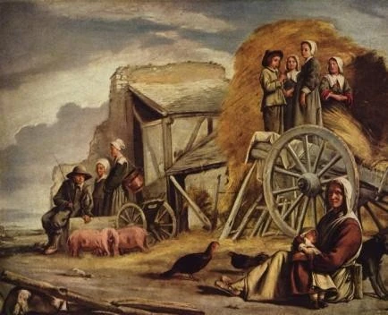

Les artisans des villes, enfermés dans des corporations rigides, innovent peu et peinent à se soutenir. Par ailleurs, de tous côtés les autres nations européennes dépassent la France et viennent concurrencer ses productions. Les succès commerciaux de l’Angleterre et de la Hollande sont dans tous les esprits.
 
Mais comment trouver la solution aux maux de l’époque ? Il n’existe pas encore de science de l’économie, pas encore donc de médecine spéciale à appliquer. Les principes de politique économique sont encore choisis sans discernement, faisant alterner des périodes plutôt restrictives et les périodes plus libérales. Certainement, on a des modèles, des références historiques à suivre. Il y a d’abord Sully, le ministre d’Henri IV, défenseur de l’agriculture et partisan d’une plus grande liberté des échanges à l’intérieur du territoire français. 

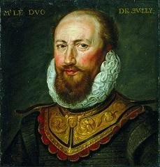

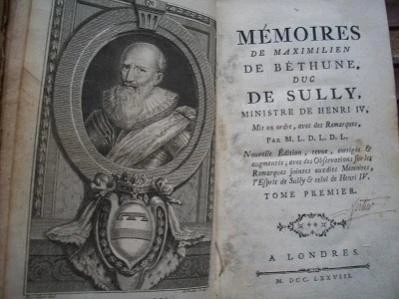

Mais il y a aussi Colbert, ministre de Louis XIV, soutenant tour à tour les règlements et la liberté mais appliquant plutôt les règlements. Or, à la toute fin du XVIIe siècle, Colbert a pris le pas sur Sully : les ministres se réclament de son héritage et tâchent d’appliquer ce qu’ils disent être ses maximes.

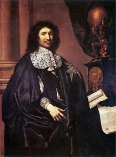

Les maximes de Colbert, dans l’esprit des hommes d’État de la toute fin du XVIIe siècle, sont au nombre de quatre.
(1) L’industrie a besoin de règlements et doit être contenue dans le cadre de corporations. Ces règlements spécifient par exemple comment doivent être fabriqués les draps et les toiles, leur taille et leur poids. On en compte alors des centaines, qui remplissent un volume spécial à chaque type d’industrie. Ces règlements ne suffisant pas, aux yeux des disciples de Colbert, il faut en outre encadrer l’industrie dans les corporations. 

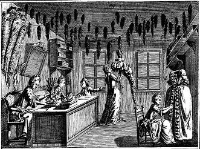

Tout individu qui veut exercer un métier doit ainsi passer plusieurs années d’apprentissage, puis de compagnonnage, avant de tenter son accession à la maîtrise en réussissant à produire un "chef-d’œuvre" et en versant une somme conséquente à la corporation. La concurrence à l’intérieur de chaque métier est donc sévèrement limitée.

(2) Le commerce est un jeu à somme nulle. Sur le sujet du commerce, les disciples de Colbert partagent les préjugés des peuples barbares de l’Antiquité. Selon le ministre de Louis XIV, il est "une guerre perpétuelle". Pourquoi ? La raison est simple. Pour Colbert et ses successeurs, toute augmentation de richesse pour un pays se traduit par un appauvrissement d’une autre nation. On ne peut pas autoriser les Anglais ou les Hollandais à s’enrichir, car ils nous voleraient notre prospérité. 

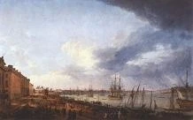

Il faut donc interdire ou taxer lourdement les produits venant de ces pays, et sans scrupules, car le commerce est une guerre où on ne peut souhaiter que la ruine des ennemis. 

> Les Français ne peuvent augmenter leur commerce qu’en écrasant les Hollandais 
> Colbert

(3) Si l’Etat manque d’argent, il suffit de lever davantage d’impôts. Colbert et ses disciples sont loin de penser que la richesse des contribuables est une ressource limitée. Il ne peut pas y avoir de problème de dépenses publiques, car il est seulement nécessaire de prélever suffisamment. Et si le peuple se révolte, c’est que les ministres s’y prennent mal pour lever l’argent, car "l'art de lever l'impôt consiste à plumer les oies sans trop les faire crier", aurait dit cyniquement Colbert.

(4) La richesse, c’est avant tout l’or et l’argent. Avant la naissance de la science économique, beaucoup d’auteurs se sont succédés en partageant à peu près un même dogme sur la nature de la richesse, qu’on a appelé le mercantilisme. Colbert et ses successeurs ont continué dans cette voie. Les mercantilistes, en peu de mots, considèrent que le signe de la prospérité d’une nation, c’est l’amas de métaux précieux, argent et or. 

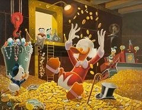

> Il n’y a que l’abondance d’argent dans un État qui fasse la différence de sa grandeur et de sa puissance.
> Colbert 

La conséquence de cela, c’est de favoriser à tout prix les exportations, pour amasser de l’or et de l’argent venant des autres nations, et de limiter au minimum les importations, pour éviter de leur en envoyer.

Tels sont donc les quatre principes que le pouvoir suit depuis plusieurs décennies quand la France entre dans le XVIIIe siècle. Or, ils ne vont pas tarder à être profondément remis en cause. Plusieurs auteurs, entre 1690 et 1710, vont en effet être marqués par l’état désastreux de la France. Ils en chercheront les causes, et concluront qu’elles se trouvent précisément dans ces quelques maximes héritées de Colbert, qui sont autant de sophismes. Par la même occasion, ils poseront ainsi les bases de la science économique.

## Vauban
<chapterId>ee9c1e0e-96cc-5026-a5e2-963d68122786</chapterId>

Aujourd’hui que la pression fiscale continue de croître dans notre pays, au risque d’étouffer les forces économiques nationales, des voix s’élèvent pour réclamer un changement. Consciemment ou inconsciemment, c’est sur le travail d’économistes français, qui, depuis le XVIIe siècle, ont critiqué la fiscalité française, toujours chaotique, toujours despotique, toujours excessive, que se fondent communément ces projets de réforme. 

Premier dans l’ordre chronologique de ces réformateurs de l’impôt, et non moins dans celui du mérite, est le grand maréchal Sébastien Le Prestre Vauban, célèbre constructeur des places fortes et des citadelles.

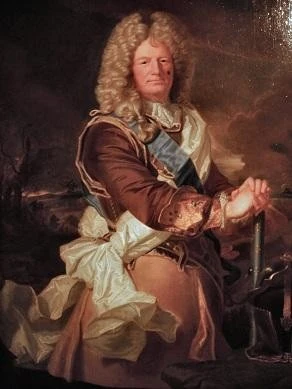

Comme nous l’avons malheureusement oublié, Vauban le militaire fut également un économiste. Il s’intéressa au sort des masses et proposa en 1695 (Projet de capitation) puis 1707 (Projet d’une dime royale) une réforme audacieuse de la fiscalité : remplacer la plupart des impôts existants par une taxe proportionnelle au revenu, une flat tax avant l’heure.

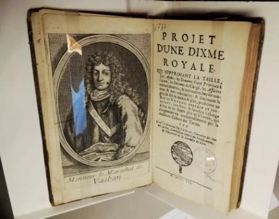

Vauban en est venu à ses idées par sa curiosité. Il était un observateur avisé, cherchant à étudier rigoureusement, presque scientifiquement, la vie sociale et la réalité économique. Il insista notamment beaucoup sur la nécessité de compter, via des recensements.

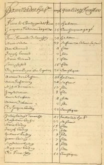

Son deuxième mérite est la description touchante et véridique de la misère des masses de son époque. Vauban écrit : "Il ne faut pas se flatter ; le dedans du royaume est ruiné, tout souffre, tout pâtit et tout gémit : il n’y a qu’à voir et examiner le fond des provinces, on trouvera encore pire que je ne dis". Loin d’être exagérés, ces aperçus lugubres étaient un témoignage parfaitement objectif de la réalité des conditions de vie du début du XVIIIe siècle. Conscient de cela, Alexis de Tocqueville qualifiera le constat de la Dîme Royale de Vauban d’"effrayant", car véridique. 

L’autre grand mérite de Vauban en tant qu’économiste est son attention à la proposition d’une réforme fiscale de grande envergure, capable d’éradiquer ou de faire diminuer en intensité le mal qu’il observe et décrit. En cela, il touchait juste, car l’économie française de l’Ancien régime était paralysée par l’impôt, inégalitaire, instable et illisible.

À travers tous ses différents mémoires économiques et politiques, l’ambition de ce réformateur était surtout le souhait de soulager ce qu’il appelle "la basse partie du peuple qui, par son travail, soutient et fait subsister la haute." 

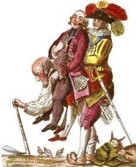

Il comprenait que la fiscalité oppressive et désincitative accablait les paysans, ce qu’il exprima avec clairvoyance, chose, du reste, que l’on observe encore parfaitement à notre époque:

> Le paysan laisse dépérir le peu de terre qu’il a, en ne la travaillant qu’à demi, de peur que si elle rendait ce qu’elle pourrait rendre étant bien fumée et cultivée, on n’en prît occasion de l’imposer doublement à la taille. 

Vauban voyait juste, car comme nous le savons aujourd’hui, l’Ancien Régime était marqué par une fiscalité irrationnelle et abusivement rigoureuse. C’est cette fiscalité, injuste dans sa distribution, et donc abusive dans son poids, que Vauban ambitionna de vaincre.

La solution proposée par Vauban, un impôt proportionnel, une flat tax sur tous les revenus, permettrait à l’impôt de se répartir entre toutes les classes de citoyens. Fondée sur une théorie de l’Etat qui expliquait que l’intervention de la puissance publique était légitime car elle seule pouvait protéger les droits des personnes et la propriété de chacun, sa réforme fiscale faisait contribuer tous les Français à l’effort, en proportion stricte de leur revenu : chacun paierait par exemple 10% de ses revenus.

Dans son projet de Dîme royale, le seul de ses mémoires qui fut imprimé de son vivant, Vauban écrivit de manière tout à fait claire : 

> Comme tous ceux qui composent un État, ont besoin de sa protection pour subsister, […] il est raisonnable que tous contribuent aussi selon leurs revenus, à ses dépenses et à son entretien […]. Rien n’est donc si injuste que d’exempter de cette contribution ceux qui sont le plus en état de la payer, pour en rejeter le fardeau sur les moins accommodés qui succombent sous le poids ; lequel serait d’ailleurs très léger s’il était porté par tous à proportion des forces d’un chacun ; d’où il suit que toute exemption à cet égard est un désordre qui doit être corrigé.

Peu avant sa mort, son idée fut suivie par les ministres de Louis XIV. Seulement, Vauban réclamait que l’impôt proportionnel soit instauré pour remplacer la totalité ou la quasi-totalité de la fiscalité existante. À la place, comme on fait souvent, on mit en place son impôt, mais on conserva tous les autres.

## Boisguilbert
<chapterId>200149c6-b5fc-566e-ab0e-bafb1c3fed3c</chapterId>

Rares sont les économistes français du passé qui, dans leur propre pays, jouissent aujourd’hui d’une célébrité à la mesure de leurs talents. Boisguilbert ne fait pas exception. 

Peu goûté par les lecteurs de son époque, éloigné des cercles du pouvoir par son excentrisme et son enthousiasme excessif, cet économiste ne marqua pas non plus le XVIIIe siècle. Heureusement, il est peu à peu redécouvert depuis le début du siècle dernier.

Seulement, à travers cette redécouverte récente, il apparaît que l’on a collectivement abouti à une impasse. On a perdu le mérite propre de Boisguilbert en le présentant comme le pionnier d’un grand nombre de théories et le précurseur d’un grand nombre d’auteurs. Il aurait compris la notion de sous-emploi défendue par Keynes, anticipé la loi de Say, préparé l’équilibre général de Walras, et même préfiguré l’analyse de classe des marxistes. "De qui et de quoi Boisguilbert ne pourrait-il pas être le précurseur ?" se demandait finalement un commentateur.  

Né à Rouen en 1746, élève de Port-Royal à Paris, Boisguilbert commence une carrière littéraire sans succès, puis acquiert diverses fonctions dont celle de Lieutenant-général de Rouen. Il écrit alors plusieurs livres pour défendre ses idées, dont le Détail de la France, en 1695, qu’il republiera l’année suivante avec un titre très représentatif : La France ruinée sous le règne de Louis XIV, par qui et comment, avec les moyens de la rétablir.

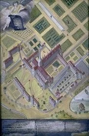
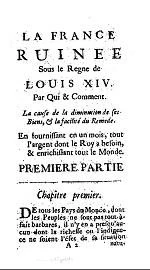

Et tel est le fond des livres de Boisguilbert : la misère française et ses causes.

Cette misère du peuple français de la fin du XVIIIe siècle, Boisguilbert la décrit longuement, comme Vauban du reste. Il écrit: 
> Les terres en friche ou mal cultivées, exposées à la vue de tout le monde, voilà le cadavre de la France. 

Il décrit les vignes arrachées, les paysans qui cessent de cultiver la terre, les famines récurrentes. 
À ce malheur, Boisguilbert trouve deux grandes causes. Car si le peuple vit dans le dénuement, c’est qu’on l’empêche de consommer le nécessaire, et la ruine de la consommation a deux causes. 

D’abord, on empêche le peuple de consommer parce qu’on le taxe arbitrairement. La taille, qui est l’impôt personnel de l’époque, est calculée à l’aveugle pour chaque individu et elle est susceptible de monter ou de baisser sans raison. En raison des privilèges nombreux, la charge retombe d’ailleurs sur les pauvres paysans, qui se retrouvent ruinés. Contre cela, Boisguilbert recommande d’établir un impôt proportionnel sur tous les revenus, un peu à la manière de Vauban.

La deuxième raison de la misère française, c’est que trop d’entraves empêchent le commerce libre des produits, notamment agricoles. Il y a des douanes aux frontières et même à l’intérieur du pays, entre les différentes régions, ce qui paralyse tout commerce. Ces restrictions empêchent l’établissement du prix d’équilibre et limitent les débouchés. Les paysans ne peuvent donc pas vivre de leur production, car ne pouvant pas vendre avantageusement, ils subissent les effets de prix agricoles non rémunérateurs — une préoccupation encore toute actuelle, qui est au centre de la théorie de Boisguilbert. Sur le point des entraves au commerce, Boisguilbert conseille de laisser les chemins libres, c’est-à-dire d’établir le libre-échange.

Et la liberté est bien sa conclusion finale. "Il n’est pas question d’agir, dit-il, il est nécessaire seulement de cesser d’agir avec une très grande violence que l’on fait à la nature, qui tend toujours à la liberté et à la perfection." Tout ira bien, répète-t-il inlassablement, "pourvu qu’on laisse faire la nature, c’est-à-dire qu’on lui donne sa liberté, et que qui que ce soit ne se mêle à ce commerce que pour y départir protection à tous, et empêcher la violence."

Ce dernier passage est crucial. Boisguilbert est le premier à réclamer distinctement une politique économique de laissez-faire, à en faire son credo, et à bâtir un véritable système autour de cette notion. Selon lui, il existe un ordre naturel des choses, et il convient de ne pas le corrompre, de ne pas le détruire, par des interventions publiques intempestives. L’Etat ne doit pas agir en ce qui concerne l’économie, mais laisser agir, sous peine de causer la misère. 

Boisguilbert en veut aux "bonnes âmes", comme il dit, qui souhaitent le bonheur du peuple mais s’y prennent tout de travers. Ils souhtaient le bas prix du pain pour le peuple, mais ce bas prix forcé empêche les cultivateurs de vivre de leur travail, il les ruine, les chasse de leurs terres et les précipite dans la misère. C’est en effet, on le sait bien, de bonnes intentions qu’est pavé l’enfer.

## Cantillon 
<chapterId>bc206d41-6a64-5688-a489-40fcfa0e5397</chapterId>

Auteur de l’Essai sur la nature du commerce en général (écrit vers 1730, et publié en 1755), Richard Cantillon est considéré comme l’un des pionniers de la science économique moderne. Dans son Histoire de la pensée économique, l’économie Murray Rothbard qualifiera Cantillon de fondateur de la science économique moderne.

Né en Irlande, Richard Cantillon s’installe à Paris dès sa jeunesse et acquiert la nationalité française. Il travaille comme banquier et fait fortune lors de l’époque du système de John Law. 

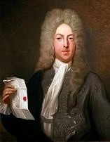

C’est à cette occasion, aussi, qu’il se met à la théorie économique.
Vers 1730, Cantillon compose son Essai sur la nature du commerce en général. 

Ce livre peut être interprété comme étant l’une des premières tentatives de théorie générale de l’économie. Cantillon a soin de dégager ce qu’il convient d’appeler des "lois générales de l’économie", celles qui sont dans la nature des choses, et non dans les faits particuliers de tel ou tel pays. Une telle démarche est révolutionnaire.

On peut résumer à cinq domaines les grands mérites de l’Essai de Cantillon : la théorie de la richesse, la notion de l’entrepreneur, la critique des monnaies sans valeur, les "effets Cantillon", et enfin la défense de la liberté.

Premier point, la théorie de la richesse. Contrairement au mercantilisme, dominant en son temps, Cantillon fonde son analyse sur la reconnaissance du fait que les produits propres à la jouissance de l’homme forment la richesse. Cette richesse provient de la nature et en est tirée par le travail de l’homme. Son analyse de la nature des richesses a très fortement influencé Beccaria et Adam Smith, et à travers ce dernier toute l’école classique anglaise.

Deuxième point, Cantillon voit dans l’entrepreneur, bien que défini peu précisément, l’acteur principal et comme central de l’activité économique. Chez Cantillon, ce qui caractérise l’entrepreneur, c’est qu’il est un preneur de risque, c’est qui agit dans l’incertitude. Par ces idées sur l’entrepreneur, Cantillon a initié une tendance qui s’épanouira avec Turgot, et plus encore avec Say, pour enfin reconnaître à l’entrepreneur une place à part dans l’économie, contrairement cette fois-ci aux affirmations de l’école anglaise. 

Troisième point, la monnaie. En réaction à l’expérience de John Law, Cantillon nous explique ce qui arrive ou ce qui doit arriver lorsque la monnaie est sans valeur réelle. 

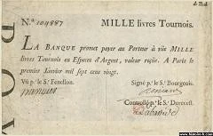

Il voit deux principales conséquences de la substitution d’une monnaie sans valeur réelle comme le papier-monnaie à une monnaie métallique. La première conséquence, c’est ce qu’il appelle le "rejet par les peuples", et qui signifie une défiance croissante envers la monnaie sans valeur. La seconde conséquence, c’est l’inflation. L’affaiblissement monétaire enchérit les marchandises.

Dans son analyse de l’inflation, Cantillon va plus loin que ses contemporains, et c’est notre quatrième point. Observateur de la faillite du système de Law, Cantillon avait pu se convaincre du fait que les effets de l’inflation monétaire étaient loin d’être uniformes : tandis qu’elle enrichissait les uns, elle appauvrissait les autres. Il en conclut que l’inflation ne touche pas chacun uniformément : selon les canaux de transmission que la nouvelle monnaie emprunte, l’inflation a un effet redistributif. Ceux qui bénéficient le plus tôt de cette nouvelle monnaie profitent d’un pouvoir d’achat supplémentaire, tandis que les derniers utilisateurs, confrontés à l’inflation qui s’est installé peu à peu, s’appauvrissent par l’émission monétaire nouvelle.

Enfin, cinquième point. Malgré quelques restes de mercantilisme, Cantillon a une démarche pleinement libérale. Il défend la propriété privée comme base fondamentale de la civilisation, en expliquant qu’aucune société n’est possible sans cette propriété privée des terres et des produits du travail. Cantillon décrit aussi comme naturelle et légitime l’inégalité matérielle entre les hommes. Selon lui, il n’y a rien de choquant à ce qu’un travailleur efficace et courageux, ou exceptionnellement doué, parvienne à gagner davantage qu’un incompétent ou un fainéant. Enfin Cantillon veut que les prix se déterminent toujours librement, par le jeu de l’offre et de la demande, sans intervention de la puissance publique.

Parmi ces cinq grandes idées de son Essai, la plus importante est certainement celle à laquelle on a donné son nom : les effets Cantillon. Avec cette théorie des effets de l’inflation, Cantillon nous apporte des réponses à quelques maux contemporains. Il permet en outre de comprendre les conséquences des récentes politiques monétaires expansionnistes et inflationnistes, qui ont appauvri les classes moyennes et le monde rural, et enrichi principalement les opérateurs des marchés financiers ainsi que l’État, ses agences et ses fonctionnaires, du fait de leur proximité conjointe à la source de l’émission nouvelle : la banque centrale et les banques commerciales.

# Les Réformateurs et Penseurs du Début 18e Siècle
<partId>1f7b50d4-ce93-5db3-8396-43c1fa5419ff</partId>
## L’abbé de Saint-Pierre
<chapterId>13478fe2-4c12-593c-a410-54c2cfb7ef7f</chapterId>

De tous les auteurs que nous avons sélectionné pour rejoindre le panthéon des penseurs français du laissez-faire au XVIIIe siècle, l’abbé de Saint-Pierre est sans aucun doute le plus méconnu. 

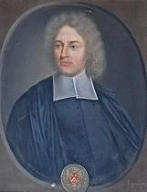

C’est un peu de sa faute, parce qu’il a beaucoup, beaucoup écrit, et qu’il est assez pénible à lire, se répétant sans cesse. Jean-Jacques Rousseau essaya de résumer ses ouvrages ; il commença à le faire, mais abandonna assez vite cette tâche, car il comprit qu’elle était au-dessus de ses forces. Au milieu du XIXe siècle, Gustave de Molinari a fait beaucoup d’honneur à l’abbé de Saint-Pierre en publiant sur lui un ouvrage complet, dans lequel il rend hommage au pacifiste et à l’économiste qu’était l’abbé de Saint-Pierre. Mais cela n’a pas suffi pour le faire sortir de l’oubli car il y est encore plongé de nos jours.

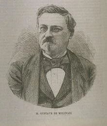
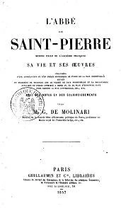

L’abbé de Saint-Pierre a écrit sur l’économie, mais c’est plutôt comme pacifiste que l’on s’intéresse d’habitude à lui. Il est l’auteur d’un Projet de paix perpétuelle, qui est antérieur à celui, bien connu, d’Emmanuel Kant.

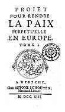

Il y montre que les guerres sont destructives pour ceux qui les perdent comme pour ceux qui les gagnent, et même pour ceux qui n’y participent pas, car leur commerce en est atteint. 

Pour lutter contre le fléau de la guerre, il recommande la constitution d’une sorte de ligue des nations européennes. Il se formerait un conseil européen où devraient se résoudre les problèmes des uns et des autres. On aurait donc recours à l’arbitrage, afin d’éviter d’en venir aux armes. Si une nation ne se montrait pas assez sage pour adopter la paix, si elle menaçait les autres nations européennes, l’entente européenne aurait de quoi répondre. On aurait recours, face à de tels évènements, à une armée européenne dont les forces seraient fournies par les différents pays.

Il y a aussi, dans la vie de l’abbé de Saint-Pierre, un fait qui illustre bien l’intention critique qui est à la base de la démarche du laissez-faire français. Il était entré en 1695 à l’Académie française. Il en fut expulsé en 1718 pour avoir osé critiquer le bilan du règne de Louis XIV. En cela il est à rapprocher de Vauban et de Boisguilbert, qui ont osé parler de la misère populaire cachée sous le faste du règne du Roi Soleil. 

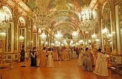

L’abbé de Saint-Pierre avait soutenu que le règne de Louis XIV, apogée du luxe de la cour et de l’esprit de conquête militaire, n’était pas celui d’un roi vertueux. Il refusait d’admettre que Louis XIV puisse mériter le titre de Louis le Grand. 

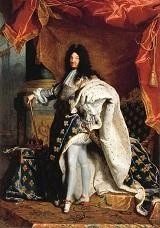

Ruiner ses voisins et son peuple en même temps, ce n’est pas de la grandeur, disait-il. L’Académie française, qui avait fini par s’occuper à plein temps de faire des éloges du Roi, sous toutes les formes littéraires possibles, en fut très choquée et prononça à la quasi-unanimité le renvoi de l’abbé de Saint-Pierre.

En économie, il a toujours suivi le principe de l’utile, comme Bentham plus tard, et a fourni généralement de bons aperçus. Il était, c’est certain, encore imprégné de mercantilisme, à une époque où personne ne s’en était encore pleinement détaché. 

Cependant, l’abbé de Saint-Pierre a aussi dit des choses très justes sur l’économie.
Avant Condillac, dont c’est l’un des principaux mérites, il a énoncé cette idée toute simple que dans un échange, les deux parties y gagnent. On la trouve dans son Projet pour perfectionner le Commerce de la France, qui date de 1733. Il y dit expressément :

> Quand il se fait une vente entre marchands, le vendeur y gagne et l'acheteur aussi ; car, sans un gain réciproque et réel ou apparent, ni le vendeur ne vendrait à tel prix, ni l'acheteur, de son côté, n'achèterait à tel prix.

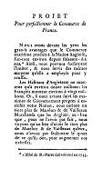

Il a aussi mis l’accent, avant Vincent de Gournay, sur les vertus du travail et sur la nécessité de le laisser attractif. "Tout travail est pénible, dit l’abbé de Saint-Pierre, et lorsque l'homme voit que son travail ne lui rapporte pas ou ne lui rapporte pas suffisamment, il demeure oisif et ne se donne pas de peines inutiles." Ce même propos sera repris par le marquis d’Argenson, par Vincent de Gournay et par les physiocrates pour s’opposer aux règlements tatillons et au système corporatif. Les corporations et les règlements, dirent-ils, découragent le travailleur, lui causent des peines inutiles, et le poussent finalement dans l’oisiveté, qu’il finit par trouver préférable à une activité productive exercée dans ces conditions.

## Le Marquis d’Argenson
<chapterId>e9960ab4-72ec-5afd-8e97-bf89c83b62bc</chapterId>

Le marquis d’Argenson est un fondateur oublié de la doctrine du laissez-faire. 

Il a été redécouvert par August Oncken, auteur d’un livre sur la doctrine du laissez-faire laissez-passer, qui conclut au rôle majeur joué par d’Argenson dans la naissance de cette idée.

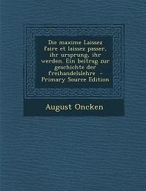

René-Louis Voyer, marquis d’Argenson, est né en 1694. Il commença dans la politique en servant en tant que conseiller au parlement, puis au Conseil d’État. 
Trente ans avant Adam Smith, le marquis d’Argenson défendit les mérites de la division du travail et de la spécialisation. 

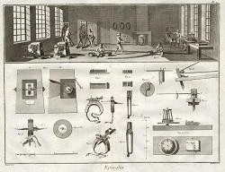

Il critiqua fortement les règlements qui tendaient, disait-il, à modifier les préférences qu’on faisait dans chaque lieu. Ainsi il s’étonnait qu’on voulait faire fabriquer à Tours, une ville pauvre à l’époque, des draps et des velours aussi beaux qu’à Gènes, ville prospère, connue pour son luxe. Il concluait : "Il faut laisser à chaque lieu le choix des manufactures qui lui sont propres. Liberté ! Liberté !" 

Il ne manqua pas non plus de reconnaître un autre principe central chez Smith, l’ordre spontané naissant de la recherche de l’intérêt personnel. Le marquis d’Argenson était convaincu qu’un intérêt direct et prochain stimule l’énergie de l’homme. Il écrivit que l’imperfection et la fraude discréditent le fabricant, et qu’au contraire la diligence et la bonne foi l’enrichissent. Le meilleur arbitre de l’utilité, disait-il encore, c’est l’individu, c’est la masse du public qui consomme et qui est intéressé à bien acheter. "Chacun sent son intérêt, écrivait-il, chacun prend les mesures qui lui sont profitables, et c’est dans cet accord général que nous découvrons la vérité."  

Avant Adam Smith, il comprenait que l’intérêt personnel bien entendu menait à l’intérêt général par la construction d’un ordre naturel spontané. 

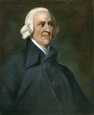

Il comparait ainsi la société à une ruche d’abeilles où chaque où chaque insecte agit selon son instinct. Il résulte de leurs actions, disait-il précisément, un grand amas pour les besoins de la petite société ; mais cela ne s’est pas opéré par des ordres, ou des généraux, qui aient obligé chaque individu à suivre les vues de leur chef." Une telle formulation est la plus proche que l’on trouve dans les écrits économiques français de la célèbre main invisible d’Adam Smith.

Le marquis d’Argenson fut toujours outré des idées que partageaient les ministres de l’époque. La seule question qu’ils posaient était : faut-il réglementer de cette manière ou de cette manière, conduire l’économie dans telle direction ou dans telle autre ?  N’y aurait-il pas lieu d’examiner auparavant, leur répondit d’Argenson, s’il convient de diriger toutes ces choses, ou de les laisser aller d’elles-mêmes ?
 
À vrai dire, d’Argenson s’étonnait qu’on ait tant de mal à comprendre ou plutôt à voir les mauvais effets des règlements de toute sorte sur l’économie. Il suffisait selon lui d’ouvrir les yeux pour les voir. Que de choses vont encore passablement aujourd’hui, notait-il amèrement, par la seule raison qu’elles ont échappé jusqu’à présent aux lois. Parfois, il désespérait de voir ses idées si peu comprises. 

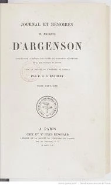

L’idéal de politique économique qu’il défendait s’inscrivait donc contre les tendances de son époque. Son idéal définissait pour l’État un rôle essentiellement négatif. "Le retranchement des obstacles est tout ce qu’il faut au commerce, écrit-il. Il ne demande à la puissance publique que de bons juges, la punition du monopole, une égale protection à tous les citoyens, des monnaies invariables, des chemins et des canaux." C’était la définition de l’Etat minimal, qui allait être un des socles de la tradition française en économie politique.

Cette vision du rôle de l’État face à l’activité économique s’illustrait naturellement dans l’étude des deux grandes questions qui remuèrent les économistes et les penseurs sociaux de son temps : la réglementation de l’industrie et le commerce du blé.

Les règlements sur l’industrie, d’abord, obtenaient tout son ressentiment, parce qu’ils étaient des privilèges pour les uns aux dépens des autres. "La vraie cause du déclin de nos fabriques, écrivait-il, c’est la protection outrée qu’on leur accorde". Et c’est avec un credo non moins vif qu’il exprimait sa critique face au zèle dirigiste des hommes d’état de son temps : 

> Diriger l’industrie malgré elle, c’est vouloir sa ruine.

Sur la question du commerce des subsistances, d’Argenson n’avait pas d’autre réponse que la liberté. Les disettes de froment venaient selon lui du monopole et des précautions abusives que prenait le gouvernement. Il suffisait qu’on laisse faire, et il n’arriverait jamais de disette de blé dans un pays où les ports seront ouverts ; les étrangers, attiré comme tous les autres hommes par l’appât du gain, nous fourniraient le nécessaire et emporteraient notre surplus. "Laissez libre, disait-il, et tout ira bien."

## Vincent de Gournay
<chapterId>e8ae40dc-7450-552f-9ddc-9e02936cf425</chapterId>

Vincent de Gournay est l’un des premiers représentants du laissez-faire en France et l’un de ses premiers défenseurs dans l’administration publique et dans les cercles intellectuels. Il mérite, à ce titre, une mention plus que conséquente dans l’histoire des idées, mention qui lui est encore rarement faite. J’ai essayé pour ma part de signaler ses mérites dans un récent livre.

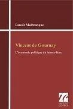

Fils de commerçant, devenu commerçant lui-même, Gournay a acquis une grande fortune avant d’obtenir un poste dans l’administration. Au sein du Bureau du commerce, il milita avec ferveur pour la liberté du travail et la liberté du commerce.
Mêlé avec tous les grands économistes de son temps, Gournay a cependant peu écrit, ou plutôt peu publié. Il composa surtout des lettres administratives, des mémoires non rendus publics ou publiés par d’autres auteurs après retouches. 
On a de lui (1) des Remarques sur une traduction d’un ouvrage de l’économiste anglais Josiah Child ; 

(2) des "Observations" insérées dans l’Examen des avantages et des désavantages de la prohibition des toiles peintes ; 

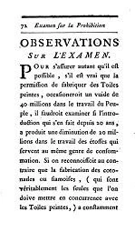

et (3) des "Observations sur la compagnie des Indes" jointes par l’abbé Morellet à son Mémoire sur la situation actuelle de la compagnie des Indes (1769). 

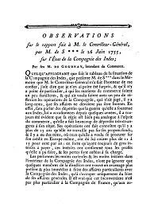

On a en outre et surtout (4) des mémoires issues de son activité comme intendant du commerce.

Ces écrits manifestent une influence étrangère claire et la présence de quelques grandes idées structurantes.
L’influence étrangère, chez Gournay, c’est la reconnaissance de la supériorité anglaise et hollandaise. Gournay est convaincu que ces deux nations ont mieux compris l’économie que nous, et qu’il nous faut suivre leur exemple. Ces deux nations sont les plus prospères, dit-il, et elles suivent un tout autre système que nous. Nous interdisons l’entrée des marchandises étrangères, nous enfermons l’activité économique dans des règlements draconiens, et eux procèdent à l’inverse. S’ils réussissent mieux que nous, c’est que nous suivons de mauvais principes, conclut Gournay.

Ses idées de réforme portent sur plusieurs points principaux.
D’abord, il convient de protéger et favoriser le travail. Aujourd’hui, le travailleur français est traité comme un criminel, contrôlé, surveillé, et tenu constamment dans la peur de ne pas avoir respecté l’un des milliers de règlements. Toute cette tracasserie dégoûte les travailleurs de leur métier et leur font préférer l’oisiveté. Or, ajoute Gournay, le travail est noble, et c’est la seule source pour enrichir une nation.

Ensuite, les fabricants sont enfermés dans des corporations qui limitent la production. L’accès à chaque métier est très long et très coûteux et chaque nouveau travailleur doit ensuite suivre scrupuleusement la routine entérinée par les statuts de sa corporation. Pas de place, dans ce système, pour l’excellence, pour l’innovation, pour le progrès.

En troisième lieu, le commerce est bridé, limité en France par des lois restrictives. Pour l’avantage du consommateur, il faut, selon Gournay, permettre la concurrence entre les ports et autoriser la libre importation de toutes les marchandises, y compris les grains et les toiles peintes, deux objets de commerce alors très réglementés. Gournay est l’un des premiers, à ce sujet, à signaler l’origine de la contrebande : pour lui, la contrebande se développe uniquement parce qu’on interdit un commerce avantageux et utile. Il ajoute même un autre argument, c’est que la profession de contrebandier est libre, il n’y a ni règlement, ni corporation, ni taxe confiscatoire à payer. Et pour cause, puisque l’activité est illégale. Mais voilà en tout cas autant de travailleurs jetés dans l’illégalité, par simple profusion réglementaire. 

Enfin, Gournay remarquait qu’en Angleterre et en Hollande, deux pays plus prospères que la France, les taux d’intérêt étaient à un niveau inférieur que chez nous. Il insista ainsi pour que le taux d’intérêt soit abaissé en France, afin que l’activité économique y soit financée à des conditions aussi avantageuses qu’ailleurs. Gournay ne rechercha pas, cependant, des méthodes coercitives et législatives. Il insistait surtout sur la nécessité d’autoriser les Français à s’adonner au prêt d’argent, encore condamné par l’église catholique.

Sur ces différents points, Gournay a participé au débat d’idées au milieu du dix-huitième siècle. Sa défense de la liberté du travail est antérieure de dix ans à celle des Physiocrates, de vingt ans à celle d’Adam Smith. Cependant, c’est sur Turgot que Vincent de Gournay eut l’influence la plus visible. Gournay prit sous son aile le jeune Turgot et le forma à ses idées.

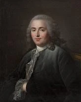

Plus tard, le futur ministre de Louis XVI composa un Eloge de Gournay en l’honneur de son ami défunt. Et si Turgot ne se rangea jamais complètement à la physiocratie de François Quesnay, c’est qu’il conservait un attachement invincible à son premier maître, Vincent de Gournay.

## Le groupe de Gournay
<chapterId>b86ba6bd-8f3a-5d8f-b098-4d0413f00deb</chapterId>

Sur l’époque des débuts de la science économique, l’histoire a surtout retenu le souvenir de la première école de pensée, la Physiocratie de François Quesnay et de ses disciples. Dix ans auparavant, il avait toutefois existé un autre groupe, plus informel, mais tout aussi important, autour de l’économiste Vincent de Gournay.

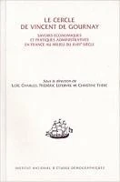

Comme nous l’avons vu lors de la précédente leçon, Gournay était fasciné par l’exemple des nations étrangères comme l’Angleterre et la Hollande. Il avait la même admiration pour leurs économistes, comme Josiah Child, Jean de Witt ou David Hume.

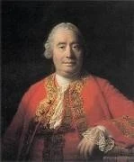

C’est ce qui l’incita à traduire et à faire traduire ces écrits économiques.

Or il s’avérait que sa position dans la haute administration permettait à Gournay d’entrer en contact avec tous les spécialistes de l’économie que connaissait la France de l’époque. C’est ainsi qu’il constitua un groupe de traducteurs extrêmement capables. Gournay traduisit lui-même Child et Culpeper ; l’abbé Le Blanc traduisit les Discours politique de David Hume ; Véron de Forbonnais traduisit l’espagnol Geronymo de Uztariz ; Turgot traduisit Tucker ; Montesquieu fils traduisit Joshua Gee.

Grâce à la collaboration de plusieurs membres du cercle de Gournay, de nombreux auteurs publièrent aussi des écrits sous leur nom. Ces livres, ainsi que les traductions, eurent un véritable succès. On peut citer notamment l’Essai sur la police générale des grains de Herbert (6 éditions en 4 ans),

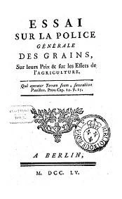

la Noblesse commerçante de Coyer (5 éditions en 2 ans),

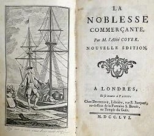

les Remarques sur les avantages et les désavantages de l’Angleterre par Plumard de Dangeul (3 éditions dès l’année de sa parution) et le Mémoire sur les corps de métiers par Cliquot-Blervache et Gournay (2 éditions en 1758).

On doit aussi au cercle de Gournay d’avoir lancé la publication de l’Essai sur la nature du commerce en général de Richard Cantillon. 

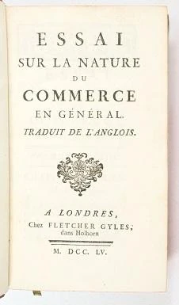

Ce livre, composé vers 1730, était resté à l’état de manuscrit à la mort de l’auteur. C’est Gournay, aidé par ses amis économistes, qui en assura la publication en 1755. Selon l’abbé Morellet, membre du cercle, Gournay en recommanda la lecture à tous les économistes qu’il connaissait.

Ces productions intellectuelles du cercle de Gournay ont eu un impact considérable sur l’histoire des idées. À ce titre, le cercle de Gournay est à placer aux origines de la science économique en France. Christine Théré, de l’INED, a travaillé sur les publications économiques dans l’histoire, et elle montre que pas moins de 349 ouvrages d’économie furent publiés entre 1750 et 1759, contre seulement 83 entre 1740 et 1749. Cette révolution, dans la décennie 1750, est à mettre en grande partie au crédit du cercle de Gournay.

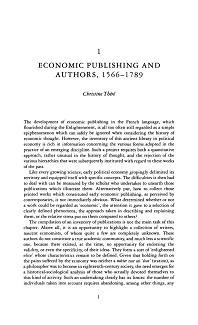

Pour diffuser le goût des discussions économiques dans la population française, Gournay et ses amis travaillèrent à rendre ces questions accessibles en utilisant le roman. C’est ainsi qu’après un Mémoire sur les corps de métiers, critiquant les corporations, Gournay et Cliquot-Blervache aidèrent l’abbé Coyer à écrire le texte connu sous le nom de Chinki : histoire cochinchinoise applicable à d’autres pays. 

Il s’agit d’un court roman dans lequel le personnage principal, Chinki, abandonne ses terres à cause de la fiscalité excessive et cherche à trouver un travail artisanal pour ses enfants en ville. Or tous les métiers leur sont fermés à cause des règlements abusifs des corporations et il va ainsi de déception en déception, le tout avec humour.

Le cercle de Gournay est donc à l’origine d’une intense activité de publication. Si cet apport majeur a été oublié par les historiens de la pensée économique, il était très clair dans l’esprit des contemporains. Les physiocrates, qui structurent leur école dans la décennie 1760, présenteront le groupe de Gournay comme des précurseurs directs. En 1767, l’économiste Jacques Accarias de Serionne sera encore plus clair dans son éloge. Il écrit : "Un petit nombre de français, également philosophes et citoyens, commencèrent il y a quelques années à imiter les écrivains anglais. Ils traduisirent d’abord leurs modèles, et les ont bientôt surpassés en beaucoup de choses. Ils ont employés tous les agréments, toutes les richesses de la littérature, à traiter des choses utiles ; ils ont fait naître et répandu le goût des sciences les plus nécessaires à la prospérité de l’État." Et en effet, dans la décennie 1750, les questions économiques sont devenues à la mode. On connaît le mot de Voltaire, selon lequel vers 1750 les Français ont abandonné les romans pour discuter de la liberté du commerce des blés. C’est aussi ce qu’observait le Mercure de France. On lit dans un numéro de 1758, quelques mois avant la mort de Gournay : "L’économie politique est aujourd’hui la science à la mode. Les livres qui traitent de l’Agriculture, de la population, de l’industrie, du commerce et des finances, sont dans les mains d’une infinité de personnes qui, naguère, ne feuilletaient que des romans." On ne pouvait donner meilleur hommage à Gournay et à l’activité de son cercle d’économistes.

## Mirabeau
<chapterId>2d2f802b-e3b6-556f-9025-a1b1dc4409ca</chapterId>

La France a connu deux grands Mirabeau, le père et le fils, mais un seul est rentré dans l’histoire. Est resté célèbre en effet le fils Mirabeau, tribun révolutionnaire, l’une des personnalités centrales des évènements de la Révolution française. 

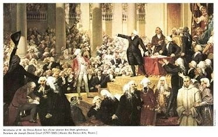

Par son talent et sa place dans l’histoire de France, il a fait oublier son père économiste, pilier de l’école de François Quesnay, dont il avait été, dès 1758, son premier membre.

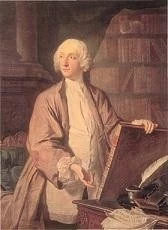

Le marquis de Mirabeau avait d’ailleurs connu une immense célébrité avant même son adhésion à la Physiocratie. C’était en 1757, un an avant sa rencontre avec Quesnay, de par un livre intitulé L’Ami des Hommes. Traité de la population. 

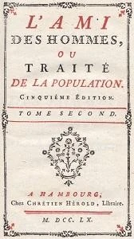

Ce fut un immense succès, peut-être le plus grand succès de l’histoire pour un livre d’économie. On compta en effet pas moins de 20 éditions de 1757 à 1760, pour ce livre que le public attribua d’abord à Montesquieu, frappé par la qualité des raisonnements. Le dauphin, père de Louis XVI, prétendait savoir le livre par cœur, et ce fut pendant quelques mois une lecture à la mode à Versailles.

Aujourd’hui c’est un livre qu’on ne lit plus, mais qui est souvent cité ; et déjà au XIXe siècle Edmond Roussel disait : 

> L’Ami des Hommes est un de ces livres dont tout le monde parle, que presque personne ne connaît, et que dans chaque génération, un courageux citoyen devrait lire … pour en dispenser tous les autres. 

En ce début de sa carrière d’économiste, Mirabeau s’inspirait de Richard Cantillon. Il possédait en effet depuis 15 ans un manuscrit de son Essai sur la nature du commerce en général, qu’il avait analysé et commenté patiemment.

 L’Ami des Hommes fut d’ailleurs, aux origines, conçu comme un simple commentaire de l’Essai de Cantillon. Mais comme Mirabeau était un esprit un peu éclectique, c’est-à-dire, en clair, un peu fou, il a très vite dérivé de son plan. Finalement, dans l’Ami des Hommes, Mirabeau parle tout simplement de toutes les questions économiques qu’il connait, en s’éloignant de temps en temps de Cantillon. C’est un livre difficile à lire, au plan farfelu et avec des digressions à chaque chapitre.
Mirabeau avouait lui-même que c’était un chaos et que son style était apocalyptique. 

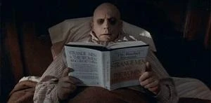

Dans ce chaos qu’est l’Ami des Hommes, quelques idées sont à noter :

* Mirabeau combat le préjugé mercantiliste sur la nature de la richesse
* Il fait l’éloge de l’agriculture et reproche qu’on l’ait abandonné
* Il se plaint de la condition du peuple et notamment des paysans  
* Enfin il défend la liberté du commerce et la fraternité des nations dans la paix

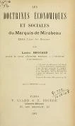

De ce point de vue, pourtant, il est difficile de classer le Mirabeau de l’Ami des Hommes dans une catégorie comme le libéralisme ou l’antilibéralisme, car il oscille constamment, et souvent sans s’en apercevoir, entre l’un et l’autre. Assez souvent le libéralisme domine cependant, et il a des phrases éclair comme celle-ci : 

> Le réel et unique principe de l’économie politique est de laisser tout libre.

Auréolé du plus grand succès, Mirabeau est courtisé. François Quesnay, qui vient de s’intéresser à l’économie, le fait venir à Versailles dans son entresol. 

Ils débattent furieusement et finalement, chose qui normalement n’arrive jamais dans des débats, Mirabeau avoue platement s’être trompé. Il se range aux idées de Quesnay et se dit prêt à en être le propagateur. 

Ensemble, ils forment le noyau dur de ce qui deviendra l’école physiocratique, grâce aux recrues régulières qu’ils feront. Dès après la conversion de Mirabeau, Quesnay l’utilise pour défendre ses idées fiscales : ce sera la Théorie de l’Impôt, pour lequel Mirabeau est envoyé quelques jours à la prison de Vincennes, puis exilé à Bignon. 

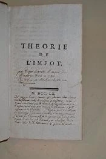

Par la suite, Mirabeau fera beaucoup pour recruter des nouveaux membres pour l’école de Quesnay. Il parvint à convaincre notamment le jeune Dupont de Nemours. 

C’est aussi chez Mirabeau que, tous les mardis, se réuniront les Physiocrates. Des personnalités comme Turgot et Adam Smith semblent avoir participé une fois ou plusieurs fois à ces réunions.

Tout au long de sa vie, Mirabeau est resté un écrivain infatigable. Il est l’auteur de nombreux travaux économiques défendant la doctrine de Quesnay. Cependant, vers la fin de sa vie il perdit en influence. Son style devint encore pire, au point que son propre frère lui écrira ne plus comprendre sa prose. Ses idées, devenues pleinement libérales, font face à la réaction socialiste ou proto-communiste d’auteurs comme Mably voire Rousseau. Il a du mal à se faire lire et à se faire éditer. Il meurt dans une certaine indifférence en 1789, la veille de la prise de la Bastille.  

## Quesnay
<chapterId>7a35f20b-5ea0-544d-b290-bcd9c6f7f11a</chapterId>

François Quesnay est l’un des économistes français les plus célèbres. 

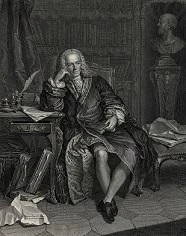

Son nom est cité dans tous les manuels d’économie et d’histoire de la pensée économique. Ils indiquent sur lui qu’il a composé le Tableau économique pour représenter schématiquement l’économie, qu’il fut le chef de l’école des Physiocrates, et qu’il s’est trompé en pensant que seule la terre est productive — et qu’enfin Adam Smith est venu pour rétablir la vérité. C’est à peu de chose près le résumé des manuels au sujet de François Quesnay. 

Le réduire à cela, c’est un peu dommage, car Quesnay a aussi été le premier économiste à chercher à fonder la défense de la liberté économique sur des bases scientifiques ; il a été l’un des économistes les plus écoutés et les plus influents de son siècle, et enfin il a fondé la Physiocratie qui est beaucoup plus riche que cette simple idée de production par la seule nature, que d’ailleurs on caricature souvent. 

Nous parlerons plus en détail de la Physiocratie dans les trois prochains chapitres. Voyons d’abord François Quesnay lui-même.

Il est né en 1694 à Méré, dans une famille de paysans où il n’apprit même pas à lire. Formé auprès d’un homme de son village, il fit tout de même des études : il entre au collège de chirurgie puis part à la faculté de médecine. À 24 ans, il devient chirurgien à Mantes. 

Il devient célèbre en 1730, à 36 ans, en s’opposant à la saignée, pratique qui selon lui est le résultat de théories fausses et de préjugés. Il ose également défier le système des corporations, dans lequel les chirurgiens peuvent seuls faire les opérations et les médecins donner les médicaments ; dans de nombreux cas, le bas peuple devait payer deux fois, et faire venir deux personnes, ce qui révoltait Quesnay. 

En 1740, il devient secrétaire de l’Académie de chirurgie. En 1748, il a 54 ans quand il devient le médecin personnel de Mme de Pompadour. Il s’installe à Versailles.

Il fut très lié à Mme de Pompadour. Quesnay dira même, au moment où on annonçait la disgrâce de la favorite, qu’il ne voudrait pas rester médecin à Versailles sans elle : "J’ai été attachée à Mme de Pompadour dans sa prospérité ; je le serai dans sa disgrâce."

Il publie alors plusieurs livres médicaux : Traité sur la Suppuration (1749), Traité sur la gangrène (1749), Traité des fièvres continues (1753), trois ouvrages plusieurs fois réédités de son vivant.
À 60 ans, initié aux discussions économiques à la mode à l’époque, il commence à écrire sur l’économie. En 1755, il écrit l’article Fermiers et Grains pour l’Encyclopédie. 

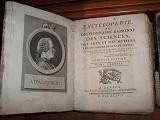

Ils paraissent en 1757. La même année il rencontre le célèbre Mirabeau et parvient à le convaincre à ses idées : le noyau de la Physiocratie est formé. Quesnay compose ensuite le Tableau économique, imprimé sur les presses royales, sous les yeux du roi, dit-on, au château de Versailles.Dès lors il reçoit régulièrement économistes et philosophes dans son entresol versaillais et ils y discutent librement. Quesnay collabore à la Théorie de l’impôt de Mirabeau, parue en 1759. 

La censure intervient, Mirabeau est envoyé en prison, et Quesnay est réprimandé également. À partir de ce moment, il comprend qu’il ne peut pas écrire publiquement, il a besoin de disciples.

Il en trouve rapidement : Baudeau, Dupont de Nemours, Le Trosne, Mercier de la Rivière, etc. Ce sont ces hommes qui vont diffuser et populariser la pensée du maître Quesnay. Cependant celui-ci, qui avait besoin de disciples, n’était pas pleinement satisfait de l’aspect sectaire de son groupe. Témoin de cela ses lettres à Mirabeau, où il lui dit : 

> Pensez par vous-mêmes. Je me suis aperçu que mes misérables brouillons vous rendaient paresseux. Pensez à votre tour. Vous en savez autant que moi.

Cependant ces disciples furent très dévoués à Quesnay et ont beaucoup servi à sa popularité. Quand il meurt, Mirabeau prononce son éloge funèbre et dit : "Nous avons perdu notre père, car nous lui devions tout." En vérité, c’est Quesnay qui leur devait tout : car sans eux il se retrouvait coincé à Versailles, où sa pensée avait de quoi séduire ou inquiéter, mais qui n’intéressait pas grand monde.

Grâce à l’activité de ses collaborateurs, ses idées avaient une tribune : d’abord des journaux, le Journal de l’Agriculture et les Ephémérides du Citoyen. 

Ensuite des ouvrages : outre les livres des disciples, un recueil important qui paraît en 1768 et auquel Dupont de Nemours donne le titre "Physiocratie".

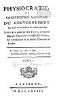

Ce livre reprend les principales contributions de Quesnay. On y retrouve exposé l’idéal économique du chef des Physiocrates, l’idéal d’une économie agricole, où la loi garantit à chacun son droit de propriété et la liberté des échanges.

# L'École Physiocratique
<partId>27af82c1-ad82-5c3b-8ce9-c674b67bbf7c</partId>

## Les Physiocrates (1) Histoire
<chapterId>4236ff8b-b53a-59e7-92c0-f96f9afa1c00</chapterId>

La Physiocratie a été à la mode en France, mais aussi en Europe, pendant à peine une décennie. Après plusieurs années de lente maturation, elle apparut sur le devant de la scène au milieu des années 1760. Au moment de l’arrivée au pouvoir de Turgot, en 1776, elle avait déjà cessé d’être populaire et le ministre cacha ses sympathies pour l’école de François Quesnay.

Ses origines peuvent être trouvées dans le développement des idées économiques au cours de la décennie 1750. De ce point de vue, plusieurs auteurs ont permis un passage de relai entre Boisguilbert et ceux qu’on nommera les Physiocrates. Comme nous l’avons étudié précédemment, Vincent de Gournay et son cercle d’économistes furent à l’origine de nombreuses publications, qui transmirent aux Français les enseignements économiques venus de l’étranger ainsi que la passion pour l’économie. Le fond de la doctrine des physiocrates se retrouvait déjà, en germes, dans plusieurs livres, notamment le Détail de la France de Boisguilbert et l’Essai sur la nature du commerce en général de Cantillon. 

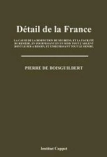

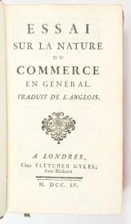

Le laissez-faire avait connu plusieurs défenseurs depuis Boisguilbert, en particulier Vincent de Gournay et le marquis d’Argenson.

Il restait à faire de cette masse d’idées une doctrine précise et complète. C’est le marquis de Mirabeau qui essaya le premier de le faire. Il prit pour modèle l’Essai de Cantillon et se lança dans l’écriture d’un traité complet sur les matières économiques qu’il intitula l’Ami des Hommes et qui eut un grand succès.

Nous sommes en 1756 ; l’histoire de la Physiocratie peut dès lors commencer. François Quesnay, chirurgien devenu médecin personnel de Mme de Pompadour, la favorite de Louis XV, invite Mirabeau à Versailles pour débattre de ses idées économiques. 

Au bout de la discussion, Mirabeau se range aux idées de Quesnay. Dès lors ils vont écrire : Quesnay produit un Tableau économique (1758) schématisant la circulation des richesses dans l’économie, et les deux publient ensemble la Théorie de l’impôt (1759).

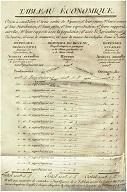

L’accueil fait à leurs efforts n’est pas excellent. À la cour, c’est l’indifférence qui prédomine. Le Roi reconnaît le goût de Quesnay pour les théories et l’appelle avec fierté "mon penseur". Mais outre cette marque d’affection, les travaux des deux économistes se soldent sur un échec. Avec la Théorie de l’impôt, ils parviennent même à se mettre à dos les administrateurs de l’impôt, durement critiqués dans le livre. Ceux-ci réclament et obtiennent que Mirabeau soit envoyé en prison. Madame de Pompadour l’en sortira mais il continuera quelques semaines un exil sur ses terres de Bignon. 

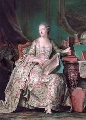

La première moitié de la décennie 1760 se passe donc dans un certain silence. À cause de sa position à Versailles, Quesnay est contraint de ne plus écrire, du moins de ne rien publier de son nom. Mirabeau, déjà condamné une fois, est prévenu, et il n’ignore pas que la favorite du Roi ne pourra pas éternellement lui sauver la mise.

Après ce silence passager, les deux économistes commencent à recruter des disciples : c’est là l’unique solution pour populariser leurs idées. Dès 1765, les succès sont frappants. Dupont de Nemours, Abeille, Mercier de la Rivière, Le Trosne, Baudeau, rejoignent rapidement les rangs. Ils forment une école : ils ont leur journal, les Éphémérides du Citoyen, et se réunissent même chaque mardi chez Mirabeau.

Entre 1765 et 1775, les Physiocrates, ainsi réunis, seront au sommet de leur gloire. Le monde littéraire n’a d’yeux que pour eux, ce qui permet la diffusion de leurs idées. On les appelle les économistes, ou la "secte" des économistes pour les tourner en dérision. Quoiqu’il en soit, leur célébrité est totale. Après un voyage à Metz, en 1774, M. de Vaublanc notera dans ses Mémoires son étonnement : autour de lui, les gens parlaient d’économie et raisonnaient comme les élèves de Quesnay. "C’était à la mode, dit-il. Tout le monde était économiste."

Dès 1770, cependant, leur audience a commencé à s’affaiblir. Le groupe connait ses premières défections et résiste de moins en moins bien aux critiques, qui sont nombreuses : Condillac, Mably, Voltaire, Galiami, Linhuet, Graslin et même Adam Smith en Ecosse. 

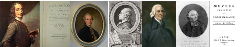

Leur journal ne paraît plus régulièrement. C’est la fin de la période active du mouvement.

La Physiocratie continuera cependant à avoir une influence jusque sous la Révolution. En France d’abord, par l’intermédiaire de Turgot, compagnon de route plus que disciple, mais aussi par son représentant, Dupont de Nemours, dont nous étudierons plus tard la vie et les œuvres. Mais aussi partout en Europe, où la doctrine physiocrate a été reçue avec enthousiasme. En Allemagne, par le margrave de Bade, et en Italie, par Léopold de Toscane, les théories physiocratiques ont même inspiré des réformes économiques en faveur de la propriété privée et de la liberté. 

## Les Physiocrates (2) Fondements de doctrine
<chapterId>4dbe5436-0578-57c2-b054-03ed00aa091a</chapterId>

Le terme Physiocratie, signifiant "gouvernement par la nature", a été inventé par Dupont de Nemours et donné comme titre à un recueil d’articles de Quesnay publié en 1768. 

C’est là une formule obscure. Aucun élève de Quesnay ne nous en a fourni la véritable signification. 
Cela étant, leur système de pensée était loin d’être obscur. Il était en fait articulé autour de quelques principes très clairs, que nous énoncerons ici.

### Premier principe : seule l’agriculture est productrice

Cette première idée est celle qui a retenu l’attention des historiens. Aujourd’hui, dans les manuels ou dans les cours d’économie, c’est à cela qu’on résume les Physiocrates. Ils ont cru naïvement, dit-on, que seule l’agriculture était productrice. Cela posé, on affirme que leur doctrine est sans intérêt et on passe sans inquiétude à l’analyse d’Adam Smith.

Cependant, on ne peut pas critiquer les Physiocrates d’ avoir accordé une importance démesurée à l’agriculture, puisqu’au milieu du XVIIIe siècle, l’agriculture emploie 90% de la population et forme la base de l’économie française.

L’idée des Physiocrates est d’ailleurs subtile. Selon eux, il existe une différence entre la production et le gain. L’industriel et le négociant peuvent gagner : mais il n’y a que l’agriculteur qui produit, car la production est une création de matière utile, plutôt qu’une addition d’utilité sur une matière préexistante.

On doit aussi chercher à comprendre pourquoi ils ont rejeté comme improductives l’industrie et l’artisanat. À l’époque, ces métiers sont enfermés dans le système des corporations, d’où l’innovation, l’investissement et le progrès sont bannis.

### Deuxième principe : despotisme légal plutôt que démocratie

Aujourd’hui, pour insulter quelqu’un, on dit qu’il n’est pas démocrate. Et si les historiens pardonnent à la rigueur aux physiocrates leur conception de la productivité unique des terres, ils ne pardonnent pas leur opposition à la démocratie, surtout qu’ils viennent à l’époque de l’apogée de cette idée. Au milieu du siècle des Lumières, et jusqu’à la veille de la Révolution, les Physiocrates représentent pour eux les ennemis du progrès.

Tocqueville a insisté sur cette idée :

> Les Physiocrates sont, il est vrai, très favorables au libre échange des denrées, au laisser-faire ou au laisser-passer dans le commerce et dans l’industrie ; mais, quant aux libertés politiques proprement dites, ils n’y songent point, et même, quand elles se présentent par hasard à leur imagination, ils les repoussent d’abord.

Libéraux en économie, les Physiocrates ne l’étaient donc pas en matière politique. Quesnay écrit en effet dans ses Maximes : "Que l’autorité souveraine soit unique et supérieure à tous les individus de la société et à toutes les entreprises injustes des intérêts particuliers." Et plus loin, dans la même maxime : "Le système des contre-force dans un gouvernement est une opinion funeste, qui ne laisse apercevoir que la discorde entre les grands et l’accablement des petits." 

Les Physiocrates, Tocqueville le remarque bien, ont repoussé la démocratie dès qu’ils en ont aperçu les formes. Ils sont septiques envers la démocratie : ce sera une constante dans l’économie politique française. Car la démocratie est loin d’être un système parfait : c’est potentiellement l’oppression des minorités par la majorité ; elle peut être un instrument d’usurpation, de tyrannie et de spoliation.

### Troisième principe : respect absolu de la propriété privée

Pour vivre, l’homme doit pouvoir travailler librement et conserver pour lui le produit de son travail. Telle est la conception des Physiocrates. La propriété, ainsi, est le fondement des sociétés. L’Etat a reçu pour seule mission de protéger les possessions légitimes des individus. En outre, du point de vue économique, affirment les physiocrates, l’inviolabilité de la propriété encourage le travail et l’effort et est une condition du progrès économique.

Quesnay l’exprime dans des termes très clairs : "Que la propriété des biens-fonds et des richesses mobilières soit assurée à ceux qui en sont les possesseurs légitimes, car la sûreté de la propriété est le fondement essentiel de l’ordre économique et de la sûreté de la société ; c’est la sûreté de la possession permanente qui provoque le travail et l’emploi des richesses à l’amélioration et à la culture des terres et aux entreprises du commerce et de l’industrie." 

### Quatrième principe : la liberté absolue du commerce

Dans ses maximes déjà citées, Quesnay affirme : "Que l’on maintienne l’entière liberté du commerce, car la police du commerce intérieur et extérieur la plus sûre, la plus exacte, la plus profitable à la nation et à l’État consiste dans la pleine liberté de la concurrence."

Les physiocrates reconnaissent que quand l’Etat est intervenu dans le commerce des marchandises, et notamment du blé, il a causé plus de mal que de bien. Il faut reconnaître, disent-ils, que l’autorité n’arrivera jamais à administrer le commerce aussi bien que le font les individus, car il faudrait qu’elle puisse suivre chaque besoin, réagir à chaque évolution de la demande ou de l’offre. Tout cela est bien au-dessus des forces d’un gouvernement même le plus sage qu’on puisse concevoir. Il faut donc laisser faire, laisser passer.

Bénéfique par nature, le commerce doit être entièrement et parfaitement libre. Le titre d’une des brochures de Le Trosne est tout à fait explicite : la liberté du commerce des grains, toujours utile et jamais nuisible.

### Cinquième principe : tous les hommes sont frères

Adversaires virulents de l’esclavagisme, les Physiocrates ont aussi été de grands pacifistes. "Notre politique étrangère s’appelle paix" disait simplement Mirabeau. Et en 1790, à l’Assemblé constituante, Dupont de Nemours suivra encore cette fibre pacifiste quand il proposera un projet de loi interdisant les guerres offensives. 

## Les Physiocrates (3) Réalisations et influence
<chapterId>5b911105-796a-5e2e-a501-c7a364fc758e</chapterId>

On l’a vu dans le premier des trois chapitre consacrées aux Physiocrates, les élèves de Quesnay ont été à la mode en France pendant une dizaine d’années. Cet engouement pour leurs idées s’est concrétisé dès leur époque et jusqu’à la fin du siècle. Nous verrons ici quelques-unes des réalisations qu’on peut mettre à leur crédit et l’influence qu’ils ont exercé sur leurs successeurs dans le domaine de la pensée économique.

Leur plus grande réalisation, à la suite du groupe de Gournay, fut de populariser les idées économiques. On connaît le mot de Voltaire, selon lequel, vers 1750, la nation rassasiée de poésie et de roman, se mit à raisonner sur les blés. Les Physiocrates ont participé à ce mouvement et publié littéralement des centaines d’articles, de brochures et de livres sur la liberté du commerce du blé. La forte impulsion donnée par les Physiocrates aux discussions se retrouve encore dans le nombre impressionnant d’ouvrages et de brochures économiques publiés en France de 1760 à 1775. Toujours comme preuve de la diffusion des idées économiques en France, on se souviendra du mot de M. de Vaublanc, cité lors d’un précédent cours, qui disait à Metz en 1774 que les gens ne parlaient plus qu’économie. "C’était à la mode, dit-il. Tout le monde était économiste."

La défense de leurs idées, dans des livres, des brochures et dans leur journal les Ephémérides du Citoyens, a eu très vite des répercussions dans la politique économique de la France. En 1763, un édit accorde la liberté du commerce des grains, que Quesnay et Mirabeau avaient réclamé vivement. À plusieurs reprises, les autorités assouplissent également le fonctionnement des corporations de métier pour garantir une plus grande liberté de travailler. 

À l’étranger, le succès se fait jour très tôt. En Allemagne, le margrave de Bade s’intéresse de près aux idées physiocratiques et entretient une correspondance suivie avec Mirabeau et Dupont de Nemours. 

Il charge l’économiste Johann August Schlettwein, physiocrate convaincu, de mettre en place une réforme fiscale et la libéralisation du commerce des grains. En avril 1770, une première expérimentation eut lieu dans le petit village de Dietlingen. Les villageois paraissent avoir accueilli avec enthousiasme les mesures, mais les fonctionnaires en place en étaient peu partisans, ce qui retarda l’opération générale. 

En Russie, Catherine II préparait une réforme de la législation et demanda à Diderot de lui envoyer un brillant esprit pour l’épauler. 

Marqué par la lecture de L’ordre naturel et essentiel des sociétés politiques, paru en 1767, il lui envoya son auteur, le physiocrate Mercier de la Rivière. 

Sorti de France dans la gloire, il fut froidement accueilli à Saint-Pétersbourg (outre le climat) et la tsarine fut déçu de lui. 

En Suède, avec Gustave III, et en Italie, avec Léopold de Toscane, les Physiocrates trouvèrent également des adeptes prêts à mettre en application leurs idées.

En France, les Physiocrates connurent un succès flamboyant avec la nomination de Turgot au poste de Contrôleur général des finances en 1774. 

Conscient de la perte de notoriété qu’ils étaient en train de connaître, Turgot ne se présenta jamais comme l’un des fidèles disciples des Physiocrates — ni d’ailleurs comme un encyclopédiste, quoiqu’il en était un, parce qu’ils étaient détestées par les membres du Clergé. Au pouvoir, Turgot composa six fameux édits qui forment un début d’application pratique du programme physiocratique : la liberté du commerce, la liberté du travail, la fin des monopoles. 

Lors de la Révolution française, les Physiocrates n’étaient plus très nombreux. Après la mort du marquis de Mirabeau, le 13 juillet 1789 — tout un symbole —, il ne restait plus qu’Abeille, d’ailleurs éloigné désormais de la Physiocratie, et Dupont de Nemours, qui y resta toujours fidèle. Nommé à l’Assemblé, Dupont de Nemours porta la voix de la physiocratie et demanda des réformes économiques en faveur de la propriété et de la liberté du commerce. 

Il lutta aussi, sans succès, contre les assignats. Malgré cet échec, la pensée physiocratique était encore très présente dans le débat d’idée et influença les premières réalisations de la Révolution. Tout ce que la Révolution fit en faveur des libertés, dira Joseph Rambaud, est dû aux Physiocrates. 

Enfin, les physiocrates ont exercé une grande influence dans l’histoire de la pensée économique. Adam Smith, qui les avait rencontré à Paris lors de son passage en France, s’inspira beaucoup de leurs écrits et songea à dédier son livre La Richesse des Nations à François Quesnay. 

Le chef de file des Physiocrates décéda deux ans avant la parution du livre et Smith retira cette dédicace en tête de son livre. Après avoir rectifié leur idée sur la productivité de la terre, les économistes classiques ont retiré beaucoup de la physiocratie, notamment les arguments pour la liberté du commerce.

## Dupont de Nemours (1)
<chapterId>6d585e0f-93b8-5b0a-a0a8-7f6e4a5bc68e</chapterId>

Aux Etats-Unis, on connait bien la société DuPont, aussi appelée "E.I. du Pont de Nemours et compagnie", firme multinationale du domaine de la chimie et de la biologie. 

Aujourd’hui, son chiffre d’affaires monte à plus de 35 000 milliards de dollars et elle emploie près de 65 000 personnes à travers le monde. Il s’avère que cette entreprise est liée de près au destin de Samuel-Pierre Dupont de Nemours, économiste français de l’école physiocratique. 

Né en 1739, Samuel-Pierre Dupont de Nemours se rapprocha des Physiocrates dès l’âge de vingt-quatre ans. À l’époque, il se cherchait un peu une vocation, et ayant lu une courte brochure intitulée la Richesse de l’Etat, il entreprit d’en faire la critique, car elle était remplie d’inepties du point de vue économique. Il publia donc des Réflexions sur la Richesse de l’Etat en 1763. Le public vanta cet écrit et des lecteurs lui dirent : "Vous êtes un disciple de Mirabeau !" Or Dupont de Nemours ne connaissait pas Mirabeau. 

Intrigué, il se mit à lire les écrits de Mirabeau, l’Ami des Hommes et la Théorie de l’impôt. Il rencontra Mirabeau puis Quesnay et intégra leur école. En 1765, on lui proposa de diriger le Journal de l’agriculture, du commerce et des finances, la publication périodique la plus en vue à l’époque dans le domaine des réflexions économiques. 

La raison en était double : Mirabeau et Quesnay devaient garder le silence, mais c’est aussi qu’on reconnaissait en Dupont de Nemours un futur grand.

Les témoignages des membres de l’école physiocrates concordent pour dire que Dupont de Nemours devint très vite le favori aux yeux de François Quesnay. Celui-ci disait : "Il faut soigner ce jeune homme, car il parlera quand nous serons morts." L’un des physiocrates, Abeille, fut d’ailleurs jaloux de toute l’attention portée à Dupont de Nemours et s’éloigna de l’école de Quesnay.

Dupont de Nemours garda toujours intacte la grande estime qu’il avait pour Quesnay.

Il dira un jour : "Je n’étais qu’un enfant quand Quesnay me tendit les bras ; c’est lui qui a fait de moi un homme." C’est Quesnay en tout cas qui fit de Dupont de Nemours un économiste majeur sur la scène littéraire de l’époque. Après le Journal de l’agriculture, on lui offrit la direction des Ephémérides du Citoyen, devenues l’organe officiel des Physiocrates. 

Il a fait de ce recueil périodique un haut lieu de la théorie économique, le soutenant même dans la période de déclin des Physiocrates, en rédigeant de lui-même la presque totalité des derniers volumes. C’est Dupont de Nemours, d’ailleurs, qui inventa le terme "physiocratie", à partir de deux mots grecs signifiant ensemble le gouvernement de la nature. Il utilisa ce terme pour intituler un recueil d’articles de Quesnay, qui paraîtra en 1768, et celui-ci s’imposa finalement dans l’histoire. On sait qu’entre eux, les physiocrates se nommaient les "économistes" et c’est encore comme cela qu’on les appelait sous la Révolution.

Lors du passage de Turgot au ministère, Dupont de Nemours devint son conseiller spécial et fut le seul physiocrate en rapport avec Turgot, celui-ci évitant de fréquenter les autres. 

Au moment de la Révolution, il se fait élire dans le baillage de Nemours et se retrouve à l’Assemblée, où siège un autre Monsieur Dupont. On l’appelle alors Dupont de Nemours, quoiqu’il ne fut pas noble, mais simplement pour le distinguer de l’autre Dupont. — Là encore, le nom est resté.

Sous la Révolution, il prend les armes en août 1792 pour défendre le Roi au Palais des Tuileries, face à la foule. 

Le Roi lui dit : "Monsieur Dupont, on vous trouve toujours là où on a besoin de vous !" Après avoir échappé miraculeusement à la Terreur — condamné, il attend d’être guillotiné mais en réchappe suite à la chute de Robespierre —il fut poussé à l’exil sous Napoléon et trouva le bonheur aux États-Unis, où l’un de ses fils fonda, avec l’assistance paternelle, la Dupont company.

Malgré cette vie bien remplie, pendant laquelle il publia des dizaines et des dizaines d’articles, de brochures et de livres, il est resté jusqu’à ce jour encore assez peu connu. Il paye peut-être le fait d’être resté un Physiocrate convaincu jusqu’à une époque où cette doctrine était entièrement passé de mode. Car en effet, comme l’écrira Schumpeter, Dupont de Nemours resta fidèle à la Physiocratie "tout au long d’une carrière au cours de laquelle les occasions de la renier ne manquèrent pas". C’était un homme de conviction.

# Les Lumières et L'Économie Politique
<partId>d1c885ad-7cb1-5f81-816c-be312719d9f8</partId>

## Voltaire et les philosophes
<chapterId>16bcf7bf-dad4-5113-8c64-2800f04ff07b</chapterId>

Le XVIIIe siècle français voit l’émergence de la science économique et de la première école de pensée économique, la Physiocratie. Adam Smith s’y forme à l’économie et les économistes français sont alors reconnus dans le monde comme des références. Cependant, ce siècle n’est pas resté dans l’histoire comme le siècle de l’économie, mais comme celui de la philosophie. Si le mouvement physiocratique se rattache, dans ses ambitions, à la philosophie des Lumières, l’attitude des philosophes, Diderot et Voltaire en tête, mérite d’être étudiée. Nous verrons que les philosophes des Lumières ont beaucoup aidé la diffusion de l’idée du laissez-faire en France.

La plus célèbre des réalisations de la philosophie des Lumières est sans aucun doute l’Encyclopédie de Diderot et d’Alembert. 

Naturellement, les articles économiques furent écrits par des économistes. Pour les premiers volumes, Diderot fait appel à Forbonnais, puis sollicite la collaboration des économistes libéraux : François Quesnay d’abord (articles Grains, Fermiers, Hommes (non publié)), Turgot ensuite (Foires et marchés). Ces écrits sont de la plus grande importance. Dans ses articles, Quesnay pose les bases de ce que sera la doctrine physiocratique. Avec le Tableau économique, ils resteront ses plus célèbres productions. Turgot, quant à lui, est encore jeune mais développe dans son article l’idée du laissez-faire, critiquant l’intervention de l’Etat dans l’organisation des marchés.

Dans de nombreux autres articles de l’Encyclopédie, des philosophes, Diderot en tête, défendent l’idéal de la liberté en tout : en religion, en politique, en économie. 

La liberté du travail, face au système des corporations, est également un thème récurrent à travers les différents articles comme Arts, Métier, Communauté, etc.

Le parcours de Diderot, du point de vue des théories économiques, est curieux. Dans l’Encyclopédie, il se montra toujours grand partisan de la liberté économique et c’est lui qui sollicitera la collaboration des économistes libéraux, comme le prouve encore une lettre où sont énoncés les articles que Turgot pourrait lui composer. Dans les premières années de la Physiocratie, il est un adepte et même un artisan du succès de l’école de Quesnay. En 1769 et 1770, il écrit dans les Ephémérides du Citoyen, au grand dam de ses amis philosophes antilibéraux, comme Melchior Grimm. Très vite, cependant, il prend ses distances avec le groupe. Séduit par l’intelligence survoltée de l’abbé Galiani, il l’aide à publier en français son livre sur le commerce des grains, et le fait en effet publier au moment où Galiani doit repartir en Italie. 

Ce livre représente l’attaque la plus virulente qui fut faite contre les idées des physiocrates et leur porta un coup terrible. Par la suite, Diderot défendra encore Galiani contre l’abbé Morellet, proche des physiocrates, dans l’Apologie de Galiani. Quelques années plus tard, au moment du ministère de Turgot, on voit Diderot applaudir à l’instauration de la liberté du travail par la suppression des corporations. Cette fois-ci, Diderot, le fils d’artisan, se trouve de l’avis des économistes libéraux et écrit une lettre très critique à Galiani, qui disait que la liberté du travail provoquerait en l’espace de vingt ou trente ans la ruine totale de l’industrie française — on sait, avec la Révolution industrielle, ce qu’il est plutôt advenu. Revenu dans le sillage des économistes libéraux, Diderot ne leur inspire plus confiance et reste isolé. Très caractéristique est sa lettre à Dupont de Nemours, en 1774, dans laquelle il écrit : "Vous aviez autrefois de l'amitié pour moi ; à présent vous n'en avez plus, parce que vous êtes si occupé que vous n'avez plus le temps d'aimer personne." 

Voltaire connut un parcours similaire, à cause de l’absence de solidité dans les idées qu’il pouvait avoir sur l’économie. Admirateur de Vincent de Gournay, correspondant des économistes (Dupont de Nemours et Turgot notamment), il admire le travail des physiocrates notamment leur défense de l’agriculture. Il les encense dans une Diatribe à l’auteur des Ephémérides. Cependant il critiquera leur théorie fiscale de l’impôt unique sur les terres dans un livre, L’homme aux quarante écus, qui fit également beaucoup de bruit. Enfin, comme Diderot, il célèbrera le ministère Turgot, le qualifiant d’âge d’or et couvrant d’éloges ses deux grands édits sur la liberté du travail et la liberté du commerce.

Finalement, le bilan de l’activité des philosophes est contrasté. À côté de leurs éloges et de leurs critiques des idées des économistes libéraux, ils auront participé à leur faire une place dans le débat intellectuel du siècle des Lumières. À ce titre, ils ont, en partie volontairement, en partie involontairement, servi au développement de l’idée de laissez-faire jusqu’à la Révolution.

## Turgot (1) Théoricien
<chapterId>a8cd8185-8351-556b-8011-3a0c313e8a9d</chapterId>

Dans un passage célèbre de son histoire de la pensée économique, l’économiste américain Murray Rothbard a célébré ce qu’il appelle "l’éclat" de Turgot, 

le présentant comme le plus grand économiste du XVIIIe siècle avec Cantillon. 

Si Turgot est parvenu à de tels sommets, il le doit à la combinaison de trois facteurs. Le premier, sa famille illustre, qui a donné de nombreux intendants. Le second, l’époque dorée dans laquelle il naît et grandit. Turgot avait 21 ans lorsque Montesquieu publia L’Esprit des Lois, et vingt-quatre lorsque parut le premier volume de l’Encyclopédie. 

Il est le contemporain des Physiocrates, de Voltaire, Diderot, d’Holbach, Adam Smith, Condorcet, etc. Le troisième facteur, enfin, c’est sa précocité intellectuelle. Elève à la Sorbonne, il écrit à l’âge de 22 ans une lettre sur le papier monnaie, prononce des discours remarquables et compose à 24 ans la liste de 52 ouvrages à faire.

Quoiqu’encore jeune, il collabore à l’Encyclopédie, écrivant les articles "Étymologie", "Existence", "Expansibilité", "Foire" et "Fondation". Le seul de nature économique, l’article Foire raconte l’origine des foires et marchés et critique l’intervention croissante de l’Etat, qui les dérange et les paralyse. 

Au cours de ces premières années, il a pour maître Vincent de Gournay, qui le prend sous son aile et se lie d’amitié avec lui. À la mort de Gournay en 1759, Turgot compose son éloge, dans lequel on trouve un superbe résumé de la doctrine du laissez-faire. Il écrit notamment : "Sous tous les points de vue par lesquels le commerce peut intéresser l’État, l’intérêt particulier abandonné à lui-même produira toujours plus sûrement le bien général que les opérations du gouvernement, toujours fautives et nécessairement dirigées par une théorie vague et incertaine."

En 1767, alors intendant, il compose un précis d’économie sous le titre de Réflexions sur la formation et la distribution des richesses. 

Division du travail, souveraineté du consommateur, propriété privée, rôle du capital, etc., tous les grands thèmes économiques sont évoqués. De nombreux historiens, le dernier en date étant une historienne, Anne-Claire Hoyng, ont souligné les ressemblances entre ce livre de Turgot et celui d’Adam Smith, la Richesse des Nations, publié neuf ans plus tard.

Turgot a défendu la liberté du commerce des grains dans des lettres à l’abbé Terray, ensuite communiquées au Roi, mais dont la moitié est désormais perdue. Il écrit :

> Monsieur, si quelque chose presse, ce n’est pas de mettre de nouvelles entraves au commerce le plus nécessaire de tous ; c’est d’ôter celles qu’on a malheureusement laissé subsister.
> S’il y a jamais eu un temps où la liberté la plus entière, la plus absolue, la plus débarrassée de toute espèce d’obstacles ait été nécessaire, j’ose dire que c’est celui-ci, et que jamais on n’a dû moins penser à donner un règlement sur la police des grains.

En 1769, Turgot composa l’article Valeurs et monnaie, pour le Dictionnaire de Commerce de l’abbé Morellet, qui finalement ne paraîtra jamais. Galiani avait déjà remarqué que "l’homme est la commune mesure de toute chose", préfigurant cette analyse subjective que conduira Turgot trente ans plus tard dans cet article, où celui-ci développe cette proposition et la prouve.

En 1770, bien avant Bentham, Turgot compose un mémoire réclamant la liberté du taux de l’intérêt et de l’usure. 

"C'est une erreur de croire que l'intérêt de l'argent dans le commerce doive être fixé par les lois des princes, dit-il : c'est un prix courant qui se règle de lui-même, comme celui de toutes les autres marchandises." Pour défendre cette position, il réfute l’opposition d’Aristote et celle des pères de l’Eglise.

On trouve dans un écrit oublié de 1773, une lettre à l’abbé Terray sur la marque des fers, un résumé remarquable de la doctrine du laissez-faire telle que l’entendait Turgot:

> Ce que doit faire la politique est de s’abandonner au cours de la nature et au cours du commerce, non moins nécessaire, non moins irrésistible que le cours de la nature, sans prétendre le diriger ; parce que, pour le diriger sans le déranger et sans se nuire à soi-même, il faudrait pouvoir suivre toutes les variations des besoins, des intérêts, de l’industrie des hommes ; il faudrait les connaître dans un détail qu’il est physiquement impossible de se procurer, et sur lequel le gouvernement le plus habile, le plus actif, le plus détailleur, risquera toujours de se tromper au moins de la moitié."

On trouve là un énoncé très clair de la doctrine du laissez-faire ainsi qu’une préfiguration des analyses de Friedrich Hayek sur la prétention du savoir, c’est-à-dire l’impossibilité qu’a un Etat de connaître les forces économiques afin de les piloter. 

## Turgot (2) Réformateur
<chapterId>9177429f-1679-51c4-bfd2-dd036d24a1cc</chapterId>

Comme nous l’avons rapidement rappelé dans le chapitre précédent, Turgot est le fils d’une grande famille qui s’est illustrée dans la haute fonction publique française. 

Son père était prévôt des marchands de Paris et son grand-père intendant. Après de brillantes études, le dernier né des Turgot entend atteindre au minimum ces fonctions. 
Il est d’abord un temps maître des requêtes, c’est-à-dire correspondant des intendants à Versailles. C’est un poste prestigieux, pour lequel il a du d’ailleurs obtenir une dispense d’âge, mais Turgot voit plus grand. La mort de son maitre Gournay l’incite d’ailleurs à viser plus haut et il sollicite du pouvoir un poste d’intendant.

En 1759 il demande d’abord l'intendance de Grenoble, mais elle lui est refusée. On lui propose à la place le poste de prévôt des marchands de Lyon, il décline. Il demande l'intendance de Bretagne, refusée également. Finalement en 1761 on lui propose le Limousin, et il accepte, un peu résigné. Il écrit à Voltaire : "j'ai le malheur d'être intendant" ;  peut-être en voulant dire : j'ai le malheur d'être intendant en Limousin. 

Dans le limousin les paysans sont pauvres et vivent dans des conditions précaires, notamment en ce qui concerne l'habitation et l'alimentation.  Le niveau d'instruction du peuple y est extrêmement faible. Les routes, peu nombreuses, sont dans un état désastreux.

Trop pauvre, le Limousin n’intéresse pas les ministres. Turgot y sera donc libre d’essayer des réformes. On peut lister trois grands projets de Turgot en Limousin :

- la répartition de la taille, c’est-à-dire l’impôt personnel (Turgot veut introduire autant d'objectivité que possible)
- la corvée, impôt en nature, travail forcé pour les paysans à la construction de routes. En visitant la région il a vite vu le défaut des routes. Il remplaça la corvée par une taxe en argent.
- le recrutement des milices, armées de paysans pour servir en temps de guerre. 

On procède alors par tirage au sort, d'où la peur et des violences à cause des fuyards. Turgot remplace ces levées obligatoires par des volontaires, payés.

Ces mesures eurent un succès certain, puisqu’en juillet 1774 Turgot fut nommé ministre. Etant donné son manque d’expérience, le Roi le nomme d’abord au ministère de la Marine. Cette nomination en a amusé plus d’un. Turgot lui-même reconnaissait : "Je ne connais rien à la Marine" Et Voltaire disait : "Je ne crois pas Turgot plus marin que moi."

Un mois plus tard, cependant, Turgot est nommé Contrôleur général des finances, c’est-à-dire ministre de l’économie et des finances.

On connait la lettre par laquelle il a détaillé ses impératifs à Louis XVI : "Point de banqueroute. Point d’augmentation d’impôts. Point d’emprunts." Cette sagesse, qu’on critique aujourd’hui comme de la "rigueur" sans intérêt, devait permettre de sauver la monarchie. 

Turgot prépara six édits pour réformer l’économie française. 

C’était la première fois, et déjà l’une des dernières, où un spécialiste de l’économie était doté de la liberté d’action pour réformer l’économie de son pays. Trois de ces édits sont majeurs : l’un supprime les corvées, l’autre supprime les corporations, le troisième enfin établit la liberté du commerce des grains.

À son entrée au ministère, Turgot savait qu’il devrait composer avec la résistance des privilégiés. "Je serai craint, haï même de la plus grande partie de la cour, de tout ce qui sollicite des grâces" avait-il dit au Roi. Les privilégiés se coalisèrent contre lui et causèrent son renvoi du Contrôle général des finances. Voltaire, tout acquis aux réformes de Turgot, écrira dans sa correspondance : 

> Ah ! quelle funeste nouvelle j’apprends ! Que deviendrons-nous ? Je suis atterré ! Nous ne nous consolerons jamais d’avoir vu naître et périr l’âge d’or ! Ce coup de foudre m’est tombé sur la cervelle et sur le cœur.

Depuis lors, on soutient, non toujours sans validité, que la France est un pays impossible à réformer. Il faut dire que cet échec de Turgot sonne comme un aveu : il avait été préparé par un demi-siècle de théorie économique libérale, les philosophes des Lumières lui étaient acquis, et le Roi lui-même, disposant de tout pouvoir, le soutenait. 

Finalement les parlements et les privilégiés l’emportèrent et le Roi n’eut qu’à se lamenter et à dire en privé : "Je le vois bien, il n’y a que M. Turgot et moi qui aimions le peuple."

## Condillac
<chapterId>0ba8dbb5-dcd5-5981-bf85-6c185e0bf192</chapterId>

Tout comme le mercantilisme, qui est sa manifestation pratique la plus évidente, le sophisme de Montaigne a mis du temps avant de disparaître. 

Ce sophisme, c’est l’idée que le commerce, l’échange, est un jeu à somme nulle. Tout ce qu’un agent gagne dans un échange, est forcément perdu par celui avec lequel il échange. Cela vaut, soutiennent ses partisans, aussi bien entre les individus qu’entre les nations.

L’abbé de Condillac a joué un rôle majeur pour détruire définitivement cette idée fausse. 

Définitivement est peut-être exagéré, parce que dans le débat public, ce sophisme resurgit fréquemment. C’est peut-être pour cela, d’ailleurs, que Condillac reste un économiste méconnu. À part les économistes autrichiens, peu ont compris l’importance de sa théorie de l’échange, personne ne s’intéresse plus à lui.

Pour la plupart des historiens de la pensée économique, l’année 1776 est marquée par la parution de la Richesse des Nations, qui fonde la science économique. Les quinze leçons que nous venons de faire, dans lesquelles nous avons étudié la science économique française d’avant Adam Smith, suffisent pour prouver l’erreur de cette conception. En cette année 1776, d’ailleurs, un autre livre mérite peut-être plus que le livre d’Adam Smith l’éloge des historiens : il est écrit par Condillac et est intitulé sobrement "Le Commerce et le Gouvernement considérés relativement l’un avec l’autre". 

Pour Condillac, si le sophisme de l’échange vu comme un jeu à somme nulle persiste, les physiocrates en sont en partie coupables, parce qu’ils soutiennent que l’échange est un rapport d’égalité. Selon Condillac, cela est faux : l’échange est un rapport inégal, où on donne toujours moins pour obtenir plus.

Entre les idées des Physiocrates et celles de Condillac, on ne peut rêver plus parfaite opposition. L’économiste physiocrate Le Trosne avait écrit : 

> L'échange est de sa nature un contrat d'égalité qui se fait de valeur pour valeur égale.

Condillac écrit plutôt :

> Chacun des contractants en donne toujours une moindre valeur pour une plus grande.

L’opposition, cependant, est en grande partie dans les mots. Car tous les deux reconnaissent que quand on échange un franc contre un livre, le livre vaut un franc, ou un franc est le prix du livre. 

La différence vient du fait que Condillac affirme que, puisqu’on échange un franc contre le livre, cela signifie que, pour nous, la valeur du livre est supérieure à celle de notre pièce d’un franc. Nous préférons le livre à la pièce d’un franc, et c’est pour cela que nous faisons l’échange.

La théorie de Condillac n’est pas fondamentalement contradictoire avec celle des physiocrates, mais ils ne parlent pas la même langue, pour ainsi dire. Le Trosne parle de prix quand Condillac parle de valeur, et inversement. 

Là où Condillac a raison, c’est que si les prix sont égaux entre les deux produits échangés, les valeurs ne le sont pas, sans quoi il n’y aurait pas d’échange.

Pour résumer la théorie de Condillac, on peut lister trois propositions :

Première proposition : on recherche les biens pour leur utilité. Cela semble évident, mais c’est une donnée centrale pour la science économique que les hommes échangent pour acquérir des utilités, ce que Jean-Baptiste Say, du reste, a parfaitement développé.

Deuxième proposition, la valeur préexiste et est le motif des échanges. Le jugement subjectif que chacun fait sur les biens et services implique que ces mêmes biens et services ont pour lui une valeur, qu’ils valent plus ou moins les uns et les autres selon l’utilité qu’ils paraissent pouvoir apporter. Bien entendu, chaque individu juge différemment d’un autre et la valeur est différente d’un individu à un autre.

Enfin dernière proposition, le prix est la conséquence du processus d’échange. Les produits ne s’échangent pas à la valeur que je leur attribue parce que les conditions de l’échange dépendent aussi de la valeur subjective que le vendeur attribue à ces produits. Le rapport entre l’acheteur et le vendeur, ou entre l’appréciation subjective de l’acheteur et l’appréciation subjective du vendeur, établit un prix.

Ces idées de Condillac sont fondamentales. Elles permettent de comprendre pourquoi tout échange est toujours mutuellement avantageux. 

Elles détruisent donc entièrement les critiques au libre-échange, puisque le protectionnisme n’apparaît plus que comme un mécanisme qui empêche les populations de se faire mutuellement du bien. Laissez-faire, c’est aussi la conclusion de l’œuvre de Condillac. Laissez-faire les hommes, car si la puissance publique protège la liberté et la propriété, les hommes s’enrichissent toujours les uns les autres en échangeant ensemble.

## Condorcet
<chapterId>99e4aba6-da7f-5041-b02f-337158381515</chapterId>

Condorcet est certainement le philosophe le plus économiste du siècle des Lumières. 

Pendant une grande partie de sa carrière, il s’est occupé de tout autre chose que d’économie, et il avait raison, car son talent a fait faire de grands progrès dans les sciences auxquelles il s’est le plus consacré. Mais vers 1770, il s’est senti appelé par les questions économiques, peut-être parce que les philosophes, Voltaire et Diderot notamment, ne daignaient pas y consacrer leurs loisirs, mais aussi parce qu’il s’était lié d’amitié avec Turgot. 

Condorcet se rapprocha sensiblement des idées de laissez-faire et de liberté dans des domaines d’abord étrangers à l’économie politique. Dans sa Lettre d’un théologien, il a raillé philosophiquement la religion catholique et exprimé ses souhaits de voir établir une véritable liberté de croire et de ne pas croire. Dans sa croisade pour la tolérance et contre le fanatisme religieux, Condorcet s’est battu pour la réhabilitation du Chevalier de la Barre ainsi que la révision du procès de D’Etallonde, à qui on avait prononcé la peine de mort parce qu’il avait brisé un crucifix.  

Il était donc préparé à soutenir la liberté quand son ami, Turgot, accéda au Contrôle général des finances. 

Dès lors la carrière de Condorcet prend un tournant et il s’insère dans le débat économique, soutenant inlassablement les réformes libérales du nouveau ministre. Favorable à la concurrence, à la liberté du commerce, Condorcet réclamait aussi la suppression des corvées, des corporations, et la juste répartition des impôts. Il porta ces convictions à la tribune de l’opinion publique puisque l’occasion se présentait. Il le fit visiblement avec enthousiasme car il écrivit beaucoup, et on trouve cette phrase dans un de ces écrits : "Permettez-moi de vous parler encore de la liberté du commerce, j’aime à m’occuper de cet objet."

Ses interventions, toutes marquées par son adhésion à l’idée du laissez-faire, sont nombreuses entre 1774 et 1776, temps qu’a duré le ministère de Turgot. On recense les Lettres d’un laboureur de Picardie à M. Necker, auteur prohibitif, pour défendre la liberté du commerce. Monopoles et monopoleurs, pour défendre la libre concurrence. Réflexions sur les corvées, pour en réclamer l’abolition, suivi de Sur l’abolition des corvées. Enfin des Réflexions sur le commerce des blés, qui entonne une nouvelle foi l’hymne de la liberté du commerce et critique point par point le livre de Necker publié sur le même sujet. 

Dans les Lettres sur le commerce des grains, Condorcet défend plusieurs idées. 

D’abord, il est faux que le haut prix des céréales qu’on observait alors était le résultat de la liberté du commerce. Il s’agissait de la conséquence de mauvaises récoltes, et Condorcet le prouve bien. Il explique ensuite pourquoi le laissez-faire est une politique convenable et même la seule convenable, malgré les préjugés populaires. Car en effet, "on est si accoutumé à voir le gouvernement se mêler du commerce des blés, qu’il semble que de ne rien faire ce soit une action extraordinaire et nouvelle." Et plus loin : "Presque tous les hommes, et surtout ceux qui remplissent des places [fonctions publiques], croient que rien ne va de soi-même et que tout est perdu si le Gouvernement ne se mêle de tout." Dès lors Condorcet reprend les arguments des Physiocrates et de Turgot et établit la supériorité du libre-échange sur tout type d’interventionnisme.

Cette action de promotion du programme économique libéral de Turgot était courageuse, puisque Condorcet savait qu’il serait très vite inquiété par la censure. Cela arriva bel et bien, et sa brochure sur l’abolition des corvées fut détruite et supprimée en 1776.

Sensible à l’affection que Condorcet manifestait à son égard en défendant ses idées, Turgot le nomma inspecteur des monnaies. Condorcet demanda à démissionner dès que son ami fut sorti du ministère. 

Bien qu’il employât toute son énergie à défendre Turgot, Condorcet n’avait aucune illusion sur l’issue de son passage au ministère. Turgot disait à la fin de sa vie qu’il vivait avec le regret, écrit-il un jour dans une lettre, "de n’avoir pu faire à ma nation et à l’humanité un bien que je croyais très facile." Condorcet, plus réaliste, pointait du doigt les adversaires que Turgot ne manquerait pas d’avoir : les favoris du roi, les parlements, le clergé, la noblesse, les corporations, etc. Ces gens là attendaient d’être flattés, non d’être réformés. Condorcet disait à Turgot : "Vous n’êtes point du tout charlatan et c’est un défaut, vu ce qu’on est à Paris." Et il vit parfaitement juste puisqu’en 1776, deux ans à peine après son arrivée, Turgot quittait déjà le Contrôle général des finances.

## Dupont de Nemours (2) Le bon-sens libéral sous la Révolution
<chapterId>95e9a90d-e37a-58ff-b1ac-928b42e76ecf</chapterId>

Dupont de Nemours était le plus jeune des disciples de François Quesnay, qui avait dit de lui : "Il faut soigner ce jeune homme, car il parlera quand nous serons morts." Quand sonna la Révolution française, tous les autres grands représentants de la Physiocratie étaient effectivement déjà morts, y compris le marquis de Mirabeau, qui s’arrangea pour s’éteindre le 13 juillet 1789. 

Dupont de Nemours rédigea le cahier de doléance du baillage de Nemours. 

On trouve dans ce curieux document toutes les plaintes des économistes libéraux contre les restrictions au commerce, les monopoles et les atteintes à la propriété. Dupont de Nemours fut aussi élu à l’Assemblée nationale.

Sous la Révolution, il représenta le bon-sens libéral face à la pression toujours plus forte du populisme et de la démagogie interventionniste qui l’emporta finalement.

Dès novembre 1789, quand il fut question de donner un monopole à la Caisse d’Escompte, de manière à la transformer potentiellement en banque publique, en banque de France, Dupont de Nemours rappela à la tribune les vertus de la concurrence. 

Il vaudrait mieux, dit-il, abandonner l’entreprise des banques aux lois de la liberté du commerce.  Et il ajoute : 

> Je n’ai pas compris ce que le ministre a voulu dire en vous parlant d’un privilège pour la Caisse d’Escompte. Si ce privilège renferme quelque chose d’exclusif, vous devez le refuser : vous êtes venus ici pour détruire les privilèges exclusifs, et non pour en créer de nouveaux."

Cependant l’Assemblée passa outre ses critiques et fit un pas de plus dans la direction de l’établissement d’une banque centrale et dans l’instauration du monopole bancaire.

En 1790, à l’Assemblé constituante, Dupont de Nemours suivra la fibre pacifiste de ses anciens amis Physiocrates et proposera un projet de loi interdisant les guerres offensives. On lisait dans le premier article :  "La Nation Française ne se permettra aucune guerre offensive pour s’emparer du territoire d’autrui, ni pour porter atteinte aux droits ou à la liberté d’aucune Nation." 
Le projet de loi fut écarté. 

En cette même année 1790, les débats commencèrent autour de l’émission d’un nouveau papier monnaie destiné à payer les dépenses de l’Etat.

Dupont de Nemours s’y opposa fermement et publia une brochure intitulée Effets des assignats sur le prix du pain. Son titre est juste puisque l’auteur explique que la création des assignats conduira irrémédiablement à l’inflation, c’est-à-dire à la hausse du prix des denrées, dont le pain.

Dupont de Nemours avait signé sa brochure : par un ami du peuple. Ce court écrit fit assez sensation puisque à l’Assemblée, il fut question de savoir qui en était l’auteur. Dupont de Nemours se leva alors et avoua que c’était lui et qu’il ne rougissait pas d’avoir choisi le nom d’ami du peuple puisqu’en effet c’était rendre service au peuple que de lutter contre les assignats.

Encore une fois, on passa outre son avis, et les assignats furent créés. 

On sait quelle catastrophe, quelle ruine ils causèrent, et quelle fut aussi la misère du peuple, certains ayant tout perdu, quand il s’avéra que les assignats étaient sans valeur et qu’on devait se résigner à les bruler.

Quelques années plus tard, l’Assemblée s’occupa de réfléchir à la création d’une véritable banque de France, qui serait dotée d’un monopole sur la production de monnaie.

Dupont de Nemours, toujours aussi fermement opposé à l’idée d’une banque publique, car il s’agit de rien d’autre qu’un monopole, rappela en vieux sage l’expérience des Assignats. Il prit la parole devant l’Assemblée et dit :

> Ne vous préparez pas des regrets analogues à ceux qui tourmentèrent mes collègues de l'Assemblée constituante. On rejeta dans le temps la proposition que j'avais faite de n'employer les assignats qu'au paiement des biens nationaux et de n'en pas faire une monnaie courante. Aujourd'hui l’on dit : Ah! si nous avions écouté Dupont de Nemours !

Il ne fut pas davantage écouté. 

## Conclusion : passage de témoin
<chapterId>ada8082f-db96-5e52-954f-719b47998153</chapterId>

La pensée économique française du XVIIIe siècle est restée moins célèbre que celle du XIXe siècle. Du point de vue de la défense de la liberté, c’est pourtant au XVIIIe siècle que tout commence. C’est au XVIIIe siècle aussi que le principe du laissez-faire, avec tout ce qu’il a de révolutionnaire, est présenté par de nombreux auteurs, de Boisguilbert à Dupont de Nemours. 

Certainement, les Jean-Baptiste Say, les Frédéric Bastiat, les Gustave de Molinari, les Yves Guyot, ont marqué l’histoire de la pensée économique française. Mais à les étudier seuls, on ne peut les comprendre. Car tous ces représentants de l’école française d’économie politique sont issus des travaux des économistes du XVIIIe siècle. Leurs idées sont déjà, en germes, chez ces prédécesseurs du siècle des Lumières.

Boisguilbert affirme que les bonnes âmes, qui prétendent tout arranger en faisant intervenir le gouvernement, bouleversent nécessairement de fond en comble l’économie et qu’il convient donc plutôt de laisser faire l’ordre naturel des choses.

Cantillon affirme que la monnaie ne doit pas être manipulée au gré d’objectifs politiques. Laisser l’Etat gérer la monnaie à sa guise, c’est préparer l’avènement d’immenses désordres financiers et économiques.

Vincent de Gournay affirme que la sur-réglementation du travail décourage les efforts des ouvriers et des artisans et les incite à la paresse et à l’inactivité. C’est grâce à la libre concurrence que l’économie peut se développer et qu’une nation peut prospérer.

Le marquis d’Argenson affirme qu’aucun gouvernement n’est capable de tout prévoir, de tout mesurer, et que par conséquent, il faut s’en remettre à l’intérêt personnel de chaque individu. 

Quesnay et les physiocrates affirment que la propriété privée est le fondement des sociétés humaines. Sans la propriété privée, l’homme perd la motivation à faire des efforts, à travailler, car il ne peut jouir du produit de son travail ni accumuler.

Condillac affirme que l’échange est toujours mutuellement avantageux et qu’il faut donc toujours, sans exception, le laisser libre. La seule mission de l’Etat doit être de protéger la liberté et la propriété.

Toutes ces idées seront reprises par les économistes du XIXe siècle. Certains, comme Jean-Baptiste Say, donneront à ces conceptions une expression scientifique, dans un Traité d’économie politique rigoureux. D’autres, à l’inverse, chercheront à populariser ces maximes fondamentales en investissant le domaine du conte, du roman et des petites histoires amusantes, comme le fera avec talent Frédéric Bastiat.

## Biographie 
<chapterId>17cf2865-e53c-5f3b-a5c2-a43560efaf01</chapterId>

BIBLIOGRAPHIE SELECTIVE
Vous avez ici à disposition une sélection de plus d'une trentraine d'écrits: 

1.	Pierre Clément, Histoire de Colbert et de son administration, Paris, 1874
Eli Heckscher, Mercantilism, 2 vols. London: Allen and Unwin. 1935
2. Vauban, Projet d’une dîme royale, 1707 ; réédition Institut Coppet, 2014; Anne Blanchard, Vauban, Fayard, 1996
3.	Boisguilbert, Détail de la France, 1695 ; réédition Institut Coppet, 2014
4. Félix Cadet, Pierre de Boisguilbert : précurseur des économistes, Institut Coppet, 2014
5. Pierre de Boisguilbert ou la naissance de l économie politique, Paris, INED, 1966
6. Richard Cantillon, Essai sur la nature du commerce en général, 1755 ; réédition Institut Coppet, 2015
7. Antoin Murphy, Richard Cantillon, banker and economist, Oxford, 1986
8. Gustave de Molinari, L’abbé de Saint-Pierre, Paris, 1859
9. Abbé de Saint-Pierre, Abrégé du projet de paix perpétuelle, Rotterdam, 1729
10. Abbé de Saint-Pierre, "Projet pour perfectionner le commerce de la France", in Les rêves d’un homme de bien, Paris, 1775, p.199
11. André Alem, Le marquis d'Argenson et l'économie politique au début du XVIIIe siècle, Institut Coppet, 2015
12. Journal et mémoires du marquis d'Argenson, édition Rathery, 9 vols., Paris, 1859-1867
13. Benoît Malbranque, Vincent de Gournay : l’économie politique du laissez-faire, Institut Coppet, 2016
14. Vincent de Gournay, Remarques sur la traduction de Josiah Child, L’Harmattan, 2008
15. Christine Théré & Loïc Charles (éd.), Le cercle de Gournay, INED, 2005
16. Antoin Murphy, "Le développement des idées économiques en France (1750-1756)", Revue d’histoire moderne et contemporaine, tome XXXIII, octobre-décembre 1986
17. Henri Ripert, Le marquis de Mirabeau : ses théories politiques et économiques, Paris, 1901
18. Lucien Brocard, Les doctrines économiques et sociales du marquis de Mirabeau dans l’Ami des Hommes, Paris, 1902
19. Humbert de Montlaur, Mirabeau, l’Ami des Hommes, Perrin, 1992
20. Yves Guyot, François Quesnay et la Physiocratie, Institut Coppet, 2014
21. François Quesnay, Œuvres économiques complètes et autres textes, 2 vols., INED, 2005
22. Georges Weulersse, Le mouvement physiocratique en France (de 1756 à 1770), 2 vols., Paris, 1910
23. Georges Weulersse, La Physiocratie à la fin du règne de Louis XV (1770-1774), P.U.F., 1959
24. Georges Weulersse, La Physiocratie sous les ministères de Turgot et de Necker (1774-1781), P.U.F., 1950
25. Georges Weulersse, La physiocratie à l'aube de la révolution (1781-1792), EHESS, 1985
26. P. Jolly, Du Pont de Nemours, soldat de la liberté, Paris, P.U.F., 1956
27. Ecrits économiques de Voltaire, Institut Coppet, 2013
28. Gustave Schelle (éd.), Œuvres de Turgot et documents le concernant, Paris, 1913-1924
29. Benoît Malbranque, Le libéralisme à l’essai : Turgot intendant du Limousin (1761-1774), Institut Coppet, 2015 
30. Pierre Foncin, Essai sur le ministère de Turgot, Paris, 1877
31. Auguste Lebeau, Condillac économiste, Paris, 1903
32. Condillac, Le commerce et le gouvernement considérés relativement l’un avec l’autre, 1776
33. Condorcet, Mélanges d’économie politique, dans Eugène Daire (éd.), Mélanges d’économie politique, Paris, 1847
34. P. Jolly, Du Pont de Nemours, soldat de la liberté, Paris, P.U.F., 1956

# Conclusion
<partId>385bffab-aea1-5bcd-9569-62b3f30665b7</partId>

## Avis & Notes
<chapterId>a1e689d9-abd0-5dcb-ba56-a8d355d0a84f</chapterId>

<isCourseReview>true</isCourseReview>

## Conclusion
<chapterId>3b366ff6-03c8-5f6a-b4c0-ba8186e65d7e</chapterId>

<isCourseConclusion>true</isCourseConclusion>

