Fondée en 2012, Bitfinex est l'une des premières plateformes d'échange de bitcoin et d'altcoins. Initialement centrée sur des échanges P2P de bitcoins, la plateforme a rapidement élargi ses services pour inclure le trading sur marge, le financement P2P, le trading de produits dérivés, et un marché OTC ("*over-the-counter*") pour les transactions de gros volumes.

Aujourd'hui, Bitfinex est une plateforme complète, permettant aussi bien des achats simples de bitcoins que l'utilisation de fonctionnalités de trading avancées (trading traditionnel, dérivés, OTC, lending, etc.) avec des outils de gestion de risque . Elle est accessible en version web, et pour des transactions simples, une application mobile facile à prendre en main est également disponible.

Dans ce tutoriel, nous allons découvrir le processus de création d’un compte entreprise sur Bitfinex, l'achat et la vente de bitcoins, la gestion des transactions pour la comptabilité, ainsi que le dépôt et le retrait d'euros et de bitcoins. L'objectif est de vous fournir les connaissances de base, que vous envisagiez d'intégrer le bitcoin dans votre trésorerie ou d'accepter le bitcoin comme moyen de paiement.

Si ce sujet de l'intégration du bitcoin à votre entreprise vous intéresse, je vous conseille également de découvrir notre formation théorique complète sur ce sujet :

https://planb.network/courses/biz101

## 1 - Création d’un compte sur Bitfinex

Rendez-vous sur [le site officiel de Bitfinex](https://www.bitfinex.com/). Sur la page d'accueil, trouvez et cliquez sur l'option "*Sign Up*" pour commencer la création de votre compte. Au début, vous allez créer un compte standard comme pour les particuliers, l'option "*Corporate*" sera sélectionnée plus tard durant le processus de vérification.

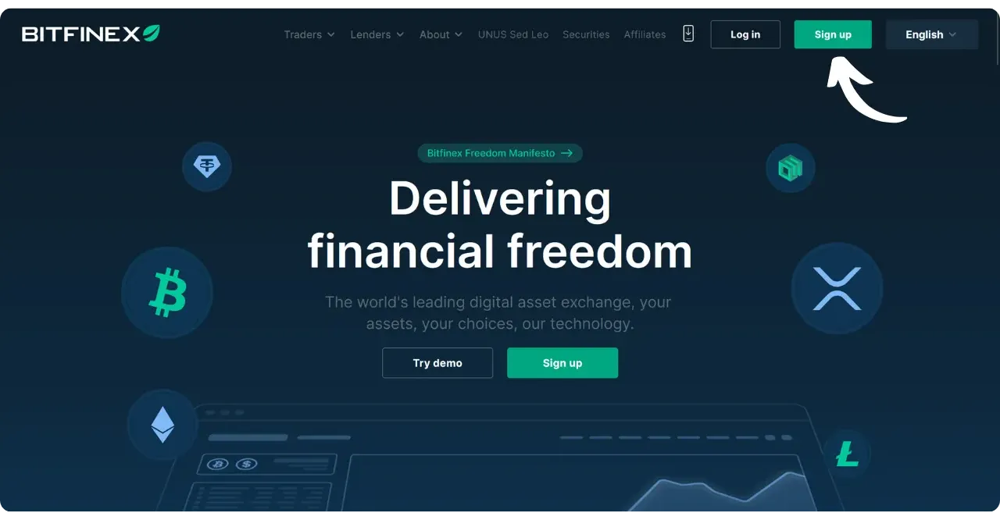

Complétez les informations requises : indiquez votre adresse email professionnelle et le pays de résidence de votre entreprise. Choisissez un nom d'utilisateur et un mot de passe sécurisé, puis cliquez sur "*Sign up*" pour confirmer l'inscription.

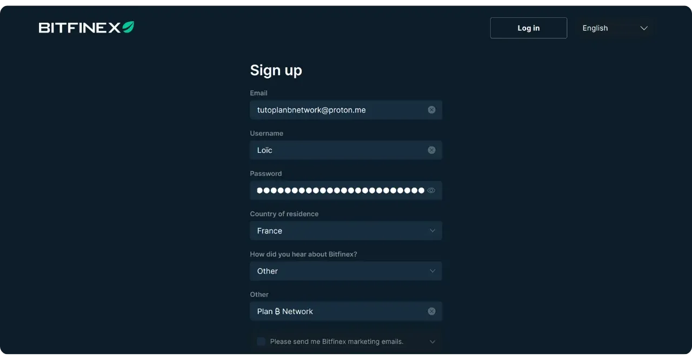

Pour des conseils sur l'utilisation et la sauvegarde de mots de passe forts et uniques, consultez également ce tutoriel :

https://planb.network/tutorials/others/general/bitwarden-0532f569-fb00-4fad-acba-2fcb1bf05de9

Nous allons à présent configurer le 2FA pour sécuriser le compte. Utilisez une application d'authentification sur votre smartphone, telle que Google Authenticator ou Authy par exemple. Vous trouverez un tutoriel sur cet outil ici :

https://planb.network/tutorials/others/general/authy-a76ab26b-71b0-473c-aa7c-c49153705eb7

Scannez le QR code avec votre application et entrez les 6 chiffres fournis.

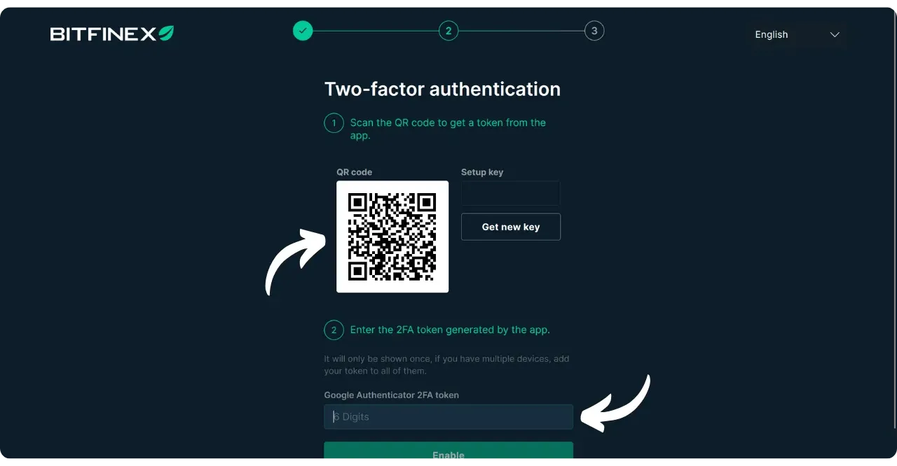

L'inscription a bien été réalisée.

Vérifiez votre boîte mail et cliquez sur le lien envoyé par Bitfinex pour confirmer votre inscription.

Votre compte est désormais créé. Cliquez sur "*Log in*" pour accéder à la plateforme.

## 2 - Vérification du compte entreprise

Bitfinex applique un processus de vérification (KYC) conforme aux réglementations en vigueur. En mode "*Basic*", il est impossible de réaliser des dépôts, ce qui rend indispensable l'obtention d'au moins le niveau de vérification "*Intermediate*", voire "*Full*" si nécessaire.

Une fois votre compte créé, une fenêtre pop-up devrait vous suggérer de vérifier votre compte. Cliquez sur "*Verify*".

Si cette fenêtre n'apparaît pas, accédez à votre profil situé en haut à droite de l'interface, puis cliquez sur "*Verification*".

Sous "*Account Type*", choisissez "*Corporate*". Dans mon cas, je procède à la mise à niveau vers "*Intermediate*", donc je sélectionne "*Upgrade to Intermediate*".

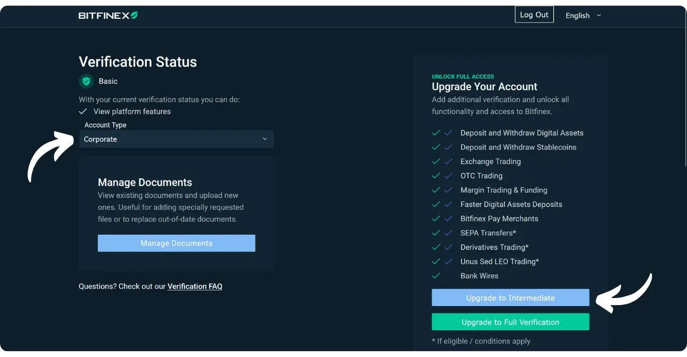

Complétez les étapes en fournissant :
- Les informations de l’entreprise (dénomination sociale, coordonnées, secteur d’activité...) ;
- Les documents légaux (statuts, extrait Kbis, liste des administrateurs et des actionnaires) ;
- Les informations de KYC pour chaque bénéficiaire effectif ou administrateur (pièces d’identité, justificatifs de domicile...).

Une fois votre dossier complété et envoyé, il peut s'écouler plusieurs jours avant que la plateforme valide le tout pour une vérification d'entreprise. Durant cette période, les dépôts seront temporairement bloqués.

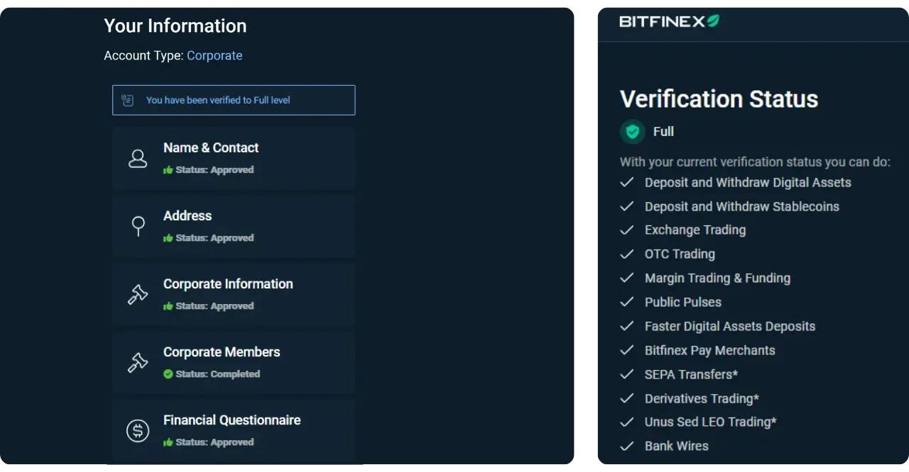

## 3 - Présentation rapide de l’interface Bitfinex

Une fois connecté, vous verrez une barre de navigation en haut de l'interface avec : "*Trading*", "*Derivatives*", "*Funding*", "*OTC*", "*P2P*", "*Wallet*", etc. Bitfinex offre un large panel de fonctionnalités, dont :
- **Trading** : Marché "*classique*" où vous pouvez passer des ordres pour acheter et vendre des cryptomonnaies (dont le bitcoin) ;
- **OTC** : Service Over-The-Counter pour échanger de gros volumes directement avec un autre acteur, en dehors des carnets d’ordre publics ;
- **Funding** : Espace dédié au lending et au margin funding ;
- **Derivatives** : Section pour les produits dérivés (contrats à terme, etc.), plutôt destinés aux traders expérimentés ;
- **P2P** : Permet d’acheter ou de vendre des cryptos auprès d’autres utilisateurs en pair-à-pair.

Pour un usage standard (achat/vente de bitcoins, dépôts/retraits et gestion de trésorerie), vous utiliserez principalement l’onglet "*Trading*" ainsi que les sections "*Wallet*", "*Deposit*" et "*Withdraw*".

L’un des avantages de la formule Corporate est aussi la possibilité de créer des sous-comptes. Vous pouvez ainsi donner à plusieurs utilisateurs l’accès à ces sous-comptes, chacun avec des droits spécifiques (lecture seule, trading, dépôt uniquement, etc.).

## 4 - Dépôt et retrait d’euros (fiat)

Pour déposer des euros sur votre compte Bitfinex Corporate, accédez au sous-menu "*Deposit*" situé dans le menu "*Wallet*" en haut de l'interface.

Sélectionnez "*Bank transfer*" ou "*Credit/Debit Card*" pour effectuer un dépôt en euros (ou toute autre monnaie fiat).

Choisissez la monnaie fiat à envoyer, par exemple l'euro. Si vous utilisez seulement les fonctionnalités de base du "*Trading*", cliquez sur "*Exchange*". Indiquez également le montant que vous souhaitez déposer et le pays de la banque de votre compte professionnel.

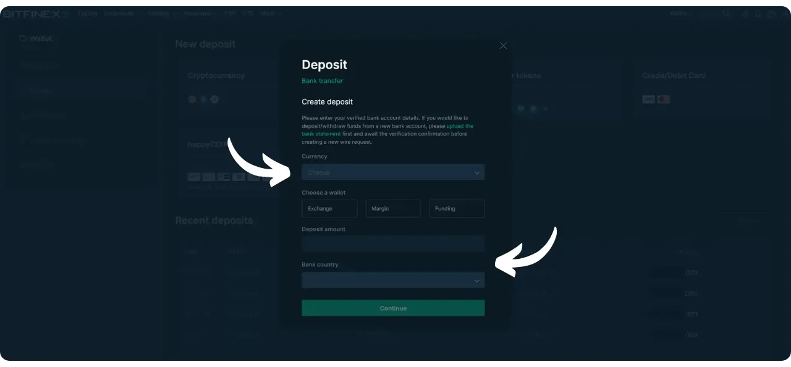

Effectuez un virement depuis votre compte bancaire professionnel vers le compte bancaire indiqué par Bitfinex.

Pour retirer des fonds, la procédure est similaire : rendez-vous dans le sous-menu "*Withdraw*".

Cliquez sur "*Bank transfer*".

Sélectionnez la monnaie fiat que vous souhaitez retirer, le compte à débiter chez Bitfinex ("*Exchange*" si vous n'utilisez que les fonctionnalités de base) et le montant à retirer.

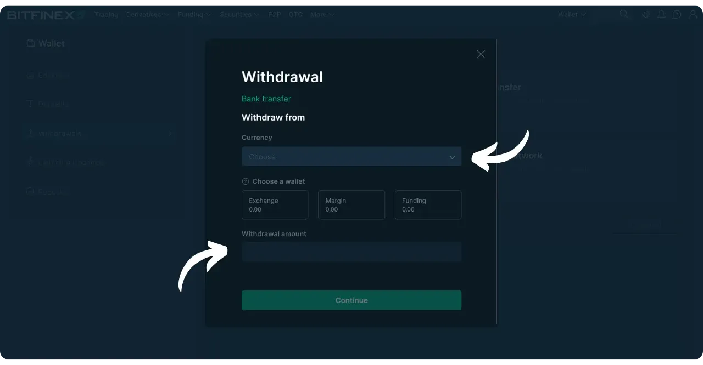

Bitfinex peut exiger une validation de votre compte bancaire avant d'accepter le virement, pour des raisons de conformité.

Une fois la procédure initiée, Bitfinex transférera les fonds vers votre compte bancaire.

## 5 - Dépôt et retrait de bitcoins

Pour déposer du bitcoin sur Bitfinex, accédez au sous-menu "*Deposit*".

Cliquez sur "*Cryptocurrency*".

Choisissez "*BTC*". Une adresse de réception apparaîtra. Copiez cette adresse et utilisez-la depuis votre portefeuille en self-custody ou une autre plateforme pour envoyer vos BTC.

Pour retirer du bitcoin, rendez-vous dans le sous-menu "*Withdraw*".

Cliquez sur "*Cryptocurrency*".

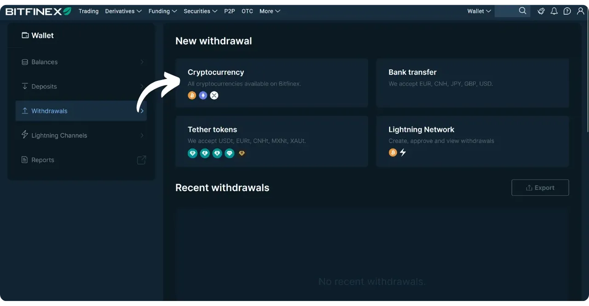

Sélectionnez "*BTC*". Choisissez le compte Bitfinex à débiter pour votre retrait ("*Exchange*" pour les fonctionnalités de base). Entrez le montant et l'adresse de destination des bitcoins. Assurez-vous de vérifier l'adresse de retrait pour prévenir toute erreur.

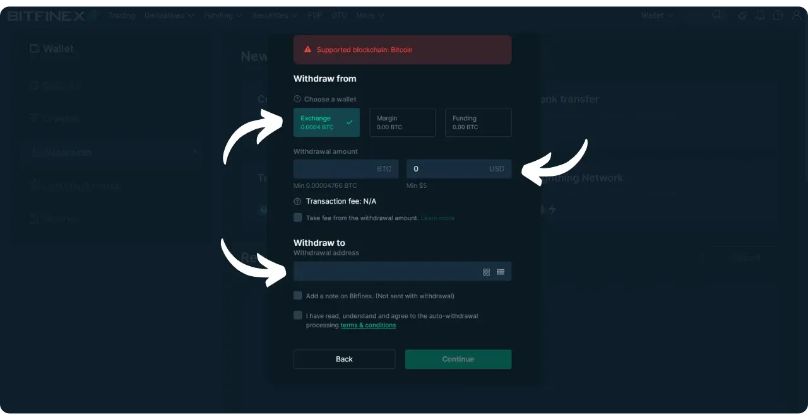

Suite à votre confirmation, vos bitcoins seront transférés. Notez que les frais et les délais peuvent varier selon la congestion des mempools.

Bitfinex offre aussi des options de dépôt et de retrait via le Lightning Network, ce qui permet des transactions plus rapides et moins onéreuses.

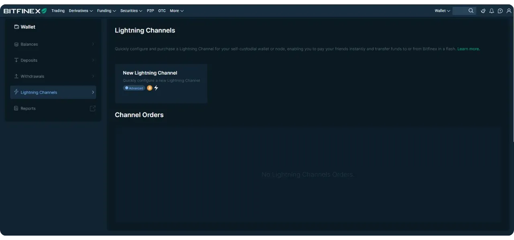

Si le Lightning Network vous intéresse, nous avons également une formation complète pour comprendre son fonctionnement :

https://planb.network/courses/lnp201

## 6 - Achat et vente de bitcoins sur Bitfinex

Bitfinex propose différents modes de trading. Pour une utilisation simple, optez pour le marché spot classique, également appelé "*Trading*" ou "*Exchange*". Ici, vous pouvez passer des ordres d'achat ou de vente au prix du marché ou définir un prix limite.

Dans le menu supérieur, cliquez sur "*Trading*".

Sélectionnez la paire "*BTC/EUR*" si vous désirez acheter ou vendre des BTC en échange d'euros, par exemple.

L'interface affiche au centre un graphique du cours, l'order book en bas, et le module de saisie d'ordre à gauche. Dans la section de saisie, vous avez le choix entre un ordre "*Market*" (exécuté immédiatement au meilleur prix disponible) ou "*Limit*" (vous définissez le prix). Indiquez la quantité de BTC à acheter ou à vendre, ou sélectionnez un pourcentage de votre solde. Cliquez ensuite sur "*Buy*" pour acheter ou sur "*Sell*" pour vendre.

Vous pouvez consulter l’historique de vos ordres exécutés dans la partie inférieure de l’interface.

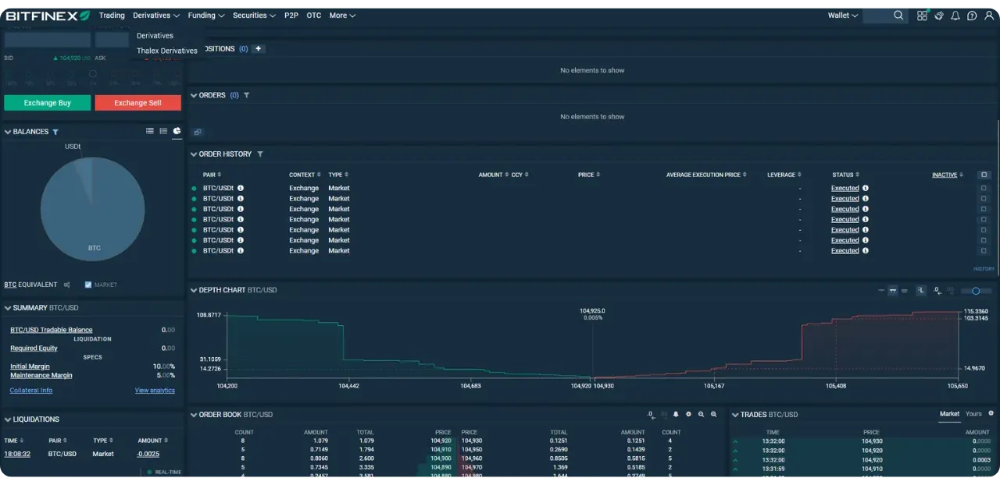

## 7 - Export des historiques de transactions et comptabilité

Pour la gestion comptable, vous aurez besoin d’exporter les détails de vos opérations (achats, ventes, dépôts, retraits). Bitfinex propose un outil de reporting assez complet. Cliquez sur l'icône de votre profil en haut à droite de l'interface, puis sur le menu "*Reports*".

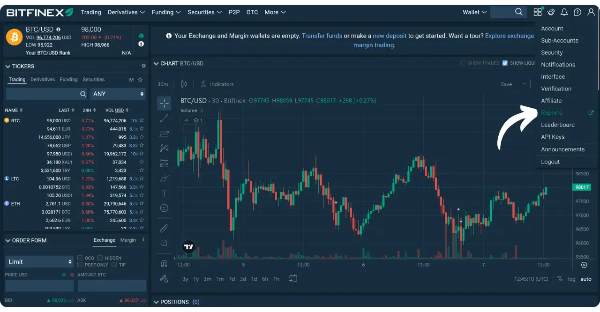

Sur la gauche, vous pouvez sélectionner le type de données à exporter. Par exemple, en sélectionnant "*Trades*", vous aurez accès à tous vos échanges.

Définissez la période souhaitée dans la case "*Date*" et, si nécessaire, restreignez votre recherche à une ou plusieurs paires spécifiques via le champ "*Symbol*".

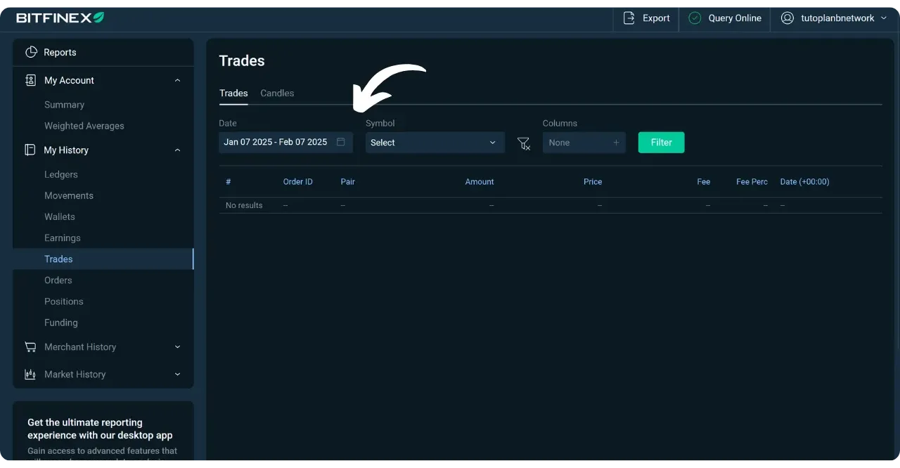

Pour exporter ces données, cliquez sur le bouton "*Export*".

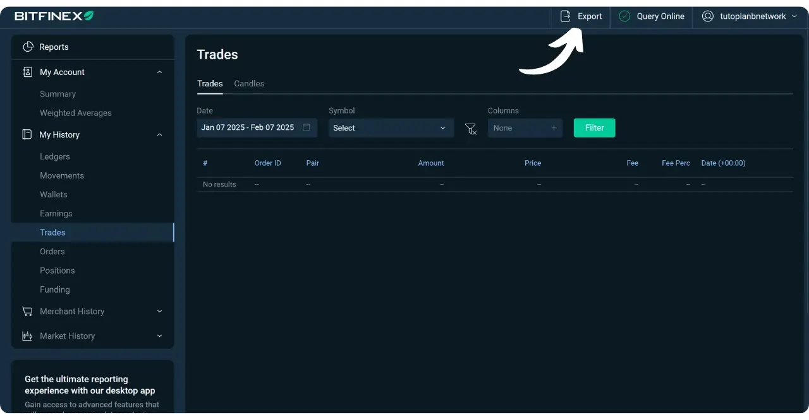

Vérifiez les paramètres puis confirmez l'exportation.

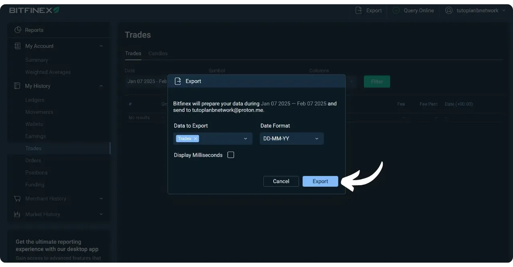

Le rapport vous sera envoyé par email à l’adresse associée à votre compte Bitfinex, sous forme de fichier CSV.

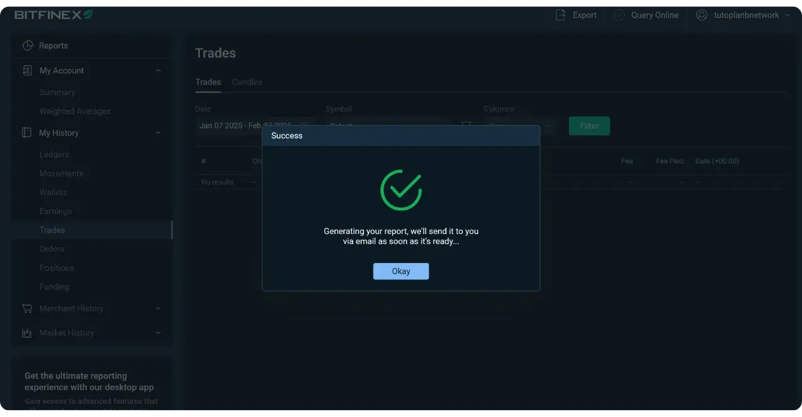

Une fois le fichier exporté, vous pourrez l’intégrer dans votre logiciel de comptabilité ou l’envoyer à votre expert-comptable.

## 9 - Cas d’usage pour l’entreprise

En fonction des objectifs et de la structure de votre entreprise, l'utilisation de Bitfinex peut varier.

### Acheter des bitcoins pour les avoir en trésorerie

**Objectif :** Diversifier la trésorerie de l'entreprise en investissant dans le bitcoin.

**Étapes à Suivre :**
- Déposez des euros sur Bitfinex depuis le compte bancaire de l'entreprise ;
- Utilisez ces euros pour acheter du bitcoin ;
- Conservez les bitcoins sur la plateforme ou retirez-les pour les sécuriser en self-custody ;
- Exportez les historiques de transactions selon vos besoins.

### Accepter le bitcoin comme moyen de paiement

**Objectif :** Offrir la possibilité à votre entreprise d’accepter le bitcoin comme moyen de paiement pour vos produits ou vos services.

**Étapes à Suivre :**
- Intégrez un système de paiement en bitcoins. Pour les petites structures, un simple logiciel de portefeuille peut suffire, ou bien vous pouvez opter pour des solutions spécialisées comme Swiss Bitcoin Pay ou BTCPay Server pour intégrer le bitcoin comme option de paiement sur votre site web ou en point de vente ;
- Transférez les paiements reçus en bitcoins vers votre compte Bitfinex ;
- Selon votre stratégie financière, vendez les bitcoins reçus contre des euros, conservez-les pour une potentielle plus-value future, ou optez pour une combinaison des deux ;
- Conservez les bitcoins sur la plateforme ou retirez-les pour les garder en self-custody. Vous pouvez également retirer les euros sur votre compte bancaire ;
- Exportez les historiques de transactions selon vos besoins.

Pour approfondir ce sujet, je vous recommande de consulter cette formation complète sur l'intégration du bitcoin aux entreprises, qui couvre dans le détail l'ajout en trésorerie, l'acceptation des paiements en bitcoins, et la comptabilité :

https://planb.network/courses/biz101
