Fondée en 2012, Bitfinex est l'une des premières plateformes d'échange de bitcoin et d'altcoins. Initialement centrée sur des échanges P2P de bitcoins, la plateforme a rapidement élargi ses services pour inclure le trading sur marge, le financement P2P, le trading de produits dérivés, et un marché OTC ("*over-the-counter*") pour les transactions de gros volumes.

Aujourd'hui, Bitfinex est une plateforme complète, permettant aussi bien des achats simples de bitcoins que l'utilisation de fonctionnalités de trading avancées avec des outils de gestion de risque. Elle est accessible en version web, et pour des transactions simples, une application mobile facile à prendre en main est également disponible.

Bitfinex soutient activement le développement de Bitcoin, en investissant dans des technologies comme le Lightning Network et en promouvant des solutions peer-to-peer favorisant la liberté financière.

## 1 - Création d’un compte sur Bitfinex

Rendez-vous sur [le site officiel de Bitfinex](https://www.bitfinex.com/). Sur la page d'accueil, trouvez et cliquez sur l'option "*Sign Up*" pour commencer la création de votre compte.

Complétez les informations requises : indiquez votre adresse email et votre pays de résidence. Choisissez un nom d'utilisateur et un mot de passe sécurisé, puis cliquez sur "*Sign up*" pour confirmer l'inscription.

Pour des conseils sur l'utilisation et la sauvegarde de mots de passe forts et uniques, consultez également ce tutoriel :

https://planb.network/tutorials/others/general/bitwarden-0532f569-fb00-4fad-acba-2fcb1bf05de9

Nous allons à présent configurer le 2FA pour sécuriser le compte. Utilisez une application d'authentification sur votre smartphone, telle que Google Authenticator ou Authy par exemple. Vous trouverez un tutoriel sur cet outil ici :

https://planb.network/tutorials/others/general/authy-a76ab26b-71b0-473c-aa7c-c49153705eb7

Scannez le QR code avec votre application et entrez les 6 chiffres fournis.

Si vous le réalisez depuis l'application sur votre smartphone :

L'inscription a bien été réalisée.

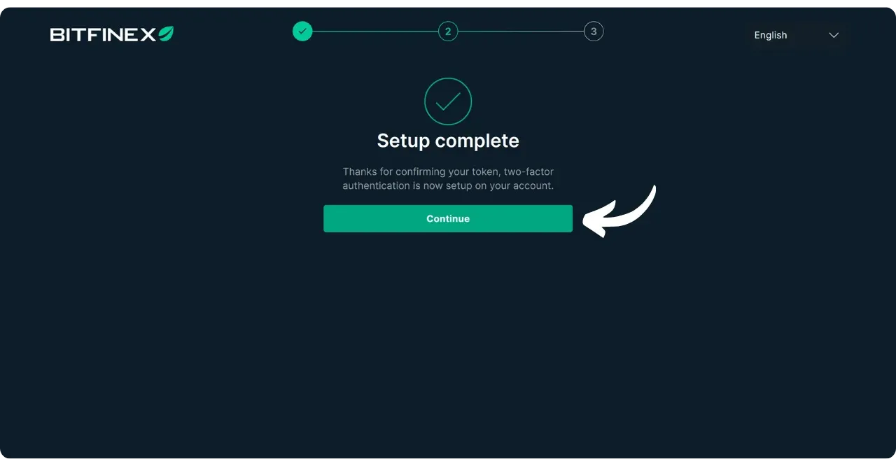

Vérifiez votre boîte mail et cliquez sur le lien envoyé par Bitfinex pour confirmer votre inscription.

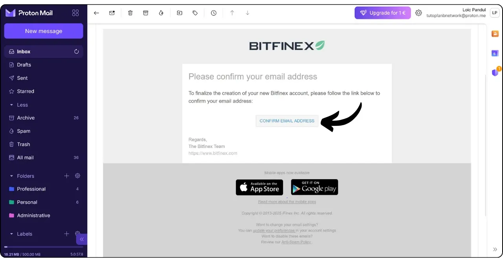

Votre compte est désormais créé. Cliquez sur "*Log in*" pour accéder à la plateforme.

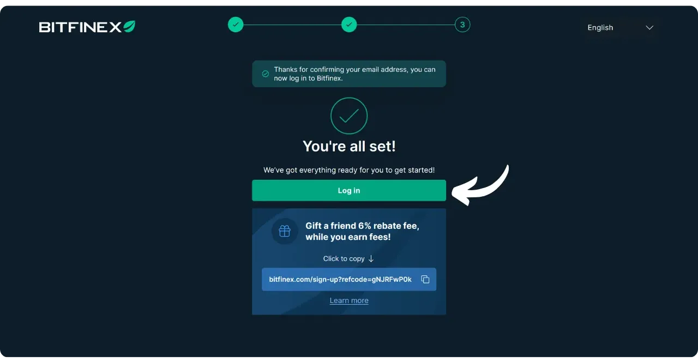

## 2 - Vérification du compte

Bitfinex applique un processus de vérification (KYC) conforme aux réglementations en vigueur. En mode "*Basic*", il est impossible de réaliser des dépôts, des retraits ou des opérations, ce qui rend indispensable l'obtention d'au moins le niveau de vérification "*Basic Plus*", voire "*Intermediate*" ou "*Full*" si nécessaire :
- *Basic* est un mode d'affichage uniquement, qui permet de consulter la plateforme sans effectuer d’opérations ;
- *Basic Plus* permet d’accéder aux fonctionnalités essentielles, notamment les transactions sur le marché au comptant et certaines options de dépôt et de retrait ;
- *Intermediate* débloque des services avancés tels que le trading sur marge, les prêts, les transactions P2P et OTC, et offre des délais réduits pour les dépôts ;
- *Full* permet d'accéder aux virements bancaires internationaux et bénéficier de l’ensemble des fonctionnalités de la plateforme.

Pour chaque palier, des documents supplémentaires sont exigés lors de la vérification. Pour la plupart des utilisateurs, les comptes *Basic Plus* ou *Intermediate* sont généralement suffisants.

Une fois votre compte créé, une fenêtre pop-up devrait vous suggérer de vérifier votre compte. Cliquez sur "*Verify*".

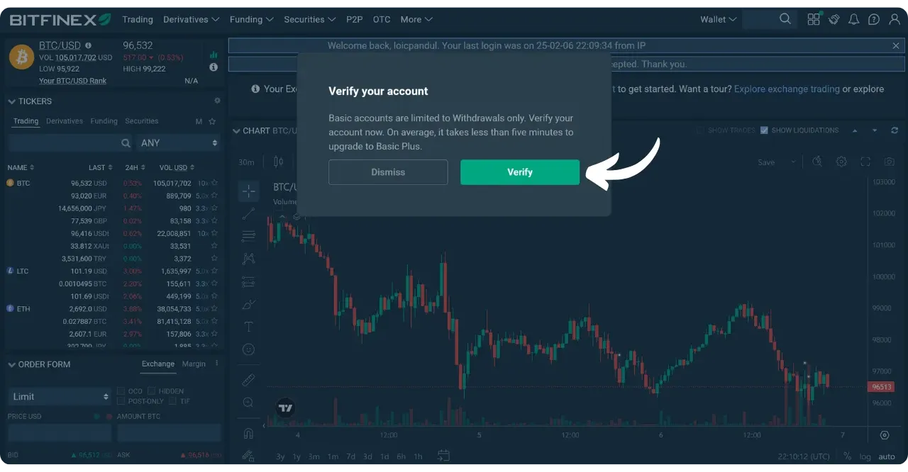

Si cette fenêtre n'apparaît pas, accédez à votre profil situé en haut à droite de l'interface, puis cliquez sur "*Verification*".

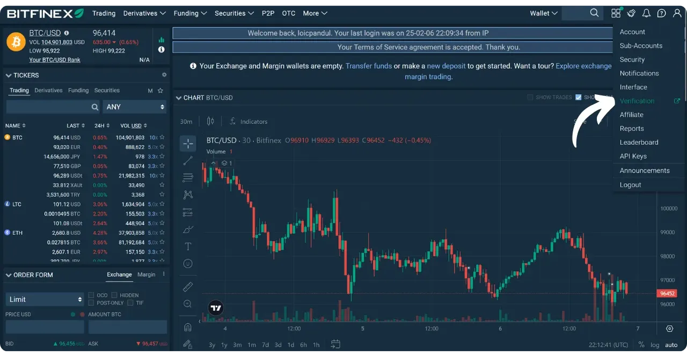

Sous "*Account Type*", choisissez "*Individual*". Dans mon cas, je procède à la mise à niveau vers "*Basic Plus*", donc je sélectionne "*Upgrade to Basic Plus*".

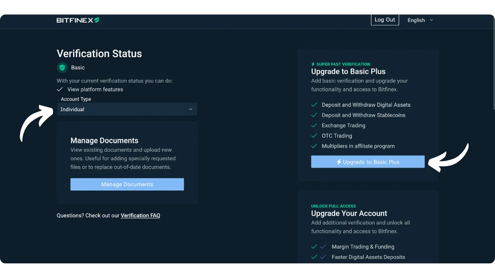

Complétez les étapes en fournissant les informations et les documents demandés. Une fois votre dossier complété et envoyé, Bitfinex procédera à la vérification de votre compte afin de débloquer les fonctionnalités associées.

## 3 - Présentation rapide de l’interface Bitfinex

Une fois connecté, vous verrez une barre de navigation en haut de l'interface avec : "*Trading*", "*Derivatives*", "*Funding*", "*OTC*", "*P2P*", "*Wallet*", etc. Bitfinex offre un large panel de fonctionnalités, dont :
- **Trading** : Marché "*classique*" où vous pouvez passer des ordres pour acheter et vendre des cryptomonnaies (dont le bitcoin) ;
- **OTC** : Service Over-The-Counter pour échanger de gros volumes directement avec un autre acteur, en dehors des carnets d’ordre publics ;
- **Funding** : Espace dédié au lending et au margin funding ;
- **Derivatives** : Section pour les produits dérivés (contrats à terme, etc.), plutôt destinés aux traders expérimentés ;
- **P2P** : Permet d’acheter ou de vendre des cryptos auprès d’autres utilisateurs en pair-à-pair.

Pour un usage standard (achat/vente de bitcoins et dépôts/retraits), vous utiliserez principalement l’onglet "*Trading*" ainsi que les sections "*Wallet*", "*Deposit*" et "*Withdraw*".

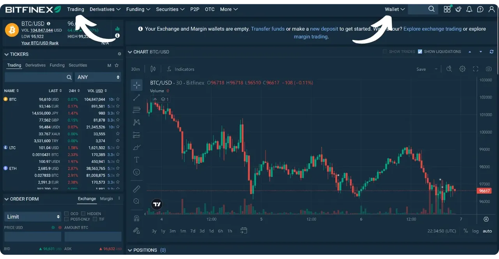

L’un des avantages de Bitfinex est aussi la possibilité de créer des sous-comptes. Vous pouvez ainsi ségréguer différentes utilisations de votre compte :

Si vous le souhaitez, vous avez également la possibilité de personnaliser votre tableau de bord pour mettre en avant les fonctionnalités dont vous avez besoin :

## 4 - Dépôt et retrait d’euros (fiat)

Pour déposer des euros sur votre compte Bitfinex, accédez au sous-menu "*Deposit*" situé dans le menu "*Wallet*" en haut de l'interface.

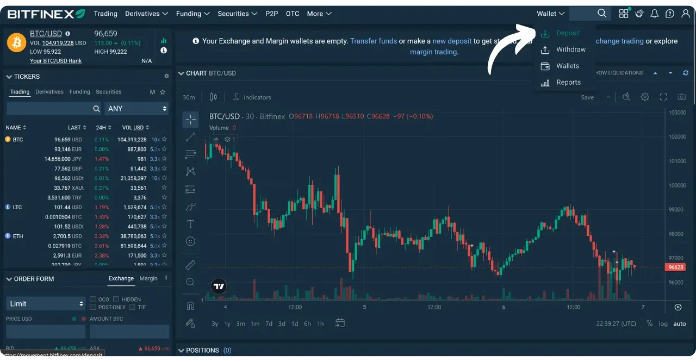

Sélectionnez "*Bank transfer*" ou "*Credit/Debit Card*" pour effectuer un dépôt en euros (ou toute autre monnaie fiat).

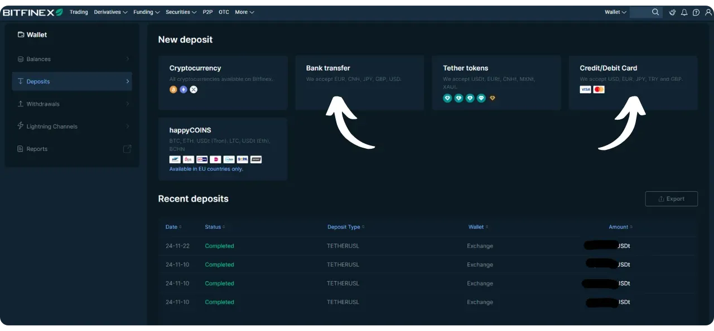

Choisissez la monnaie fiat à envoyer, par exemple l'euro. Si vous utilisez seulement les fonctionnalités de base du "*Trading*", cliquez sur "*Exchange*". Indiquez également le montant que vous souhaitez déposer et le pays de votre banque.

Effectuez un virement depuis votre compte bancaire vers le compte bancaire indiqué par Bitfinex.

Pour retirer des fonds, la procédure est similaire : rendez-vous dans le sous-menu "*Withdraw*".

Cliquez sur "*Bank transfer*".

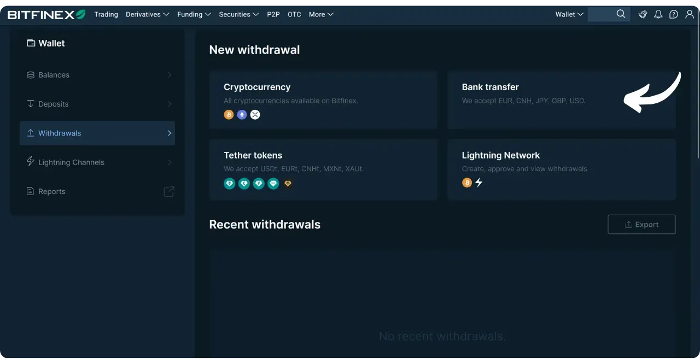

Sélectionnez la monnaie fiat que vous souhaitez retirer, le compte à débiter chez Bitfinex ("*Exchange*" si vous n'utilisez que les fonctionnalités de base) et le montant à retirer.

Bitfinex peut exiger une validation de votre compte bancaire avant d'accepter le virement, pour des raisons de conformité.

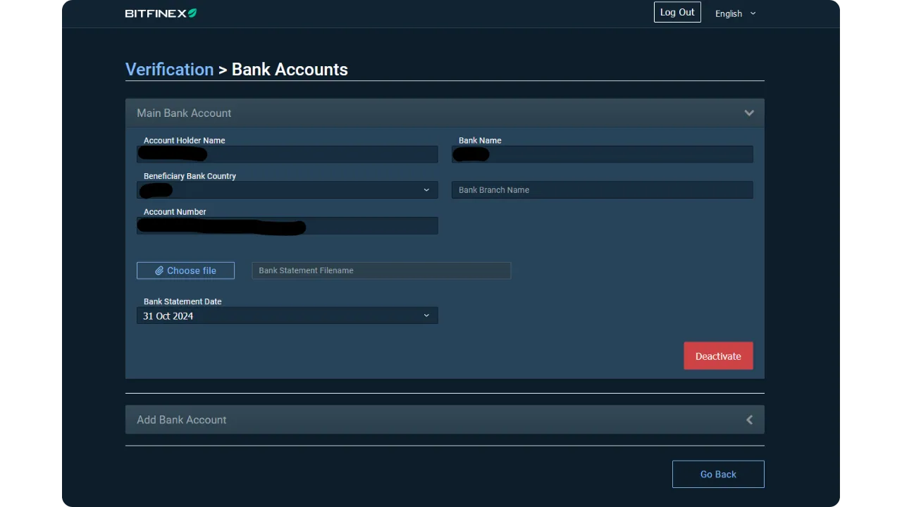

Une fois la procédure initiée, Bitfinex transférera les fonds vers votre compte bancaire.

## 5 - Dépôt et retrait de bitcoins

Pour déposer du bitcoin sur Bitfinex, accédez au sous-menu "*Deposit*".

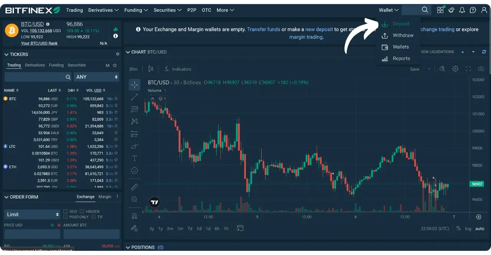

Cliquez sur "*Cryptocurrency*".

Choisissez "*BTC*". Une adresse de réception apparaîtra. Copiez cette adresse et utilisez-la depuis votre portefeuille en self-custody ou une autre plateforme pour envoyer vos BTC.

Pour retirer du bitcoin, rendez-vous dans le sous-menu "*Withdraw*".

Cliquez sur "*Cryptocurrency*".

Sélectionnez "*BTC*". Choisissez le compte Bitfinex à débiter pour votre retrait ("*Exchange*" pour les fonctionnalités de base). Entrez le montant et l'adresse de destination des bitcoins. Assurez-vous de vérifier l'adresse de retrait pour prévenir toute erreur.

Suite à votre confirmation, vos bitcoins seront transférés. Notez que les frais et les délais peuvent varier selon la congestion des mempools.

Bitfinex offre aussi des options de dépôt et de retrait via le Lightning Network, ce qui permet des transactions plus rapides et moins onéreuses.

Si le Lightning Network vous intéresse, nous avons également une formation complète pour comprendre son fonctionnement :

https://planb.network/courses/lnp201

Après l'achat de vos premiers bitcoins, vous avez évidemment la possibilité de les laisser sur la plateforme, mais je vous recommande fortement de les transférer vers votre propre portefeuille en self-custody. Si vous ne savez pas encore comment utiliser un portefeuille Bitcoin, je vous invite à explorer [la section "Wallet" sur Plan ₿ Network](https://planb.network/tutorials/wallet).

## 6 - Achat et vente de bitcoins sur Bitfinex

Bitfinex propose différents modes de trading. Pour une utilisation simple, optez pour le marché spot classique, également appelé "*Trading*" ou "*Exchange*". Ici, vous pouvez passer des ordres d'achat ou de vente au prix du marché ou définir un prix limite.

Dans le menu supérieur, cliquez sur "*Trading*".

Sélectionnez la paire "*BTC/EUR*" si vous désirez acheter ou vendre des BTC en échange d'euros, par exemple.

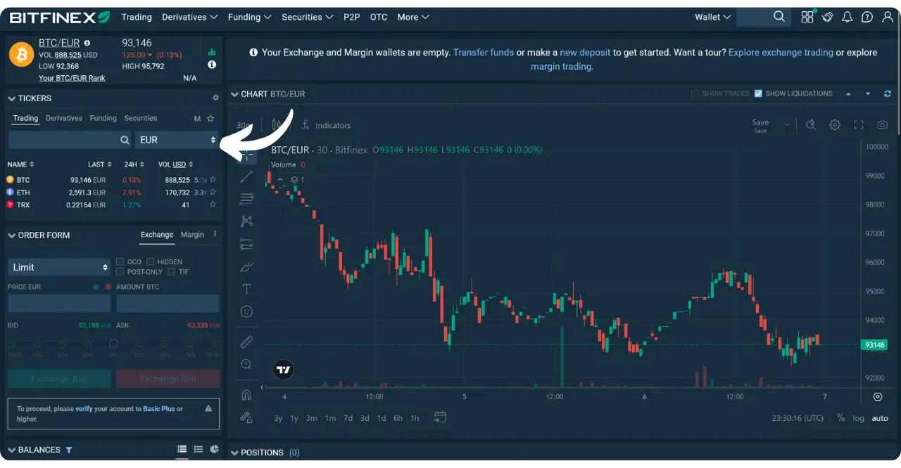

L'interface affiche au centre un graphique du cours, l'order book en bas, et le module de saisie d'ordre à gauche. Dans la section de saisie, vous avez le choix entre un ordre "*Market*" (exécuté immédiatement au meilleur prix disponible) ou "*Limit*" (vous définissez le prix). Indiquez la quantité de BTC à acheter ou à vendre, ou sélectionnez un pourcentage de votre solde. Cliquez ensuite sur "*Buy*" pour acheter ou sur "*Sell*" pour vendre.

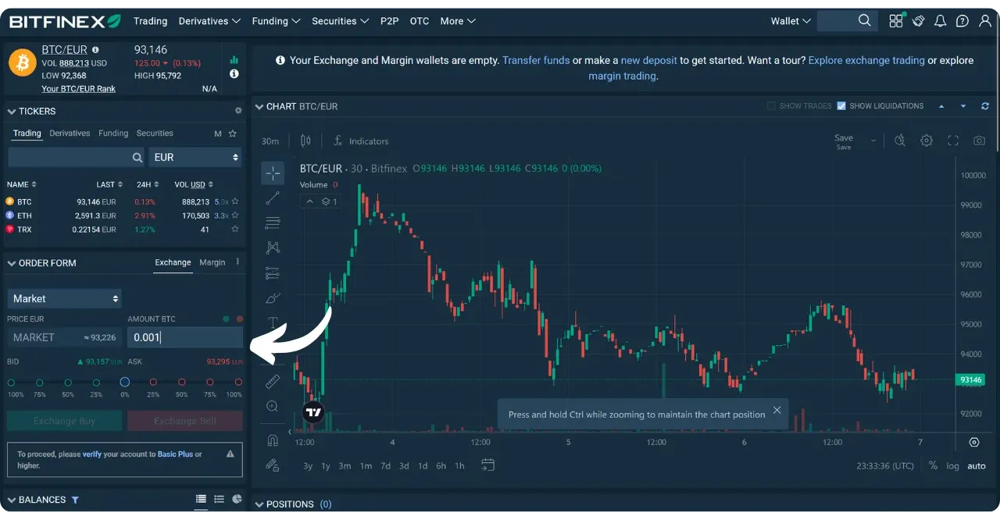

Vous pouvez consulter l’historique de vos ordres exécutés dans la partie inférieure de l’interface.

Vous pouvez également configurer un achat récurrent de bitcoins depuis l'application afin de lisser votre prix d'acquisition dans le temps (*DCA*).

