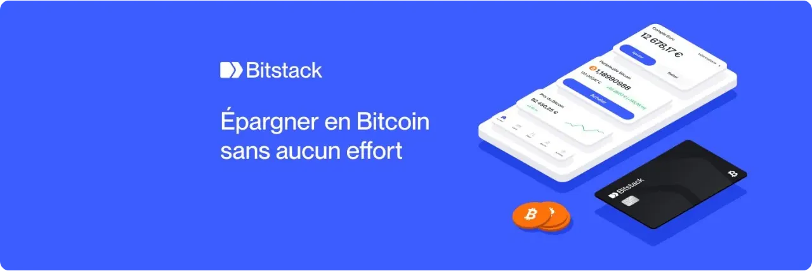

Bitstack é uma plataforma francesa de investimento em bitcoin, regulada pela AMF. Oferece uma aplicação disponível em Android e iOS para facilitar a compra e venda de bitcoin.

O que distingue o Bitstack é o seu sistema de arredondamento automático, que sincroniza a conta bancária do utilizador para converter a diferença entre o montante debitado durante as despesas diárias e o euro superior seguinte, diretamente em bitcoins. Este método facilita a aplicação do *Dollar Cost Averaging* (DCA), permitindo uma acumulação gradual e indolor de satoshis. Para além desta caraterística original, a plataforma também oferece um sistema DCA clássico com investimentos automáticos, bem como compra e venda à vista.

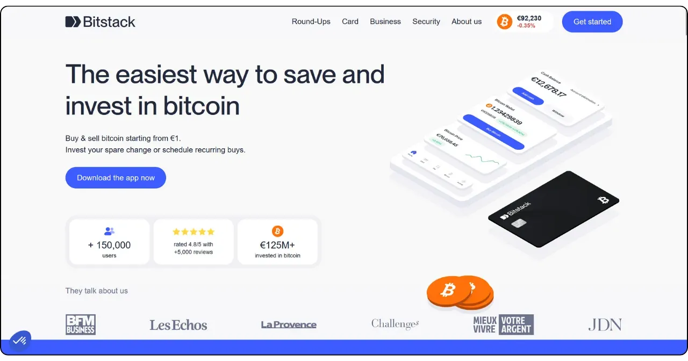

As taxas de transação do Bitstack variam de acordo com o volume negociado nos últimos 30 dias:

- Menos de 250 euros: 1,49
- 250 € - 5 000 € : 0,99 %
- 5 000 € - 10 000 € : 0,89 %
- 10 000 € - 50 000 € : 0,79 %
- 50 000 € - 250 000 € : 0,69 %
- 250 000 € - 500 000 € : 0,59 %
- Mais de 500 000 euros: 0,49

Todas as outras operações na plataforma são gratuitas, incluindo levantamentos de bitcoin (com um levantamento mínimo fixado em 100.000 sats). Assim, ao contrário de outras plataformas de câmbio, retirar, digamos, 0,01 BTC da aplicação para o transferir para a autocustódia não geraria quaisquer taxas de serviço ou de mineração, permitindo-lhe receber efetivamente 0,01 BTC no seu endereço de receção.

## Descarregar a aplicação

Para descarregar a aplicação Bitstack, vá à sua loja de aplicações:

- [Descarregar da Google Play Store] (https://play.google.com/store/apps/details?id=com.bitstack.app&hl=fr)
- [Descarregar na App Store] (https://apps.apple.com/fr/app/bitstack-%C3%A9pargner-en-bitcoin/id1608783388)

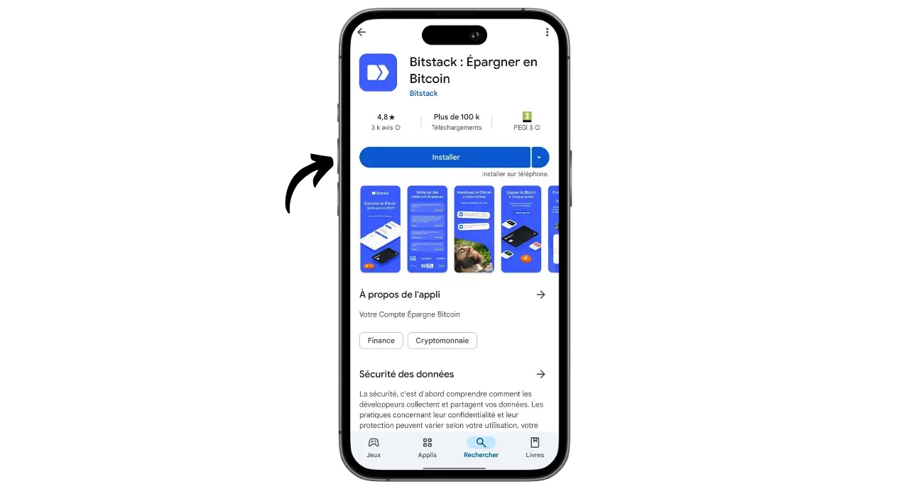

## Criar uma conta

Quando abrir a aplicação pela primeira vez, clique no botão "*Registar*".

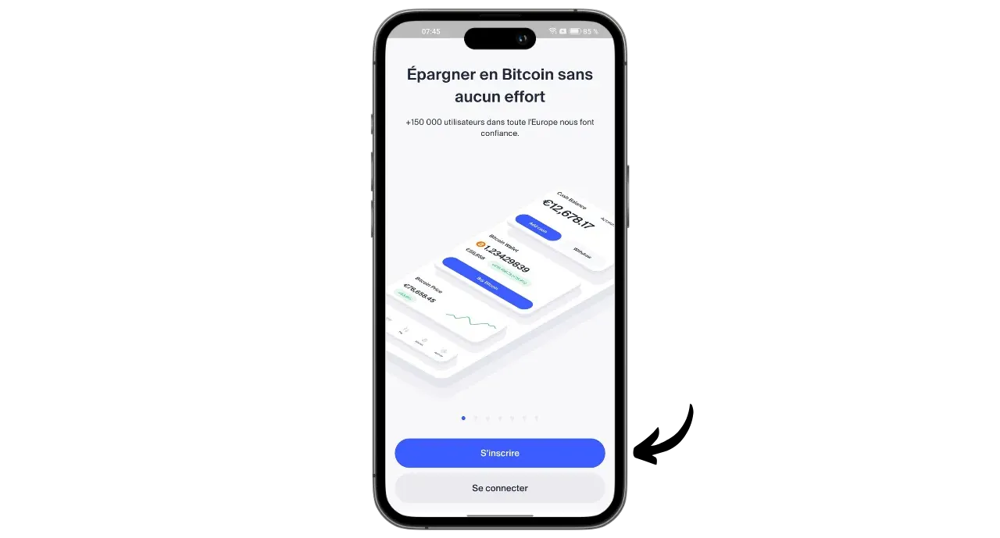

Introduza o seu número de telefone e clique em "*Continuar*". Em seguida, introduza o código que recebeu por SMS.

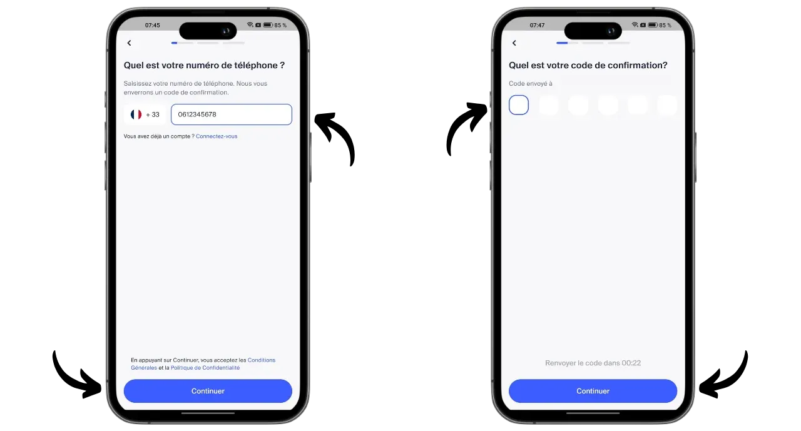

Introduza o seu endereço de correio eletrónico.

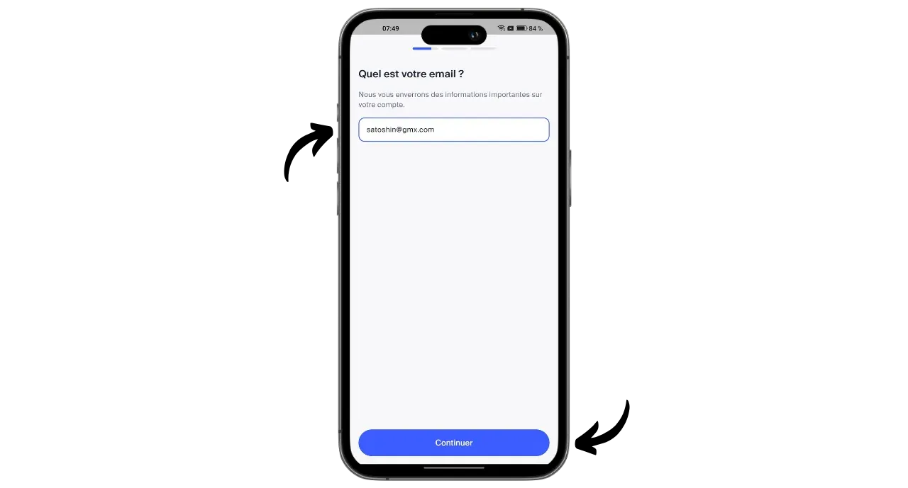

Escolha uma palavra-passe forte para proteger o acesso à sua conta e, em seguida, clique em "*Continuar*".

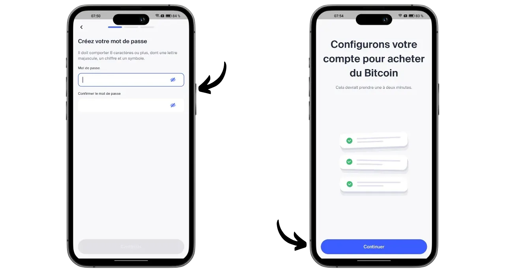

Para uma gestão segura das palavras-passe no dia a dia, a utilização de um gestor de palavras-passe é altamente recomendada. No Plan ₿ Network, encontrará vários tutoriais sobre as melhores soluções existentes, como o Bitwarden :

https://planb.network/tutorials/others/general/bitwarden-0532f569-fb00-4fad-acba-2fcb1bf05de9
Ser-lhe-á então pedido que verifique a sua identidade (KYC). Em conformidade com a regulamentação francesa, ser-lhe-á pedido que forneça os seus dados pessoais e um comprovativo de identidade. Preencha os campos com o seu apelido, nome próprio e data de nascimento.

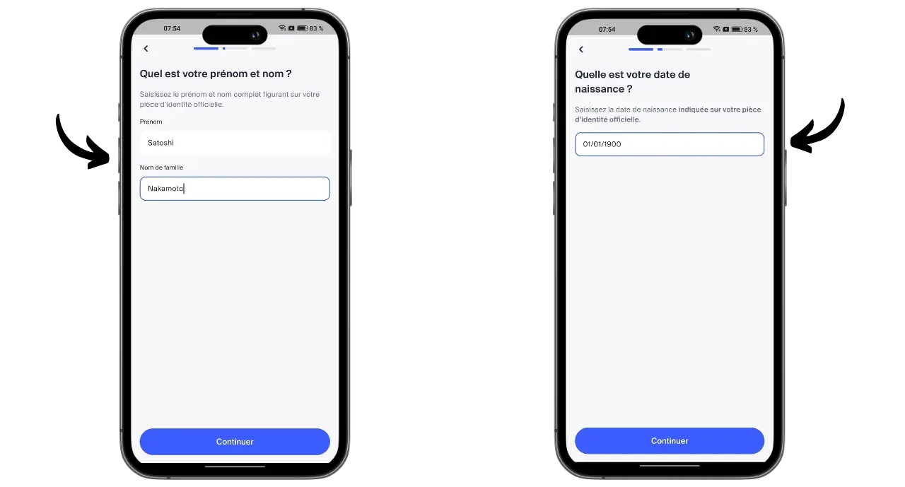

Introduza o seu endereço e responda às perguntas adicionais.

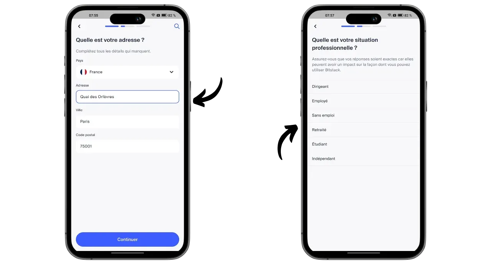

Avançar para a verificação da identidade.

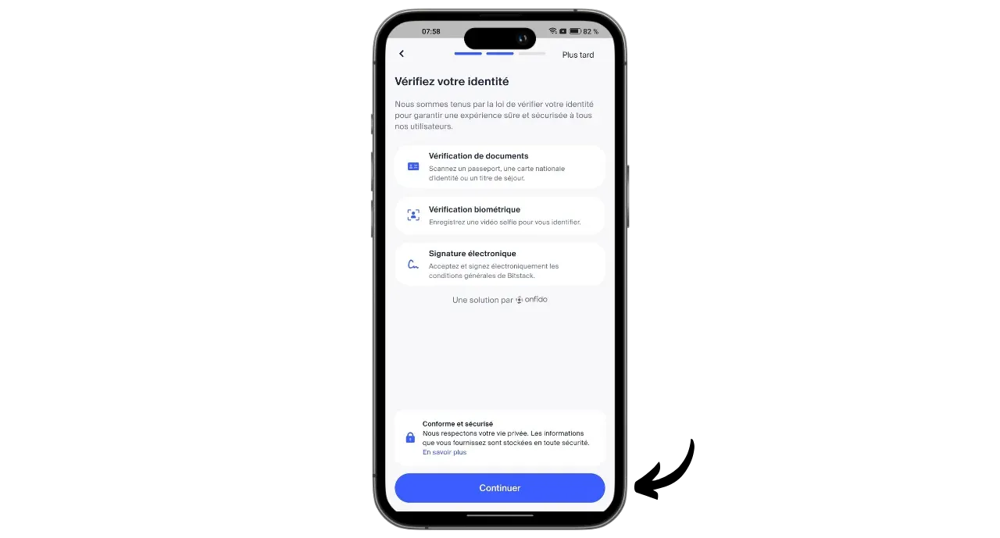

Depois disso, terá acesso a todas as funcionalidades da aplicação.

## Definições da aplicação

Em Definições, pode personalizar uma série de opções. Para aceder às mesmas, clique nas suas iniciais no canto superior direito da interface.

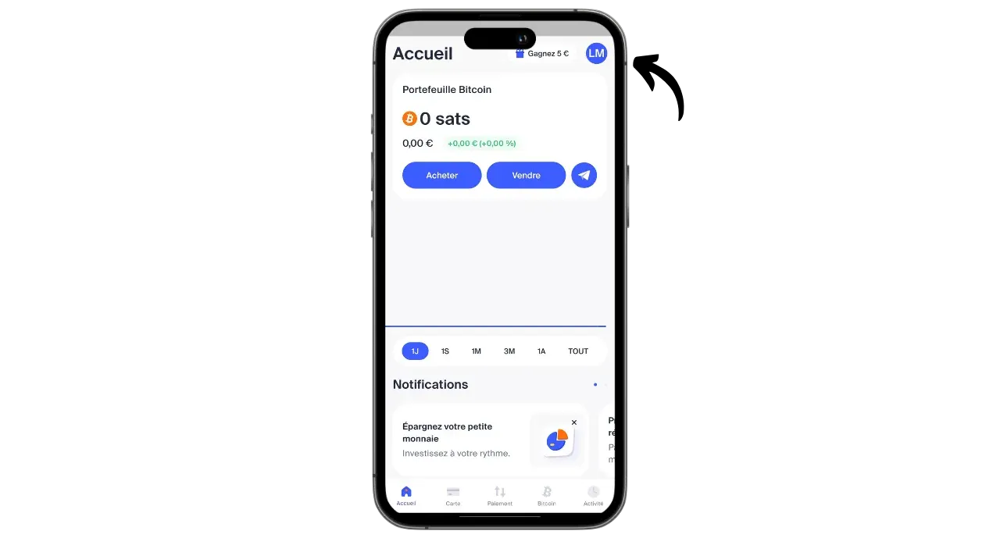

Comece pela secção "*Segurança*", onde pode ativar a autenticação biométrica para evitar ter de introduzir manualmente a sua palavra-passe sempre que iniciar sessão.

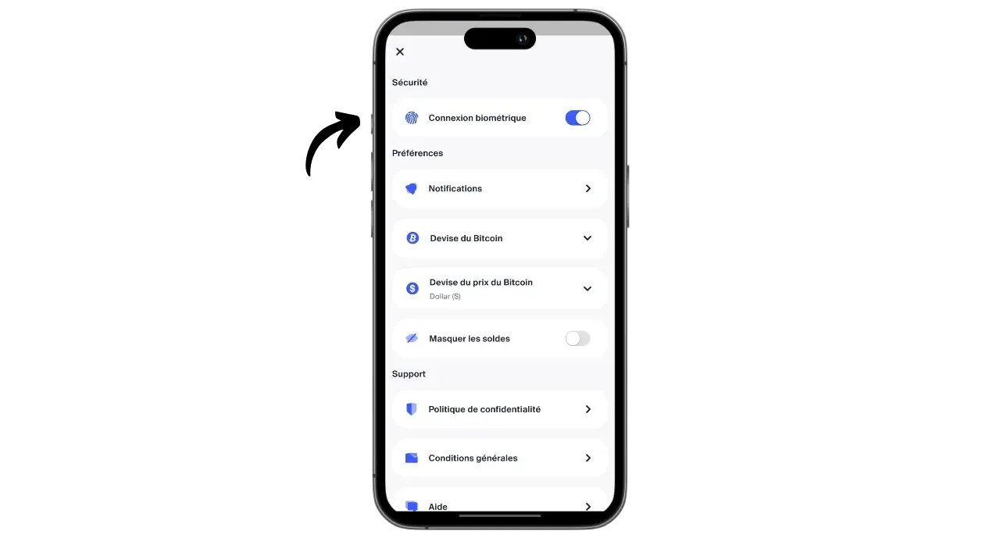

Em "*Preferências*", pode personalizar várias definições, como a moeda fiduciária apresentada, a unidade de bitcoin (BTC ou sats) ou as suas preferências de notificação.

Em seguida, vá a "*Geral*" nas definições e clique em "*Métodos de pagamento*".

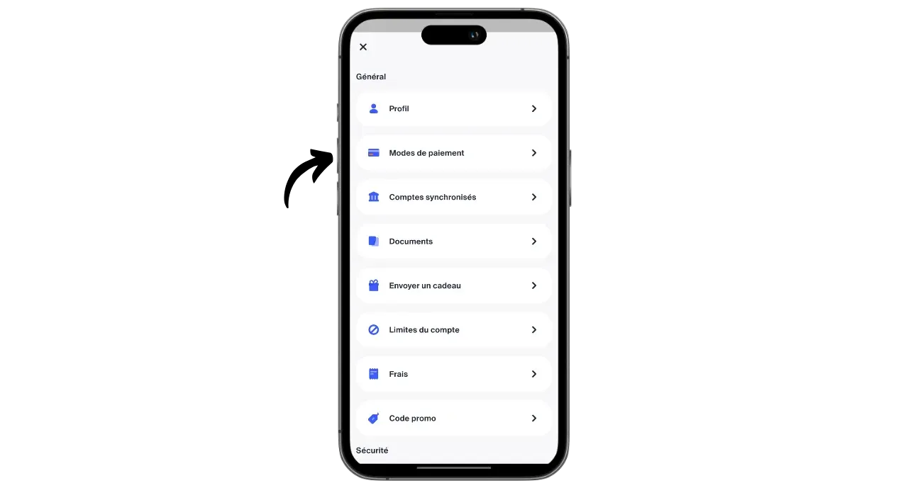

Aqui pode registar cartões de crédito para compras de bitcoin.

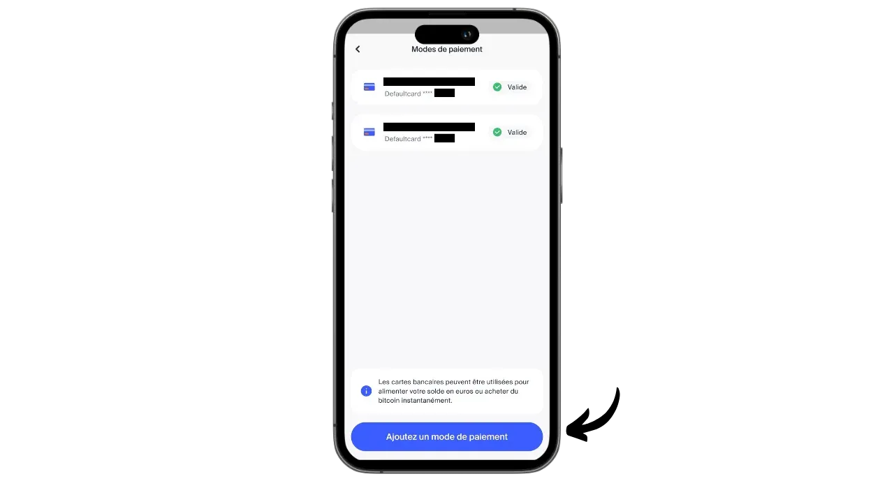

Para utilizar a função de arredondamento automático, é necessário sincronizar uma conta bancária. Clique em "*Contas sincronizadas*" e depois em "*Sincronizar uma conta bancária*".

Escolha o seu banco e siga as instruções do seu browser. Uma vez ligado, a sua conta bancária ficará visível nesta secção.

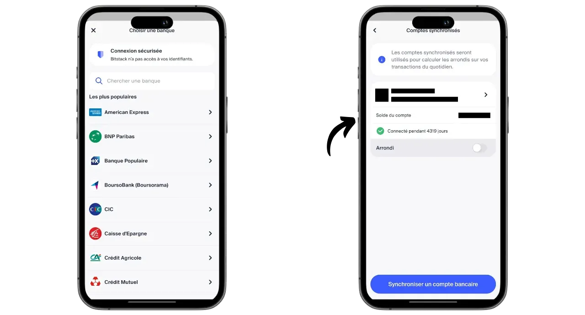

## Comprar bitcoin

Como mencionado na introdução, o Bitstack oferece 3 métodos para investir em Bitcoin:

- Compra imediata de um determinado montante em dinheiro;
- Configuração de compras recorrentes (RPC) ;
- A utilização do arredondamento automático nas despesas.

### Comprar com dinheiro

Para efetuar uma compra única de bitcoins ao preço de mercado, basta clicar em "*Comprar*".

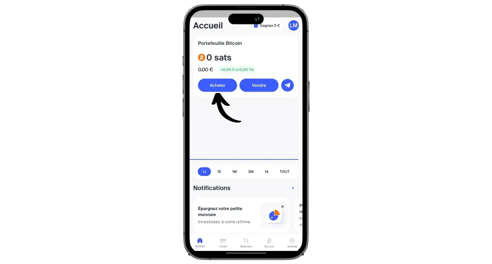

Introduza o montante pretendido, selecione o seu método de pagamento e prima "*Continuar*". Verifique a sua ordem de compra antes de a confirmar, clicando em "*Comprar*".

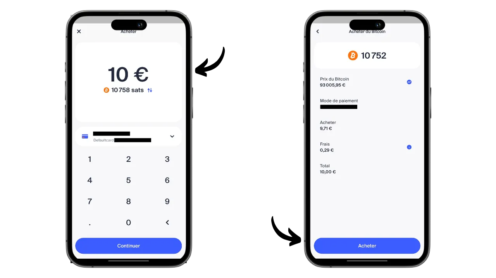

A sua transação está agora confirmada.

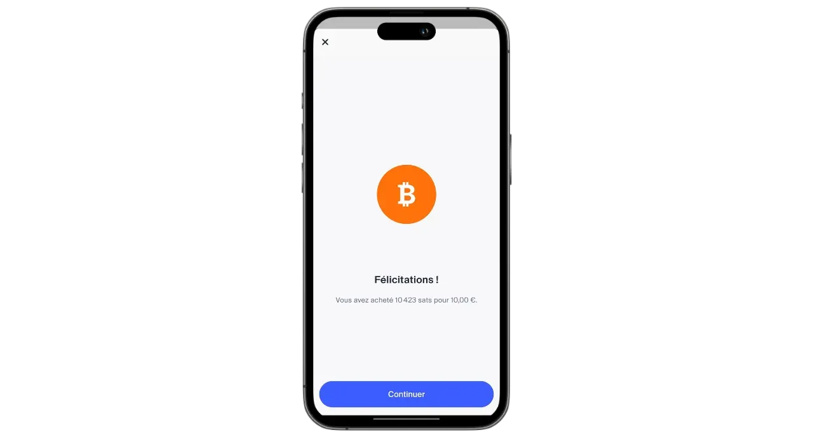

### Configurar um DCA

O Dollar Cost Averaging* (DCA) é uma estratégia de investimento atractiva para acumular bitcoin e reduzir os riscos associados à sua volatilidade. Ao comprar regularmente um montante fixo, independentemente do preço, pode suavizar o seu custo de aquisição e evitar a tomada de decisões impulsivas. A DCA ajuda a reduzir as tendências comportamentais, como o medo de perder uma oportunidade ou o pânico em caso de queda do preço, e permite-lhe assim gerir as suas poupanças em bitcoin de forma serena e disciplinada.

Para configurar uma compra recorrente (DCA) no Bitstack, vá à secção "*Poupança*" da página inicial e selecione "*Recorrente*". Em seguida, prima "*Continuar*".

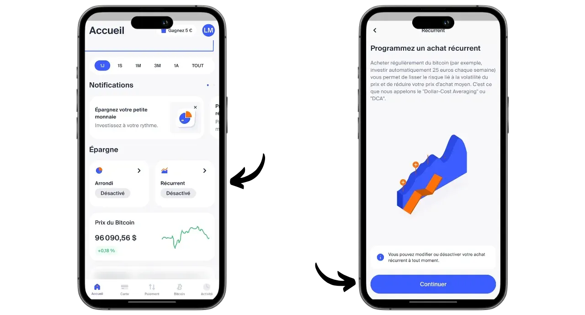

Definir o montante da compra recorrente e o método de pagamento.

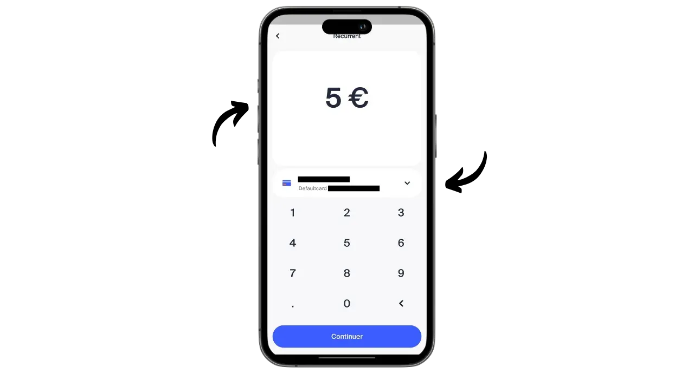

Selecione a data de início e a frequência do seu DCA, com opções que vão desde uma hora a um mês. Confirme clicando em "*Programar*".

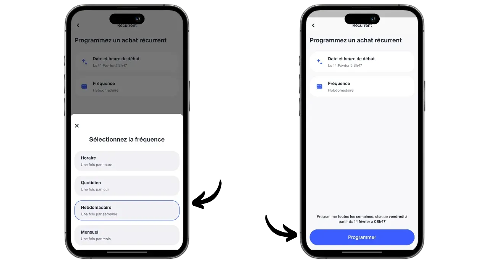

O seu DCA está agora ativo. Pode visualizá-lo ou modificá-lo a partir da página inicial, selecionando novamente "*Recorrente*".

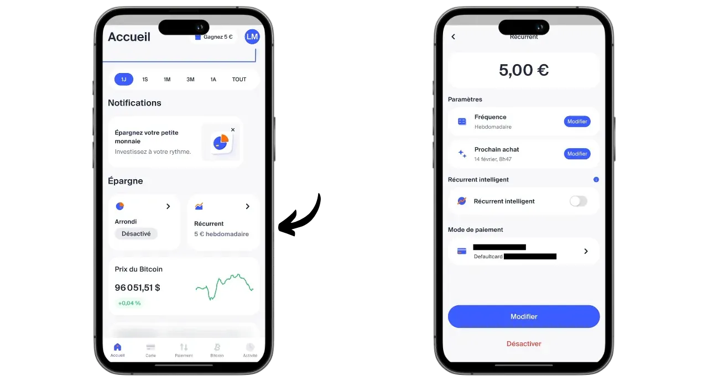

### Permitir o arredondamento automático das despesas

Como explicado anteriormente, o Bitstack oferece uma funcionalidade original de arredondamento automático das despesas. Isto permite-lhe arredondar as suas compras diárias para o euro mais próximo (ou mais, dependendo da definição escolhida) e investir a diferença em sats. Por exemplo, uma compra de 1,10 euros resultará num investimento automático de 0,90 euros em BTC pelo Bitstack, que detecta e agrega estas transacções todas as semanas.

Esta funcionalidade permite-lhe investir com uma espécie de DCA estabelecida sobre as suas despesas pessoais, de forma quase impercetível, a fim de acumular gradualmente poupanças em bitcoins.

Para o ativar, deve primeiro sincronizar uma conta bancária, como descrito no início desta secção. Depois, na aplicação Bitstack, clique em "*Arrondi*" na secção "*Poupança*".

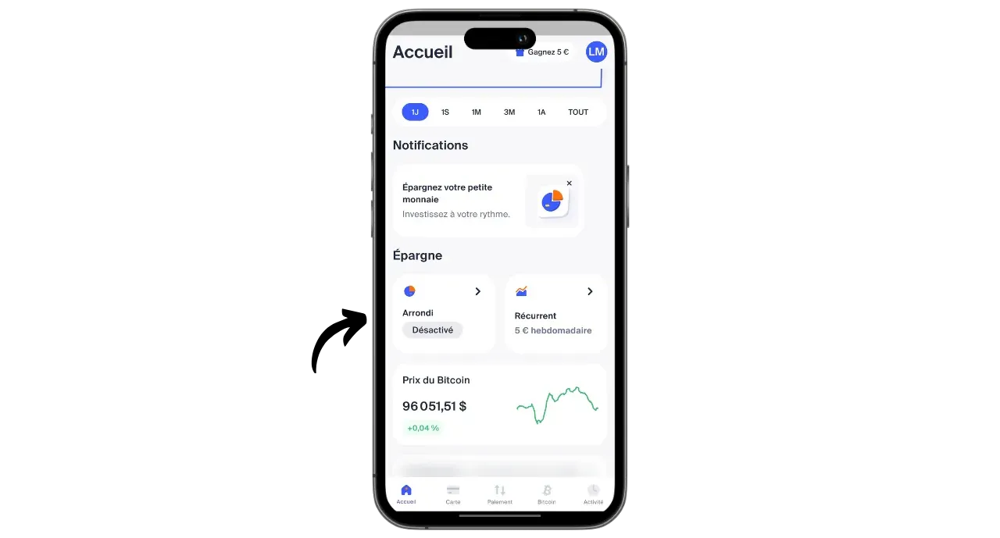

Escolha um multiplicador para o arredondamento. Por exemplo, com um multiplicador x2, uma compra de 1,10 euros permite-lhe poupar 1,80 euros em bitcoins: `0,9 * 2 = 1,8`.

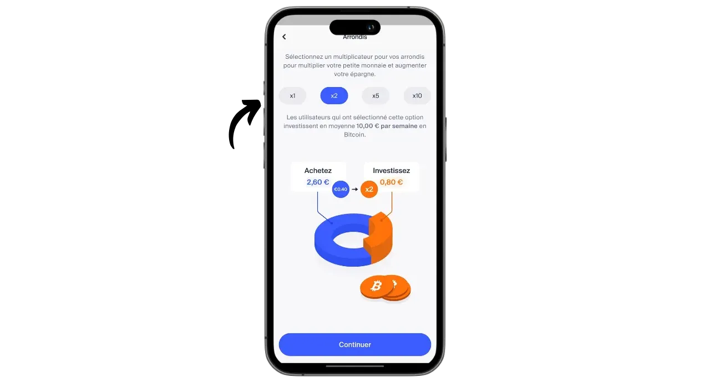

Selecione a sua conta bancária e clique em "*Continuar*". De seguida, escolha um método de pagamento para a compra do arredondamento.

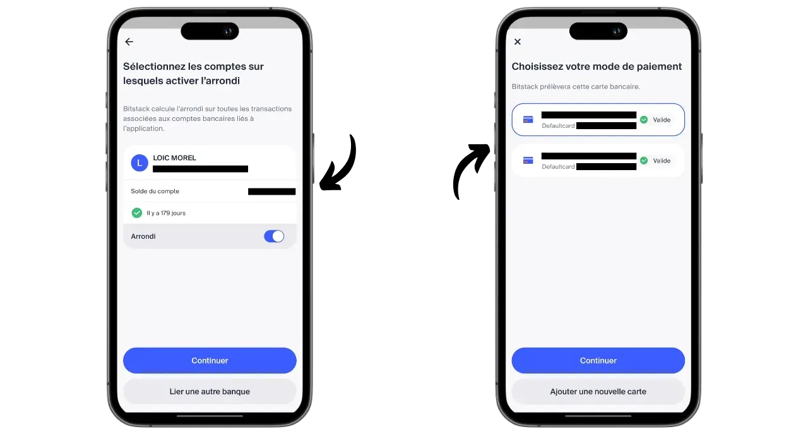

A sua opção de arredondamento automático está agora ativa. Pode visualizá-la ou modificá-la na secção "*Arredondamento*".

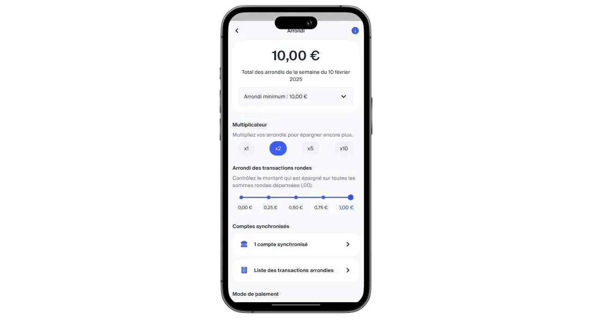

## Levantamento de bitcoin

Depois de ter comprado os seus primeiros satoshis no Bitstack, pode retirá-los da plataforma e mantê-los em autocustódia. Para o fazer, clique no ícone "*Enviar*" e depois em "*Enviar Bitcoin*".

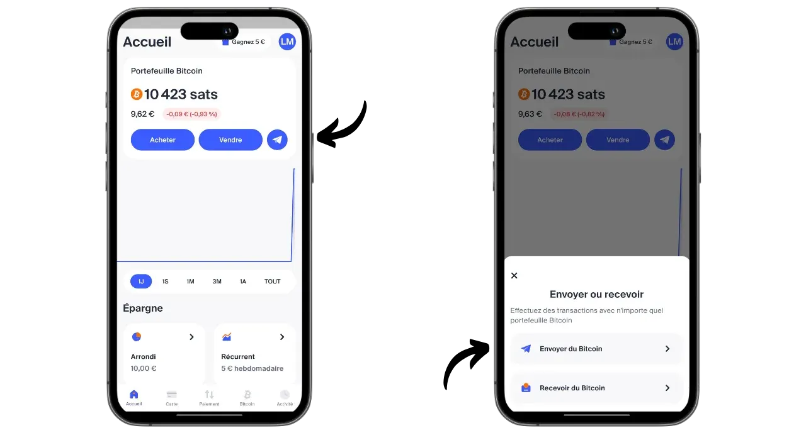

Escolha o montante que pretende levantar e clique em "*Enviar*". Em seguida, selecione "*Endereço Bitcoin*".

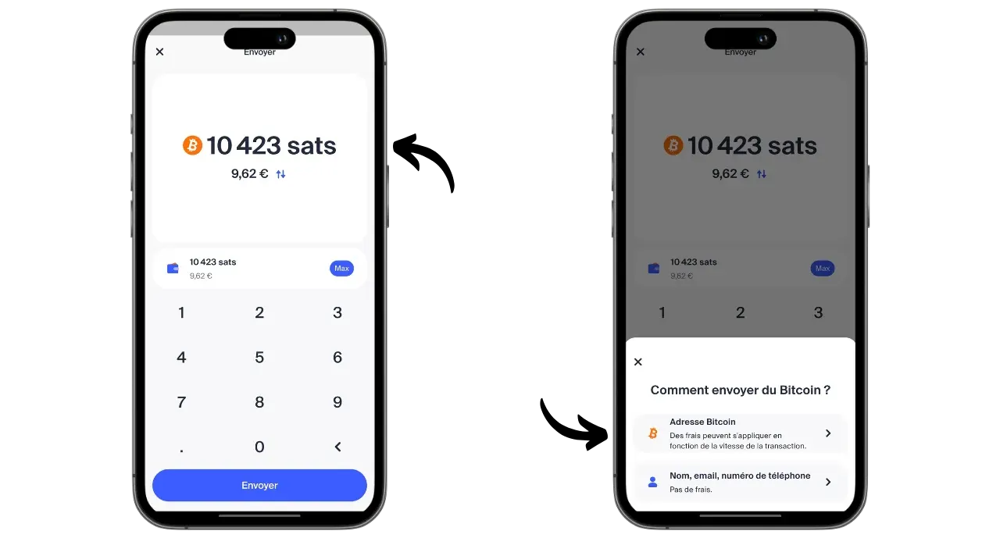

Introduza um endereço de destinatário em branco da sua carteira. Tenha cuidado, porque se cometer um erro, a transação será irreversível.

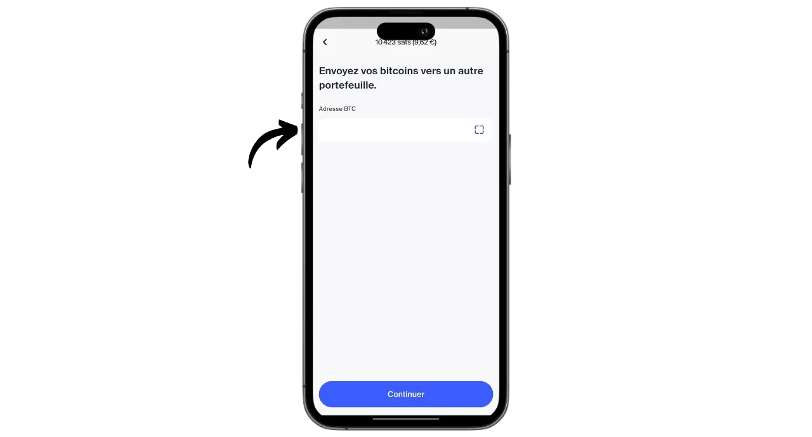

Determinar a prioridade da transação. Para uma retirada sem taxas, selecione a prioridade "*Standard*". Verifique os detalhes da sua retirada e confirme.

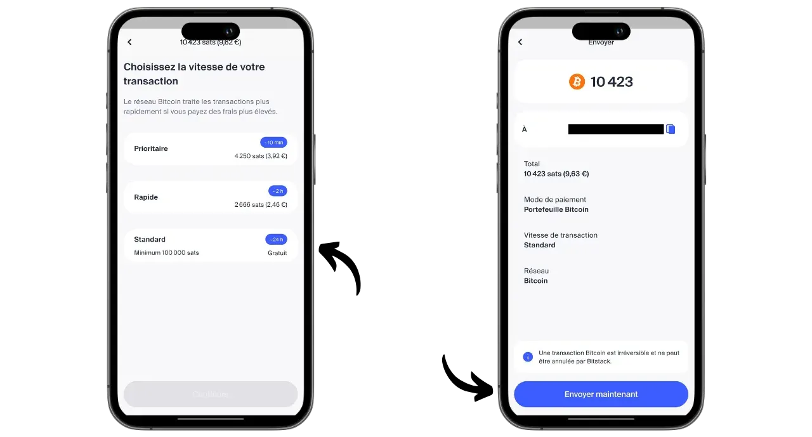

Se não estiver familiarizado com o funcionamento de uma carteira de autocustódia, oferecemos tutoriais sobre a maioria das soluções disponíveis [no Plano ₿ Rede na secção "*Carteira*"] (https://planb.network/tutorials/wallet).

## Vender bitcoin

Para vender bitcoins com a aplicação Bitstack, prima o botão "*Vender*".

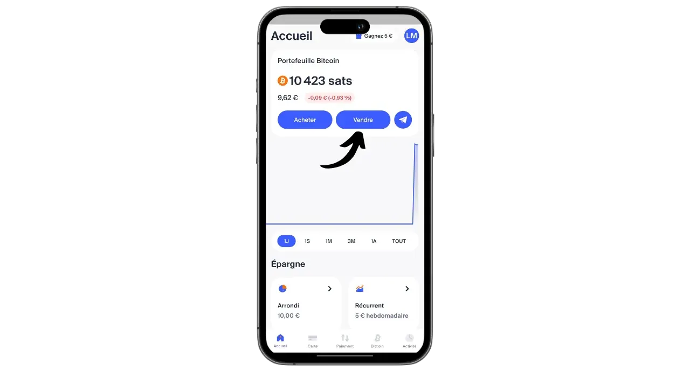

Introduza o montante de bitcoins que pretende vender e clique em "*Continuar*". Em seguida, selecione a conta bancária na qual pretende creditar os fundos.

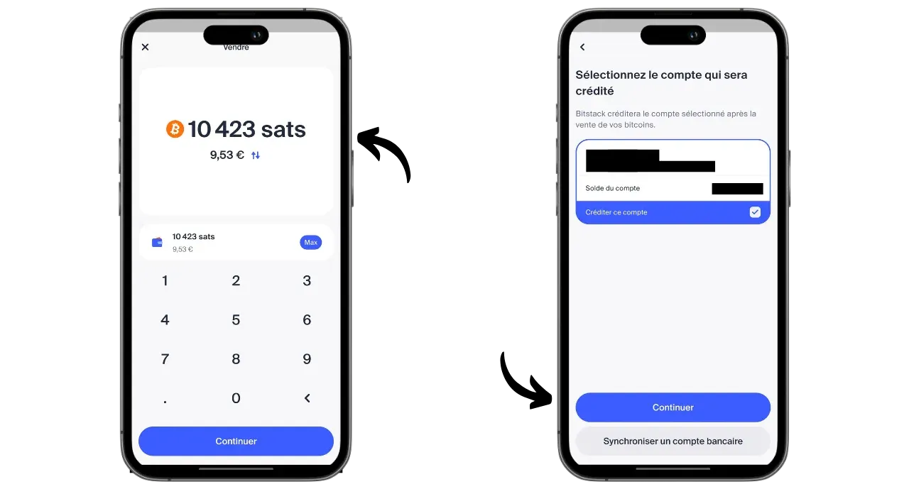

Verifique os detalhes da sua ordem de venda e confirme-a.

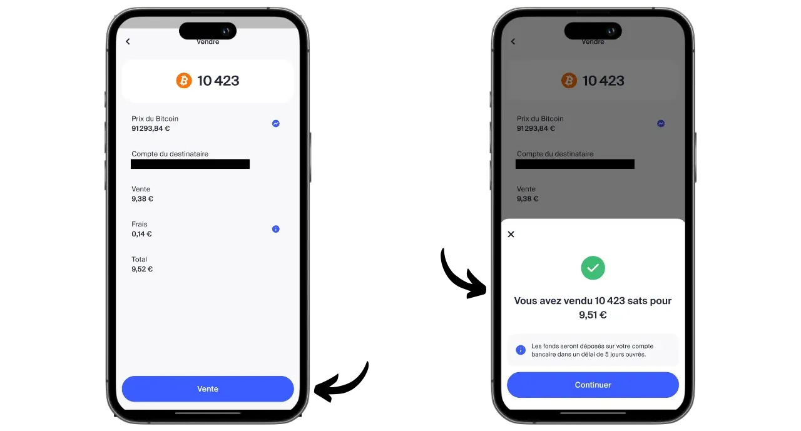

Pode ver os detalhes de todas as suas transacções na secção "*Atividade*".

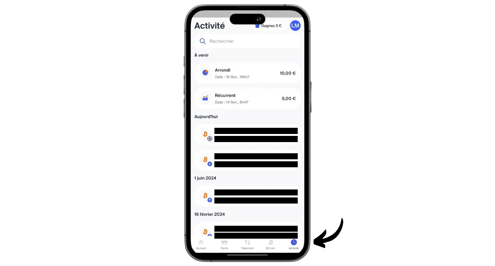