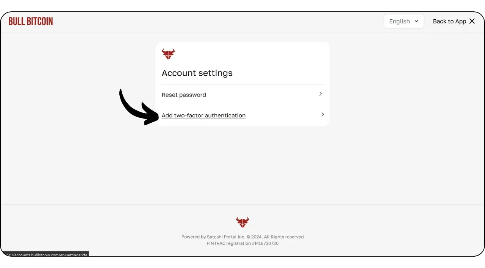
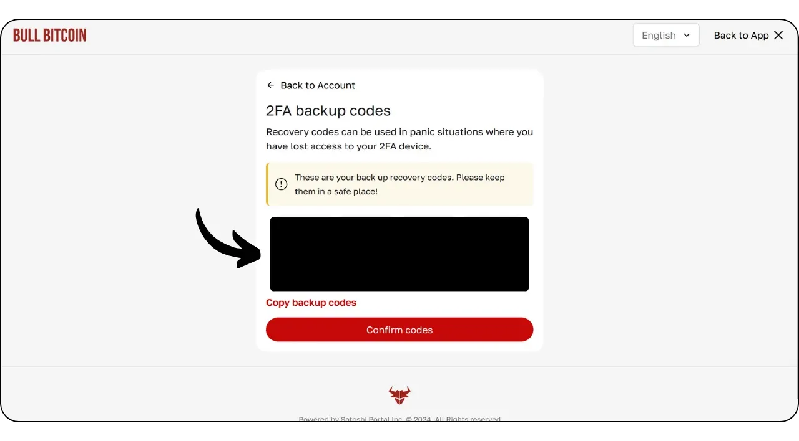
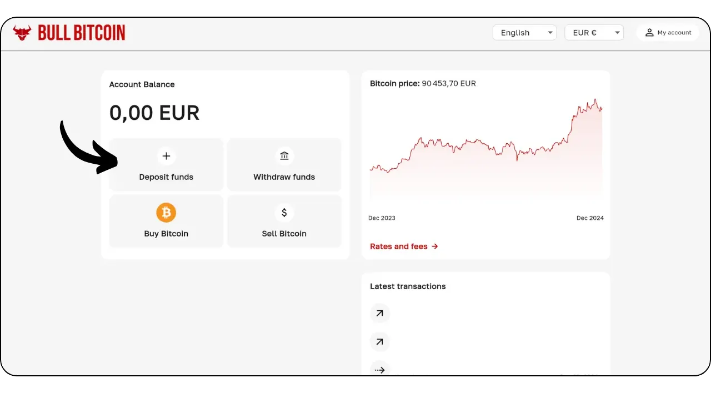

Bull Bitcoin est une plateforme d’échange Bitcoin-only fondée en 2013 au Canada par Francis Pouliot, une figure emblématique de l’écosystème Bitcoin. La philosophie de Bull Bitcoin est d'offrir aux utilisateurs des outils de souveraineté et d’émancipation financière. La plateforme d'échange est non-dépositaire, ce qui signifie que vous restez toujours souverain sur vos bitcoins.

Initialement disponible uniquement au Canada, la plateforme est depuis peu disponible en Europe, avec une toute nouvelle interface optimisée. Cette nouvelle version de Bull Bitcoin est pour le moment seulement disponible en Europe. Elle vous permet d'acheter et de vendre des bitcoins de manière simple et rapide grâce à l'utilisation de Lightning et des virements SEPA instantanés. À termes, la plateforme va également intégrer des options de DCA, d'achats automatiques, d'ordres limites, ou encore de paiements de factures en bitcoins.

Bull Bitcoin met un point d’honneur à fournir un service transparent et sans frais cachés. Notons que comme toutes les autres plateformes d'échange en Europe, l'utilisation de Bull Bitcoin requiert de réaliser un KYC (procédure d'identification des clients).

## S'inscrire sur Bull Bitcoin

Accédez à la [page d'inscription](https://accounts.bullbitcoin.com/en/registration) de Bull Bitcoin pour créer un nouveau compte. Saisissez votre adresse e-mail et choisissez un mot de passe fort. Appuyez ensuite sur "*Sign up*".

Un code de confirmation à 6 chiffres vous sera envoyé par e-mail.

Entrez ce code sur le site de Bull Bitcoin et appuyez sur "*Continue*".

Votre compte est désormais actif et vous pouvez accéder à la plateforme.

## Paramétrer son compte

Procédons maintenant à la sécurisation de votre compte. Cliquez sur "*My Account*".

Allez dans l'onglet "*Security Settings*" et sélectionnez "*Access Settings*".

Choisissez "*Add two-factor authentication*" pour ajouter une couche de sécurité supplémentaire à votre compte.

Scannez le QR code avec votre application d'authentification, saisissez le code à 6 chiffres et cliquez sur "*Activate 2FA*".

Si vous n'êtes pas familiarisé avec l'utilisation des applications d'authentification pour le 2FA, je vous recommande de consulter ce tutoriel sur l'application Authy :

https://planb.network/tutorials/others/general/authy-a76ab26b-71b0-473c-aa7c-c49153705eb7

Entrez votre mot de passe pour confirmer.

La configuration de la double authentification est désormais complète.

Je vous recommande de sauvegarder vos codes de récupération. Pour les générer, cliquez sur "*Manage 2FA backup codes*".

Sélectionnez "*Generate new backup recovery codes*" et stockez ces codes en lieu sûr.

Pour personnaliser davantage votre interface, rendez-vous dans l'onglet "*App Settings*" où vous pourrez choisir la langue et la devise fiat de votre choix.

## Faire le KYC

Pour accéder à l'ensemble des fonctionnalités de Bull Bitcoin, qui est une plateforme réglementée, vous devez procéder à une vérification d'identité (KYC). Cliquez sur "*Continue Verification*".

Sélectionnez "*Personal Account*".

Complétez vos informations personnelles et suivez les étapes du processus de vérification. Il vous sera demandé :
- Votre nom et prénom ;
- Votre numéro de téléphone ;
- Votre adresse postale ;
- Votre date de naissance, votre profession et vos intentions sur la plateforme (investir, vendre, payer, etc.) ;
- Une pièce d'identité et un selfie ;

Cette vérification devrait être confirmée rapidement. Une fois validée, vous aurez accès à toutes les fonctionnalités offertes par la plateforme.

## Déposer de la monnaie fiat

Avant de commencer à acheter et vendre du bitcoin sur Bull, il est important de comprendre que la plateforme ne conserve jamais vos sats. Cela implique que pour acheter du bitcoin, vous devez immédiatement transférer vos fonds vers un portefeuille en self-custody. De même, pour vendre, vous devez envoyer vos bitcoins depuis un portefeuille en self-custody vers Bull. Ils seront alors convertis en monnaie fiat à la réception. Il est impossible de conserver des bitcoins directement sur la plateforme. Toutefois, vous pouvez conserver un solde en euros.

Pour commencer, vous voudrez probablement déposer des euros sur Bull afin d'acheter vos premiers sats. Cliquez sur "*Deposit funds*".

Choisissez "*SEPA transfer*".

Les informations bancaires de la plateforme s'afficheront. Effectuez un virement SEPA instantané au bénéficiaire indiqué, depuis un compte bancaire à votre nom (le même que celui utilisé pour le KYC sur la plateforme). Assurez-vous d'inclure le code de transfert indiqué sur cette page dans la description du virement.

Dès réception de votre virement, votre solde en euros sera actualisé.

## Acheter des bitcoins

Maintenant que vous avez crédité votre compte en euros, il est temps d'acheter vos premiers sats. Cliquez sur "*Buy Bitcoin*".

Indiquez le montant que vous souhaitez acheter. Vous devrez également choisir la méthode de retrait de vos sats. Pour les petits montants, je vous recommande l'option Lightning, mais les retraits on-chain ou via Liquid sont aussi disponibles. Dans ces derniers cas, vous devrez fournir l'adresse où envoyer les fonds. Après avoir renseigné les informations, cliquez sur "*Continue*".

Si vous n'êtes pas familier avec l'utilisation des portefeuilles Bitcoin, Lightning ou Liquid, je vous suggère de suivre notre formation dédiée :

https://planb.network/courses/btc102

Vous pouvez aussi explorer [nos tutoriels détaillés sur les meilleurs portefeuilles Bitcoin](https://planb.network/tutorials/wallet).

Confirmez ensuite votre achat en cliquant sur "*Confirm Buy*".

Pour ma part, ayant opté pour un retrait via Lightning, j'ai trois options pour récupérer mes sats :
- Par LNURL en scannant un QR code ;
- En fournissant mon adresse Lightning ;
- En fournissant une facture correspondant au montant de l'achat.

La méthode LNURL est la plus simple. Elle est disponible dans la plupart des portefeuilles Lightning, comme Phoenix, où il suffit de sélectionner "*Receive*" puis "*Scan*".

Et voilà, vos bitcoins sont désormais sécurisés dans votre portefeuille.

## Vendre des bitcoins

Pour vendre des bitcoins, la procédure est très simple. Cliquez sur "*Sell Bitcoin*".

Entrez le montant que vous souhaitez vendre et sélectionnez la méthode pour transférer les sats à Bull Bitcoin. Pour les petits montants, je vous recommande l'option Lightning. Cliquez ensuite sur "*Continue*".

Choisissez le compte sur lequel vous souhaitez recevoir les euros issus de la vente. Vous avez la possibilité de sélectionner votre compte sur la plateforme ou un compte bancaire externe. Cliquez sur "*Continue*".

Les instructions pour effectuer la transaction s'afficheront ensuite. Dans mon exemple avec Lightning, il s'agira de payer une invoice.

Une fois le paiement validé, votre solde sera actualisé.

## Retirer de la monnaie fiat

Si vous avez des euros sur Bull Bitcoin et souhaitez les transférer vers un compte bancaire externe, cliquez sur "*Withdraw funds*".

Indiquez le montant à transférer puis cliquez sur "*Continue*".

Choisissez la méthode de paiement.

Ajoutez un nouveau compte bénéficiaire ou sélectionnez-en un parmi ceux déjà enregistrés.

Confirmez ensuite le retrait.

Pour suivre toutes vos opérations, vous pouvez consulter l'historique dans le menu "*Latest transactions*".

Vous savez maintenant comment acheter et vendre du bitcoin facilement avec Bull Bitcoin. Si vous avez trouvé ce tutoriel utile, je vous serais très reconnaissant de mettre un pouce vert ci-dessous. N'hésitez pas à partager cet article sur vos réseaux sociaux. Merci beaucoup !

Je vous conseille également de découvrir cet autre tutoriel complet pour apprendre à gérer votre phrase mnémonique de la bonne manière :

https://planb.network/tutorials/wallet/backup/backup-mnemonic-22c0ddfa-fb9f-4e3a-96f9-46e2a7954270
