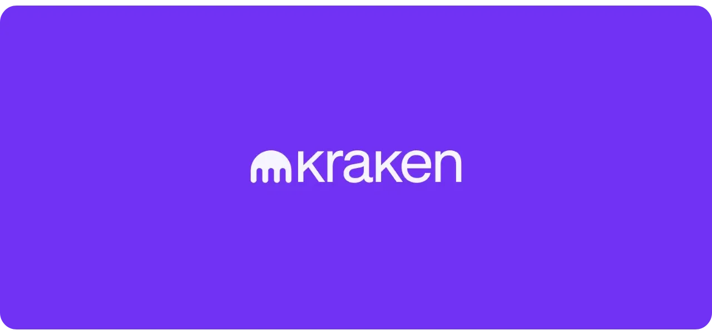

Kraken on yksi maailman tunnetuimmista kryptovaluuttojen vaihtoalustoista. Se tarjoaa lukuisia palveluja, jotka on räätälöity yrityksille, jotka haluavat integroida bitcoinin taloushallintoonsa.

Tässä oppaassa käsittelemme Kraken-yritystilin luomista, bitcoinien ostamista ja myymistä, transaktioiden hallintaa kirjanpitoa varten sekä eurojen ja bitcoinien tallettamista ja nostamista. Tavoitteena on antaa sinulle perustiedot, harkitsitpa sitten bitcoinin integroimista kassavirtaasi tai bitcoinin hyväksymistä maksuvälineenä.

Jos olet kiinnostunut bitcoinin integroimisesta yritykseesi, suosittelen myös tutustumaan täydelliseen teoreettiseen koulutuskurssiimme aiheesta:

https://planb.network/courses/biz101
## 1 - Kraken-yritystilin luominen

Ensimmäinen askel Krakenin käyttämisessä yrityksesi talouden hallintaan on tietenkin tilin luominen. Tässä yhteydessä emme aio luoda tiliä yksityishenkilöille, vaan yritystilin, joka ei ainoastaan takaa säännösten noudattamisen, vaan tarjoaa myös erityisesti räätälöityjä ominaisuuksia, kuten kirjanpidon viennin.

Mene viralliselle verkkosivustolle [kraken.com](https://www.kraken.com/) ja napsauta "*Sign Up*"-painiketta.

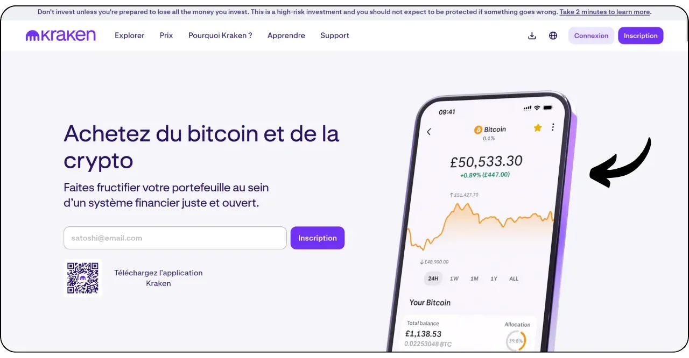

Valitse rekisteröintisivulla tilivaihtoehdoista välilehti "*Yritys*" määrittääksesi yritystilin luomisen.

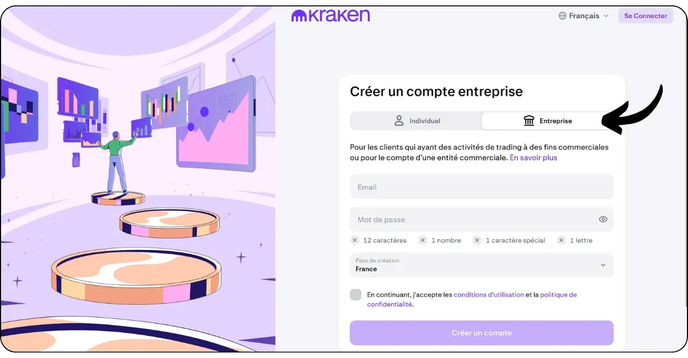

Kirjoita ammatillinen sähköpostiosoitteesi ja valitse turvallinen salasana. Kun nämä tiedot on syötetty, klikkaa "*Luo tili*" rekisteröinnin loppuun saattamiseksi.

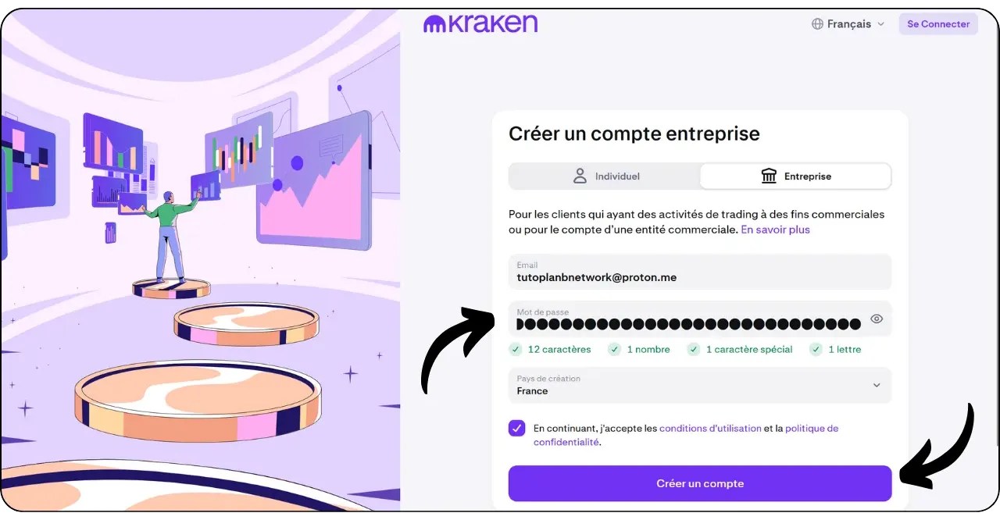

Kun olet antanut tietosi, Kraken lähettää sinulle aktivointisähköpostin.

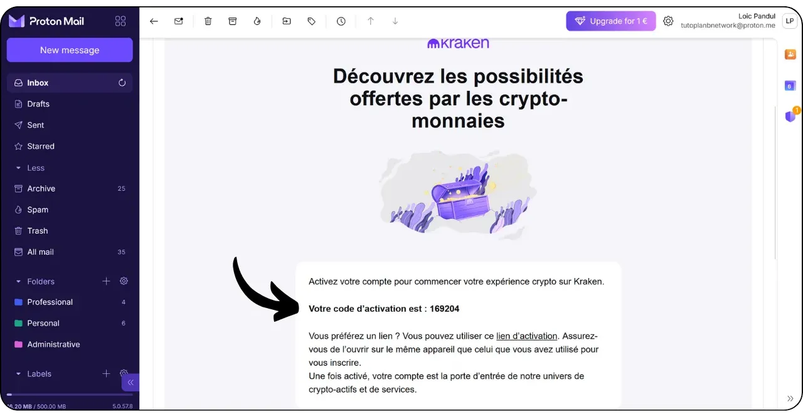

Avaa tämä sähköposti ja napsauta "*Activate Account*" tai syötä 6-numeroinen koodi, joka annetaan tilin aktivoimiseksi.

## 2 - Yritystilin vahvistaminen

Kun olet luonut tilisi, sinun on suoritettava yritystilien KYC (*Know Your Customer*) -varmistusprosessi. Tämän vaiheen avulla Kraken voi tarkistaa yrityksesi laillisuuden ja rahoitusmääräysten noudattamisen.

Napsauta painiketta "*Jatka*".

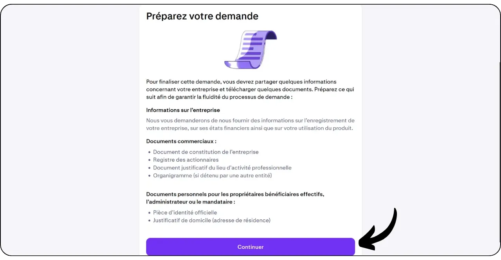

Anna tarvittavat tiedot yrityksestäsi.

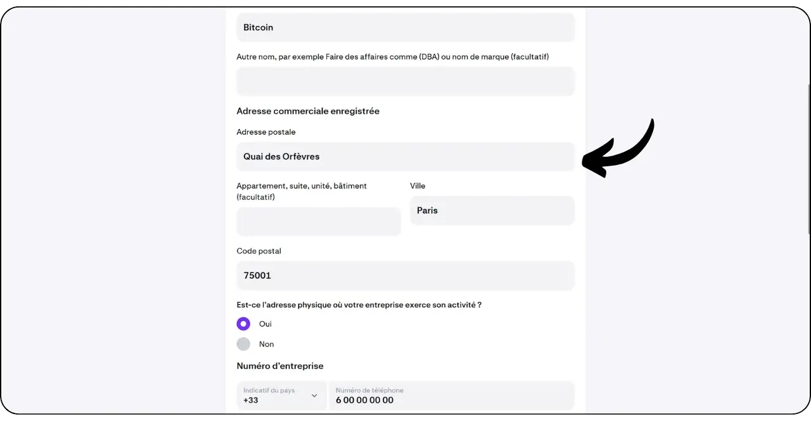

Sinun on myös ladattava useita yritystäsi koskevia asiakirjoja.

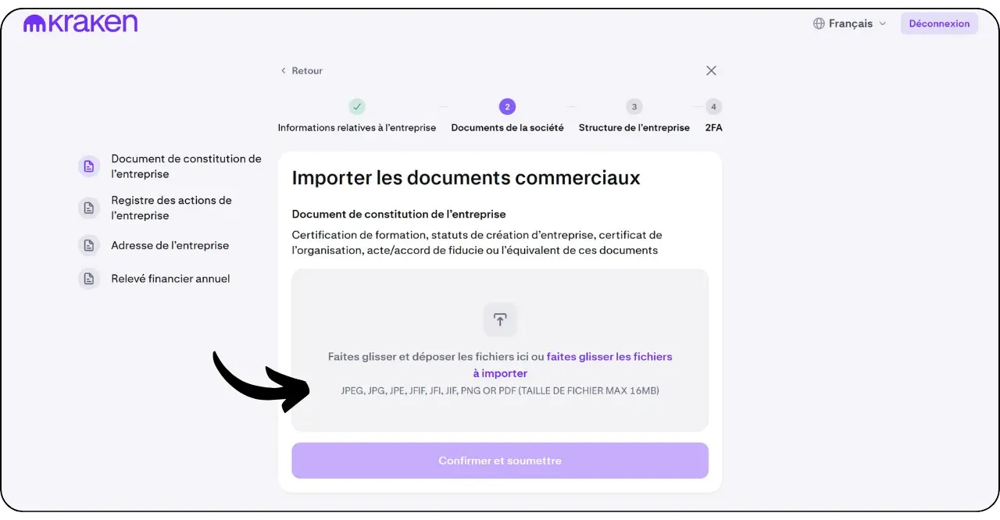

Kun olet täyttänyt kaikki osiot ja lähettänyt tarvittavat asiakirjat, lähetä vahvistuspyyntösi napsauttamalla "*Submit*". Pyyntösi käsittely voi kestää jopa kaksi viikkoa. Prosessin nopeuttamiseksi varmista, että toimitat kaikki vaaditut asiakirjat heti alussa.

## 3 - Tilin turvallisuus

Kun tilisi on vahvistettu, pääset alustalle, jossa sinulle tarjotaan kaksi käyttöliittymää:

- Kraken**: Yksinkertaistettu käyttöliittymä, joka tarjoaa keskeiset toiminnot.
- Kraken Pro**: Kehittynyt käyttöliittymä, jossa on lisäominaisuuksia erityisesti kaupankäyntiä varten.

Jos tavoitteenasi on ainoastaan ostaa ja myydä bitcoineja, valitse yksinkertaistettu käyttöliittymä. Sinulla on aina mahdollisuus siirtyä kehittyneeseen käyttöliittymään myöhemmin, jos se on tarpeen.

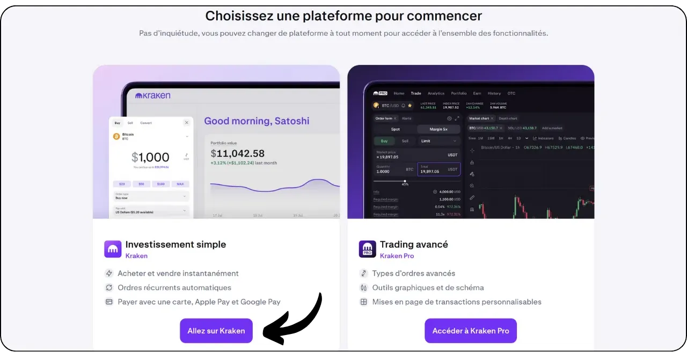

Ensinnäkin on erittäin tärkeää suojata tilisi luvattoman käytön estämiseksi. Rekisteröinnin yhteydessä määritetyn vahvan salasanan lisäksi otamme käyttöön kaksinkertaisen todennuksen. Tämä tarkoittaa sitä, että joka kerta kun kirjaudut Kraken-tilillesi, tarvitset salasanasi lisäksi toisen todentamistekijän, joka voi olla fyysinen avain tai todentamissovelluksen luoma koodi.

Siirry tilisi kuvakkeeseen ja napsauta "*Turvallisuus*".

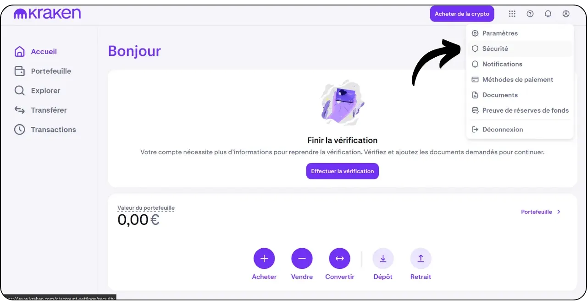

2FA-vaihtoehdoissa voit valita toisena tekijänä fyysisen suojausavaimen käytön.

Lisätietoja tämäntyyppisen laitteen käytöstä on erillisessä oppaassamme :

https://planb.network/tutorials/others/general/security-key-61438267-74db-4f1a-87e4-97c8e673533e
Toinen vaihtoehto on käyttää todennussovellusta, kuten Google Authenticator tai Authy. Nämä sovellukset luovat dynaamisen 6-numeroisen koodin, joka sinun on syötettävä joka kerta, kun kirjaudut sisään.

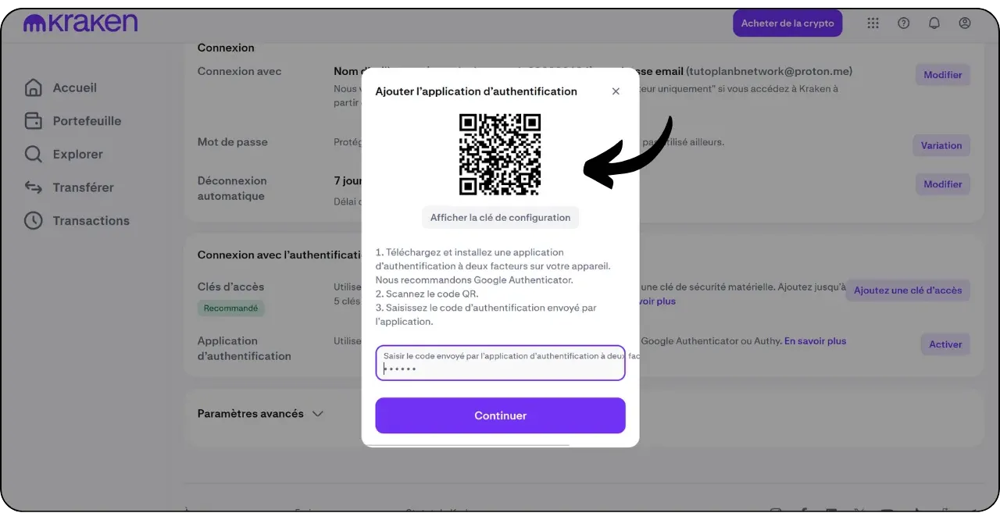

Tämän menetelmän aktivoimiseksi skannaa QR-koodi valitsemallasi sovelluksella älypuhelimellasi ja syötä sitten luotu 6-numeroinen koodi.

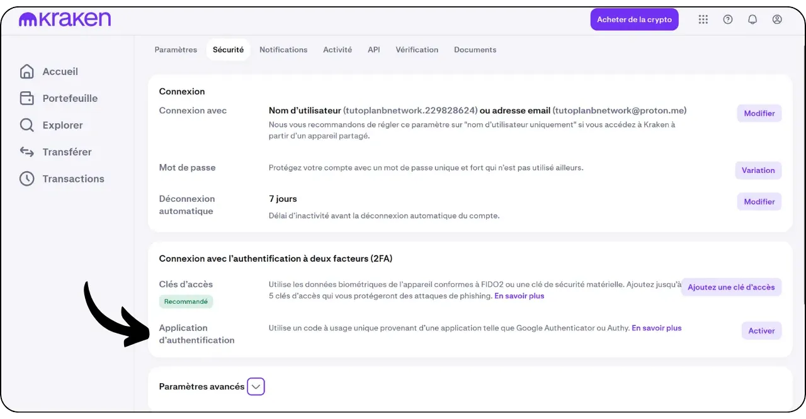

Jos haluat lisätietoja todennussovelluksista, voit tutustua myös tähän opetusohjelmaan :

https://planb.network/tutorials/others/general/authy-a76ab26b-71b0-473c-aa7c-c49153705eb7
Sen alapuolella on myös pääsy lisäasetuksiin, kuten mahdollisuus asettaa useita eri 2FA-toimintoja. Kraken tarjoaa edistynyttä turvallisuuden delegointia 2FA:n avulla. Tämän ominaisuuden avulla voit luoda erilaisia 2FA-tasoja eri toiminnoille, kuten kirjautumiselle, tilauksen vahvistamiselle ja varojen nostamiselle. Tämä mahdollistaa esimerkiksi sen, että kirjanpitäjälle voidaan antaa pääsy tiettyihin toimintoihin ilman, että hän voi nostaa varoja. Tässä ovat vaihtoehdot:

- **Master-avain** toimii palautusmekanismina, jota käytetään, jos et voi käyttää tavanomaista 2FA-menetelmää kirjautumiseen;
- **2FA for financing** edellyttää lisätodennusta kaikissa nostotapahtumissa tai talletusosoitetta luotaessa, mikä vahvistaa varojesi turvallisuutta;
- **2FA kaupankäyntiä varten** edellyttää 2FA:ta jokaiselle tilillä suoritettavalle tapahtumalle.

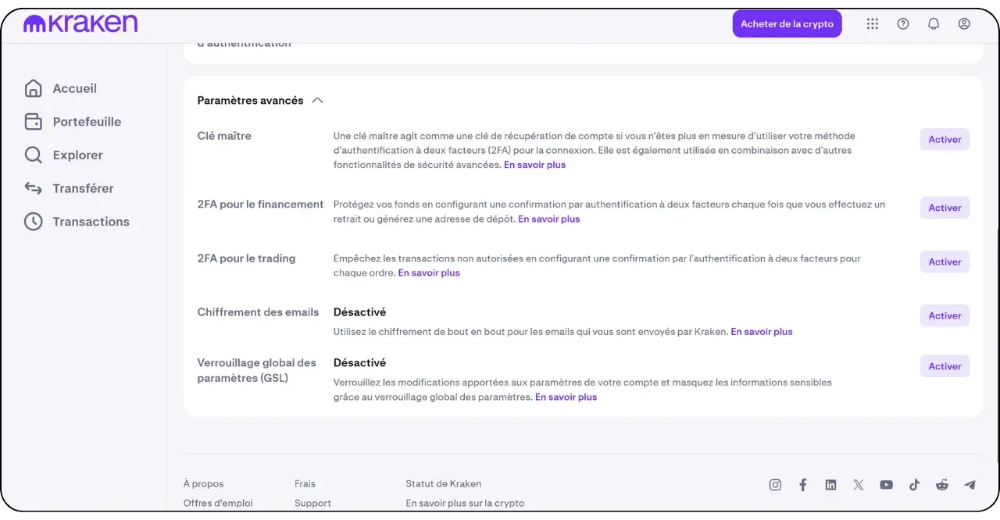

Näiden lisäasetusten avulla voit määrittää organisaatiossasi eri valtuutustasoja.

## 4 - Fiat-valuutan tallettaminen ja nostaminen

Kun tilisi on vahvistettu ja turvattu, voit tallettaa varoja euroina (tai paikallisessa valuutassasi). Voit myös tehdä nostoja yrityksesi tarpeiden mukaan.

Jos haluat tallettaa euroja, siirry "*Transfer*"-osioon.

Valitse "*Euro*" kohdassa "*Asio*" ja vahvista, jotta saat tiedot, joita tarvitaan maksun suorittamiseen yrityksen pankkitililtäsi. Voit myös maksaa luottokortilla.

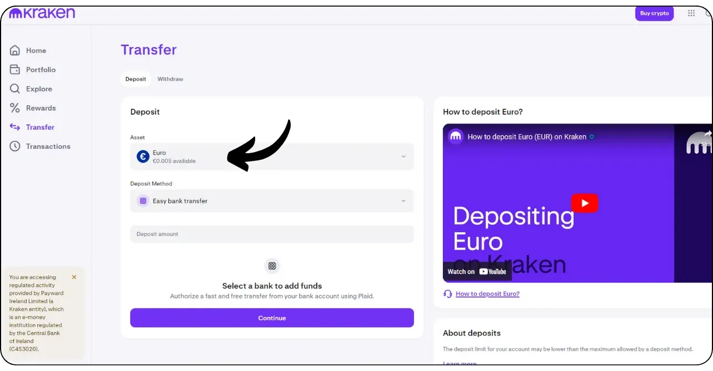

Jos haluat nostaa euroja Kraken-tililtäsi, noudata samaa prosessia, mutta käytä "*Nosto*"-välilehteä.

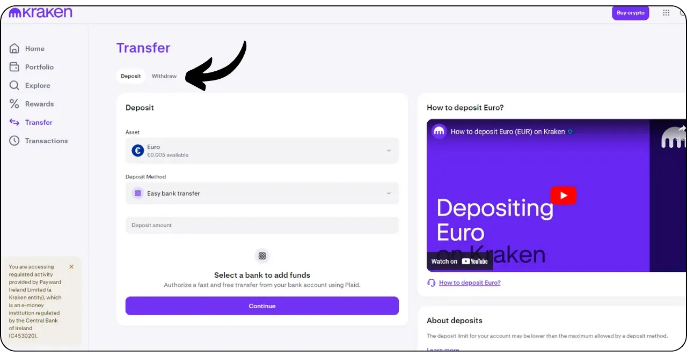

## 5 - Bitcoinien tallettaminen ja nostaminen

Jos haluat tallettaa bitcoineja Kraken-tilillesi, siirry takaisin "*Transfer*"-osioon. Valitse "*Asset*"-kentässä "*BTC*" ja vahvista sitten saadaksesi osoite, johon sinun on lähetettävä bitcoinit omasta lompakostasi.

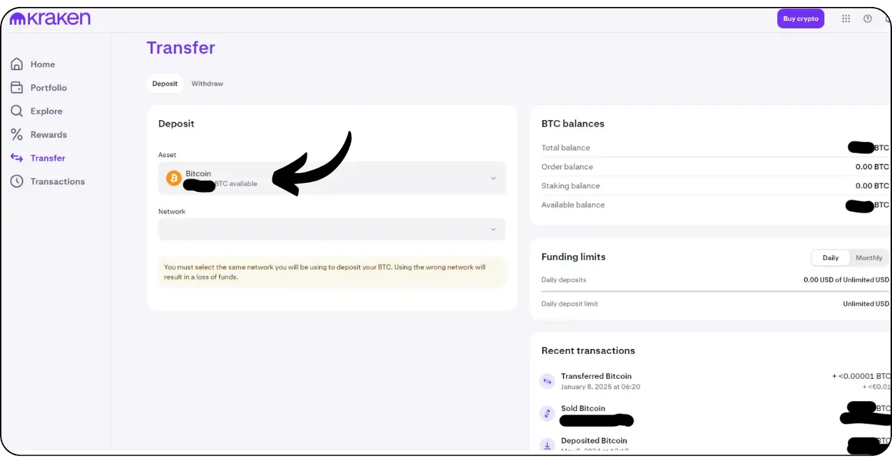

Jos haluat nostaa bitcoineja Kraken-tililtäsi omaan lompakkoon, napsauta välilehteä "*Nosto*".

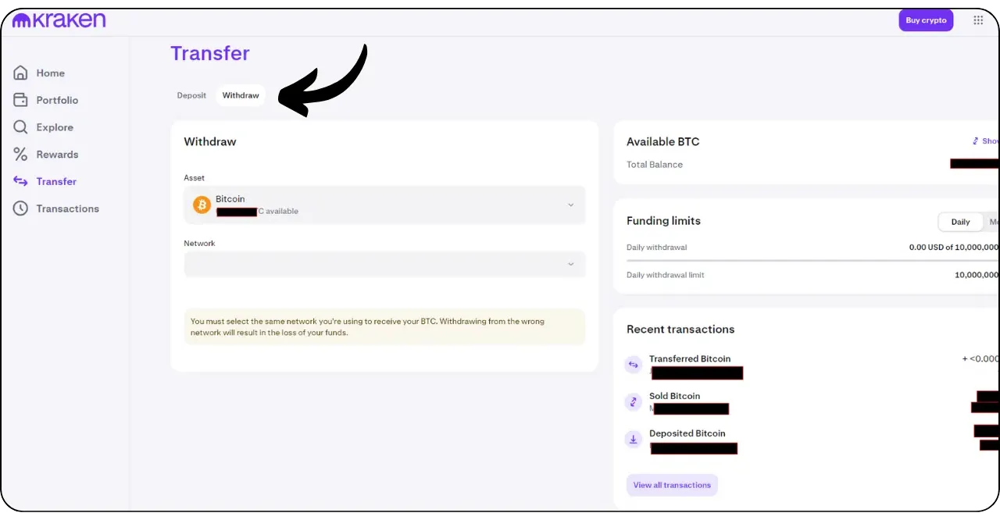

Syötä lompakon osoite ja vahvista toimenpide 2FA:lla.

## 6 - Bitcoinien ostaminen ja myyminen

Kraken tarjoaa erilaisia kaupankäyntirajapintoja, jotka on suunniteltu vastaamaan erityistarpeita. Ammattimaiseen, edistyneeseen hallintaan suositellaan Kraken Pro -järjestelmää. Yksinkertaisempiin transaktioihin riittää Krakenin oletusliittymä. Voit vaihtaa käyttöliittymää napsauttamalla näytön oikeassa yläkulmassa olevia pieniä pisteitä:

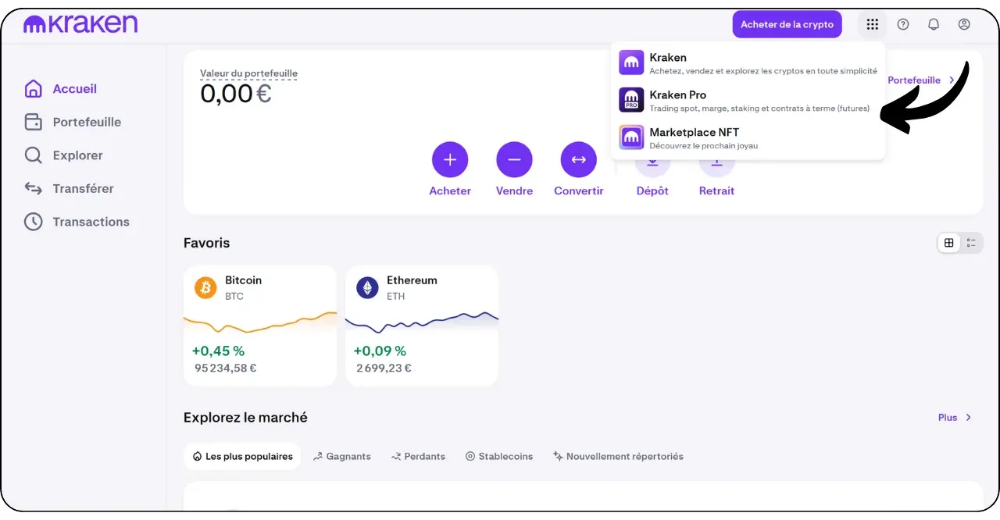

Jos haluat ostaa bitcoineja oletusliittymässä, aloita napsauttamalla etusivun "*Osta*" -painiketta.

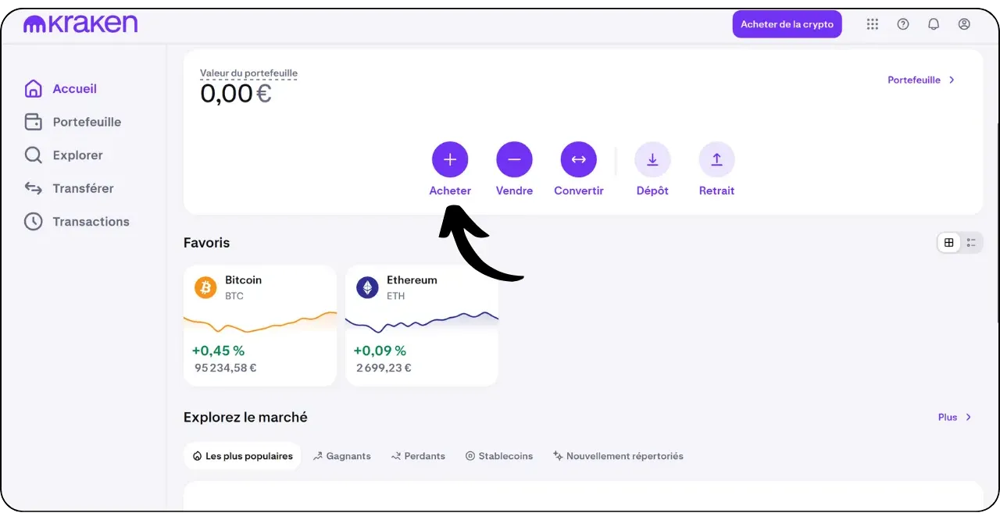

Syötä haluamasi summa ja vahvista toiminto. Jos 2FA on määritetty tätä toimintoa varten, syötä todennussovelluksen antama 6-numeroinen koodi.

Jos haluat myydä bitcoineja, napsauta "*Myydä*".

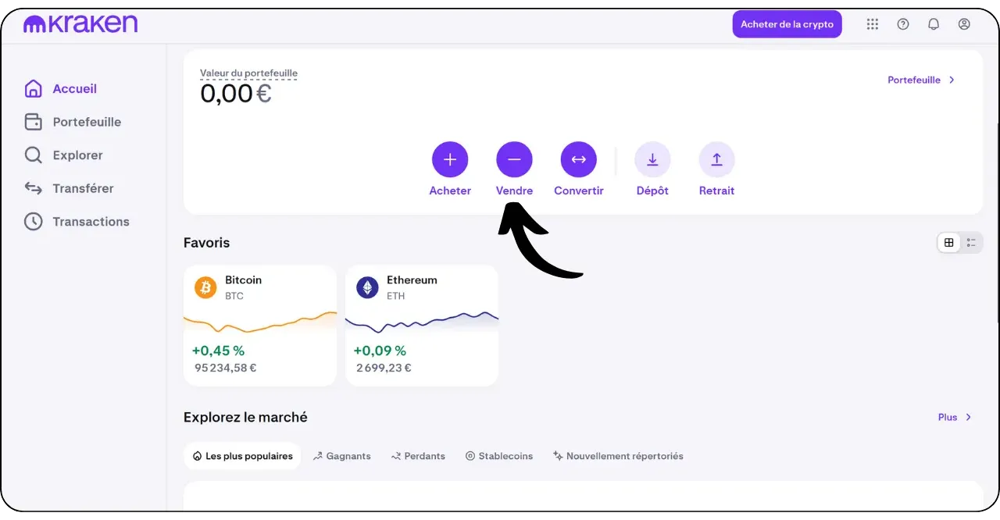

Syötä myytävä määrä ja vahvista tapahtuma.

Voit myös vaihtaa bitcoinisi muihin kryptovaluuttoihin, kuten stablecoineihin, ja vähentää näin altistumistasi bitcoinin vaihteluille. Voit tehdä niin napsauttamalla "*Muunna*".

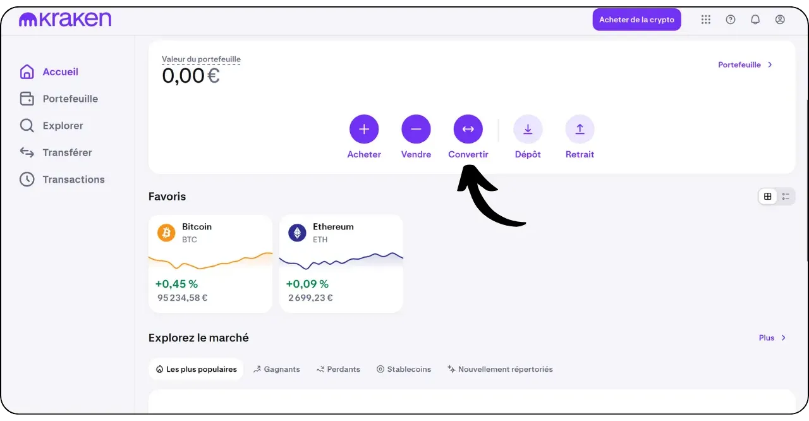

Valitse summa, valitse haluamasi kryptovaluutta ja vahvista tapahtuma.

Näissä tapahtumissa voit valita eri tilaustyyppien välillä: *Markkinat*, *Limit* tai *Stop-Loss* :

- Markkinat* : Mahdollistaa välittömän oston nykyiseen markkinahintaan;
- Raja*: Toimeksianto toteutetaan vain, jos markkinahinta saavuttaa tämän summan;
- Stop-Loss* : Myy automaattisesti, kun hinta saavuttaa tietyn kynnysarvon.

## 7 - Tapahtumien hallinta ja kirjanpito

Yrityksenä sinun on todennäköisesti vietävä Kraken-tapahtumien tiedot kirjanpitoa varten. Kraken tarjoaa työkaluja, jotka helpottavat tapahtumahistorian vientiä, ja tarjoaa yksityiskohtaisen näkymän salkustasi.

Yksinkertaistetun näkymän tapahtumahistoriastasi saat menemällä "*Tapahtumat*"-valikkoon.

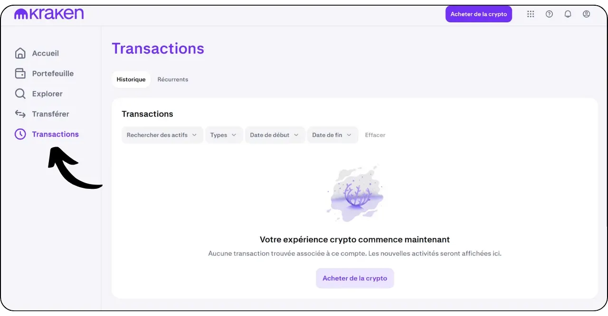

Jos haluat yksityiskohtaisempaa vientiä kirjanpitoa varten, siirry asetuksiin "*Dokumentit*"-välilehdellä.

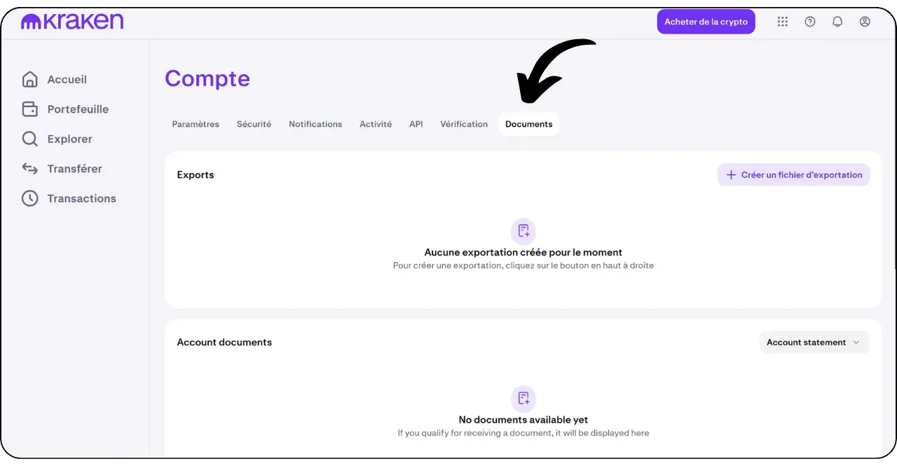

Napsauta "*Luo vientitiedosto*" ja valitse haluamasi vientityyppi. Tässä esimerkissä aion viedä tapahtumahistorian.

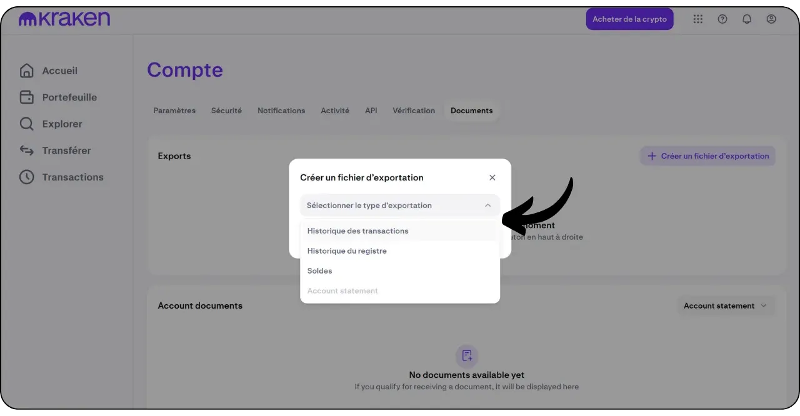

Sen jälkeen voit määrittää kaikki tilanteesi kannalta tarpeelliset yksityiskohdat:

- Vientiin sisällytettävät tiedot ;
- Huomioitavat päivämäärät ;
- Vaihtopareihin kuuluvat;
- Tiedoston vientimuoto (PDF tai CSV).

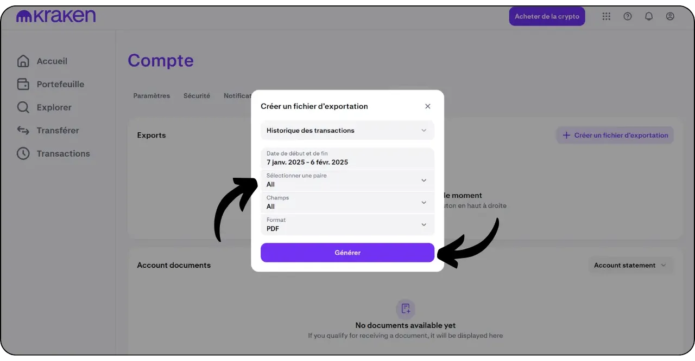

## 8 - Yrityksen käyttötapaukset

Krakenin käyttö voi vaihdella yrityksesi tavoitteista ja rakenteesta riippuen.

### Bitcoinien ostaminen käteisellä

**Tavoite:** Monipuolistaa yrityksen kassavirtaa sijoittamalla bitcoiniin.

**Seuraavat vaiheet:**

- Talleta euroja Krakeniin yrityksen pankkitililtä;
- Käytä näitä euroja bitcoinin ostamiseen;
- Pidä bitcoineja alustalla tai vedä ne pois turvataksesi ne omassa säilytyksessä;
- Vie tapahtumahistoriat tarpeen mukaan.

### Bitcoinin hyväksyminen maksuvälineeksi

**Tavoite:** Tarjoa yrityksellesi mahdollisuus hyväksyä bitcoinia maksuvälineenä tuotteillesi tai palveluillesi.

**Seuraavat vaiheet:**

- Integroi bitcoin-maksujärjestelmä. Pienille yrityksille voi riittää yksinkertainen lompakko-ohjelmisto, tai voit valita erikoistuneita ratkaisuja, kuten Swiss Bitcoin Pay tai BTCPay Server, jotta voit integroida bitcoinin maksuvaihtoehtona verkkosivustollesi tai myyntipisteeseen;
- Siirrä bitcoineina vastaanotetut maksut Kraken-tilillesi;
- Rahoitusstrategiastasi riippuen voit myydä saamasi bitcoinit euroiksi, säilyttää ne mahdollista tulevaa arvonnousua varten tai valita molempien yhdistelmän;
- Pidä bitcoineja alustalla tai nosta ne itsesäilytystä varten. Voit myös nostaa euroja pankkitilillesi;
- Vie tapahtumahistoriat tarpeen mukaan.

Jos haluat syvällisemmin tarkastella tätä aihetta, Suosittelen tätä kattavaa koulutusta integrointiin Bitcoin yrityksiin, joka kattaa yksityiskohtaisesti lisäämällä kassavirran, hyväksymällä Bitcoin maksut, ja kirjanpito :

https://planb.network/courses/biz101