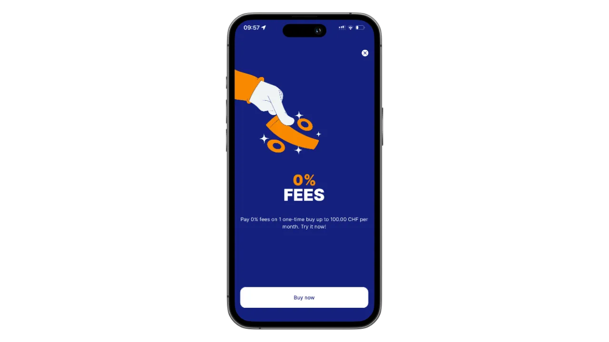

## Einführung in Relai

Relai ist eine einfache und intuitive mobile Anwendung, die Privatpersonen und Unternehmen hilft, mühelos in Bitcoin zu investieren. Egal, ob Sie Bitcoin-Neuling oder erfahrener Investor sind, die benutzerfreundliche Oberfläche und die optimierten Funktionen von Relai machen es einfach, einen Bitcoin-Sparplan zu starten und zu pflegen. Im Gegensatz zu traditionellen Plattformen erfordert Relai kein tiefes Verständnis von Bitcoin oder komplexen Finanzsystemen - laden Sie einfach die App herunter und beginnen Sie zu sparen.

Relai zeichnet sich durch seine Einfachheit, Zugänglichkeit und den Fokus auf langfristiges Bitcoin-Sparen aus. Egal, ob Sie einen wiederkehrenden Sparplan einrichten oder einmalige Käufe tätigen möchten, Relai hat alles für Sie. Lassen Sie uns herausfinden, wie Sie mit diesem fantastischen Tool loslegen können.

---
## Erste Schritte mit Relai

### Schritt 1: Laden Sie die Relai-App herunter

- Wo man sie findet:** Die App ist sowohl im App Store (iOS) als auch im Google Play Store (Android) erhältlich. Suchen Sie nach "Relai" und laden Sie sie kostenlos herunter.
- Schnelleinrichtung:** Nach der Installation öffnen Sie die App und folgen Sie der Anleitung zur Einrichtung.

### Schritt 2: Erstellen Sie Ihr Konto

- Obligatorisches KYC:** Relai verlangt jetzt eine KYC-Verifizierung (Know Your Customer). Bereiten Sie ein gültiges Ausweisdokument und einen Adressnachweis vor.
- Überprüfungsprozess:** Laden Sie Ihre Dokumente hoch, machen Sie ein Selfie zur Identitätsbestätigung und warten Sie auf die Genehmigung (in der Regel innerhalb von 24 Stunden).
- Warum KYC?:** Es gewährleistet die Einhaltung von Finanzvorschriften und erhöht die Sicherheit für alle Benutzer.

### Schritt 3: Sichern Sie Ihr Portemonnaie

- Self-Custody:** Relai bietet eine nicht-verwahrende Wallet, d.h. Sie kontrollieren Ihre privaten Schlüssel.
- Sichern Sie Ihre Schlüssel:** Schreiben Sie Ihre 12-Wörter-Wiederherstellungsphrase auf Papier (nicht digital) und bewahren Sie sie sicher auf. Dies ist entscheidend für den Zugriff auf Ihr Guthaben, wenn Ihr Telefon verloren geht oder gestohlen wird.

---
## Wie man einen Bitcoin-Sparplan erstellt

Mit dem Bitcoin-Sparplan von Relai können Sie regelmäßige Investitionen automatisieren und so im Laufe der Zeit leichter Vermögen aufbauen. Hier erfahren Sie, wie Sie ihn einrichten können:

### Schritt 1: Definieren Sie Ihre Ziele

- Entscheiden Sie, wie viel Bitcoin Sie in welchem Zeitraum anhäufen möchten.
- Fangen Sie klein an, wenn Sie neu bei Bitcoin sind; Sie können Ihre Beiträge später immer noch erhöhen.

### Schritt 2: Einrichten einer wiederkehrenden Investition

- Rufen Sie in der App den Bereich "Sparplan" auf.
- Wählen Sie die gewünschte Investitionshäufigkeit (z. B. wöchentlich, zweiwöchentlich, monatlich).
- Geben Sie den Betrag an, den Sie investieren möchten. Relai akzeptiert Zahlungen bereits ab 10 €.

### Schritt 3: Verknüpfen Sie Ihre Zahlungsmethode

- Verwenden Sie Ihr bevorzugtes Bankkonto oder Ihre Kreditkarte, um wiederkehrende Zahlungen einzurichten.
- Vergewissern Sie sich, dass Ihre Bank SEPA-Überweisungen unterstützt, damit die Transaktionen reibungslos ablaufen.

### Schritt 4: Überwachen Sie Ihre Fortschritte

- Überprüfen Sie Ihr Portfolio regelmäßig in der App, um zu sehen, wie sich Ihre Investitionen entwickeln.
- Sie können Ihren Plan jederzeit an Ihre finanziellen Ziele anpassen.

---
## Bitcoin kaufen auf Relai

Der Kauf von Bitcoin auf Relai ist einfach und schnell. So geht's:

### Schritt 1: Öffnen Sie die App

Navigieren Sie auf dem Startbildschirm zum Abschnitt "Bitcoin kaufen".

### Schritt 2: Eingabe des Kaufbetrags

Geben Sie den Betrag in Fiat-Währung (EUR, CHF usw.) an, den Sie investieren möchten.

Relai zeigt Ihnen den entsprechenden Bitcoin-Betrag auf der Grundlage des aktuellen Marktpreises an.

### Schritt 3: Schließen Sie Ihren Kauf ab

- Bestätigen Sie die Transaktionsdetails.
- Verwenden Sie Ihr verknüpftes Bankkonto oder Ihre Karte, um die Zahlung abzuschließen.
- Die Transaktionen werden schnell abgewickelt und der Bitcoin wird in Ihrer Relai-Brieftasche hinterlegt.

**Keine Gebühren:** Für Käufe bis zu 100 € oder 100 CHF erhebt Relai keine Gebühren, was es zu einer idealen Wahl für Anfänger macht.

---
## Bitcoin abheben

Wenn Sie Ihre Bitcoin zu einer anderen Wallet oder Börse transferieren möchten, folgen Sie diesen Schritten:

### Schritt 1: Öffnen Sie den Abschnitt "Zurückziehen"

Navigieren Sie in der App zur Registerkarte "Abhebung".

### Schritt 2: Eingabe der Ziel-Wallet-Adresse

- Kopieren Sie die Adresse der Brieftasche des Empfängers und fügen Sie sie ein oder scannen Sie einen QR-Code.
- Überprüfen Sie die Adresse, um Fehler zu vermeiden - Bitcoin-Transaktionen sind nicht umkehrbar.

### Schritt 3: Angabe des Betrags

Geben Sie den Betrag an Bitcoin ein, den Sie senden möchten.

Relai zeigt die geltenden Netzgebühren an.

### Schritt 4: Bestätigen Sie die Transaktion

- Prüfen Sie die Angaben sorgfältig und bestätigen Sie sie.
- Ihre Bitcoin werden an die angegebene Wallet gesendet.

---
## Tipps für eine sichere Bitcoin-Verwaltung

- Bewahren Sie Ihre Wiederherstellungsphrase sicher auf:** Speichern Sie sie offline und geben Sie sie nicht an Dritte weiter.
- Aktivieren Sie die App-Sicherheit:** Verwenden Sie eine starke PIN oder biometrische Authentifizierung.
- Diversifizierung der Speicherung:** Erwägen Sie die Verwendung einer Hardware-Wallet für große Bitcoin-Mengen.
- Regelmäßige Updates der App:** Bleiben Sie mit den neuesten Sicherheitspatches und Funktionen geschützt.
- Vermeiden Sie öffentliches Wi-Fi:** Greifen Sie nur in sicheren Netzwerken auf Ihr Portemonnaie zu.

---
## Relai Geschäftskonten

Relai unterstützt auch Unternehmen, die in Bitcoin investieren möchten. Die Funktionen umfassen:

- Maßgeschneiderte Sparpläne:** Maßgeschneiderte Pläne für die Bedürfnisse des Unternehmens.
- Multi-User-Zugang:** Ermöglichen Sie mehreren Teammitgliedern die sichere Verwaltung des Kontos.
- Erhöhte Limits:** Legen Sie im Vergleich zu persönlichen Konten höhere Beträge an.
- Dedizierter Support:** Zugang zum vorrangigen Kundendienst für Unternehmen.

Um ein Geschäftskonto einzurichten, wenden Sie sich bitte an das Support-Team von Relai auf der Website.

---
## Einladen und Bitcoin verdienen

Relai bietet ein spannendes Empfehlungsprogramm, bei dem Sie Bitcoin verdienen können, indem Sie Ihre Freunde zur Nutzung der App einladen. So funktioniert es:

- Teilen Sie Ihren Empfehlungscode:** Jeder Relai-Benutzer erhält einen einzigartigen Empfehlungscode. Teilen Sie ihn mit Ihren Freunden.
- Verdienen Sie 10 % der Gebühren:** Sie erhalten 10 % der Gebühren von den Transaktionen Ihrer Freunde, wenn diese Ihren Code verwenden.
- Passives Bitcoin-Einkommen:** Wenn Ihre Freunde weiterhin auf Relai handeln, verdienen Sie weiterhin Bitcoin. Es ist ein Gewinn für beide, für Sie und Ihre Freunde.

Beginnen Sie noch heute damit, Ihren Code zu teilen und Ihren Bitcoin-Stack mühelos zu erweitern!

---
## Häufig gestellte Fragen

### Wie viel verlangt Relai?

- Relai erhebt eine wettbewerbsfähige Gebühr von 1 % pro Transaktion oder 0,9 %, wenn Sie einen Empfehlungscode wie `REL361712` verwenden. Die Gebühren werden transparent angezeigt, bevor Sie einen Kauf bestätigen.
- Keine Gebühren:** Transaktionen bis zu 100 € oder 100 CHF sind völlig gebührenfrei.

### Kann ich meinen Sparplan aussetzen?

Ja, Sie können Ihren Plan jederzeit über die App unterbrechen oder ändern.

### Was passiert, wenn ich mein Telefon verliere?

Verwenden Sie Ihre 12-Wörter-Wiederherstellungsphrase, um Ihre Brieftasche auf einem anderen Gerät wiederherzustellen.

### Ist Relai sicher?

Ja, Relai ist eine sichere, nicht-verwahrende Plattform, die den Nutzern die volle Kontrolle über ihr Geld gibt.

---
## Schlussfolgerung

Relai ist ein leistungsstarkes und dennoch einfaches Tool für alle, die ihre Bitcoin-Reise beginnen möchten. Von der Erstellung automatischer Sparpläne bis hin zur nahtlosen Abhebung Ihrer Gelder - die App macht Bitcoin-Investitionen zugänglich und stressfrei. Warum also warten?

Laden Sie Relai noch heute herunter und beginnen Sie mit dem Aufbau Ihrer finanziellen Zukunft in Bitcoin! 🚀

