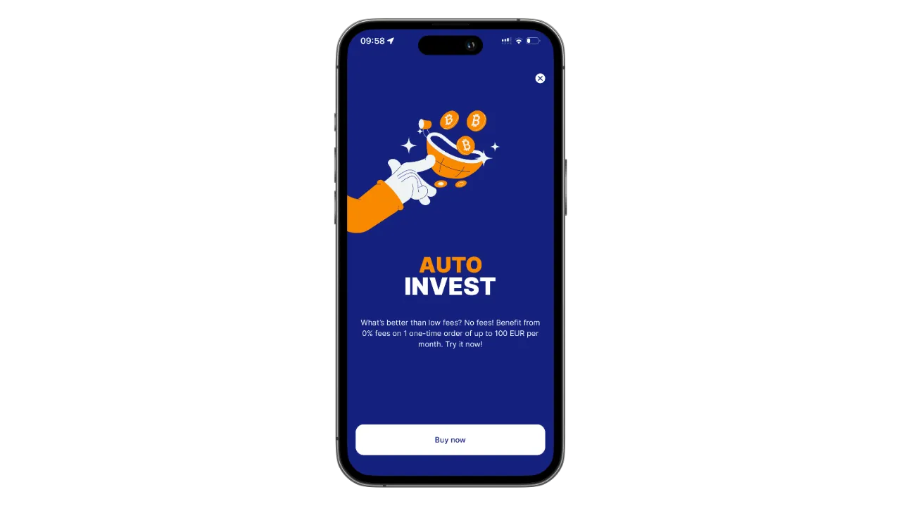
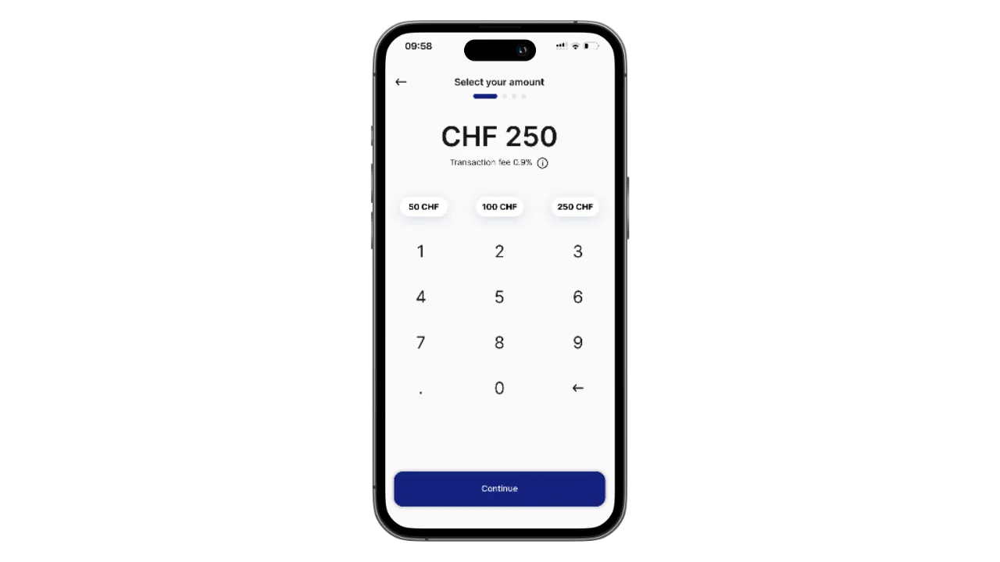
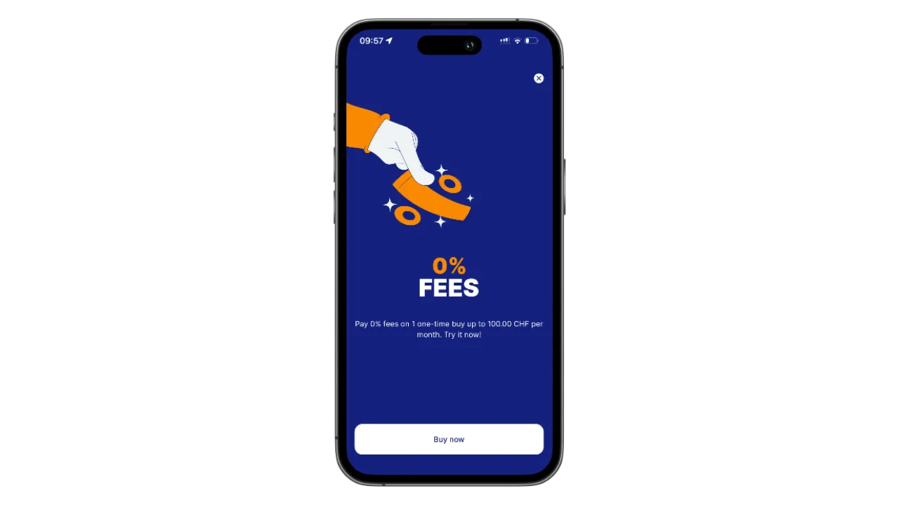

## Введение в релаи

Relai - это простое и интуитивно понятное мобильное приложение, призванное помочь частным лицам и компаниям инвестировать в биткоин без особых усилий. Независимо от того, новичок ли вы в биткойнах или опытный инвестор, удобный интерфейс Relai и оптимизированные функции позволяют легко начать и поддерживать план накопления биткойнов. В отличие от традиционных платформ, Relai не требует глубокого понимания биткоина или сложных финансовых систем - просто загрузите приложение и начинайте делать сбережения.

Relai отличается простотой, доступностью и нацеленностью на долгосрочное накопление биткоинов. Хотите ли вы создать повторяющийся план накопления или совершать разовые покупки, Relai поможет вам. Давайте узнаем, как начать работу с этим фантастическим инструментом.

---
## Начало работы с Relai

### Шаг 1: Загрузите приложение Relai

- Где найти:** Приложение доступно как в App Store (iOS), так и в Google Play Store (Android). Наберите в поисковике "Relai" и скачайте его бесплатно.
- Быстрая настройка:** После установки откройте приложение и следуйте инструкциям по настройке.

### Шаг 2: Создайте свою учетную запись

- Обязательный KYC:** Relai теперь требует проверки на знание своего клиента (KYC). Подготовьте действительный документ, удостоверяющий личность, и подтверждение адреса.
- Процесс верификации:** Загрузите документы, сделайте selfie для подтверждения личности и ожидайте одобрения (обычно в течение 24 часов).
- Зачем нужен KYC?:** Он обеспечивает соблюдение финансовых правил и повышает безопасность всех пользователей.

### Шаг 3: Защитите свой кошелек

- Самостоятельное хранение:** Relai предлагает кошелек без хранения, то есть вы сами контролируете свои приватные ключи.
- Резервное копирование ключей:** Запишите свою фразу восстановления из 12 слов на бумаге (не в цифровом виде) и надежно храните ее. Это очень важно для доступа к средствам в случае потери или кражи телефона.

---
## Как создать план накопления биткоинов

Биткойн-сберегательный план Relai позволяет автоматизировать регулярные инвестиции, что облегчает процесс накопления богатства со временем. Вот как его создать:

### Шаг 1: Определите свои цели

- Решите, сколько биткойнов вы хотите накопить и за какой период.
- Начните с малого, если вы новичок в биткойнах; позже вы всегда сможете увеличить свои взносы.

### Шаг 2: Установите периодические инвестиции

- Перейдите в раздел "План сбережений" в приложении.
- Выберите желаемую периодичность инвестирования (например, еженедельно, раз в две недели, ежемесячно).
- Укажите сумму, которую вы хотите инвестировать. Relai принимает платежи от €10.

### Шаг 3: Привяжите способ оплаты

- Используйте предпочитаемый банковский счет или кредитную карту, чтобы установить периодические платежи.
- Убедитесь, что ваш банк поддерживает переводы SEPA для более удобного проведения транзакций.

### Шаг 4: Контролируйте свой прогресс

- Регулярно проверяйте свой портфель в приложении, чтобы видеть, как растут ваши инвестиции.
- В любое время скорректируйте свой план в соответствии с вашими финансовыми целями.

---
## Покупка биткоина на Relai

Покупка биткойна на Relai - это просто и быстро. Вот как:

### Шаг 1: Откройте приложение

На главном экране перейдите в раздел "Купить биткойн".

### Шаг 2: Введите сумму покупки

Укажите сумму в фиатной валюте (EUR, CHF и т. д.), которую вы хотите инвестировать.

Relai покажет вам эквивалентную сумму в биткойнах на основе текущей рыночной цены.

### Шаг 3: Завершите покупку

- Подтвердите детали транзакции.
- Используйте привязанный банковский счет или карту для завершения платежа.
- Транзакции обрабатываются быстро, и биткойн поступает на ваш кошелек Relai.

**Нулевые комиссии:** При покупке на сумму до 100 евро или 100 швейцарских франков Relai не взимает никаких комиссий, что делает его идеальным выбором для новичков.

---
## Вывод биткойнов

Если вы хотите перевести свой биткоин на другой кошелек или биржу, выполните следующие действия:

### Шаг 1: Откройте раздел "Вывод средств"

Перейдите на вкладку вывода средств в приложении.

### Шаг 2: Введите адрес целевого кошелька

- Скопируйте и вставьте адрес кошелька получателя или отсканируйте QR-код.
- Дважды проверьте адрес, чтобы избежать ошибок - транзакции с биткоинами необратимы.

### Шаг 3: Укажите сумму

Введите сумму биткойнов, которую вы хотите отправить.

Relai отобразит применимые сетевые тарифы.

### Шаг 4: Подтвердите транзакцию

- Внимательно изучите детали и подтвердите их.
- Ваш биткойн будет отправлен на указанный кошелек.

---
## Советы по безопасному управлению биткоинами

- Храните фразу восстановления в безопасности:** Храните ее в автономном режиме и не передавайте никому.
- Включите защиту приложений:** Используйте надежный PIN-код или биометрическую аутентификацию.
- Диверсифицируйте хранение:** Рассмотрите возможность использования аппаратного кошелька для больших сумм биткоина.
- Регулярное обновление приложения:** Оставайтесь под защитой последних исправлений и функций безопасности.
- Избегайте общественного Wi-Fi:** Заходите в свой кошелек только через защищенные сети.

---
## Бизнес-счета Relai

Relai также поддерживает предприятия, желающие инвестировать в биткойн. Особенности включают:

- Индивидуальные сберегательные планы:** Индивидуальные планы, отвечающие потребностям бизнеса.
- Многопользовательский доступ:** Обеспечьте безопасное управление учетной записью для нескольких членов команды.
- Увеличенные лимиты:** Инвестируйте более крупные суммы по сравнению с личными счетами.
- Выделенная поддержка:** Получите доступ к приоритетному обслуживанию клиентов для предприятий.

Чтобы создать бизнес-аккаунт, свяжитесь со службой поддержки Relai через их веб-сайт.

---
## Приглашайте и зарабатывайте биткойны

Relai предлагает интересную реферальную программу, в рамках которой вы можете заработать биткоины, пригласив своих друзей воспользоваться приложением. Вот как это работает:

- Поделитесь своим реферальным кодом:** Каждый пользователь Relai получает уникальный реферальный код. Поделитесь им со своими друзьями.
- Зарабатывайте 10% от комиссионных:** Вы будете получать 10% от комиссионных за транзакции ваших друзей, когда они используют ваш код.
- Пассивный доход в биткойнах:** Пока ваши друзья продолжают торговать на Relai, вы продолжаете зарабатывать биткойны. Это выгодно и вам, и вашим друзьям.

Начните делиться своим кодом уже сегодня и развивайте свой стек биткойнов без особых усилий!

---
## Часто задаваемые вопросы

### Сколько берет Релай?

- Relai взимает конкурентоспособную комиссию в размере 1% за транзакцию или 0,9%, если вы используете реферальный код, например `REL361712`. Комиссия прозрачно отображается перед тем, как вы подтвердите покупку.
- Ноль комиссий:** Транзакции на сумму до 100 евро или 100 швейцарских франков не взимают никаких комиссий.

### Могу ли я приостановить свой план сбережений?

Да, вы можете приостановить или изменить свой план в любое время из приложения.

### Что произойдет, если я потеряю свой телефон?

Используйте фразу восстановления из 12 слов, чтобы восстановить кошелек на другом устройстве.

### Безопасен ли "Релай"?

Да, Relai - это безопасная, не требующая опеки платформа, которая дает пользователям полный контроль над своими средствами.

---
## Заключение

Relai - это мощный и в то же время простой инструмент для тех, кто хочет начать свой путь в биткоинах. От создания автоматизированных планов накопления до беспрепятственного вывода средств - приложение делает инвестирование в биткоин доступным и не напрягающим. Так зачем ждать?

Скачайте Relai сегодня и начните строить свое финансовое будущее в биткоинах! 🚀

