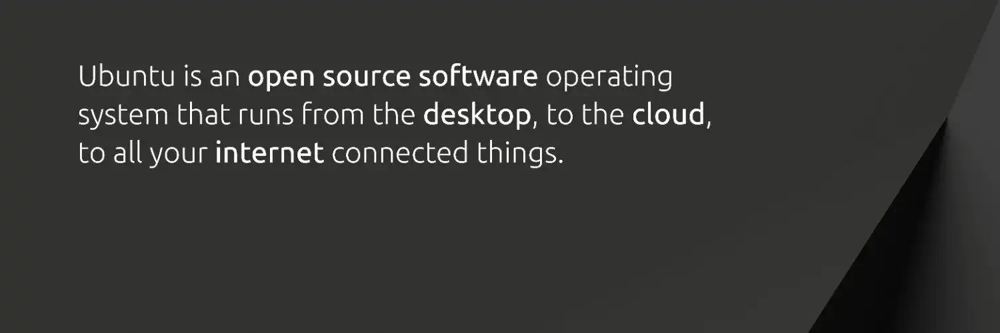

## Einführung

Ein Betriebssystem (OS) ist die wichtigste Software, die alle Ressourcen Ihres Computers verwaltet. Die Wahl eines alternativen Betriebssystems wie Ubuntu kann viele Vorteile in Bezug auf Sicherheit, Kosten und Datenschutz bieten.

### Warum Ubuntu?


- Verbesserte Sicherheit** : Linux-Distributionen sind bekannt für ihre Sicherheit und Robustheit
- Keine Kosten**: Ubuntu und die meisten Linux-Distributionen sind kostenlos
- Große Gemeinschaft**: Eine Gemeinschaft von Nutzern, die über Foren und Tutorials hilfsbereit sind
- Wahrung der Privatsphäre**: Open-Source-System für mehr Transparenz
- Einfachheit**: Benutzerfreundliche Oberfläche und einfache Bedienung
- Reichhaltiges Ökosystem** : Umfangreicher Katalog von Open-Source-Software
- Regelmäßige Unterstützung**: Sichere Updates von Canonical

## Installation und Konfiguration

### 1. Voraussetzungen

**Erforderliche Ausrüstung:**


- Ein USB-Stick mit mindestens 12 GB
- Ein Computer mit mindestens 25 GB verfügbar

### 2. Herunterladen


- Gehen Sie zu [ubuntu.com/download](https://ubuntu.com/download)
- Wählen Sie die stabile Version (LTS empfohlen)
- ISO-Abbild herunterladen

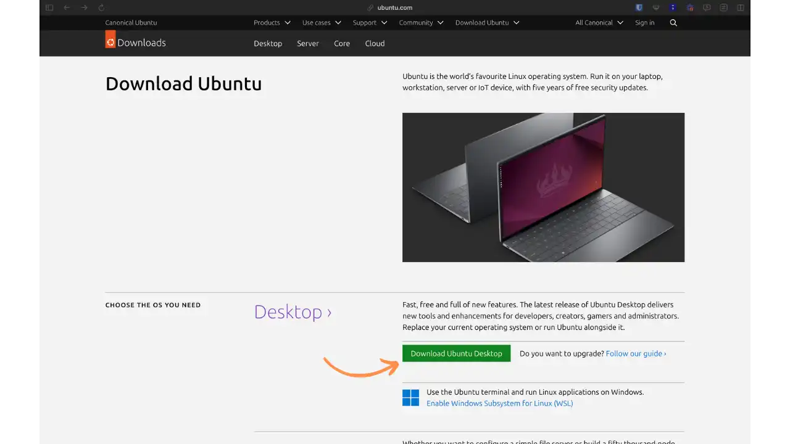

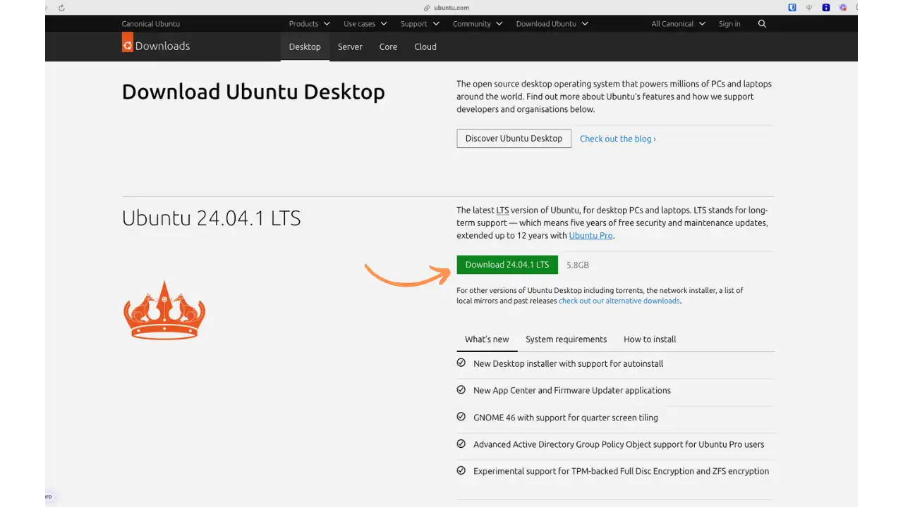

### 3. Einen bootfähigen USB-Stick erstellen

Sie können verschiedene Tools verwenden, wie z. B. Balena Etcher :


- [Balena Etcher] herunterladen und installieren (https://etcher.balena.io/)

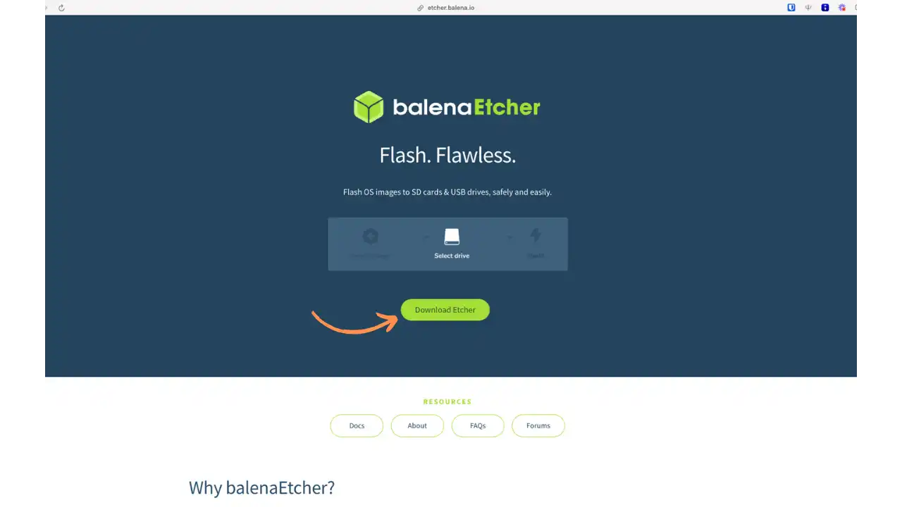

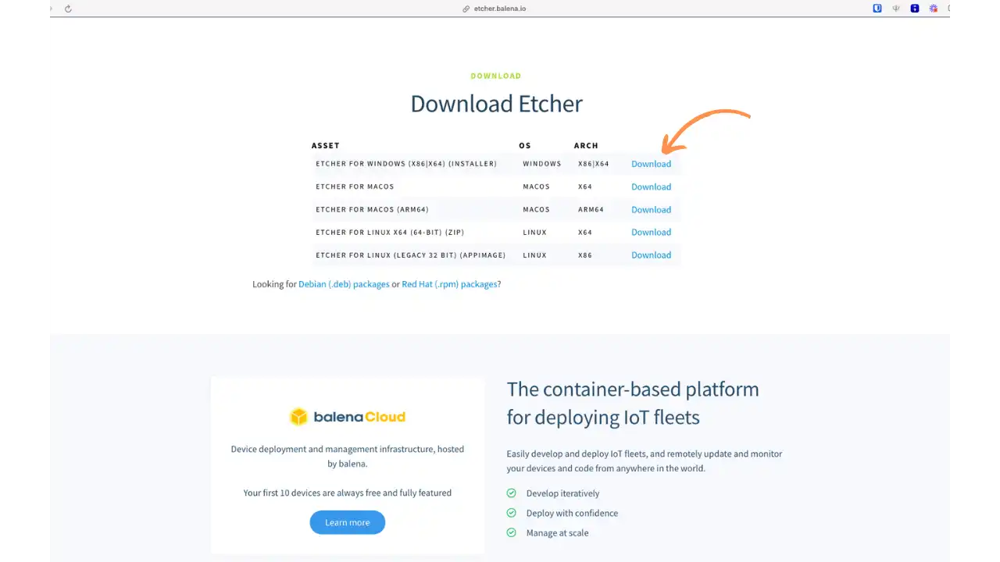


- Öffnen Sie den Balena Etcher und wählen Sie das Ubuntu-ISO-Image aus
- USB-Stick als Zielmedium auswählen
- Klicken Sie auf Flash und warten Sie, bis der Vorgang abgeschlossen ist

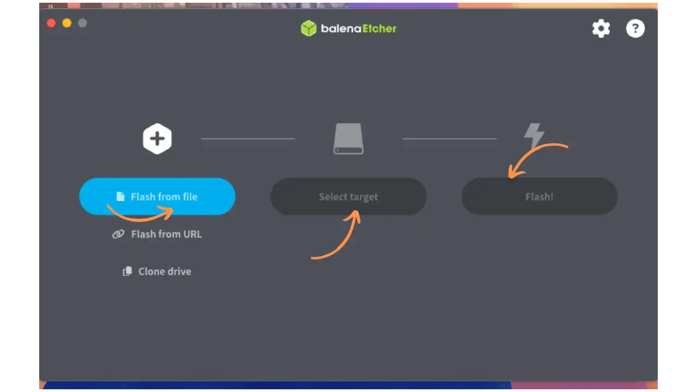

### 4. Installation und Sicherung von Ubuntu

**4.1 Booten vom USB-Speicherstick** (auf Französisch)


- Schalten Sie den Computer aus
- Schließen Sie den USB-Stick (mit Ubuntu) an
- Schalten Sie Ihren Computer ein. Bei neueren PCs sollte das System den USB-Startschlüssel automatisch erkennen. Ist dies nicht der Fall, starten Sie den Computer neu, indem Sie die BIOS/UEFI-Zugriffstaste (je nach Hersteller normalerweise F2, F12 oder Delete) gedrückt halten
 - Wählen Sie im BIOS/UEFI-Menü Ihren USB-Stick als Boot-Gerät aus
 - Speichern und neu starten

**4.2 Starten der Installation** (auf Französisch)

**Startbildschirm**

Wenn Sie vom USB-Stick booten, sehen Sie diesen Bildschirm, über den Sie Ubuntu starten können.

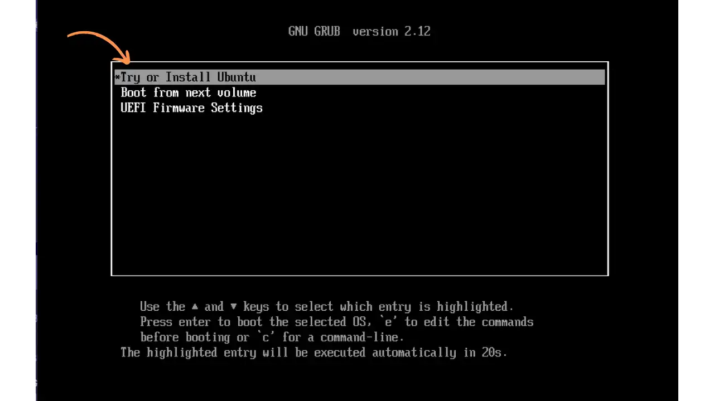

**Wahl der Sprache

Wählen Sie Ihre bevorzugte Sprache für die Installation und das System.

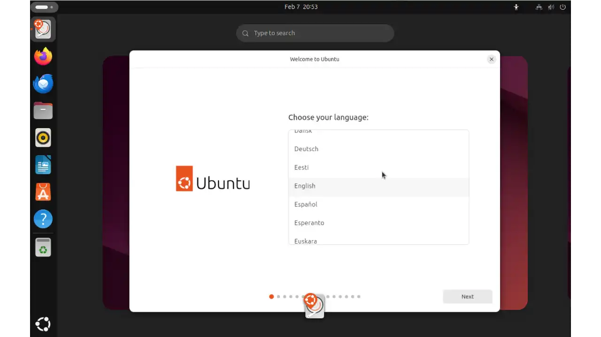

**Zugänglichkeitsoptionen

Konfigurieren Sie ggf. die Zugänglichkeitsoptionen (Screenreader, hoher Kontrast usw.).

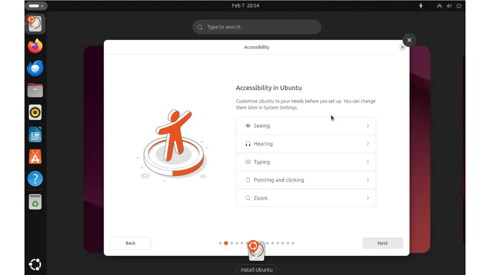

**Tastaturkonfiguration

Wählen Sie Ihr Tastaturlayout. Es gibt ein Testfeld, mit dem Sie überprüfen können, ob die Tasten mit Ihrer Konfiguration übereinstimmen.


**Netzanschluss**

Verbinden Sie sich mit Ihrem Wi-Fi- oder kabelgebundenen Netzwerk, um während der Installation Updates herunterzuladen.

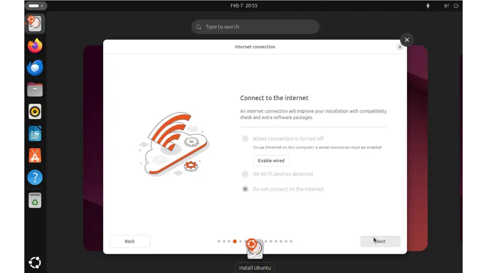

**Art der Anlage

Wählen Sie zwischen "Ubuntu ausprobieren" (um zu testen, ohne zu installieren) oder "Ubuntu installieren".

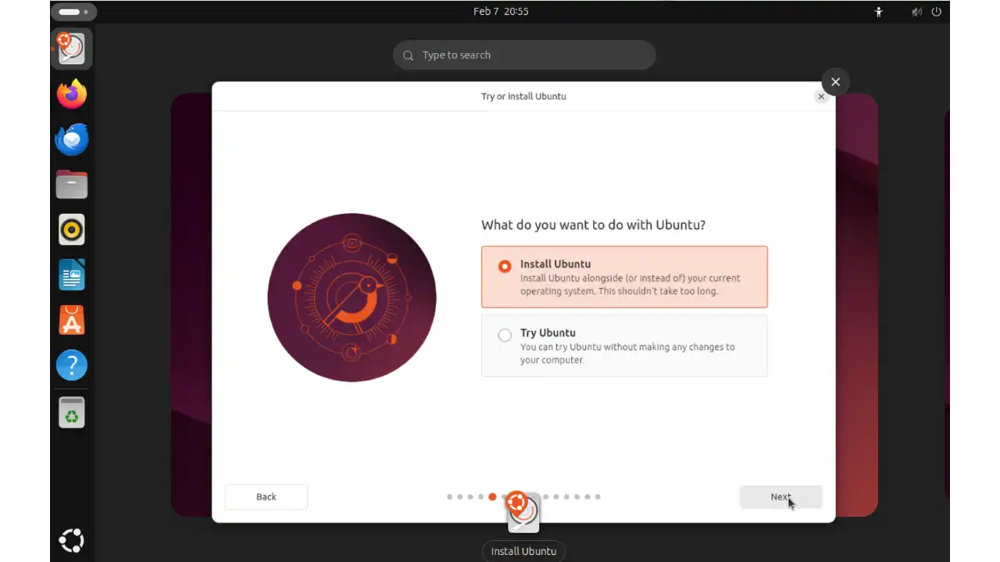

**Installationsmethode

Wählen Sie die interaktive Installation.

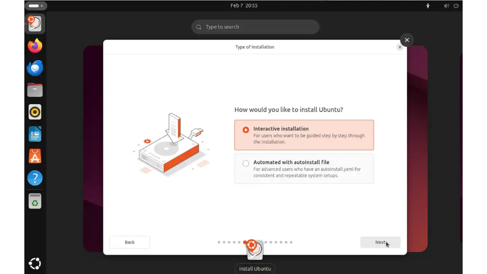

**Auswahl der Anwendungen

Wählen Sie zwischen der Standardinstallation oder einer erweiterten Auswahl an Anwendungen.

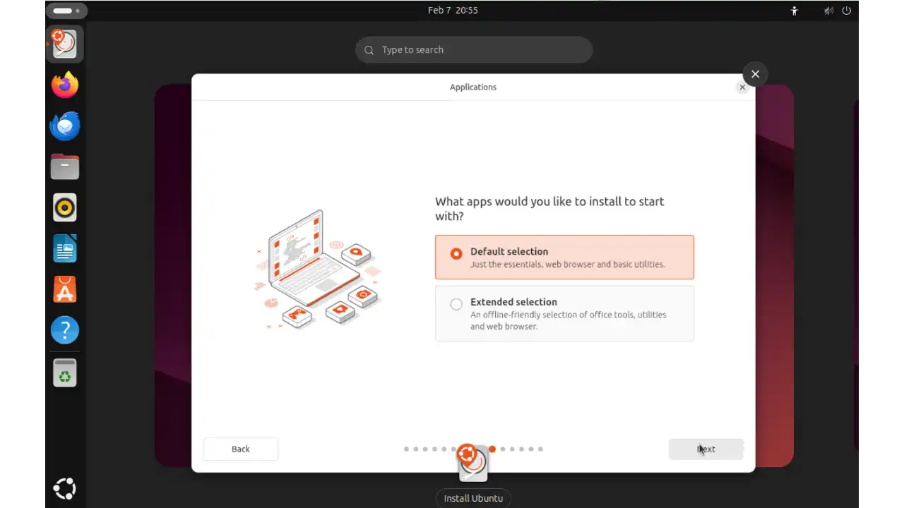

**Drittanbieter-Anwendungen

Entscheiden Sie, ob Sie zusätzliche Treiber und firmeneigene Software installieren wollen oder nicht.

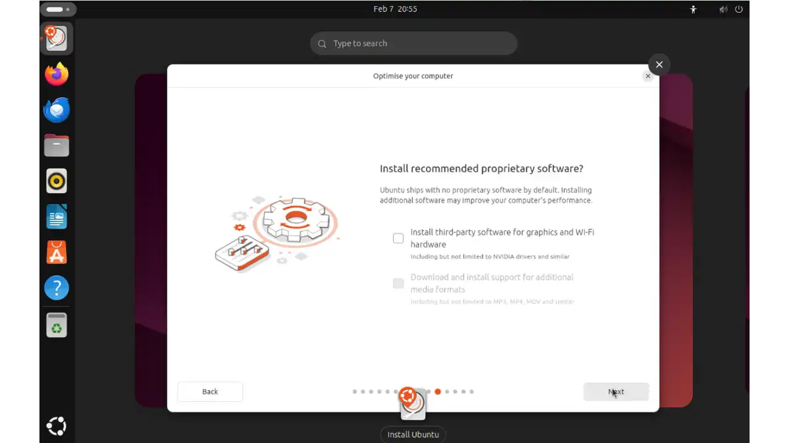

**Typ der Aufteilung

Sie haben zwei Hauptoptionen:


- "Festplatte löschen und Ubuntu installieren": verwendet die gesamte Festplatte für Ubuntu
- "Manuelle Installation: Erstellen Sie ein Dual-Boot mit Windows oder passen Sie Ihre Partitionen an

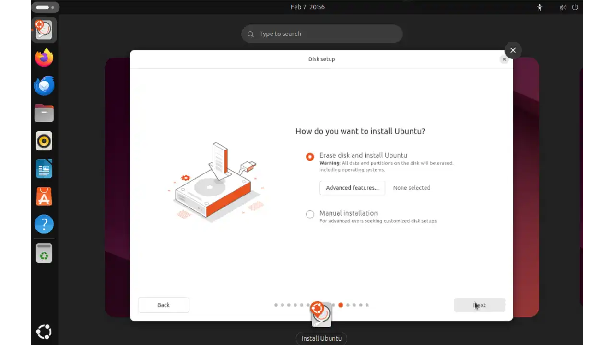

**Erstellung eines Benutzerkontos

Legen Sie Ihren Benutzernamen und Ihr Passwort für Ihr Ubuntu-Konto fest.

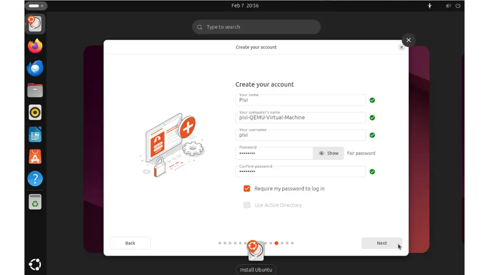

**Zeitzone

Wählen Sie Ihr geografisches Gebiet, um die Systemzeit einzustellen.

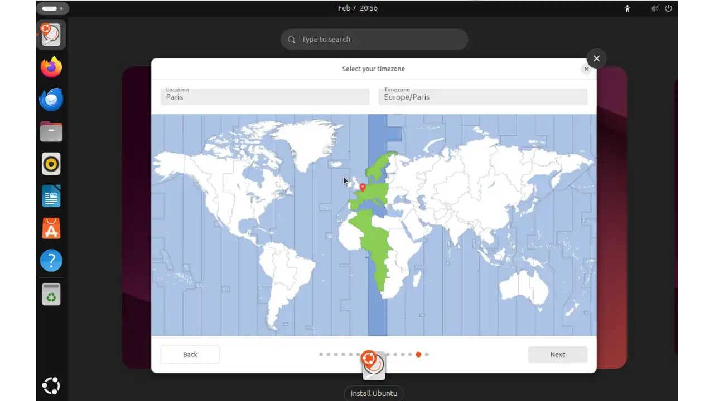

**Zusammenfassung der Installation**

Überprüfen Sie alle Ihre Auswahlen, bevor Sie die endgültige Installation starten. Sobald Sie auf "Installieren" klicken, beginnt der Prozess.

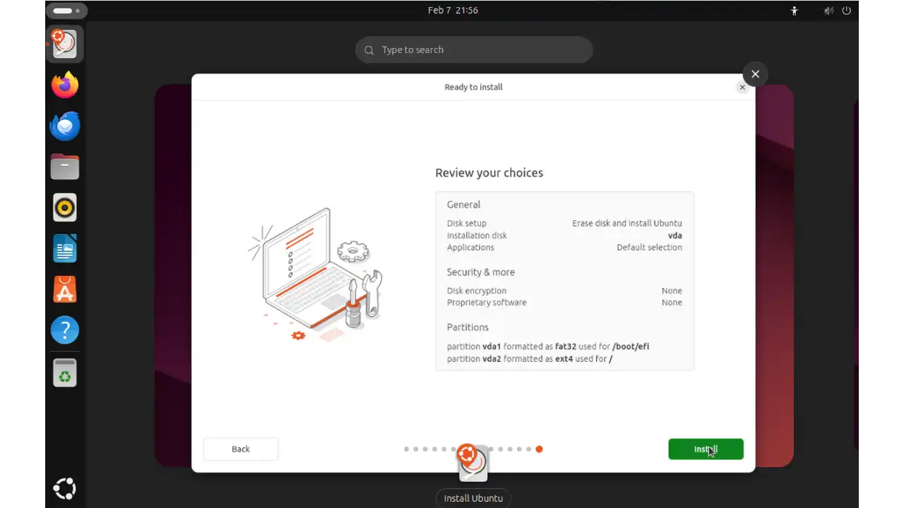

**4.3 Ubuntu nach der Installation aktualisieren** (auf Französisch)

Die Aktualisierung Ihres Systems ist ein wichtiger Schritt nach einer Neuinstallation. Sie haben zwei Möglichkeiten:

**Option 1: Über die grafische Benutzeroberfläche**


- Suchen Sie im Anwendungsmenü nach "Software und Updates"
- Die Anwendung sucht automatisch nach verfügbaren Updates
- Folgen Sie den Anweisungen auf dem Bildschirm, um die Updates zu installieren

**Option 2: Über Terminal


- Terminal öffnen (Strg + Alt + T)
- Geben Sie den folgenden Befehl ein, um nach verfügbaren Updates zu suchen:

```bash
sudo apt update
```


- Geben Sie Ihr Passwort ein, wenn Sie dazu aufgefordert werden
- Um Updates zu installieren, geben Sie ein:

```bash
sudo apt upgrade
```


- Bestätigen Sie die Installation durch Eingabe von 'Y' und Enter

### 5. Entdeckung der grundlegenden Aufgaben

**5.1 Surfen im Internet

Standardmäßig finden Sie Firefox oft in der Startleiste.

Starten Sie Firefox und beginnen Sie zu surfen.

Andere Browser (Chrome, Brave, etc.) können über den Software-Manager oder über .deb-Pakete installiert werden.

**5.2 Textverarbeitung

Ubuntu wird mit der LibreOffice-Suite (Writer für Textverarbeitung) geliefert.

So öffnen Sie es: Aktivitäten > Suchen Sie nach "LibreOffice Writer" oder klicken Sie auf das Symbol, wenn es in der Leiste erscheint.

Sie können Dokumente in einer Vielzahl von Formaten (einschließlich .docx) erstellen, bearbeiten und speichern.

**5.3 Installation von Anwendungen

Software-Manager (genannt "Ubuntu Software"): grafische Oberfläche zum Suchen und Installieren von Anwendungen.

Verwenden Sie im Terminal den Befehl :

```bash
sudo apt install nom-du-paquet
```

Beispiel:

```bash
sudo apt install vlc
```

### 6. Schlussfolgerung und zusätzliche Ressourcen

Jetzt sind Sie bereit, Ubuntu im Alltag zu nutzen: Sichern Sie Ihr System, surfen Sie, erledigen Sie Büroarbeiten, installieren Sie Software und halten Sie Ihr Betriebssystem auf dem neuesten Stand!

Um die Sicherheit Ihres digitalen Lebens noch einen Schritt weiter zu bringen, empfehlen wir Ihnen unseren verschlüsselten Nachrichtendienst, der perfekt zum Schutz Ihrer Privatsphäre geeignet ist und Ihre Ubuntu-Installation ergänzt:

https://planb.network/tutorials/others/proton-mail