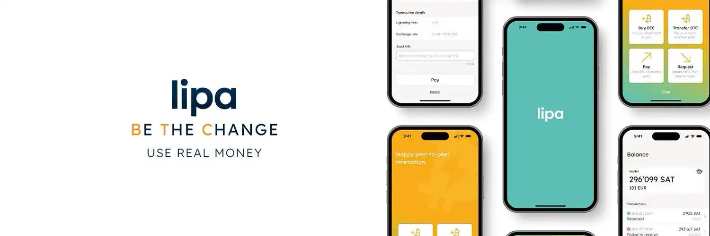

Un portefeuille Bitcoin Lightning est une application mobile permettant d'effectuer des transactions instantanées et à faibles coûts sur le réseau Lightning de Bitcoin. Contrairement aux transactions sur la blockchain principale (on-chain), les paiements Lightning sont quasi-instantanés et ne nécessitent que des frais minimes, ce qui les rend particulièrement adaptés aux petits paiements du quotidien.

Les portefeuilles Lightning, comme tous les portefeuilles mobiles, sont considérés comme des portefeuilles "chauds" car ils sont connectés à Internet. Ils sont donc principalement destinés à la gestion de petits montants pour vos dépenses courantes. Pour des montants plus importants, il est préférable d'utiliser des solutions de stockage plus sécurisées comme les hardware wallets.

Si vous souhaitez approfondir vos connaissances sur le réseau Lightning et comprendre son fonctionnement technique, je vous conseille de suivre ce cours :

https://planb.network/courses/lnp201

Dans ce tutoriel, nous allons découvrir **Lipa**, un portefeuille Lightning simple et efficace développé en Suisse.

## Présentation de Lipa

Lipa est un portefeuille Lightning non-custodial qui se distingue par sa simplicité d'utilisation et son interface épurée. Développé par une équipe suisse, il met l'accent sur la confidentialité et la facilité d'utilisation pour les débutants.

Parmi ses principales caractéristiques :
- Interface utilisateur intuitive
- Gestion autonome des canaux Lightning
- Support du protocole LNURL
- Possibilité d'acheter des bitcoins directement dans l'application

## Installation et configuration de Lipa

La première étape consiste à télécharger l'application Lipa. Pour le moment, elle n'est disponible que sur iOS :
- [Pour Apple](https://apps.apple.com/app/lipa-bitcoin-lightning/id1602180066)

La version Android est actuellement en cours de développement et sera bientôt disponible.

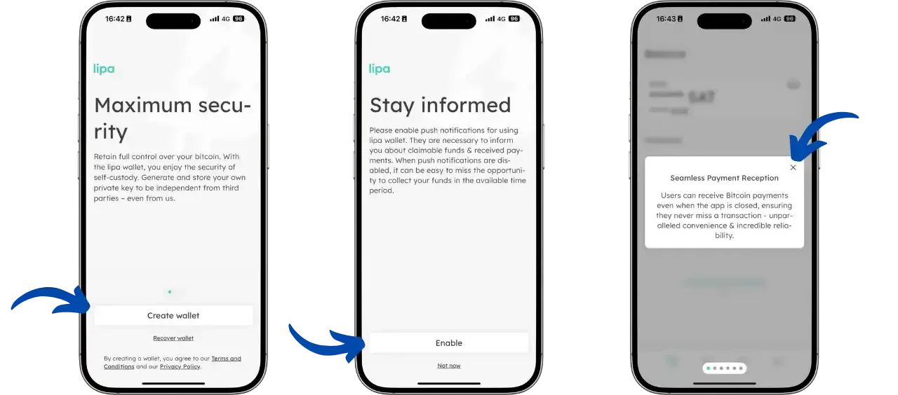

Une fois l'application lancée, vous arriverez sur l'écran d'accueil qui vous propose deux options :
- Créer un nouveau portefeuille
- Restaurer un portefeuille existant à partir d'une sauvegarde

Après avoir choisi votre option, l'application vous invite à activer les notifications. Cette étape est importante car les notifications sont nécessaires pour :
- Recevoir des alertes lors de la réception de paiements, même lorsque l'application est fermée
- Être informé des étapes lors de l'achat de bitcoin via leur solution intégrée

L'application présente ensuite ses principales fonctionnalités à travers une série d'écrans d'introduction :

- **Réception de paiements transparente** : Les utilisateurs peuvent recevoir des paiements Bitcoin même lorsque l'application est fermée, garantissant fiabilité et commodité.

- **Adresses Lightning non-custodiales** : Lipa supporte désormais les adresses Lightning non-custodiales, renforçant la confidentialité et la sécurité en donnant aux utilisateurs un contrôle total sur leurs bitcoins.

- **Contrôle des données analytiques** : La transparence et la confidentialité étant primordiales, les utilisateurs peuvent consulter les types de données collectées et choisir leurs préférences de partage.

- **Envoi via numéro de téléphone** : Plus besoin d'adresses complexes - sélectionnez simplement un contact, entrez le montant, et envoyez des bitcoins directement vers leur numéro de téléphone.

L'application bénéficie également d'améliorations continues en termes de stabilité, de sécurité et de fiabilité pour garantir une expérience utilisateur optimale.

## Navigation dans l'application

L'interface de Lipa est organisée autour de 4 onglets principaux accessibles via la barre de navigation en bas de l'écran :

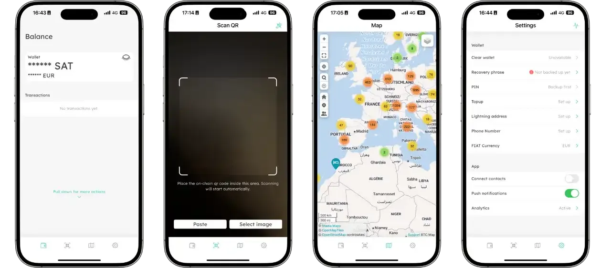

- **Accueil** : Affiche votre solde actuel et l'historique de vos transactions
- **Scanner** : Permet de scanner des QR codes pour effectuer des paiements
- **Carte** : Affiche une carte interactive des commerces acceptant Bitcoin dans votre région
- **Paramètres** : Accès aux réglages de l'application, à la sauvegarde et aux préférences

Un menu supplémentaire est accessible en tirant l'écran d'accueil vers le bas :

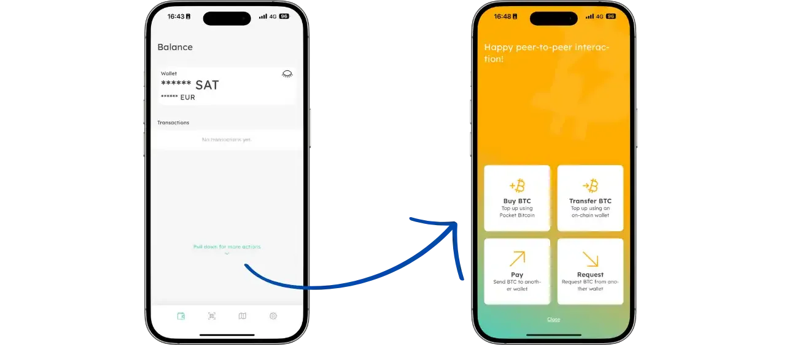

Ce geste révèle des fonctionnalités additionnelles comme :
- L'achat de bitcoins
- Le dépôt de bitcoins on-chain
- La création de factures Lightning pour recevoir des bitcoins
- Le paiement de factures Lightning

## Sauvegarder votre portefeuille

Pour sauvegarder votre portefeuille, rendez-vous dans l'onglet "Paramètres" puis sélectionnez "Recovery phrase". Lipa utilise une phrase de récupération qu'il est essentiel de noter soigneusement sur un support physique (papier, métal). Cette phrase est la seule façon de récupérer vos fonds en cas de perte ou de vol de votre téléphone. Pour valider votre sauvegarde, l'application vous demandera de confirmer 3 mots aléatoires de votre phrase.

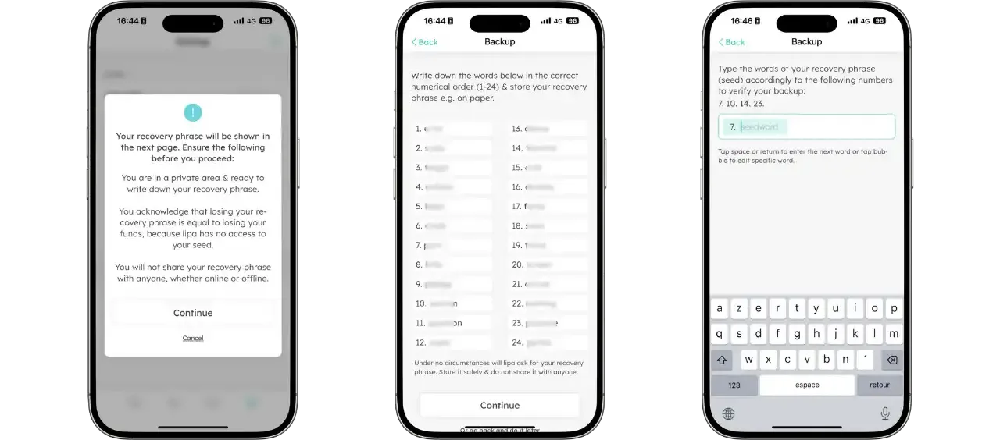

Pour plus d'informations sur la manière adéquate de sauvegarder et de gérer votre phrase de récupération, je vous recommande vivement de suivre cet autre tutoriel, particulièrement si vous êtes débutant :

https://planb.network/tutorials/wallet/backup/backup-mnemonic-22c0ddfa-fb9f-4e3a-96f9-46e2a7954270

## Recevoir des bitcoins

Pour recevoir des bitcoins, vous avez deux choix possibles. Pour accéder à ces options, retournez sur l'écran d'accueil puis tirez l'écran vers le bas. Ensuite, vous pouvez soit :
- Sélectionner "Transfer BTC" pour recevoir des bitcoins on-chain. Ensuite il suffit de scanner le QR code avec votre autre protefeuille et finaliser la transaction.
- Sélectionner "Request" pour recevoir via le réseau Lightning et taper le montant que vous souhaitez recevoir. 

Dans les deux cas, vous devrez payer des frais équivalents à 0,4% du montant ou environ 2500 sats si l'application doit ouvrir un nouveau canal de paiement (ce qui sera forcément le cas pour le premier paiement).

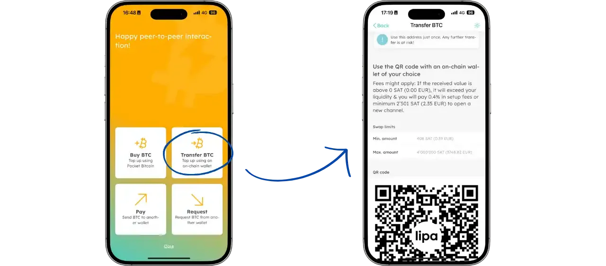

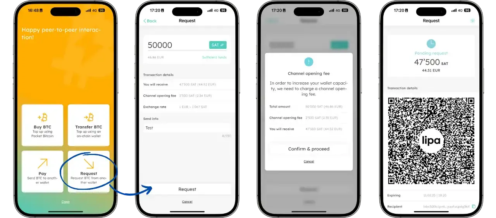

## Envoyer des bitcoins

Pour envoyer des bitcoins, il faut se rendre sur l'écran d'accueil et tirer l'écran vers le bas puis sélectionner "Pay". Ensuite, il vous suffit de soit :
- saisir une adresse lightning LNURL 
- scanner un QR code lightning pour effectuer le paiement. 

Vous pouvez également vous rendre sur le deuxième onglet en bas de l'écran pour scanner directement un QR code.

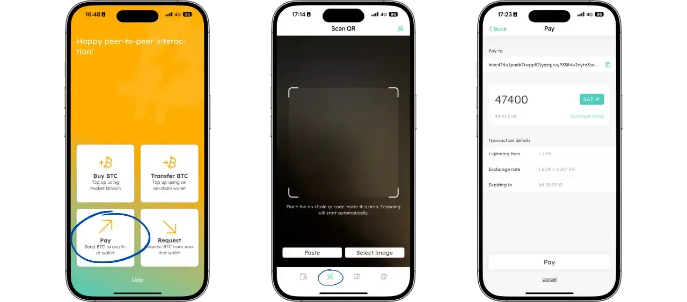

## Acheter des bitcoins

Lipa offre la possibilité d'acheter des bitcoins directement dans l'application moyennant des frais de 1,5%. Pour effectuer un achat, rendez-vous sur l'écran d'accueil et tirez vers le bas pour afficher le menu. Sélectionnez ensuite "Buy BTC". Trois écrans d'introduction vous guideront à travers le processus d'achat.

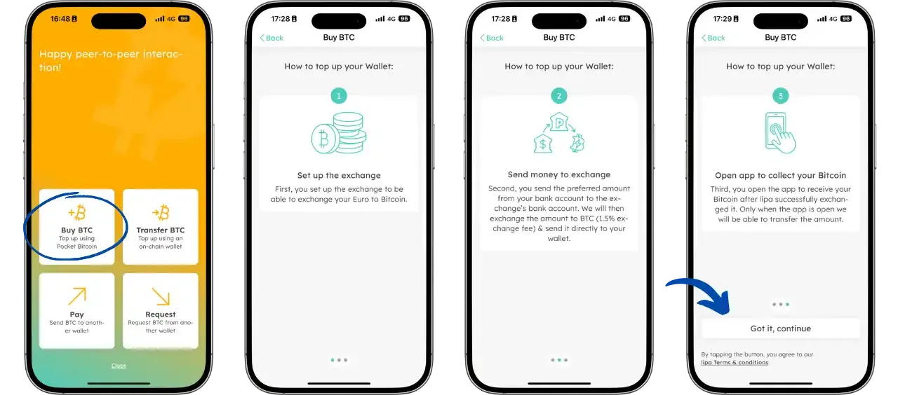

Ensuite, il vous suffit de renseigner votre RIB de votre compte en banque avec lequel vous allez effectuer l'achat. Choisissez votre devise puis indiquez votre adresse mail.

Après l'écran de chargement, vous allez retrouver la référence qu'il faudra mentionner dans le virement que vous allez effectuer ainsi que les coordonnées bancaires de l'échange.

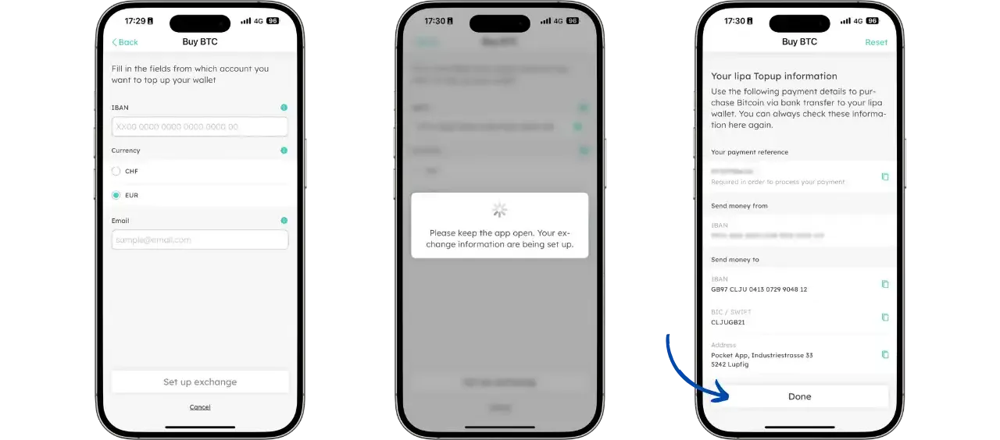

Enfin vous n'avez plus qu'à utiliser votre banque pour effectuer le virement du montant désiré, paramétrer le transfert en indiquant le RIB précédemment récupéré ainsi que d'indiquer la référence au moment de la transaction pour que Lipa puisse associer ce mouvement bancaire à votre wallet Lipa.

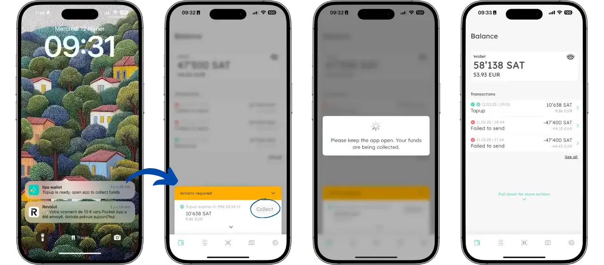

## Avantages et inconvénients

### Avantages
- Interface intuitive
- Frais de service corrects
- Non custodial
- Solution d'achat de bitcoin intégrée
- Intégration de BTCmap
- Support du NFC

### Inconvénients
- Pas possible d'envoyer des bitcoins on chain
- Paiement un peu plus long que la moyenne

Lipa est un excellent choix pour débuter avec le Lightning Network, particulièrement adapté aux utilisateurs recherchant une solution simple pour les paiements quotidiens. Sa facilité d'utilisation et son interface épurée en font un portefeuille idéal pour les débutants, tout en offrant les fonctionnalités essentielles pour une utilisation quotidienne de Lightning.

## Ressources

- [Site officiel de Lipa](https://lipa.swiss/)
- [Support et aide Lipa](https://getlipa.atlassian.net/servicedesk/customer/portal/1)

